# EntroStar Installation Guide

## 1.0 ENTROSTAR PACKAGE CONTENTS

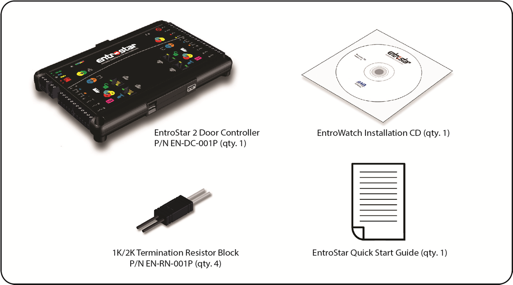

If any of these items are missing, please contact DAQ at 732-981-0050.

## 2.0 TECHNICAL SPECIFICATIONS

## 2.1 HOUSING

Dimensions:
8.15 in. (207 mm) x 5.35 in. (136 mm) x 1 in. (25 mm)
Rating:
UL94 V-0

## 2.2 ELECTRICAL

Supply:
PoE:
12.9W (min) 15.4W (max)
PoE+:
25.5W (min) 34.2W (max)
DC:
14V (+10% / -25%) 50W (max)
Note:
DC input incorporates reverse polarity protection
Power Available for
PoE:
7.2W (min) 9.6W (max) total
External Equipment:
PoE+:
17.7W (min) 26.4W (max) total
DC:
45W (max) total
Note:
Each Output A / Output B pair is limited to 800mA (PoE/PoE+)
and 1.5A (DC)
Note:
Each reader port is limited to 500mA @ 25°C derated to 300mA
@ 70°C
Battery:
Type:
Lead-acid
Voltage:
12V
Capacity:
7Ah (recommended)
Note:
Battery charge times will be extended when using a larger
capacity battery
Note:
Battery connection incorporates reverse polarity protection
Outputs:
Contact Rating:
2A 30V dc

Warning: the EntroStar panel incorporates protective features to avoid equipment damage and/or risk
of fire or electric shock. Do not deviate from wiring procedures listed in this document.

## 2.3 ENVIRONMENTAL

Temperature:
Storage / Operating: -40°C to +70°C
Humidity:
Up to 93% humidity (non-condensing at +40°C)

## 3.0 VISUAL OVERVIEW

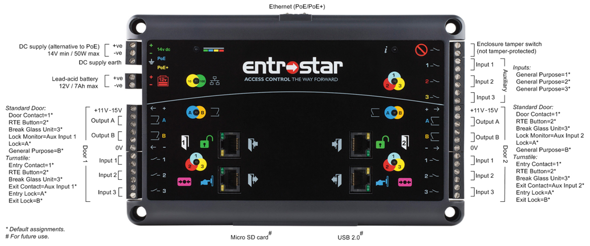

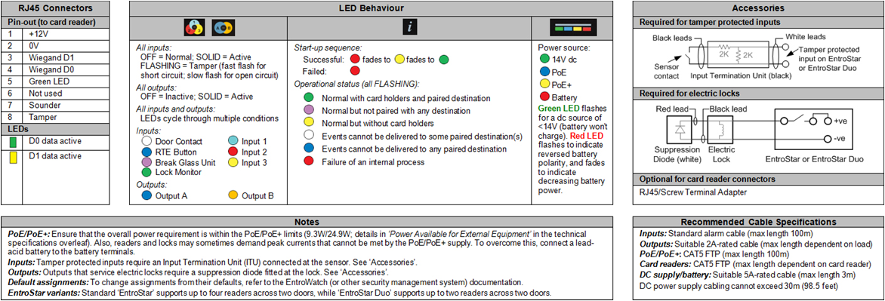

## 4.0 ENTROSTAR INSTALLATION PROCEDURES

## 4.1 SELECTING A LOCATION

Determine a suitable installation location for the EntroStar controller that is secure and provides an
environment with temperature ranging from no less than -40 degrees C and no greater than +70
degrees C with a relative humidity no greater than 93% (non-condensing @ +40 degrees C)

## 4.2 POWER SOURCE

Determine power source:
a. PoE with at least 12.9 Watts available – must meet IEEE802.3af specifications
b. PoE+ with at least 25.5 Watts available – must meet IEEE802.3at specification
c. Local DC supply, reverse polarity protected rated at 14VDC nominal +10%/-25% rated at 40
Watts maximum, power cable length not longer than 30m (98.5 feet)

## 4.3 MOUNTING THE ENTROSTAR CONTROLLER

***Typical installation drawing layouts and complete representative installation wiring diagram(s)***
***for the product indicating recommended locations and wiring methods that shall be in***
***accordance with the National Electrical Code, ANSI/NFPA 70***
Install the EntroStar controller onto a suitable surface using the mounting holes located at each corner
(mounting hardware to be supplied by installer).

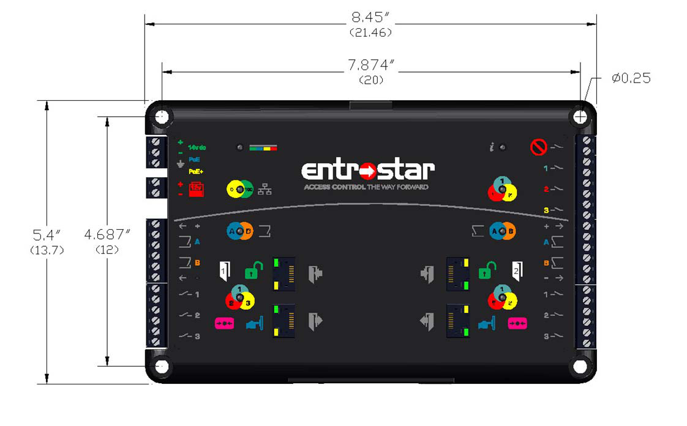

Alternatively, determine the appropriate conduit knockout(s) on the DAQ enclosure and remove. Then
mount the enclosure to a suitable mounting surface using the installer provided hardware. Using the
mounting holes at each corner, mount the EntroStar controller to the appropriate location on the
enclosure backplane.

## 4.4 INSTALLING PERIPHERAL DEVICES

Install Door Readers, Locking Devices, Door Contacts/Position Switch, Request to Exit (REX) Device and
any Auxiliary Supervised Inputs per manufacturer’s instructions.
a. Door Readers are connected to the EntroStar controller via the RJ45 jacks located on the front
of the controller.  Individual Reader Ports are provided for:

DOOR 1:
Entry

DOOR 1:
Exit

DOOR 2:
Entry

DOOR 2:
Exit

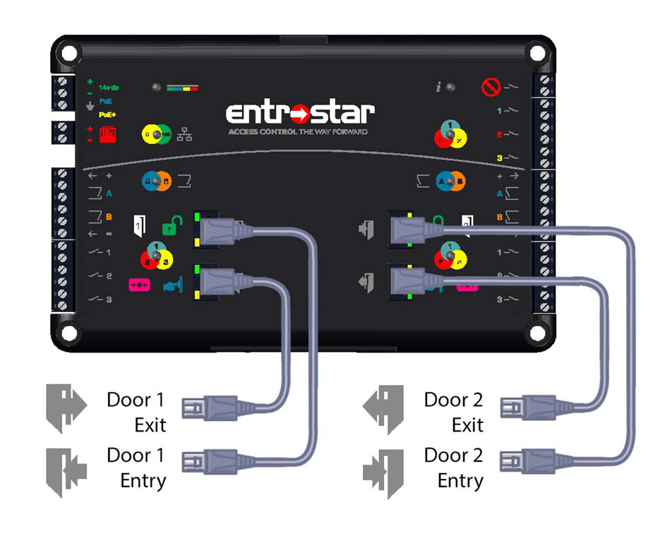

If the distance from the EntroStar controller to the Door Reader(s) is 300 feet or less, standard
CAT5 FTP cable may be used. If the distance is greater than 300 feet and up to 500 feet, 22
AWG multi-conductor cable is required. Maximum load per reader port is 500ma @12VDC.
Please consult the reader manufacturer’s specifications for requirements and perform the
necessary voltage drop calculations to determine actual distance limitations
b. Reader cable conductor terminations for the RJ45 plug are as follows (from left to right):

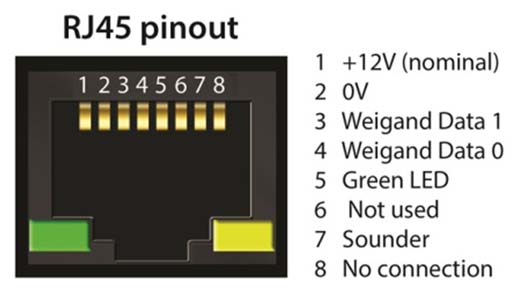

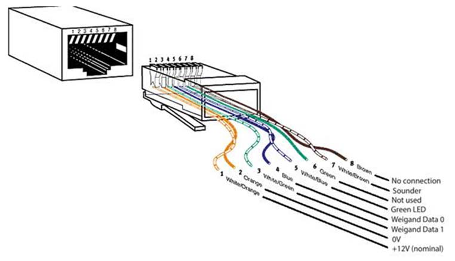

**NOTE:** standard T568A or B acceptable
(B shown for clarity)
c. If you are using a CAT5 FTP cable, terminate conductors per EIA/TIA 568B in installer provided
RJ45 plug.
d. If you are using 22 AWG multi-conductor cabling and you do not wish to splice to an RJ45
terminated piece of CAT5 FTP at the EntroStar controller, you may use a DAQ Terminal Block to
RJ45 adapter (sold separately). Follow the conductor terminations per the RJ45 plug as
outlined above.

## 4.5 TERMINATING SUPERVISED / TAMPER PROTECTED INPUTS

All Supervised/Tamper-protected Inputs must be terminated using either:
a. The supplied 1K/2K Termination resistor block wired with the black leads to the input device
and white leads to the panel

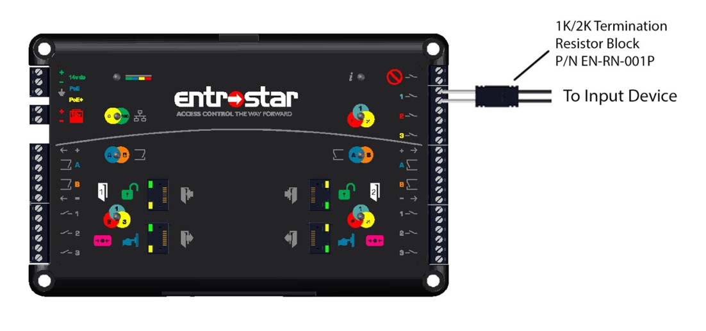

b. Or with 1K Ohm resistors supplied by the installer***.***

## 4.6 OUTPUT RELAYS

Output Relays are rated at 2A up to 30VDC (max continuous current) and have a switching capacity of
60W with a maximum voltage of 60VDC.

## 4.7 POWERING THE CONTROLLER

## 4.7.1 POE / POE+

If using PoE or PoE+, the distance from the PoE/PoE+ source (switch or injector) must not exceed 100m
unless otherwise stated by the power source manufacturer. The EntroStar controller automatically
detects the power source and displays the type of source via the colored LED located on the upper left-
hand side of the controller

Power LED colors indicate the following:
a. GREEN:
Local 14VDC
b. BLUE:
PoE
c. YELLOW:
PoE+
d. RED:
Battery

RED color fades as battery weakens

FLASHING RED indicates reversed polarity
**NOTE:**   PoE+ (IEEE802.3at) has the ability to power the EntroStar controller, charge the local battery
back-up if used, and provide power to all peripherals including door locking devices. The
maximum output current draw for all devices in concurrent operation cannot exceed 1.9A

## 4.7.2 LOCAL DC

If using a local DC power source, you must use a reverse polarity protected source rated at 10-15VDC
+10%/-25% @40 Watts and a cable length of no more than 30m (98.5 feet)
a. Connect to the appropriate input terminals located on the upper left-hand side of the
controller per labelled terminal block on the EntroStar controller.

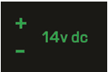

b. Connect GROUND terminal to local supply ground source.

## 4.7.3 LOCAL BATTERY BACK-UP

If providing a local battery back-up, you must provide a 12VDC 7ah (maximum) rated lead-acid battery
with reverse polarity protection.
a.  Connect the battery to the appropriate +/- terminals, as indicated by the 12VDC battery icon
located on the left-hand side of the EntroStar controller.

## 4.8 CONNECTING TO A NETWORK

With all connections made and properly terminated, connect the EntroStar controller to your network
via the RJ46 jack located at the top-center of the EntroStar controller.

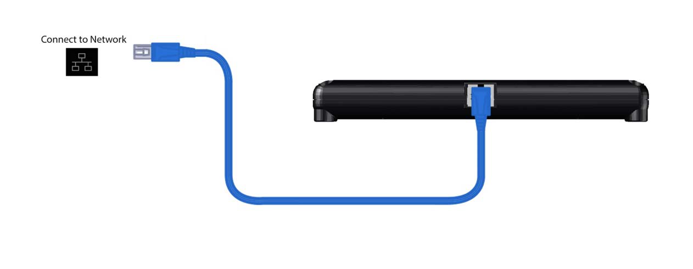

## 4.9 VERIFY TERMINATIONS / COMMUNICATION / TROUBLESHOOTING

Using the diagnostic LEDs, verify that all terminations have been correctly made and the controller is
communicating on the network:
a. The EntroStar system information icon LED should immediately light up and change color as
follows:

SOLID RED fades to SOLID YELLOW fades to SOLID GREEN

If LED remains SOLID RED, the unit has failed to initialize. Verify all connections including
any RJ45 terminations and retry.

b. Verify POWER LED is SOLID GREEN, SOLID BLUE, or SOLID YELLOW. If a local battery is being
used, the LED should be SOLID RED which will fade as the battery weakens. If the RED LED is
FLASHING, the polarity of the battery has been reversed.
c. Verify that the network communications LED is GREEN. This is located below the POWER LED.

d. Verify all inputs, outputs, and readers

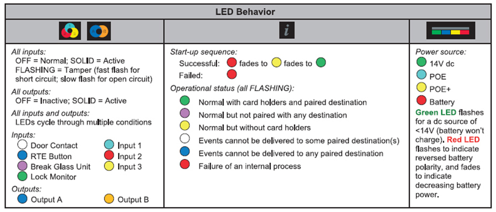

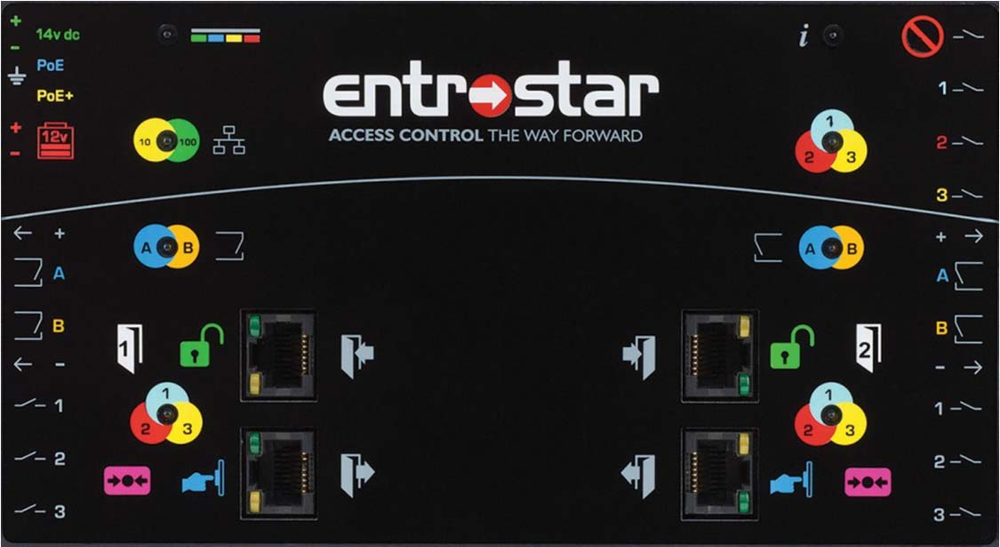

---

*© DAQ Electronics, LLC*
