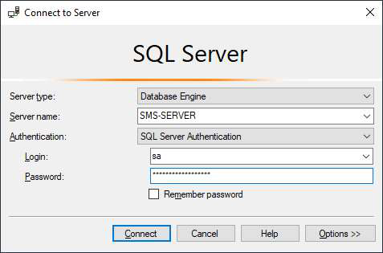
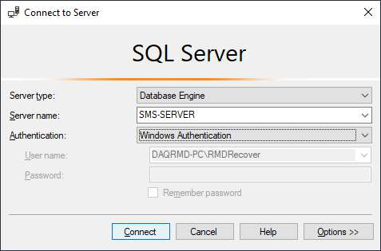
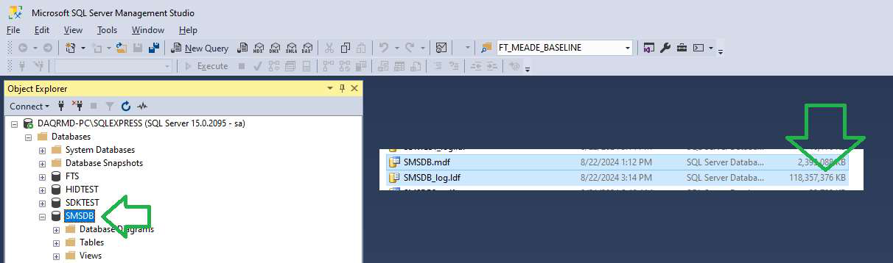
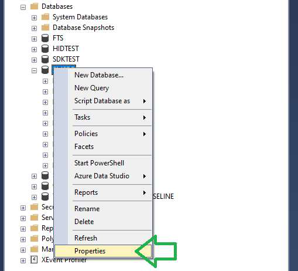
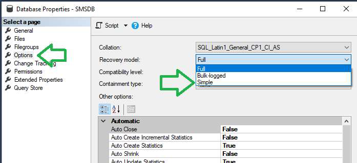
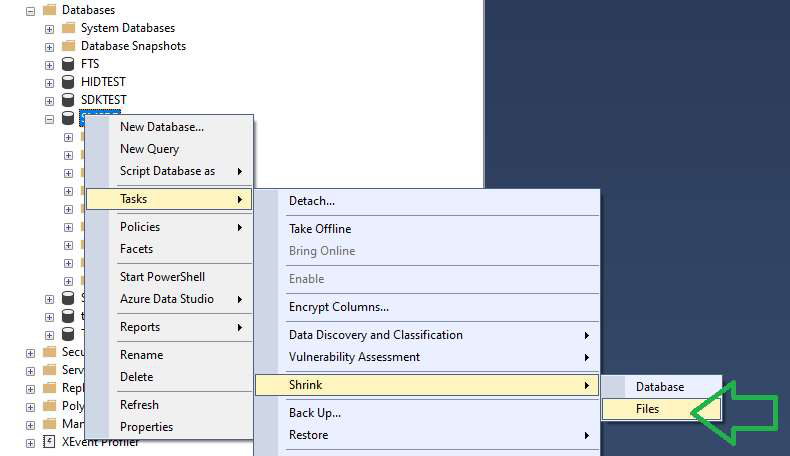
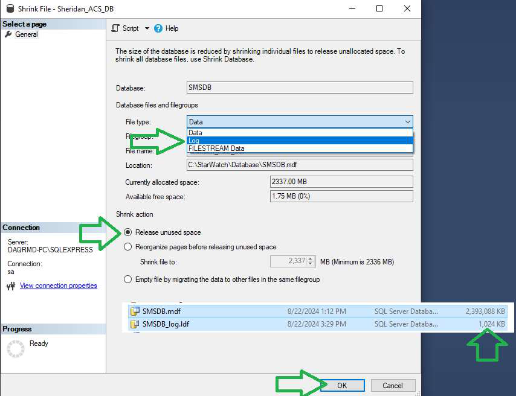
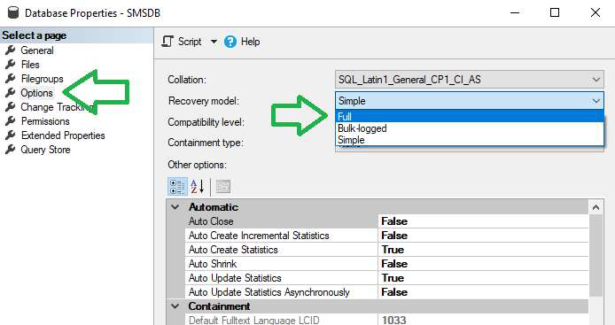

# How To Shrink SQL Database Log Files

## Introduction

This document explains how to shrink the database log file on a SQL Server database.

You will need SQL Management Studio.

## Step 1

Open SQL Management Studio, login and find your database.

Or login as Windows authentication.

Find the database.

Here we can see we have a database called SMSDB and it has a 118GB log file that must be released back as disk
space.

## Step 2

Change database to “SIMPLE”.

## Step 3

Release log space.

Make sure that “File type” is changed from “Data” to “Log” (don’t shrink the database otherwise it will run more
slowly.)

Select the “Log” file type.

Make sure the “Release unused space” option is selected.

Click on “OK”.

The log file will be reduced to 1MB.

## Step 4

Restore the database to “FULL”.

---

*© DAQ Electronics, LLC*
