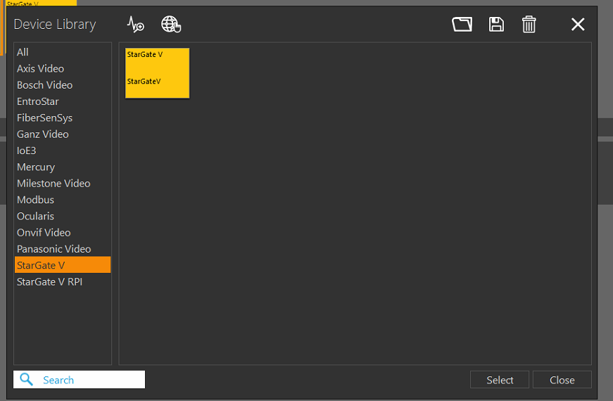
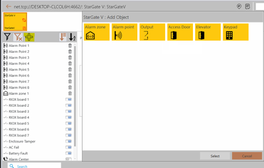
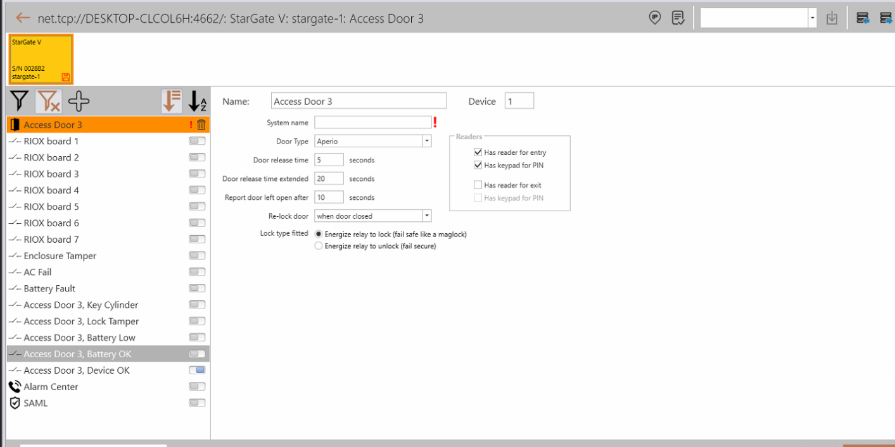
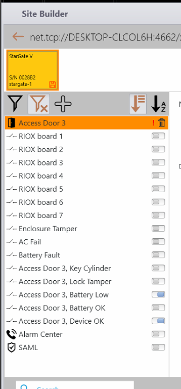
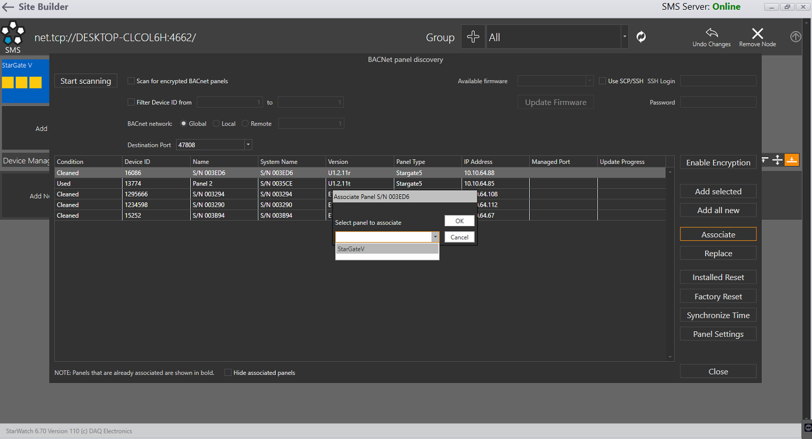
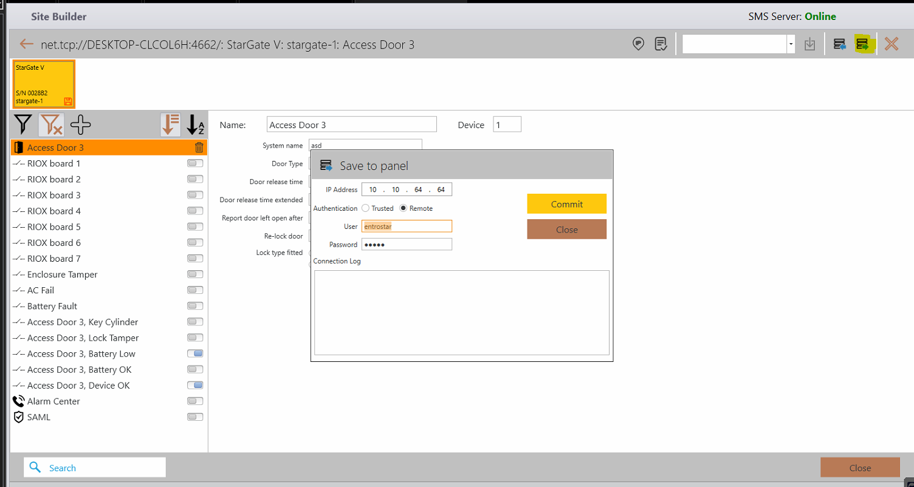

# How to Configure Aperio with StarGate-5

This quick guide explains how to integrate an Aperio wireless lock system with a StarGate-5 / MACH-Sentry panel in StarWatch SMS.

## Step 1 — Add the StarGate-5 / MACH-Sentry

To begin, add a *StarGate-5 / MACH-Sentry* from the *Device Library* window.

## Step 2 — Add an Access Door

In the *StarGate-5* configuration, click the plus  sign and add an *Access Door*.

## Step 3 — Set the Access Door properties

After adding the door, highlight it in the tree on the left side of the screen and enter the properties for the door.

The *Device Number* is based on the setup of the Aperio system. *Device Numbers* should be configured as:

| HUB NUMBER | DOOR NUMBER | DEVICE NUMBER |
| ---------- | ----------- | ------------- |
| 1          | 1           | 1             |
| 1          | 2           | 17            |
| 1          | 3           | 33            |
| 1          | 4           | 49            |
| 2          | 1           | 2             |
| 2          | 2           | 18            |
| 2          | 3           | 34            |
| 2          | 4           | 50            |
| 3          | 1           | 3             |
| 3          | 2           | 19            |
| 3          | 3           | 35            |
| 3          | 4           | 51            |

## Step 4 — Enable Diagnostic Points

Enable any of the *Diagnostic Points* that will be needed. It is recommended to monitor the *Battery Low* and the *Device OK* points, at a minimum.

## Step 5 — Associate with the installed panel

Use the *Discovery* tool to associate the configuration with an installed panel.

## Step 6 — Download the configuration

The configuration must be downloaded to the *StarGate-5* from the *StarGate-5* configuration screen using the right-arrow  button in the top right of the screen. The default user and password are:

- Username: *entrostar*
- Password: *3ntro*

## Step 7 — Bring the panel online

Update the database as usual and bring the *StarGate-5* online via the *Operator* interface.

---

*© DAQ Electronics, LLC*
