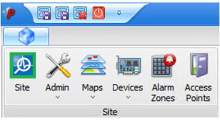
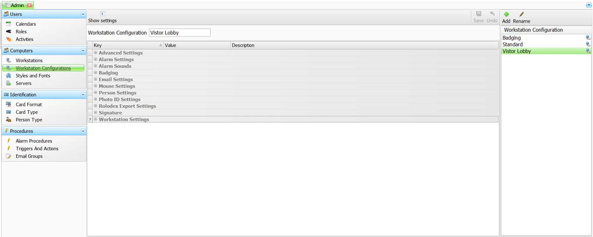
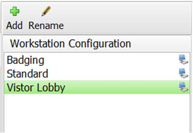
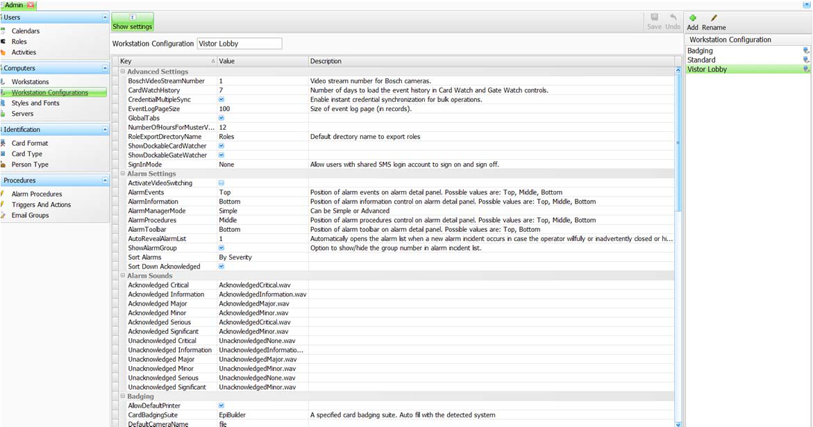
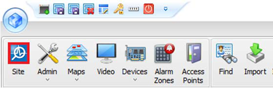

# How to Configure a Workstation for Video

On a new *StarWatch SMS* system, you will need to configure which workstations will be using video.
Depending upon what was included in your purchase agreement, your license will only allow a certain
number of workstations to run video simultaneously.
1. To configure a workstation for video, click on the *Admin* button at the top left of your screen.

This will call up the *Admin* area:

2. In the *Admin* area, go to the *Workstation Configuration* pane on the right side of the main screen
and select the workstation configuration to which you would like to assign video capability.

3. In the central *Workstation Configuration* area, click on the
icon to expand the displayed
settings. This allows you to modify and assign any parameters required.

4. Scroll down to the *Workstation Settings* group and click the *Video Workstation* checkbox.
5. Be sure to click the *Save* button at the top of the window.
6. Log out of *StarWatch SMS* and then log back in. The workstation should now be video enabled, and a
*Video* button will be displayed at the top of the screen:

---

*© DAQ Electronics, LLC*
