# How to Configure an eRADC for StarWatch SMS

This document is a quick overview of how to configure an *eRADC* with *StarWatch SMS*. The *eRADC* is a
new version of the *StarGate III* board that can be connected to 10/100 BaseT Ethernet switches using
RJ45 Cat 5 or better cables (note that older Ethernet hubs are not recommended).

## CallistoView Configuration

For simplicity, any existing CVD file configuration can be used, and all that is required is to check the
*Use Ethernet* option provided in the *IP Settings* area of the *Server Configuration* tab.

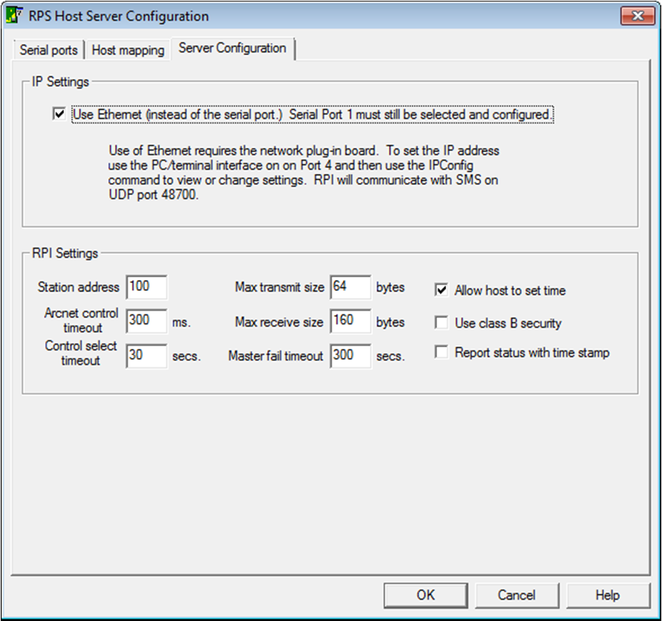

IMPORTANT: the configuration of the *StarGate III* must be identical in every way, as if it were
configured for serial communications. This is explained in the dialog box shown above in the RPI
configuration from within *CallistoView*.
CONVENIENT: the check box can be unchecked, and the configuration will go back to working again as
Serial. Check the option again and it is back on the network.

## StarGate III Configuration

Terminal
To configure the network settings for the IP connection requires using a local terminal interface to the
*Stargate III* using Port 4 (as usual). Using any terminal program on a PC (including *CalTerm*) set the
baud rate as normal to 9600 baud, 8 bit, 1 stop, no parity.
Check that you have a connection (hitting the *ENTER* key will generate a prompt as “>”).
Also, typing the “ver” command should produce the following version string and that is the required
firmware.

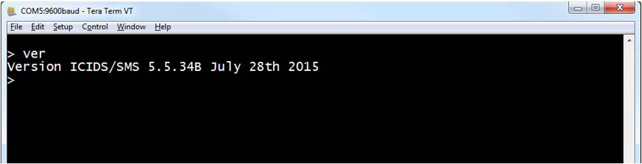

Ipconfig command
Typing the command “ipconfig” will guide you through a sequence of steps showing the current settings
and an opportunity to modify the value as needed.

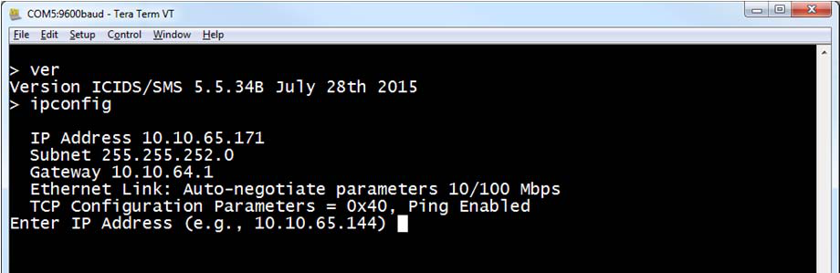

In the example, the IP address is changed, and the message at the end means you must reboot to start
the new settings.

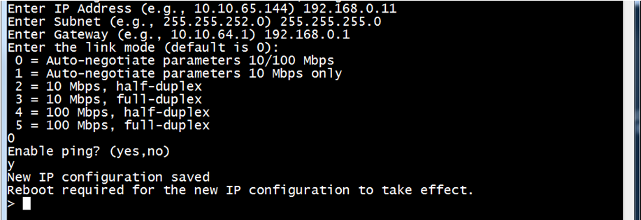

Use the “reboot” command or simply power off or reset the *Stargate III* board.

## SMS Setup

PC Hardware Requirements
To setup *StarWatch SMS* requires that you have a PC that is capable of running *StarWatch SMS* as
follows or one that already has *StarWatch SMS* installed and working.
Windows 7 Professional 64-bit or later (Pro) at SP3

## Or

## Windows Server 2008 R2

Minimum 4GB RAM (6GB recommended)
Minimum Intel Core i5 (3rd Gen Ivy Bridge 2012) ideally (4th Gen Haswell recommended)
Hard drive 256GB minimum hard drive SATA or RAID 7200RPM minimum (SSD recommended)
NIC 1000BASE-T LAN connection and 10/100/1000 Base T switch

## Ethernet CAT 5e cable or better

## Redistributables

Installing *StarWatch SMS* may require some redistributable components that need to be copied to the
local hard drive into a setup folder or copied to a DVD or USB drive.
A copy of these files can be downloaded as follows:
https://drive.google.com/file/d/0B5A-7yjNiW8hdi1iaWZKZTVRZTg/view?usp=sharing
To create full *StarWatch SMS* setup media requires the MSI file and a sub-folder called “Redists” with
the contents of the zip file extracted as shown below:

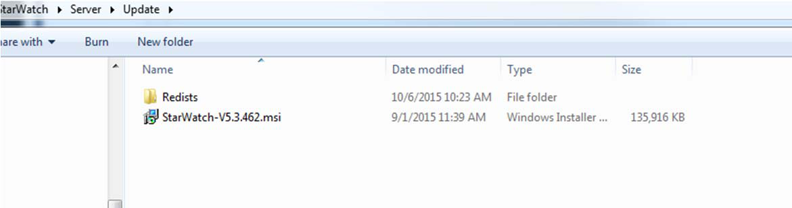

Note that any version of the MSI file works this way requiring that all the redistributable components
contents are in a folder called “Redists”.
The redistributable components are required for SQL server and other components but often are not
required, especially when updating an existing system only.

## Site Planner Configuration

## Open Configuration

After installing *StarWatch SMS*, you can use *Site Planner* to configure the eRADC panels.
Load the configuration from the database as usual by clicking on “Load From”.

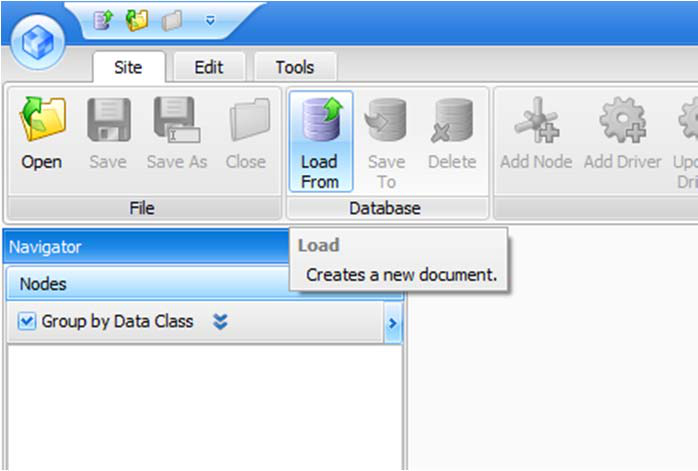

Here is a typical setup with four PMUXs and stations:

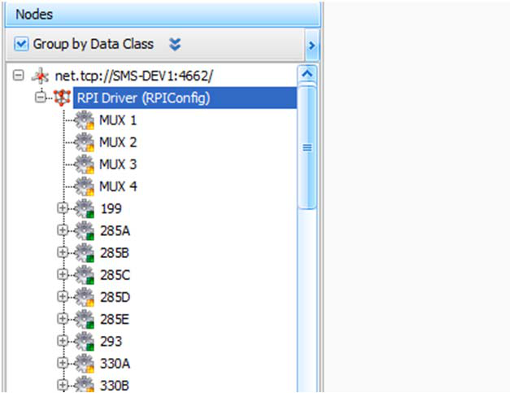

## Open RPI Editor

Double-click on one of the panels or the driver configuration node.

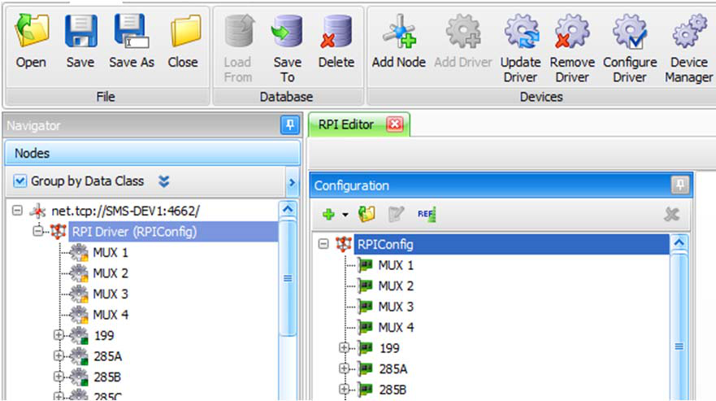

Next, select one of the stations and the grid will show a list of all the stations and the details of the
currently selected station.

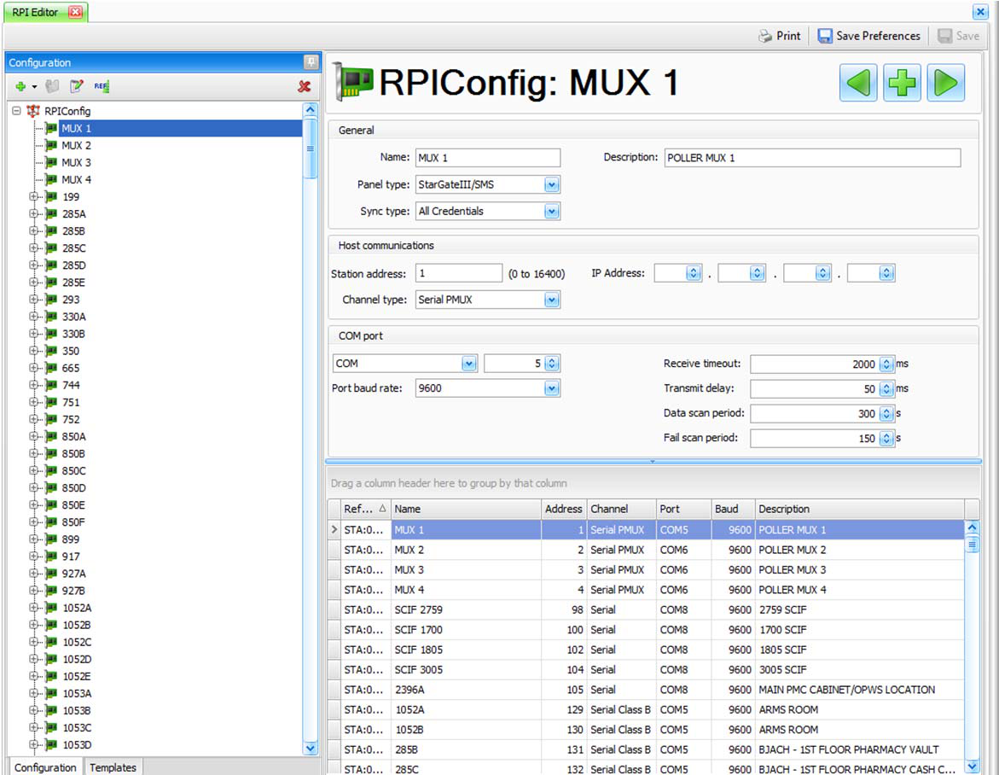

IMPORTANT: to move a PMUX remote station to IP requires no change to the station address. For
example, if we want to change “1052A“ from working on the PMUX to working IP, we first select that
station and then change the channel type to UDP, as shown.

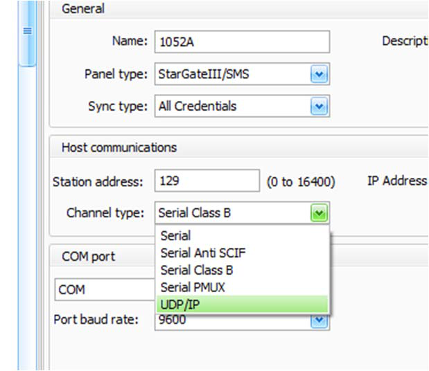

Next, put in a valid IP address for the remote.

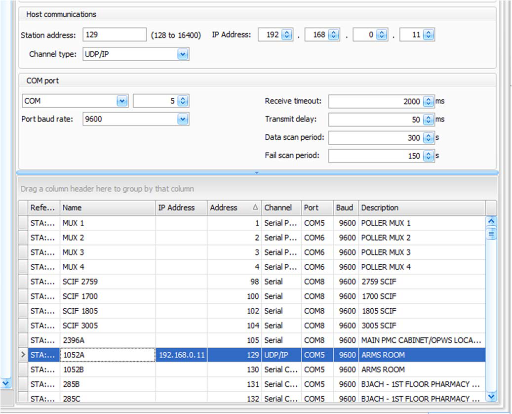

Note that we added a column to the grid to show the IP Address (simply right-click on any column
header to add or remove columns).  Also note that this grid can be exported to *Excel* or printed as
needed using the “Print” button.
CONVENIENT: you can change the channel type back and forth between UDP and Serial as needed and
the system will look for the RTU on the network or on the PMUX when required.
IMPORTANT: the addressing scheme for UDP is exactly the same in RPI as for PMUX addressing. So, for
station address 129 in *StarWatch SMS* you must configure the remote station address to be 1, for 130 in
*StarWatch SMS*, 2 in the remote configuration, and so on. This works for other ranges too, from 257-
264, 385-392 typically when used in banks of eight addresses. Addressing, of course, can use banks of
16 addresses as if it were 16 channel PMUXs.
In *StarWatch SMS* station addresses, 1-126 are used for PMUX cards, SCIFs, and directly attached serial
port remotes (no PMUX).
If you try to set a station that is UDP lower than 128, it will complain:

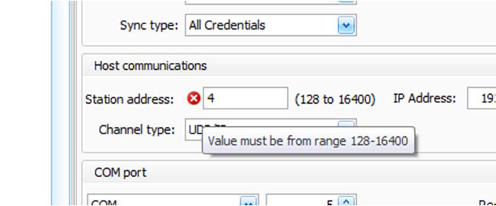

## Monitoring

MCU
The MCU program now has some advanced features and shows the full station address (so you can
determine the real station as IP addresses are not shown).
The UDP tab shows the stations that are connected and working over IP.

---

*© DAQ Electronics, LLC*
