# How to Configure StarWatch SMS for LDAP Authentication

## Introduction

The *StarWatch SMS* suite allows for the use of LDAP communication to store and extract objects such as
usernames and passwords in/from Active Directory. This object data can then be shared throughout the
network. This framework enables enriched development and distribution of identity control, security,
and web applications.
Integration of this framework within *StarWatch SMS* involves several parameters set during installation
and then subsequent modifications made within the system *Administration* panel, as outlined in this
document.

## Installation Settings

During the initial *StarWatch SMS* software installation process, the *SMS LDAP Server* must be directly
selected for installation on your local hard drive.
1. As you progress through the series of options screens provided by the installation wizard, you
will eventually arrive at the *Specific Setup* screen. In the features window, click on the *Server*
drop-down menu icon
.

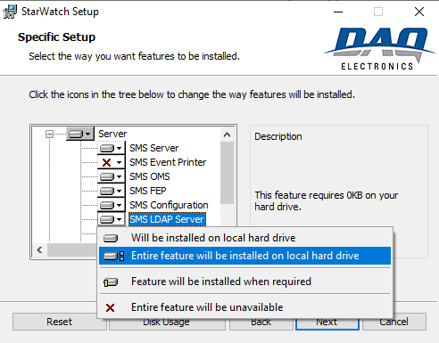

2. From the *Server* options, select the menu icon
for *SMS LDAP Server*.
3. Next, select the *Entire feature will be installed on local hard drive* option.
4. No other changes need to be made related to LDAP communication. Once this feature has been
selected and you have made any other required changes on the *Specific Setup* screen, click the
*Next* button.
5. Continue through the remaining options screens to complete *StarWatch SMS* setup/installation.

## Updating the Administration Panel

After *StarWatch SMS* has been fully installed, the *Administration* panel must be modified to enable the
importing of groups and roles from LDAP.
1. After launching the *StarWatch SMS* application, open the *Administration* panel by clicking the
*Admin* icon on the top menu ribbon.

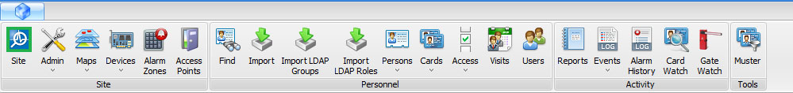

2. Next, select the *Roles* tab from the *Admin* side menu.

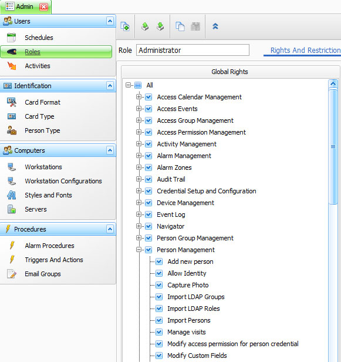

3. In the *Global Rights* window, click on the *Person Management* drop-down menu icon
.

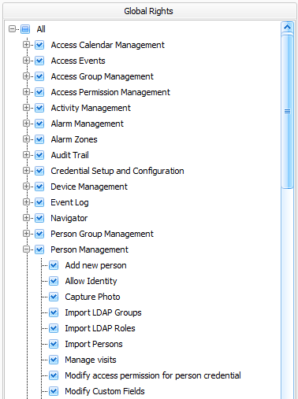

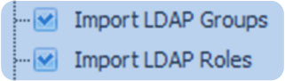

4. Next, from the *Person Management* list, enable both the *Import LDAP Groups* and *Import LDAP*
*Roles* options. The top menu ribbon will change to include the *Import LDAP Groups* and *Import*
*LDAP Roles* icons in the *Personnel* area.

To proceed with importing a group from the *LDAP Server*, complete the following steps.
1. Launch the *Import Person Group* dialog box by clicking the *Import LDAP Groups* icon.

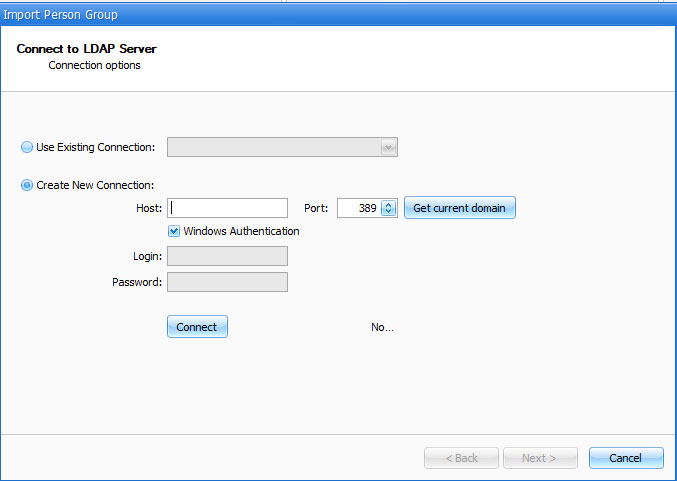

Several options for connecting to the *LDAP Server* are provided.
2. In the *Host* field, enter the IP address for the *SMS LDAP Server*.
3. Be sure that the *Windows Authentication* option has been enabled.
4. Click the *Connect* button.
5. Click the *Next* button at the bottom of the screen to call up the *Create New Person Group*
area.

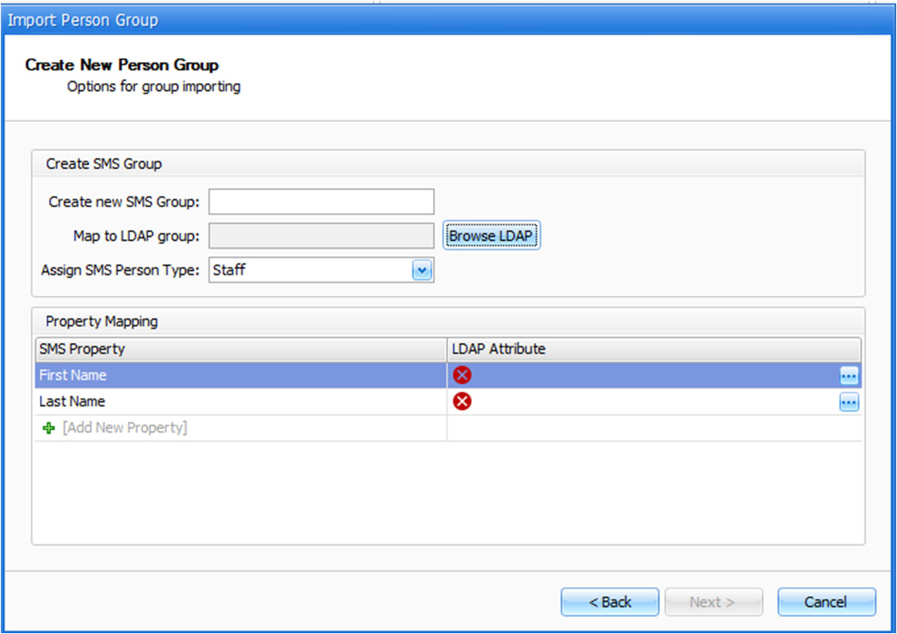

Here you can create new *Person* groups in *StarWatch SMS* and associate them with groups
created in the domain controller/server.
6. In the *Create new SMS Group* field, assign a name for the group.
7. Next, assign a *Person Type* to the group using the provided drop-down menu.
8. Click on the *Browse LDAP* button. The *LDAP Group Browser* window will appear.

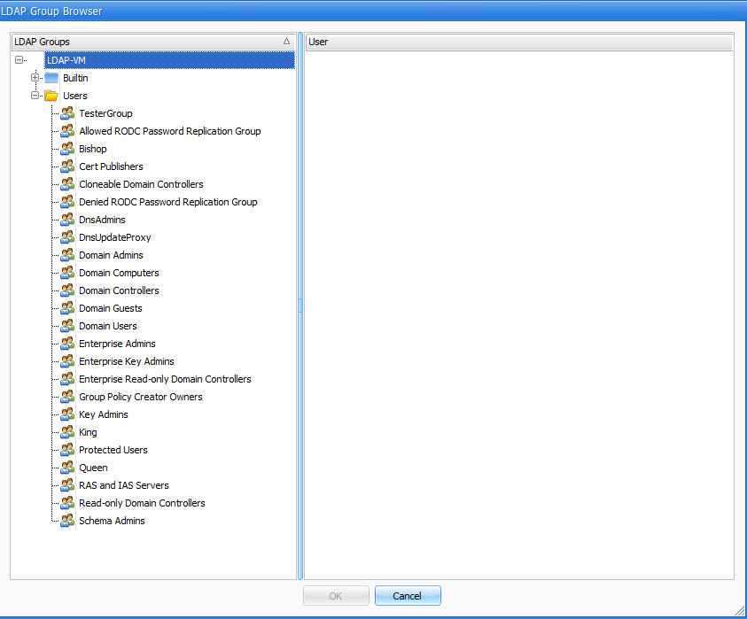

9. From the *LDAP Groups* list, select the groups that you want to import and click the *OK* button.

Back in the *Create New Person Group* area, the system must be set to import the desired
strings from LDAP using the *Property Mapping* fields.

10. In the *First Name* field, click on the small icon

to the right of the *LDAP Attribute* section
and set the string to *Given Name*.

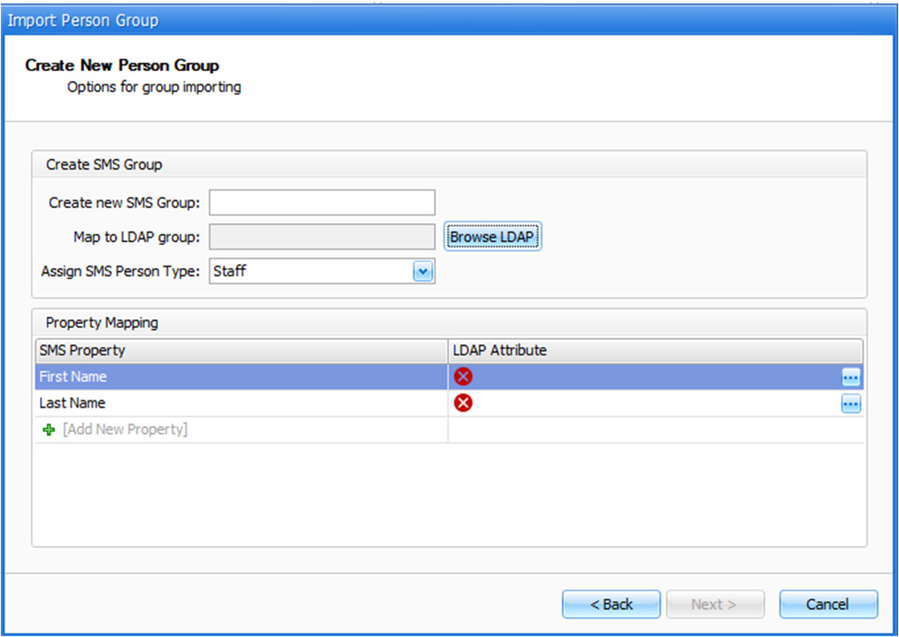

11. Repeat this action in the *Last Name* field and set the string to *Surname*.

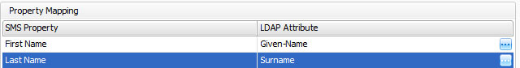

These are the only mandatory properties for importation into *StarWatch SMS*. You can add
other properties to import as needed.
12. Click the *Next* button. The newly created *Person Group* will be imported. Access rights can be
assigned to the new group using normal *StarWatch SMS* functionality.

## Settings in Management Console

In *Management Console*, settings for LDAP configuration can be found by clicking on *SMS LDAP Server* in
the *Service* list and then clicking the *Settings* button in the top right.

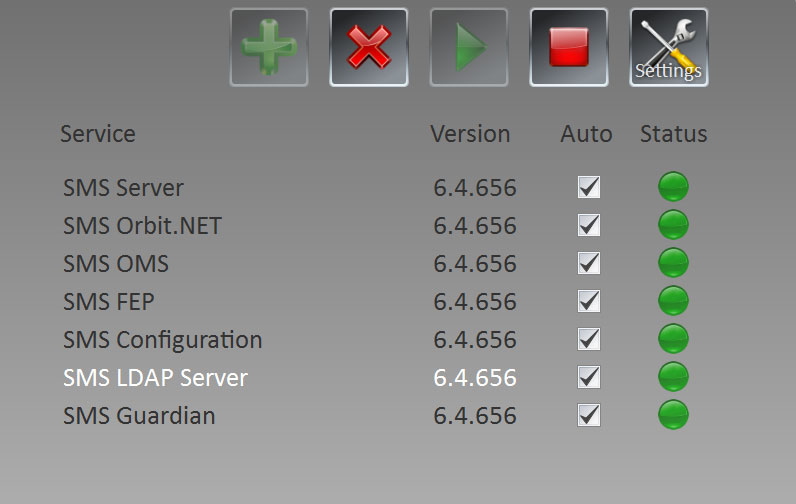

## Workgroup settings

Auto retire removed – if checked, removing a person from a group in the domain will retire a
•
person in *StarWatch SMS*.
Auto restore added – if checked, adding a role back to a person in LDAP will unretire them.
•

## Login access settings

Enables/disables user login to *StarWatch SMS* if that person belongs to a certain group on LDAP.
•

## Card access settings

Enables/disables person cards in the event they are removed or moved from an LDAP group.
•

---

*© DAQ Electronics, LLC*
