# How to Create, Print, and Export Reports

Step 1 – The first step in the creation of a new report is to add a new search by clicking the “plus”
button at the top of the *Events* tab.

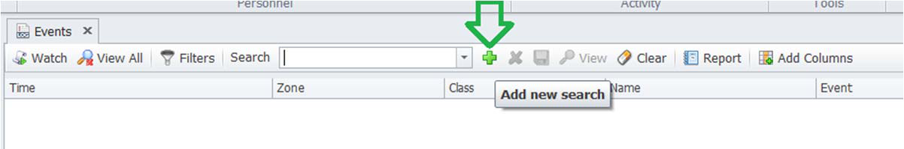

### Step 2 – Next, click on *Filter*s to call up a list of search options.

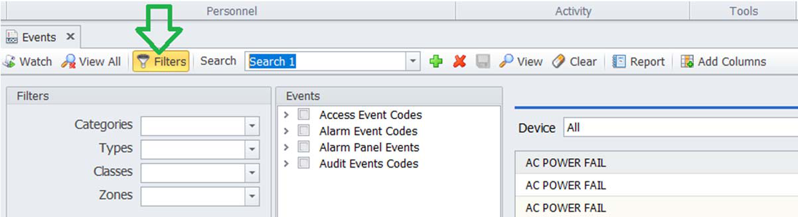

Step 3 – Select the filters you would like to apply. In the example below, the *Audit* option has been
selected from the *Types* field.

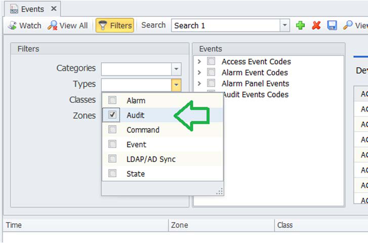

Step 4 – In the *Events* pane, select the types of events you would like to include in your report. In the
example below, all of the sub-categories under *Operator attendance* have been selected.

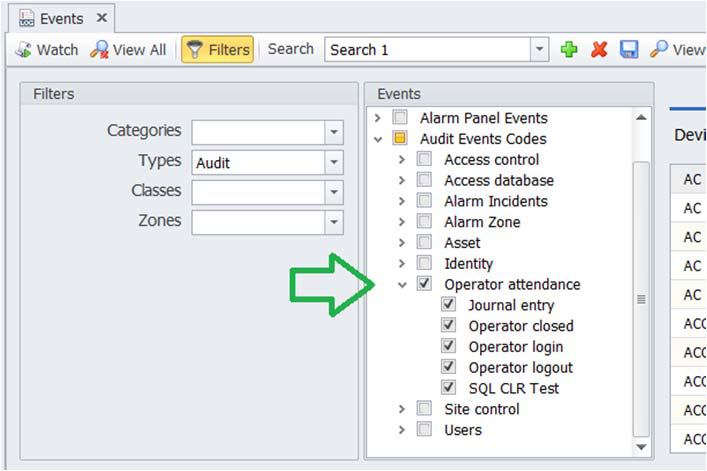

### Step 5 – Next, click the *View* button.

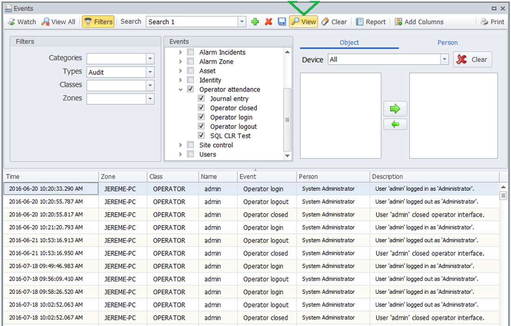

### Step 6 – Rename your search and *Save* it for future use.

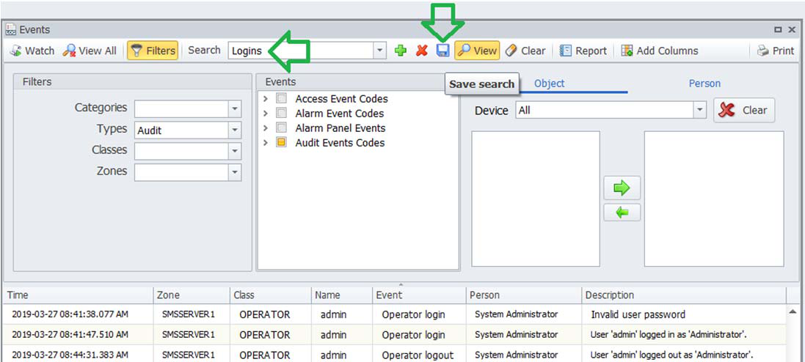

### Step 7 – Make your report by selecting it from your saved searches list.

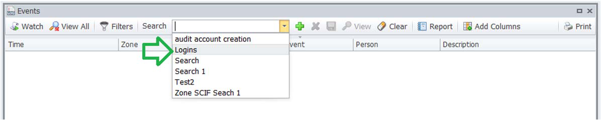

### Step 8 – Next, click *Report*.

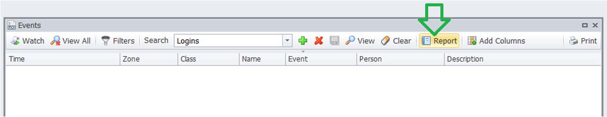

### Step 9 – Specify a time range and click *Run report*.

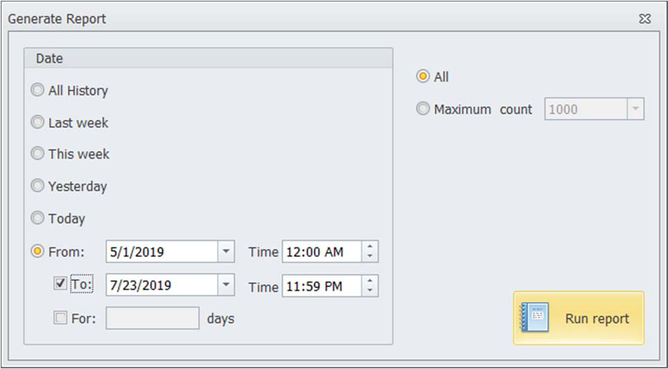

### Step 10 – Review the report and *Print* or *Export*.

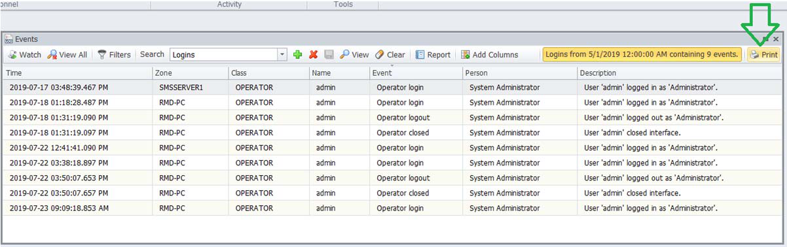

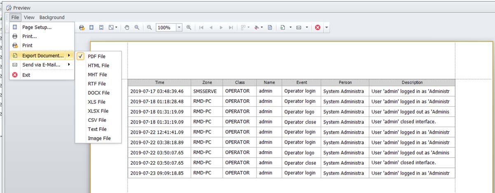

---

*© DAQ Electronics, LLC*
