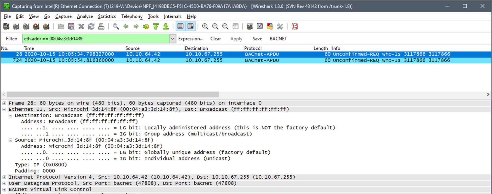
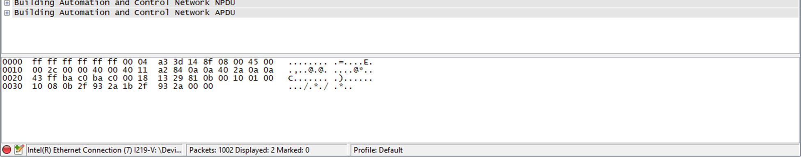

# How to Discover an EntroStar Using Its Mac Address

Using the discovery capabilities within *StarWatch SMS*, installed EntroStar panels can be automatically
found and recognized by the system. This can be accomplished using either the network tools within
the *Site Planner* application or via the BACnet browser.
If you experience trouble getting the panel to be recognized, there are several options to try before
sending in for repair. If your EntroStar is running on any 1.4.x version, you can try resetting the panel
via the USB port feature. You will need a DAQ-provided USB drive that is formatted for FAT32 and has a
file called "entrostar.cmd" on it containing a single line of text "factory,reset".
Alternately, a good way to find a panel in Wireshark is to set up a Mac address filter for the panel and
power it on to see what network traffic or IP state it is in.

The screenshot below shows a way to filter and capture a single EntroStar using its Mac address. Note
that the Mac address filter requires the first three parts to be "00:04:a3", then simply add the last six
digits of the serial number. So for a serial ending in 447BCF, the Mac address filter would be
"00:04:a3:44:7b:cf".

---

*© DAQ Electronics, LLC*
