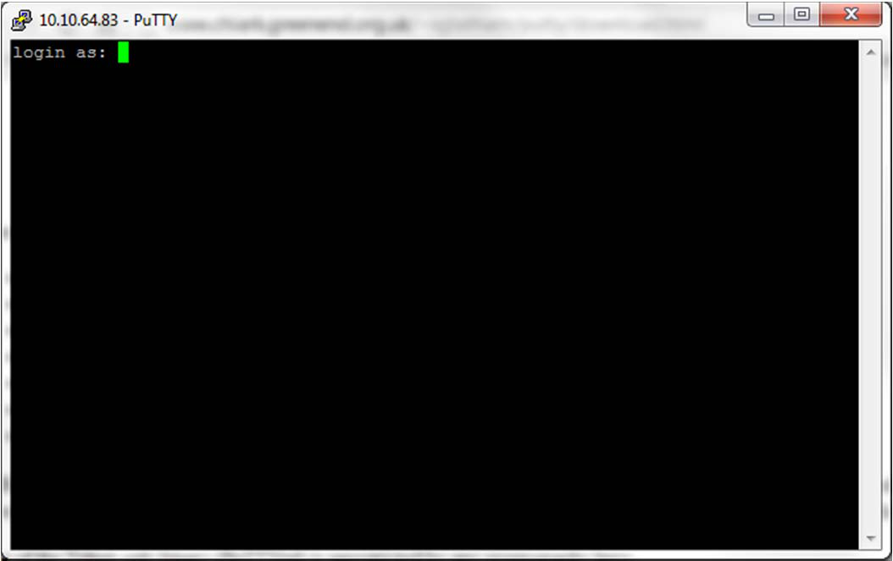

# How to Factory Reset a StarGate-5 Panel

Warning: this reset should only be performed if specifically instructed to do so by DAQ

## Get Putty

You need to install a program called *Putty*. This can be found in the *tools* folder on any StarWatch SMS
install media DVD or alternatively download from:
https://dl.dropboxusercontent.com/u/70533054/putty.exe

## Connect Putty

You will need the IP address of the StarGate-5 panel.

Run *Putty* and enter the IP address of the StarGate-5 panel. Next, click *Open*.

This will open a session window.

### Step 1 – Login via *Putty*

Note that if this panel is connected to a system like StarWatch SMS, it may be good to disable the panel
in that system if desired. Note that this process preserves the IP settings for any panel which may be
convenient.
Enter the user name *entrostar* and then the password *3ntr0* (note the last digit is a zero).

### Step 1 – Login as *su*

Enter the command *su* followed by the password *sooperrute*.

### Step 3 – Go to *db* directory

Type in the command:
*cd /db*

### Step 4 – Stop all services

Type in the command:
*ssentro stop*

### Step 5 – Remove database files

Type in the command:
*rm *db**

### Step 6 – Remove local configuration files

Type in the command:
*rm currentconfig/**

### Step 7 – Create new database

Type in the command:
*dbmanager*

### Step 8 – Start services

Type in the command:
*ssentro start*
Wait for the panel to restart. It may look like it gets stuck, but hitting the *ENTER* key after a minute
shows they are started. Note that it is advisable to update the local configuration again using *Site*
*Builder*.

---

*© DAQ Electronics, LLC*
