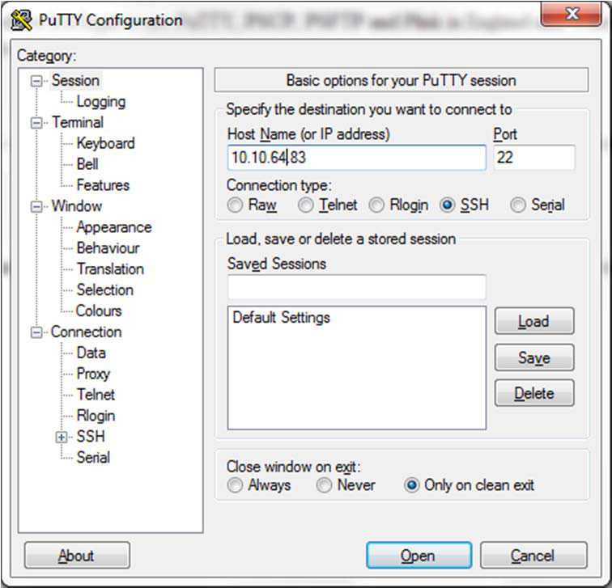

# How to Factory Reset an EntroStar Panel

Warning: this reset should only be performed if specifically instructed to do so by DAQ

## Get Putty

You need to install a program called *Putty*. This can be found in the *tools* folder on any StarWatch SMS
install media DVD or alternatively download from:
https://dl.dropboxusercontent.com/u/70533054/putty.exe

## Connect Putty

You will need the IP address of the EntroStar panel. For information on finding EntroStar panels, refer
to the document *How to Discover EntroStar Panels on a Network*.

Then run *Putty* and enter the IP address of the EntroStar panel. Next, click *Open*.

This will open a session window.

Depending on the firmware version, you will follow different instructions. The login is different for
each version and can thus be used to determine the version you have. Try the first login, and if it fails,
try the second login.

## “root” Login

Enter the user name *root* and then the password *sooperrute*. If successful, you have version V1.1.x or
earlier firmware.

## “entrostar” Login

If the login for *root* fails, enter the user name *entrostar* and then the password *3ntr0* (note the last
digit is a zero). If successful, you have version V1.2.x or later firmware.

## EntroStar V1.1.x Firmware

Login as *root*, as explained. Then, enter the following commands (one at a time), hitting the *ENTER* key
after each command:
*cd /db*
*ssentro stop*
*rm *db**
*reboot*
Wait for the panel to restart. It may need to be powered off if it fails to reboot or fails to start with a
heartbeat. The heartbeat lamp *i* at the top right of the EntroStar panel should be flashing alternately
between violet and pale yellow.

## EntroStar V1.2

Login as *entrostar* as explained. Then, enter the command *su* followed by the password *sooperrute*.
Next, enter the following commands (one at a time), hitting the *ENTER* key after each command:
*cd /db*
*ssentro stop*
*rm *db**
*dbmanager*
*ssentro start*

Wait for the panel to restart. The heartbeat lamp *i* at the top right of the EntroStar panel should be
flashing alternately between violet and pale yellow.

---

*© DAQ Electronics, LLC*
