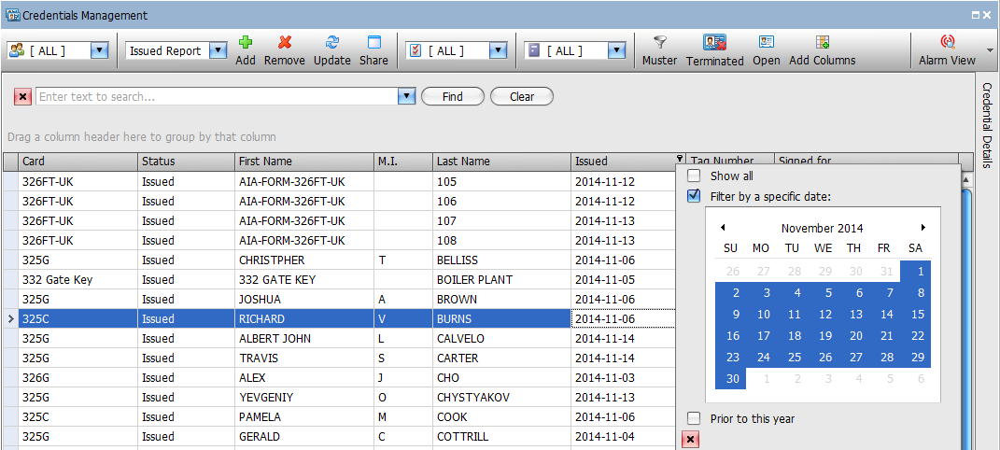
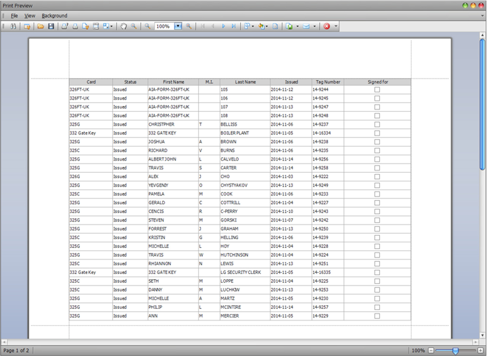
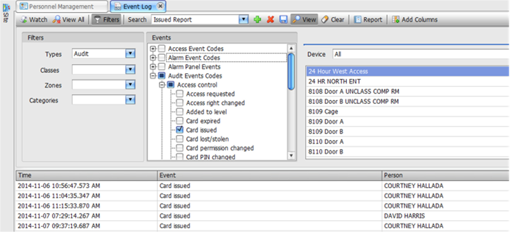
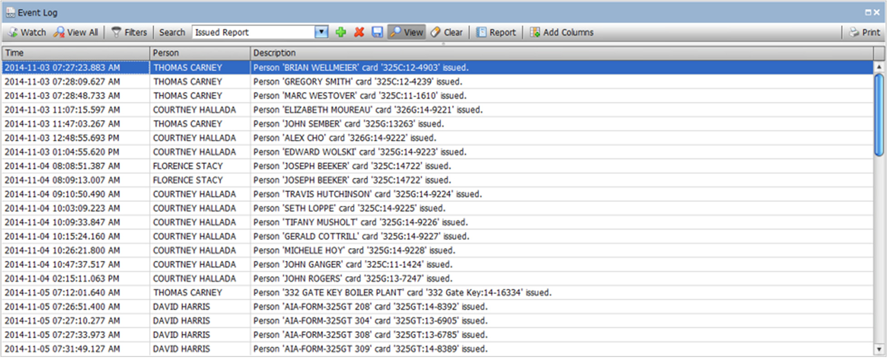
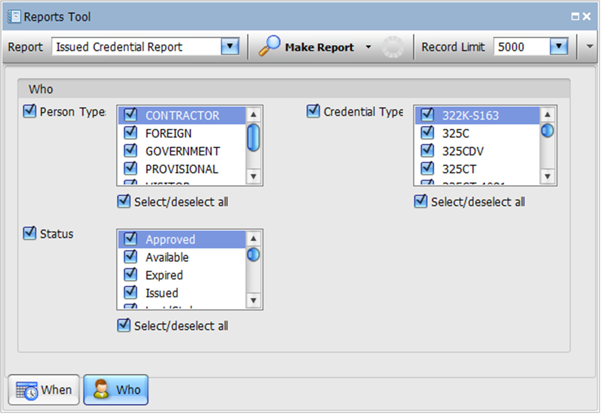
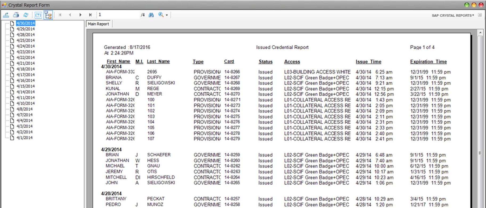
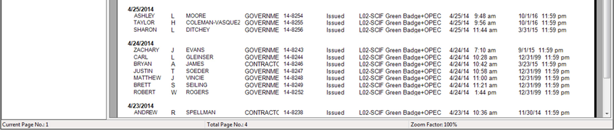
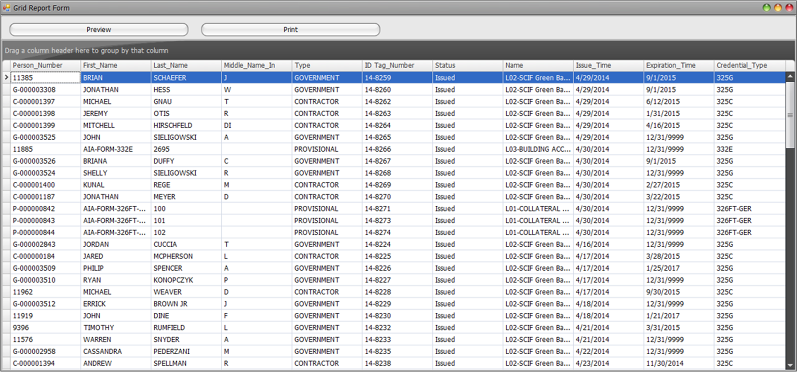

# How to Generate an Issued Credential Report

Within *StarWatch SMS*, there are three ways to generate reports detailing the credentials/cards that
have been issued during a specific time period:

Using the *Credentials Management* function

Using the system *Event Log*

Using the *Crystal Reports* application

## Credentials Management

Using the column editing tools provided in the *Credentials Management* window, users can create
custom reports that are organized by set parameters. This is accomplished by adding a new view,
selecting the required columns, and setting up date/time filters. Reports created in this manner can be
saved for future use.

Here is an example of a report called “Issued Report”. Note that the range of dates can be changed
easily from the *Issued* column filter.

Here is how the printed version of the report will appear:

## Event Log

You can also create and save reports using the system *Event Log*.
In the following example, the created report has been named “Issued Report” and contains all events
of the type *Audit* that are linked to the *Card Issued* parameter within the *Access Control* sub-category:

As shown, the event view displays the time, operator name, and the person that the card was issued to
including the card type and card number.

Note that it is highly desirable to create reports that can be re-used. Each report can be saved
including columns selected, layout, and widths.
This type of data can easily be exported and reformatted if needed.

## Crystal Reports

The *Crystal Reports* application includes a report called “Issued Credential Report”. Using the
parameters provided, users can filter reports to include specific types of cards and/or persons:

Here is how the output version of the report will appear:

Note that all Crystal reports can be output to Crystal format and browser or to XtraGrid format:

---

*© DAQ Electronics, LLC*
