# How to Install and Use Asure ID Badging on a Stand-Alone SCIF Workstation

## Introduction

One or more workstations on the system will require *Asure ID* badging if you would like to:
a) Design a printable card, ID badge, or visitor pass
b) Print a card or pass
Note: not all workstations require *Asure ID* if design or printing is not needed - all workstations can
view an individual’s photo, take a photo, and view a person’s currently issued or printed card or pass.
Note:  this guide should only be used for the installation of *Asure ID* on a Stand-Alone SCIF Workstation.

## Windows Services

To begin, it is important to ensure that the *SQL Server Browser* is running.
1. Using the *Start* menu, type “windows services” in the search function and then select the
*Services* icon.

This will call up the *Services* window.

2. On the right side of the editor, scroll down to find and select the *SQL Server* Browser option.

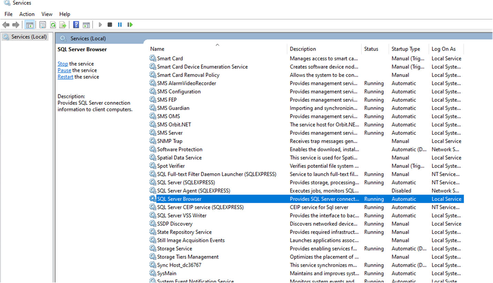

3. Right-click on the selected option and choose *Properties* from the drop-down menu. This will
call up the settings window for the *SQL Server Browser* option.

4. On the *General* tab, check that the *Service Status* indicates that the SQL Server is *Running*. If it
is not running, click the *Start* button followed by the *OK* button. If the service is disabled,
choose *Automatic*, then refresh the screen and start the service.
5. Close out of the *Services* editor.

## Windows Security Policy

Before installing *Asure ID*, you must check the security policy settings in Windows to make sure that
the following option is disabled:
*System cryptography: Use FIPS compliant algorithms for encryption, hashing, and signing*
HID does not allow or support this option, and it will cause *Asure ID* to fail or crash if enabled.
1. Using the *Start* menu, type “edit group policy” in the search function and then select the *Edit*
*group policy* icon.

This will call up the *Local Group Policy Editor* window.

2. Using the directory tree on the left side of the editor, navigate to:
*Local Computer Policy/Computer Configuration/Windows Settings/Security*

## Settings/Local Policies/Security Options

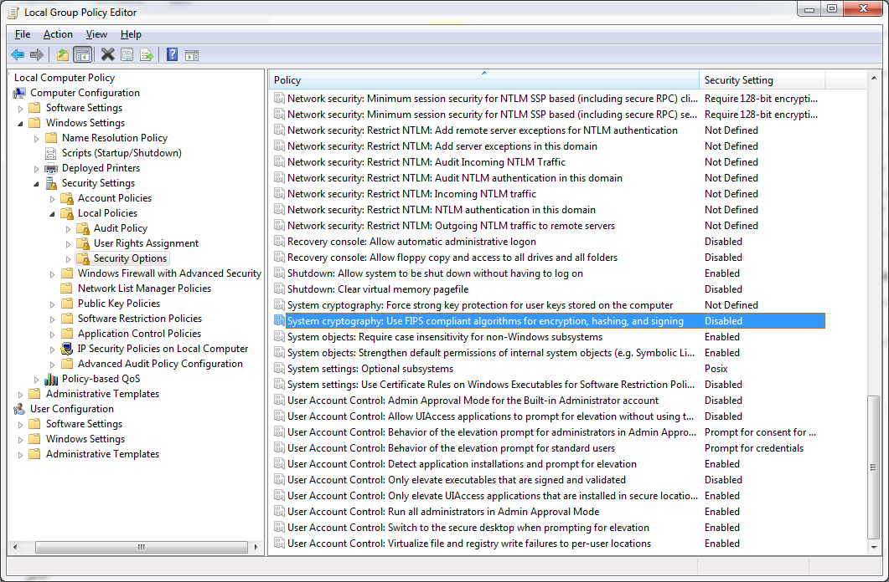

3. On the right side of the editor, scroll down to find and select the *System cryptography* option
relating to FIPS compliant algorithms.
4. Right-click on the selected option and choose *Properties* from the drop-down menu. This will
call up the settings window for the *System cryptography* option.

5. On the *Local Security Setting* tab, set the option to *Disabled* and hit the *OK* button.
6. Close out of the editor.

## Registry Editor

Next, you need to turn off *FIPS Cryptography* in the *Registry Editor*.
1. Using the *Start* menu, type “run” in the search function and then select the *Run* icon.

This will call up the *Run* dialog box.

2. Type “regedit” into the dialog box and click the *OK* button.
This will call up the *Registry Editor* window.

3. Using the directory tree on the left side of the editor, navigate to:
*HKEY_LOCAL_MACHINE/System/CurrentControlSet/Control/Lsa/FIPSAlgorithmPolicy/*

## Enabled

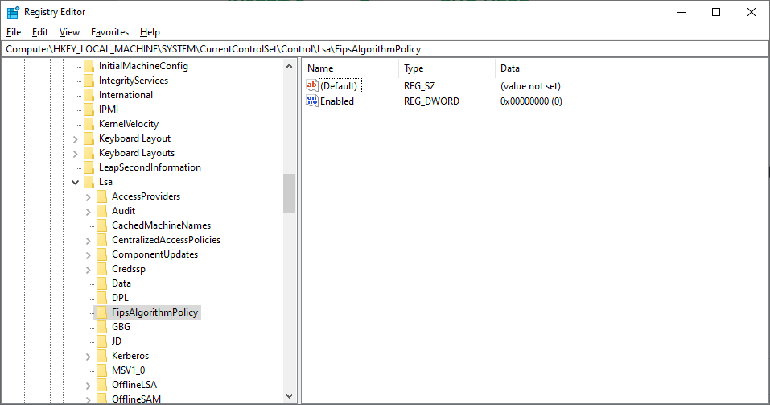

4. Change the value of this registry entry to 0 to disable it.

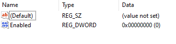

5. Close out of the editor.

## ISS Crypto GUI Tool

To run properly, *Asure ID* requires that a set of specified Windows options are enabled, including
client/server protocols, ciphers, hashes, and key exchange algorithms.
1. For this section, you will need to utilize the *IIS Crypto GUI* program. If it is not already on your
machine, please visit *www.nartec.com* to download and install this free application.
2. Once installed, launch the application.

3. On the *Schannel* tab, enable/disable the various options, as shown.

## Server Firewall Rules

When using *SQL Express*, the TCP access port is allocated dynamically. You will need to add a program
type rule and browse to the *sqlserv.exe* program.
1. Using the *Start* menu, type “run” in the search function and then select the *Run* icon.

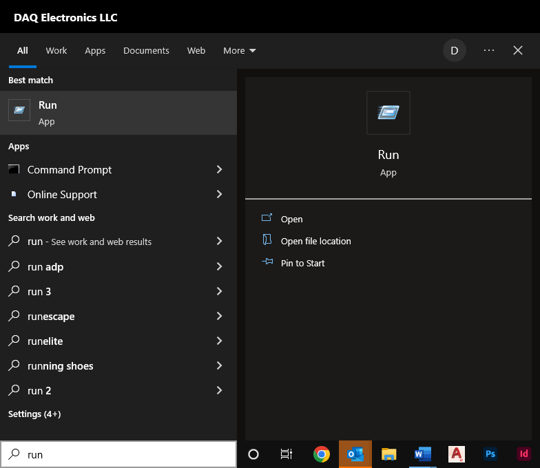

This will call up the *Run* dialog box.

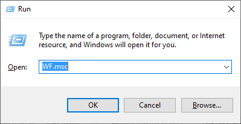

2. Type “WF.msc” into the dialog box and click the *OK* button.
This will call up the *Windows Defender Firewall with Advanced Security* window.

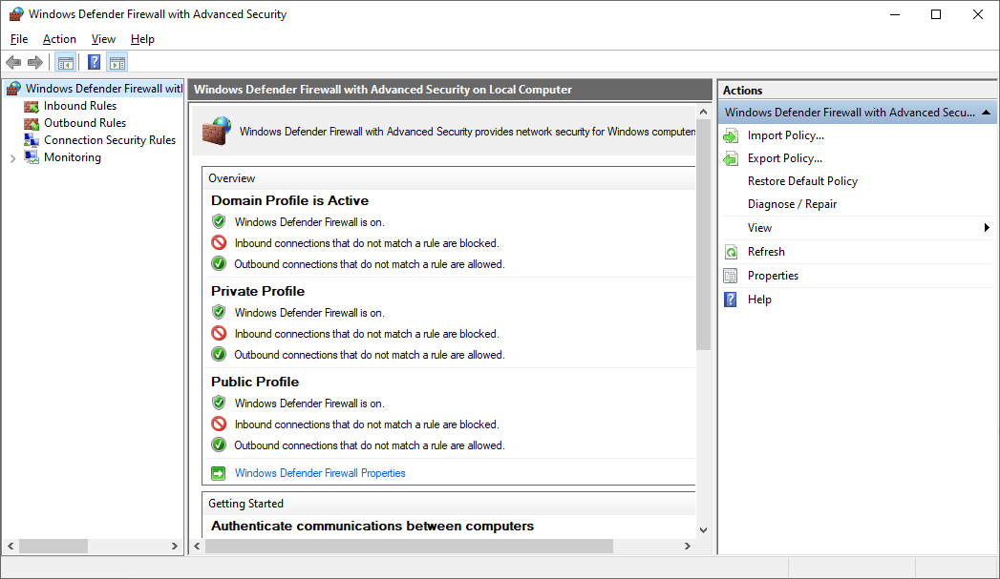

3. In the left pane, right-click on the *Inbound Rules* option and then select *New Rule* from the
*drop-down menu*.
This will call up the *New Inbound Rule Wizard*.

4. Select the *Program* tick-box from the *Rule Type* list and then click the *Next* button.

5. In the *Program* window, select the *This program path* tick-box and then click the *Browse*
button.

This will call up the *Open* window.

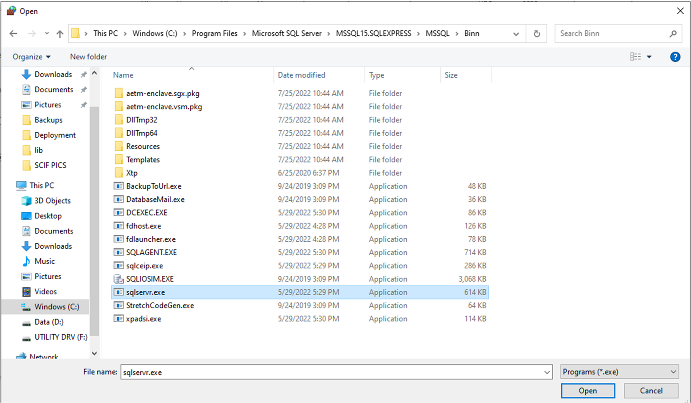

6. Using the directory tree, navigate to:
*Program Files/Microsoft SQL Server/MSSQL15.SQLEXPRESS/MSSQL/Binn*
7. Select *sqlsever.exe* from the directory and click the *Open* button.
8. Click *Next* to go to the *Action* window.

9. In the *Action* window, select the *Allow the connection* tick-box and click the *Next* button.

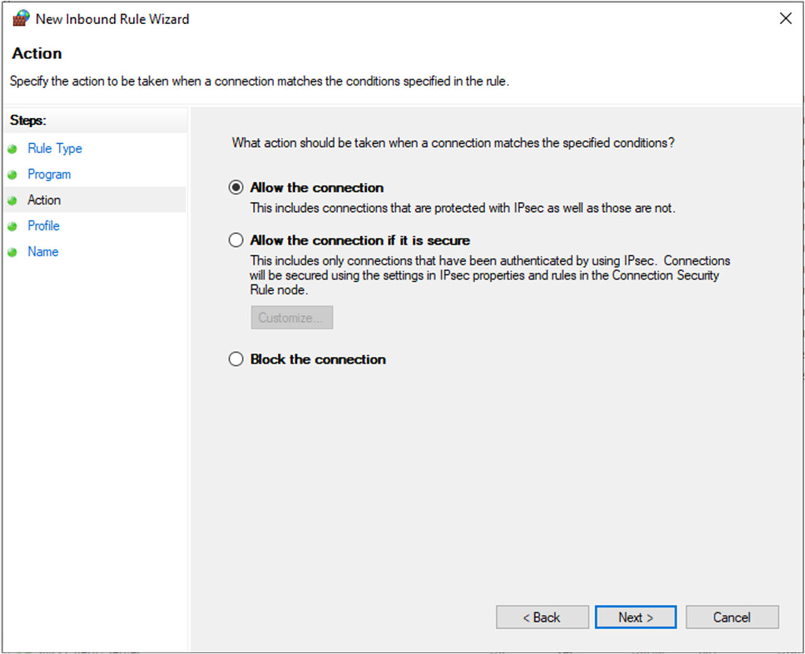

10. In the *Profile* window, only select the *Domain* tick-box and click the *Next* button.

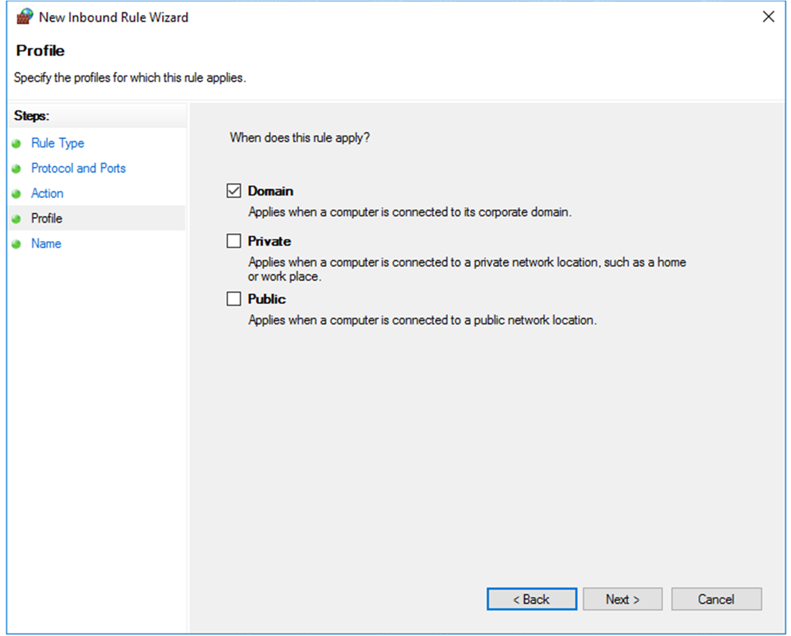

11. In the *Name* window, enter a name for the rule in the *Name* field and click the *Finish* button.

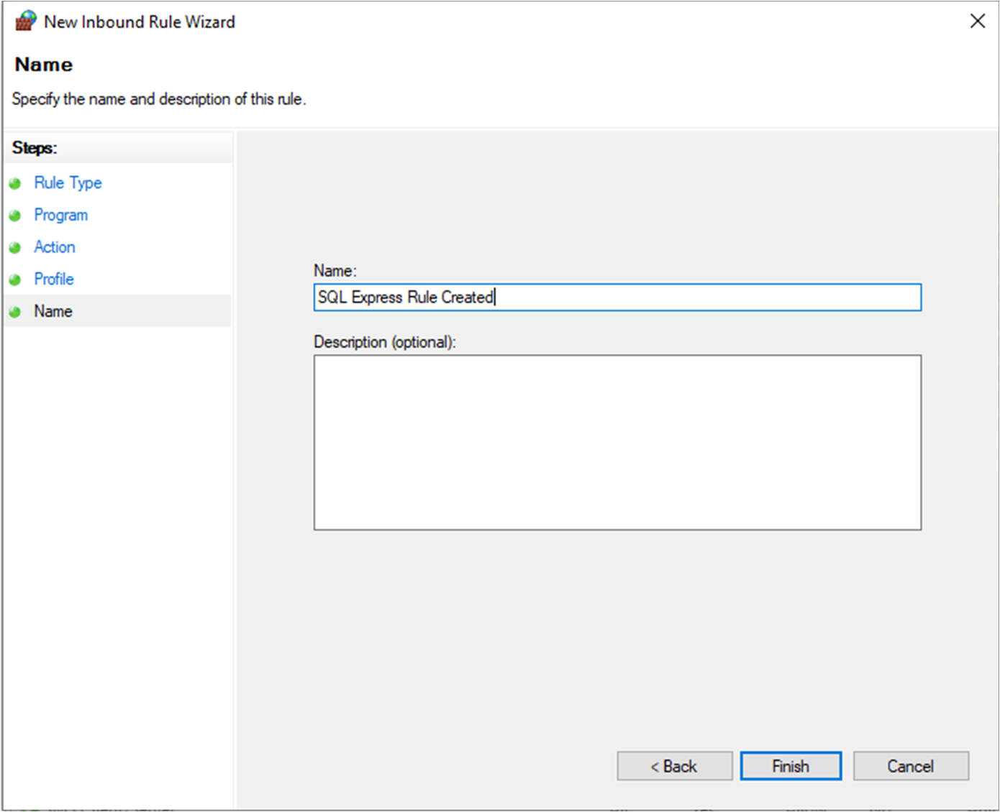

## Run Installation Wizard

Once all previous steps have been completed, you can install *Asure ID*.
1. When installing a new workstation using the *StarWatch SMS* media, you must check that you
have the current *asure_id_setup* file available.

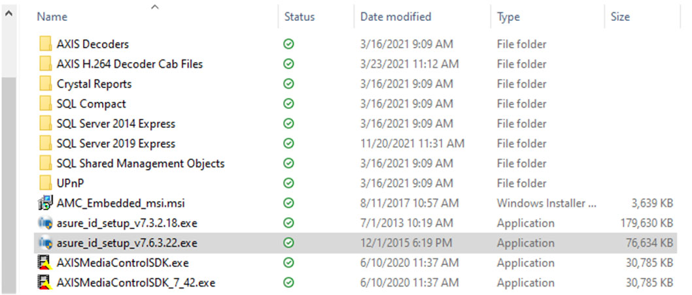

This file is provided in a folder called *Redists* located in the *StarWatch* folder installed during
*StarWatch SMS* installation.

2. Before running this file, be sure to disable the computer *McAfee* anti-virus protection. The
default password is *12DOitright!!01*.

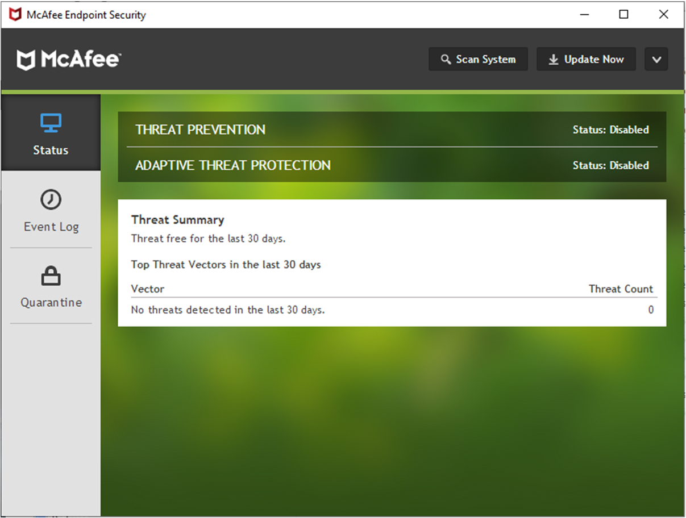

3. When running *StarWatch SMS* setup, it is possible to start the setup of *Asure ID* from within the
*StarWatch SMS* setup. Run (as administrator) the *Asure_id_setup_v7.6.3.22.exe* program.
Note:  do not use a later version as it may not integrate and function correctly within
*StarWatch SMS*.
Note:  you will need to purchase a product key from DAQ Electronics or from your certified DAQ
partner or reseller.
4. Sequence through the installation wizard, as follows, by clicking the *Next* button on each
window until you reach the final screen:

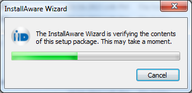

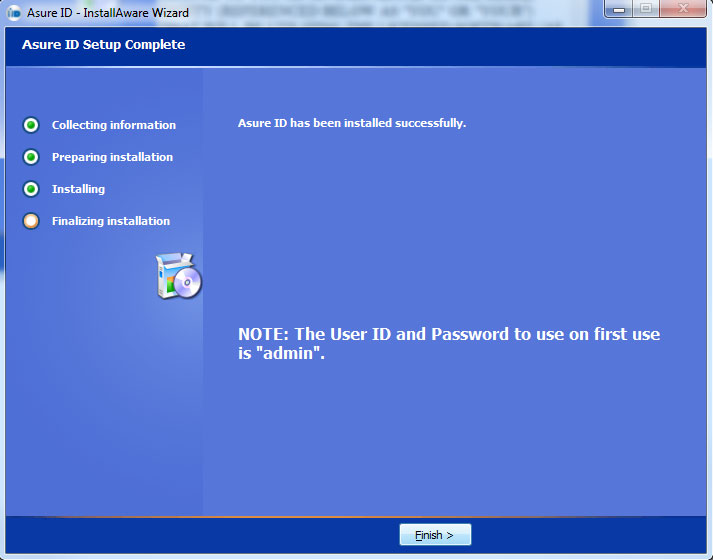

5. At this point in the process, you may be prompted to activate your license. To do so, follow the
on-screen instructions. If you are not prompted, you can activate your license later.

6. At the final *Asure ID* setup screen, deselect the *Run Asure ID* checkbox before clicking the
*Finish* button.

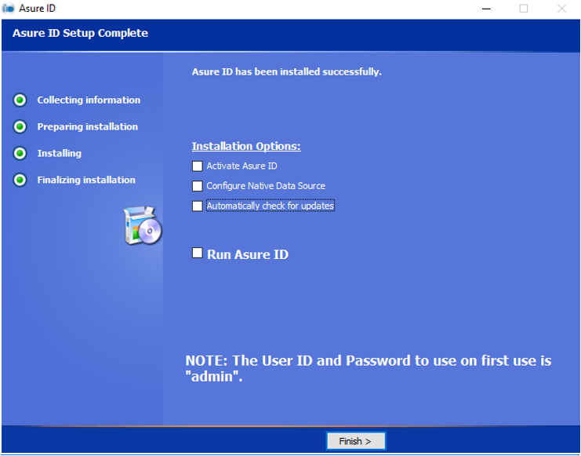

7. After installation, click on the Windows *Start* menu and navigate to *HID Global*. Next, click on
*Data* *Connection Wizard*.

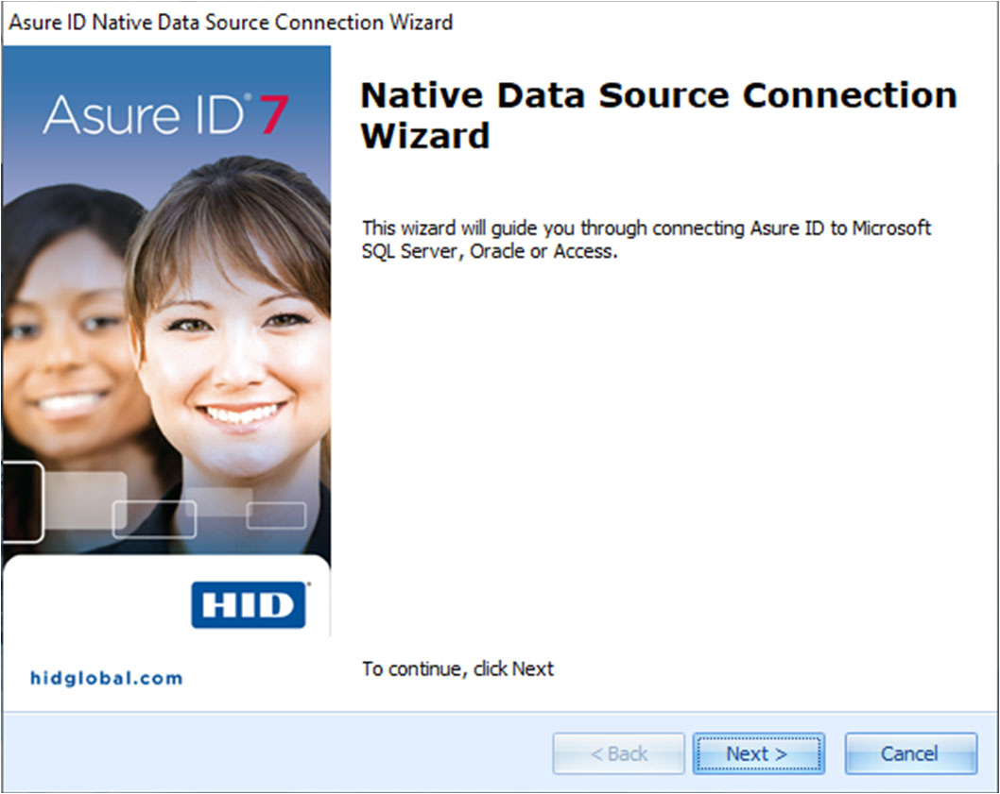

8. To begin, click the *Next*, button.

9. On the *Select a* *Database Type* screen, select *Microsoft SQL Server* and click the *Next* button.

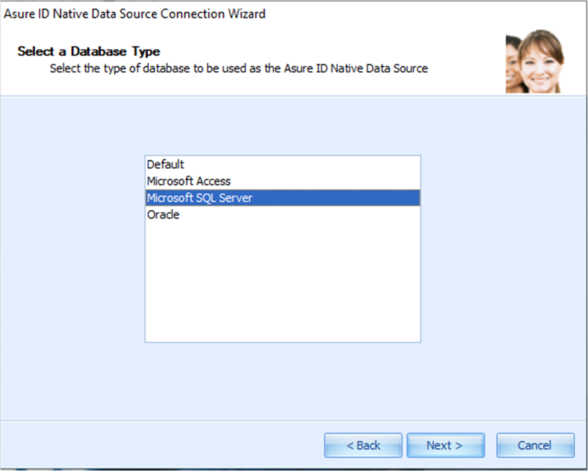

10. On the *SQL Database Connection* screen, fill in the following information and click the *Next*
button:
Server Name: this is the name of your computer\SQLEXPRESS (also in the server tab of
-
Management Console)
Initial Catalog: this is the name of your database created in Management Console
-
Schema: dbo
-
User Name: sa
-
Password: 12DOitright!!01
-

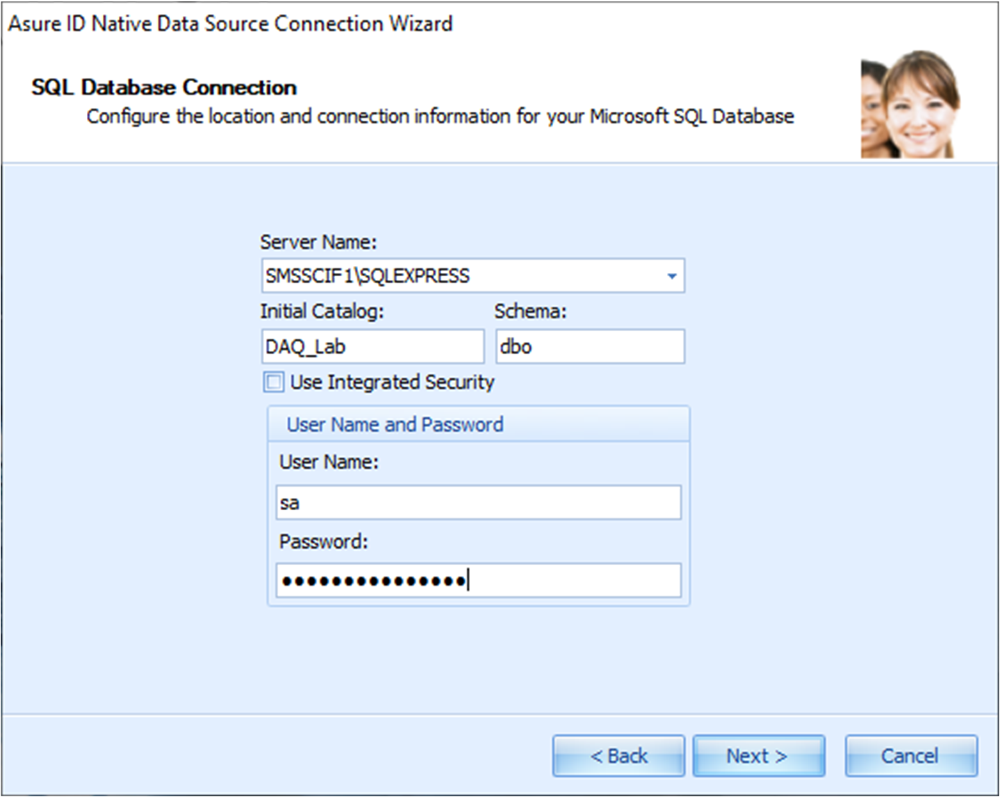

11. Click the *Test* button.

12. In the *Connection Succeeded* dialog box, click the *OK* button.
13. Click the *Finish* button.

## Activation

1. To activate your product, open *Asure ID* from the Windows *Start* menu, as shown.

2. You will be prompted to activate. Fill in the *Activate License* information, as required.

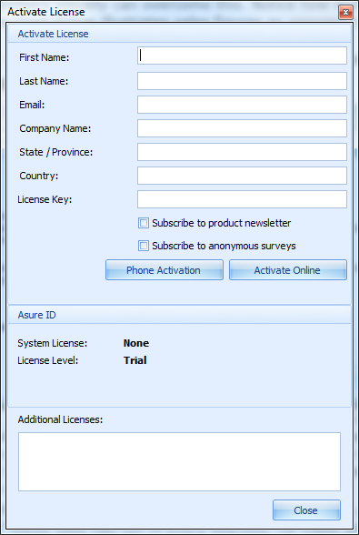

## Checking Activation in StarWatch SMS

To check that the *Asure ID* activation was successful, complete the following steps:
1. Open the *StarWatch SMS* operator and login.
2. Next, open the *Admin* console and navigate to the *Card Type* feature*.*
3. In the *Card Type* area, select the *Design* tab.

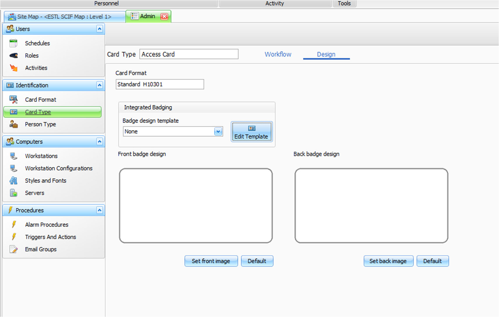

4. Click the *Edit Template* button to launch *Asure ID*.

The following screens are from the ICIDS 5 *StarWatch SMS* product after *Asure ID* opens:

## Asure ID Integration and Diagnostics

## Introduction

It would be helpful to have either a log of all information found via the SDK as a way to verify the
*Asure ID* installation or provide a test application that “dumps” a check list of information.

## SDK Initialization

Check the initialization and report.

## Asure ID Installed Version

Check that the version installed is 7.6.3.22 or the version expected.

## License Level and Type

Check that the activated license is the *Developer* license.

## Data Connection

Check that *Asure ID* has a valid data connection to the database used by *StarWatch SMS* and correct the
connection if possible.

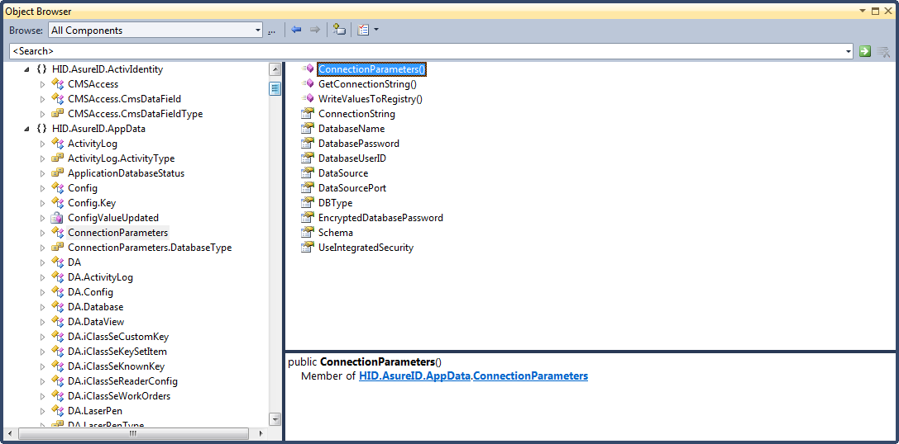

## Set Data Connection

If required, set/update the data connection (as in case of the *su* password being changed).  This can be
done when opening *Admin* or opening the view to *Admin->Card_Type* on initialization.

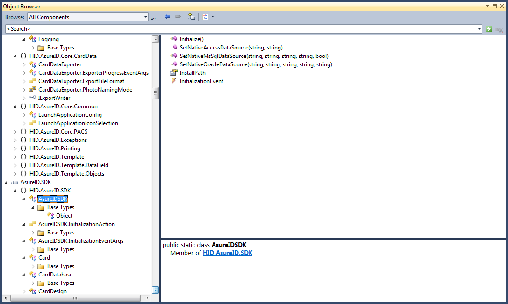

---

*© DAQ Electronics, LLC*
