# How to Install and Use Asure ID Badging on an RSM Connected to a SCIF Workstation

## Introduction

One or more workstations on the system will require *Asure ID* badging if you would like to:
a) Design a printable card, ID badge, or visitor pass
b) Print a card or pass
Note: not all workstations require *Asure ID* if design or printing is not needed - all workstations can
view an individual’s photo, take a photo, and view a person’s currently issued or printed card or pass.
Note: this guide should only be used for the installation of *Asure ID* on an *RSM* connected to a *SCIF*
workstation.
Note: several of the *Asure ID* installation steps outlined in this guide will need to be completed on both
the *SCIF* workstation and the *RSM* (as indicated in the procedures) – for steps that need to be
completed for both, please begin with those needed for the *SCIF*, then move on to the *RSM*.

## Windows Services

Important: this section should be completed for the *SCIF* only.
To begin, it is important to ensure that the *SQL Server Browser* is running.
1. Using the *Start* menu, type “windows services” in the search function and then select the
*Services* icon.

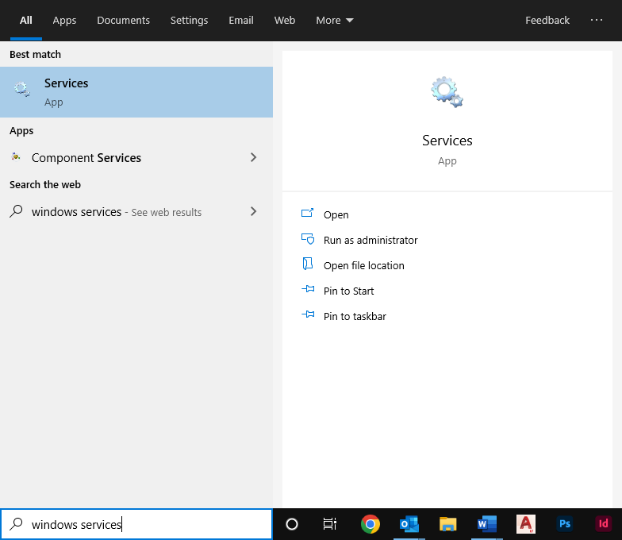

This will call up the *Services* window.

2. On the right side of the editor, scroll down to find and select the *SQL Server* Browser option.

3. Right-click on the selected option and choose *Properties* from the drop-down menu. This will
call up the settings window for the *SQL Server Browser* option.

4. On the *General* tab, check that the *Service Status* indicates that the SQL Server is *Running*. If it
is not running, click the *Start* button followed by the *OK* button. If the service is disabled,
choose *Automatic*, then refresh the screen and start the service.
5. Close out of the *Services* editor.

## Windows Security Policy

Important: this section should be completed for both the *SCIF* and the *RSM*.
Before installing *Asure ID*, you must check the security policy settings in Windows to make sure that
the following option is disabled:
*System cryptography: Use FIPS compliant algorithms for encryption, hashing, and signing*
HID does not allow or support this option, and it will cause *Asure ID* to fail or crash if enabled.
1. Using the *Start* menu, type “edit group policy” in the search function and then select the *Edit*
*group policy* icon.

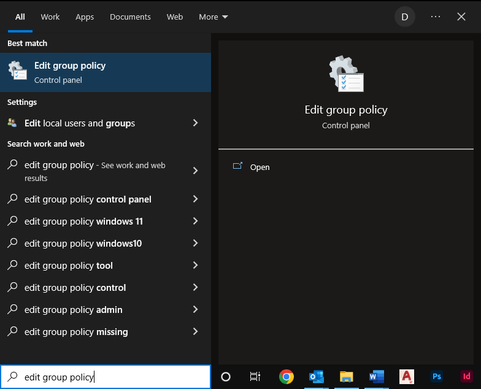

This will call up the *Local Group Policy Editor* window.

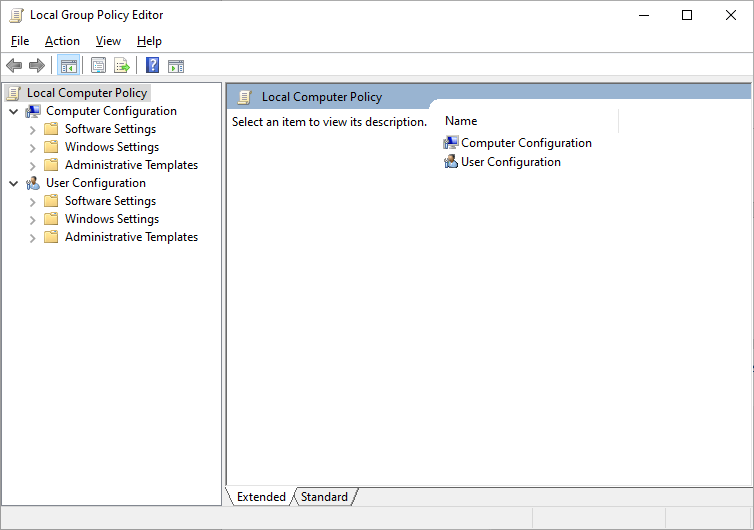

2. Using the directory tree on the left side of the editor, navigate to:
*Local Computer Policy/Computer Configuration/Windows Settings/Security*

## Settings/Local Policies/Security Options

3. On the right side of the editor, scroll down to find and select the *System cryptography* option
relating to FIPS compliant algorithms.
4. Right-click on the selected option and choose *Properties* from the drop-down menu. This will
call up the settings window for the *System cryptography* option.

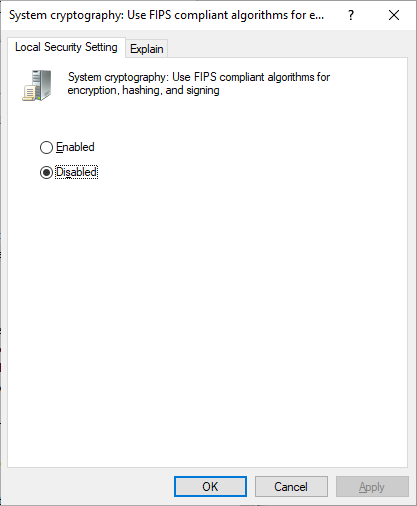

5. On the *Local Security Setting* tab, set the option to *Disabled* and hit the *OK* button.
6. Close out of the editor.
7. Repeat this procedure for the second machine (the *SCIF* or *RSM*).

## Registry Editor

Important: this section should be completed for both the *SCIF* and the *RSM*.
Next, you need to turn off *FIPS Cryptography* in the *Registry Editor*.
1. Using the *Start* menu, type “regedit” in the search function.

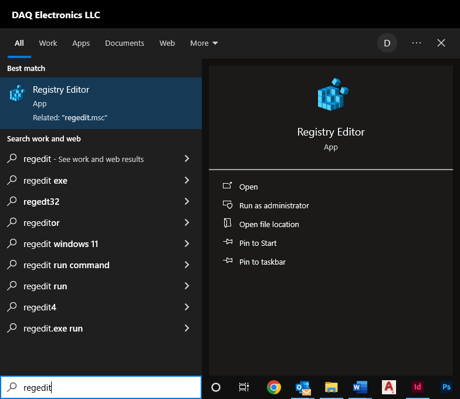

2. Right-click on the *Registry Editor* icon and select *Run as Administrator* from the drop-down
menu.

This will call up the *Registry Editor* window.

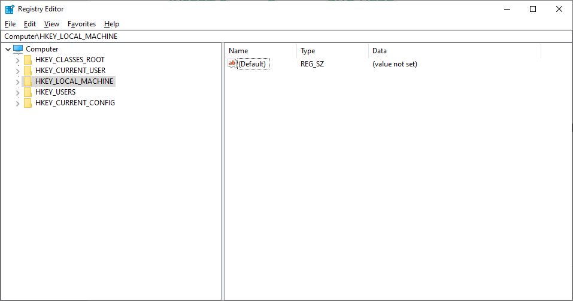

3. Using the directory tree on the left side of the editor, navigate to:
*HKEY_LOCAL_MACHINE/System/CurrentControlSet/Control/Lsa/FIPSAlgorithmPolicy/*

## Enabled

4. Double-click *Enabled* and change the value of this registry entry to 0 to disable it.

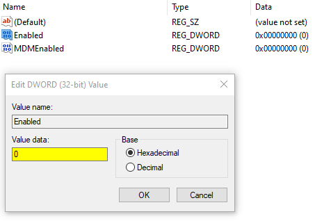

5. Close out of the editor.
6. Repeat this procedure for the second machine (the *SCIF* or *RSM*).

## TCP/IP Protocols

Important: this section should be completed for the *SCIF* only.
In this procedure, you will enable a set of TCP/IP protocols on your *SCIF* machine.
1. Using the *Start* menu, type “computer management” in the search function and then select the
*Computer Management* icon.

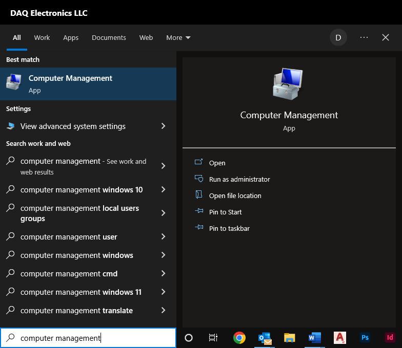

This will call up the *Computer Management* window.

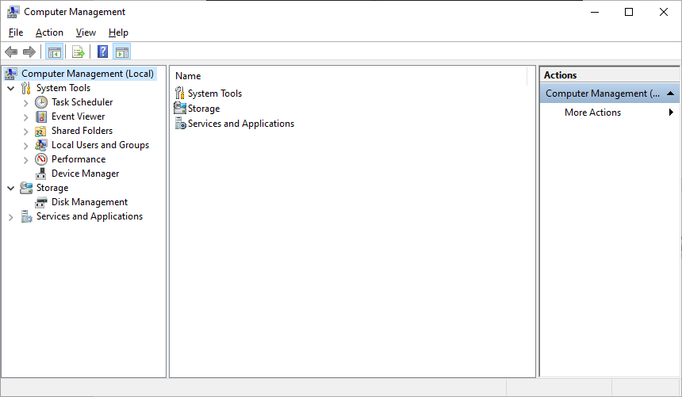

2. Using the directory tree to the left of the screen, navigate to the *SQL Server Configuration*.

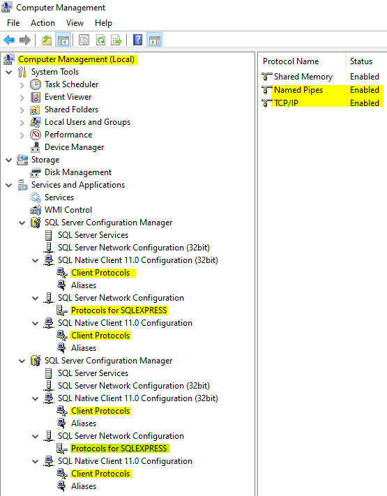

3. If not already enabled, enable all of the protocols and named pipes as shown.
4. Close out of the *Computer Management* window.

## ISS Crypto GUI Tool

Important: this section should be completed for both the *SCIF* and the *RSM*.
To run properly, *Asure ID* requires that a set of specified Windows options are enabled, including
client/server protocols, ciphers, hashes, and key exchange algorithms.
1. For this section, you will need to utilize the *IIS Crypto GUI* program. If it is not already on your
machine, please visit *www.nartec.com* to download and install this free application.
2. Once installed, launch the application by right-clicking on the icon and selecting *Run as*
*Administrator* from the drop-down menu.

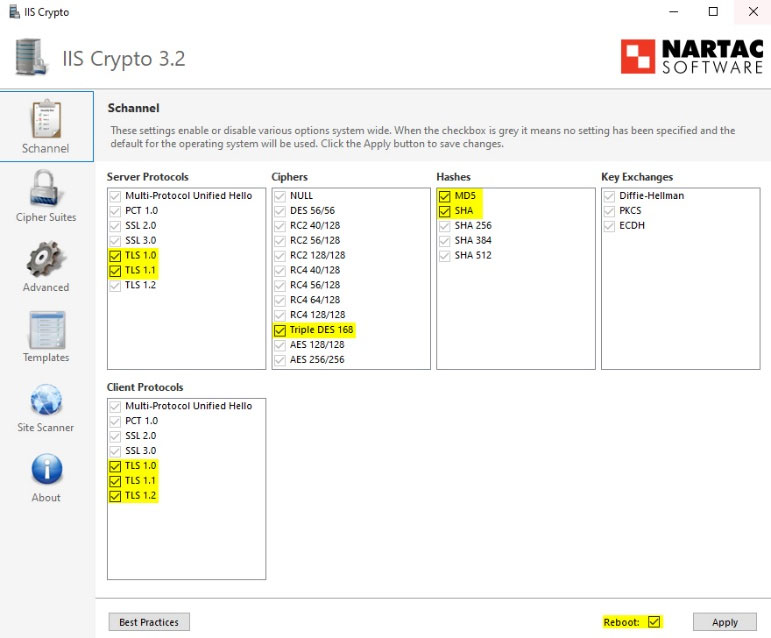

3. On the *Schannel* tab, enable/disable the various options, as shown, place a checkmark in the
*Reboot* box on the lower-right of the tab, and click the *Apply* button. The computer will now
restart.
4. Repeat this procedure for the second machine (the *SCIF* or *RSM*).

## Network Adaptor

Important: this section describes how to configure the network adaptor settings for the *SCIF* and the
*RSM* - note that the configuration is different for each.
1. Using the *Start* menu on your *SCIF* machine, type “network connections” in the search function
and then select the *View Network Connections* icon.

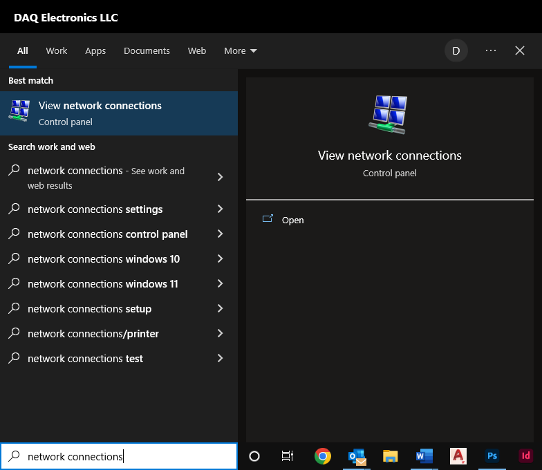

This will call up the *Network Connections* window.

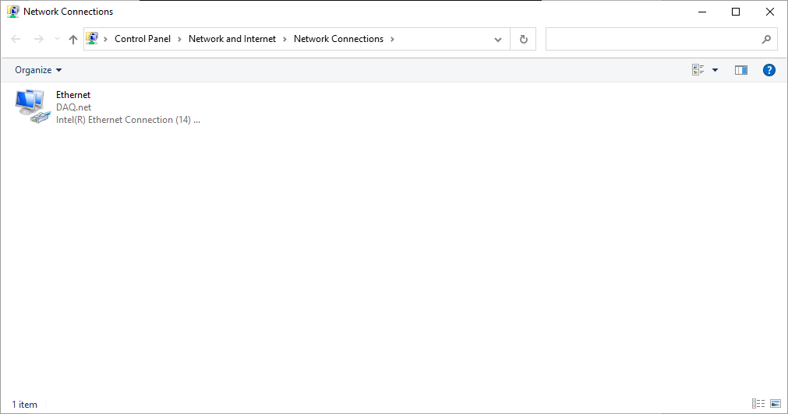

2. Double-click on the *Ethernet* icon to the left of the window. This will call up the *Ethernet*
*Status* dialog box.

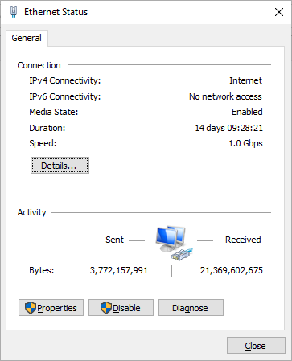

3. Next, click on the *Properties* button to call up the *Ethernet Properties* dialog box.

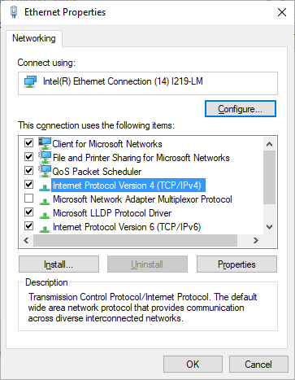

4. Double-click on the *Internet Protocol Version 4 (TCP/IPv4)* line in the displayed list to call up
the next *Properties* dialog box.

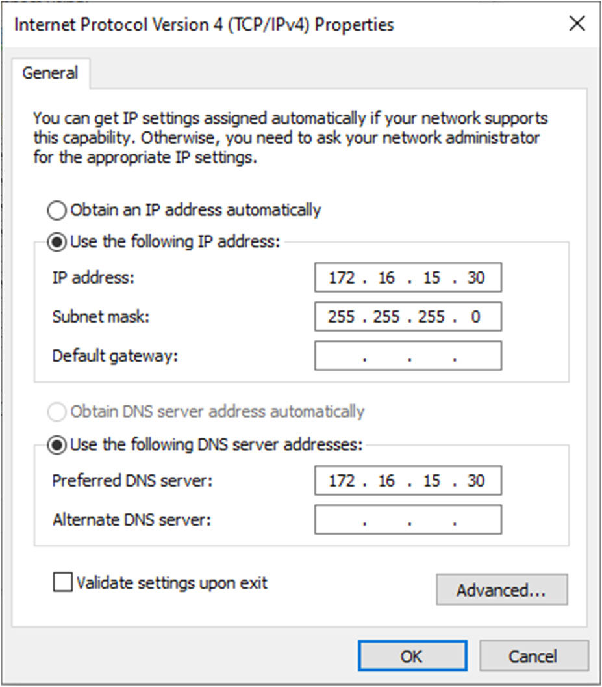

5. Configure the network adaptor settings, as shown.

6. Next, repeat this process on your *RSM* machine to configure the network adaptor settings, as
shown.

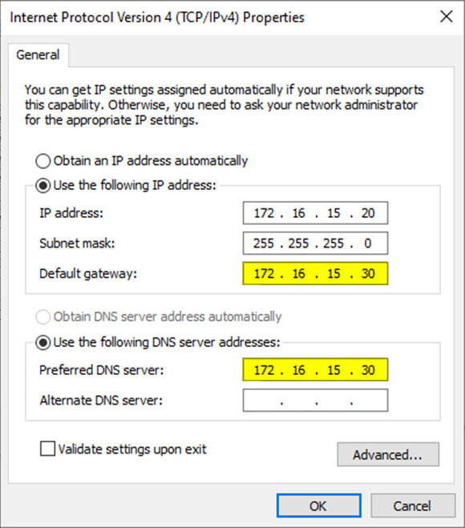

## Server Firewall Rules

Important: this section should be completed for both the *SCIF* and the *RSM*.
1. Using the *Start* menu, type “run” in the search function and then select the *Run* icon.

This will call up the *Run* dialog box.

2. Type “WF.msc” into the dialog box, click the *OK* button, and *Run as Administrator*.

This will call up the *Windows Defender Firewall with Advanced Security* window.

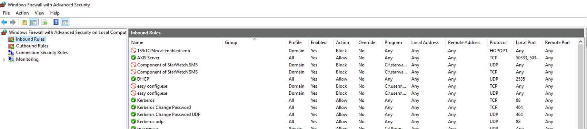

3. In the left pane, right-click on the *Inbound Rules* option and then select *New Rule* from the
*drop-down menu*. This will call up the *New Inbound Rule Wizard*.

Important: steps 4 through 13 should be completed for the *SCIF* only.
4. You need to add a *Program-type* rule and browse to the *sqlserv.exe* program. Select the
*Program* tick-box from the *Rule Type* list and then click the *Next* button.
5. In the *Program* window, select the *This program path* tick-box and then click the *Browse*
button.

This will call up the *Open* window.

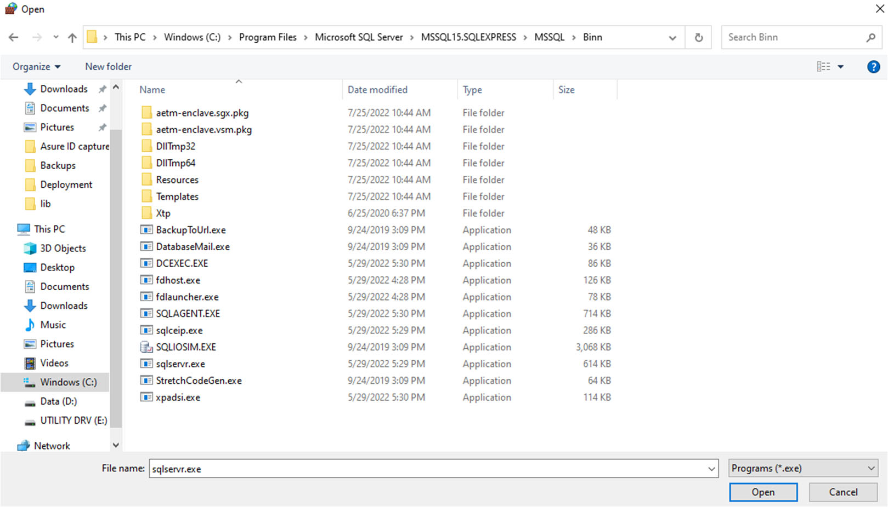

6. Using the directory tree, navigate to:
*Program Files/Microsoft SQL Server/MSSQL15.SQLEXPRESS/MSSQL/Binn*
7. Select *sqlsever.exe* from the directory and click the *Open* button.
8. Click *Next* to go to the *Action* window.

9. In the *Action* window, select the *Allow the connection* tick-box and click the *Next* button.

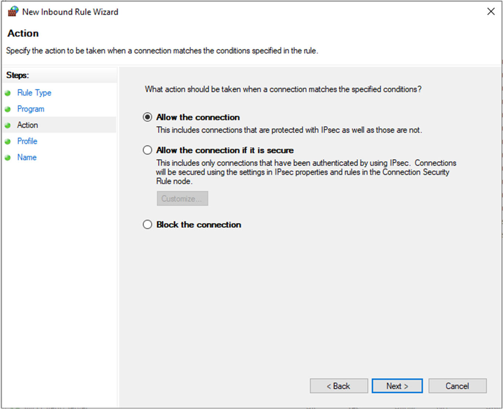

10. In the *Profile* window, select the *Domain*, *Private*, and *Public* tick-boxes and click the *Next*
button.

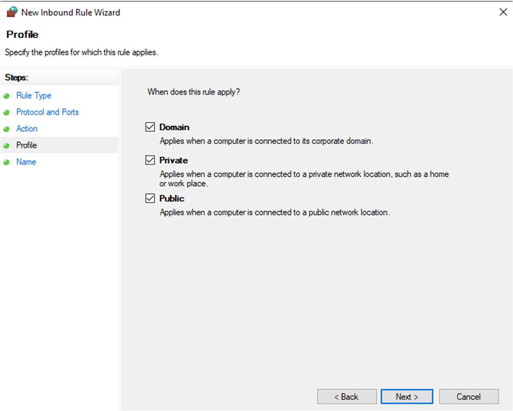

11. In the *Name* window, enter a name for the rule in the *Name* field and click the *Finish* button.

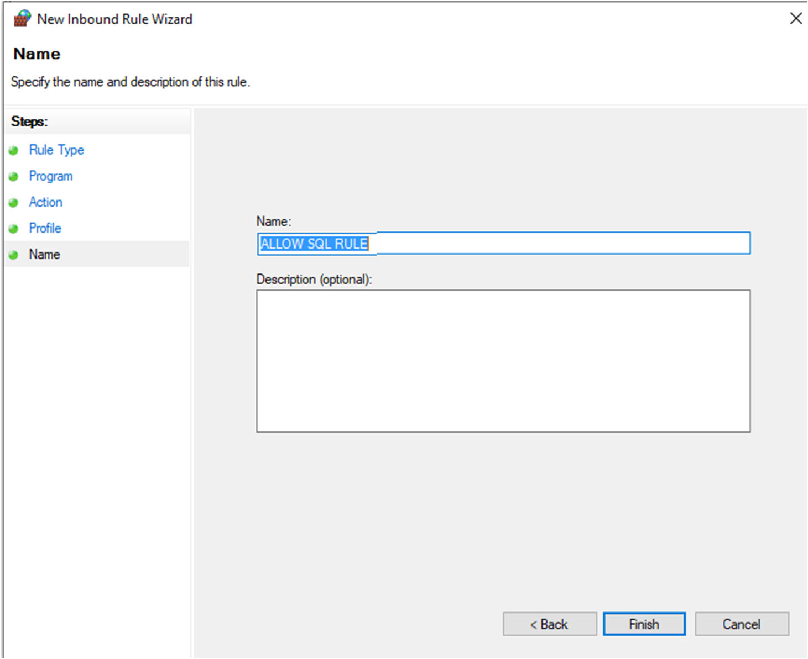

12. Next, open *CMD* and *Run as Administrator*.
13. Type “gpudate /force” and hit the *Enter* key. Wait until the update is complete and close *CMD*.

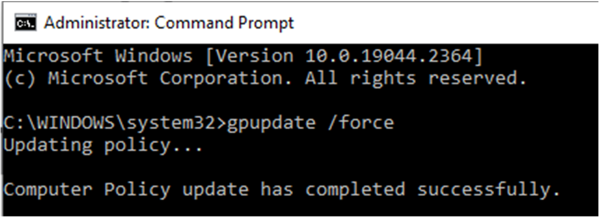

Important: the following steps should be completed for both the *SCIF* and the *RSM*.
14. For the *RSM* to be able to access programs on the *SCIF*, a program-type rule must be created.
To begin this process, return to the *New Inbound Rule Wizard* screen.

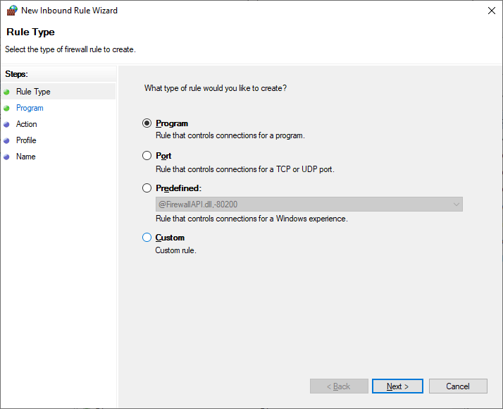

15. Select the *Program* tick-box from the *Rule Type* list and then click the *Next* button.

16. In the *Program* window, select the *All Programs* tick-box and then click the *Next* button.

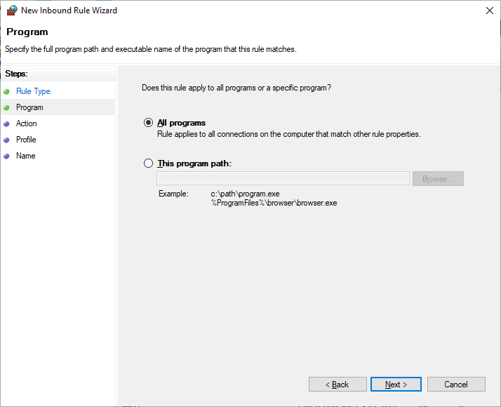

17. In the *Action* window, select the *Allow the connection* tick-box and click the *Next* button.

18. In the *Profile* window, select the *Domain*, *Private* and *Public* tick-boxes and click the *Next*
button.

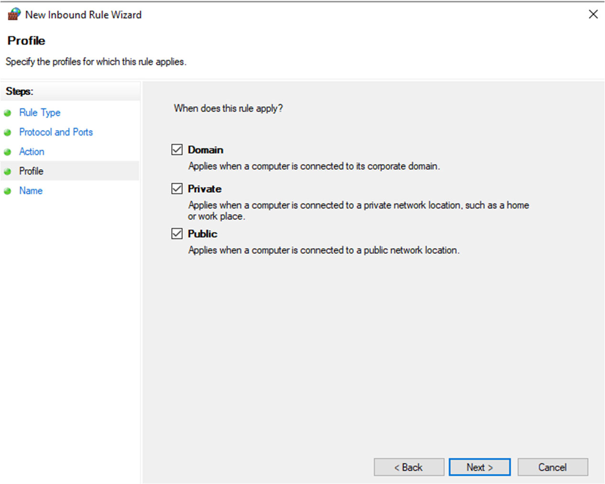

19. In the *Name* window, enter a name for the rule in the *Name* field and click the *Finish* button.

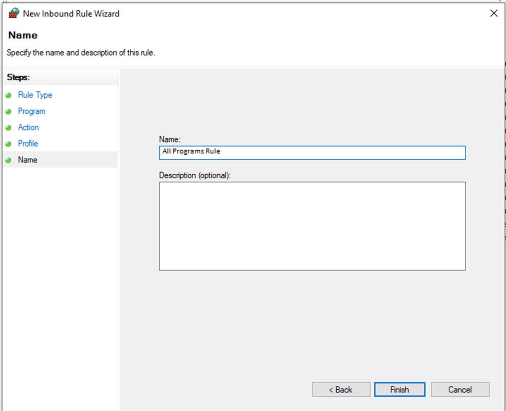

20. Next, open *CMD* and *Run as Administrator*.
21. Type “gpudate /force” and hit the *Enter* key. Wait until the update is complete and close *CMD*.

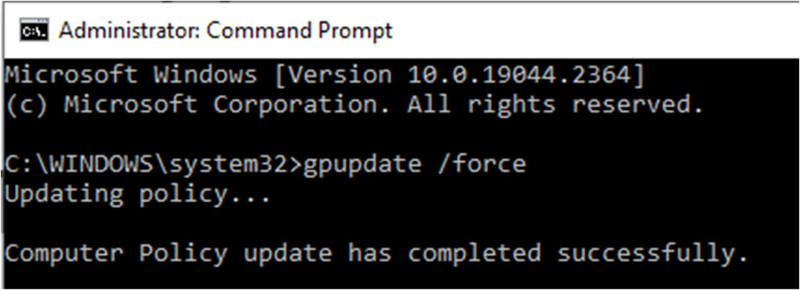

22. Repeat this procedure for the second machine (the *SCIF* or *RSM*).

Important: the following steps should be completed for the *RSM* only.
For the *RSM* to recognize the *Host* name of *smsscif1*, the following steps must be completed:
23. Using the *Start* menu, type “notepad” in the search function and then right-click on the
*Notepad* icon.

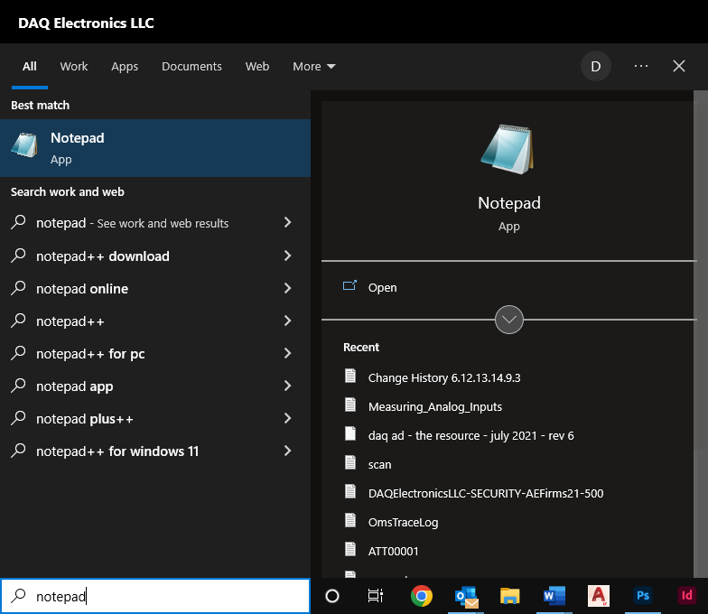

24. From the drop-down menu, select the *Run as Administrator* option.

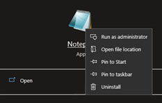

25. Using the directory tree on the left side of the screen, navigate to:

## Windows/System32/drivers/etc

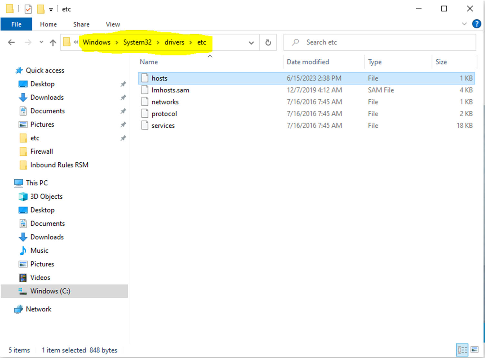

26. Next, right-click on *Notepad* and select *Open as Administrator*.
27. Double-click on the *hosts* file and open it.
28. Copy the entire file and paste it into the *Notepad* page you opened as Administrator.

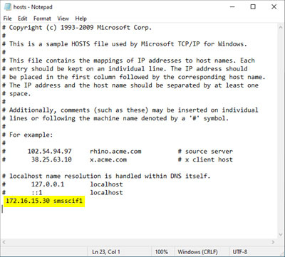

29. Add the IP address of *smsscif1* followed by *smscif1* to the bottom line and then save and
replace the file.
30. Close out of *Notepad*.

## Run Installation Wizard

Important: this section should be completed for the *RSM* only.
Once all previous steps have been completed, you can install *Asure ID*.
1. When installing a new workstation using the *StarWatch SMS* media, you must check that you
have the current *asure_id_setup* file available.

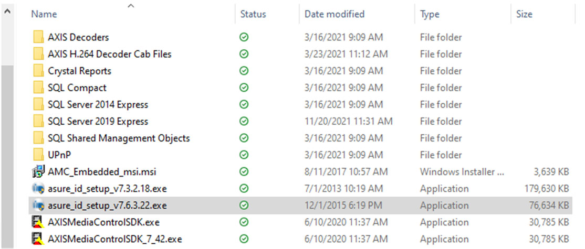

This file is provided in a folder called *Redists* located in the *StarWatch* folder installed during
*StarWatch SMS* installation.
2. Before running this file, be sure to disable the computer *McAfee* anti-virus protection. The
default password is *12DOitright!!01*.

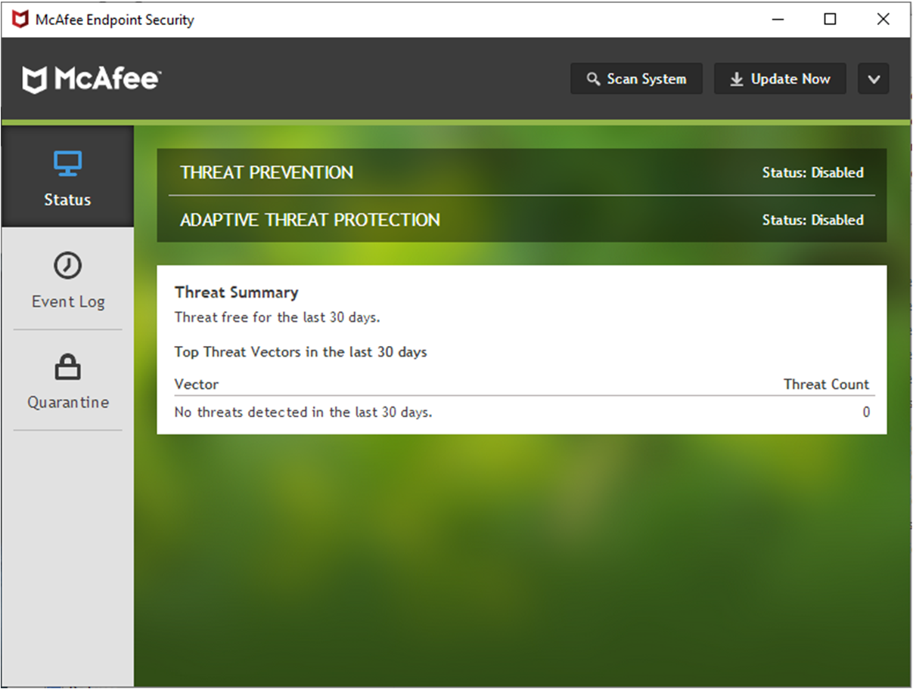

3. When running *StarWatch SMS* setup, it is possible to start the setup of *Asure ID* from within the
*StarWatch SMS* setup. Alternatively, simply run (as administrator) the
*Asure_id_setup_v7.6.3.22.exe* program.
Note:  do not use a later version as it may not integrate and function correctly within
*StarWatch SMS*.
Note:  for ICIDS 5, please also use version 7.6.3.22.
Note:  you will need to purchase a product key from DAQ Electronics or from your certified DAQ
partner or reseller.
Important: proceed with the installation of *Asure ID* on the *RSM* only if it has not been
previously installed on the current image. If already installed, please proceed to *Step 7* to run
the Connection Wizard.
4. Sequence through the installation wizard, as follows, by clicking the *Next* button on each
window until you reach the final screen:

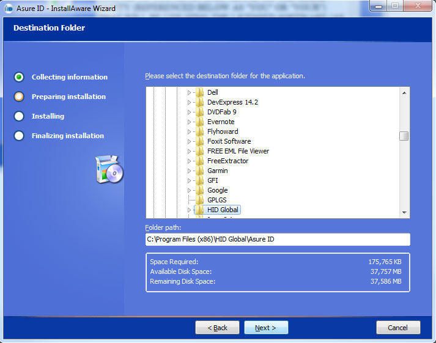

5. At this point in the process, you may be prompted to activate your license. To do so, follow the
on-screen instructions. If you are not prompted, you can activate your license later.

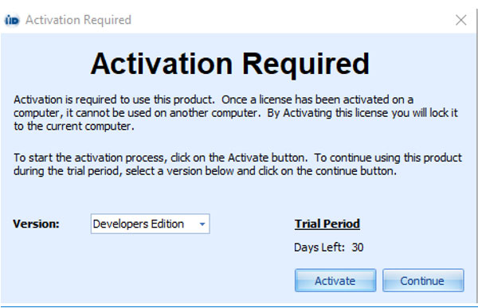

6. At the final *Asure ID* setup screen, deselect the *Run Asure ID* checkbox before clicking the
*Finish* button.

7. After installation, click on the Windows *Start* menu and navigate to *HID Global*. Next, click on
*Data* *Connection Wizard*.

8. To begin, click the *Next*, button.

9. On the *Select a* *Database Type* screen, select *Microsoft SQL Server* and click the *Next* button.

10. On the *SQL Database Connection* screen, fill in the following information and click the *Next*
button:
Server Name: this is the name of your computer SMSSERVER1\ (also in the server tab of
-
Management Console)
Initial Catalog: this is the name of your database created in Management Console
-
Schema: dbo
-
User Name: sa
-
Password: 12DOitright!!01
-

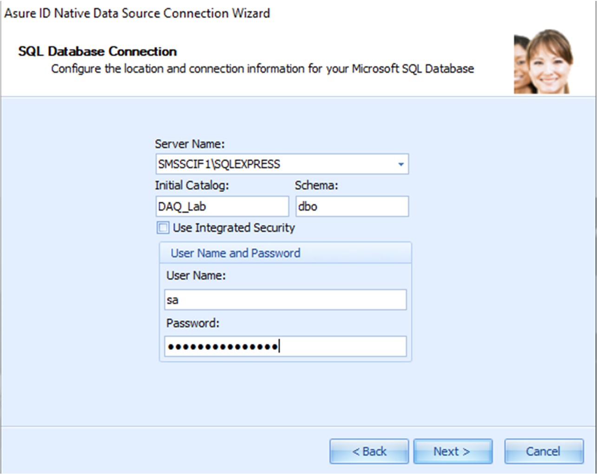

11. Click the *Test* button.

12. In the *Connection Succeeded* dialog box, click the *OK* button.
13. Click the *Finish* button.

Note: if you are having trouble connecting, try the following steps:
On the *RSM*, open *Notepad* and save as .udl onto your desktop.
-
Then close *Notepad* and open the new .udl created on your desktop.
-

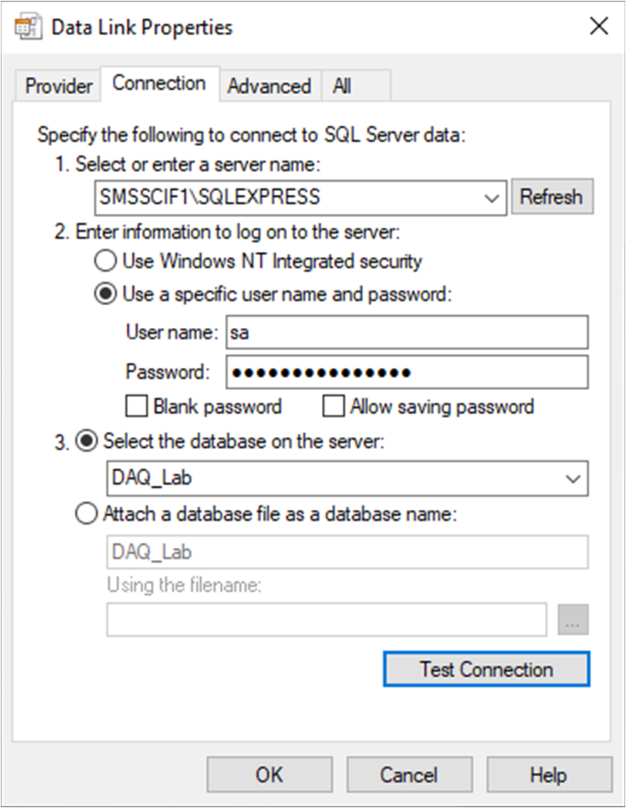

Enter your information and click *Test Connection*.
-
Use error codes to troubleshoot the connection.
-

## Activation

Important: this section should be completed for the *RSM* only.
1. To activate your product, open *Asure ID* from the Windows *Start* menu, as shown.

2. You will be prompted to activate. Fill in the *Activate License* information, as required.

## Checking Activation in StarWatch SMS

Important: this section should be completed for the *RSM* only.
To check that the *Asure ID* activation was successful, complete the following steps:
1. Open the *StarWatch SMS* operator and login.
2. Next, open the *Admin* console and navigate to the *Card Type* feature*.*
3. In the *Card Type* area, select the *Design* tab.

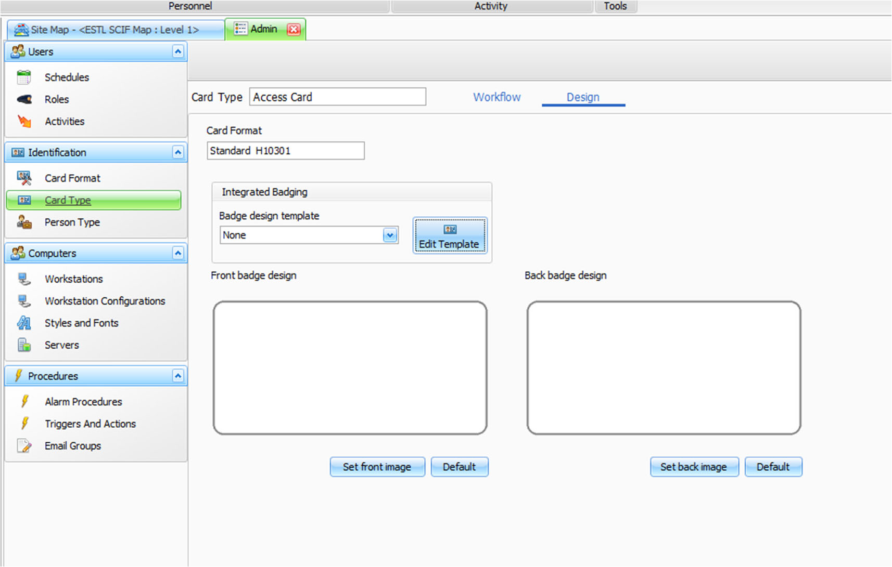

4. Click the *Edit Template* button to launch *Asure ID*.

Note: if *Asure ID* does not pop up or the *Edit Template* button is grayed out, you can run *Trace*
*Viewer* and search *Asure ID* in the logs generated. This will show what *StarWatch SMS* is seeing
associated with the start-up of *Asure ID*.
*Trace Viewer* is located in Windows (C): StarWatch>Client>SMSTraceViewer.exe. Start *Trace*
*Viewer*, click *View*, and click *Trace Operator*. Next start the *StarWatch Operator*. Read the log file
to see if there is any indication of the issue with *Asure ID*.

The following screens are from the ICIDS 5 *StarWatch SMS* product after *Asure ID* opens:

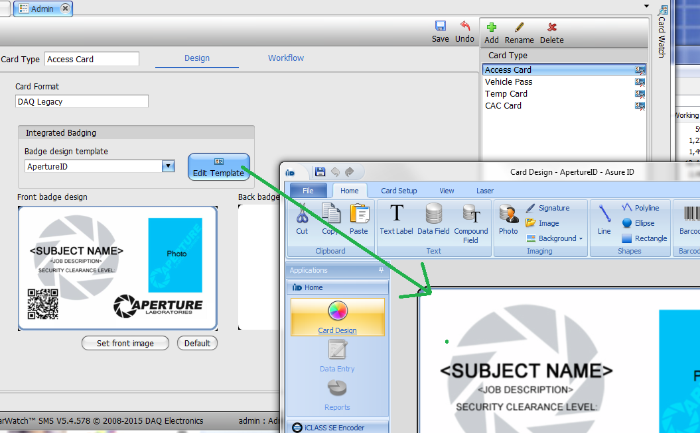

## Using Asure ID in ICIDS 5 StarWatch SMS

Using the tools available on the *Asure ID* screen, you can edit your card design.

After completing the design, be sure to save your template before closing out of *Asure ID*.
On the *Card* design page, click on the *Refresh* button.

The list of templates will be updated, and you will then be able to select the template for the required
card type.

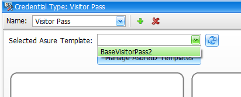

Select the new or existing template if updating modifications to the template. You should see the
updated design in the *StarWatch SMS* operator on the *Card* design page. If the card design includes a
back and front design, then both will be shown side by side.

## Asure ID Integration and Diagnostics

## Introduction

It would be helpful to have either a log of all information found via the SDK as a way to verify the
*Asure ID* installation or provide a test application that “dumps” a check list of information.

## SDK Initialization

Check the initialization and report.

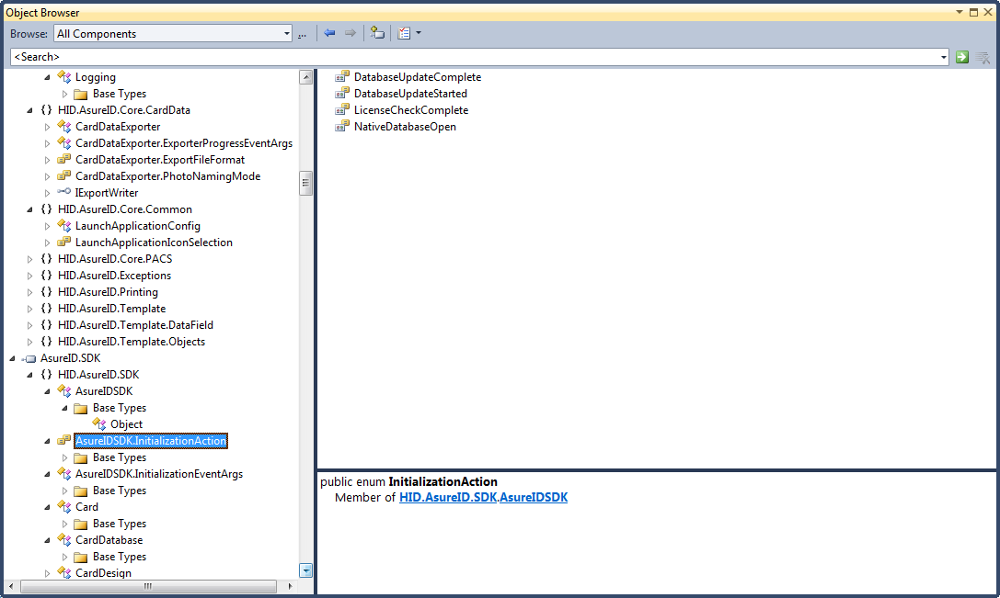

## Asure ID Installed Version

Check that the version installed is 7.6.3.22 or the version expected.

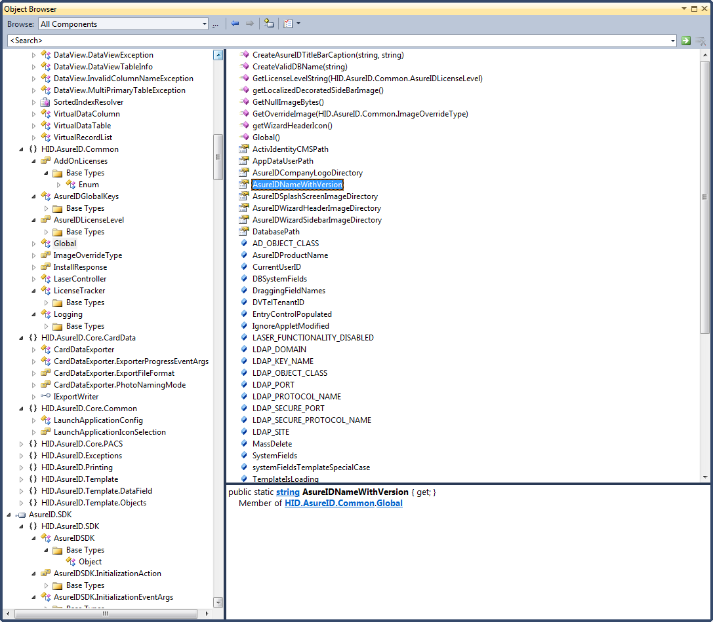

## License Level and Type

Check that the activated license is the *Developer* license.

## Data Connection

Check that *Asure ID* has a valid data connection to the database used by *StarWatch SMS* and correct the
connection if possible.

## Set Data Connection

If required, set/update the data connection (as in case of the *su* password being changed).  This can be
done when opening *Admin* or opening the view to *Admin->Card_Type* on initialization.

---

*© DAQ Electronics, LLC*
