# How to Install and Use Asure ID Badging on an RSM Connected to Your Domain

## Introduction

One or more workstations on the system will require *Asure ID* badging if you would like to:
a) Design a printable card, ID badge, or visitor pass
b) Print a card or pass
Note: not all workstations require *Asure ID* if design or printing is not needed - all workstations can
view an individual’s photo, take a photo, and view a person’s currently issued or printed card or pass.
Note: this guide should only be used for the installation of *Asure ID* on an *RSM* connected to your
domain.
Note: several of the *Asure ID* installation steps outlined in this guide will need to be completed on both
the *Application Server* and the *RSM* (as indicated in the procedures) – for steps that need to be
completed for both, please begin with those needed for the *Application Server*, then move on to the
*RSM*.

## Windows Services

Important: this section should be completed for the *Application Server* only.
To begin, it is important to ensure that the *SQL Server Browser* is running.
1. Using the *Start* menu, type “windows services” in the search function and then select the
*Services* icon.

This will call up the *Services* window.

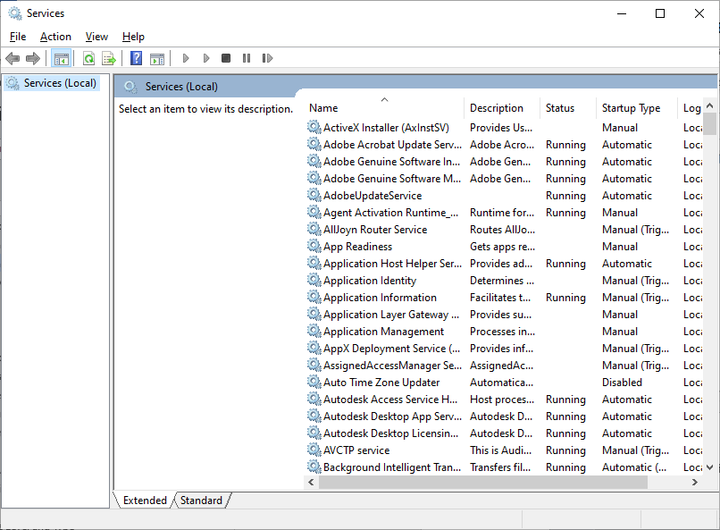

2. On the right side of the editor, scroll down to find and select the *SQL Server* Browser option.

3. Right-click on the selected option and choose *Properties* from the drop-down menu. This will
call up the settings window for the *SQL Server Browser* option.

4. On the *General* tab, check that the *Service Status* indicates that the SQL Server is *Running*. If it
is not running, click the *Start* button followed by the *OK* button. If the service is disabled,
choose *Automatic*, then refresh the screen and start the service.
5. Close out of the *Services* editor.

## Windows Security Policy

Important: this section should be completed for the *RSM* only.
Before installing *Asure ID*, you must check the security policy settings in Windows to make sure that
the following option is disabled:
*System cryptography: Use FIPS compliant algorithms for encryption, hashing, and signing*
HID does not allow or support this option, and it will cause *Asure ID* to fail or crash if enabled.
1. Using the *Start* menu, type “edit group policy” in the search function and then select the *Edit*
*group policy* icon.

This will call up the *Local Group Policy Editor* window.

2. Using the directory tree on the left side of the editor, navigate to:
*Local Computer Policy/Computer Configuration/Windows Settings/Security*

## Settings/Local Policies/Security Options

3. On the right side of the editor, scroll down to find and select the *System cryptography* option
relating to FIPS compliant algorithms.
4. Right-click on the selected option and choose *Properties* from the drop-down menu. This will
call up the settings window for the *System cryptography* option.

5. On the *Local Security Setting* tab, set the option to *Disabled* and hit the *OK* button.
6. Close out of the editor.

## Registry Editor

Important: this section should be completed for the *Application Server* and the *RSM*.
Next, you need to turn off *FIPS Cryptography* in the *Registry Editor*.
1. Using the *Start* menu, type “run” in the search function and then select the *Run* icon.

This will call up the *Run* dialog box.

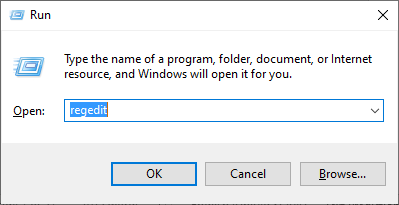

2. Type “regedit” into the dialog box and click the *OK* button.
This will call up the *Registry Editor* window.

3. Using the directory tree on the left side of the editor, navigate to:
*HKEY_LOCAL_MACHINE/System/CurrentControlSet/Control/Lsa/FIPSAlgorithmPolicy/*

## Enabled

4. Change the value of this registry entry to 0 to disable it.

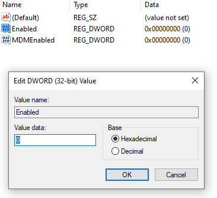

5. Close out of the editor.
6. Repeat this procedure for the second machine (the *Application Server* or *RSM*).

## ISS Crypto GUI Tool

Important: this section should be completed for the *Application Server* and the *RSM*.
To run properly, *Asure ID* requires that a set of specified Windows options are enabled, including
client/server protocols, ciphers, hashes, and key exchange algorithms.
1. For this section, you will need to utilize the *IIS Crypto GUI* program. If it is not already on your
machine, please visit *www.nartec.com* to download and install this free application.
2. Once installed, launch the application by right-clicking on the file and selecting *Run as*
*administrator* from the menu.

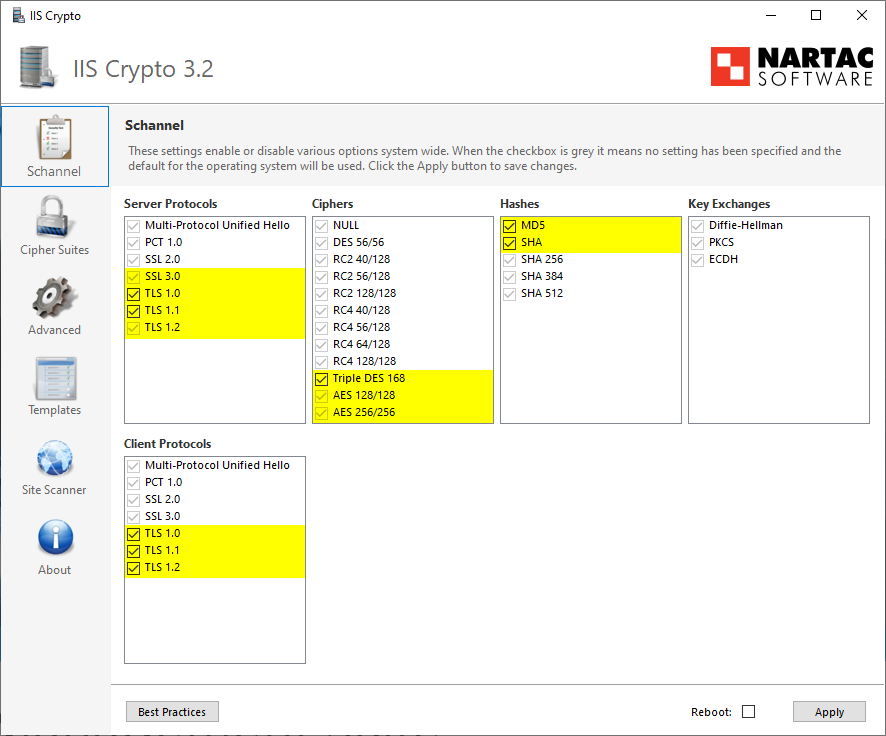

3. On the *Schannel* tab, enable/disable the various options, as shown, and click the *Apply* button.

## Server Firewall Rules

Important: this section should be completed for the *Application Server* only.
When using *Microsoft SQL Server*, the TCP access port is allocated dynamically. You will need to add
two *Port-type* rules to control connections for your TCP ports, as shown for *SQL Server 2019*. Later, you
will also need to create a *Program-type* rule and browse to the *sqlserv.exe* program.
1. Using the *Start* menu, type “run” in the search function and then select the *Run* icon.

This will call up the *Run* dialog box.

2. Type “WF.msc” into the dialog box and click the *OK* button.
This will call up the *Windows Defender Firewall with Advanced Security* window.

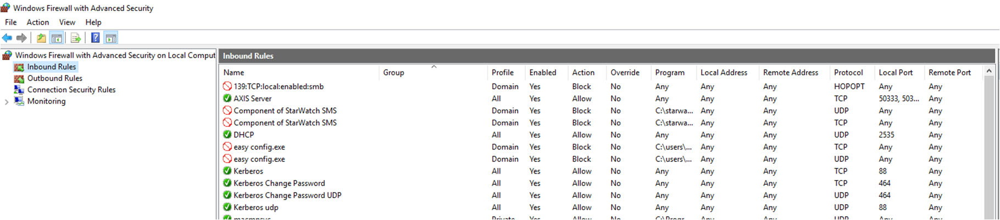

3. In the left pane, right-click on the *Inbound Rules* option and then select *New Rule* from the
*drop-down menu*.
This will call up the *New Inbound Rule Wizard*.

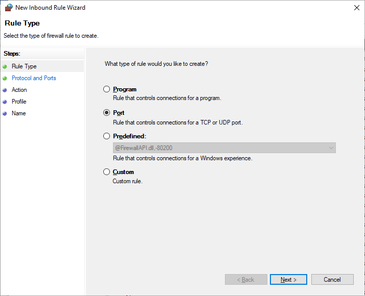

4. Select the *Port* tick-box from the *Rule Type* list and then click the *Next* button.

5. In the *Protocol and Ports* dialog box, select *TCP*.
6. Next, select the *Specific local ports* option, and type the port number of the instance of the
Database Engine, such as 1433, for the default instance. Once complete, click the *Next* button.

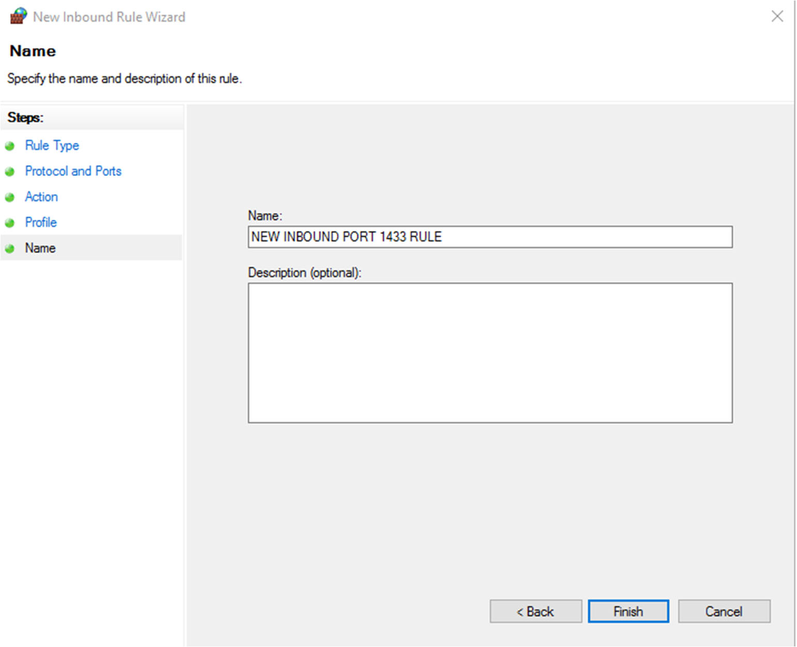

7. In the *Action* dialog box, select *Allow the connection* and then click *Next*.

8. In the *Profile* dialog box, select *Domain* only and then click *Next*.

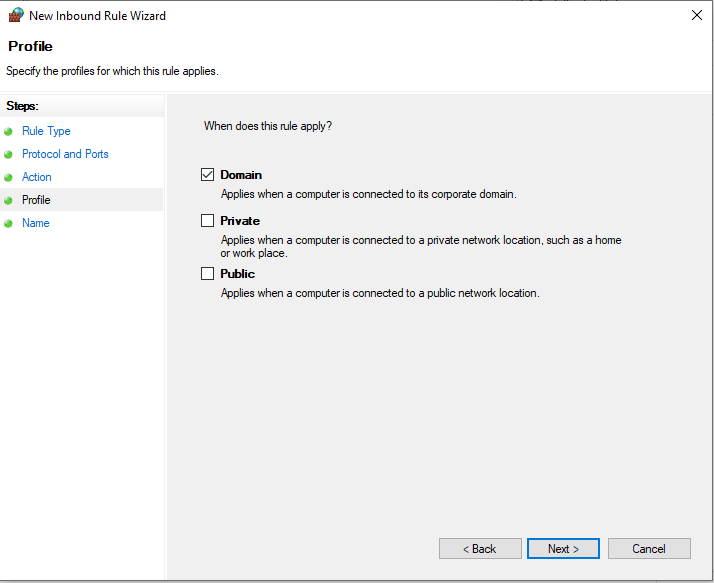

9. In the *Name* dialog box, type a name and description for this rule, and then click *Finish*.

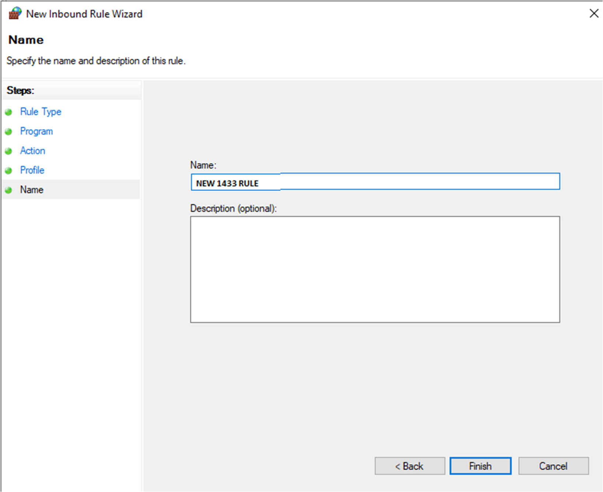

10. You now need to repeat this process for port 1434 to facilitate discovery of the *SQL* instance.

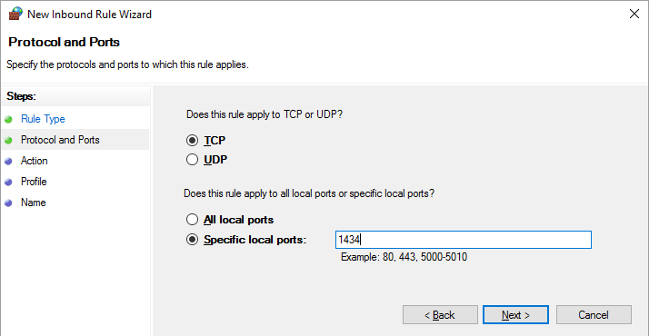

To do this, repeat steps 7, 8, and 9 from this procedure. Starting in the *Windows Defender*
*Firewall with Advanced Security* window, follow the same sequence of steps, but this time type
“1434” in the *Specific local ports* option on the *Protocol and Ports* screen.

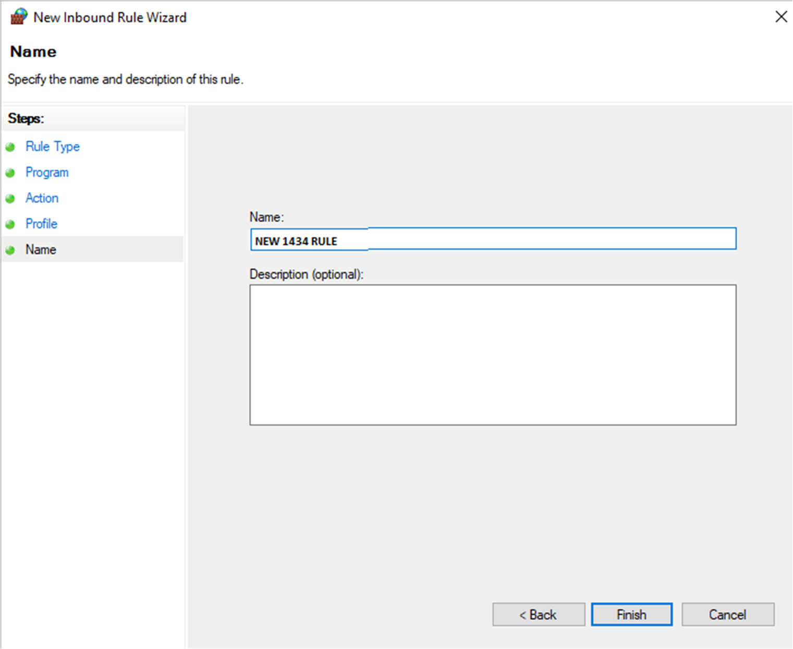

11. Next, you need to add a *Program-type* rule and browse to the *sqlserv.exe* program. To begin
this process, return to the *New Inbound Rule Wizard* screen.
In the left pane, right-click on the *Inbound Rules* option and then select *New Rule* from the
drop-down menu.

12. This time, select the *Program* tick-box from the *Rule Type* list and then click the *Next* button.

13. In the *Program* window, select the *This program path* tick-box and then click the *Browse*
button.

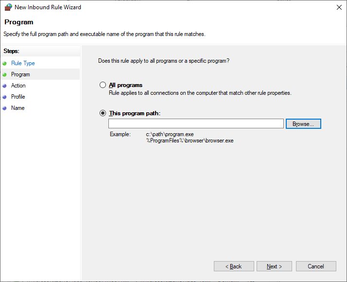

This will call up the *Open* window.

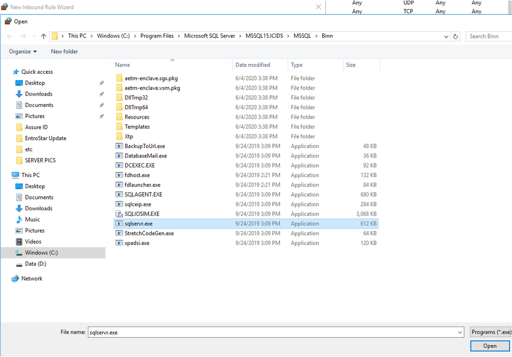

14. Using the directory tree, navigate to:
*Program Files/Microsoft SQL Server/MSSQL15.ICIDS/MSSQL/Binn*
15. Select *sqlsever.exe* from the directory and click the *Open* button.
16. Click *Next* to go to the *Action* window.

17. In the *Action* window, select the *Allow the connection* tick-box and click the *Next* button.

18. In the *Profile* window, only select the *Domain* tick-box and click the *Next* button.

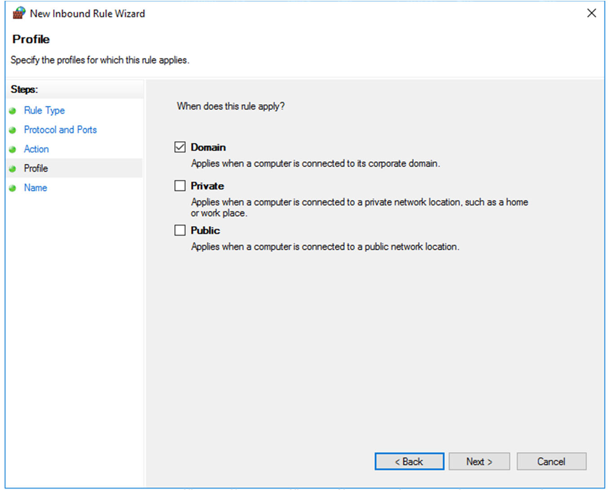

19. In the *Name* window, enter a name for the rule in the *Name* field and click the *Finish* button.

## Run Installation Wizard

Important: this section should be completed for the *RSM* only.
Once all previous steps have been completed, you can install *Asure ID* if not already installed on your
RSM.
1. When installing a new workstation using the *StarWatch SMS* media, you must check that you
have the current *asure_id_setup* file available.

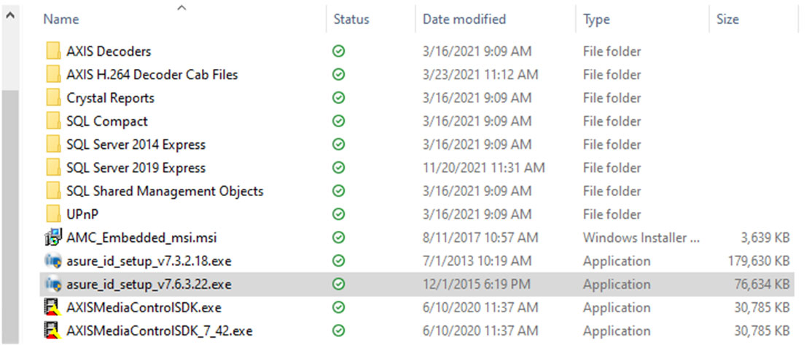

This file is provided in a folder called *Redists* located in the *StarWatch* folder installed during
*StarWatch SMS* installation.
2. Before running this file, be sure to disable the computer *McAfee* anti-virus protection. The
default password is *12DOitright!!01*.

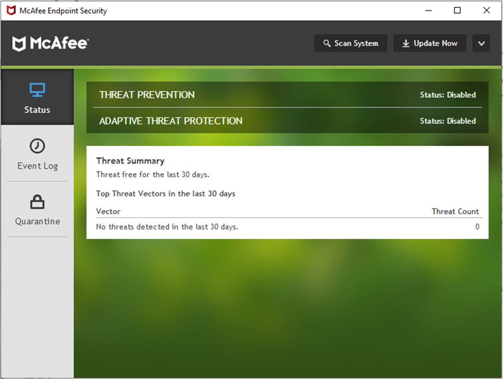

3. When running *StarWatch SMS* setup, it is possible to start the setup of *Asure ID* from within the
*StarWatch SMS* setup. Alternatively, simply run (as administrator) the
*Asure_id_setup_v7.6.3.22.exe* program.
Note:  do not use a later version as it may not integrate and function correctly within
*StarWatch SMS*.
Note:  you will need to purchase a product key from DAQ Electronics or from your certified DAQ
partner or reseller.
Important: proceed with the installation of *Asure ID* on the *RSM* only if it has not been
previously installed on the current image. If already installed, please proceed to *Step 7* to run
the Connection Wizard.
4. Sequence through the installation wizard, as follows, by clicking the *Next* button on each
window until you reach the final screen:

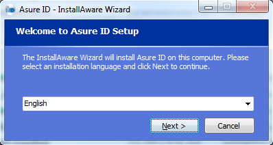

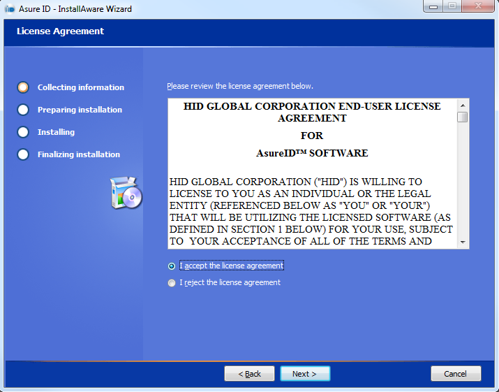

5. At this point in the process, you may be prompted to activate your license. To do so, follow the
on-screen instructions. If you are not prompted, you can activate your license later.

6. At the final *Asure ID* setup screen, deselect the *Run Asure ID* checkbox before clicking the
*Finish* button.

7. After installation, click on the Windows *Start* menu and navigate to *HID Global*. Next, click on
*Data* *Connection Wizard*.

8. To begin, click the *Next*, button.

9. On the *Select a* *Database Type* screen, select *Microsoft SQL Server* and click the *Next* button.

10. On the *SQL Database Connection* screen, fill in the following information and click the *Next*
button:
Server Name: this is the name of your computer SMSSERVER1\ (also in the server tab of
-
Management Console)
Initial Catalog: this is the name of your database created in Management Console
-
Schema: dbo
-
User Name: sa
-
Password: 12DOitright!!01
-

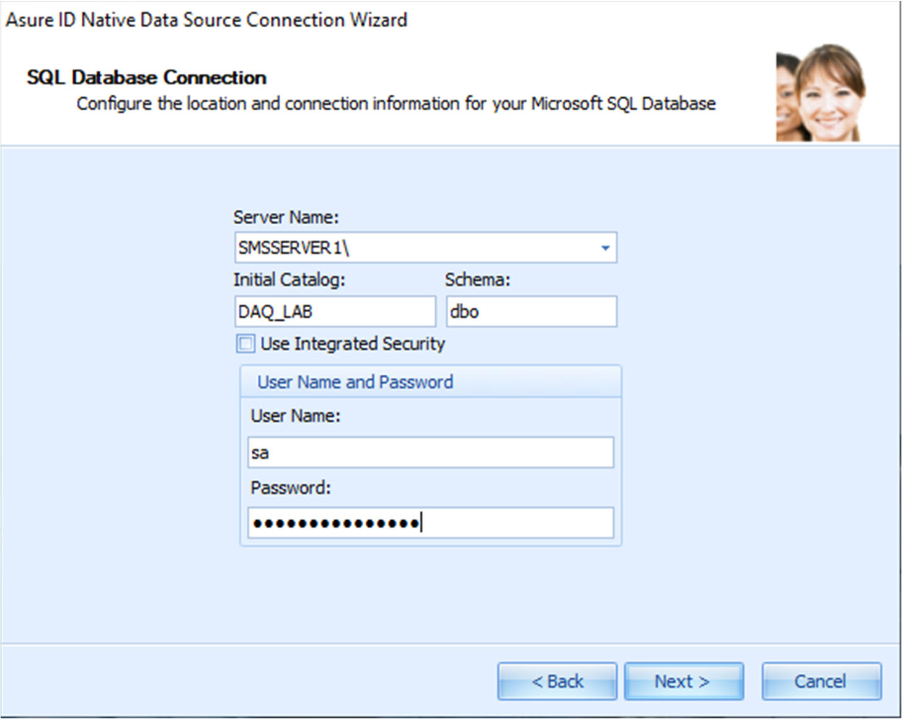

11. Click the *Test* button.

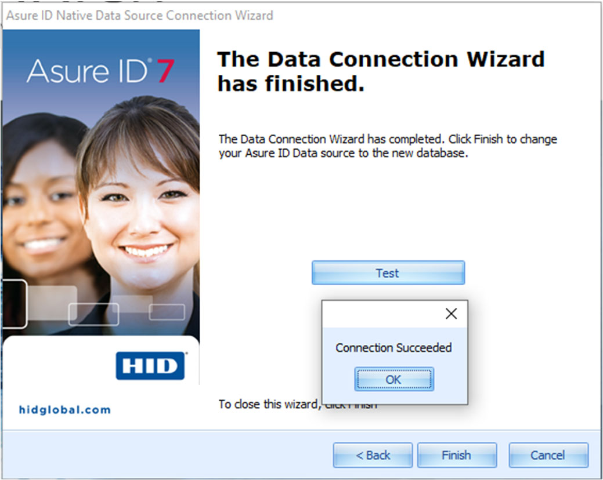

12. In the *Connection Succeeded* dialog box, click the *OK* button.
13. Click the *Finish* button.

## Activation

Important: this section should be completed for the *RSM* only.
1. To activate your product, open *Asure ID* from the Windows *Start* menu, as shown.

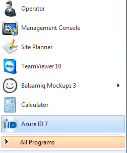

2. You will be prompted to activate. Fill in the *Activate License* information, as required.

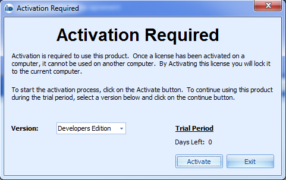

## Checking Activation in StarWatch SMS

Important: this section should be completed for the *RSM* only.
To check that the *Asure ID* activation was successful, complete the following steps:
1. Open the *StarWatch SMS* operator and login.
2. Next, open the *Admin* console and navigate to the *Card Type* feature*.*
3. In the *Card Type* area, select the *Design* tab.

4. Click the *Edit Template* button to launch *Asure ID*.

The following screens are from the ICIDS 5 *StarWatch SMS* product after *Asure ID* opens:

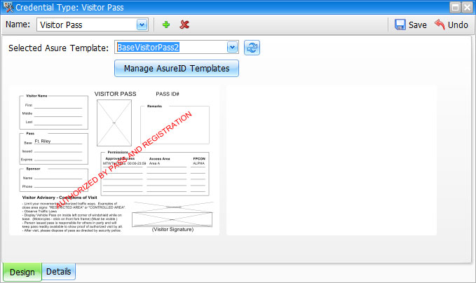

## Using Asure ID in ICIDS 5 StarWatch SMS

Using the tools available on the *Asure ID* screen, you can edit your card design.

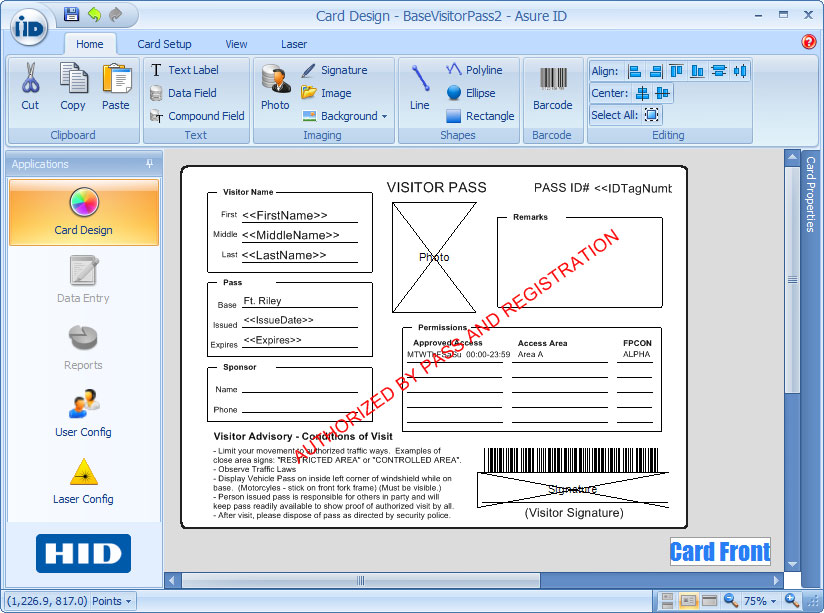

After completing the design, be sure to save your template before closing out of *Asure ID*.
On the *Card* design page, click on the *Refresh* button.

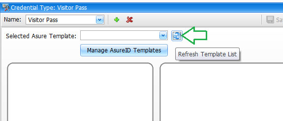

The list of templates will be updated, and you will then be able to select the template for the required
card type.

Select the new or existing template if updating modifications to the template. You should see the
updated design in the *StarWatch SMS* operator on the *Card* design page. If the card design includes a
back and front design, then both will be shown side by side.

## Asure ID Integration and Diagnostics

## Introduction

It would be helpful to have either a log of all information found via the SDK as a way to verify the
*Asure ID* installation or provide a test application that “dumps” a check list of information.

## SDK Initialization

Check the initialization and report.

## Asure ID Installed Version

Check that the version installed is 7.6.3.22 or the version expected.

## License Level and Type

Check that the activated license is the *Developer* license.

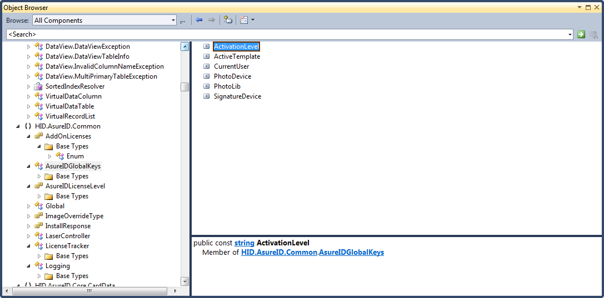

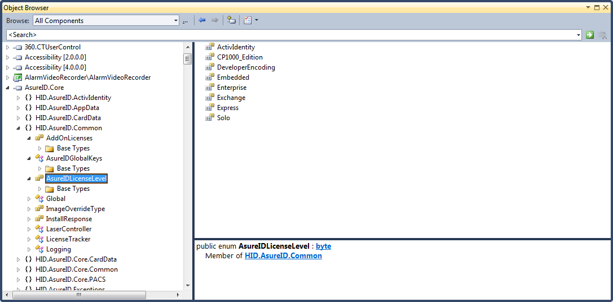

## Data Connection

Check that *Asure ID* has a valid data connection to the database used by *StarWatch SMS* and correct the
connection if possible.

## Set Data Connection

If required, set/update the data connection (as in case of the *su* password being changed).  This can be
done when opening *Admin* or opening the view to *Admin->Card_Type* on initialization.

---

*© DAQ Electronics, LLC*
