# How to Install and Use Asure ID Badging

## Introduction

One or more workstations on the system will require *Asure ID* badging if you would like to:
a) Design a printable card, ID badge, or visitor pass
b) Print a card or pass
Note:  Not all workstations require *Asure ID* if design or printing is not needed. All workstations can
view an individual’s photo, take a photo, and also view the person’s currently issued or printed card or
pass.

## Windows Security Policy

Before installing *Asure ID*, you must check the security policy settings in Windows and make sure that
the following option is disabled. HID does not allow or support this option and it will cause *Asure ID* to
fail or crash.

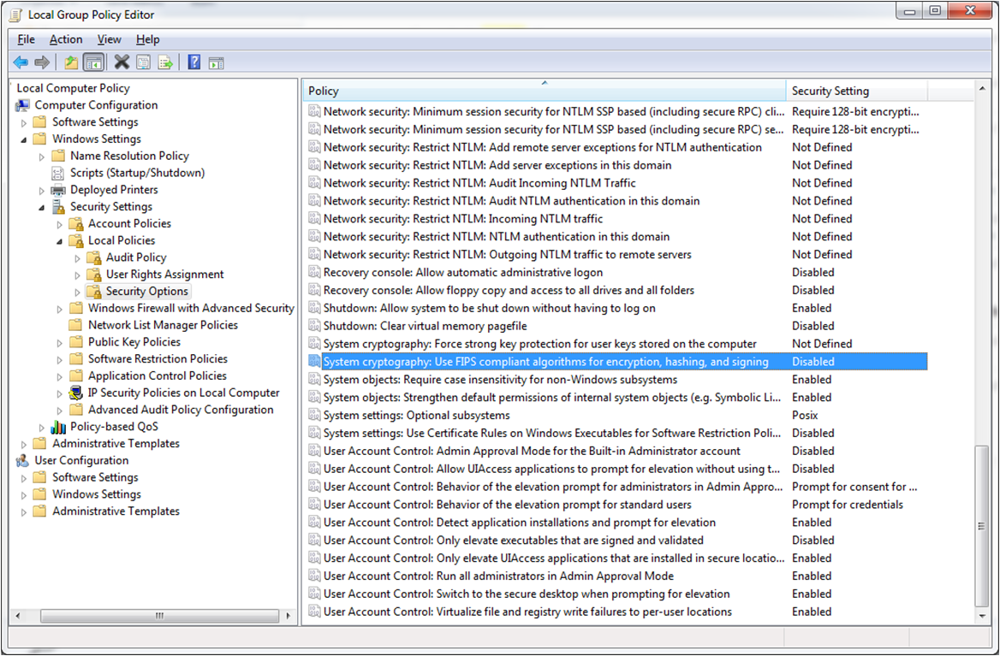

## Server Firewall Rules

*Asure ID* requires access to *SQL Server* directly from remote workstations. To facilitate this connection,
the following ports must be accessible via the firewall:
1. On the *Start* menu, click *Run*, type *WF.msc*, and then click *OK*.
2. In the *Windows Firewall* with *Advanced Security*, in the left pane, right-click *Inbound Rules*,
and then click *New Rule* in the *Action* pane.
3. In the *Rule Type* dialog box, select *Port*, and then click *Next*.
4. In the *Protocol and Ports* dialog box, select *TCP*. Select *Specific local ports*, and then type the
port number of the instance of the Database Engine, such as 1433 for the default instance.
Click *Next*.

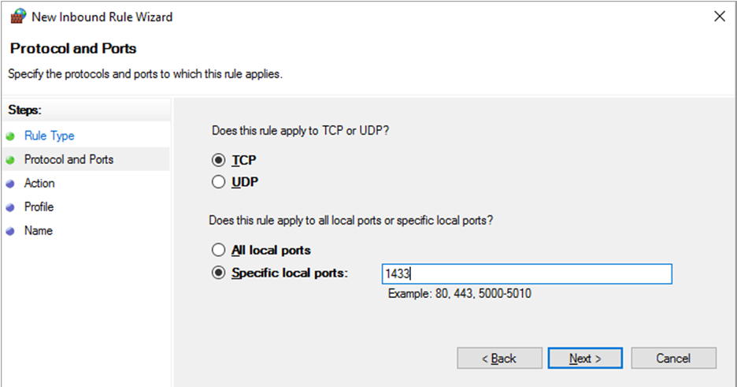

5. In the *Action* dialog box, select *Allow the connection*, and then click *Next*.
6. In the *Profile* dialog box, select any profiles that describe the computer connection
environment when you want to connect to the Database Engine, and then click Next.
7. In the *Name* dialog box, type a name and description for this rule, and then click *Finish*.
Now repeat this action for port 1434 (this facilitates discovery of the SQL instance).

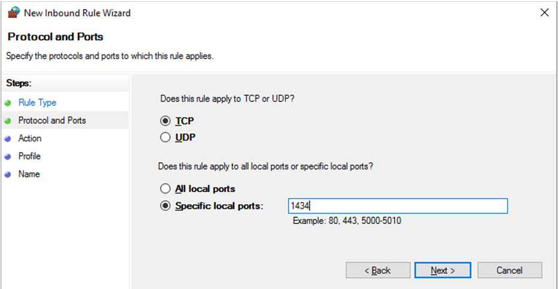

When using *SQL Express*, the TCP access port is allocated dynamically and you will need to add a
program type rule and browse to the *sqlserv.exe* program as shown for *SQL Express 2014*.

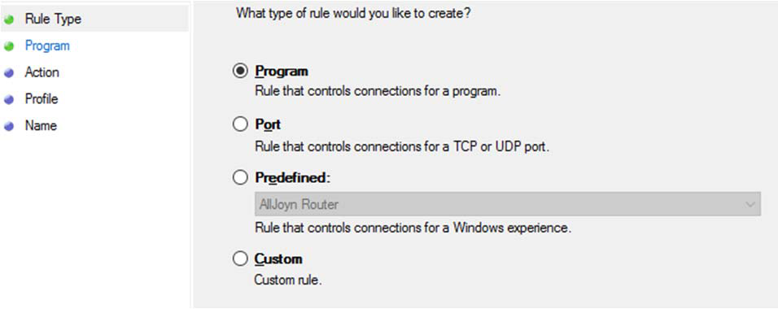

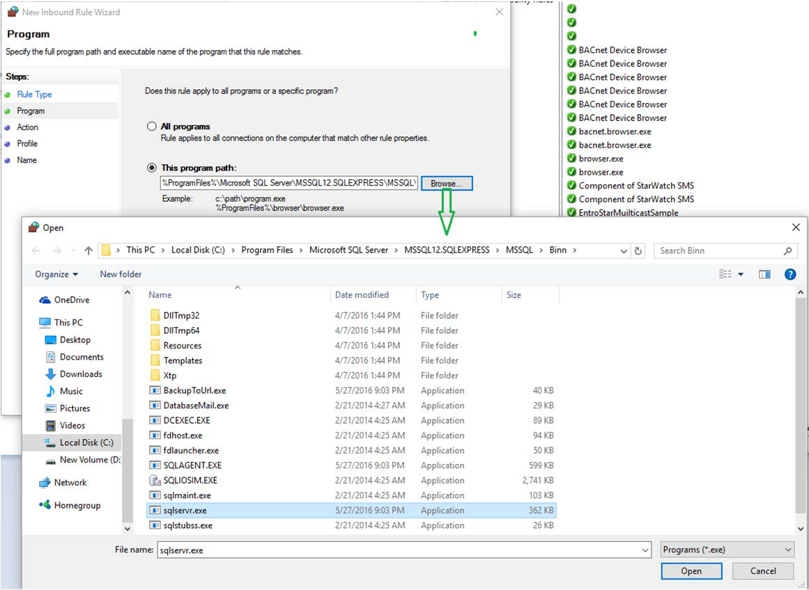

## Support Version ICIDS 4/ICIDS 5

When installing a new workstation using the *StarWatch SMS* media, you must check that you have the
following file available.

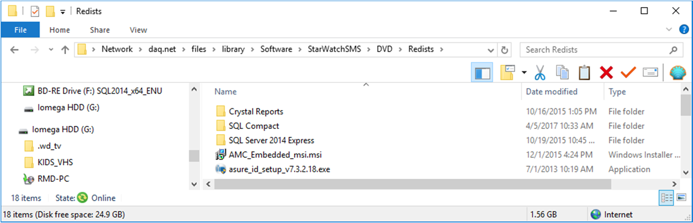

This file is usually provided in a folder called *Redists*.
When running *StarWatch SMS* setup, it is possible to start the setup of *Asure ID* from within the
*StarWatch SMS* setup.  Alternatively, simply run (as administrator) the program above, shown as version
7.3.2.18 for ICIDS 4.
For ICIDS 5, please use the version labeled as 7.6.3.22.
Note:  Do not use a later version as it may not integrate and function correctly within *StarWatch SMS*.

## Product Key

You will need to purchase a product key from DAQ Electronics or your distributor channel that is a
certified DAQ partner or reseller.

## Installation

Install as follows:

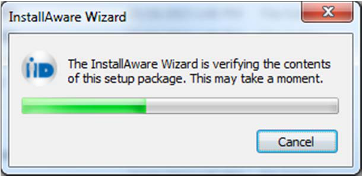

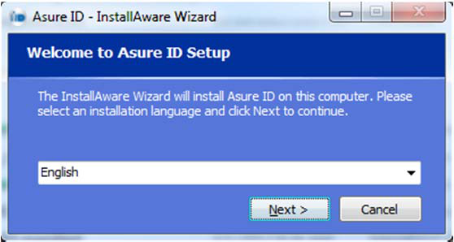

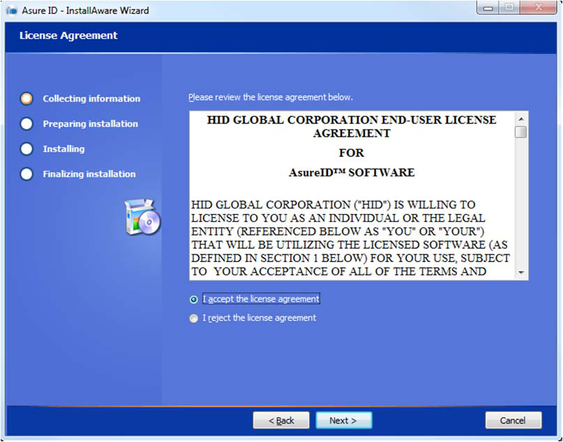

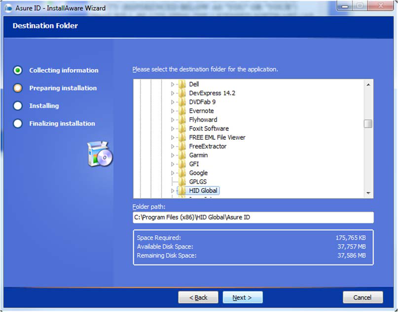

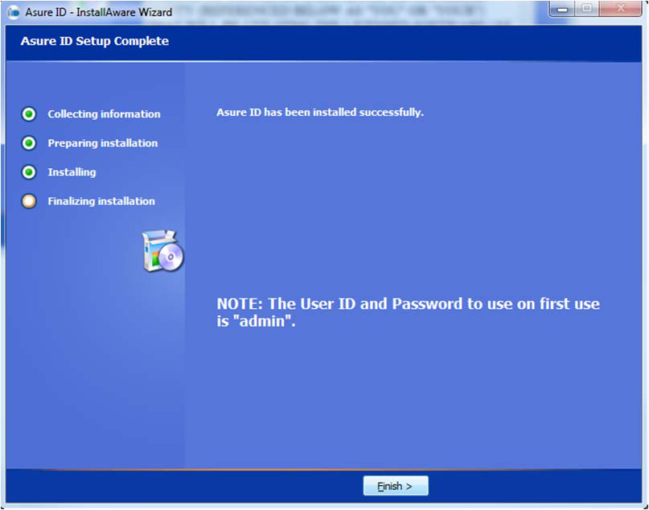

## Activation

To activate your product, you must open *Asure ID* from the Windows *Start* menu, as shown.

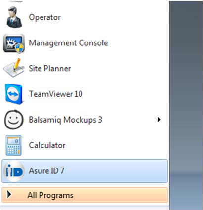

Next, you will be prompted to activate.

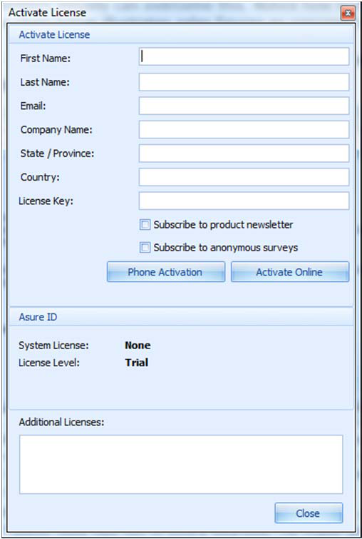

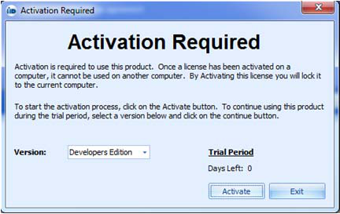

## Checking Activation

Close the *StarWatch SMS* operator, restart, and login. Next, from *Card Setup*, you should be able to
access the *Asure ID* designer from the *Card Type* setup.
The following screen is from the ICIDS 4 *StarWatch SMS* product:

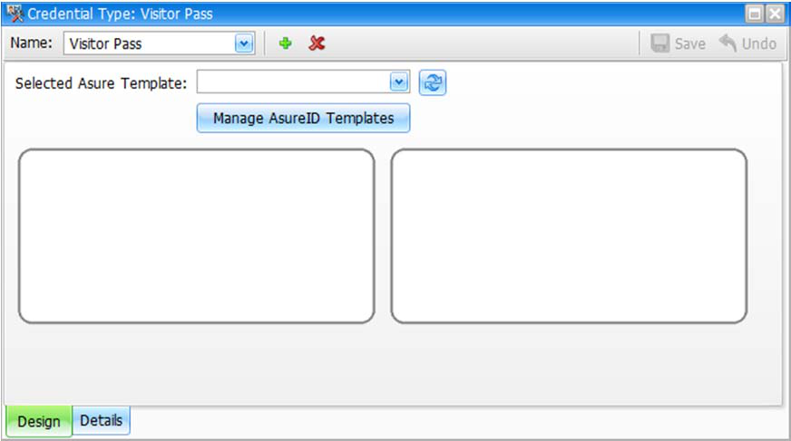

The following screen is from the ICIDS 5 *StarWatch SMS* Product:

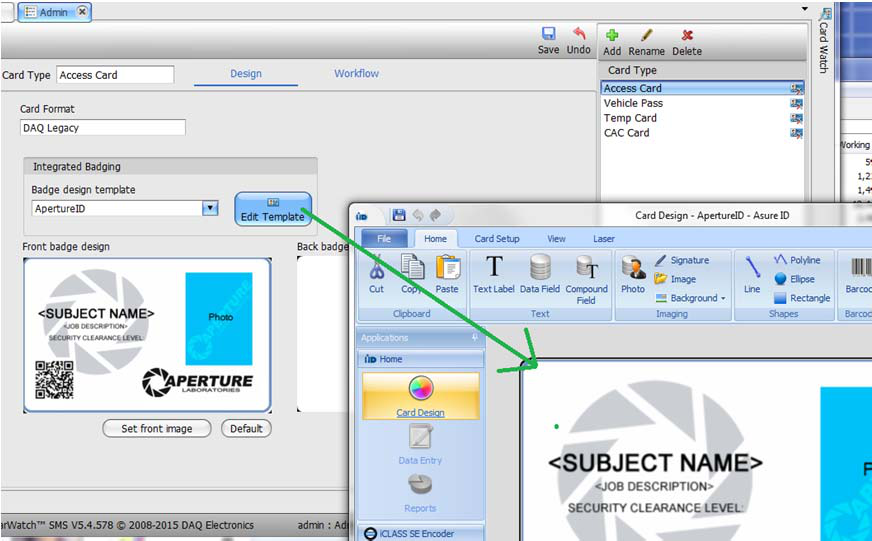

## Using Asure ID in ICIDS 5 StarWatch SMS

From the *Card Type* page, click on *Edit Template* to start editing the selected design in *Asure ID.*

## Using Asure ID in ICIDS StarWatch 4 SMS

From the *Card* setup, click on the *Design* tab and you will see that initially no template is selected for
*Asure ID*.  Click on *Manage Asure ID Templates* to start *Asure ID*.
When *Asure ID* is open, click on the *Start* button in the top-left of the *Asure ID* designer and select *New*
*Template*. Alternately, if you were provided with a template design for your site, use the
*Import/Export* menu and select *Import Template from File*.  A template design can be ordered from
DAQ and provided as an “xtp” file.
Shown below is an example visitor pass created as a template in *Asure ID*.

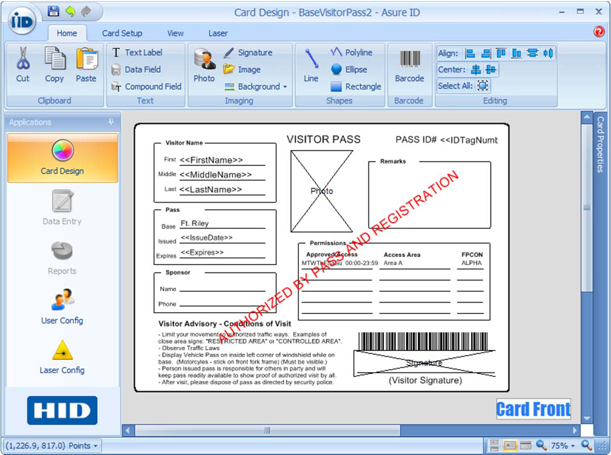

After completing the design, save the template and close out of *Asure ID*.
Next, click on the *Refresh* button in the *Card* design page.

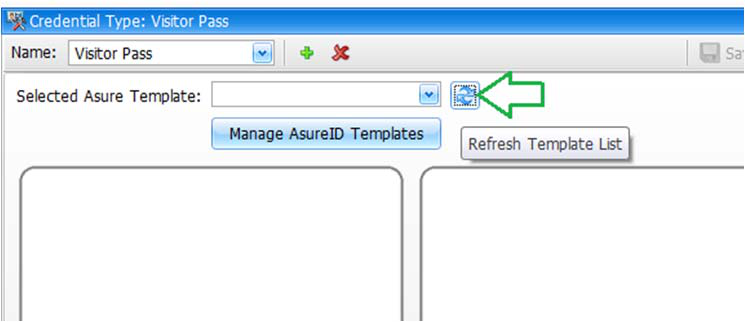

The list of templates will be updated, and you will then be able to select the required template for the
required card type.

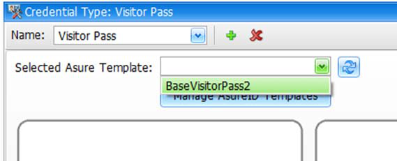

Select the new or existing template (if updating modifications to the template).
You should see the updated design in the *StarWatch SMS* operator on the *Card* design page.  If the card
design includes a back and front design, then both will be shown side by side.

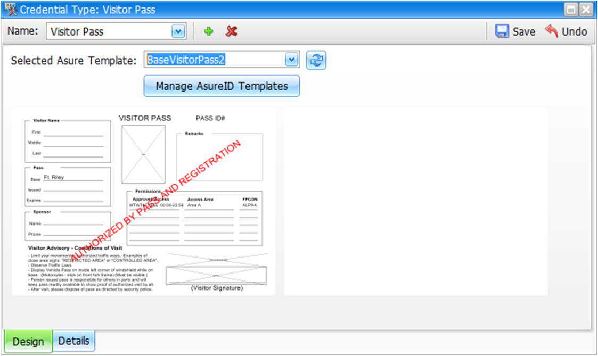

## Asure ID Integration and Diagnostics

Introduction
It would be helpful to have either a log of all information found via the SDK as a way to verify the
*Asure ID* installation or provide a test application that “dumps” a check list of information.

## SDK Initialization

Check the initialization and report.

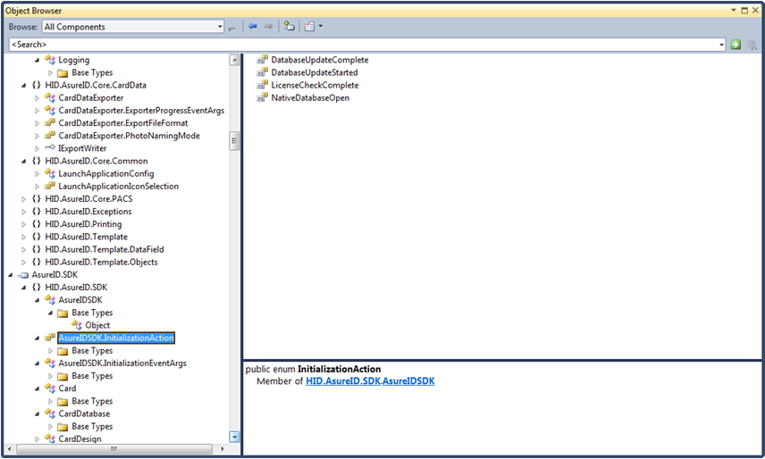

## Asure ID Installed Version

Check that the version installed is 7.6.3.22 or the version expected.

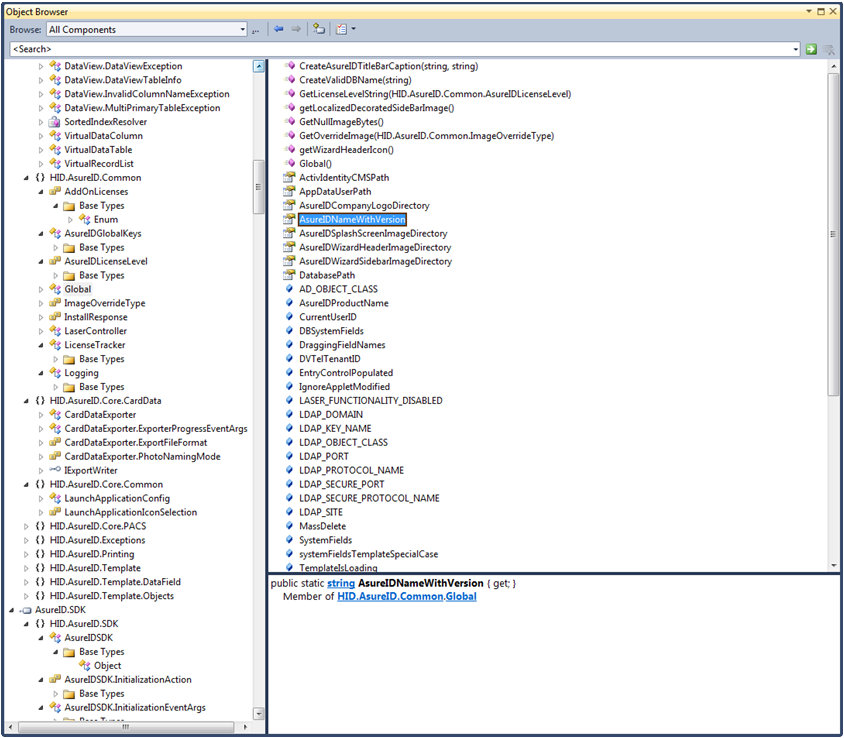

## License Level and Type

Check that the activated license is the *Developer* license.

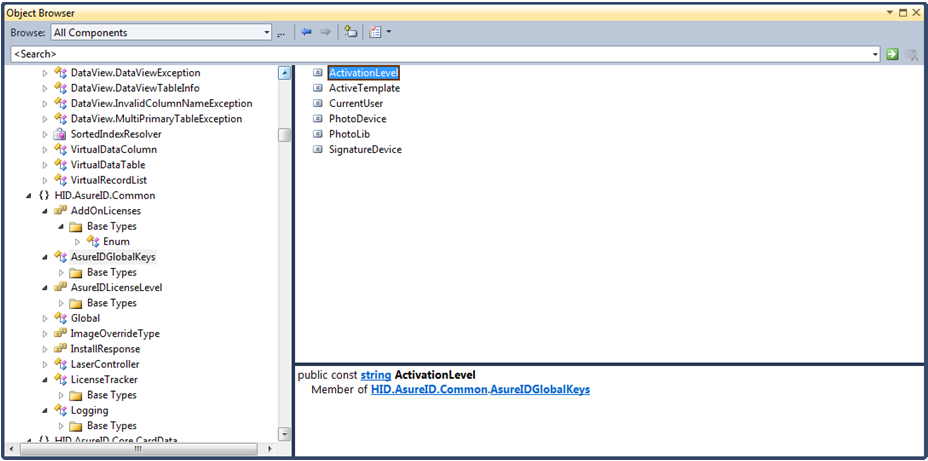

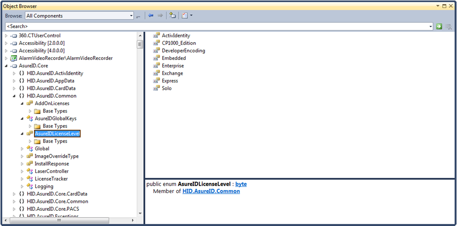

## Data Connection

Check that *Asure ID* has a valid data connection to the database used by *StarWatch SMS* and correct the
connection if possible.

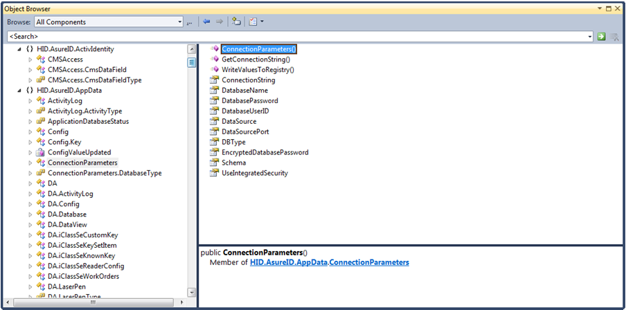

## Set Data Connection

If required, set/update the data connection (as in case of the *su* password being changed).  This can be
done when opening *Admin* or opening the view to *Admin->Card_Type* on initialization.

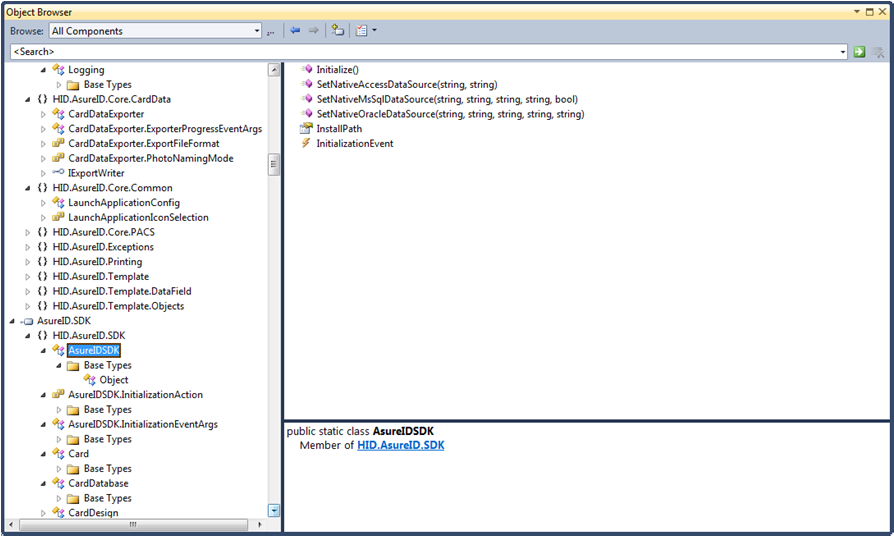

---

*© DAQ Electronics, LLC*
