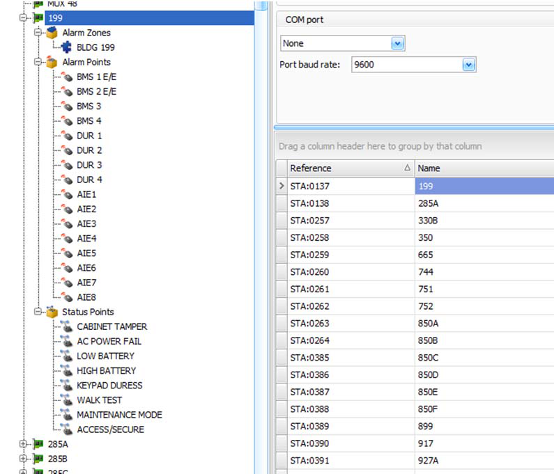
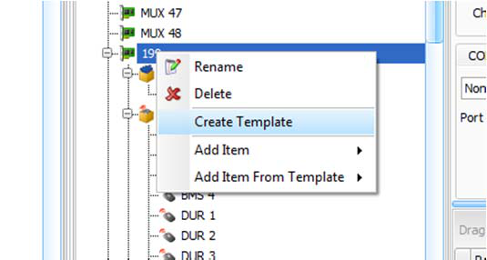
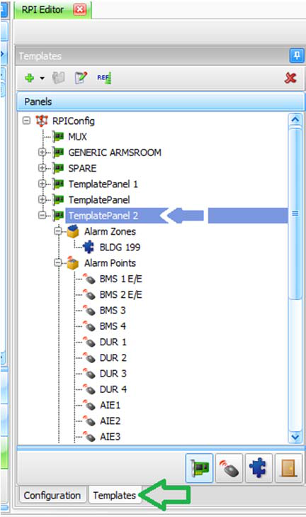
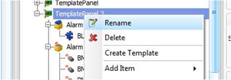
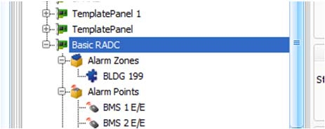
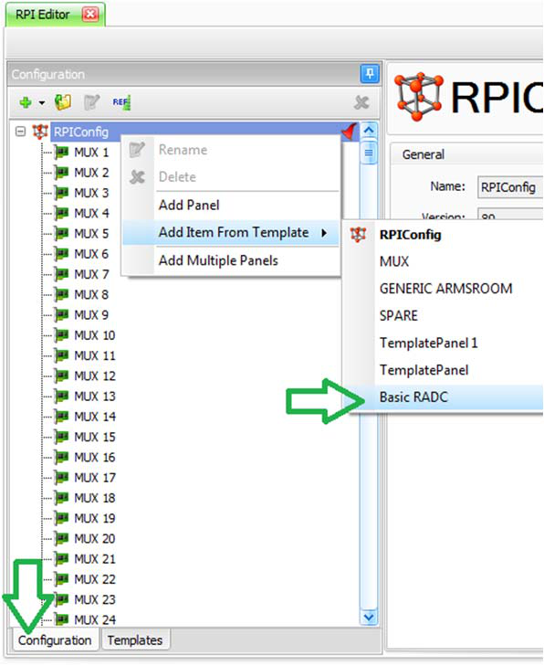

# How to Make and Use RPI Templates

## Introduction

This is a quick guide to making an RPI template and using the template to create new stations.

### Step 1 – Create a station and points

Using the *RPI Editor*, make your station, zone, and points. This station, called “199”, has one alarm
zone, 16 alarm points, and some housekeeping status points.

### Step 2 – Create the template

Create the template by right-clicking on the station and selecting the *Create Template* option from the
drop-down menu.

### Step 3 – Review the template

Click on the *Templates* tab to see the available templates, including the new template.

### Step 4 – Rename the new template

Right-click on the newly created template and give it a useful name by choosing the menu option
*Rename*.

### Step 5 – Use the template

To use the template, go back to the configuration by clicking on the *Configuration* tab. From the top,
right-click to choose the menu option *Add Item from Template* and select the newly created template.
You should now have a new station that can be renamed, as required.

---

*© DAQ Electronics, LLC*
