# How to Manually Update EntroStar Firmware

Warning: this reset should only be performed if specifically instructed to do so by DAQ

## Step 1- Unzip supplied update file

Unzip *EntroStarFirmWare.x.x.x.zip* to any folder.

## Step 2 – Determine EntroStar panel IP address

Using *BACNET* browser or *wireshark*, find out the address of your EntroStar panel.

## Step 3 – Login to EntroStar with WinSCP

Use the *WinSCP.exe* program to connect to the EntroStar panel as shown below using:
Username:
*root*
Password:
*sooperrute*
Make sure you have the protocol selected as *SCP*.

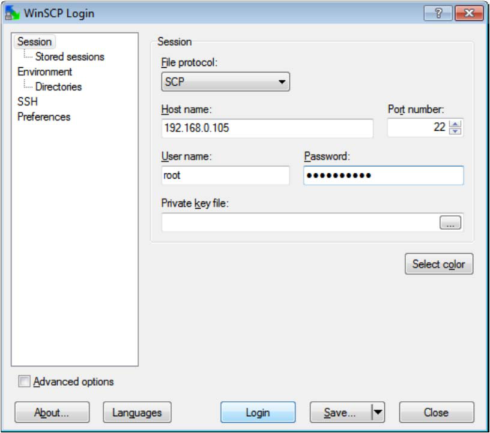

Click on *Login* to login and say *Yes* or *OK* to any reported errors about security, keys, or folders.

For example:.

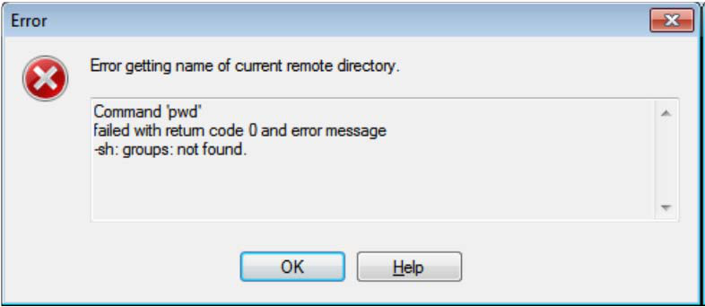

## Step 4 – Copy firmware files to the EntroStar panel

a) Make sure that the folder selected on the left side is the *Firmware* folder contents as supplied
in the zipped update file and extracted to your own folder.
b) Make sure that the folder selected on the right side is the *tmp* folder in the EntroStar panel.

c) Carefully select all the files on the left side including the file *install.sh* and drag them to the
folder called *entrostarupgradefiles* on the right side.

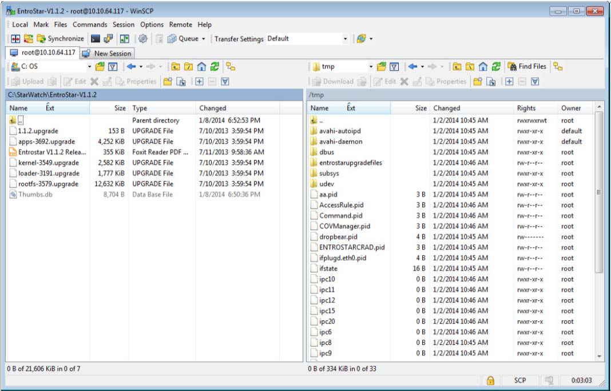

d) This should present a dialog as follows asking for confirmation prior to copying the files:

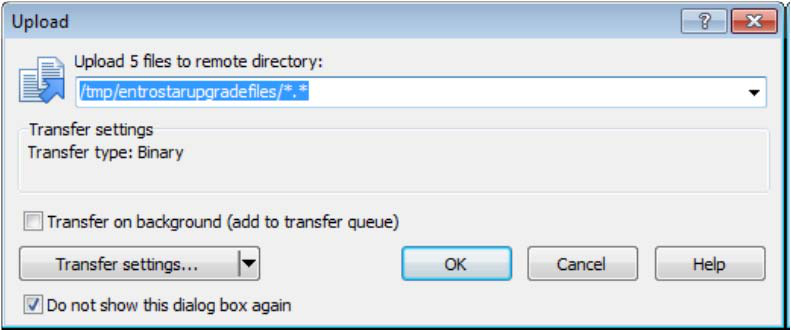

Click *OK* and the files should start copying.

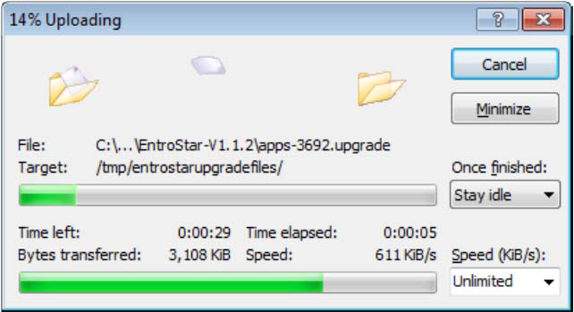

After the files have copied, you should be able to see the files as shown in the folder
*entrowatchupgradefiles*.

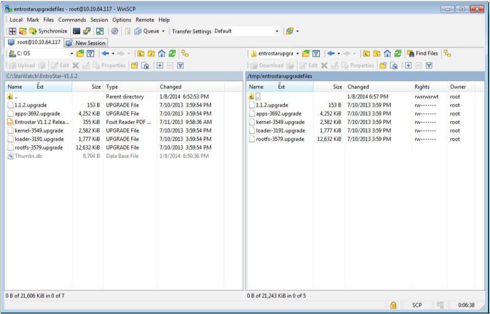

After the files are copied using *WinSCP*, the files will be automatically detected and will
automatically invoke the upgrade process. Please allow 10 to 20 seconds before moving on to
the next step (cleaning the database and rebooting).

## Step 5 – Reboot with PUTTY

Use PUTTY to connect to the EntroStar panel and login:
Username:
*root*
Password:
*sooperrute*
Next, enter the commands as shown:
*cd /db*
*ssentro stop*
*rm *.db*
*dbmanager*
*reboot*
After the reboot has completed and the panel restarted, it should now have the newly updated
firmware and database.

The following screenshots show the actual sequence of doing an update successfully:

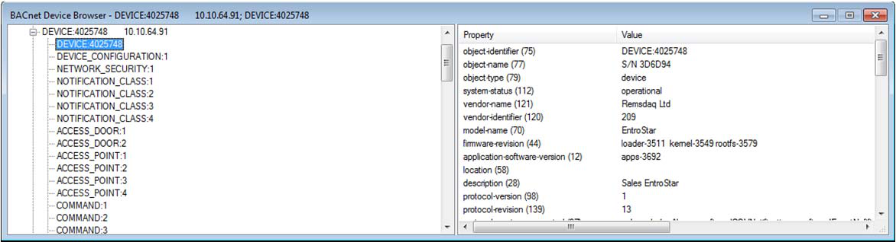

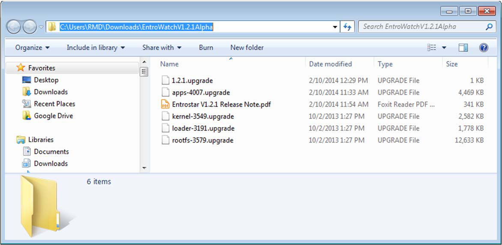

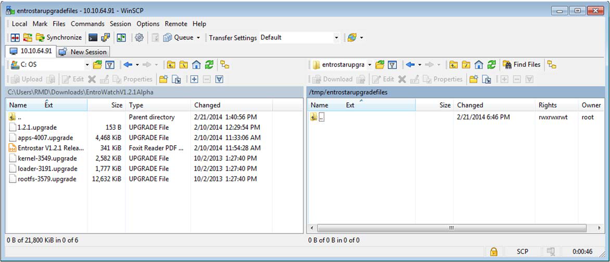

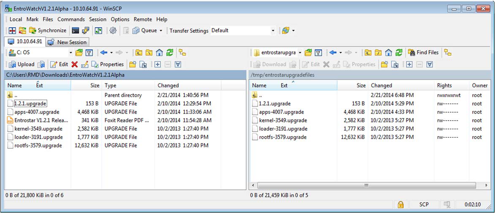

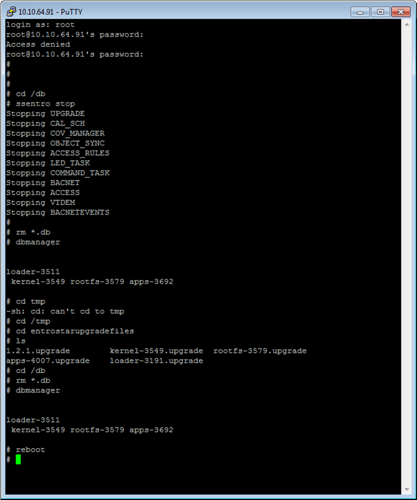

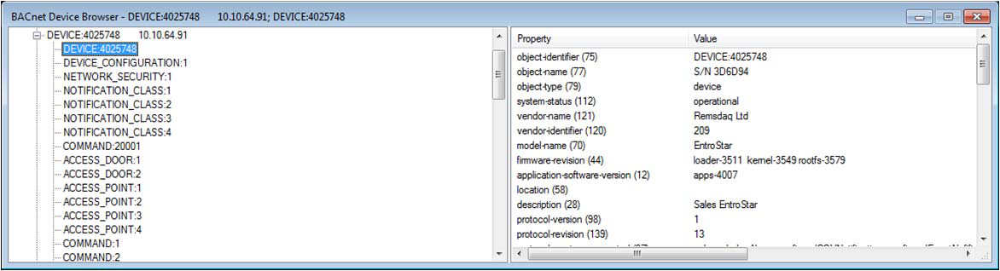

After the panel comes back on-line, you may need to re-synchronize the database – this can be done
from *Site Planner*, as follows:

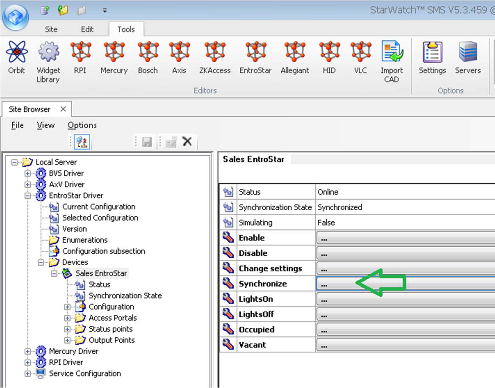

---

*© DAQ Electronics, LLC*
