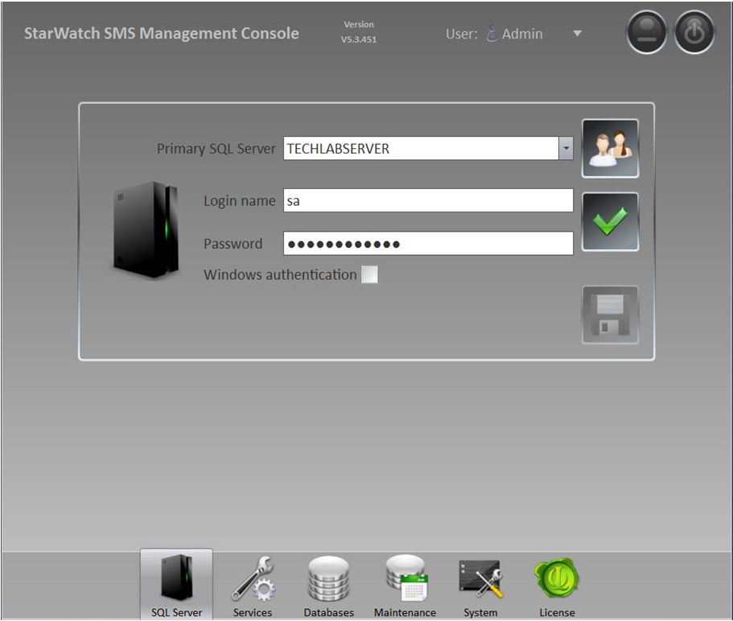
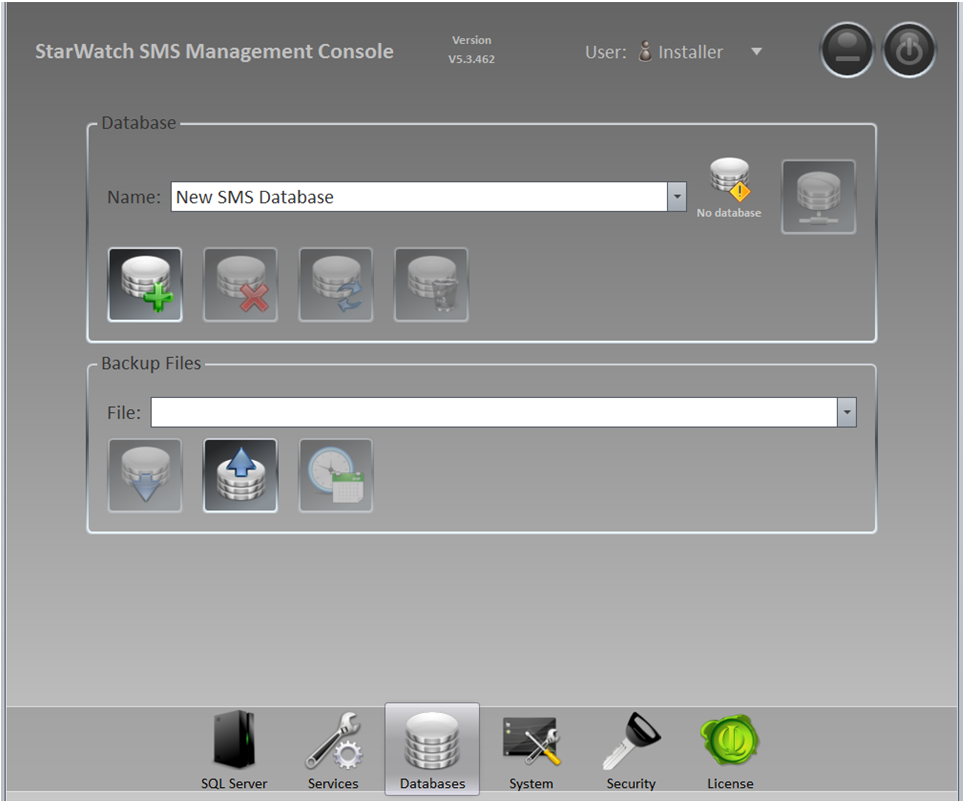
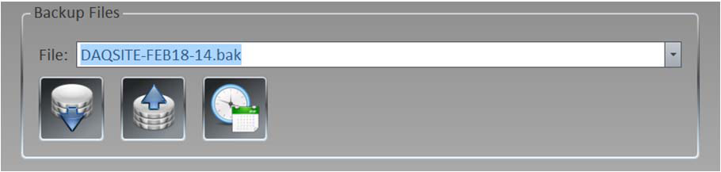
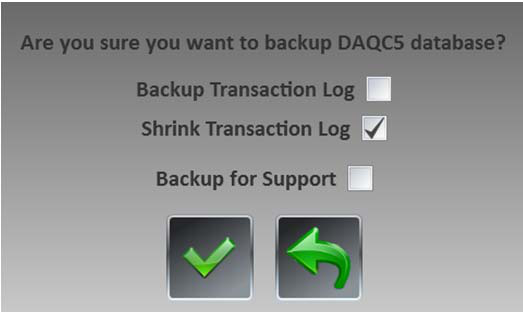

# How to Reduce the Size of the Transaction Log File

1. Open and login to the *Management Console*.

2. Click on *Databases* at the bottom of the window to call up the *Database* screen.

3. In the *Backup Files* area, type the name of the log file you wish to shrink in the *Name* text field (or
select it from your database directory using the drop-down menu) and click *Backup*.

4. The following dialog box will appear:

Select the *Shrink Transaction Log* option, and then click *Backup* (the green checkmark). The file size of
the log file will be reduced.
Note: it is recommended to create a scheduled, automatic backup of the system with the same *Shrink*
*Transaction Log* option selected. This will create backups for disaster recovery, and manage the size of
the log file.

---

*© DAQ Electronics, LLC*
