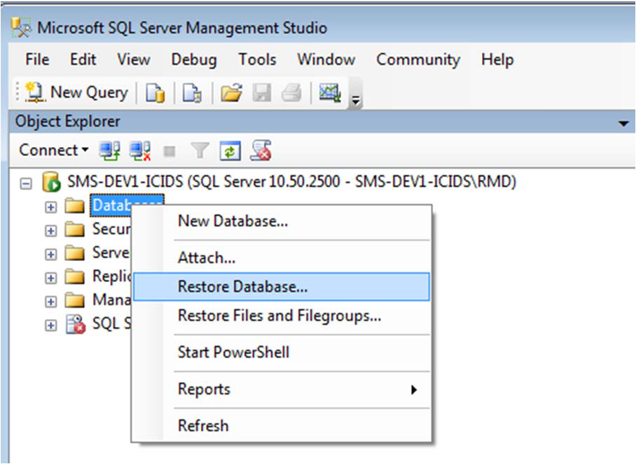
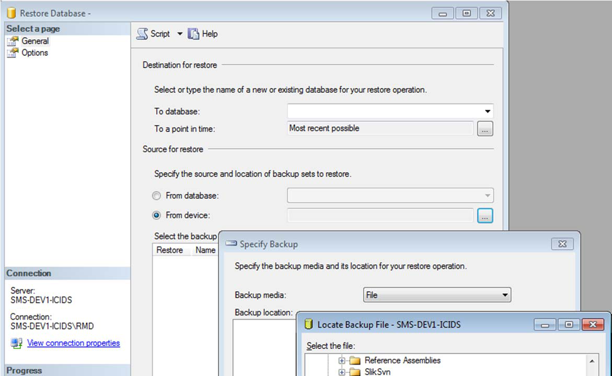
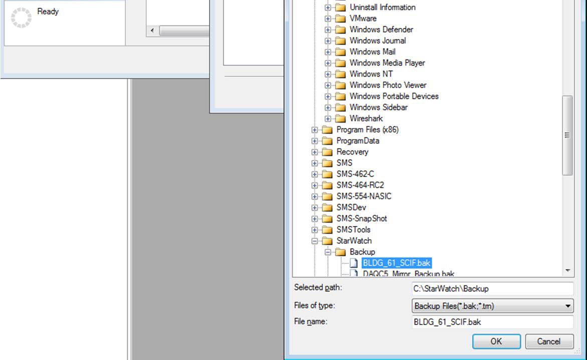
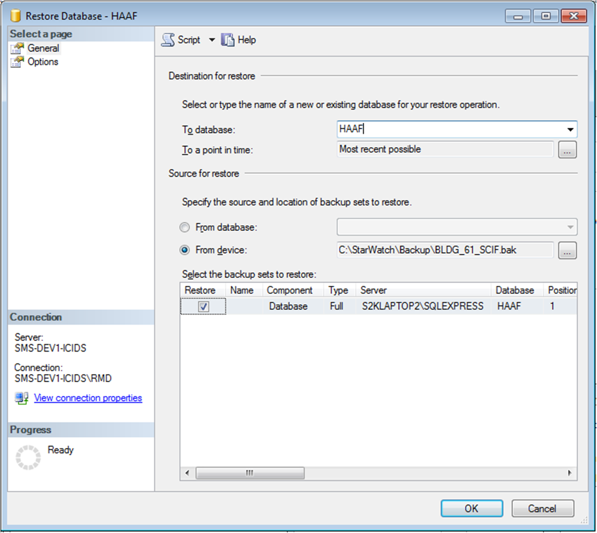
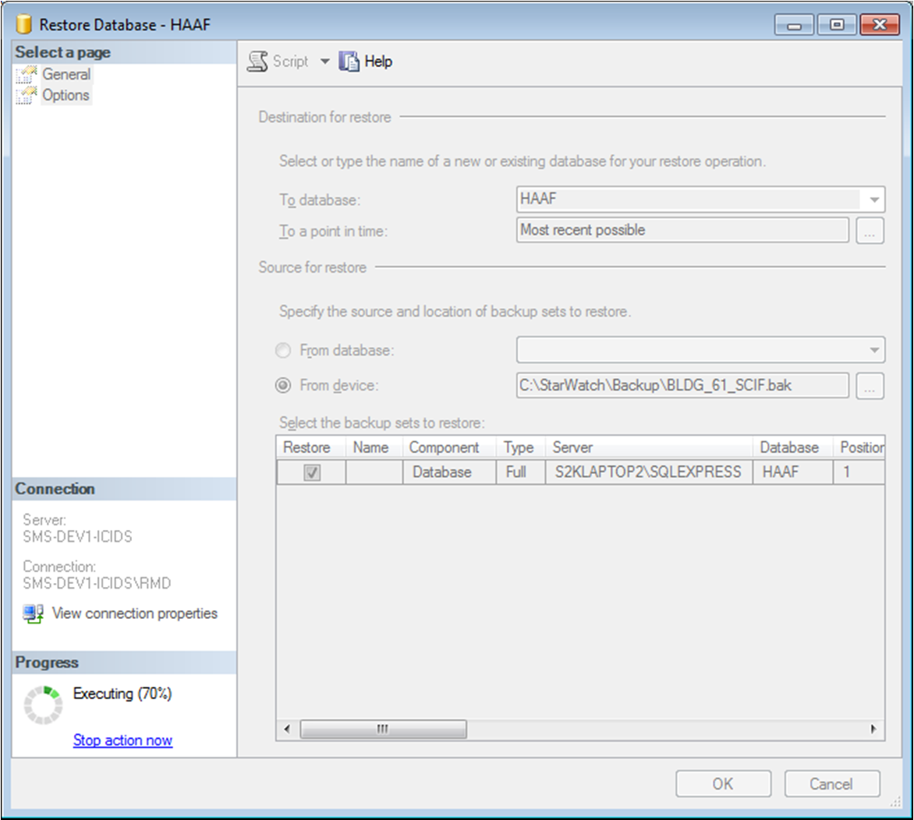
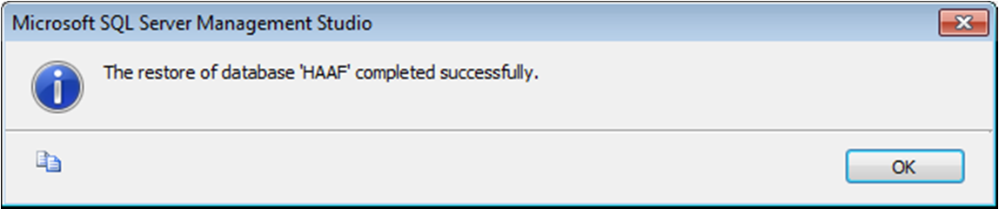
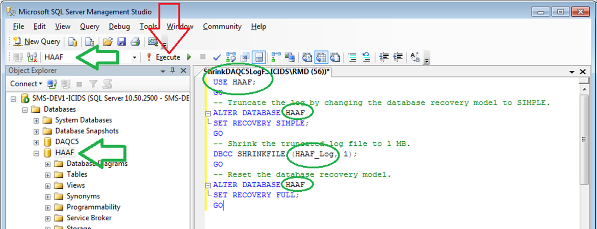
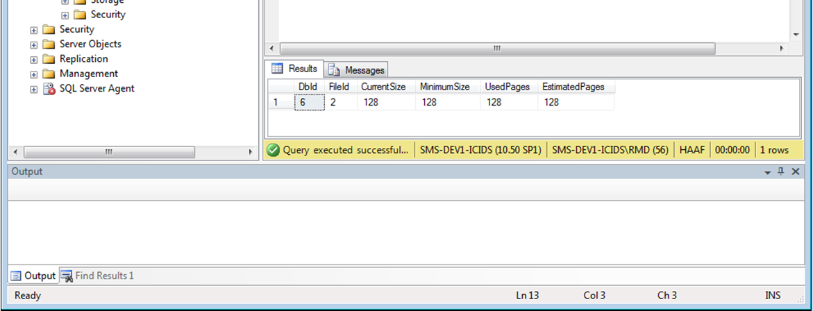

# How to Restore and Shrink a Database Log Using SQL Management Studio

Create a new query in *SQL Studio* using the following script and replace *MYDBNAME* with the site
database name:
USE MYDBNAME;

## GO

-- Truncate the log by changing the database recovery model to SIMPLE.

## ALTER DATABASE MYDBNAME

SET RECOVERY SIMPLE;

## GO

-- Shrink the truncated log file to 1 MB.
DBCC SHRINKFILE (MYDBNAME_Log, 1);

## GO

-- Reset the database recovery model.

## ALTER DATABASE MYDBNAME

SET RECOVERY FULL;

## GO

---

*© DAQ Electronics, LLC*
