# How to Restore a Backup File Using SQL Server Studio

1. Use *SQL Server Management Studio* to restore the backup file.

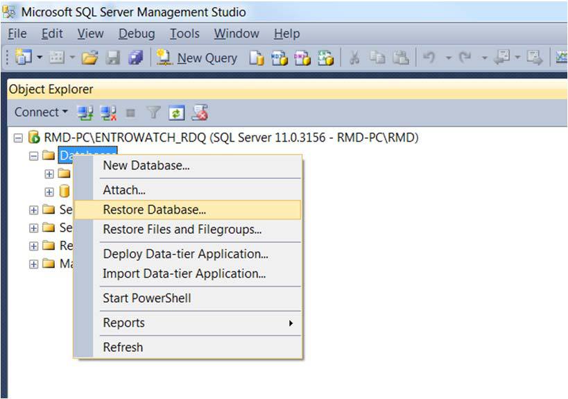

2. Select the *Device* option and browse to the file.

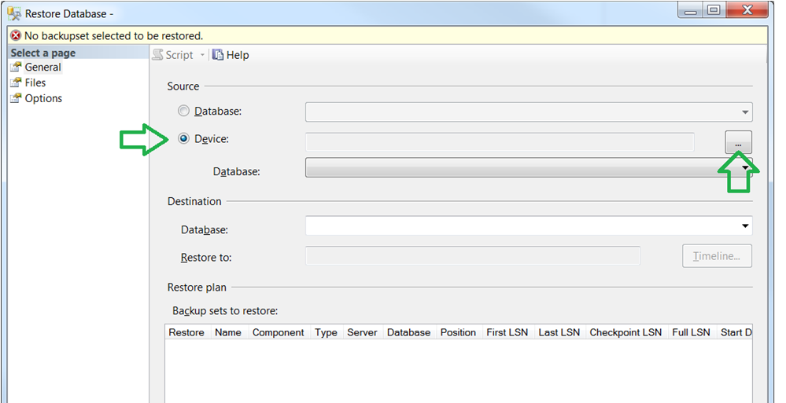

3. Click *Add* to select the file path.

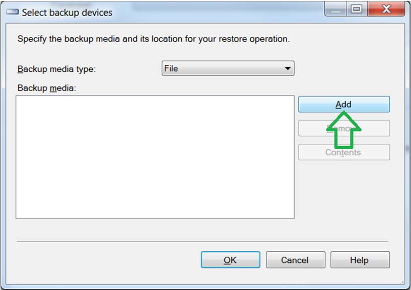

4. Browse folders and select the backup file provided.

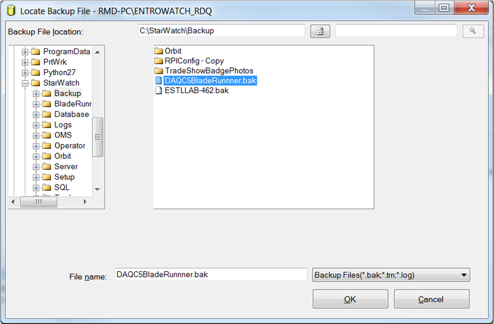

5. Make sure that the database *DAQC5* is selected for restore and click *OK*.

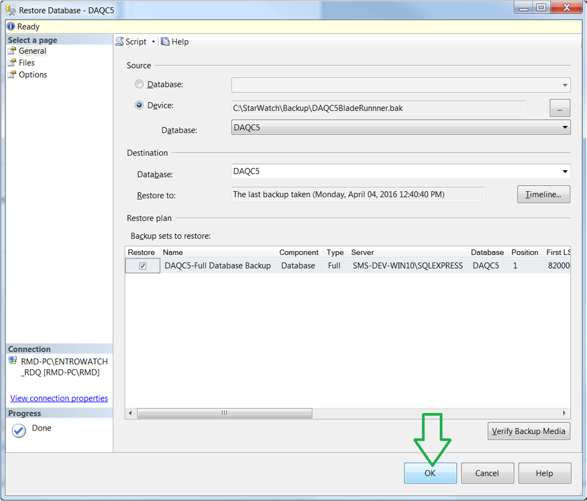

You should see a successful result.

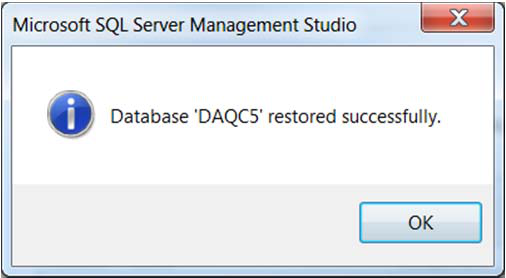

6. Next,  run *Blade Runner* (Testclient.exe).
You will need to login as shown using your *sa* account.

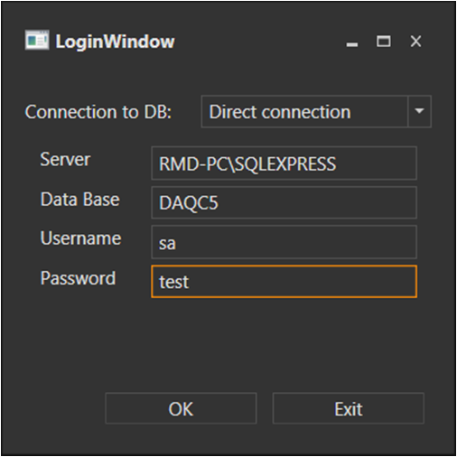

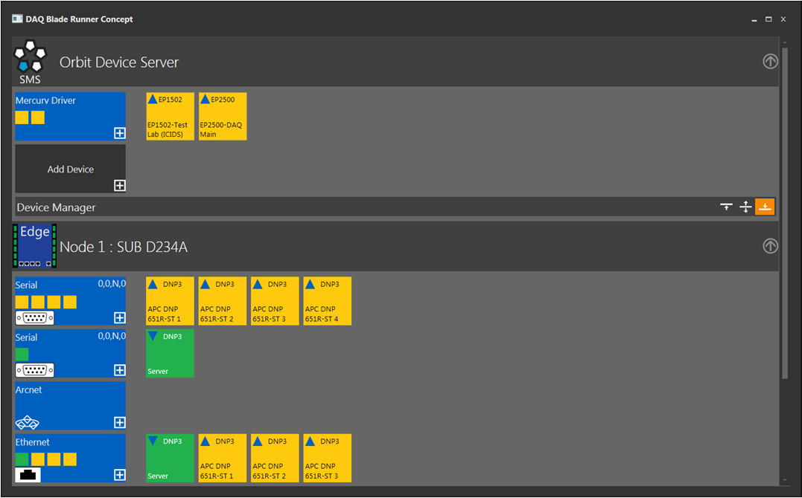

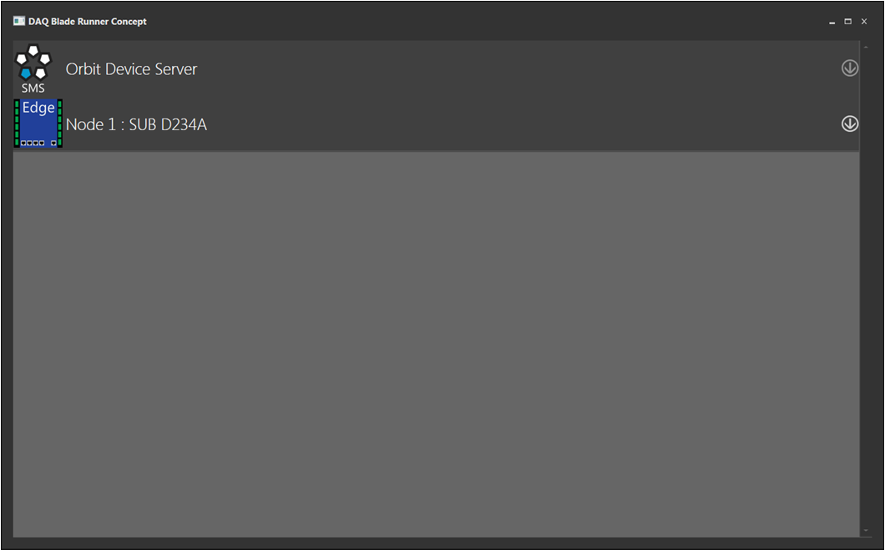

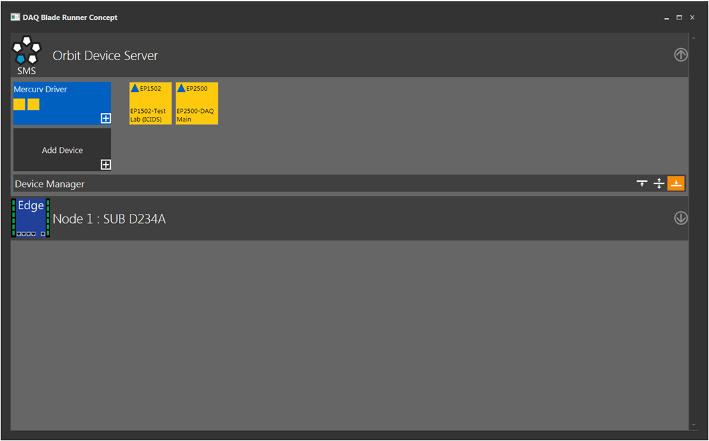

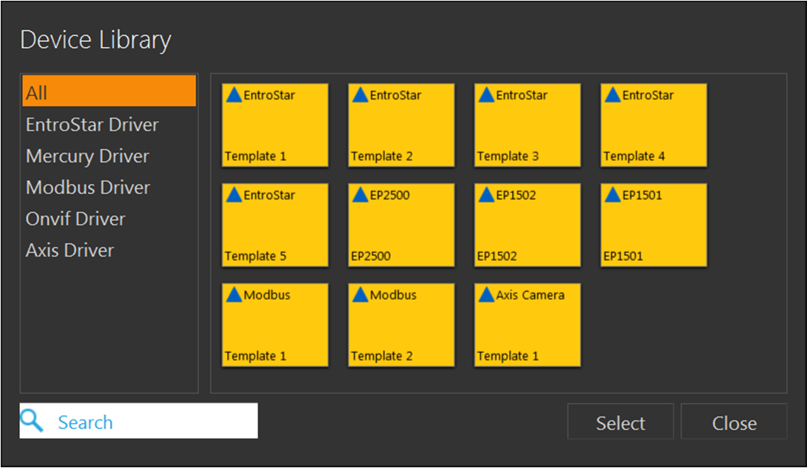

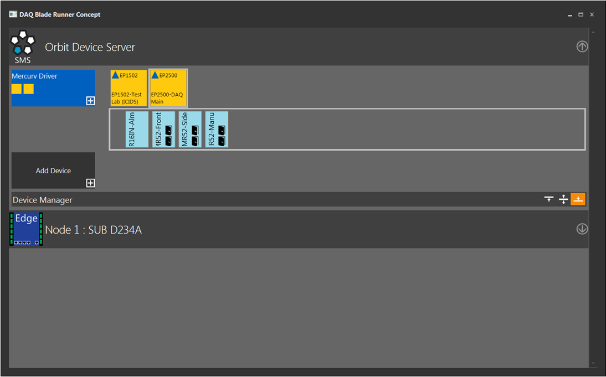

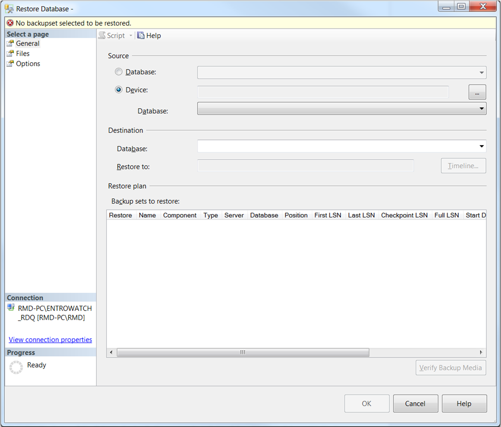

---

*© DAQ Electronics, LLC*
