# How to Set Up a Digi Connect EZ Mini for a SCIF

## INTRODUCTION

The use of a *Digi Connect EZ Mini/2/4* module enables the establishment of a FIPS encrypted network
connection between the *StarWatch SMS* Server/Device Server and a SCIF, while allowing for Poller to
Anti-Poller serial communications inside the SCIF.

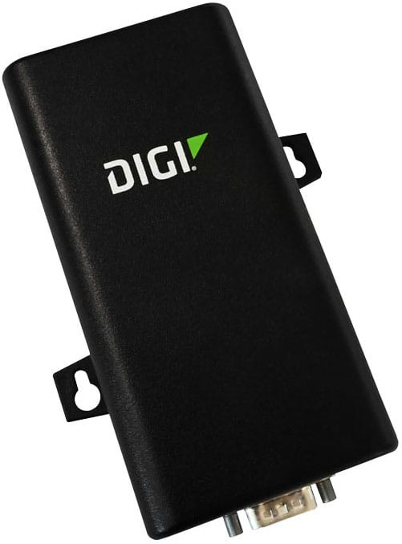

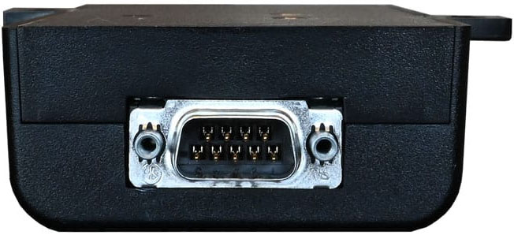

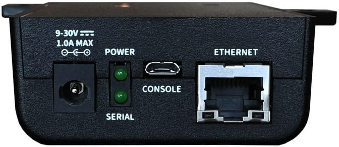

Front View
Back View

## Digi Connect EZ Mini

120VAC
TP                   INDICATES TWISTED PAIR.
DIGI CONNECT
DASHED LINES DENOTE ENCRYPTED
TRANSCEIVER
SINGLE MODE
PWR
5 GRND
ETHERNET
DB9-F
F.O.
3 TX
2 RX
OPTICAL
IN/OUT
TO/FRO
PMC
M
COMMUNICATIONS.
120VAC
GRND 5
RX 2
DB9-F
TX 3
SCIF COM2
ETHERNET
PWR
MGMT
1.
3.
2.
NOTES:
EZ01-MA00-GLB
DIGI CONNECT
EZ MINI
SERIAL
TP
TO/FROM RADC
RS232 PORT
3
120VAC
120VAC
TRANSCEIVER
PWR
RJ45
ETHERNET
F.O.
COM2
DB9-M
COM1
PWR
OPTICAL
IN/OUT
TO/FRO
SCIF
M
ICIDS-5 SMS WS
DUAL DISPLAY
(SCIF-WS)
1
RJ45
ETHERNET
LSCC NETWORK SWITCH
MOUSE
DMS-59
VIDEO
KEYB
SPLITTER
DVI
USB
USB
DVI
RJ45
SPARE
ETHERNET
120VAC
DVI
CABLE
DVI
SERIAL COMMUNICATIONS VIA
ETHERNET CONNECTING TO
RJ45
VIDEO
DVI
PWR
VIRTUAL COMM PORT
DAQ SERVER
MOUSE
MONITOR
2
KEYBOARD

## REQUIRED SOFTWARE AND FILES

Before beginning the installation/setup of the Digi module, several files must be downloaded.
Important: It is recommended that you perform the initial setup and configuration of the Digi module
using a separate laptop and switch. The networking settings of the ICIDS system can complicate the
process if you are trying to facilitate the configuration while connected to the ICIDS system.
•

## RealPort Driver/Application

Download the *RealPort* driver to your laptop - follow instructions provided at the link below:
https://docs.digi.com//resources/documentation/digidocs/90002409/os/realport-windows-
install.htm
•

## Digi Configuration File

Download and save the configuration file on your laptop:
https://www.dropbox.com/scl/fi/crr34o3karz7ad0603tqr/Digi-ConnectEZ1-real-port-start-
config.bin?rlkey=qqmwjrvyhpgzwfc4tbu3n4wmu&dl=0
•

## Digi Connect EZ Mini - User Guide

Download the user guide for reference:
https://docs.digi.com/resources/documentation/digidocs/pdfs/90002409.pdf
•

## Digi Navigator

Download and install the *Digi Navigator* configuration tool on your laptop - follow instructions
provided at the link below:
https://www.digi.com/products/networking/infrastructure-management/software-and-
tools/digi-navigator

## CONFIGURATION

Once all required files and applications have been downloaded/installed as indicated, configuration of
the Digi module can begin. Important: The *Digi Navigator* application presents user screens that can
look substantially different, depending on several versioning factors. Where appropriate, multiple
screen views (Version A and B) are provided in the following steps – please follow the views that match
your application.

### Step 1:  Set your laptop ethernet port to obtain an IP address automatically.

### Step 2:  Connect the Digi module to your laptop with an ethernet cable.

### Step 3:  Launch the *Digi Navigator* application on your laptop.

Step 4:  From the opening screen, navigate to the *Filters* tab and select all options provided except
the *192.168.210.1* option in the *Default IP* *Filters* section.
Version A:

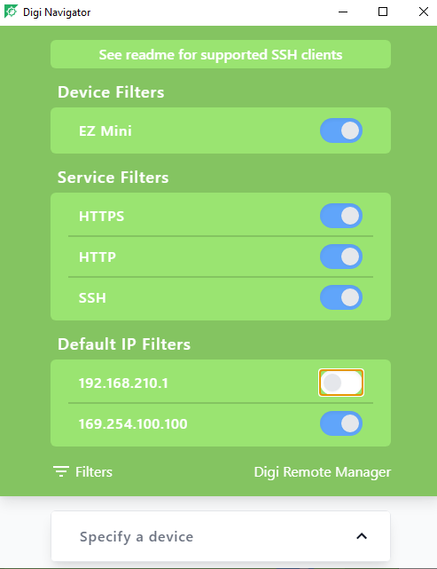

Version B:

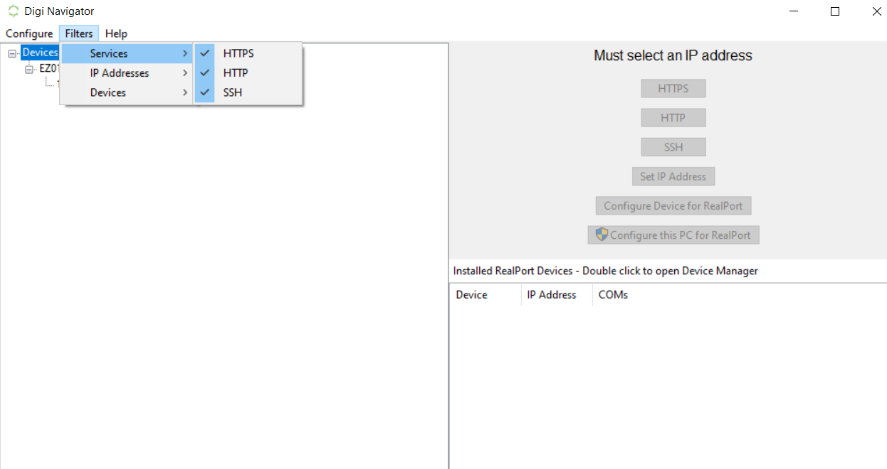

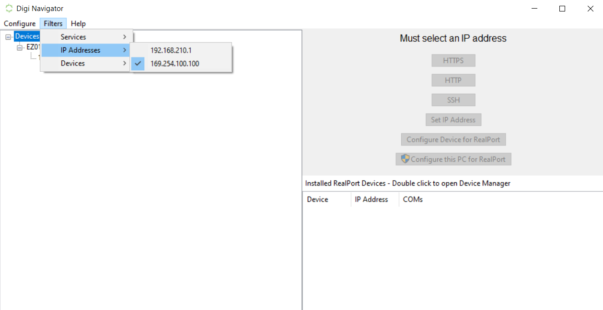

### Step 5:  Navigate from the *Filters* tab back to the main screen.

### Step 6:  For Version A, click the *Open* button next to the *HTTPS* option.

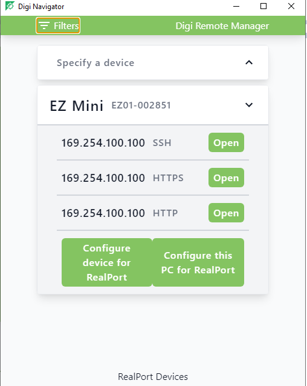

For Version B, click on the IP Address, then click the *HTTP* button.

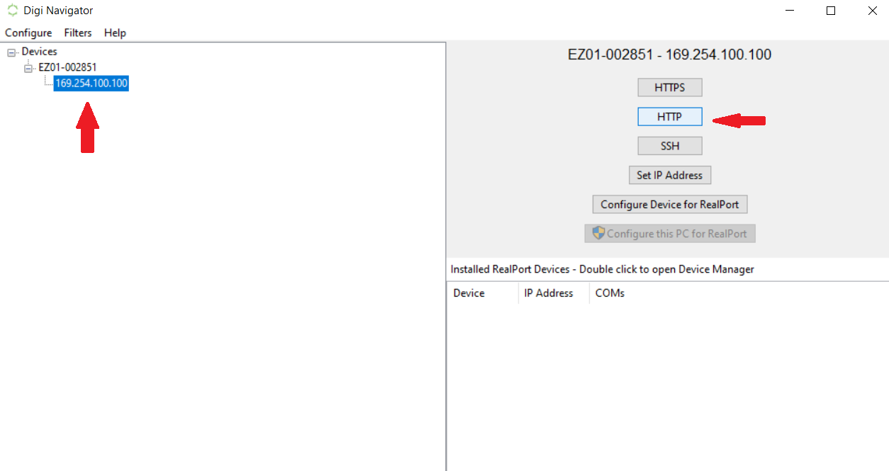

Note: If the *Your connection isn’t private* message appears, click on the *Advanced* button.
Then, select the *Continue to IP address* option to proceed to the next screen .

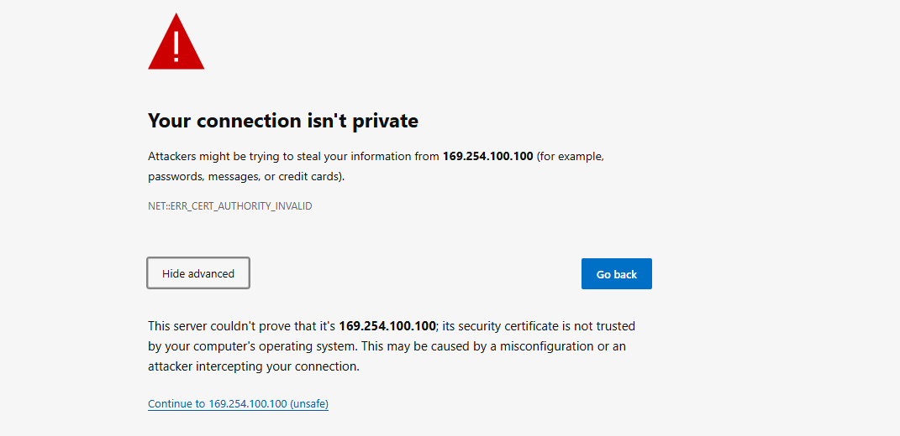

### Step 7:  You will be prompted to enter a *Username* and *Password*.

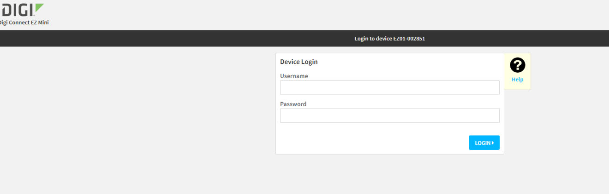

The default username is *admin* and the password is located on the back of the Digi module.
Note: You will be able to change the password later in the configuration.
Once you have entered the required information, click the *Login* button. The configuration
page will load.

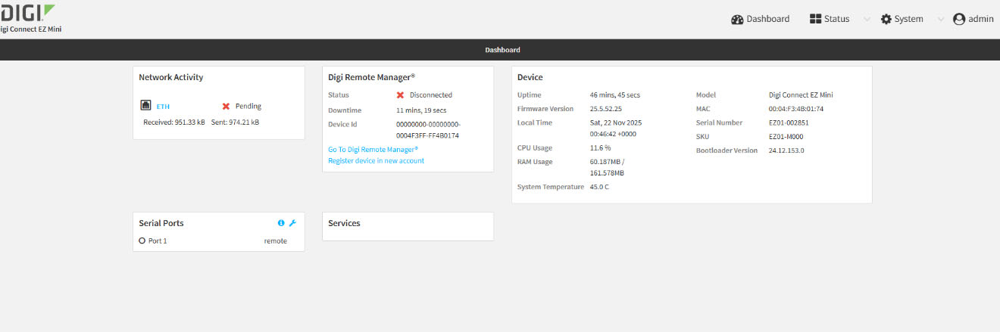

Step 8:  Next, the Digi configuration file you saved to your laptop from the *Dropbox* link must be
loaded. Using the menu at the top-right of the screen, click on the *System* button.

Step 9: From the *Configuration* list to the left, select *Device Configuration>Configuration*
*Maintenance*.

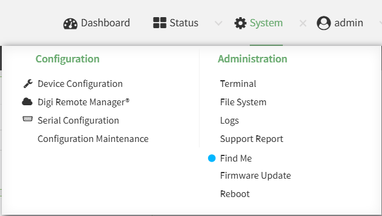

Step 10: In the *Configuration Restore* section of the *Maintenance* page, click the *Choose File* button
and locate the Digi configuration file you previously saved. Once you have selected the
appropriate file, click the *Restore* button.

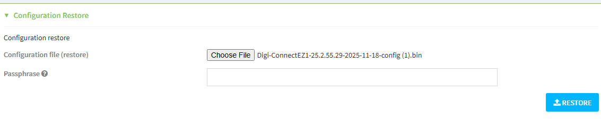

Step 11: Next, you will be prompted to refresh the page. Once complete, the selected configuration
file will load.
Step 12: Sign in again using the *Username*/*Password* for the configuration file you just restored.
Step 13: After login, you must change your IP address to the proper address. Start by clicking the
*System* button at the top-right of the page.

Step 14: From the *Configuration* list to the left, select *Device Configuration* and then proceed to
*Network>Interfaces/ETH>IPV4*.

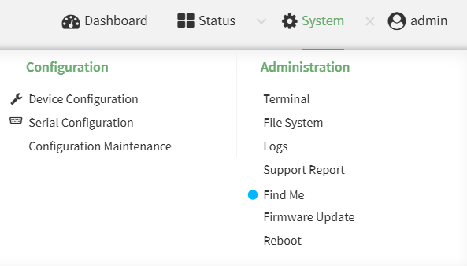

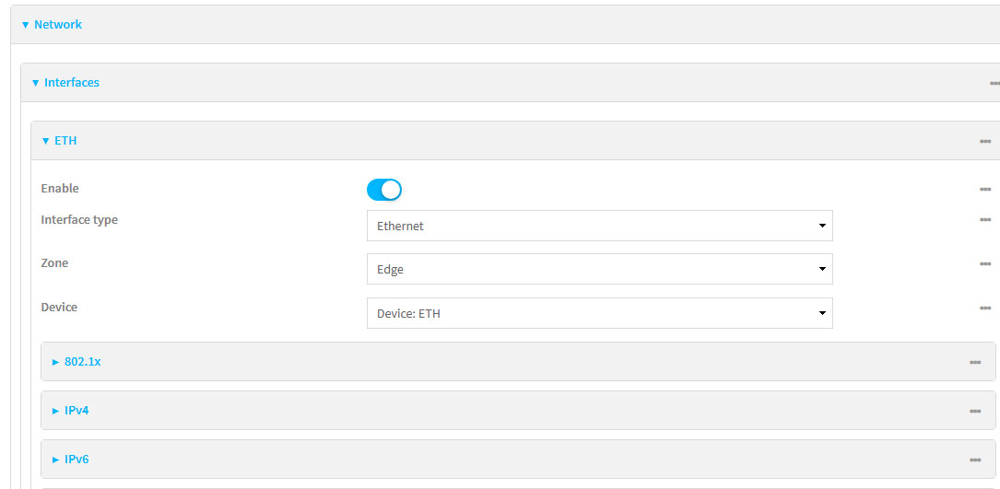

### Step 15: In the IPV4 section, click on the *Enable* slider.

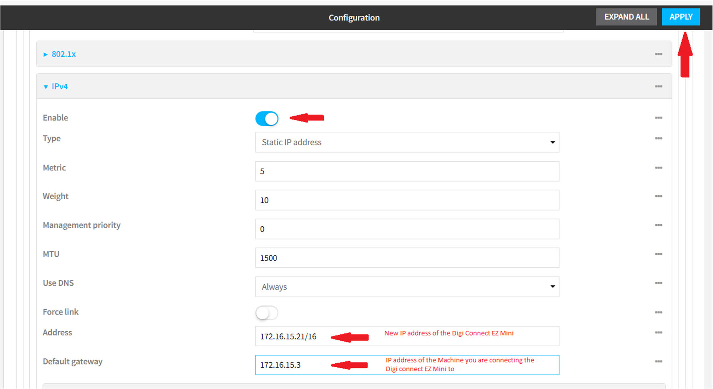

New IP address of the
Digi Connect EZ Mini
IP address of the machine you are
connecting the Digi Connect EZ Mini to
Step 16: After consulting with your IT department to understand how your system is currently set up,
enter the appropriate IP address. Note: Be sure you select the appropriate subnet mask - in
the example shown, it is /16. Some systems use /22 and others use /24. Confirm what the IP
range and subnet mask are on the ICIDS server you are going to be connecting to, and make
sure you use an available IP address.

## SUBNET MASK

255.255.255.0     /24
255.255.252.0     /22
255.255.0.0        /16
Step 17: Once you have entered the correct IP address, click *Apply* in the top-right corner.

Step 18: In the *Setup Link-local IP* section, disable the address by clicking on the *Enable* slider to place
it in an inactive state and clicking *Apply*.

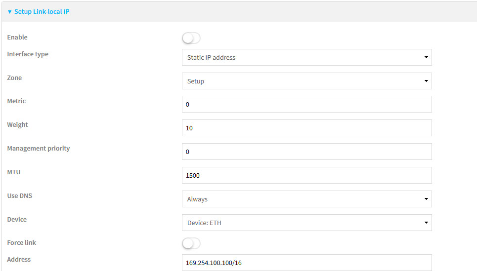

Step 19: Next, connect the Digi to the ICIDS network. Important: This should initially be done outside of
the SCIF, but ideally connecting the Digi to the same switch that will connect it to the SCIF.

### Step 20: Once connected to the network, power up the Digi module.

Step 21: If not installed already, install the *Digi Navigator* configuration tool on the Application/Device
Server that is communicating to the SCIF.

### Step 22: Launch the *Digi Navigator* application.

Step 23: For Version A, enter the previously configured IP address in the *Specify a device* section.

For Version B, click on the previously configured IP address in the Specify a device section.

### Step 24: Next, click the *Configure device for RealPort* button and login.

Username:
username in your configuration
Password:
password in your configuration

For Version B, select *Encryption* and click the *OK* button.

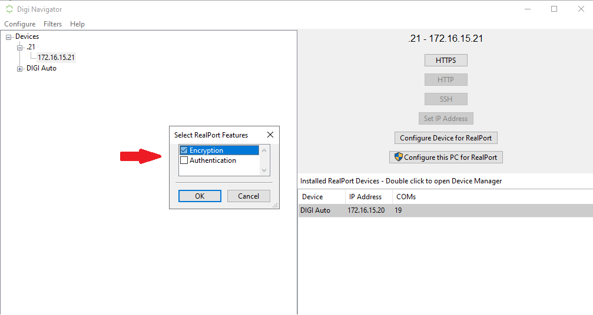

For Version B, select *Port1* and click the *OK* button.

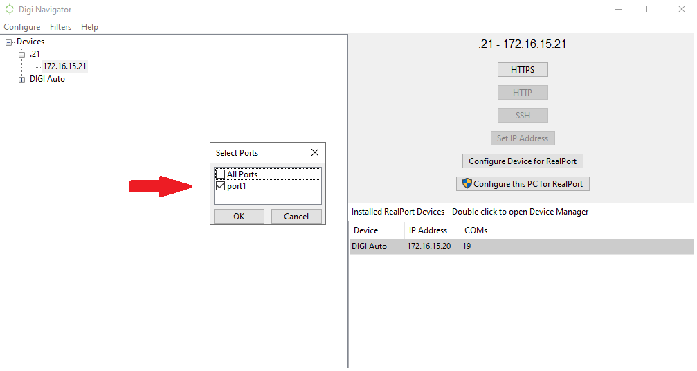

Step 25: After hitting the *Submit* button, you should see a success window. Note: If the login is
unsuccessful, open a browser and type in *https://172.20.200.242* (use the IP address the unit
is configured for) and see if you can connect to it. If this does not work, see if you can ping
the IP address. If none of these steps work, you will need to go back to Step 1 and start with a
factory reset of the Digi.
Step 26: If the computer you are using is not yet configured for *RealPort*, click the *Configure this PC*
*for RealPort* button.
Version A:

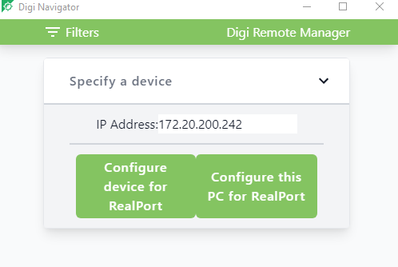

For Version B, select *Encryption* and click the *OK* button.

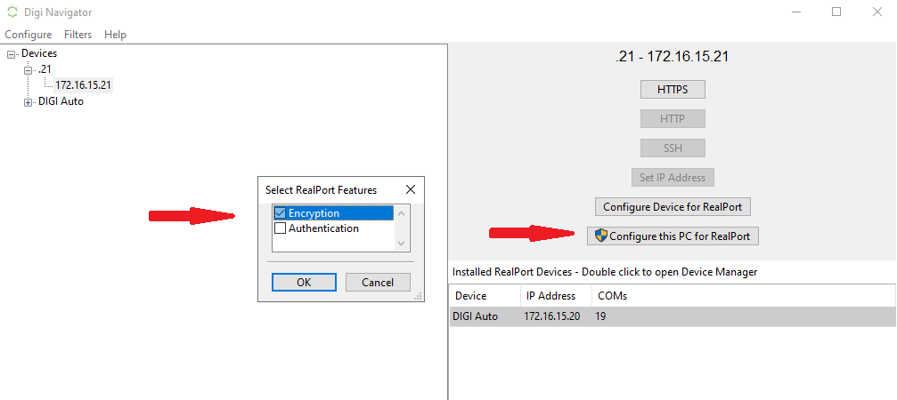

For Version B, select *Port1* and click the *OK* button.

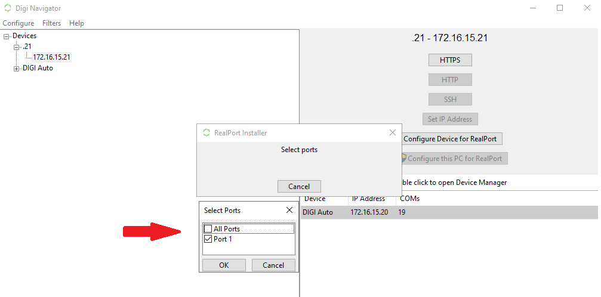

The configuration will load and a *Success* window will appear.

### Step 27: Open *Device Manager* on the computer and browse to *Ports*.

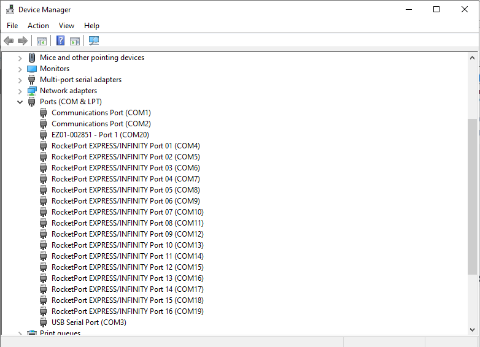

You should find your EZ port listed and assigned a comm port number. This is the port number
that will be configured in *Site Planner*.

---

*© DAQ Electronics, LLC*
