# How to Set Up an Automatic Procedure

Note: in newer versions of *StarWatch SMS*, procedures can be found in the administration panel after
selecting the *Admin* button from the main toolbar.

### Step 1:  Open *Triggers and Actions*, as shown.

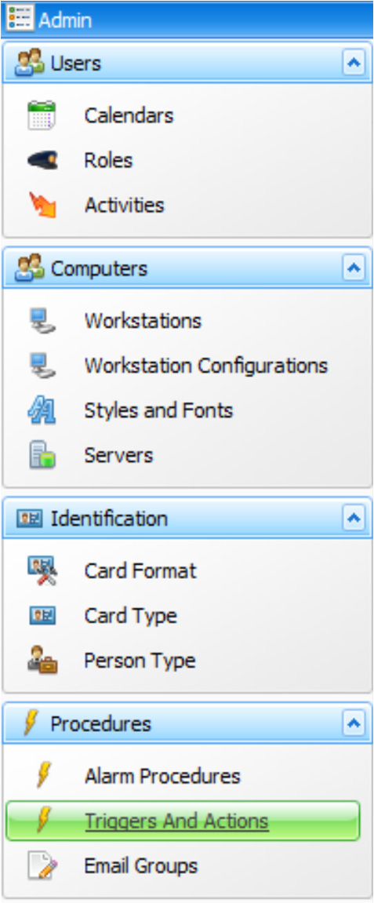

### Step 2:  Click on *Automation* to create a new automatic procedure.

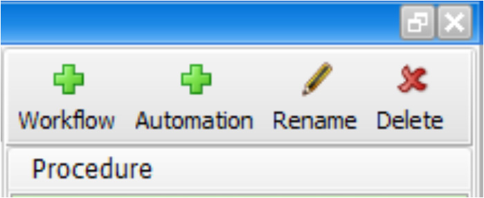

### Step 3:  Enter a new name for the new procedure.

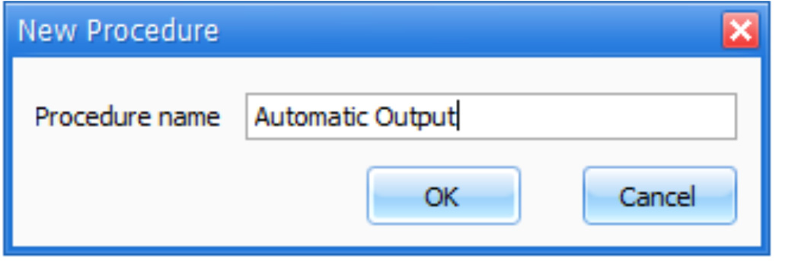

### Step 4:  Select the trigger.

By default, the calendar (scheduled) trigger is shown. Click and select the trigger required to invoke
the required actions. In this example, we will describe the *Device Object State Change*d trigger.

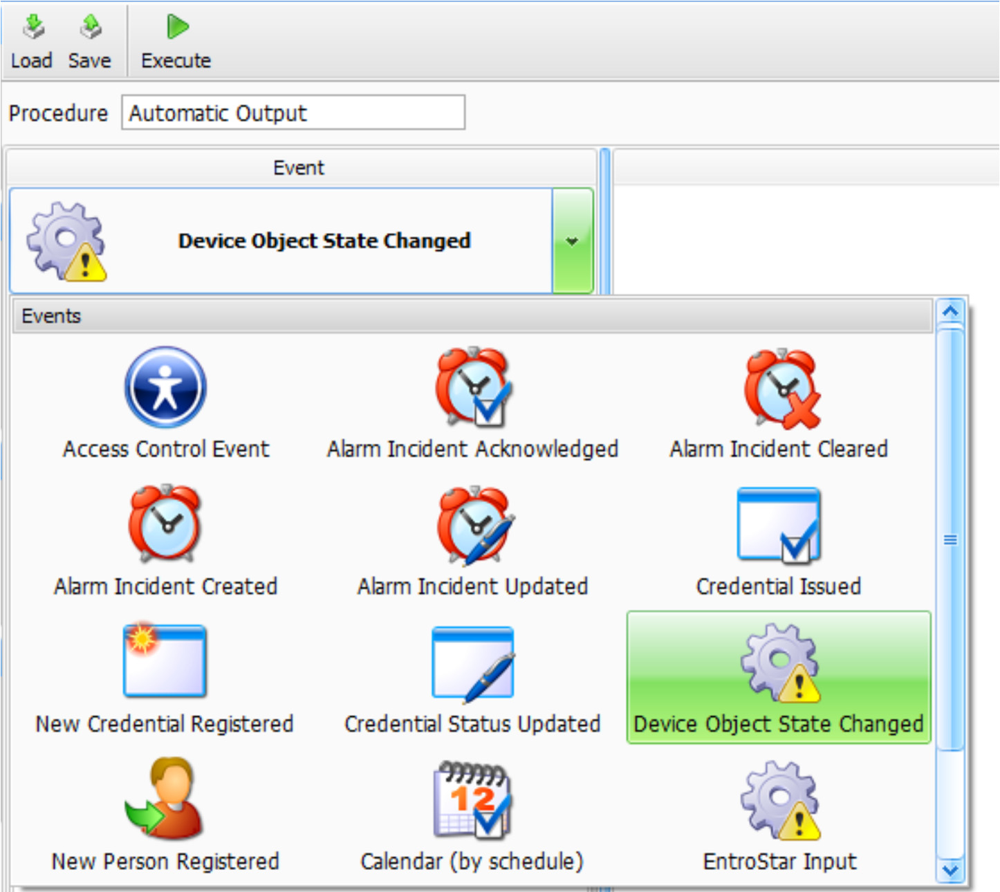

### Step 5:  Select the panel.

From the list of devices (panels), choose the devices that have the relevant input to monitor (trigger
off).

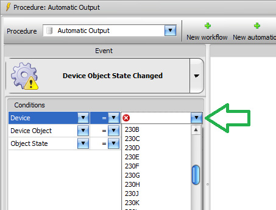

### Step 6:  Select the point.

From the list of points, choose the relevant input to trigger from.

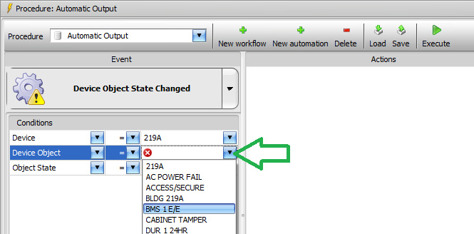

### Step 7:  Select the state.

Choose the input state required to trigger from.

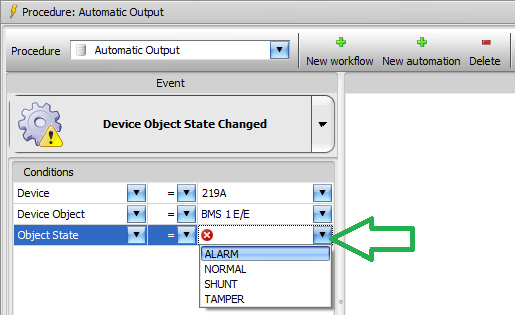

### Step 8:  Add the actions.

For each action required, select an action from the right side actions list and drag it to the center list
of actions. If there are several actions needed, they can be ordered by dragging.

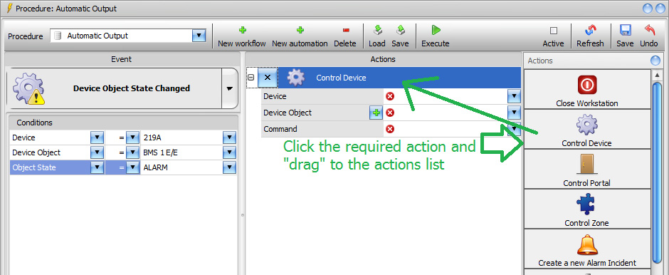

### Step 9:  Select an output command and make it active.

Just like for choosing the relevant device, point, and state, choose the command output needed from
the pull-down lists. When you are ready to start monitoring the input and triggering the action, click on
the *Active* checkbox - in effect, make it “live”.

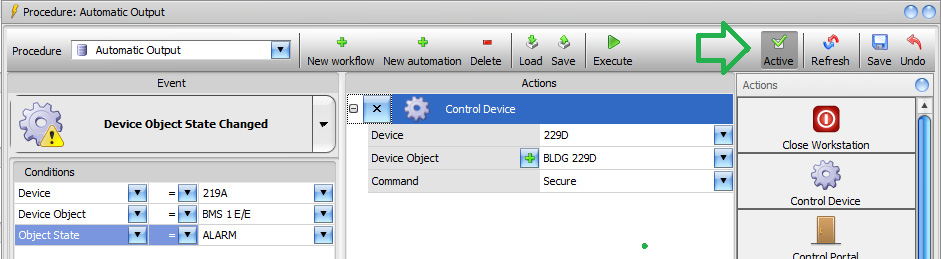

Step 10.  Save the procedure.
You must save the new procedure.

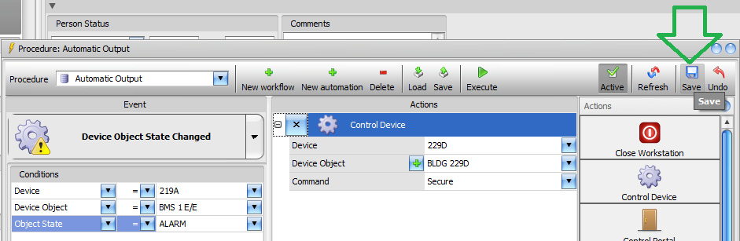

Step 11.  Adding a schedule or holiday.
It may be required to:
a) Not always have the procedure active (ex. specific holidays)
b) Start the procedure from a specific date in the future
c) Have the procedure only be active on certain days of the week

### Step 12:  Select the *Schedule* checkbox.

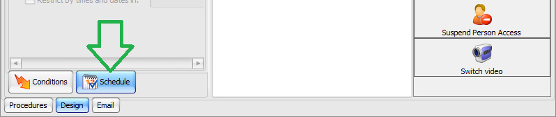

Once the schedule checkbox is selected, you can modify the start date or days of the week when the
procedure should be active.

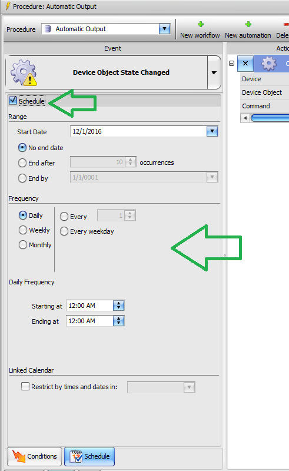

### Step 13:  Create holiday exceptions.

In the *Linked Calendar* area, select the *Restrict by times and dates* checkbox and choose the calendar
that is used to control the holiday exceptions. The procedure will be limited by the dates in the
calendar that are blocked out.

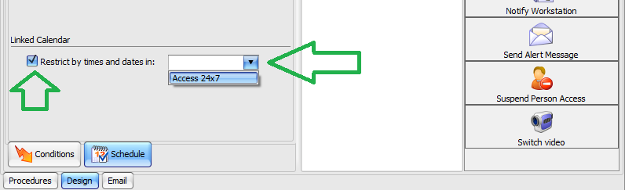

### Step 14:  Perform a manual test.

To test the actions, simply click *Execute*.

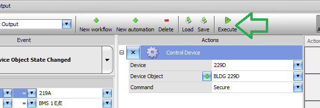

---

*© DAQ Electronics, LLC*
