# How to Set Up SQL Server for Remote Client Access

*A network-related or instance-specific error occurred while establishing a connection to SQL Server.*
*The server was not found or was not accessible. Verify that the instance name is correct and that SQL*
*Server is configured to allow remote connections. (provider: Named Pipes Provider, error: 40 - Could*
*not open a connection to SQL Server)*

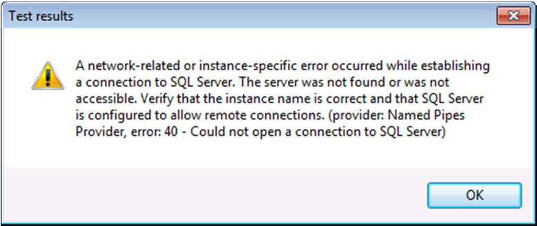

## How to solve this issue?

There are a few things that might be going on here (all of the following configurations are made on the
computer running your *SQL Server 2008* instance).

## Allow remote connections to this server

The first thing to check is if *Remote Connections* are enabled on your *SQL Server* database. In *SQL*
*Server 2008* you do this by opening SQL Server 2008 Management Studio, connect to the server in
question, right-click the server, and open the *Server Properties*.

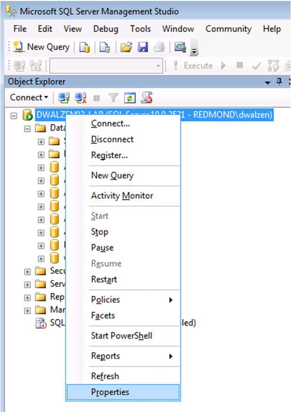

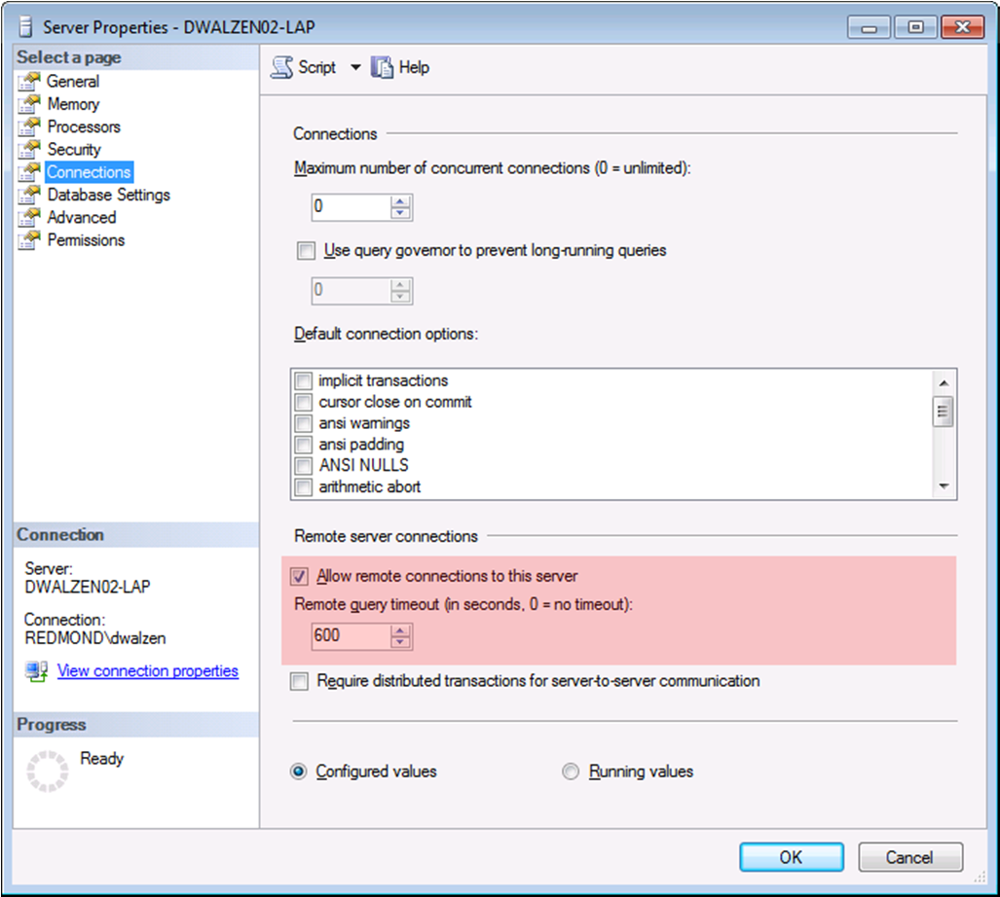

Navigate to *Remote Server Connections* and ensure that *Allow remote connections to this server* is
checked. Check if this solves the problem.

## Protocols for MSSQLServer

If you are still running into issues, the next thing to check is the *SQL Server Network Configuration*.
Open the *SQL Server Configuration Manager*, unfold the node *SQL Server Network Configuration* and
select *Protocols for MSSQLServer* (or whatever the name of your SQL Server instance is).

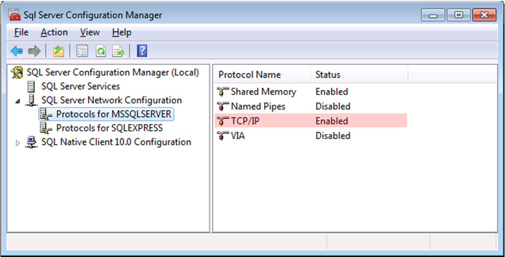

Make sure that *TCP/IP* is enabled, and try again.

## The Firewall

If there is still no communication happening between your computer and the remote *SQL Server*, you
most likely need to configure your firewall settings. A good first step is to figure out which port is being
used by TCP/IP (and which you need to open in your firewall). You can do this by right clicking *TCP/IP*
and selecting *Properties*.

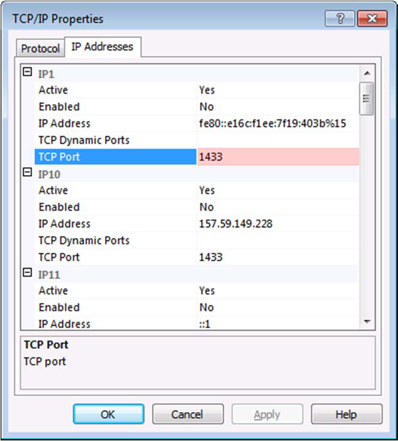

Click on the *IP Addresses* tab and check the port (Port 1433 in this example). Next, you will need to
allow inbound TCP/IP traffic on this port in your firewall. In Windows 7, this works as follows:

Open the *Control Panel* and navigate to *Windows Firewall*.

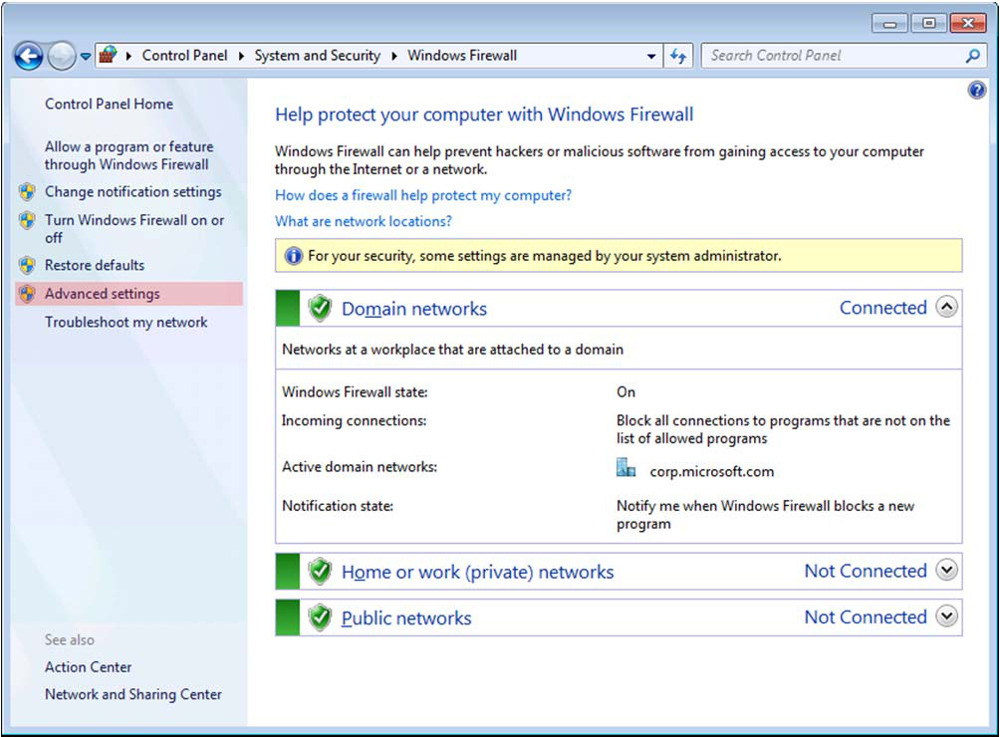

Click on *Advanced Settings* on the left-hand side and you should see the *Windows Firewall with*
*Advanced Security*.

Select *Inboud Rules* on the left-hand side and click on *New Rule* on the right-hand side.

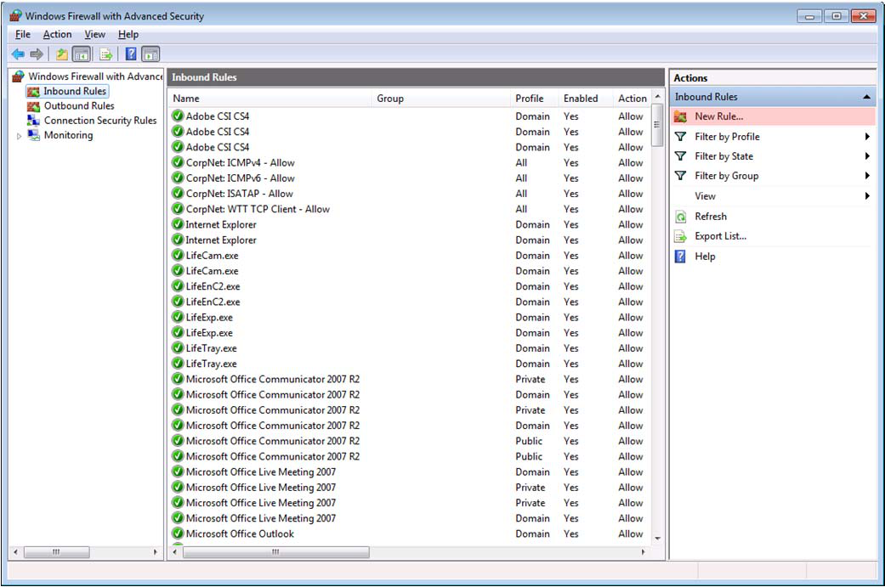

This opens the *New Inbound Rule Wizard*, which you can use to allow inbound traffic on the required
port for TCP/IP (exactly how you configured your *SQL Server* in the steps above). Proceed with the
following steps:

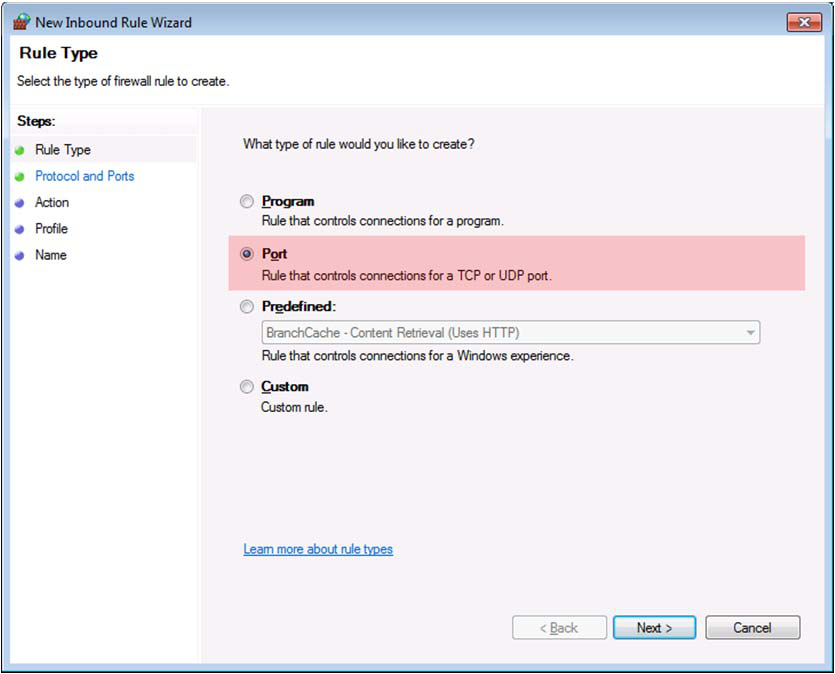

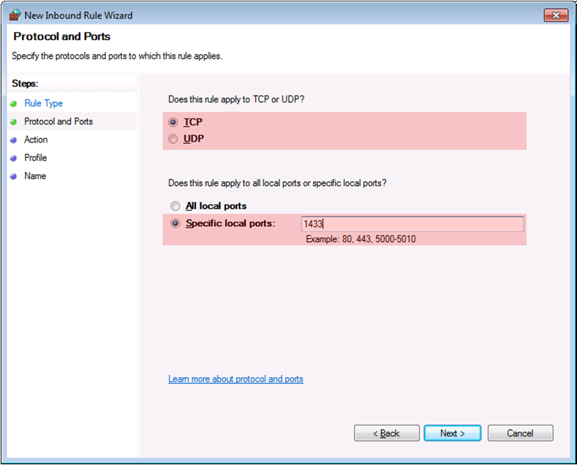

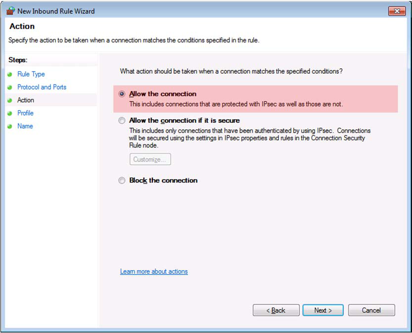

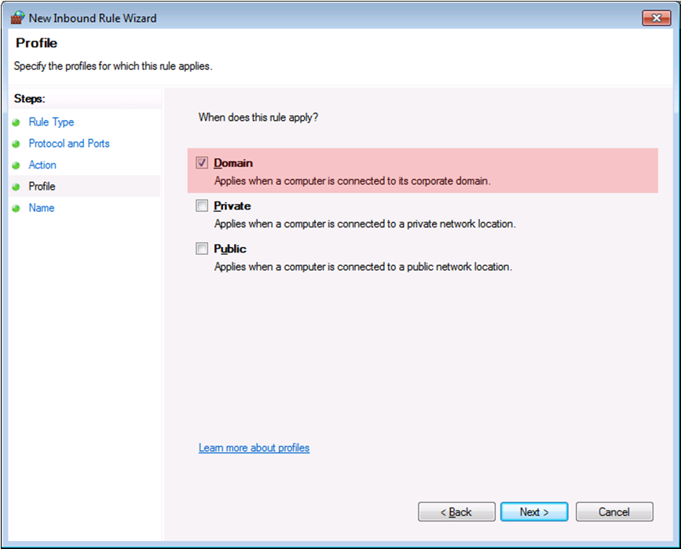

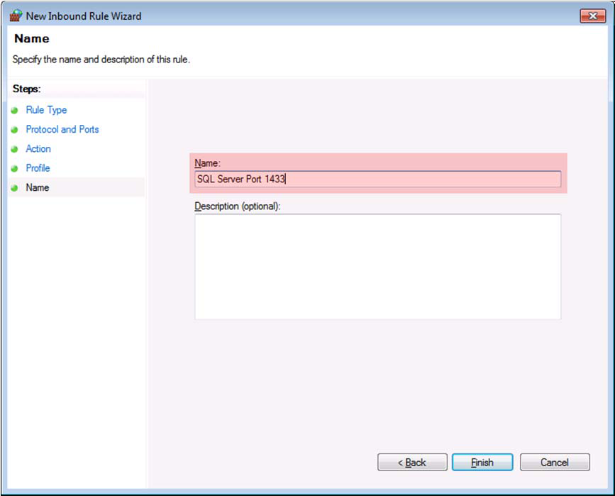

---

*© DAQ Electronics, LLC*
