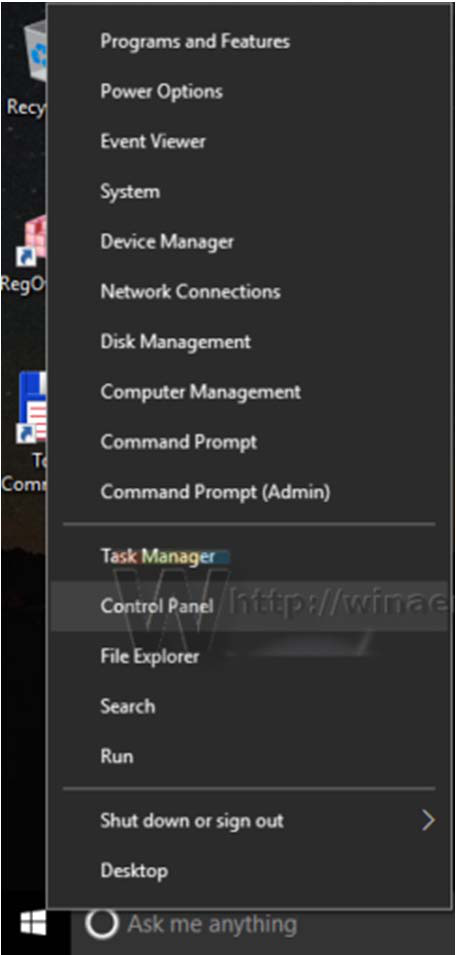
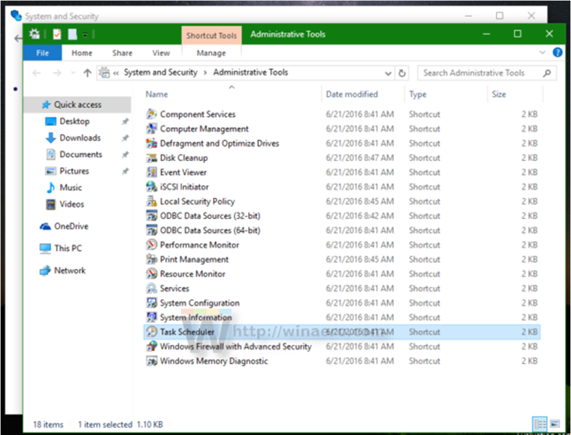
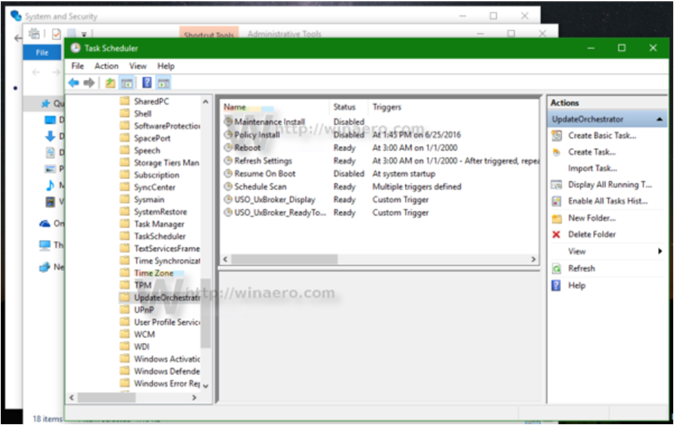
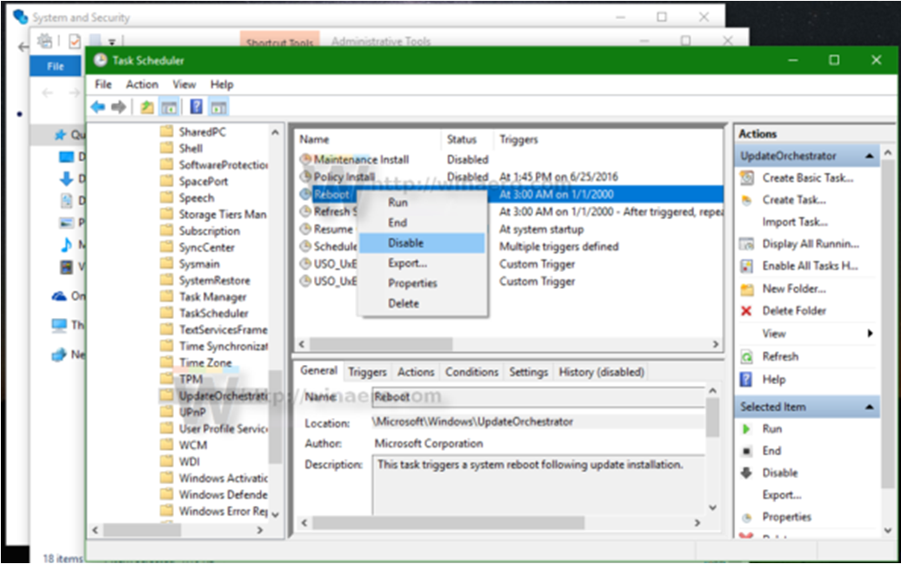
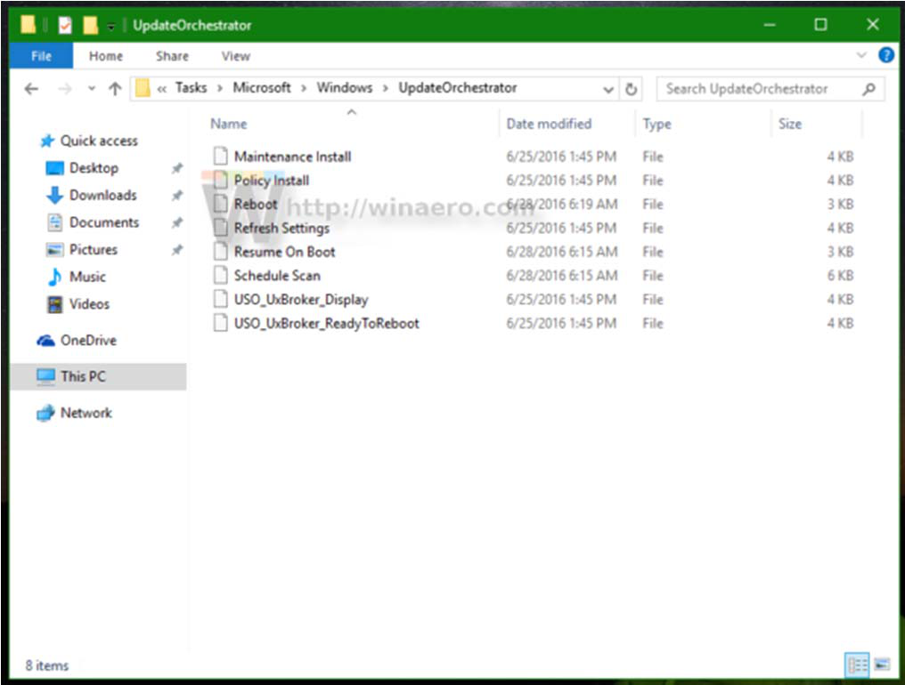
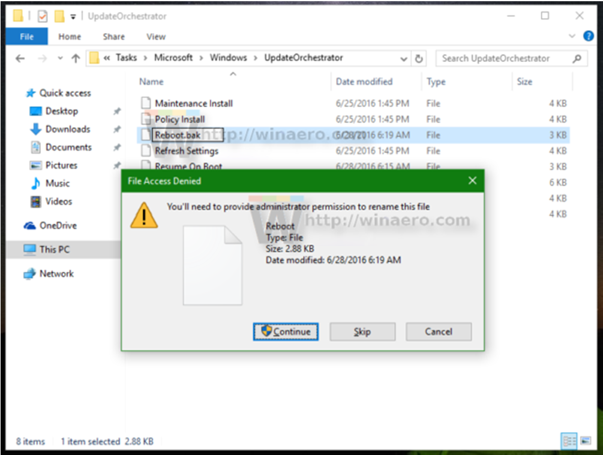
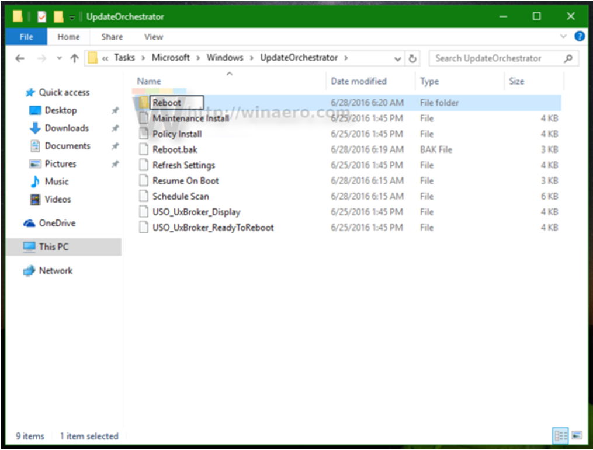

# How to Stop Windows 10 Reboots

Windows 10 is known to auto-restart your PC when it installs updates. This is completely unacceptable
no matter how important the update is. If the user does not restart the operating system for a certain
period of time, Windows 10 starts showing warnings that the PC will be restarted at a specific time.
Eventually, it restarts on its own, even if the user is in the middle of something important. In this
article, we will see how to stop Windows 10 from auto-restarting and take the reboot control back in
your hands.
Many users cannot tolerate the behaviors of Windows 10:  Windows Defender is hard to disable in this
OS, Windows Update gives you no control over choosing and downloading updates, and there is no way
to stop automatic reboots.
With Windows 10 Anniversary Update, Microsoft implemented a new feature called "Active Hours". It is
intended to not disturb the user during a specified period of time. You can use it to postpone reboots.
If Active Hours is not a solution for you, you can permanently stop Windows 10 reboots after updates
are installed using the following steps:

1. Open the Control Panel

2. Navigate to *Control Panel\System and Security\Administrative Tools*.

3. Click the *Task Scheduler* icon.

4. In *Task Scheduler*, open the *Task Scheduler Library\Microsoft\Windows\UpdateOrchestrator* folder.
5. There you will see a task called *Reboot*. Disable it using the appropriate command in the right click
menu.

Once the *Reboot* task is disabled, Windows 10 will no longer reboot itself automatically after updates
have been installed.

Some users report that Windows 10 is able to re-enable this task automatically. You can ensure that
Windows 10 will not re-enable it by doing the following:
1. Open the folder below in *File Explorer*:
*C:\Windows\System32\Tasks\Microsoft\Windows\UpdateOrchestrator*

2. Rename the file name *Reboot* which does not have an extension to *Reboot.bak*.

If you cannot rename the mentioned file, you will need to take ownership of that file.

3. Create an empty folder here and name it *Reboot*.

This will prevent Windows 10 from re-creating the *Reboot* task and restarting the computer. Later, if
you change your mind, you can delete the *Reboot* folder and return the filename from *Reboot.bak* to
*Reboot* with no extension.
Alternatively, you can use a small app ShutdownGuard, which prevents the operating system from
accidental reboots.

---

*© DAQ Electronics, LLC*
