# ICIDS: How to Update a StarWatch SMS System

Note: this instruction is intended for systems under the ICIDS program only.
**Introduction**
If you have any installation, regardless of how old this document is, this is the most guaranteed method
of installing 5.3.464 without any issues.
Note:  5.3.464 will update many systems successfully, but following this guide will ensure success under
all conditions.

## Before You Start: IMPORTANT

You can follow this guide only if you know the following information and keep note of the information.
1. sa account
You must know the *sa* account password and write it down before starting.

2. su account
You must know the *su* account password and write it down before starting.
3. Management Console
You must know the password for the *Support* level in the *Management Console* and write this
down before starting.
4. License
You must copy your license file *StarWatch_SMS.lic* to a safe place (not the desktop). This file
can be found as follows:
C:\StarWatch\Server\StarWatch_SMS.lic
5. RPI Driver INI file
You must copy your *RPIDriver.ini* file to safe place (not the desktop). This file can be found as
follows:
C:\StarWatch\Orbit\RPIDriver.ini

6. Management Console Alarm Settings
You must make a note of the following settings on your system before you start. They may not
be the same as shown.

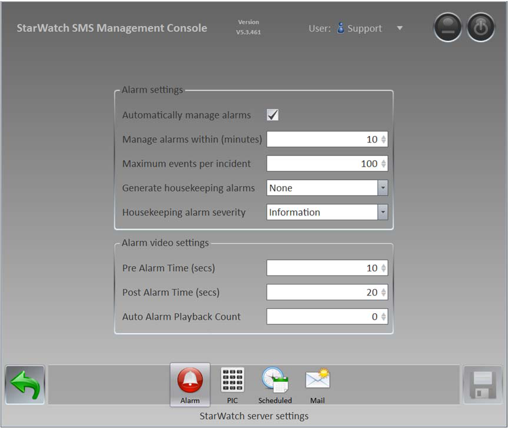

7. Management Console File Paths
You must make a note of the following settings on your system before you start. They may not
be the same as shown.

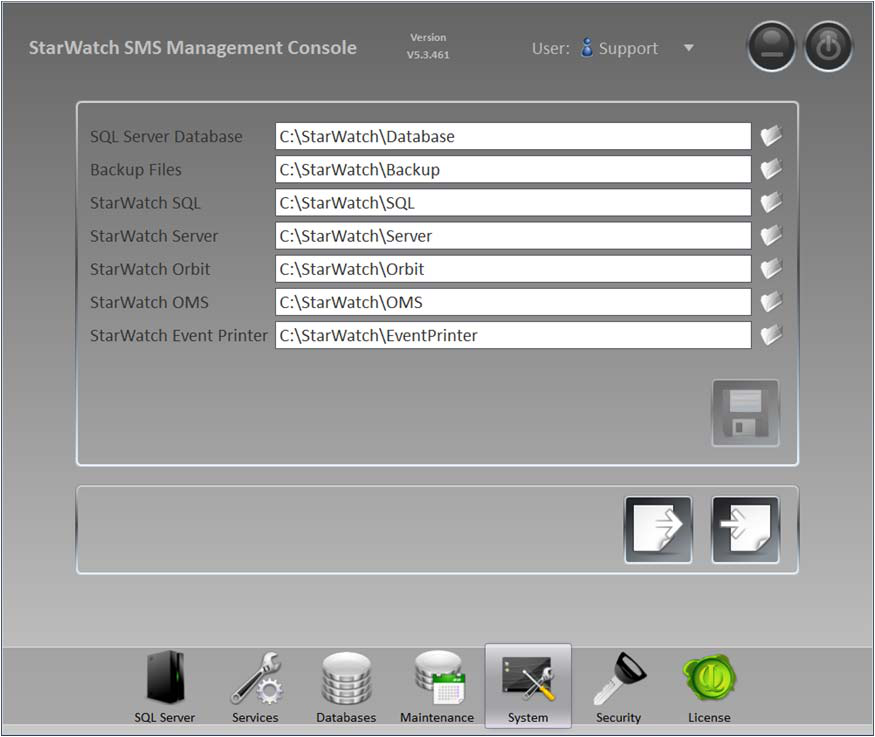

8. Backup Current Database
Backup the current database and make a note of the name of the database as shown below.

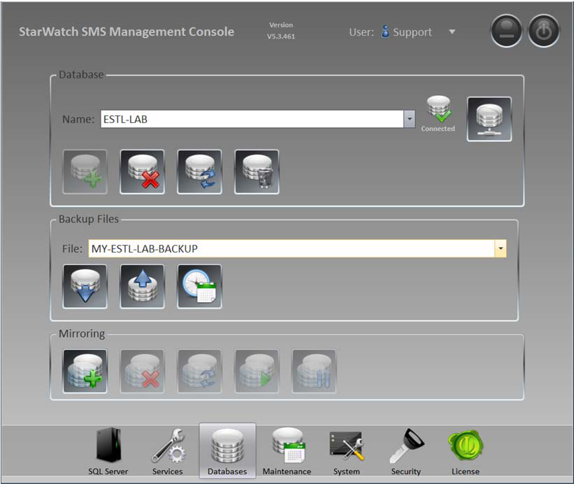

9. Save Backup File
Make sure that the file you created has a new name, and it should be copied to a safe place
(not the desktop).
10. Workstations
Close all current *Operator* and *Site Planner* applications that are open.

11. Servers/Device Servers
Close *MCU*, *Management Console*, *Operator*, and *Site Planner*.

## Ready to Start

If you have completed steps 1 through 11, then you can begin. Please review the steps now and make
sure each has been done and noted.

## Uninstall

Un-install your current *SMS* system on the *PMC* (Primary Server) and any updates.

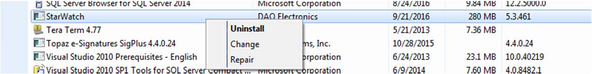

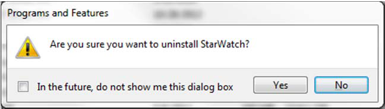

## Prepare

Copy your saved license file to the following folder (do not worry if it already exists).
C:\StarWatch\Server

## Install

1. Install your new *SMS* system from the *msi* file.  Currently this is the following file dated Jun-28th.

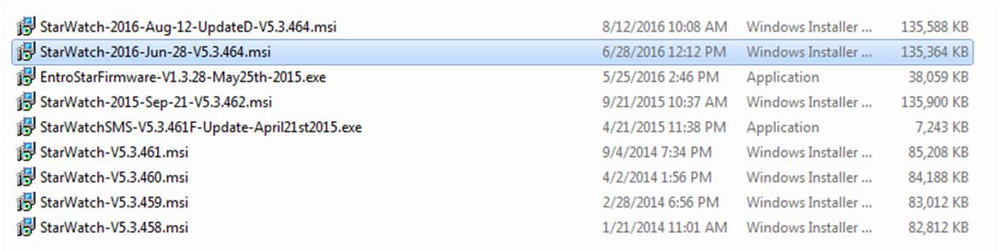

2. Select the server and enter the *sa* password and connect.

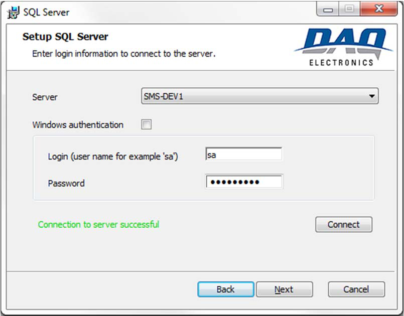

3. Select the database name that you made note of and the installation will update the database
correctly.

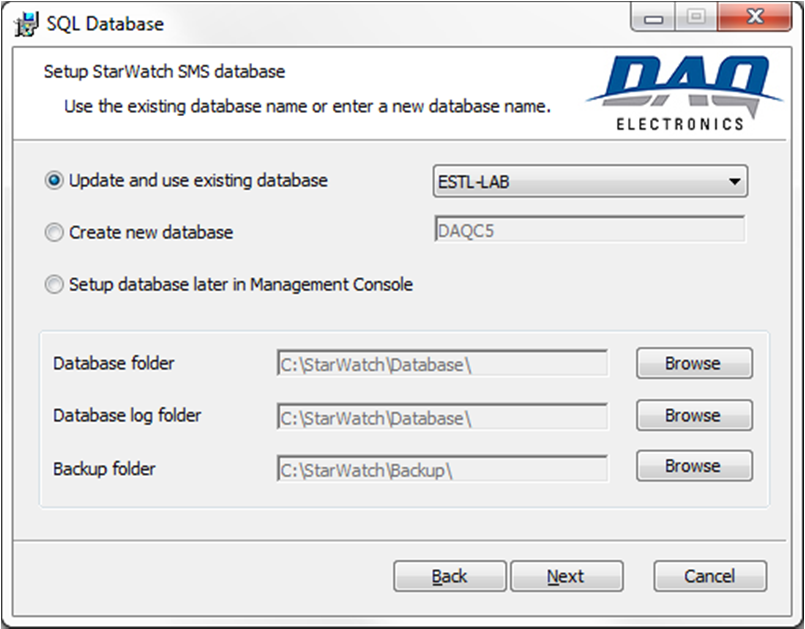

4. Complete the install.

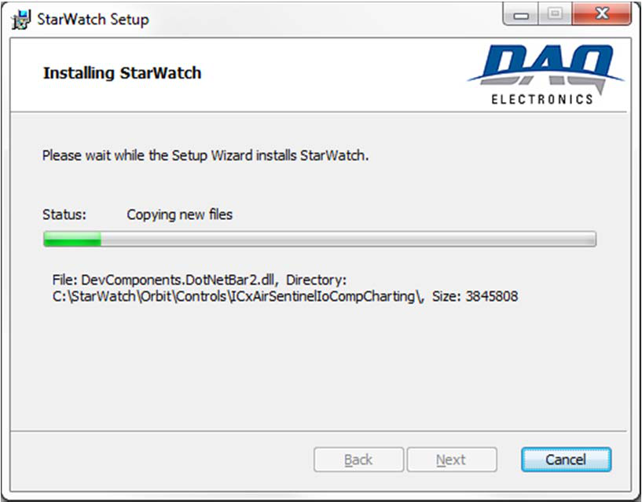

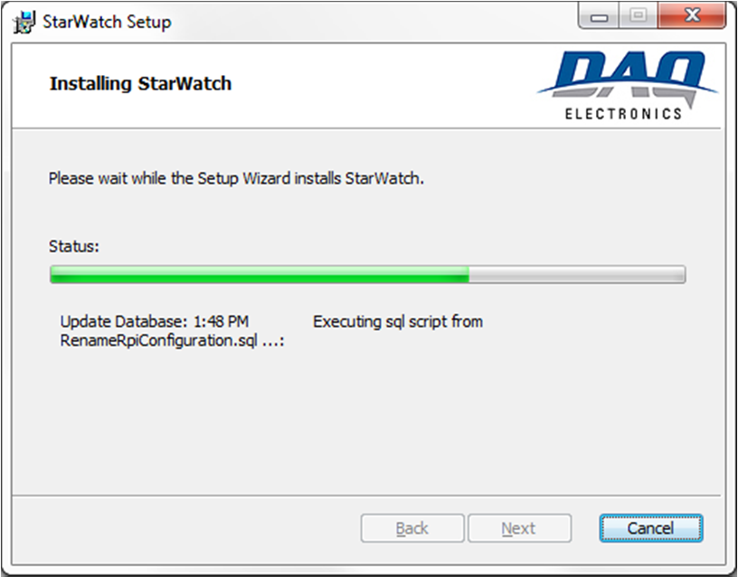

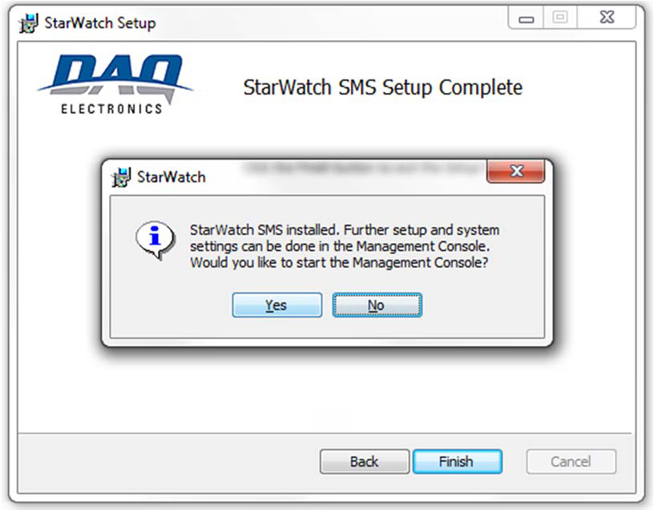

## After Installation

1. Open the *Management Console* and go to *Support* level.

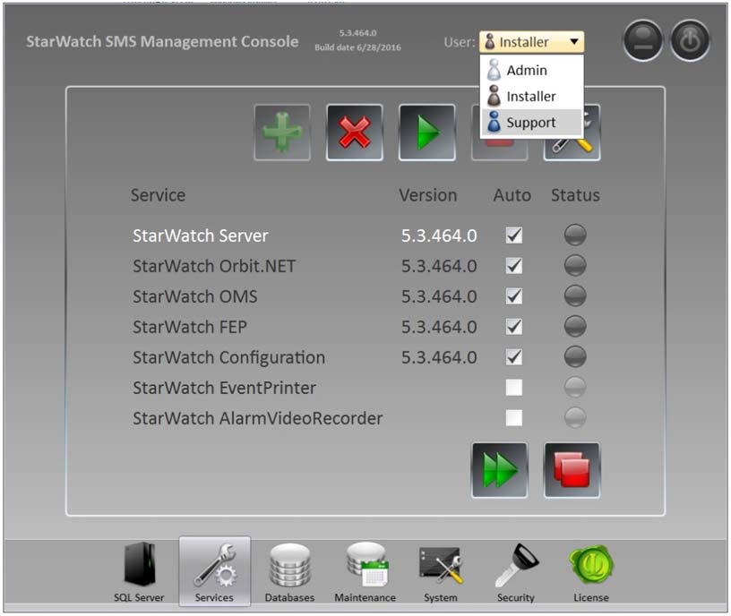

The password should be “sysadmin” and should be changed if needed on the security page.

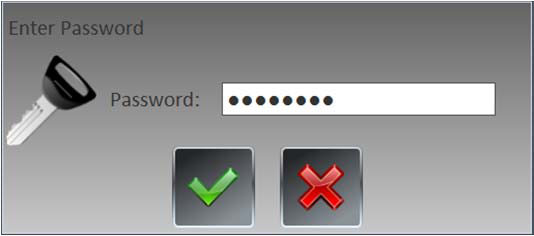

2. Update the following pages with the original settings.

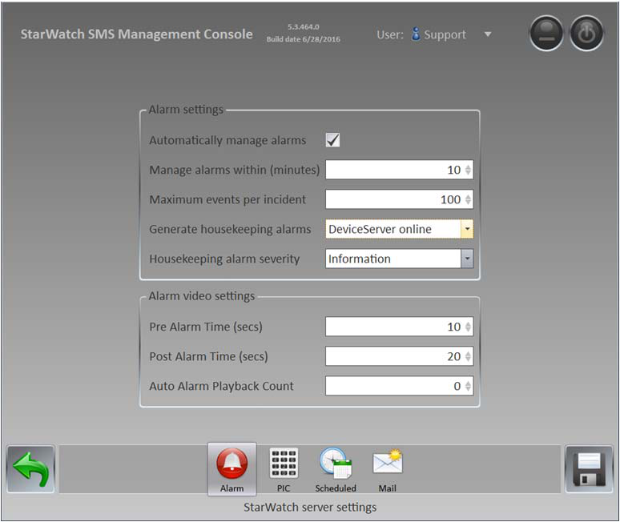

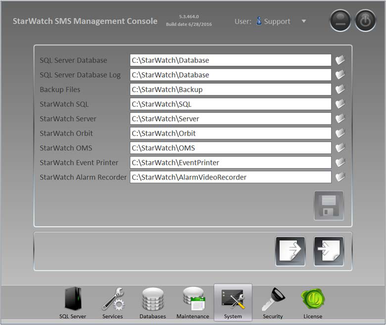

## Finishing Up

1. RPI Driver INI File
Copy the saved *RPI Driver.ini* file to:
C:\StarWatch\Orbit
2. Apply Hotfixes
If you would like to update any hotfixes or updates run these now.
3. Start the Services
From the Management Console start all services.

## Device Server

Follow this entire guide for the *Device Server*, but ignore the license file as no license is needed.

## Workstation

Try to run the original *Operator* and see if the system updates automatically.  If not, remove the old
version and install the new version using only the workstation option.

---

*© DAQ Electronics, LLC*
