# How to Use Advanced Filters

## Step 1 – Start new filter

Choose an item to filter on – in this example, the *Card Type*.

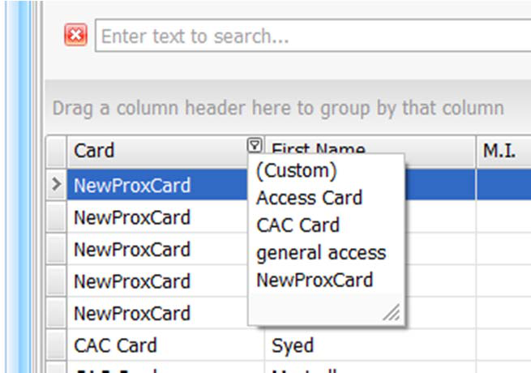

We now have the filter *NewProxCard* as the card type filter.

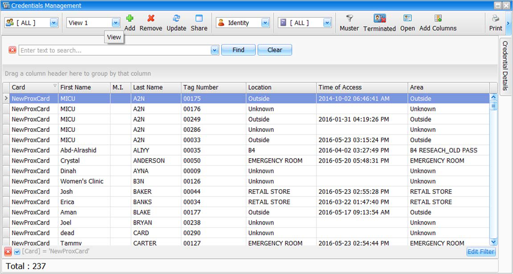

## Step 2 – Edit filter

Click on the *Edit Filter* button at the bottom right of the view.

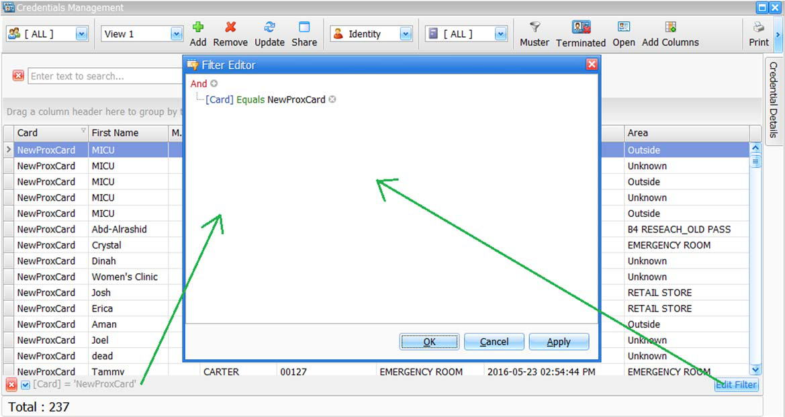

Click on the *And* condition (root node of the filter) to call up the following menu.

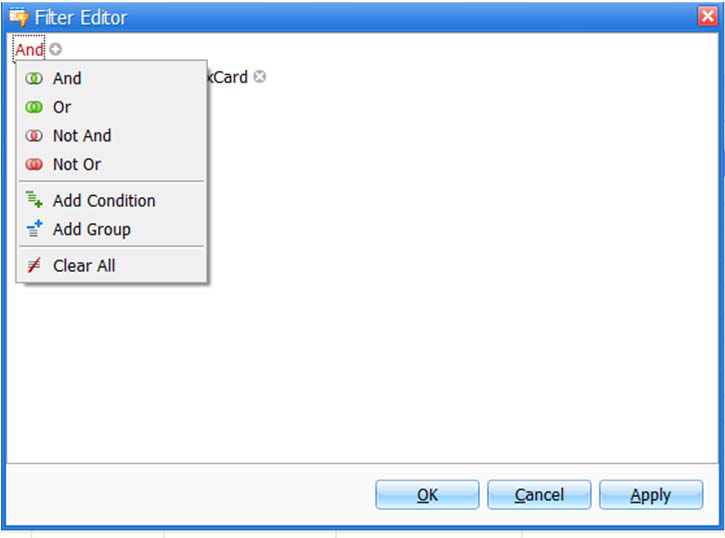

Select the menu item *Add Group*.

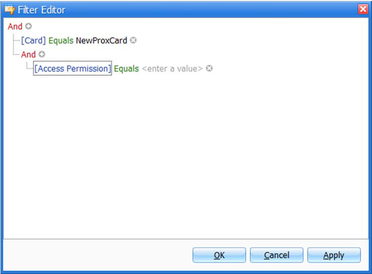

You should now see two conditions: the main node condition *And* and a sub-node condition *And*
(group).

## Step 3 – Customize the filter as needed

Most conditions involving multiple columns and multiple values require groups of conditions. For
example:
*Card = ‘My card’ AND (Area = ‘Floor 1’ OR Area = ‘Floor 2’)*
Note that in this filter the brackets include multiple values of the item *Area*.  Multiple values of the
same item must always be grouped by *OR* and different items are always grouped by *AND* with each
group of item values.
First, change the sub-group condition to *Or*, as shown, by clicking on the sub *And* item and selecting *Or*
from the menu.

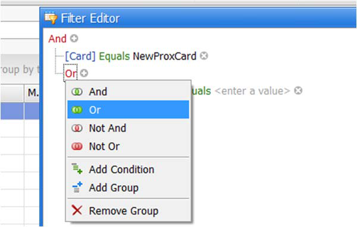

Next, add another comparison to this group by clicking on the “*+*” sign to the right of the *Or* group.

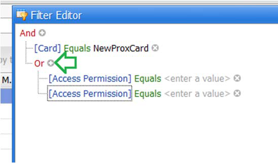

Next, change all the items and values as needed.
If we want all cards except one type of card *And* located in two different areas, change the first item
called *[Card]* and modify the *Equals* to *Does not equal*.

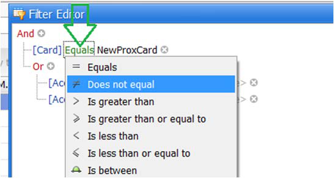

Next, change both the items labeled as *[Access Permission]* to *Area*.

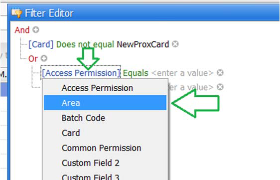

Enter the value required (this is a manual operation, so care must be taken to enter the exact value
needed).

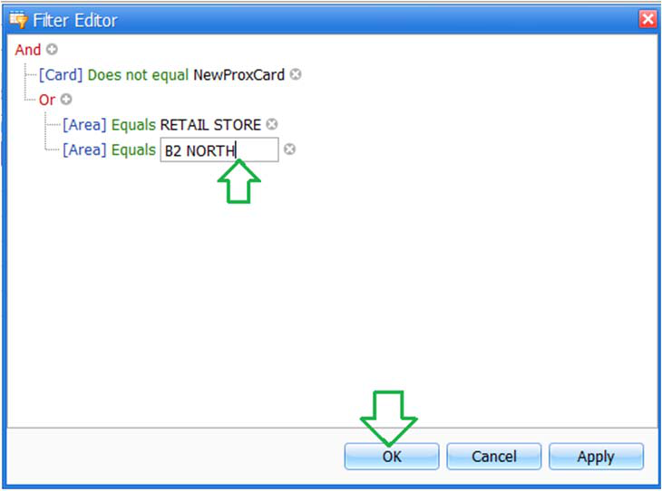

Note that the filtered results are as required.

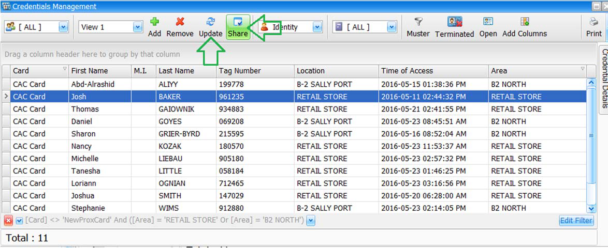

IMPORTANT: click *Update* to save the filter to the required view and *Share* if this view is to be used by
all operators.

---

*© DAQ Electronics, LLC*
