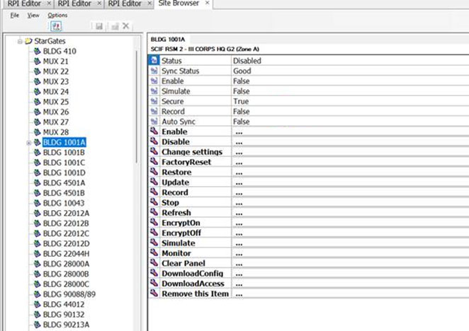
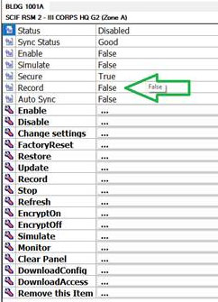
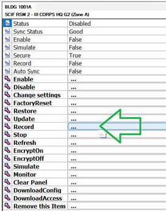
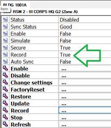
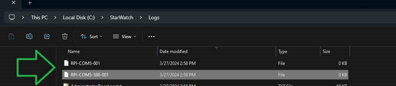

# How to Use Advanced Logging to Troubleshoot a Comms Failure

## Introduction

To gain a better understanding of what is happening across the network during a communications
failure to a station or SCIF, an advanced logging feature has been implemented on the *StarWatch SMS*
*Device Server*. This function allows you to turn on a log/record function for a selected station or SCIF
that will capture critical information in the event communication to the connection fails again. These
log files are more suited for troubleshooting than the older MCU log files, especially for these issues.
The captured log data can then be submitted to DAQ for analysis and generation of a fix.
Note: before beginning this procedure, you must be logged into the *Device Server*.
1. From either the *Site Builder* or *Site Planner* application (depending on the system version you
are running), launch the *Site Browser* tool. From here, you will be able to monitor remote
stations or SCIFs and directly control the logging function.

2. Using the list on the left side of the *Site Browser* tab, navigate to the station or SCIF that is
experiencing the communications failures and click on it. This will call up and display details
for the selected item on the right side of the window.

3. Near the top of the details area, locate the grayed out *Record* row. This will indicate whether
or not logging is currently active: *False* indicates that logging is OFF, while *True* indicates that
logging is ON. In most cases, logging will be in the *False* state.

4. To begin logging this connection, locate the bold *Record* row farther down the details list and
click on it.

This will begin logging all communications to the station or SCIF and set the original status
indication of the *Record* function to *True*.

5. Next, leave logging turned on until you experience another communications failure at the
selected connection. After the failure, return to the *Site Browser* tab, navigate to the station
or SCIF, and click on the bold *Record* row a second time to stop logging.

6. From your local *C:\StarWatch\Logs* folder, locate the saved log file(s) for the given port and
station/SCIF and copy them to a new location. File names begin with “RPI”, followed by the
comm port, “COM5” for example, then a number or the station and file number.

7. Zip up these file(s) and submit them to the DAQ technical support team for review.

---

*© DAQ Electronics, LLC*
