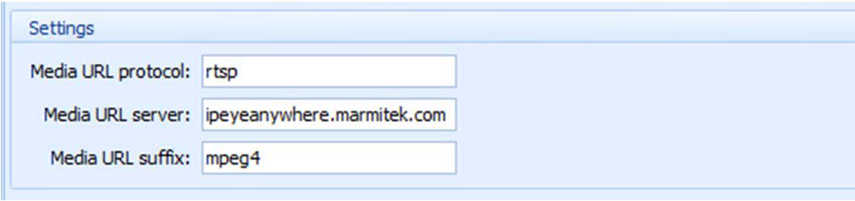
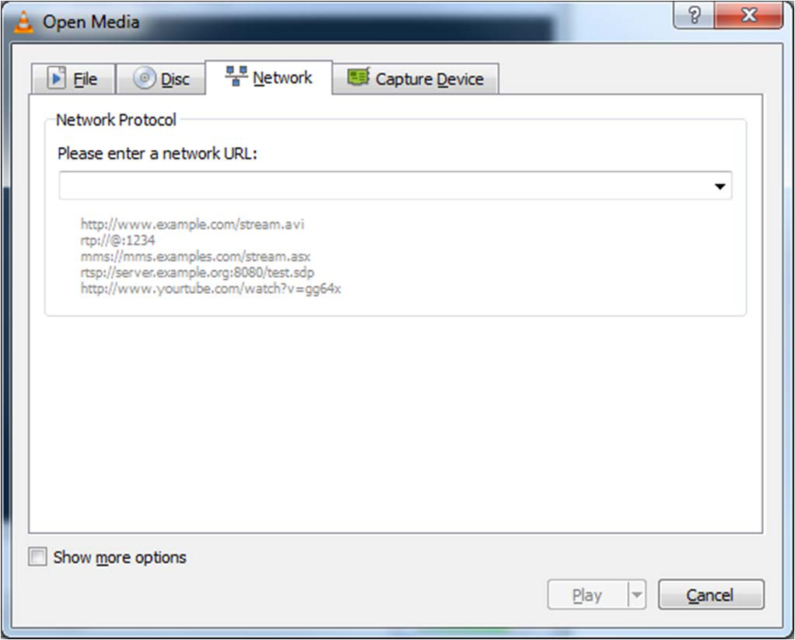
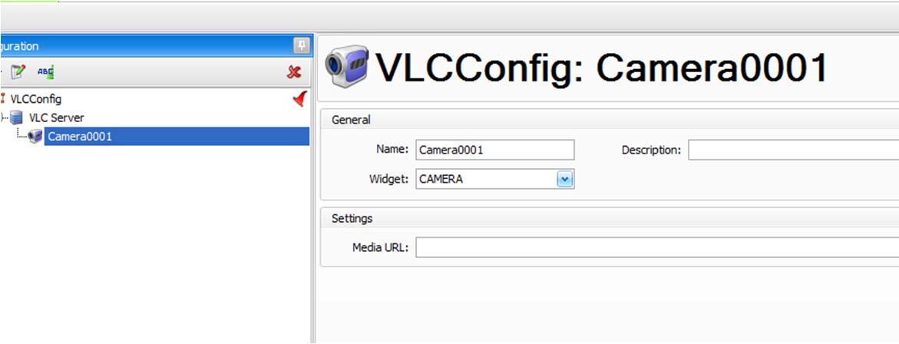

# How to Use VLC in StarWatch SMS

## VLC Editor Configuration

Introduction
In release version 5.3.461, the VLC configuration supported the following fields. This was revised to
make it easier for the user and more like the *VLC Player* that requires the user to specify only a single
string to connect to a video source.

In the original configuration shown, the user needed to know exactly what to enter into each field and
understand the options, even though in each case the protocol, server, and suffix options had no list of
selections.

## Network Stream

In *VLC Player*, the user is expected to browse or enter a specific string as needed to locate and play
the video source, as shown in the following screenshot from the *VLC Player*.

VLC also includes example strings for the URL, which we may include in a future release.

We decided to improve and simplify the VLC editor so that the user enters exactly the same URL as in
*VLC Player*. This can be seen in the new editor form as follows.

Only a string is required. No options or capabilities were lost with this change; it only made it easier
for the user to configure.
We wanted to be consistent with the *VLC Player* so that it was clear that if a stream did not work in
VLC, then it would not work in *StarWatch SMS*. This was a way of troubleshooting without *StarWatch*
*SMS* being at fault if a stream was not working.

## Media File

In addition, release 5.3.462 was improved so that media files could easily be selected and played by
configuring the path to the file.

## Media Folders

Also in release 5.3.462, it is possible to specify a folder of media files and they will get played in
rotation. For example, a folder of JPG files would be played like a slide show of images.

## Examples

The latest *StarWatch SMS* release will now support any of the following “URL” strings as examples.

## Remote URIs

Such as https or rtsp links or any other protocols which VLC player supports. For example:
*rtsp://video2.earthcam.com/fecnetwork/4559.flv*

## Local file

Path to the locally stored media file, for example:
*e:\temp\test.avi*

## Local folders

*d:\MyDemoFiles\*
In this case the *Operator* automatically creates a playlist of all the media files located in the
destination folder. The files in the folder can be "still" images (such as JPGs) or video files. The
folder content can be mixed as well (jpg + avi).

## VLC Streaming Capability

---

*© DAQ Electronics, LLC*
