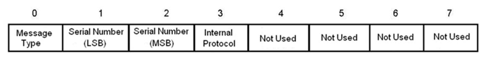

# RPI Over UDP/IP Protocol Overview

## Introduction

eRADC
The *eRADC* is a new version of the *StarGate III* board that can be connected to 10/100 BaseT Ethernet
switches using RJ45 Cat 5 or better cables (note that older Ethernet hubs are not recommended).
UDP/RPI
Communications over Ethernet are based on the UDP/IP protocol using port 48700, and require a single
IP address configured in the *StarGate III* using a local terminal (over serial) interface.

## UDP/IP header format

The format of the header of the UDP/IP frame is as follows:

*Message Type* contains the type of RPI message within the frame:
**Message Type**
**Meaning**
0
Request (REQ) from the master station to the RTU
1
Response (RESP) from the RTU to a request from the master station
2
Indication (IND) of an unsolicited event report from the RTU to the master station
3
Confirmation (CONF) sent by the master station on receipt of an indication from an
RTU
4
Flag (FLAG) from the RTU to the master station. A flag from the RTU tells the
Master that upsets are available.
*Serial Number* is a two-byte field containing the serial number of the message:
Byte 1 is the Least Significant byte of the serial number
Byte 2 is the Most Significant byte of the serial number
*Internal Protocol* contains the internal protocol in use. Currently, there is only one protocol in use and
the value is 0.
The remaining bytes are not used and are each set to 0.

## RPI message format within IP

RPI messages within IP have the same format as their non-IP counterparts.  The message is wrapped
within the UDP/IP frame and sent to the relevant destination IP address and port number. Each RPI
address has an associated IP address.  Port number 48700 is used by both the master station and the
RTU.

## Protocol

a) The master station shall send one “REQ” message poll and wait for a “RESP” reply message to
each RTU that is configured for UDP using the configured IP address in the master stations.
b) The RTU shall always be open to receive a “REQ” message and shall process the received RPI
message as normal.
c) After the RTU has processed a receive message, if there is a reply, the message shall be sent to
the master immediately as a “RESP” message.
d) The master shall start the serial number as one and then increment the serial number for each
successful exchange. In this first style of implementation, the serial numbers shall have no
meaning.
e) The master shall poll the RTU until a message is received from the RTU that indicates it has no
upsets (General Upsets reply with no upsets).
f) When the master receives a no upsets message from the RTU, it shall back off from polling the
RTU for a time period of approximately 30 seconds.
g) The RTU shall monitor upsets, and at any time, if there are upsets to report, the RTU shall send
a “FLAG” message (8  bytes only) with no RPI content. The RTU shall then wait for 30 seconds
and send the “FLAG” message again if upsets have not yet been reported. This shall continue
until the RTU has no upsets to report.
h) The RTU shall always check the “REQ” message source IP address and respond to the host IP
address in any “RESP” message.
i)
The RTU shall save the host IP address for reporting “FLAG” messages.
j) The RTU shall not report “FLAG” messages until it has received the first “REQ” message.

## Software

The following software releases are recommended:
*SMS v5.2.462 Final (September 21st 2015)*
https://dl.dropboxusercontent.com/u/70533054/StarWatch-2015-Sep-21-V5.3.462.msi
*CallistoView 5.5.34B Final (July 28th 2015)*
https://dl.dropboxusercontent.com/u/70533054/CallistoView-V5.5.34B-July28th-2015.exe

---

*© DAQ Electronics, LLC*
