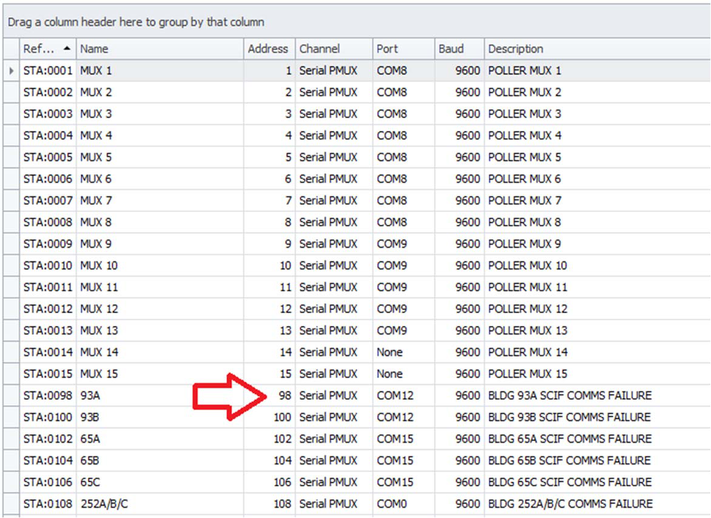
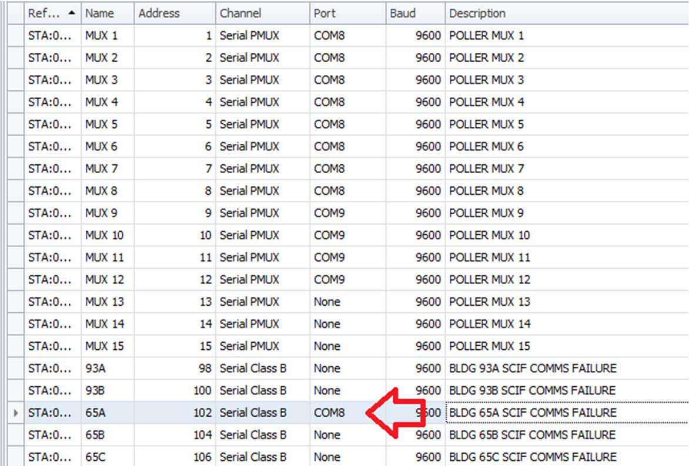
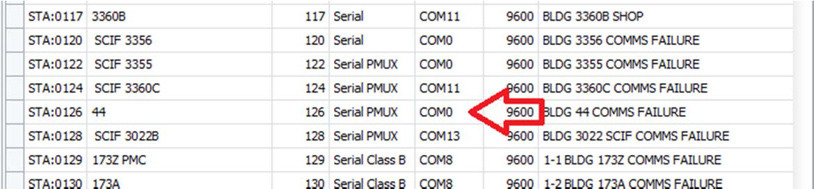
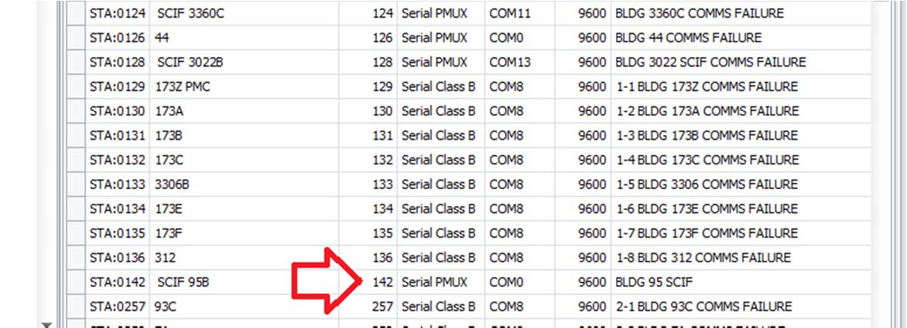
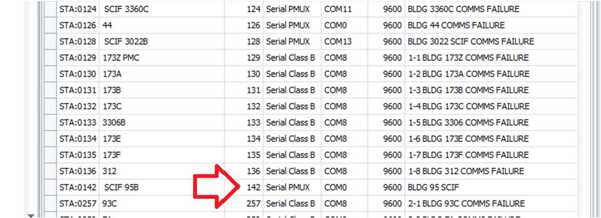
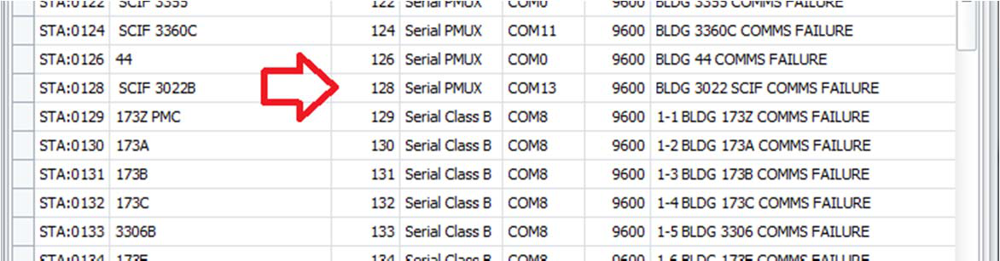
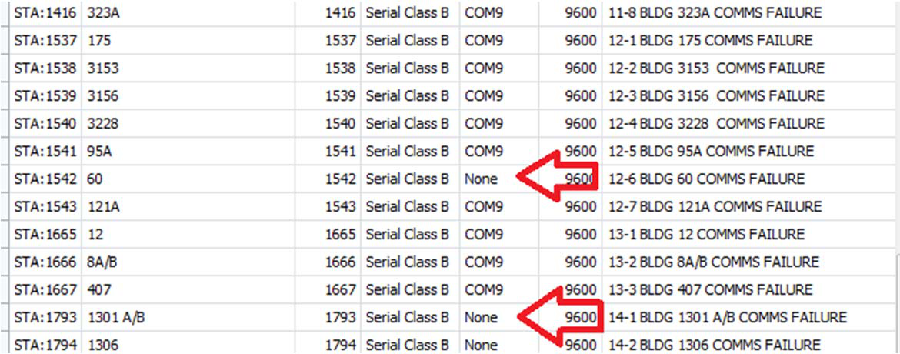
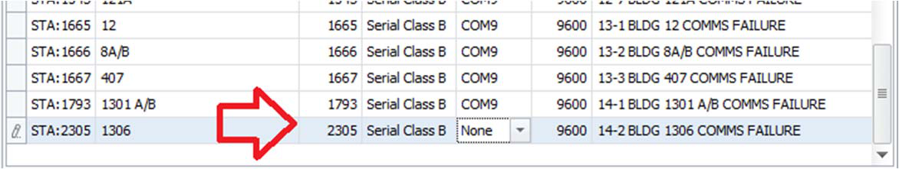

# Typical Configuration Errors When Using RPI Driver

## Typical Configuration Errors

These errors were found on an upgraded system and should have been corrected prior to further
commissioning of zones. The screenshots were taken from the backup after it was reported that the
system had been checked for configuration errors by the installer.

## Remote SCIF RADC Channel

In the following example, the remote RADC in BLDG 93A SCIF is configured as a PMUX when it should be
“Serial Class B”.

## PMUX and RADC Sharing Same Port

In the following example, Station 65A is a remote SCIF RADC and it is assigned to COM8, the same port
used by MUX1 to MUX8.

## Invalid or Unknown Com Ports

In the following example, COM0 was somehow configured. This should not cause a problem, but it is
recommended to set any station that is not assigned yet to a valid com port to “None”.

SCIF Computer Using PMUX Remote Station Address
In the following example, a SCIF computer is assigned to a station address greater than 128 and,
therefore, it must be connected to a PMUX.

## Remote Station has Incorrect Channel

In the example below, a remote station connected to a PMUX should have the channel type “Serial
Class B”.

## Invalid Station Addresses

Station addresses below 129 must be in the range 1 to 126. The following addresses are illegal in RPI
and will cause communication errors: Station 0, Station 127, and Station 128 (all impossible addresses).

## Inconsistent Remote Station Port

Stations that are attached to a PMUX should be assigned to the same serial port as their parent PMUX
serial port or assigned to “None”. On systems running on 5.3.462 or greater, this setting can be “None”
for all remote stations and the station will automatically be attached to the correct PMUX.

## Missing PMUX Station

The station address below is configured as 2305 (PMUX 18, Remote Station 1) however no PMUX 18
exists in the database. This example was not found on the upgraded system, but was made up as
another example of a typical error.

---

*© DAQ Electronics, LLC*
