# StarGate-5 Installation Guide

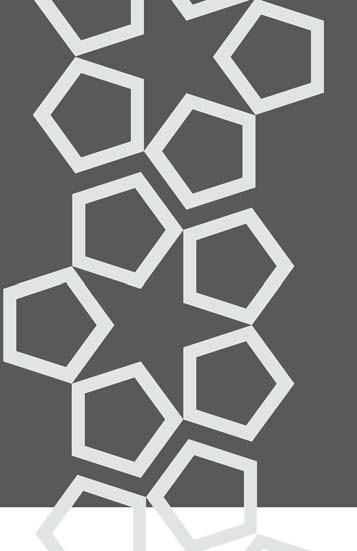

## 1.0 GENERAL

The StarGate 5 is a PoE+ native BACnet® intrusion detection panel offering true open connectivity for
diverse applications. Designed to communicate with any ANSI/ASHRAE 135-2010 compliant system or
security central station, the panel enables seamless integration of intrusion detection, security, and
building management systems.
The StarGate 5 controller supports 8 I/O points, expandable in sets of 8 additional points. The panel can
be installed directly or housed within a metal enclosure with a 24VDC power supply. The unit can also
provide local battery back-up charged by the local power supply or PoE+ supply.
In addition to traditional PIN-based arming/disarming, the StarGate 5 supports a SAML-based user
authentication process, allowing customers to centrally and uniquely manage who can arm/disarm their
facilities. Via an integrated LCD touchscreen, users are prompted to enter a unique User Name/Password
combination, which is validated against a centralized SAML server. This process provides the highest level
of IDS authentication and security.

## Key Features


PoE+ native BACnet intrusion detection panel

Status indication LEDs and icons reduce installation and configuration time

PoE+ design powers unit

LCD touch panel powered from main board

4 state alarm monitoring

Advanced SAML user authentication

## 2.0 VISUAL OVERVIEW

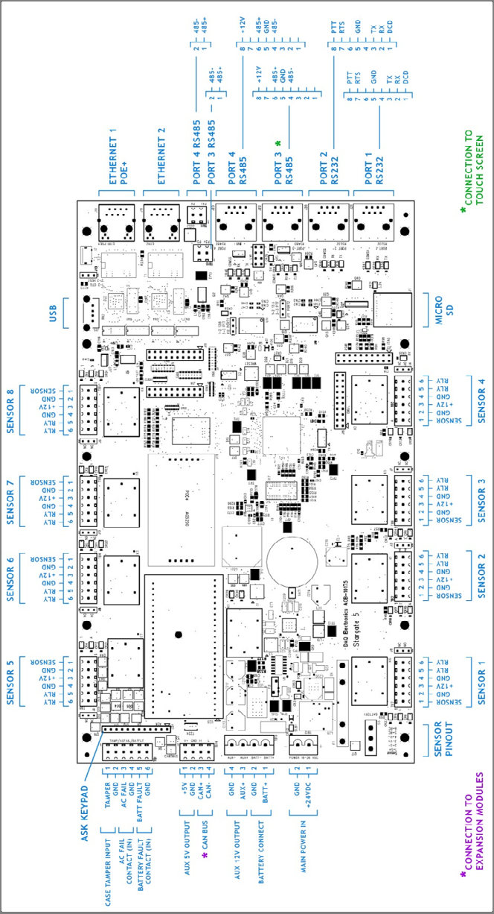

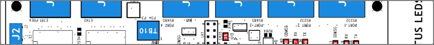

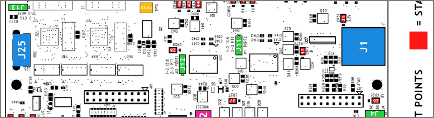

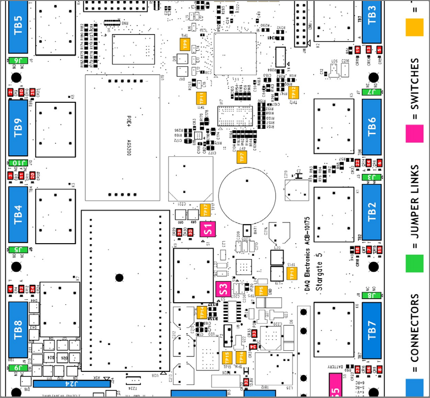

## 3.0 TECHNICAL SPECIFICATIONS

## 3.1 FACILITIES


Connects to central stations via contact ID over IP

Connects to third-party BACnet compliant systems

IDS I/O sets

Plug and play network connection

Up to three 7” 800x480 LCD touch panel interfaces

## 3.2 TECHNICAL DATA

1000 MHz ARM Cortex A9
Processor:
512 MB RAM
Memory:
512 MB Flash
Operating System
Linux
Database:
SQL Lite

## 3.3 ENVIRONMENTAL

Temperature:
Storage / Operating: -40°C to +70°C
Humidity:
Up to 93% humidity non-condensing at +40°C
EMC:
BS EN 5502
BS EN 50082-1
Dimensions:
10in. (25.4cm) x 6in. (15.2cm)

## 3.4 ELECTRICAL

Supply:
PoE+:
25.5W (min) 34.2W (max)
DC:
24V (+/- 25%), 40W (min)
Power Available for
DC:
24W (max) total
External Equipment:
12.5V (+/- 10%) @ 2A
Battery:
Type:
Lead-acid
Voltage:
12V
Capacity:
14.4Ah (recommended)
Note:
Battery charge times will be extended when using a larger
capacity battery
Note:
Battery connection incorporates reverse polarity protection
Outputs:
2A @ 13.8V for charging backup battery, 12.5V (+/- 10%) on PoE
50mA @ 12.5VDC (+/- 10%) power for each sensor (8 total)
Fuse:
F1 = 3A
3AG

## 3.5 ADDITIONAL FEATURES


Micro SDHC card support

USB 2.0 interface

128 bit encryption

Two RS232 serial ports

Two RS485 serial ports

Dual gigabit ethernet ports

Expansion modules: I/O, 202 modem, Arcnet

Optional cellular modem

## 4.0 WIRING AND SETUP

## 4.1 CONNECTORS

**Reference**
**PIN**
**Function**
TB1
EXT. DRY CONTACT INPUT
TB1
1
CASE TAMPER
TB1
2
GROUND
TB1
3
AC FAIL
TB1
4
GROUND
TB1
5
BATTERY FAULT
TB1
6
GROUND
TB2
**SENSOR 2 I/O**
TB2
1
SENSOR 2 INPUT
TB2
2
GROUND
TB2
3
POWER OUT (12V)
TB2
4
GROUND
TB2
5
RELAY 2 CONTACT A
TB2
6
RELAY 2 CONTACT B
TB3
**SENSOR 4 I/O**
TB3
1
SENSOR 4 INPUT
TB3
2
GROUND
TB3
3
POWER OUT (12V)
TB3
4
GROUND
TB3
5
RELAY 4 CONTACT A
TB3
6
RELAY 4 CONTACT B
TB4
**SENSOR 6 I/O**
TB4
1
SENSOR 6 INPUT
TB4
2
GROUND
TB4
3
POWER OUT (12V)
TB4
4
GROUND
TB4
5
RELAY 6 CONTACT A
TB4
6
RELAY 6 CONTACT B
TB5
**SENSOR 8 I/O**
TB5
1
SENSOR 8 INPUT
TB5
2
GROUND
TB5
3
POWER OUT (12V)
TB5
4
GROUND
TB5
5
RELAY 8 CONTACT A
TB5
6
RELAY 8 CONTACT B

**Reference**
**PIN**
**Function**
TB6
**SENSOR 3 I/O**
TB6
1
SENSOR 3 INPUT
TB6
2
GROUND
TB6
3
POWER OUT (12V)
TB6
4
GROUND
TB6
5
RELAY 3 CONTACT A
TB6
6
RELAY 3 CONTACT B
TB7
**SENSOR 1 I/O**
TB7
1
SENSOR 1 INPUT
TB7
2
GROUND
TB7
3
POWER OUT (12V)
TB7
4
GROUND
TB7
5
RELAY 1 CONTACT A
TB7
6
RELAY 1 CONTACT B
TB8
**SENSOR 5 I/O**
TB8
1
SENSOR 5 INPUT
TB8
2
GROUND
TB8
3
POWER OUT (12V)
TB8
4
GROUND
TB8
5
RELAY 5 CONTACT A
TB8
6
RELAY 5 CONTACT B
TB9
**SENSOR 7 I/O**
TB9
1
SENSOR 7 INPUT
TB9
2
GROUND
TB9
3
POWER OUT (12V)
TB9
4
GROUND
TB9
5
RELAY 7 CONTACT A
TB9
6
RELAY 7 CONTACT B
TB10
**PORT 3 RS485 TERM BLOCK**
TB10
1
PORT 3 RS485 +
TB10
2
PORT 3 RS485 -
TB11
**PORT 4 RS485 TERM BLOCK**
TB11
1
PORT 4 RS485 +
TB11
2
PORT 4 RS485 -
TB12
**MAIN POWER INPUT**
TB12
1
POSITIVE DC IN (18-30)
TB12
2
GROUND
TB13
**BATTERY / AUX POWER**
TB13
1
BATTERY + (12V)
TB13
2
BATTERY - (GND)
TB13
3
AUX POWER + (12V)
TB13
4
AUX POWER - (GND)

**Reference**
**PIN**
**Function**
TB14
**CANBUS / 12 VOLT POWER**
TB14
1
CAN -
TB14
2
CAN +
TB14
3
GROUND
TB14
4
+12 VDC
J1
**MICRO SD**
J18
**ETHERNET 1**
J19
**ETHERNET 2**
J20
**SERIAL PORT 2**
J20
1
RS232-2 DCD
J20
2
RS232-2 RX
J20
3
RS232-2 TX
J20
4
NC
J20
5
GROUND
J20
6
NC
J20
7
RS232-2 RTS
J20
8
PTT/12V
J21
**SERIAL PORT 1**
J21
1
RS232-1 DCD
J21
2
RS232-1 RX
J21
3
RS232-1 TX
J21
4
NC
J21
5
GROUND
J21
6
NC
J21
7
RS232-1 RTS
J21
8
PTT/12V
J22
**SERIAL PORT 3**
J22
1
12V
J22
2
GROUND
J22
3
GROUND
J22
4
RS485-3 NEGATIVE
J22
5
GROUND
J22
6
RS485-3 POSITIVE
J22
7
12V
J22
8
12V
J23
**SERIAL PORT 4**
J23
1
12V
J23
2
GROUND
J23
3
GROUND
J23
4
RS485-4 NEGATIVE
J23
5
GROUND
J23
6
RS485-4 POSITIVE
J23
7
12V
J23
8
12V

**Reference**
**PIN**
**Function**
J24
**ASK KEYPAD**
J24
1
5V
J24
2
ASK RED LED
J24
3
ASK GREEN LED
J24
4
ASK YELLOW LED
J24
5
ASK ROW1
J24
6
ASK ROW2
J24
7
ASK ROW3
J24
8
ASK COL1
J24
9
ASK COL2
J24
10
ASK COL3
J24
11
ASK COL4
J24
12
GROUND

## 4.2 SWITCHES

**Reference**
**Function**
S1
Cold reset
S2
Factory use
S3
Factory use

## 4.3 JUMPER LINKS

**Reference**
**PIN**
**Function**
J3
**RELAY 2 NORM OPEN/CLOSED**
J3
1-2
NORM OPEN
J3
2-3
NORM CLOSED
J4
**RELAY 4 NORM OPEN/CLOSED**
J4
1-2
NORM OPEN
J4
2-3
NORM CLOSED
J5
**RELAY 6 NORM OPEN/CLOSED**
J5
1-2
NORM OPEN
J5
2-3
NORM CLOSED
J6
**RELAY 8 NORM OPEN/CLOSED**
J6
1-2
NORM OPEN
J6
2-3
NORM CLOSED
J7
**RELAY 3 NORM OPEN/CLOSED**
J7
1-2
NORM OPEN
J7
2-3
NORM CLOSED
J8
**RELAY 1 NORM OPEN/CLOSED**
J8
1-2
NORM OPEN
J8
2-3
NORM CLOSED
J9
**RELAY 5 NORM OPEN/CLOSED**
J9
1-2
NORM OPEN
J9
2-3
NORM CLOSED
J10
**RELAY 7 NORM OPEN/CLOSED**
J10
1-2
NORM OPEN
J10
2-3
NORM CLOSED
J11
**PORT 2 - PIN8 PTT/12V**
J11
1-2
PIN 8 = 12V
J11
2-3
PIN 8 = PTT
J12
**PORT 1 - PIN8 PTT/12V**
J12
1-2
PIN 8 = 12V
J12
2-3
PIN 8 = PTT
LK1
**PORT 3 AND 4 RS485 BIAS AND** **TERMINATION**
LK1
1-2, 3-4
PORT 3 BIAS AND TERMINATION
LK1
5-6, 7-8
PORT 4 BIAS AND TERMINATION
LK2
19-20
FACTORY RESET

## 4.4 TEST POINTS

**Reference**
**Function**
TP1
ADCTRIG
TP2
TIMER7
TP3
TIMER4
TP4
PMIC TP
TP5
GND
TP6
GND
TP7
1.1V CORE
TP8
1.1V MPU
TP9
1.8V LDO
TP10
3.3V
TP11
VDCDC3
TP12
V1.8 BATT
TP13
V1RTC
TP14
5V
TP16
13.8 REG
TP17
12V POE

## 5.0 STATUS LEDS

**Reference**
**Function**
CR1
TAMPER 8
CR2
TAMPER 6
CR3
TAMPER 7
CR4
TAMPER 5
CR5
TAMPER 4
CR6
TAMPER 3
CR7
ALARM 2
CR8
TAMPER 1
CR9
ALARM 8
CR10
ALARM 6
CR11
ALARM 7
CR12
ALARM 5
CR13
ALARM 4
CR14
ALARM 3
CR15
TAMPER 2
CR16
ALARM 1
CR17
SPARE LED
CR18
RELAY 2
CR19
RELAY 4
CR20
RELAY 6
CR21
RELAY 8
CR22
RELAY 3
CR23
RELAY 1
CR24
RELAY 5
CR25
RELAY 7
CR26
8 VOLTS
CR27
HEARTBEAT
CR28
RESET
CR29
CELLULAR LED
CR30
CELL USR LED
CR31
3.3 VOLT
CR32
13.8 VOLT
CR33
POE
CR34
DC POWER
CR35
5 VOLT
CR36
TRANSMIT PORT 2
CR37
RECEIVE PORT 2
CR38
TRANSMIT PORT 1
CR39
RECEIVE PORT 1
CR40
GOOD MESSAGE P2

**Reference**
**Function**
CR41
GOOD MESSAGE P1
CR42
TRANSMIT PORT 4
CR43
RECEIVE PORT 4
CR44
TRANSMIT PORT 3
CR45
RECEIVE PORT 3
CR46
GOOD MESSAGE PORT 4
CR47
GOOD MESSAGE PORT 3
CR48
PERIPHERAL POWER FAULT
CR49
BATTERY FAULT

## 6.0 INSTALLATION PROCEDURES

## 6.1 SELECTING A LOCATION

Determine a suitable installation location for the StarGate 5 controller that is secure and provides an
environment with temperature ranging from no less than -40 degrees C and no greater than +70 degrees
C with a relative humidity no greater than 93% non-condensing @ +40 degrees C.

## 6.2 POWER SOURCE

Determine power source:
a. PoE+ with at least 25.5 Watts available – must meet IEEE802.3at specification.
b. Local DC supply rated at 24VDC nominal +/-25% rated at 40 Watts minimum, power cable length
not longer than 30m (98.5 feet)

## 6.3 MOUNTING THE PANEL/CONTROLLER

Install the StarGate 5 controller onto a suitable surface using the mounting holes located along the long
edges of the board. There are 10 mounting holes in total.
Note: mounting hardware to be supplied by the installer.

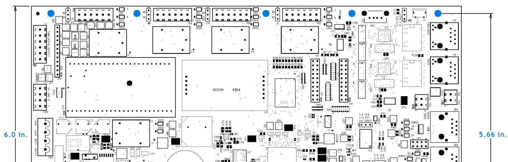

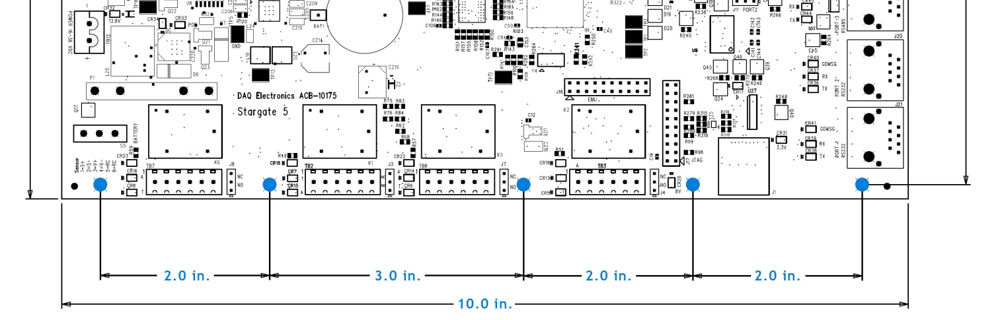

Alternatively, determine the appropriate conduit knockouts on the DAQ enclosure and remove. Then
mount the enclosure to the mounting surface using the installer-provided hardware. Using the mounting
holes along the long edges, mount the StarGate 5 controller to the appropriate location on the enclosure
backplane.

## 6.4 TERMINATING TAMPER-PROTECTED INPUTS

All tamper-protected inputs must be terminated using either:
a. A 2K termination resistor block (DAQ Part# R07-09771) wired with the black leads to the input
device and white leads to the panel. Note: resistor packs not included.

b. Or with two 1K Ohm resistors supplied by the installer***.***

Resistors should be installed at the sensor and not on the StarGate 5 terminal blocks.
Tamper protected inputs are monitored for four states:

Sensor Normal

Sensor Alarm

Tamper circuit shorted out

Tamper circuit cut open

## 6.5 OUTPUT RELAYS

Output Relay contacts are rated at 10A. Each I/O point can provide 50mA @12.5VDC +/- 10% for
powering a sensor.

## 6.6 POWERING THE CONTROLLER

The StarWatch 5 controller automatically detects the power source and displays the type of source via
LED indicators located on the controller.

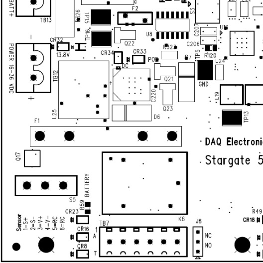

LED location CR 33 indicates that a PoE+ source is connected. LED location CR 34 indicates that a DC
source is connected. Note: if both types of source are connected, both LEDs will light, but the unit will
default to using the DC power source.

## 6.6.1 POE+

If using PoE+, the distance from the PoE+ source (switch or injector) must not exceed 100m unless
otherwise stated by the power source manufacturer. The PoE+ source should be connected into the
Ethernet 1 port, indicated as ETH1 POE+ on the board.

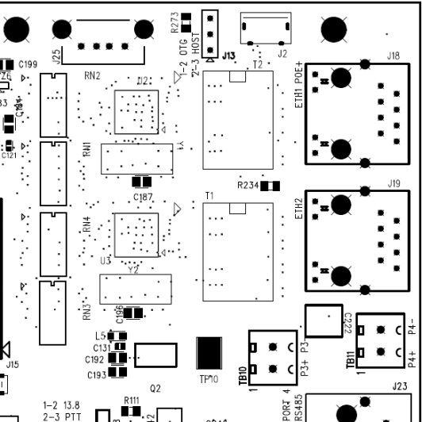

Note: PoE+ (IEEE802.3at) has the ability to power the StarGate 5 controller, charge the local battery
back-up if used, and provide power to all peripherals, including sensors. The maximum output current
draw for all devices in concurrent operation cannot exceed 1A.

## 6.6.2 LOCAL DC

When using a local DC power source, the supply must provide 24VDC +/- 25% rated @40 Watts and a cable
length of no more than 30m (98.5 feet)
a. Connect the local supply to TB12 with the positive terminal to TB12 PIN 1 and the negative
(ground) terminal to TB12 PIN 2.

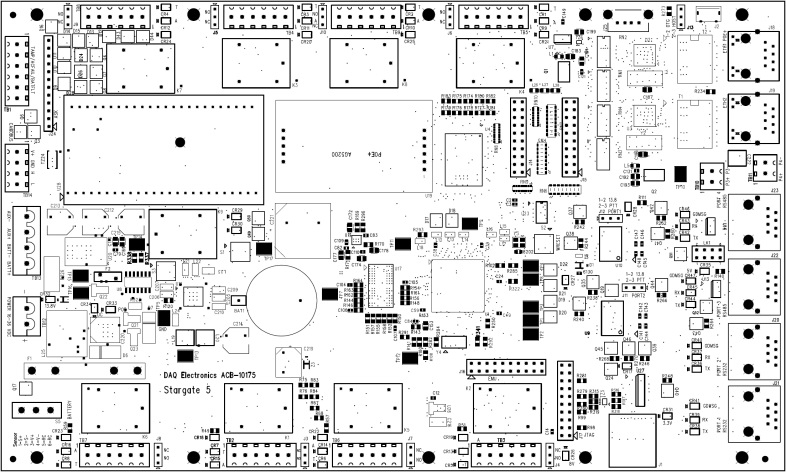

## 6.6.3 LOCAL BATTERY BACK-UP

If providing a local battery back-up, you must provide a 12VDC 14ah (minimum) rated lead-acid battery.
a. Connect the battery to the appropriate +/- terminals, per labelled terminal block TB13 PIN 1
(Batt V+) and TB13 PIN 2 (GND).

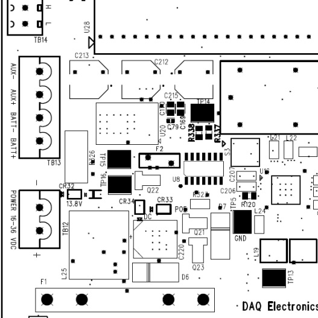

## 6.6.4 AUXILIARY POWER

Auxiliary power output provides 12.5V (+/- 10%) up to 2A on TB13 PIN 3 (positive) and PIN 4 (negative).

## 6.7 RIOX 5 EXPANSION

RIOX-5 input/output expansion modules are used to increase the point count of StarGate 5 controllers,
enabling the integration of additional StarWatch components and sensors. Through direct, on-board
connections, up to seven RIOX-5 units can be added to a single StarGate 5, with each module providing
eight additional status inputs and eight relay outputs.
All inputs are tamper protected and can detect normal, alarm, tamper open, and tamper short conditions
on the monitored line. LEDs are utilized to indicate the signal condition and can be used for diagnostic
purposes. Software configuration allows for normally open or normally closed sensor input contacts to
represent the normal condition. Outputs are provided with relays from Form C contacts, with link
selection allowing outputs to be configured as normally open or normally closed.

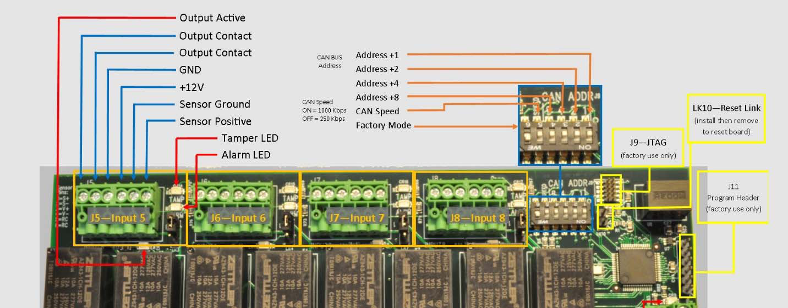

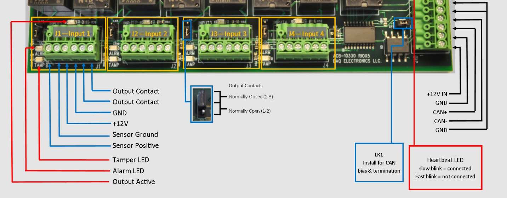

## 6.8 CONNECTING TO A NETWORK

With all connections made and properly terminated, connect the StarGate 5 controller to your network
via the RJ45 jack located at location J18 or J19 using CAT 5e/6 for Gbit cabling.

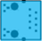

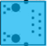

Connect to Network

## 6.9 CONNECTING TO A TOUCHSCREEN INTERFACE

Connection to an external touch screen interface is made via a CAT 5/5e cable running from port 3 at
location J22 on the StarGate 5 controller to port J2 or J3 on the interface board.

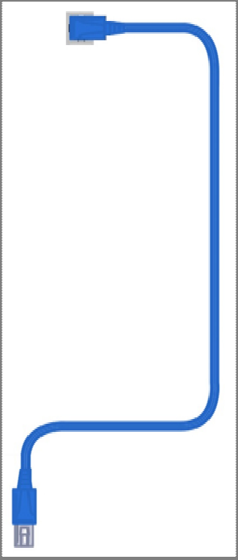

Connect to interface board

## 6.10 ASSEMBLING THE LCD TOUCHSCREEN DISPLAY

## 6.10.1 CASE AND COMPONENTS DESCRIPTION

Installation of the LCD touchscreen display involves three main pieces of hardware:

7‐inch LCD touchscreen unit

DAQ interface board

Custom wall‐mounting case

## LCD Unit

The 7″ touchscreen monitor includes an 800 x 480 display and connects via an adapter board which
handles power and signal conversion.

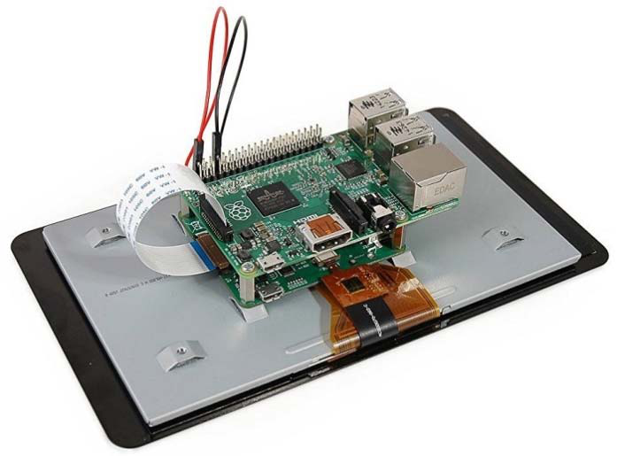

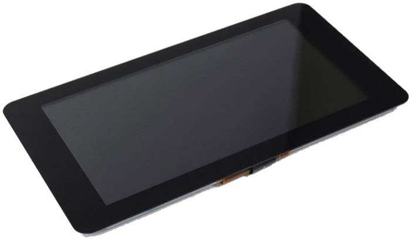

7-inch LCD Panel – Top View
7-inch LCD Panel – Bottom View

## Key Features


7” touchscreen display

Screen dimensions 194mm x 110mm x 20mm (including standoffs)

Viewable screen size 155mm x 86mm

Screen resolution 800 x 480 pixels

10-point capacitive touch

70 degree viewing angle

Metal-backed display with mounting holes

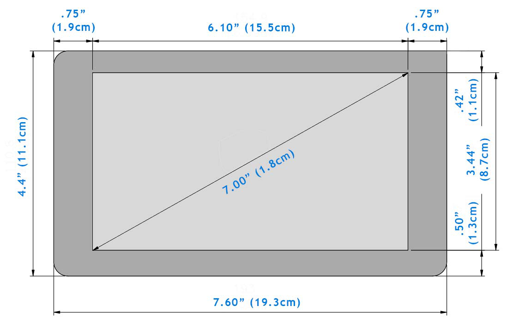

7-inch LCD Panel – Top View

## DAQ Interface Board

The DAQ interface board provides a conduit for communications and power between the StarGate 5
controller and the LCD unit. The interface board is mounted directly on the LCD touchscreen board via
a 40-pin connector. Connection from the StarGate 5 is facilitated using a CAT5/5e cable.

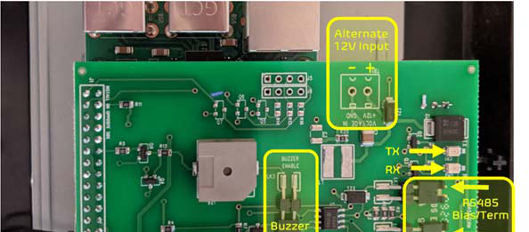

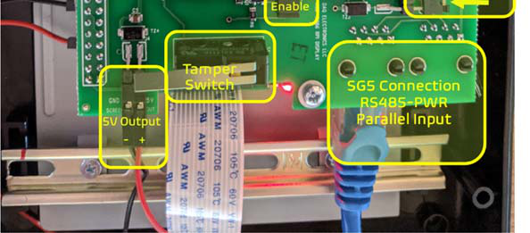

**Reference**
**Function**
**Default State / Note**
LK1 & LK2
RS485 Bias and Termination
Installed = Enabled
LK3
Buzzer Enable
Installed = Enabled
J1
Raspberry Pi Interface
J2 & J3
RS485 / Power input (from SG5)
J2 & J3 in parallel
J4
+5VDC Out (Jumper to display)
Pin1=GND, Pin2=+5V
J5 & J6
LED header
*Not populated*
TB1
Alternate 12V input
*Not populated P1=12V, P2=GND*
J2 & J3 PINS
**PIN**
**Function**
1
+12V
2
GND
3
GND
4
RS485-
5
GND
6
RS485+
7
+12V
8
+12V

## Housing/Mounting Case

The black mounting case provides a protective housing for both the LCD touchscreen unit and the
interface board.
The case consists of two identical parts that snap together, with one used as a front cover to hold the
touchscreen in place and the other used as a back-plate to secure to a wall or other surface.

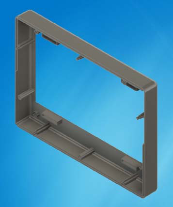

Front Cover – Top View
Back-Plate – Angled View

8 1 8
ൗ” (206mm)

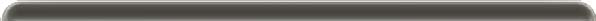

7” (178mm)

ൗ” (103mm)
6” (152mm)

4 1 16

Front Cover – Top View
7” (178mm)

5” (127mm)

Back-Plate – Top View
Note: back-plate mounting holes shown in blue.
Note: the depth of each case part is 15 16
ൗ” (24mm) – once snapped together, the total depth of the
ൗ” (48mm).
housing case is 1 14 16

Note: DAQ takes care to ensure that equipment installation is as straightforward as possible. To that
end, several of the following steps may have been completed at our facility before shipment.

## 6.10.2 SECURING THE INTERFACE BOARD TO THE LCD UNIT

The first step in assembling the LCD display is to attach the DAQ interface board to the LCD
touchscreen unit, if not already in place.
a. Position the interface board above the top board on the back of the touchscreen unit so that the
40-pin connectors line up and press into place, as shown.

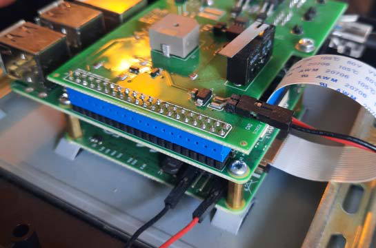

b. Using the supplied standoff and screw, attach the interface board to the LCD board.
c. To provide power between the boards, connect the red and black wires from the bottom board
on the LCD unit to the power connection on the interface board, as shown.

d. Once the two boards have been connected, it is recommended that the installer perform several
tests to ensure that the fully powered LCD unit is communicating properly with the DAQ interface
board. Start by temporarily connecting the CAT5/5e cable running from the StarGate 5 to either
the J2 or J3 port on the interface board.

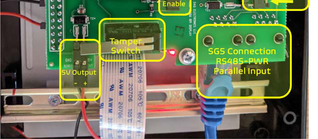


Check for shorts across TB1 and J4.

Check Voltages TB1 = 12V, J4 = 5V.

Verify display is powered on and communication present:
Check LED activity CR1, CR2.
o
Place one point into alarm state, confirm on display.
o
Return point to normal state, confirm on display.
o


Verify buzzer will turn on and off:
Make sure LK3 is installed.
o
Arm the system.
o
Listen for pulsing beep during exit delay.
o

## 6.10.3 ATTACHING THE LCD UNIT TO THE HOUSING CASE COVER

Once the DAQ interface board has been installed, attach the LCD unit to the housing case cover using
the two supplied metal brackets.

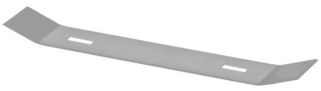

(x2)
a. Slowly place the LCD unit into the top of the case cover so that it rests in the form-fitting cut
out on the outside surface of the cover.

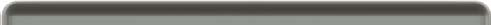

Wide
Narrow

Edge
Edge

Front Cover – Top View
It is important to begin with the cover in the correct orientation before lowering the LCD unit
into place. As shown above, the cover should be positioned with the narrow edge to the left.

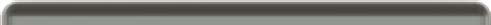

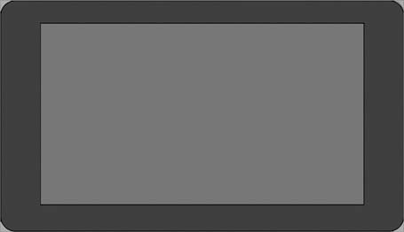

Ribbon Cable

Front Cover – Top View
Be sure that the orange ribbon cable that extends from the bottom board in the back of the
LCD unit to the LCD screen itself is facing toward the bottom of the case cover.

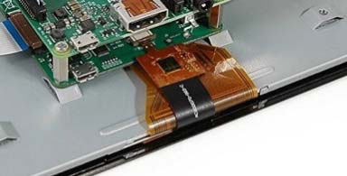

e. Holding the LCD unit in position, turn the case cover over to access the four mounting holes on
the back of the LCD unit.

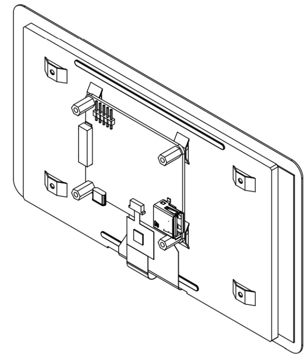

Mounting Hole

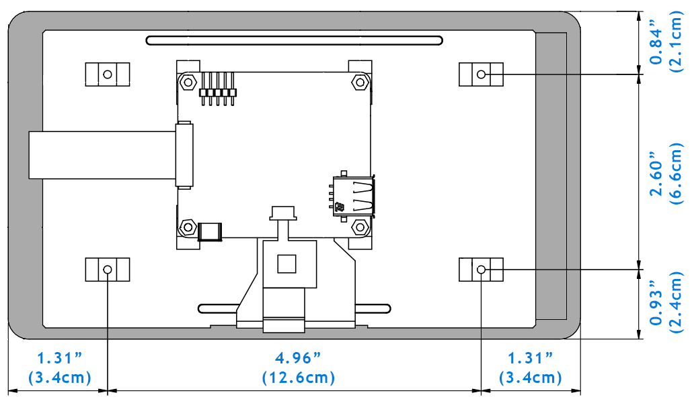

7-inch LCD Panel – Back View
Note: mounting holes shown in blue.

f.
Still holding the LCD unit in position, place one of the metal brackets vertically across two of the
mounting holes with the angled ends of the bracket facing down. Using two of the supplied
screws, attach the bracket to the LCD unit. Repeat this step for the remaining metal bracket.
Before moving to the next step, ensure that the LCD unit is held firmly in place in the case cover
by the brackets.

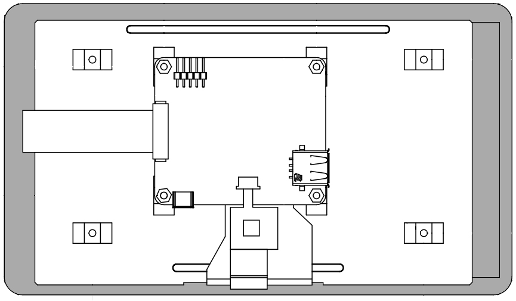

## 6.10.4 MOUNTING THE HOUSING CASE BACKPLATE

Determine a suitable installation location for the LCD display housing case backplate that is secure and
provides an environment with temperature ranging from no less than -20 degrees C and no greater than
+70 degrees C with a relative humidity no greater than 93% non-condensing @ +40 degrees C.
a. It is important to begin with the back-plate in the correct orientation before mounting the case
into place. As shown below, the back-plate should be positioned with the narrow edge to the
left.

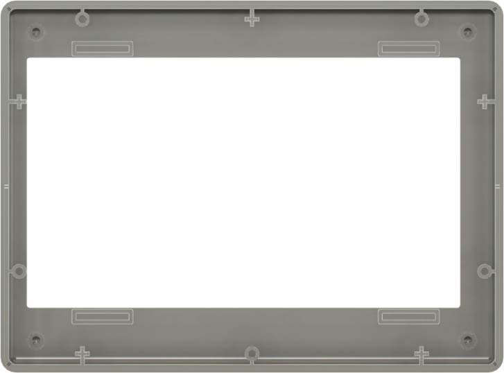

Wide
Narrow
Edge
Edge

b. Install the housing backplate onto a suitable surface using the mounting holes located along the
edges of the backplate. There are 4 mounting holes in total. Note: mounting hardware to be
supplied by the installer.
Note: you will also need to either drill a hole through the mounting surface or provide sufficient
space behind the backplate to accommodate the CAT 5/5e cable.
7” (178mm)

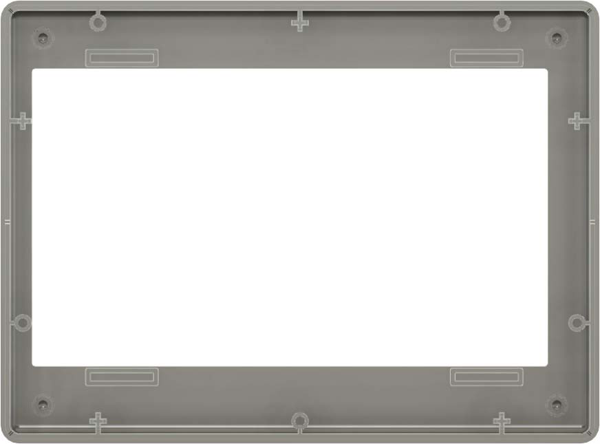

5” (127mm)

Back-Plate – Top View
Note: mounting holes shown in blue.
c. Before moving on to the next step, be sure to pull the CAT5/5e cable running from the StarGate
5 unit through the drilled hole in the mounting surface.

## 6.10.5 CONNECTING THE HOUSING CASE COVER TO THE BACKPLATE

The final installation step is to secure the two parts of the housing case together.
e. Begin by holding the case cover with the LCD touchscreen and interface board affixed in place
up to the installed backplate. Connect the CAT5/5e cable that has been pulled through the
backplate to either the J2 or J3 port on the interface board.

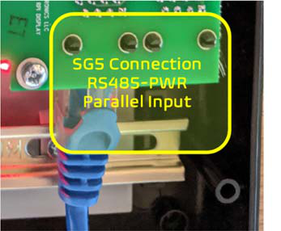

f. Next, position the cover onto the backplate. Line up the connection slots on the case cover with
the connection slots on the backplate and snap the housing case together.

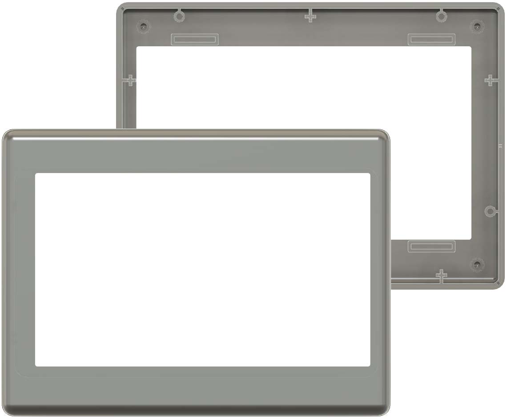

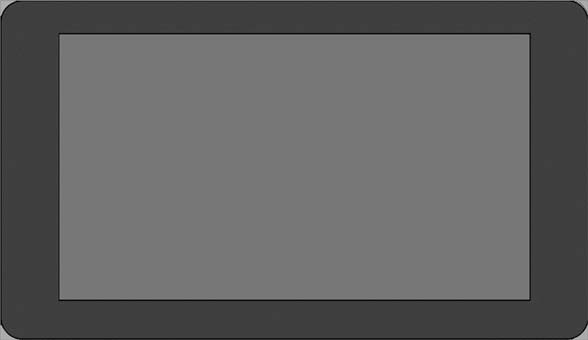

## 7.0 WARRANTY

DAQ Electronics warrants the product is free from defects in material and workmanship under normal
use and service with proper maintenance for one year from the date of factory shipment. DAQ Electronics
assumes no responsibility for products damaged by improper handling or installation. This warranty is
limited to the repair or replacement of the defective unit.
There are no expressed warranties other than set forth herein. DAQ Electronics does not make, nor
intend, nor does the company authorize any agent or representative to make any other warranties, or
implied warranties, and expressly excludes and disclaims all implied warranties of merchantability or
fitness for a particular purpose.
Returns must be accompanied by a Return Material Authorization (RMA) number obtained from customer
service, and prepaid postage and insurance.

## 8.0 LIABILITY

This product is not intended for, nor is rated for operation in life-critical control applications. DAQ
Electronics is not liable under any circumstances for loss or damage caused by or partially caused by the
misapplication or malfunction of the product. DAQ Electronics’ liability does not extend beyond the
purchase price of the product.

## A.0 APPENDIX

## A.1 OPTION TO PROVIDE POWER TO TOUCHSCREEN FROM AN AUXILIARY SUPPLY

For touchscreen keypads exceeding the maximum recommended distance from the StarGate 5 panel,
power can be provided from an external source.

The power supply must provide between 8 and 28 VDC.

The power consumption of the touchscreen is 7 watts.

Connect the communications (CAT5) cable from Port 3 of the Stargate 5 to either RJ45 socket
on the DAQ interface board, J2 or J3 as normal.

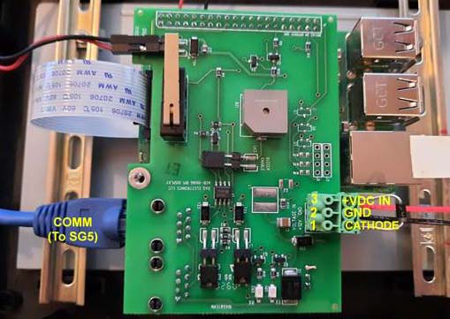


Connect the auxiliary power supply to the two-position terminal block, TB1. In order to prevent
back-feeding power from the StarGate 5 into the power supply, a 3-position terminal block
with a diode is provided.

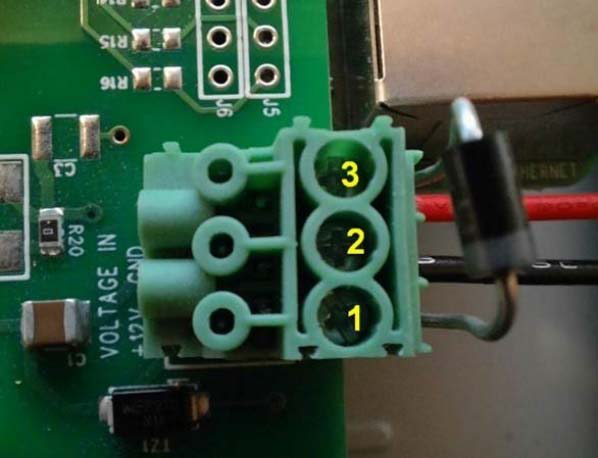


Connect positive voltage into position 3 on the terminal block.

Bridge position 3 to position 1 using the supplied diode. Connect the cathode of the diode to
position 1, the positive input of TB1.

Connect ground to the middle position 2.

If the voltage of the auxiliary power supply is greater than the voltage of the StarGate 5 (14V),
a diode is not required, and the positive lead of the power supply can be directly connected to
Pin 1 of the connector.

---

*© DAQ Electronics, LLC*
