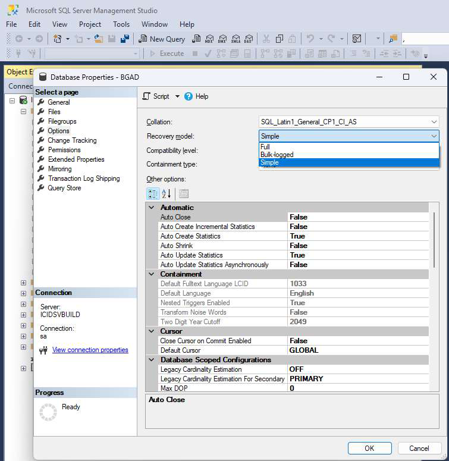
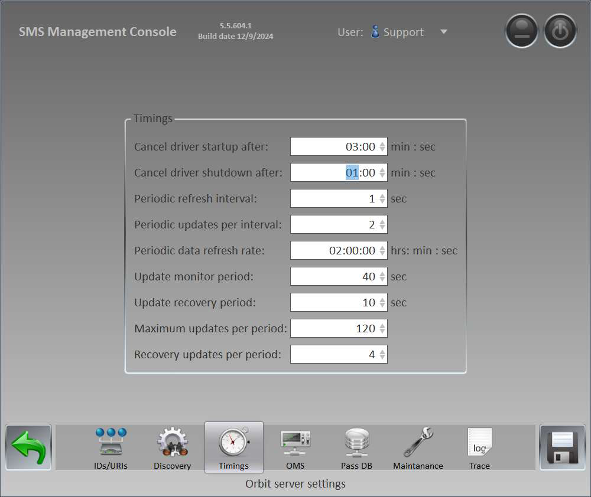
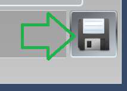
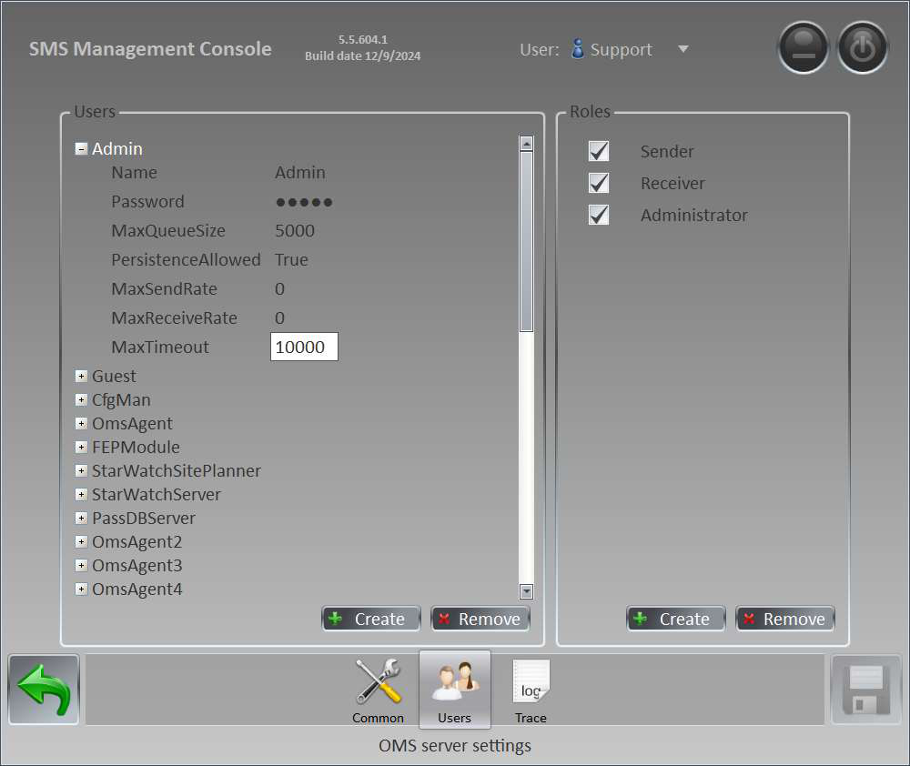
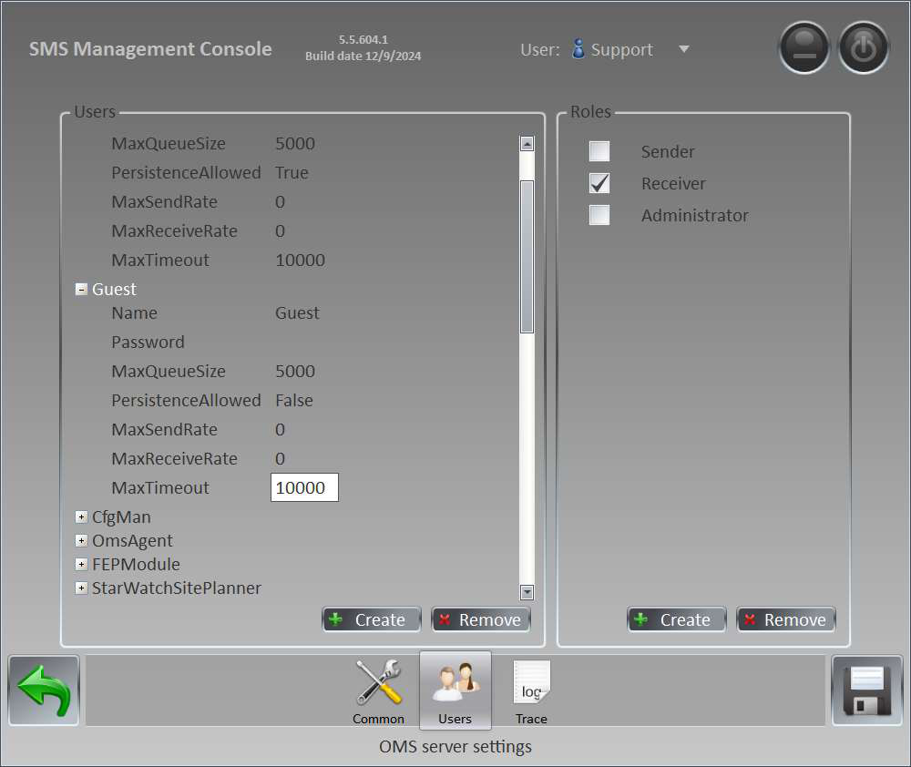

# StarWatch ICIDS 5 SMS Best Practices

Best Practices

## StarWatch ICIDS 5 SMS 5.5.604

## Guide to Best Practices

All rights reserved. No part of this document may be reproduced or transmitted in any form or by any means without prior
written permission from DAQ Electronics.

## Introduction

This document provides instructions on system configuration to maximize the performance of StarWatch SMS
5.5.604.  This release provides many performance related improvements, however various configuration changes
should be done to get the best performance.

## Guide

## Database Mode

Change the database mode from “Full” to “Simple”.  This will reduce the overhead of maintaining the transaction
log.  This log is problematic for many users also.
Open SQL Server Management Studio and login to the system.
From the databases explorer, right click on the site database and select properties.
The following dialog will appear.

Select the options page and change the recovery mode from Full to Simple.
Then click OK.

## Orbit.NET Service Timings

Make sure that you select “Support” and then go to the timings page and change according to the above settings.
Make sure you click on “Save”.

## OMS Connection Timeouts

Again use the “Support” level, open the service settings for OMS and select the Users page.

For each user in the left tree change the MaxTimeout from 4000 to 10000.
And for each user as shown going to the next one.

Continue until all user connections are modified to 10000.
Make sure you click “Save”!

---

*© DAQ Electronics, LLC*
