# Performing a Software Update

## 1.0 DOWNLOADING THE UPDATE FILE

Note: this instruction supplement describes how to perform an update/upgrade to *StarWatch SMS*
software that has already been installed on a computer and is operational. For instructions on how to
perform an initial installation of *StarWatch SMS* on a new computer, please refer to the *Software*
*Installation* user instructions document, which covers the installation and setup of prerequisite
redistributable files, database structure, and third-party components.
In order to perform a *StarWatch SMS* software update, you will first need to download the appropriate
Windows Installer Package (.msi) file:

*StarWatch-2018-May-31-Final-V6.1.636.msi* (or latest version date/number)
This file installs *StarWatch SMS* software on your computer.
Typically, an e-mail will be sent to you providing a link to the latest version of this file. The file must
be placed in the folder on your computer called:
C:\Starwatch\
Note: if you have not been given access rights to download the latest file or do not have the
appropriate download link, please see your System Administrator or contact DAQ directly.

## 2.0 PREPARING YOUR SYSTEM

## 2.1 STOPPING ALL SERVICES

Before beginning a software update, all *Services* must be stopped using the *Management Console*
application.

## 2.1.1 ACESSING THE MANAGEMENT CONSOLE

You can open the *Management Console* in one of two ways:
Option 1: Double-click on the *Management Console* icon on the computer’s desktop if you created a
shortcut during installation.

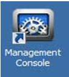

Option 2: If you did not create a shortcut during installation, click the *Start* menu, then select *All*
*Programs*, and click *DAQ Electronics*. This will list all the DAQ Electronics installed
applications. Select *Management Console*.

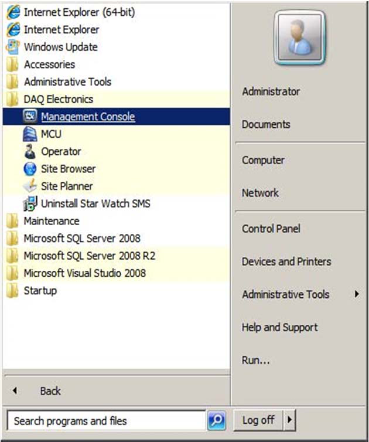

Either option will launch the main *Management Console* window.

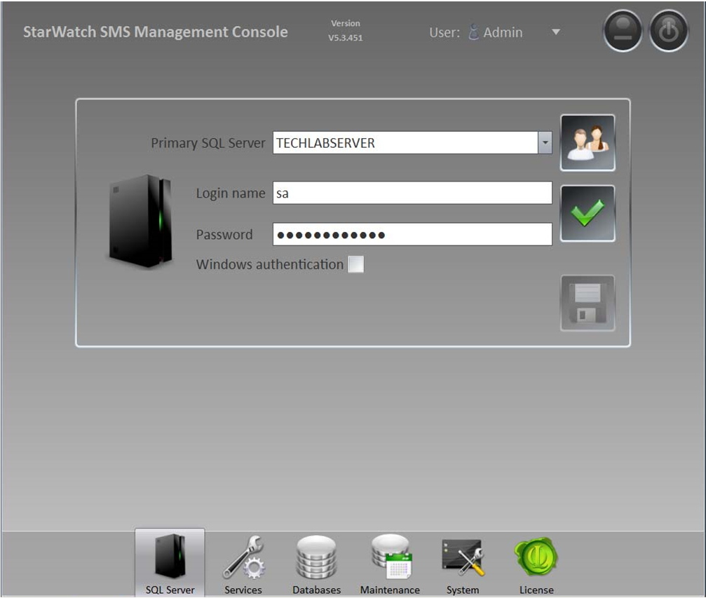

## 2.1.2 STOPPING SERVICES

To stop all *Services* at the same time, perform the following steps:

### Step 1:

In the *Management Console*, click the *Services* tab
at the bottom of the window. This
tab displays the status of services that are necessary for normal operation of the *StarWatch*
*SMS* system.

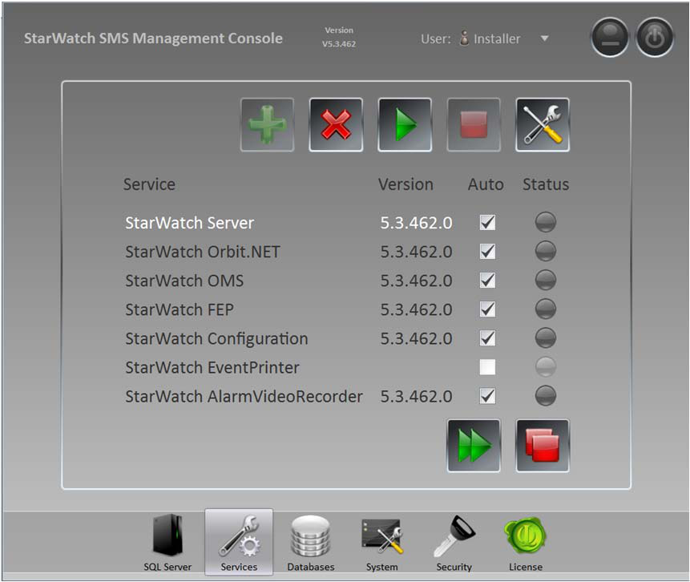

### Step 2:

In the *Services* window, click the *Stop All* button.

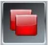

All the services will be stopped and the *Status* indicators will briefly turn yellow and then
gray when each service is stopped completely.

## 2.2 SHUTTING DOWN ALL APPLICATIONS

Once all *Services* have been stopped, you must shut down any *StarWatch SMS* applications currently
running. This includes:

*Management Console*

*System Operator*

*Site Builder*

*Administration Panel*
Once all applications are closed, you may proceed with the update.

## 3.0 PERFORMING THE INSTALLATION

## 3.1 LAUNCHING THE .MSI FILE

To begin the installation process, launch the .msi file you downloaded previously (please see section
1.0 DOWNLOADING THE UPDATE FILE). The file should be located in the C:\Starwatch\ folder.

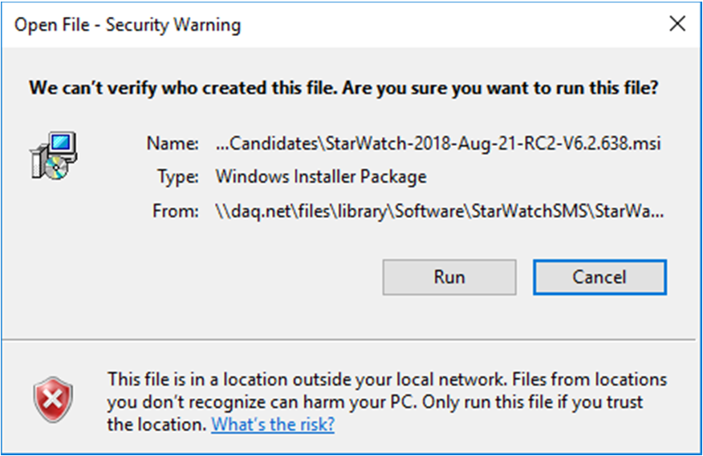

## 3.2 INSTALLING STARWATCH SMS

To complete installation, perform the following steps:

### Step 1:

From the *Open File - Security Warning* window, click the *Run* button to start the installation
process.

The *Windows Installer* window will appear temporarily.

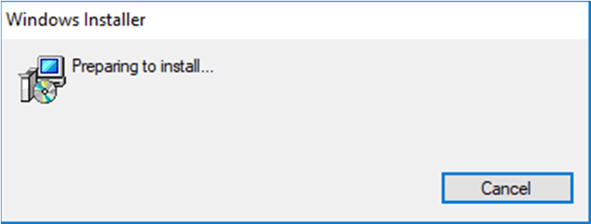

### Step 2:

In the *User Account Control* pop-up, click the *Yes* button.

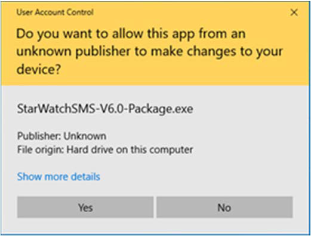

### Step 3:

In the *Setup – StarWatch Install Package* window, click the *Install* button.

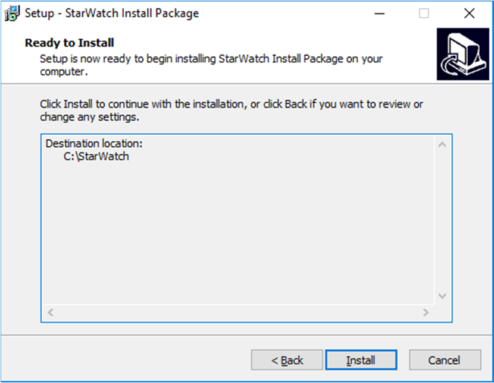

The installation process will begin scrolling through several installation status windows.

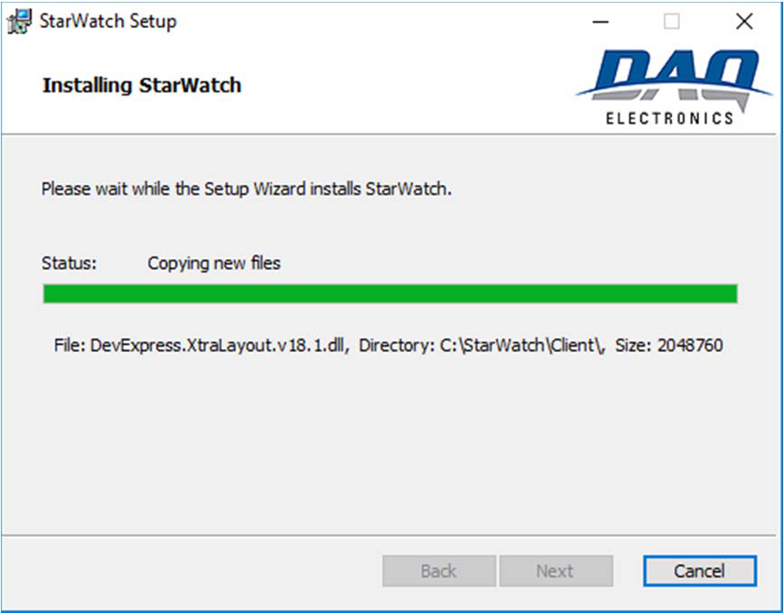

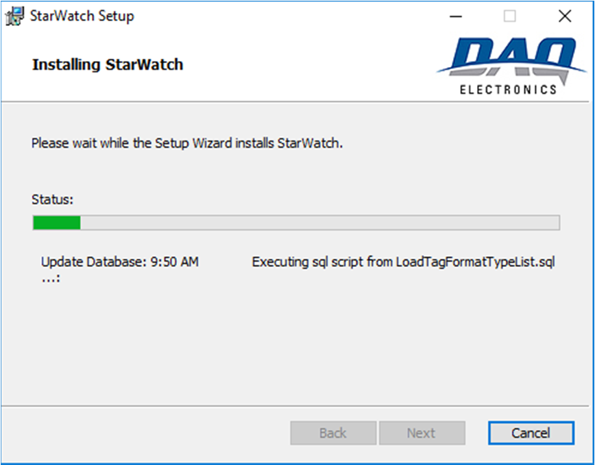

### Step 4:

Once the installation process has completed, click the *Finish* button at the bottom of the
*Workstation Install* window.

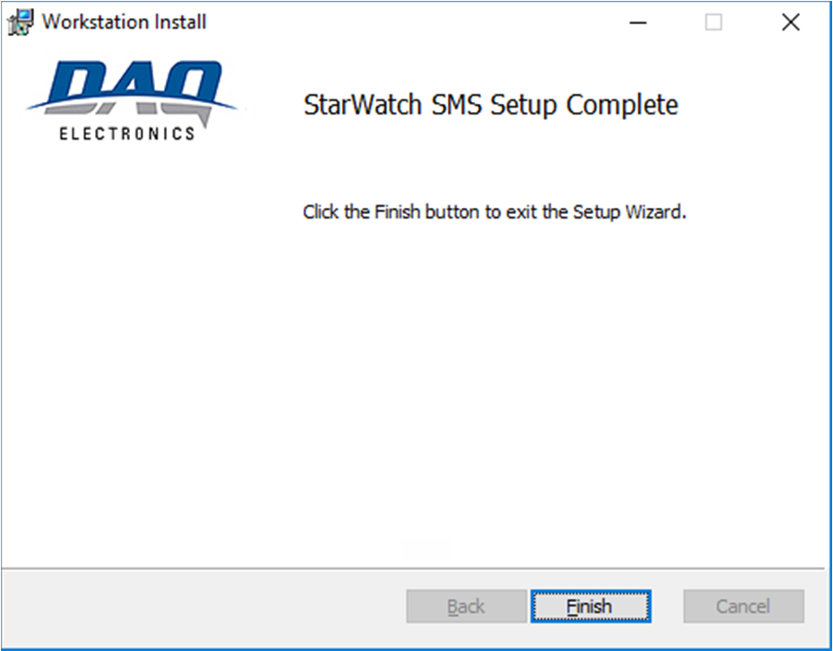

The software update is complete.

---

*© DAQ Electronics, LLC*
