# How to Use and Setup PIC Access for EntroStar

## 1.0 INTRODUCTION

This document explains how PIC access, often referred to as PIN only access, works in *StarWatch SMS*.

## 1.1 HARDWARE

You will need one EntroStar panel and one card reader / keypad. Any keypad can be used that outputs
Wiegand key presses.

## 1.2 FEATURES


StarWatch SMS allows each person to be assigned a unique code number between 4 and 10
digits called a PIC (Personal Identification Code).

A person can use the PIC on any keypad to gain entry at the location where the keypad is
installed (at the door).

Each door in the system can be enabled or disabled individually to allow PIC access or not.
When PIC access is disabled, only card access can be used.

Card access is always enabled for a given door unless the door is “locked down”, no access is
possible.

When card access is enabled, a PIN can also be enabled in tandem with PIC access. A PIN is not
the same as a PIC, so the card holder PIN can only be used with the card.

If required, it is possible to simply create a PIC in the system that could be used as a shared
PIN, much like other low security systems where the code is given to everyone and changed
from time to time. When the PIC is shared, the access event will not identify the actual person.

## 2.0 CONFIGURATION

## 2.1 NUMBER OF DIGITS

The number of digits for PICs is configured in the server configuration in the *Management Console* of
the system.

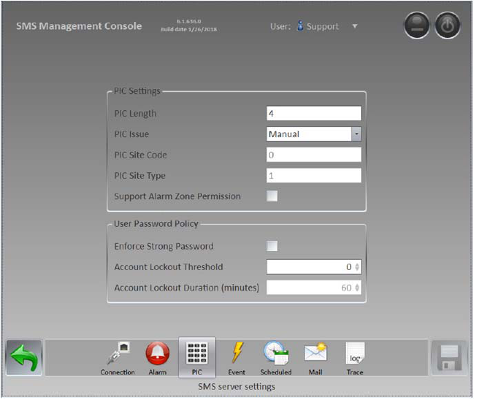

This length is enforced for all new PIC numbers but will not invalidate existing PIC numbers that were
created as a different length. For example, if the end-user attempts to assign a different length PIC to
a person the following error will be shown.

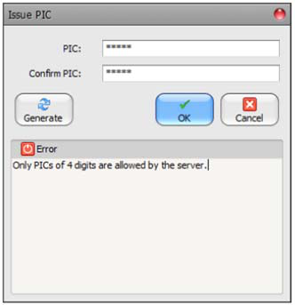

## 2.2 ENTROSTAR KEYPAD

The EntroStar supports two doors with entry and exit readers. Each reader where PIC is required must
have a keypad and be configured for keypad use.

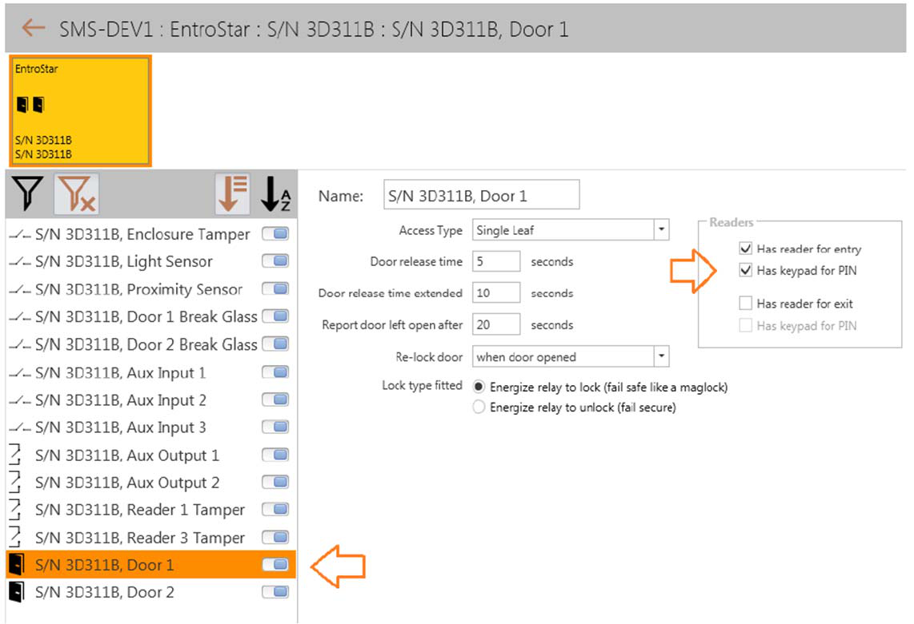

## 2.3 ENABLE PIC ACCESS

By default, PIC access is not enabled for new doors on the system and cannot be enabled if the door
has no keypads.

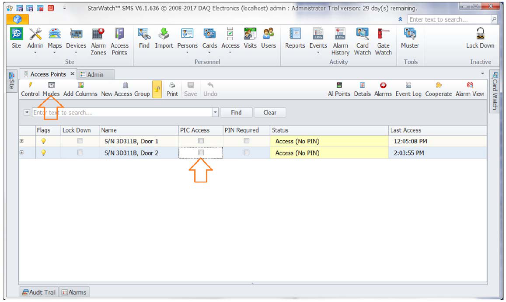

Click on the *Modes* dialog and you can change the PIC access option for a door as shown.

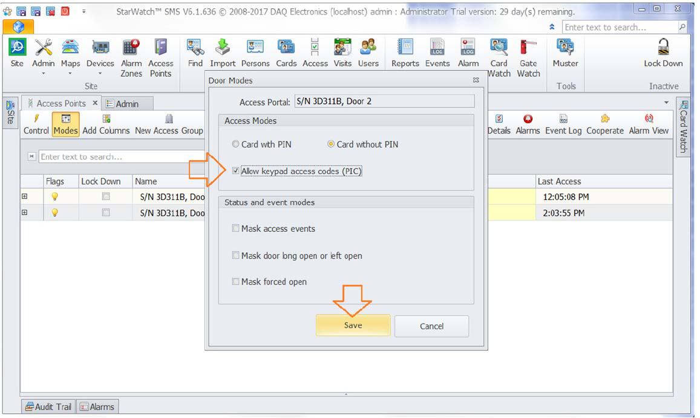

The relevant door will show the PIC access enabled as required.

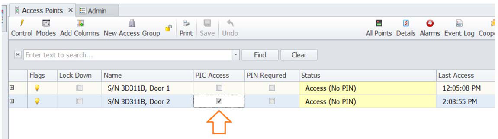

## 3.0 PERSONNEL REGISTRATION

It is possible to setup the personnel registration so the user is guided to enter the PIC code as part of
the initial registration process.
Click on *New* to start registration.
Next, right-click on the *Details* tab to *Edit Forms and Layouts*.

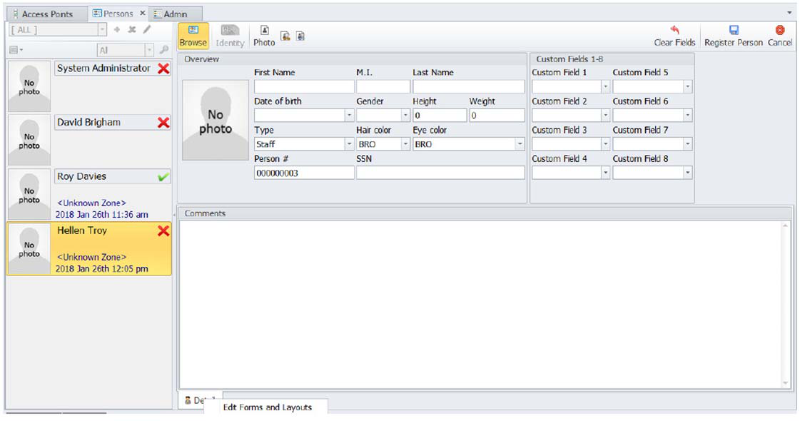

On the following page, we have changed the layout from the *Details* tab context menu to include
*Overview*, *PIN & PIC*, and *Comment*.

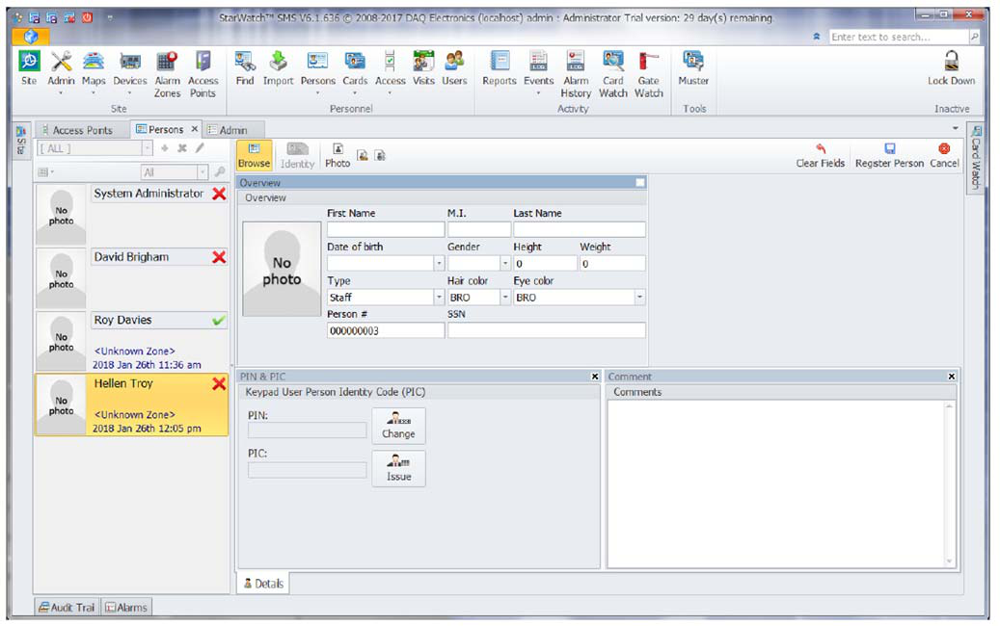

Next, save this layout by clicking on *Finish Layouts* in the *Details* tab menu. When the operator
registers a new person, the following form will be shown.

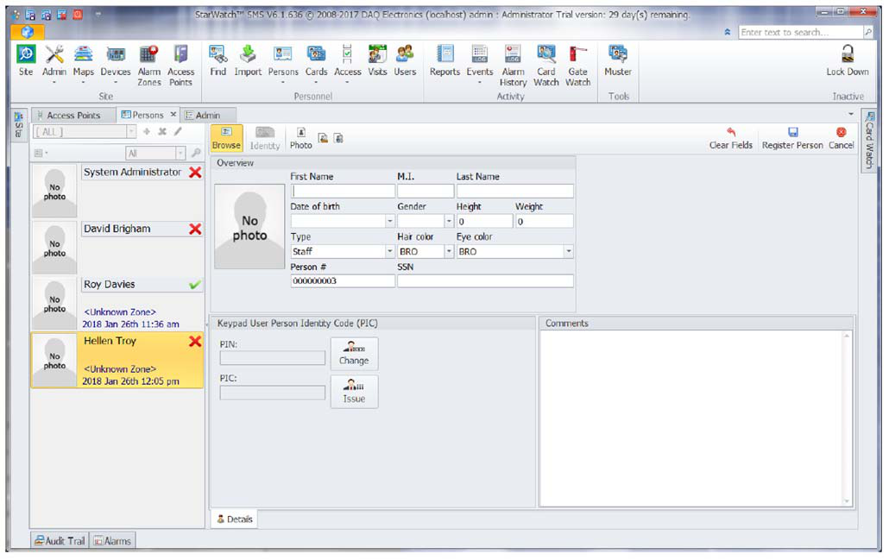

## 4.0 AUTOMATION

It is possible to schedule times and dates when PIC access is enabled or disabled, as shown in the
following automation procedure where two doors are scheduled to disable PIC access at 5pm every
weekday, Monday to Friday.

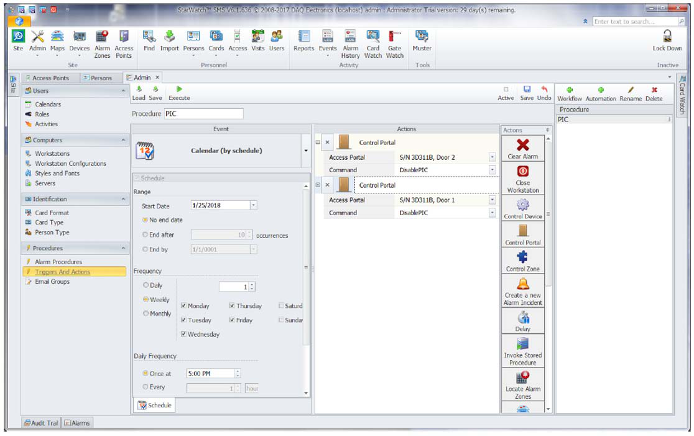

## 5.0 EVENTS AND ALARMS

## 5.1 INVALID ACCESS

If a person is restricted from a specific location, an event and alarm will be generated for that person
if they try to use their PIC code at the door.

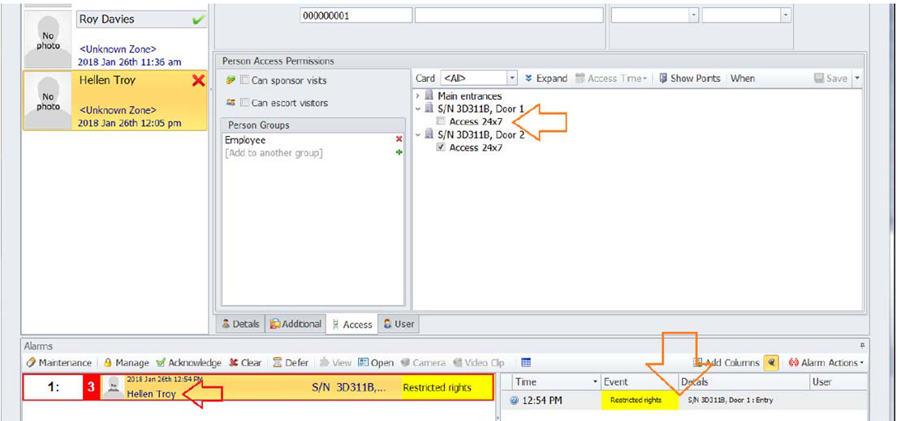

## 5.2 CARDWATCH

Cardwatch shows valid access for the person when they are given access rights to the respective door.

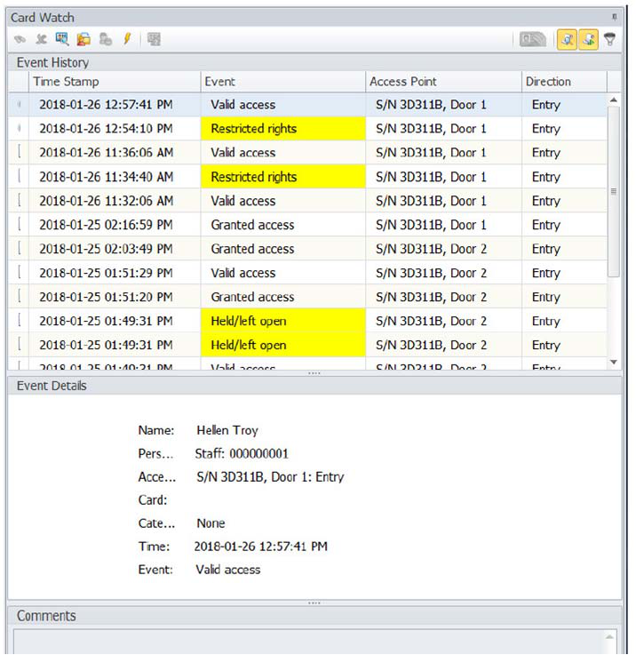

---

*© DAQ Electronics, LLC*
