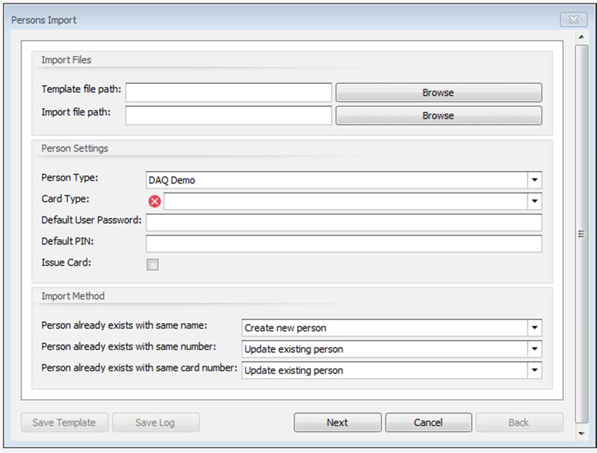
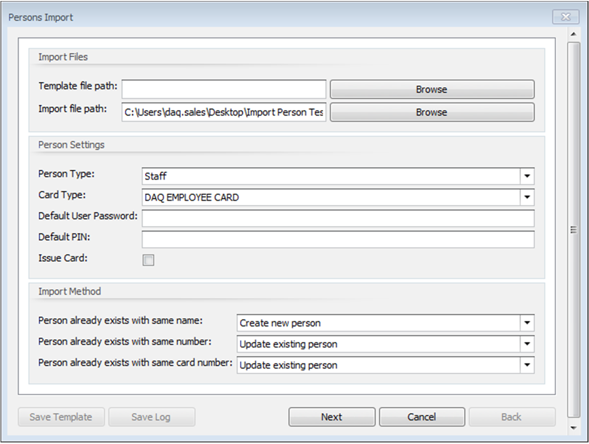
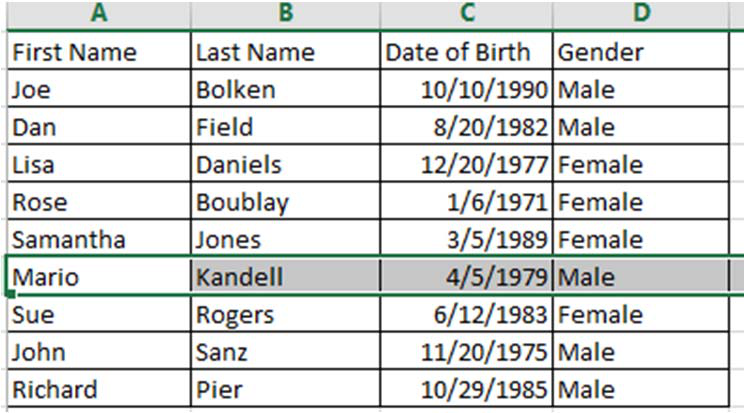
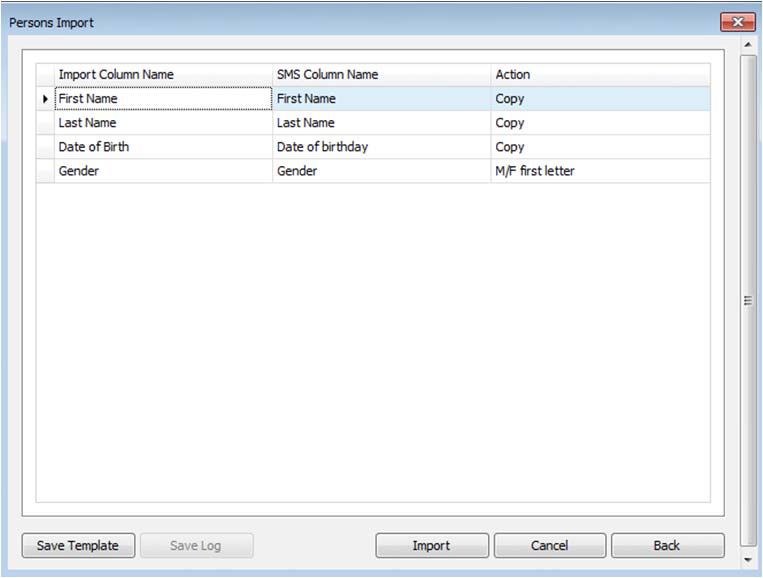
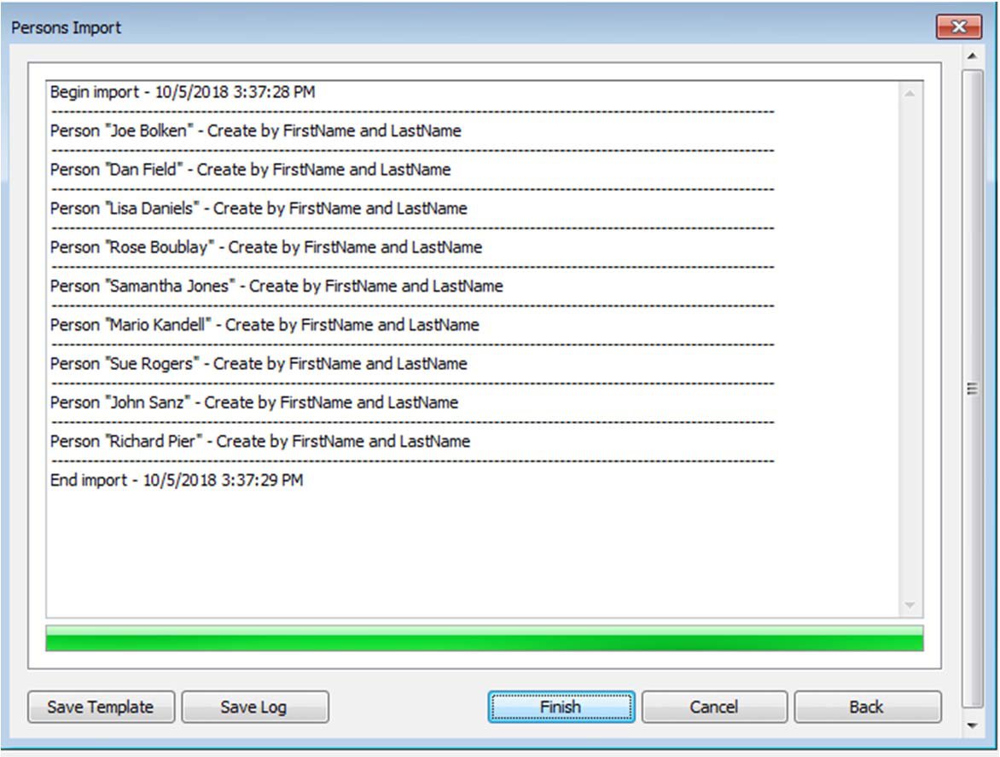
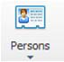
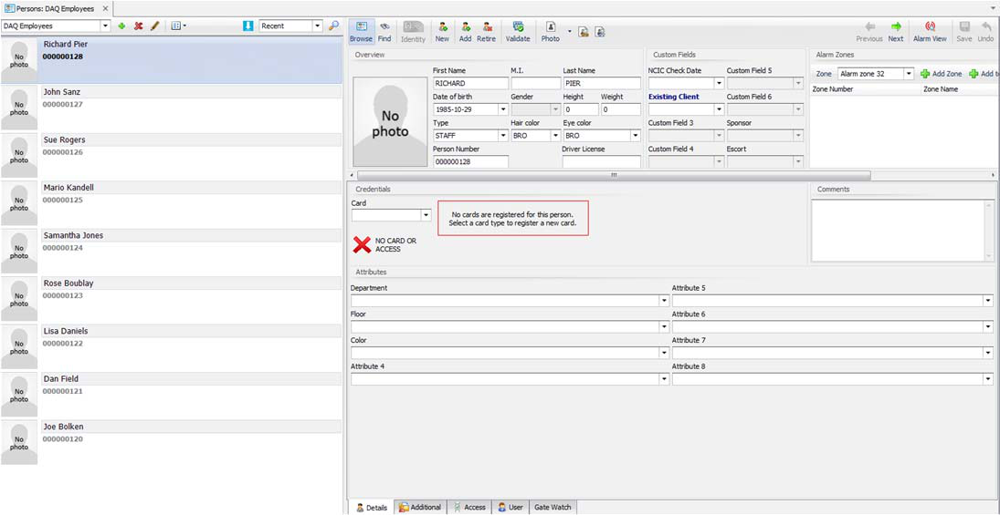
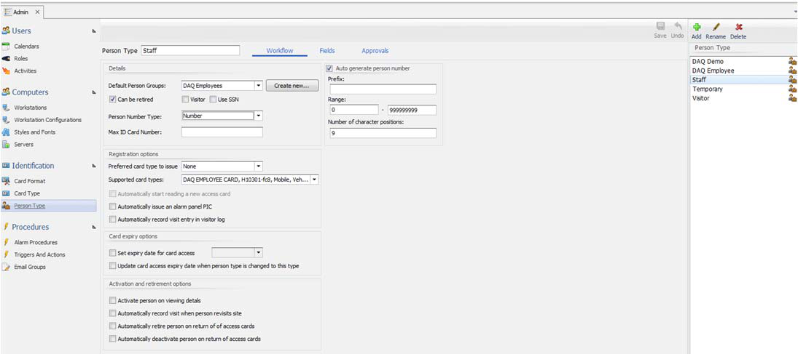

# How to Import Persons from an Existing Worksheet

## 1.0 IMPORTING PERSONS FROM AN EXISTING WORKSHEET

When importing persons, the most important aspect to understand is that the system is designed to
import one *Person Type* at a time. This means that you need a separate .CSV file/Excel sheet for each
*Person Type* you will import, and you will run the import process multiple times; once for each *Person*
*Type* you intend to import.

## 1.1 USING THE IMPORT FUNCTION

From the *Operator* toolbar, click on the *Import*
icon .

The *Persons Import* screen will appear.

## 1.2 PERSONS IMPORT SCREEN

The imported file should be saved as a .CSV file type. Under *Import file path****,*** browse to the file and
then fill in the proper settings in the *Person Settings* area. In this example, we chose the *Staff* person
type and *DAQ Employee card* for the card type. For the import method fill, select the proper settings
and hit the *Next* button.

This is the original document that is being imported to *StarWatch SMS*:

After you hit *Next* for *Persons Import*, the next window will load and show the format you have
imported. In this example, we have *First Name*, *Last Name*, *Date of birth*, and *Gender*. It also shows
that for action it will copy what is in the columns and for *Gender* it will copy the first letter to identify.

Hit the *Import* button to begin the process.

Hit *Finish* when it is done.

## 1.3 VIEWING IMPORTED PERSONS

To view the imported persons, go to the *Persons*
icon from the toolbar and select the person
group for the person type you added. In our example, it was the *Staff* person type defined for the *DAQ*
*Employees* person group.

Now you can register the new persons or give them access cards, etc.

---

*© DAQ Electronics, LLC*
