# Administration Panel

## 1.0 WORKING WITH CALENDARS

The *Access Calendar* function allows you to create weekly schedules that can then be associated with
one or multiple permissions. Calendars define periods of time that dictate rules for both access control
and workstation access. All personnel assigned to a permission level are subject to the access hours
defined in the associated calendars.
For example, if a permission level allows access to a specific building at all hours of the day and on any
day of the week, you will need to create a calendar reflecting this 24 x 7 coverage. If a second
permission level will only allow access to the building during the normal Monday through Friday, 8:00
to 6:00 workday, you will need a second calendar reflecting this timeframe. Permissions that follow
other access rules will require additional calendars. The number of calendars needed depends on the
complexity of your overall access control plan.

To launch this function, click on the
icon located on the *Users* segment of the
*Admin* list on the left side of the screen.

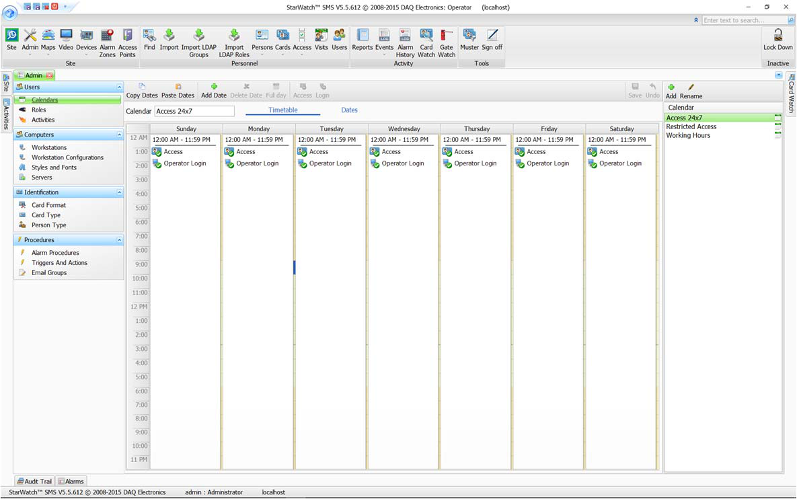

## 1.1 CREATING A NEW CALENDAR

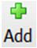

To create a new calendar, click on the
icon at the top of the *Calendar* pane to the right of the
screen. In the *New Calendar* pop-up window, type in a name for the calendar and click the *Ok* button.

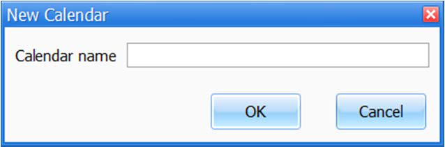

A new calendar will be added to the list in the *Calendar* pane.

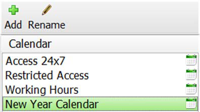

Note: As the default setting, new calendars are created with no hours assigned.

## 1.2 SELECTING AN EXISTING CALENDAR

To modify an existing calendar, click on the name of the calendar in the *Calendar* pane to the right of
the screen. The name will become highlighted.

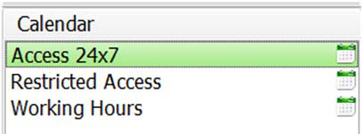

Once a specific calendar is selected, the calendar name will appear in the *Calendar* name field to the
top left of the screen and any associated settings will be displayed in the workspace.

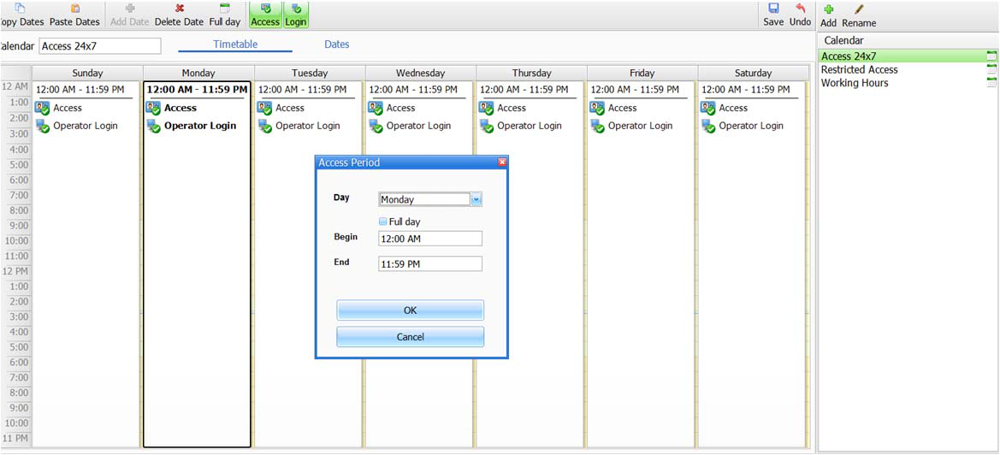

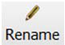

Note: to change the name of calendar, select it in the *Calendar* pane and click on the
icon at
the top of the pane. Type in a new name for the calendar (ex. Work Hours, 24x7) and click the *Ok*
button. Similarly, you can modify the name of an existing calendar by calling it to the screen, making
changes in the *Calendar* name field, and hitting the *Enter* key on your keyboard.

## 1.3 DEFINING TIMETABLE HOURS

Once the appropriate calendar has been called to the screen, you can designate access hours for each
day of the week.

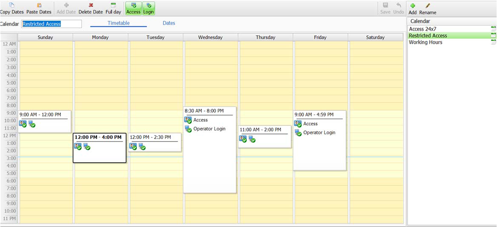

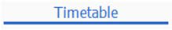

Note: make sure that the
tab is currently highlighted at the top of the work area
when creating, modifying, or deleting time blocks within your weekly calendar.

## 1.3.1 ADDING A TIME BLOCK

To add a new access time block, right click on an empty cell in the calendar to highlight it, and then
select the *New* option from the pop-up menu.

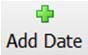

Alternately, you can click the
button at the top of the calendar work area or you can simply
double-click in an available cell.
An access cell will appear in the selected space and the *Access Period* dialog box will appear on the
calendar.

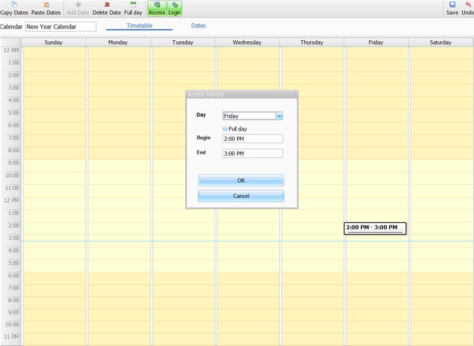

To define a new time block, fill in the fields provided and hit the *Ok* button to add it to the calendar.

You can also click on the calendar and drag to select a range of cells within a day before selecting the
*New* option. The entire selected range of time will be designated as a time block.

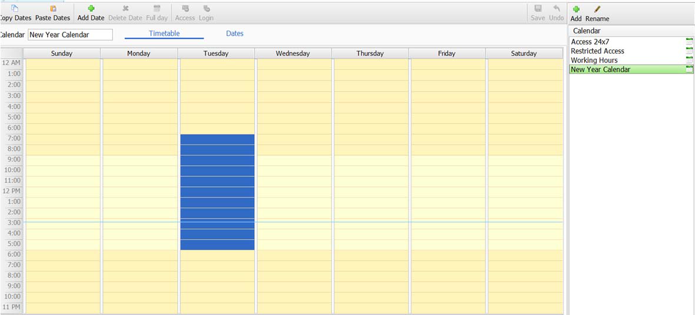

Note: you can also define access time blocks using the *Properties* function available on the mouse
right-click menu. Selecting the *Properties* option will call up the *Access Period* dialog box.

## 1.3.2 MODIFYING A TIME BLOCK

To increase or decrease the size of a time block that has been added to the calendar, simply grab the
top or bottom edge of the block and drag the edge up or down.

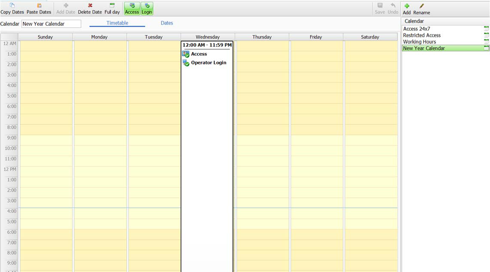

To move the entire time block to a new location in the calendar, click on the block to select it and
drag it to a new location.

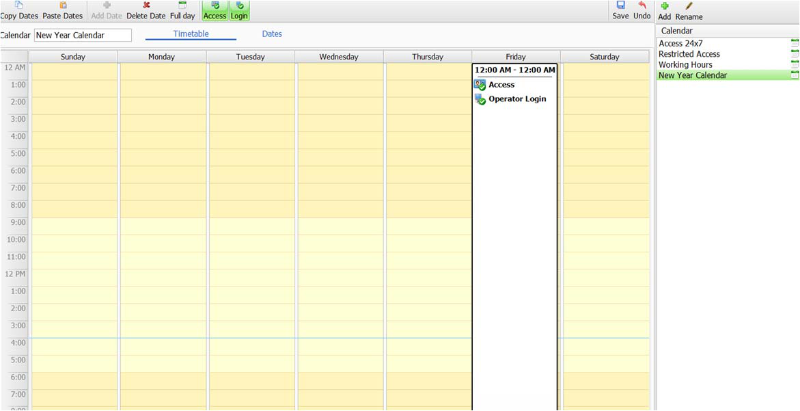

Save your changes using the
button in the upper right of the work area.

## 1.3.3 TIME BLOCK PROPERTIES

To change the properties of a time block, right-click on the block and select the *Properties* function
from the pop-up menu to call up the *Access Period* dialog box.

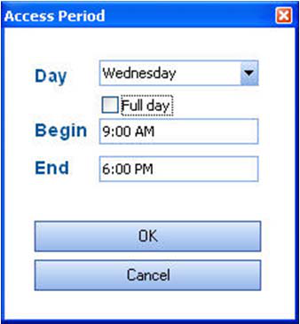

You can change the day of the week that the block is associated with and adjust the start and end
times. To spread a time block across an entire day (the full 24 hour cycle), click the *Full Day* checkbox.

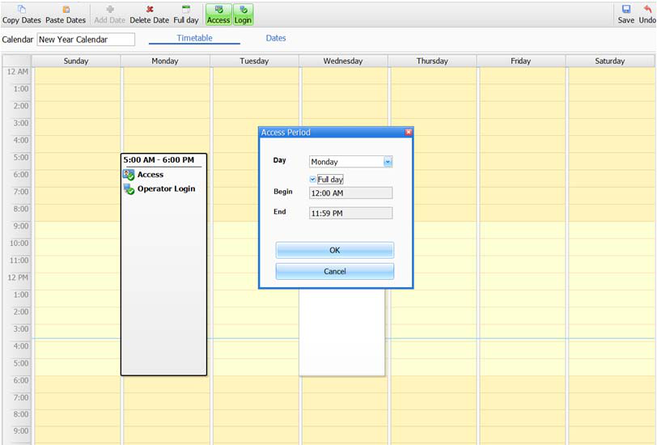

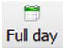

Alternately, you can select the time block on the calendar and click the
button at the top of
the calendar work area or right-click on a block and select the *Full Day* option from the pop-up menu.
The entire, 24-hour time range will now be included in the access time block.

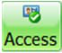

By selecting the block and hitting the
button at the top of the calendar workspace, you can
designate a timeframe as an *Access* timeframe.

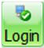

Similarly, by selecting the block and hitting the
button, you can designate a timeframe as an
*Operator* *Login* timeframe.

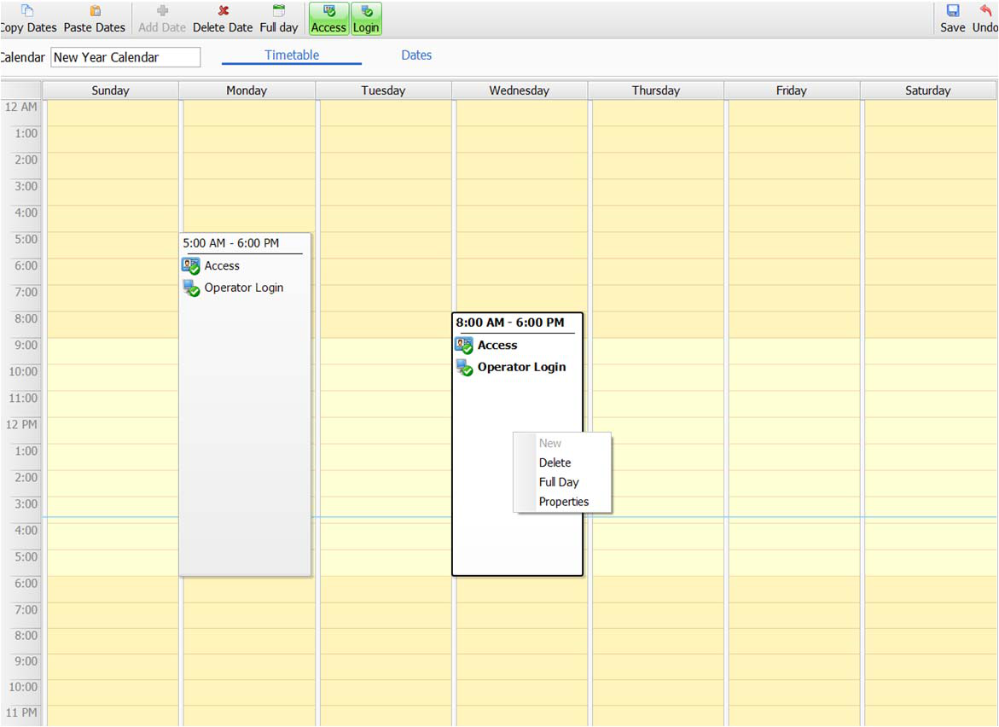

When either or both of these buttons are highlighted in green, it indicates that the associated function
is in use for the selected calendar.

## 1.3.4 DELETING A TIME BLOCK

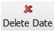

To delete a time block, click on the block to highlight it and then click the
button on the menu
at the top of the tab or hit the *Delete* key on your keyboard. Alternately, you can right-click on the
block and the select the *Delete* option from the pop-up menu.

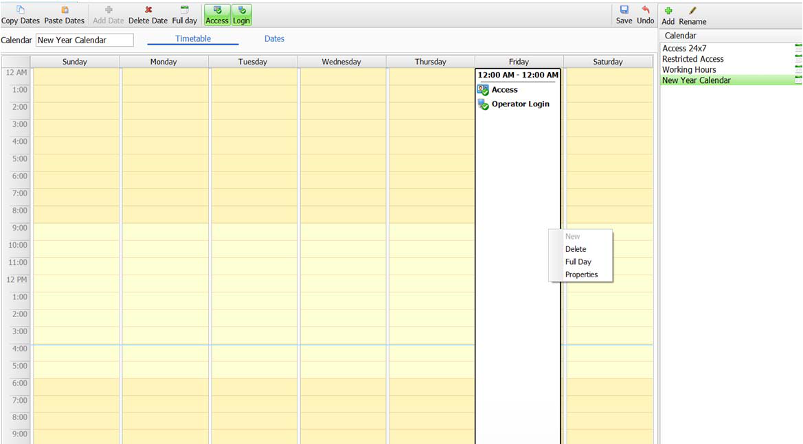

## 1.4 DATES FEATURE

Using the features available in the *Dates* tab, you can designate properties (access or no access) for
time periods that do not fall within the normal weekly calendar. For example, the *Dates* function can
be used to set exceptions for holidays and other special case working hours.
Note: each calendar contains its own associated *Dates* settings. Any access times defined using the
*Dates* function will override the times listed in the normal weekly schedule previously created in the
*Timetable* tab for the specific day selected.

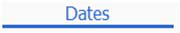

To open the *Dates* function, click on the
tab at the top of the work area.

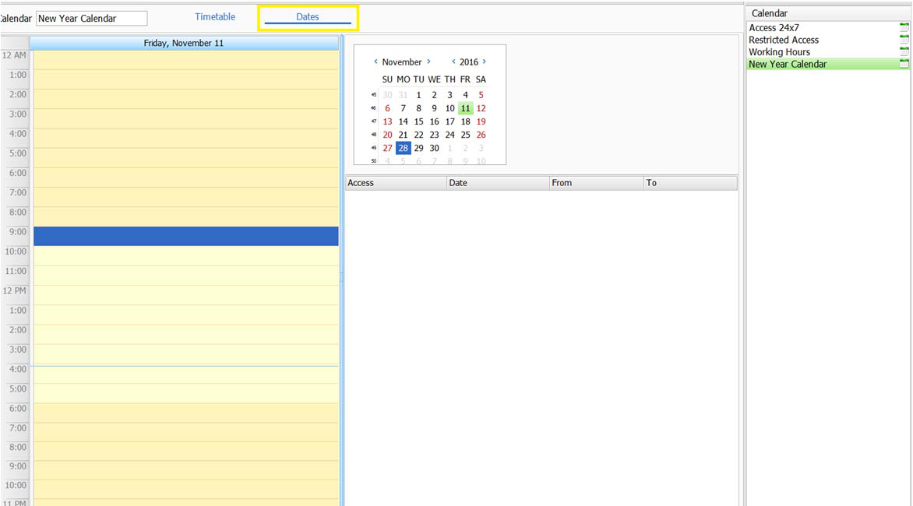

## 1.4.1 SELECTING A DATE

To select a date for the exception, utilize the small calendar in the upper right of the tab. You can
shift the month and year using the arrow buttons provided and select a specific day by clicking on it in
the calendar.

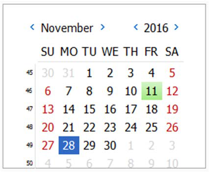

## 1.4.2 DEFINING TIME BLOCKS

Once the appropriate day has been selected, you can add and modify time blocks in the 24 hour
schedule shown to the left of the tab. The adding and modifying process works similar to the steps used
in the main calendar timetable. Time blocks can be created and properties set using the same tools.

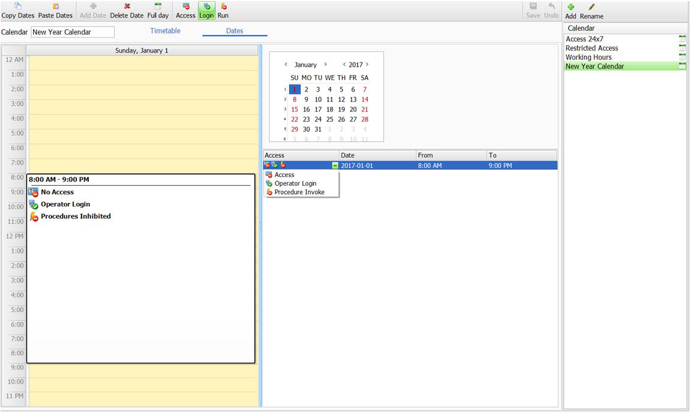

The *Dates* function allows you to define a time period as *No Access* to override an existing access
timeframe.

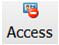

This can be accomplished by selecting a time block and clicking the
button provided at the top of
the tab.
Note: the *No Access* feature is also available as an option on the right-click menu.

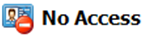

Time blocks designated as *No Access* will be displayed with a red (-) sign
.

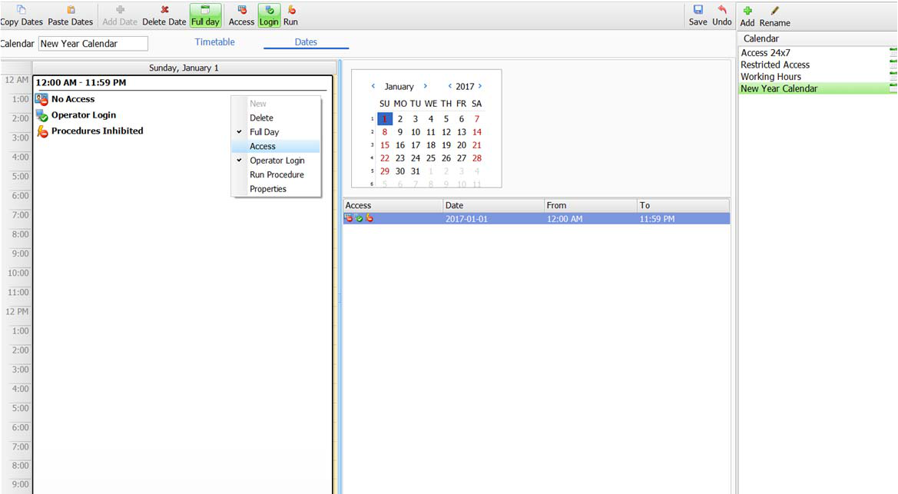

## 1.4.3 EXCEPTIONS LIST

Any exceptions added using *Dates* will be reflected in the summary field in the lower right of the tab.
This allows you to quickly review exceptions by date and timeframe.

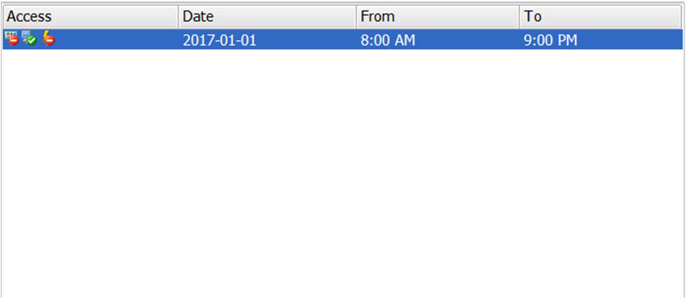

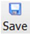

Once the restrictions or exception dates have been defined, save your changes using the
button
in the upper right of the work area. A pop-up screen will ask if you would like to save these settings to
all calendars. Clicking the *Yes* button will apply the exceptions to all calendars created in the system.
Clicking the *No* button will apply the changes only to the currently selected calendar.

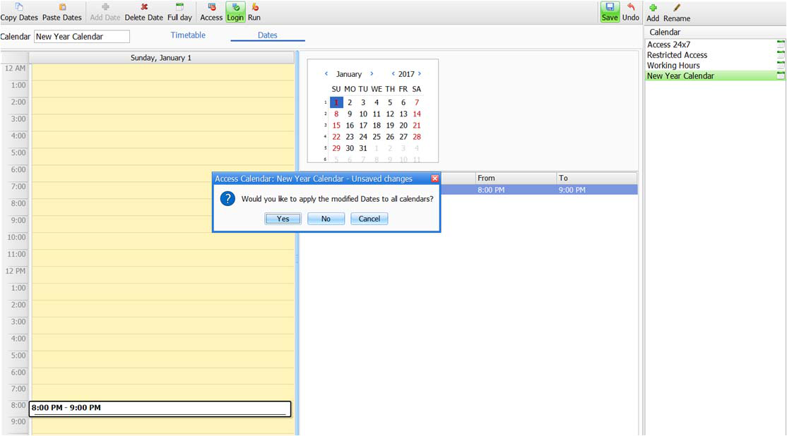

## 1.5 COPYING TIMETABLES AND DATES

If you would like to use existing timetables or dates as a starting point for a new configuration, the
system allows you to copy and paste between calendars.

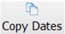

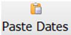

This can be accomplished using the system
and
buttons located at the top of the
work area.

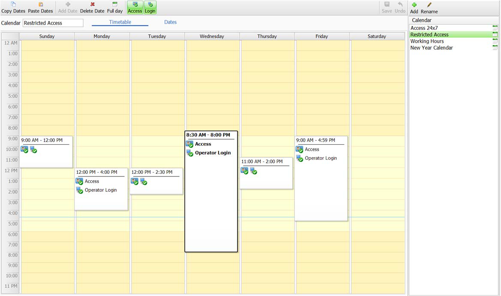

## 2.0 SETTING ACCESS PERMISSIONS

All *Access Permissions* in the system are accomplished via the creation of *Access Rules*. A rule can be
thought of as a sentence that answers the questions of *Who*, *Where*, and *When*.
Example 1 - John Smith is allowed through the front door all of the time. In this case:

The *Who* is ‐
John Smith

The *Where* is ‐
front door

The *When* is  ‐
all of the time
Example 2 - Shift 2 employees are allowed through the factory doors between 12:00pm and
8:00pm on working days. In this case:

The *Who* is ‐
shift 2 employees

The *Where* is ‐
factory doors

The *When* is ‐
between 12:00pm and 8:00pm on working days

## 2.1 WORKING WITH ACCESS GROUPS

*When* aspects of *Access* *Rules* are defined using *Calendars* (see section 1.0 WORKING WITH
CALENDARS).
*Where* aspects of *Access* *Rules* are defined using *Access Groups*. These groups are collections of doors in
the system that all have the same rules applied to them. There are generally no restrictions on how
doors are grouped together in an *Access Group*.
Example 1 - doors that lead to the same *Physical* place, such as factory doors
Example 2 - doors that lead to the same *Type* of place, such as entrances or common areas
Example 3 - doors that share the same set of *People* who have access to them, such as IT doors
The management of *Access Groups* and the doors that are contained in each is accomplished using the
*Access* application.

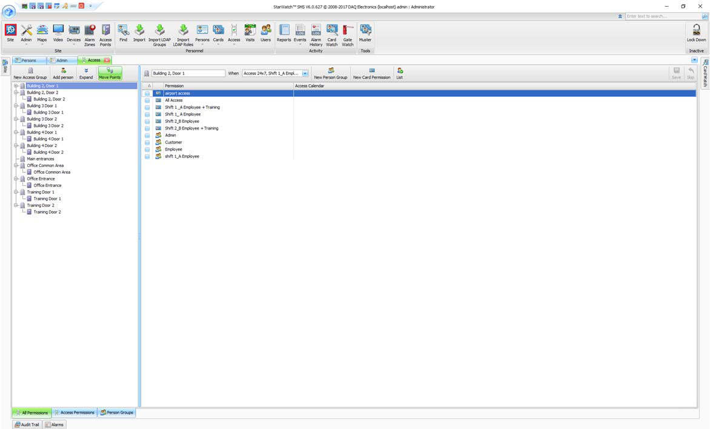

Within the *Access* application, there are three tabs that appear at the bottom of the window: *All*
*Permissions*, *Access Permissions*, and *Person Groups*.

The management of *Access Groups* can be completed on any of these tabs using almost identical
concepts and tools.
Below is a generic description of features found on the *All Permissions* tab, including a specific work
flow for managing *Access Groups*. Managing these groups from the *Access Permissions* or *Person Groups*
tab requires the same steps.
**Field**
**Icon**
**Description**
New Access Group
Allows you to create and add new *Access*

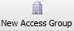

*Groups* and portals
Add Person
Allows you to add an individual to a

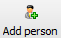

selected *Access Group* in the tree
Expand
Expands the tree for the *Access Group*

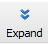

currently selected
Move Points
Allows you to drag and move doors from

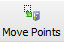

one *Access Group* to another
When
Provides a check-off list of the created

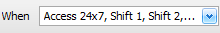

*Calendars* available when defining when a
*Person Group* can go through the doors in
an *Access Group*
New Person Group
Allows you to create and add new *Person*

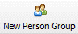

*Groups* in the system
New Card
Allows you to create and add new *Card*

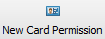

*Permissions*
Permission
List
Displays the list of individuals that exist

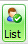

under a selected *Person Group*

The screen below shows how *Access Groups* and doors appear in the left-hand tree on the *All*
*Permissions* tab after doors have been added using the *Site Builder* application.

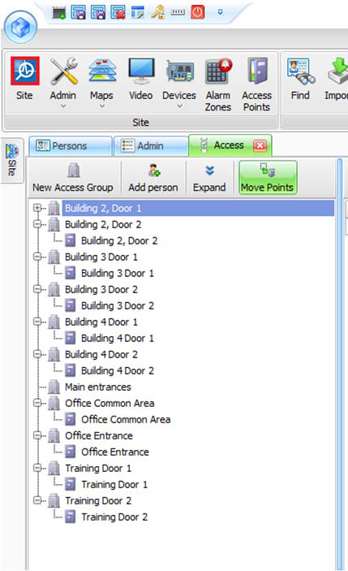

When a door is added, the system automatically creates a new *Access Group* that contains the new
door only. If a system were built in *Site Builder* with 50 doors and then immediately started, there
would be 50 *Access Groups* for the operator to utilize the first time they went to manage access
parameters.
The top level entries in the tree indicate the auto-generated *Access Groups*. The sub-level entries that
appear beneath each group represent the doors. Note: the default name for a door and its associated
*Access Group* are the same.

## 2.1.1 CREATING A NEW ACCESS GROUP

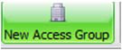

To combine a set of doors into a new *Access Group*, click the
button, which will call up the
*New Access Group* dialog box. Enter a name for the group into the *Name* field and click *OK*.

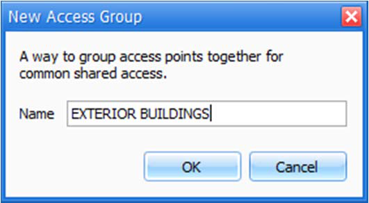

The new *Access Group* will be added to the tree.

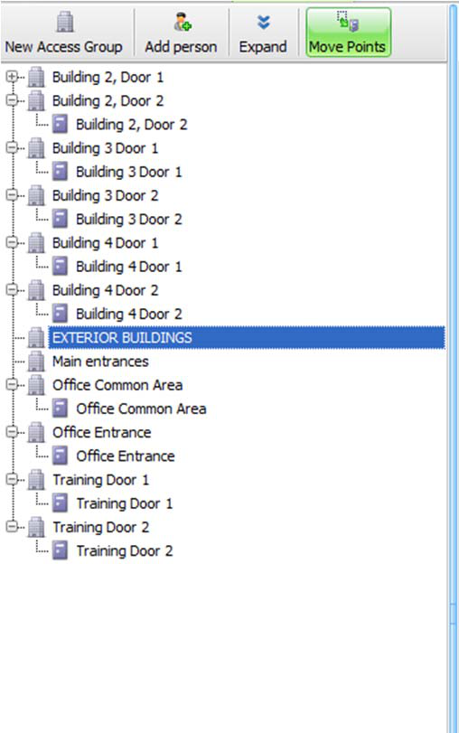

## 2.1.2 ADDING DOORS TO AN ACCESS GROUP

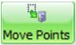

To add doors to the new *Access Group*, click the
button. Next, simply click on an appropriate
door within the tree and drag and drop it into the group.

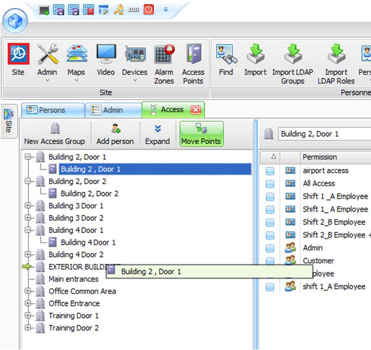

Continue adding doors in this manner until the group is complete. Note: a door can only reside in one
group at a time.

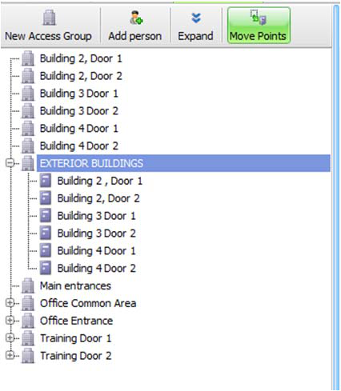

## 2.1.3 DELETING AN ACCESS GROUP

As you drag a door from one *Access Group* to a new one, you will notice that the door is removed from
the original group. This occurs because a door cannot be in more than one group at the same time.
To simplify the tree and avoid confusion, the original auto-generated *Access Groups* should be deleted
from the system once emptied. To delete a group, right-click on the *Access Group* in the tree and
select the *Delete Access Group* option from the pop-up menu.

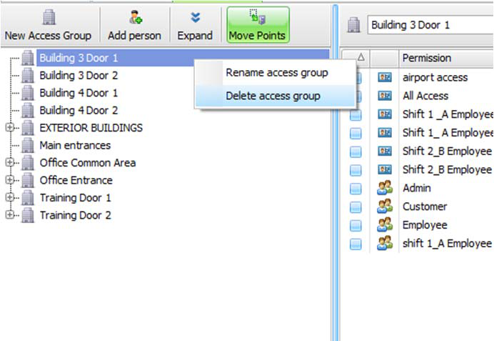

Note: before deleting an *Access Group*, be sure that it is not being used for access, has no *Calendar*
associated with it, and that no people are assigned to it in the system.

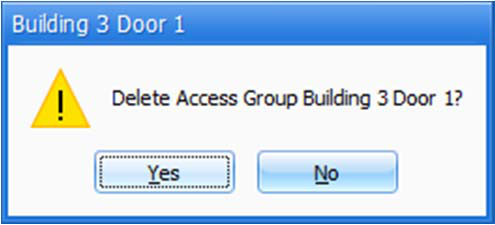

Click the *Yes* button to confirm deletion of the selected group.

## 2.1.4 RENAMING AN ACCESS GROUP

In order to better organize your groupings of doors, the system enables you to rename *Access Groups*
from originally assigned names. To rename a group, right-click on the *Access Group* in the tree and
select the *Rename Access Group* option from the pop-up menu.

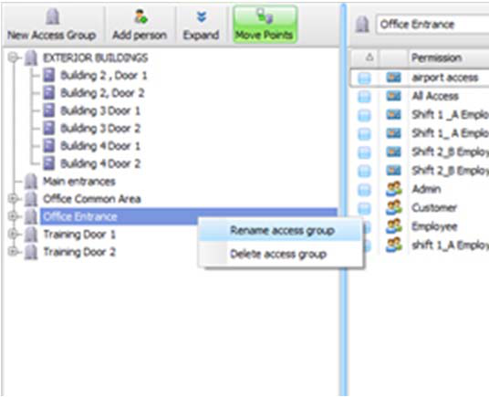

The name field will become highlighted, allowing you to enter a new name. Hit the *Enter* key to
complete the change.

## 2.2 DEFINING ACCESS PERMISSIONS

*When* aspects of *Access* *Rules* are defined using *Calendars* (see section 1.0 WORKING WITH
CALENDARS). *Where* aspects of *Access* *Rules* are defined using *Access Groups* (see section 2.1 WORKING
WITH ACCESS GROUPS).
Once these aspects have been configured, you can begin adding the *Who* aspects by creating *Access*
*Permissions*. There are three ways to define permissions in the system:

*Person Group* Permissions

*Individual* Permissions

*Card* Permissions
Note: DAQ recommends that *System Administrators* gain a general understanding of each option before
choosing which *Access Permission* path to start with. Depending on the system and its complexity, one
type of permission may be preferable over another. Options may also be used in combination, as
appropriate. For dynamic systems that change rules and add people regularly, DAQ recommends the
*Person Group* permission method. Basic systems can also use this method since it is an easier and
cleaner way to manage your system over time.
Prior to configuring *Access Permissions*, the user should make sure they have done the following:

Create a *Role* to use when logging into the *System Operator* application and assign rights to the
login for viewing, modifying, and accessing various permissions.

Create *Calendars* to achieve a set of time-based access permissions. For example, a *Calendar* for
a visitor might only grant access from 9:00am to 4:00pm, while a *Calendar* for employees might
grant access from 7:00am to 10:00pm.

## 2.2.1 PERSON GROUP PERMISSIONS

*Person Groups* are groups of people that share a common collection of *Access Rules*. For example, all
people in an employee *Person Group* may be given access to the main entrances and common areas of
a facility, while people in an IT-related *Person Group* might be given access to the IT areas of the
building. Individuals may be placed into one or multiple groups, allowing them to gain access to the
areas they require.
There are several default *Person Groups* provided in the *StarWatch SMS* application. If you do not wish
to use these groups, you can rename or delete them; otherwise, they can be used as a good starting
point for setting up your security system. It should also be noted that while *Person Groups* can and are
used for access control, they can also be used for the purpose of grouping and sorting people in the
system. When a group is created, it is always used for simple grouping by default, and can then be
selected to be used for access control as well.
Note: you cannot delete the *Admin*, *Retired*, or *Visitor* groups, as they are the required minimum
group types that your system must have.

The management of *Person Groups* and the individuals that are contained in each is accomplished using
the *Person Groups* tab of the *Access* application.

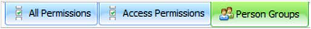

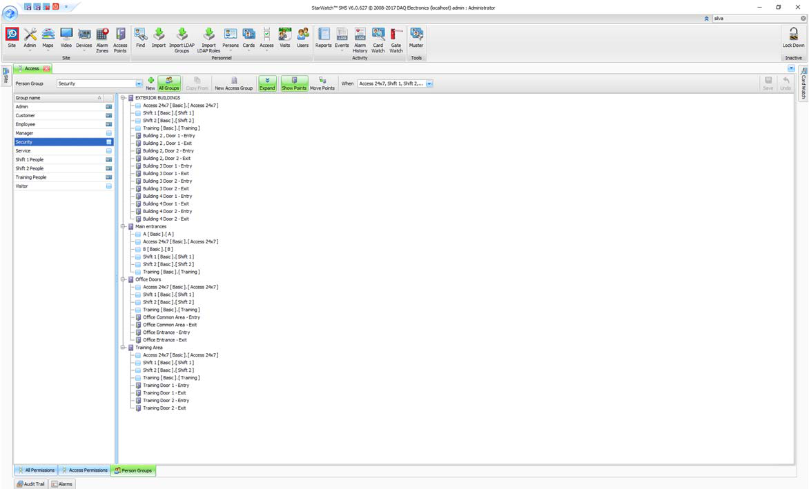

Below is a generic description of features found on the *Person Groups* tab, including a specific work
flow for managing *Person Groups*.
**Field**
**Icon**
**Description**
Shows the name of the current *Person*
Person Group

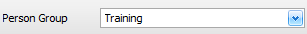

*Group* and allows you to browse the list of
available groups. You can also rename an
existing *Person Group* by typing a new
name in the field and hitting the *Enter*
key.
Allows you to create and add a new *Card*

*Permission*
New
All Groups
Shows all *Person Group* names that already

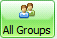

exist in the system
Creates a new *Card Permission* that has

the same rules as the currently selected
Copy From
permission
New Access Group
Adds a new group of doors

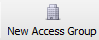

Expands the tree in the workspace to
Expand

include all *Points* and *Calendars* but not
doors or portals
Show Points
Shows all *Points* or groups of doors,

including doors/portals
Move Points
Moves doors/portals from one access group

to another
When
Provides a check-off list of the created

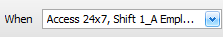

*Calendars* available when defining when a
*Person Group* can go through the doors in
an *Access Group*

By default, the *Group Name* area to the left of the *Person Group* window only lists the *Person Groups*
that are currently being used for access control.

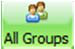

To view all groups and select which will be used for access control, hit the
button. *Person*
*Groups* that are being used for access control will have an access card icon next to their name, while
groups that are not being used for access control will have a checkbox. Select the checkboxes for all
*Person Groups* that will be used for access control in your system and click *Yes* in the confirmation pop-
up box for each.

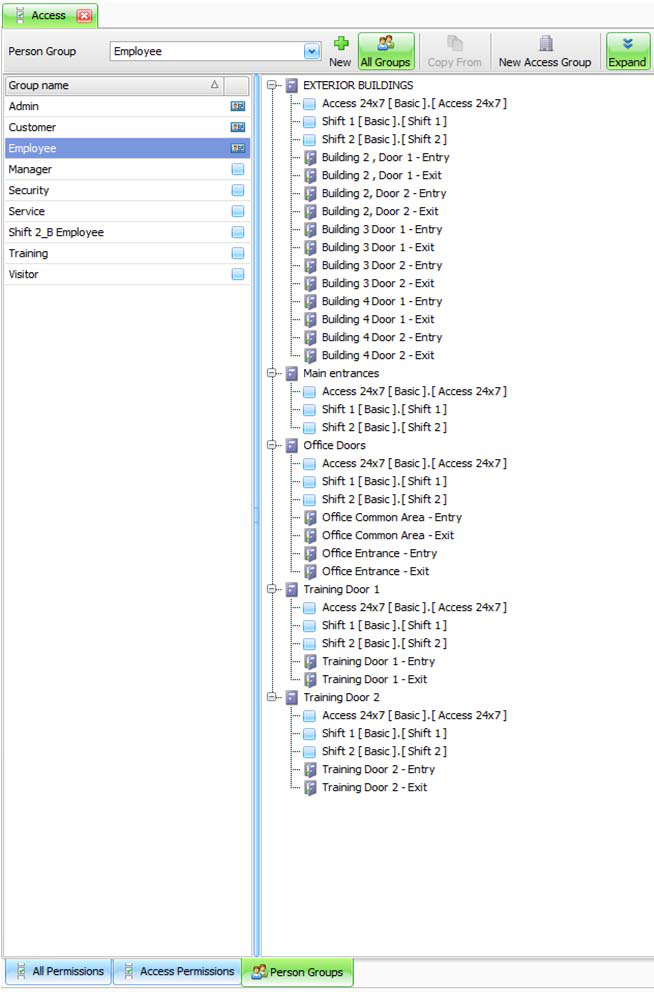

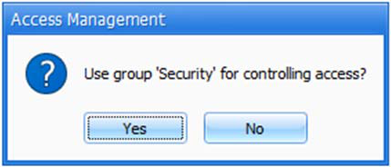

You may then begin the process of adding any additional *Person Groups* to the system that you need for
your access control scheme.
Creating New Person Groups
To demonstrate the creation of *Person Groups*, we will use the following example:
There are 300 employees in a facility, with two shifts of working hours:

Rule 1 - Permission 1:  Shift 1 Access:  Calendar (8:00am - 4:00pm)

Rule 2 - Permission 2:  Shift 2 Access:  Calendar (4:00pm - 12:00am)
Also, employees are allowed through access doors and points during specific hours, as follows:

Shift 1 Access is allowed through the Office Doors 24x7

Shift 1 Access is allowed through the Exterior Building Doors during Shift 1 Access hours

Shift 2 Access is allowed through the Office Doors 24x7

Shift 2 Access is allowed through the Exterior Building Doors during Shift 2 Access hours
To create a group type, be sure that the *Person Groups* tab of the *Access* application has been
selected.

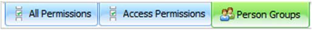

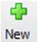

Click the
icon at the top of the *Access* workspace.

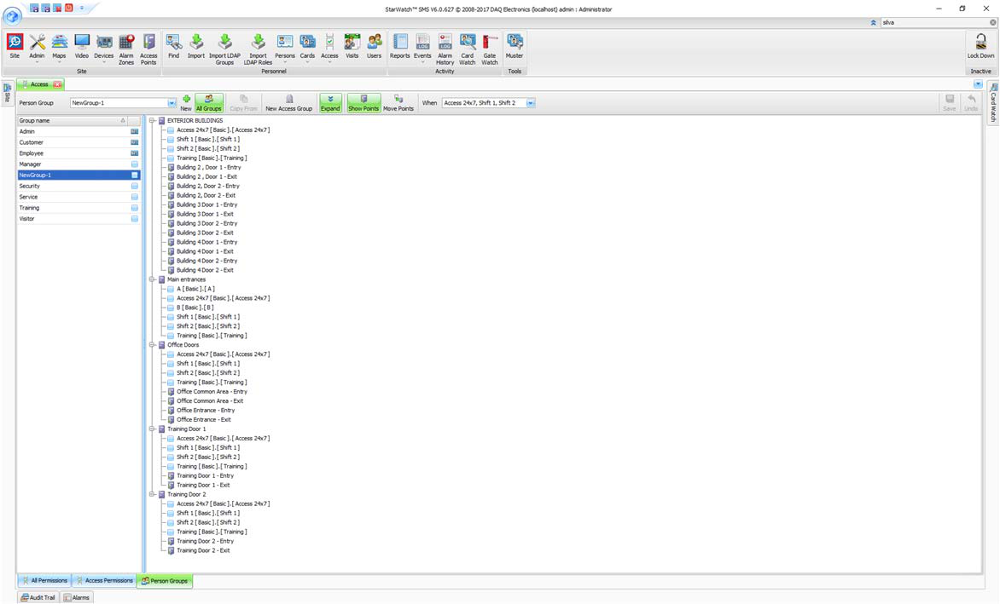

A new *Person Group* will be added with a “NewGroup-X” default name.

To rename this new group, right-click on the group in the *Group Name* tree to the left of the screen
and select the *Rename* option from the pop-up menu.

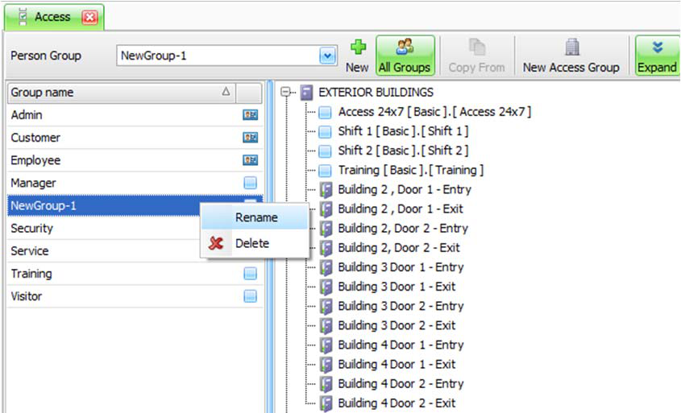

You can also select the group in the tree and then use the *Person Group* field at the top of the window
to type in a new name and hit the *Enter* key. For our example, we will type in the group name “Shift 1
People”.

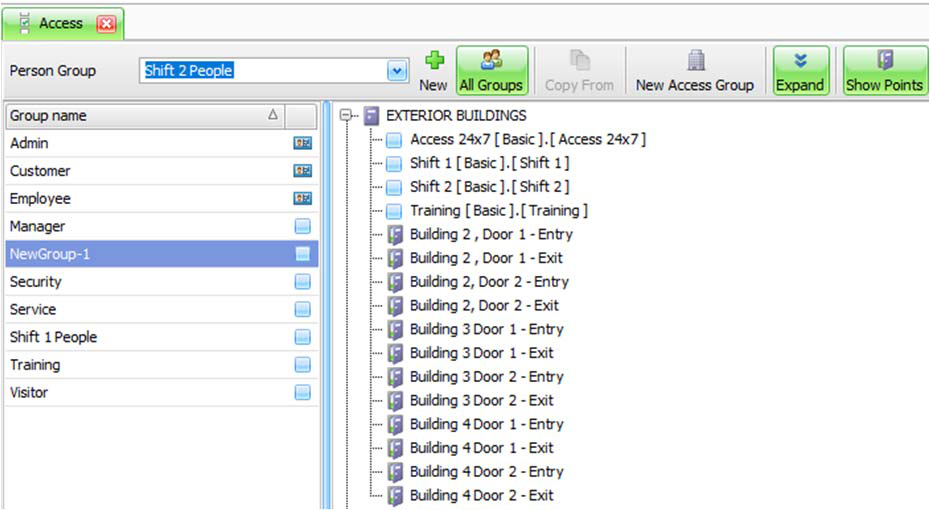

We then add a second group named “Shift 2 People”.

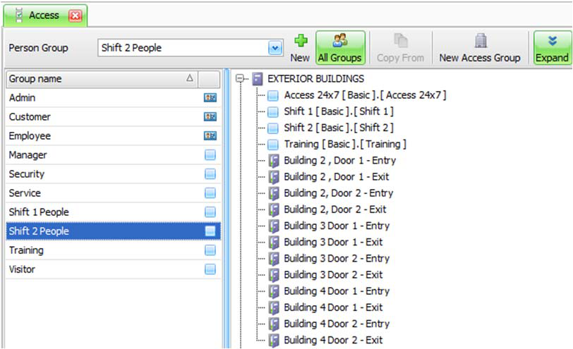

The next step is to define the *Rules* for where members of the new *Person Groups* can go within the
facility and when. From the information provided in our example, we know that members of *Shift 1*
*People* should be allowed to enter the facility’s office doors 24x7 and the exterior doors during Shift 1
hours.

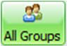

To define this *Rule*, click the
button, then select the appropriate *Person Group* from the tree
list, in this case *Shift 1 People*.

Click on the checkbox next to the *Shift 1 People* group to set it for controlling access and confirm by
selecting *Yes* in the pop-up window.

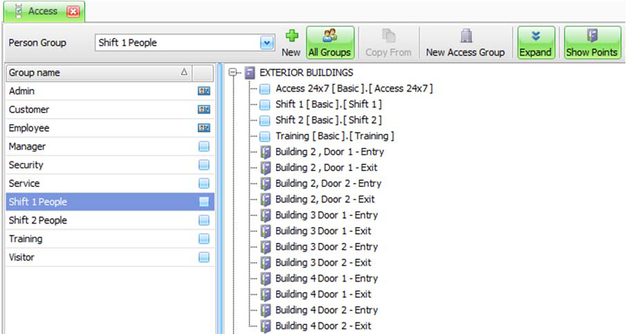

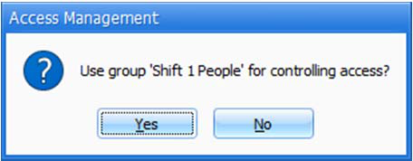

An access card icon will now appear next the group name.

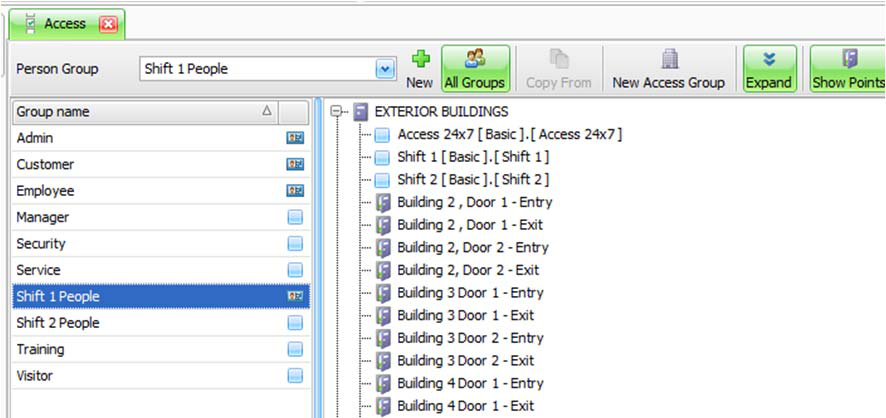

Next, in the tree area in the center of the screen, define the rules for the *Person Group* using the
checkbox options beneath the *Office Doors* and *Exterior Buildings* categories. The screenshot below
shows the *Shift 1 People* group set to allow entry to the facility’s office doors 24x7 and the exterior
doors during Shift 1 hours.

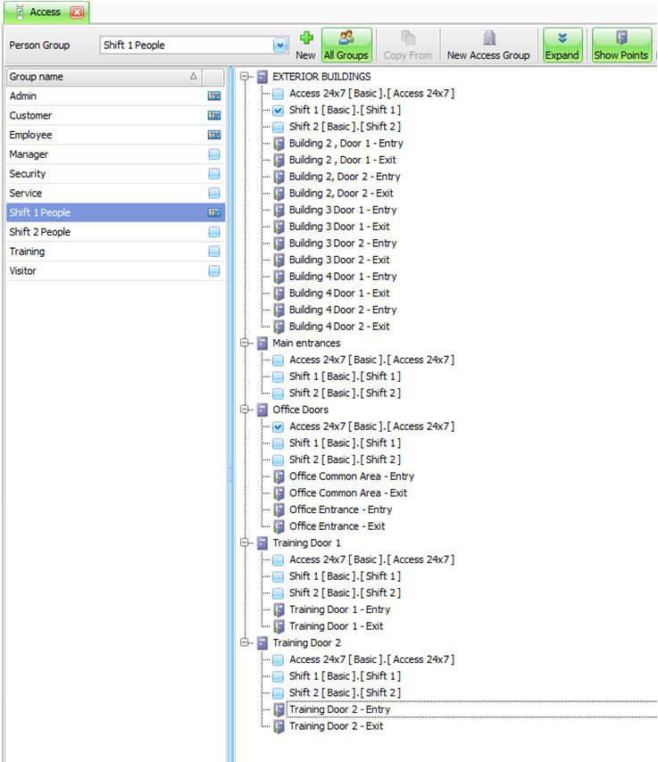

Click the
button to preserve any changes.

We then repeat these steps to set the *Shift 2 People* group to control access and define its rules. The
screenshot below shows the *Shift 2 People* group set to allow entry to the facility’s office doors 24x7
and the exterior doors during Shift 2 hours.

Viewing Person Group Details
To view information about a *Person Group* and how it has been defined in the system, click on the *All*
*Permissions* tab of the *Access* application.

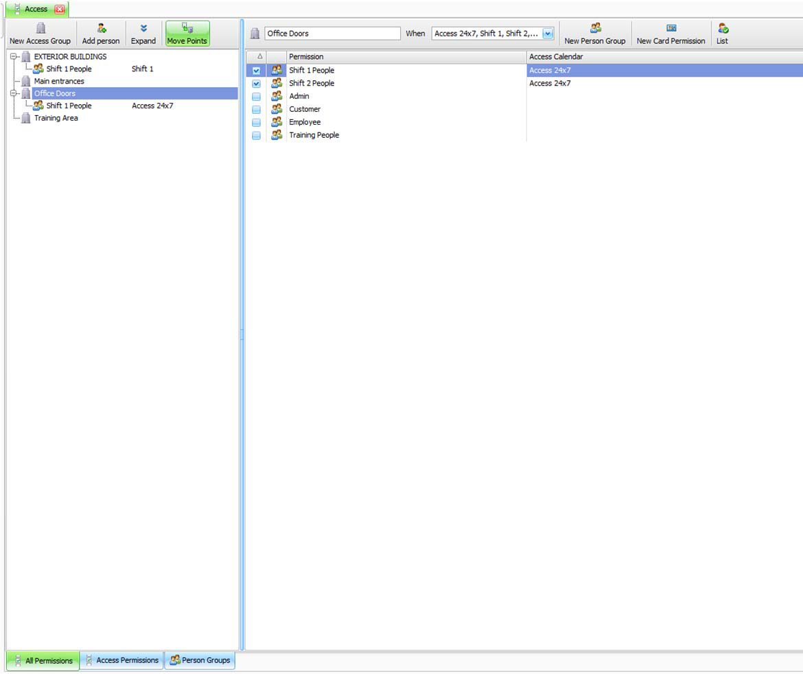

There are two ways for viewing this information. By highlighting a *Person Group* you will be able to see
where individuals in the group can go and when.
In the example below, the *Shift 1 People* group is highlighted, showing in the *Access Group* tree to the
left of the screen that individuals in the group are allowed through doors defined under the *Office*
*Doors* group during the *Access 24x7* calendar. Doors in the *Exterior Building* group are accessible to
individuals in the *Shift 1 People* group during the hours defined in the *Shift 1* calendar.

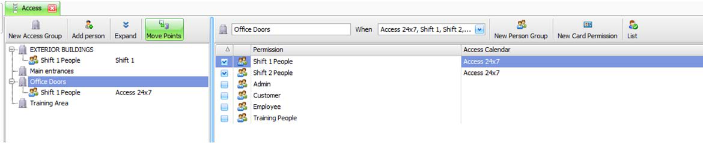

The second way to view information is by selecting a specific *Access Group*, which allows you to see
what *Person Groups* are allowed through the doors defined within the group and during what calendar
hours.
In the example below, the *Main Entrances* group has been highlighted in the *Access Group* tree to the
left of the screen. In the *Person Groups* list at the center of the workspace you can see that there are
no *Person Groups* assigned to access the facility’s main entrances as none of the associated boxes
display checkmarks.

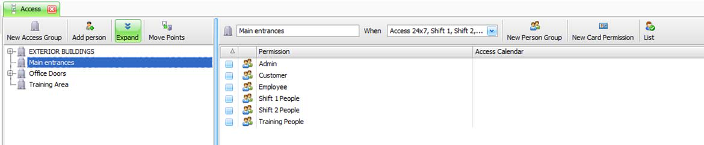

In a second example, the *Exterior Buildings* group has been highlighted. In the *Person Groups* list at the
center of the workspace you can see that there are two *Person Groups* assigned to access the facility’s
exterior entrances, *Shift 1 People* and *Shift 2 People*, as their associated boxes display checkmarks.

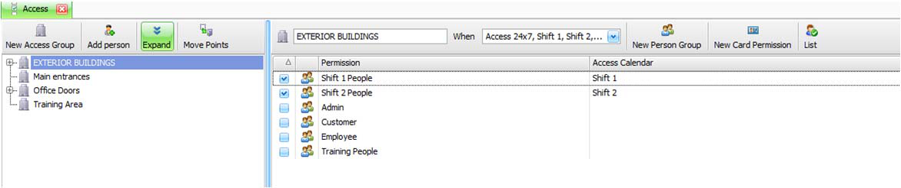

Assigning Individuals to Person Groups
Once *Rules* have been created and defined for *Who* (*Person Groups*), *Where* (*Access Groups*), and *When*
(*Calendars*), individual people must be assigned into each *Person Group*. There are several ways to
accomplish this in the *StarWatch SMS* system.
The first method is accomplished during the enrollment of a person of a specific type. *Person Groups*
can be assigned by default to anyone under a specific *Person Type*. For example, the system can be set
up so that when a person of type “Shift 1 Employee” is registered they are automatically placed into
the *Shift 1 People* group.
The second method is by directly assigning a *Person Group* to an individual. For example, perhaps you
create a *Person Type* called “Employee”, which has been set up to be automatically placed into an
employee *Person Group* by default. You may then go the *Access* tab associated with the profile of an
individual within the group and add them to the *Shift 1 People* or *Shift 2 People* group, or both, as
appropriate.
The final method of managing which individuals are in each *Person Group* is achieved from the *All*
*Permissions* tab of the *Access* application.

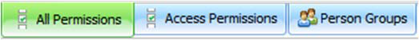

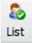

First, click the
button on top right of the *Access* workspace to call up a list of individuals that
have been assigned to the currently selected *Person Group*. This new workspace section will provide
several buttons and options for managing individuals.

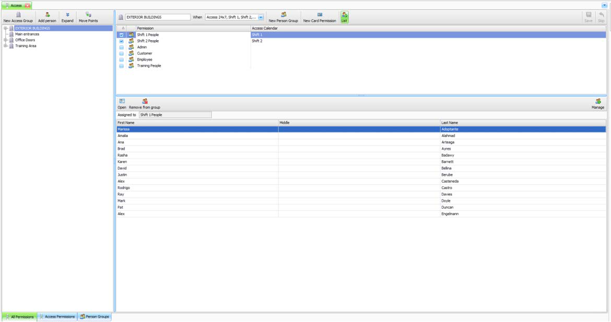

In the example below, we see a list of individuals that have been assigned to the *Shift 1 People* group.

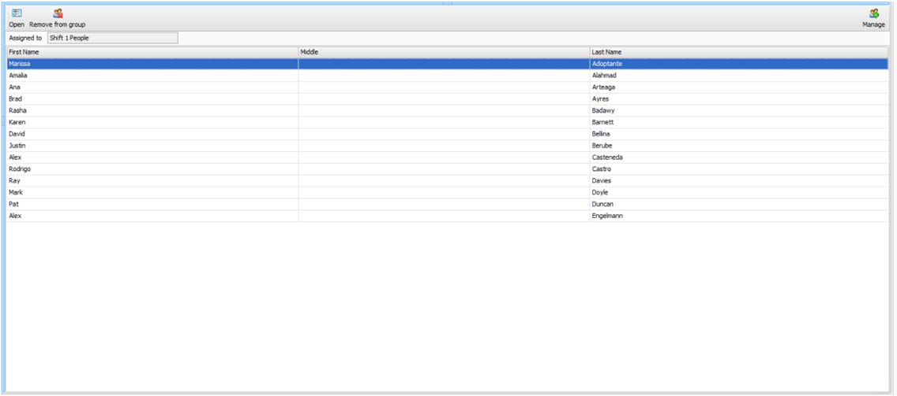

You can right-click on any name in the list to call up an options menu.

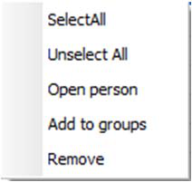

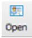

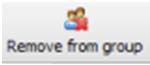

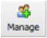

In addition, the
,
, and
, buttons are available at the top of the workspace
section.

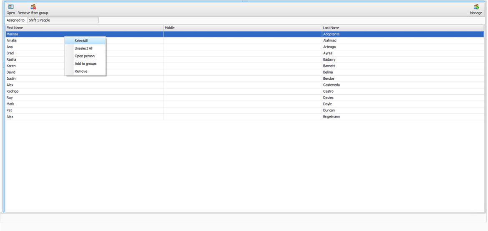

**Option**
**Description**
Select All
Selects all individuals in the current list
Unselect All
Unselects all individuals in the current list
Open Person
Opens the *Persons* tab associated with the individual, allowing you to view
their profile information
Add to Groups
Opens a pop-up screen to select *Person Groups* to which you would like to
add the selected individual
Remove
Removes the individual from the selected *Person Group*
Allows you to find individuals in the system and add them to the current

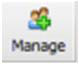

*Person Group*

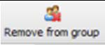

Removes the individual from the selected *Person Group*
Opens the *Persons* tab associated with the individual, allowing you to view

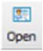

their profile information

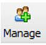

Click on the
button located on the right of the screen to add one or multiple individuals from
one *Person Group* to another.

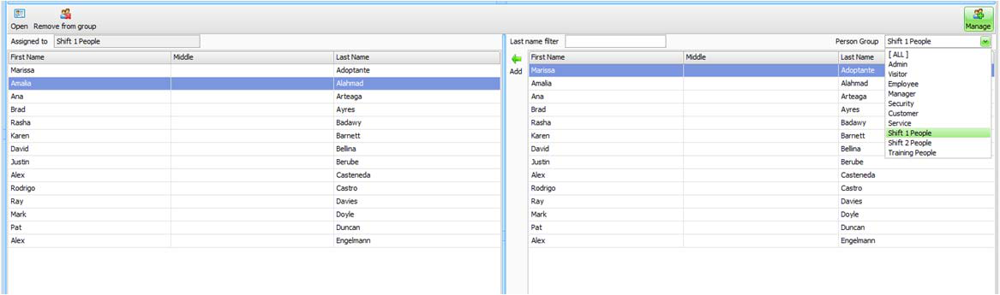

You will notice that the workspace divides in half, with the left half displaying the list of individuals
that exist in the currently selected *Person Group* and the right half showing a list of individuals that
are available for adding to the group. By selecting a *Person Group* from the drop down menu, you can
find appropriate individuals to add.

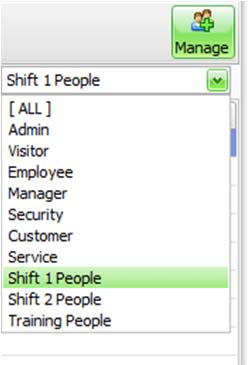

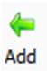

Once an individual or group of individuals has been selected in the list on the right, click the
button to add the user(s) to the group on the left.

In the screenshot below, the first four people from the *Shift 1 People* group have been selected in the
right half of the workspace.

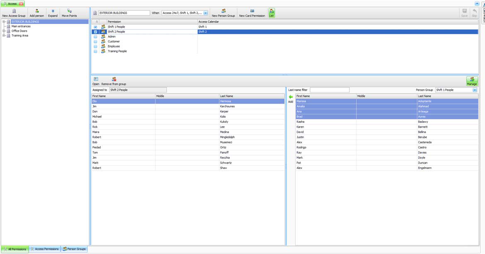

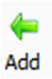

Clicking the
button calls up the *Add to Group* dialog box, indicating the currently selected group
that the individuals will be added to and also allowing you to select additional groups to which you can
add the individuals at the same time.

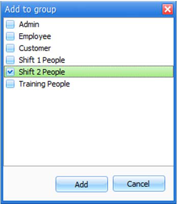

After selecting the appropriate *Person Groups*, click the *Add* button to complete the action.

In the screenshot below, the four employees selected from the *Shift 1 People* group on the right have
been added to the end of the list for the *Shift 2 People* group on the left. Note that the individuals
remain in the original group.

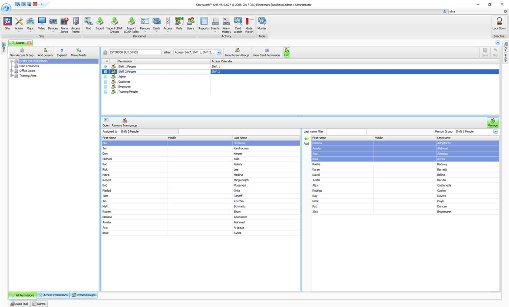

## 2.2.2 CARD PERMISSIONS

*Card Permissions* provide a method for assigning *Access Rules* to a *Card* instead of to a *Person*. This can
be useful in certain circumstances, but in general is not the simplest way to create *Access Rules* and
permissions, as they can be difficult to manage over time, especially in complex systems. However,
*Card Permissions* can be beneficial when:

The facility has individuals that carry multiple credentials, and are forced to use a specific card
at a specific door. This would mean that each *Card* that the person is carrying has different
rules associated with it, and the user needs to know which card to use at each door.

The facility temporarily issues *Cards* to access certain areas, and then the cards are returned.
Think of these cards as electronic “keys” that are already programmed with a *Card Permission*
to get into the specific area. The cards are given out, people use them for the day, and then
return them. The following day, they are issued out again to different people who require
access.
The complexity of *Card Permissions* is that they require that all of the *Access Rules* be combined
together into a permission. So, if we had an access permission called *Shift 1 Access*, we would need to
define every rule for *Shift 1 Access*.

Shift 1 Access is allowed through the Office Doors 24x7

Shift 1 Access is allowed through the Exterior Building Doors during Shift 1 hours

Etc.
This works nicely in the initial set up of a system, but begins to break down as individuals (or *Cards*)
require different combinations of doors. This is because a *Card* can only have one *Card Permission*
assigned to it. It cannot use combinations.

*Card Permissions* are used to associate specific *Card Types* with access points. *Card Permissions*
encapsulate everything about where a card can go and when. Each *Card* can only have one *Card*
*Permission*. As mentioned earlier, this option is useful for simple, non-dynamic systems that do not
require many rules for doors.
To create a *Card Permission*, you will need to define a set of rules that can be applied to a specific
*Card* that will be given to a person. Each *Card Permission* defines all the rules associated with every
*Access Group* in the system, including defining when the *Card* can go through the groups of doors it is
allowed to go through and defining the doors it is not allowed to go through.
The management of *Card Permissions* and the rules contained in each is accomplished using the *Access*
*Permissions* tab of the *Access* application.

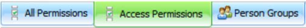

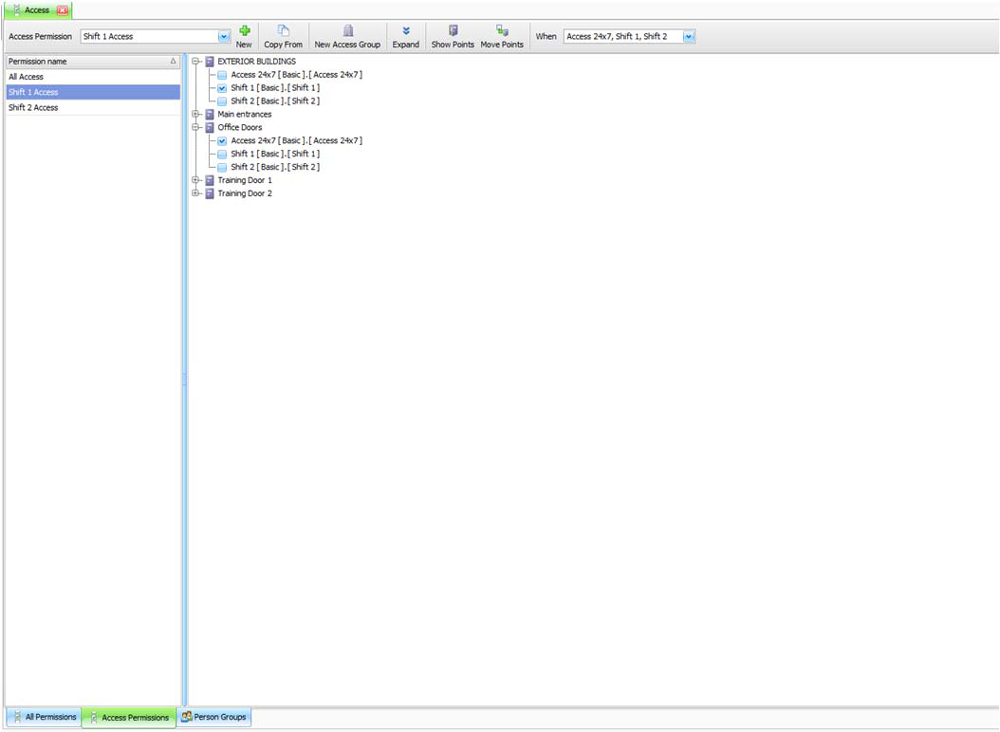

Below is a generic description of features found on the *Access Permissions* tab:
**Field**
**Icon**
**Description**
Access Permission
Shows the name of the current *Card*
*Permission*. The user can browse the list of

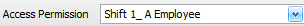

permissions using the drop-down menu.
The user can also rename an existing
permission by typing the new name in the
text field and hitting the *Enter* key.
Allows the user to create and add a new

New
*Card Permission*.
Creates a new *Card Permission* with the

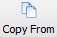

Copy From
same rules as the currently selected
permission.
New Access Group
Adds a new group of doors.

Expands the tree in the workspace to
Expand

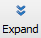

include all points and calendars, but not
doors or portals.
Show points
Shows all the points or the groups of

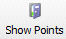

doors/portals.
Move Points
Moves doors/portals from one *Access*

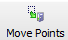

*Group* to another.
When
Selects the calendar you see in the

workspace, from which you can make your
selections.

Creating a New Card Permission
To demonstrate the creation of *Card Permissions*, we will use the following example:
There are 300 employees in a facility, with two shifts of working hours:

Rule 1 - Card Permission 1:  Shift 1 Access:  Calendar (8:00am - 4:00pm)

Rule 2 - Card Permission 2:  Shift 2 Access:  Calendar (4:00pm - 12:00am)
Also, employees are allowed through access doors and points during specific hours, as follows:

Shift 1 Access is allowed through the Office Doors 24x7

Shift 1 Access is allowed through the Exterior Building Doors during Shift 1 hours

Shift 2 Access is allowed through the Office Doors 24x7

Shift 2 Access is allowed through the Exterior Building Doors during Shift 2 hours
Given the rules for the two shifts, we will need to establish two different sets of rules (permissions) for
the two different shifts. Depending on which group the employee belongs to, we will give them a *Card*
assigned with the appropriate permission.
To create a *Card Permission*, be sure that the *Access Permissions* tab of the *Access* application has
been selected.

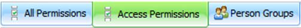

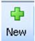

To begin, click the
icon at the top of the *Access* workspace.

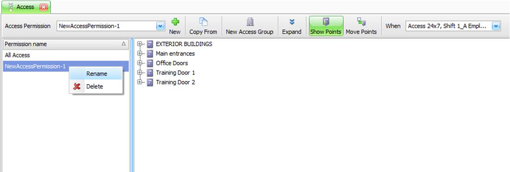

A new auto-generated *Card* *Permission* name will be displayed in the list. Right-click on the name in
the tree, and select the *Rename* option from the pop-up menu to rename the permission.
For our example, we will create two *Card Permissions* and rename them:

Shift 1 Access

Shift 2 Access

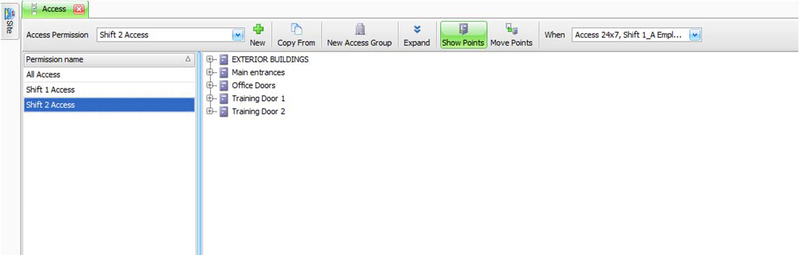

The next step is to associate *Calendars* and *Access Groups* with the new *Card Permissions*.
Click on the *When* field in the upper-right of the screen. From the drop-down menu, select the
checkboxes associated with the *Calendars* that should be shown as options when assigning the *Card* and
*Access Permissions*. In our example, the *Shift 1*, *Shift 2*, and *Access 24x7* options are selected.

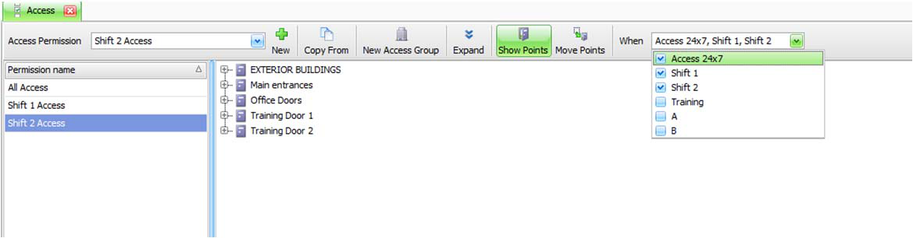

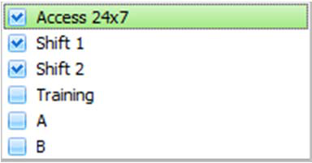

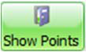

Select the *Card Permission* and click the
and
icons in the access tool menu. Next, in
the tree area in the center of the screen, define the rules for the *Card Permission* using the checkbox
options beneath the *Office Doors* and *Exterior Buildings* categories. The screenshot below shows the
*Shift 1 Access* permission set to allow entry to the facility’s office doors 24x7 and the exterior doors
during Shift 1 hours.

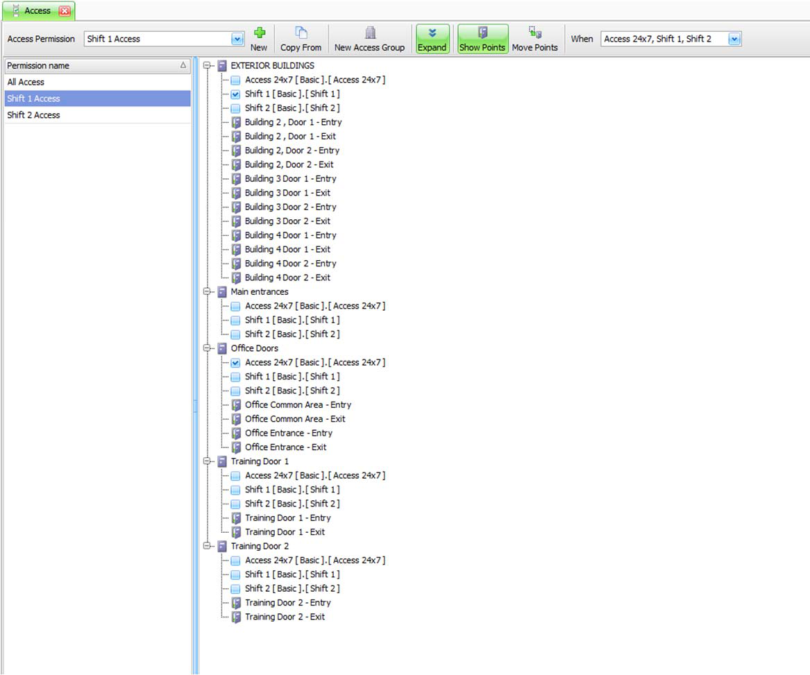

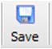

Click the
button to preserve any changes.

We then repeat these steps to set the *Shift 2 People* permission to control access and define its rules.
The screenshot below shows the *Shift 2 People* group set to allow entry to the facility’s office doors
24x7 and the exterior doors during Shift 2 hours.

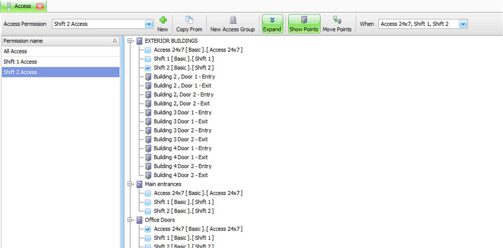

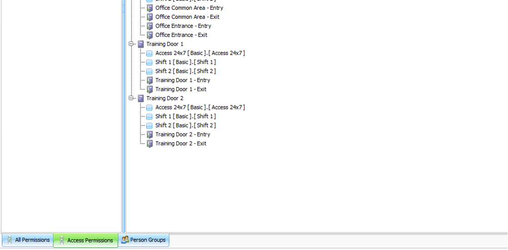

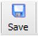

Click the
button to preserve any changes.

Renaming a Card Permission
In the *Permission Name* column to the left of the window, right-click on the *Card Permission* set that
you want to rename and select the *Rename* option from the pop-up menu. Type the new name into the
text field and click anywhere to end the editing.

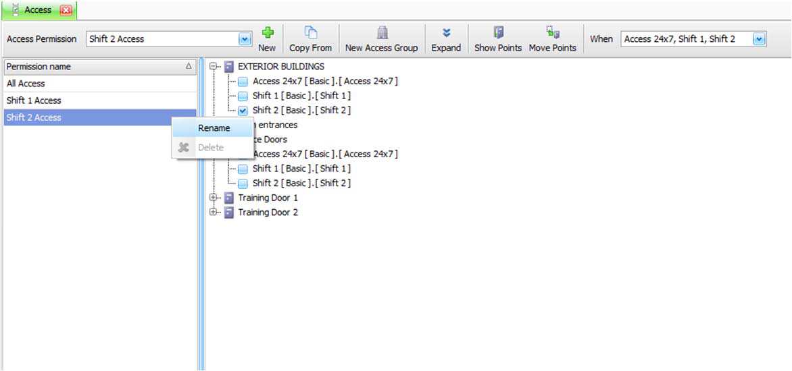

You can also rename a *Card Permission* set by highlighting the name in the *Access Permission* field at
the top of the window, typing in a new name, and pressing the *Enter* key when done.

Deleting a Card Permission
In order to delete a *Card Permission* you must first remove all Calendars that have been attached to it
in the tree using the available checkboxes. Next, right-click on the *Card Permission* that you want to
delete and select the *Delete* option from the pop-up menu. The permission set will be deleted and
removed from the list.

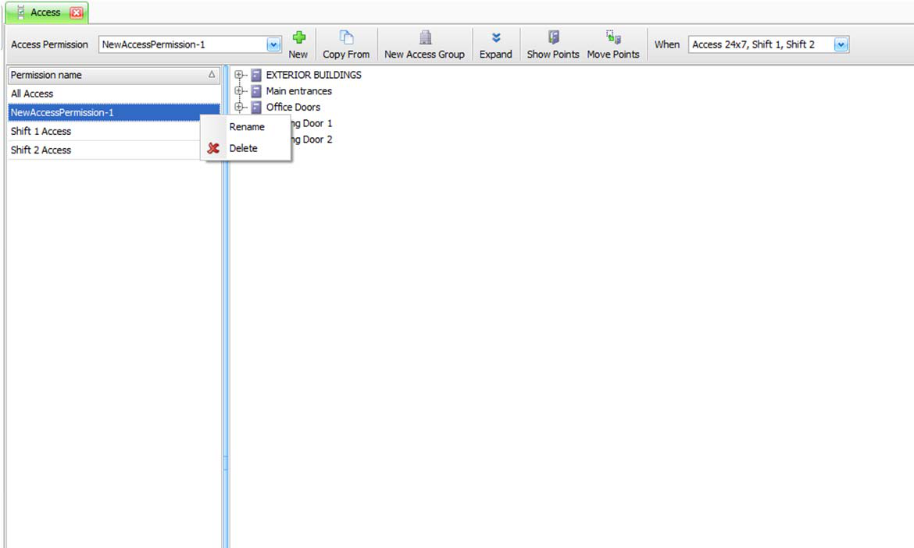

Maintaining Card Permissions
While initial set up of a system using *Card Permissions* is very straight-forward, it can become
cumbersome as a system becomes more complex and rules change.
As an example, imagine that the facility constructs a training area where we need half of the *Shift 1*
employees and half of the *Shift 2* employees to be able to access the new area during training hours in
addition to the permissions they already have from the assigned *Shift 1* or *Shift 2* access permissions.
Because a *Card Permission* needs to contain all of the *Access Rules* for every door, and a *Card* may only
have one permission attached to it, the following steps are required:

Create a new *Access Permission* for *Shift 1* *+ Training Access*

Create  a new *Access Permission* for *Shift 2 + Training Access*

Move the *Cards* that require the Training Area from *Shift 1* access into *Shift 1 + Training Access*

Move the *Cards* that require the Training Area from *Shift 2* access into *Shift 2 + Training Access*
This means that we need to create another two sets of *Rules* and change their *Card Permissions* to
allow the selected employee groups to have access to the training area in addition to their normal
working hour shifts. Below are the *Card Permission* rules that need to be created:

Rule 1 - Card Permission 1: Shift 1-A Employee: Calendar (8:00am - 4:00pm)

Rule 2 - Card Permission 2: Shift 2-B Employee: Calendar (4:00pm - 12:00am)

Rule 3 - Card Permission 3: Shift 1-A Employee + Training: Calendar (8:00am - 4:00pm) +
Training (3:00pm - 5:00pm)

Rule 4 - Card Permission 4: Shift 2-B Employee + Training: Calendar (4:00pm - 12:00am) +
Training (3:00pm - 5:00pm)
In this case, if any of the rules change again, we will need to create yet another *Card Permission* rule.
This can become complicated and difficult to manage over time.

## 3.0 DEFINING OPERATOR ROLES

Using the role management feature, you can create a series of roles, each with customized rights and
privileges, that can be assigned to system users. These roles strictly control which functions a specific
user is allowed to perform within the system. In most cases, the user rights assigned to system
administrators who setup and maintain the database will be significantly different from the user rights
assigned to general operators, such as security guards.
For example, you might want to restrict system setup features, such as creating credentials and person
types, to users that have been given an administrator role. All other roles would not be given the
necessary rights to access these functions. When users who have been assigned non-administrator roles
login to the system, the icons related to the restricted functions will not appear on their screen,
effectively preventing them from viewing or modifying these aspects of the system. Once roles have
been defined, they can be assigned to registered individuals using the *Personnel* features of the
system.

To view role management options, click on the
icon located on the *Users* segment of
the *Admin* list on the left side of the screen.

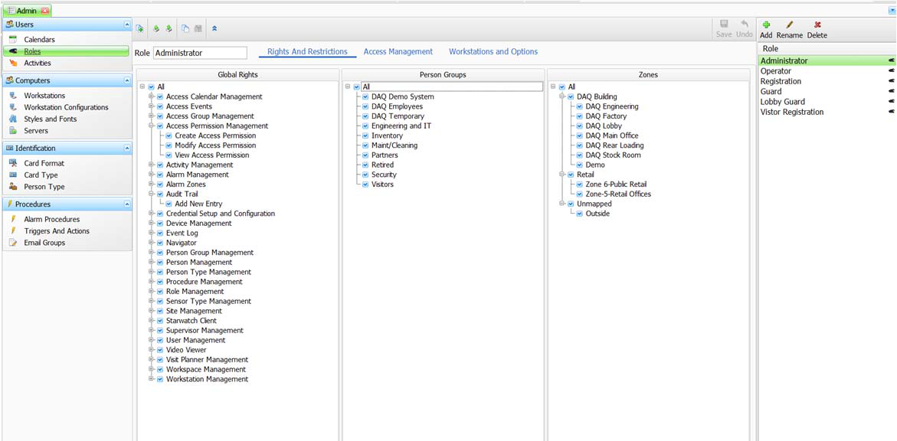

Using the *Role* pane on the right side of the main screen, you can add, rename, delete or select a role
to view or modify.

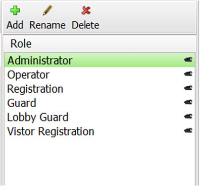

## 3.1 CREATING A NEW ROLE

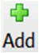

To create a new role, click on the
button at the top of the *Role* pane.

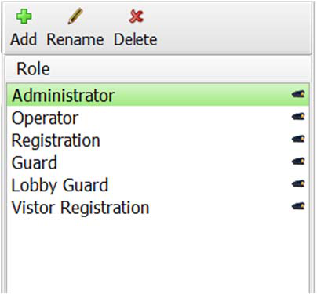

A new role will be added to the *Role* list with an auto-numbered name. To change the name of the
added role, click in the *Role* name field in the top left of the work area and type in a new name for the
role (ex. Administrator, Operator).

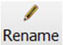

Alternately, you can select a role in the list and click on the
button at the top of the *Role*
pane.
Note: as the default setting, new roles are created with no rights and privileges.

Once a new role has been added, save your changes using
button in the upper right of the work
area. A pop-up screen will ask you to confirm the changes.

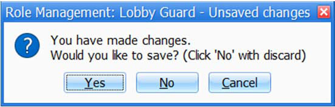

## 3.2 SELECTING AN EXISTING ROLE

To modify the parameters of an existing role, you must first call it to the screen by selecting it from
the list in the *Role* pane.

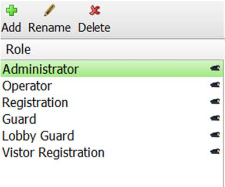

Once selected, the role name will appear in the *Role* name field and any associated settings will be
displayed in the work area.

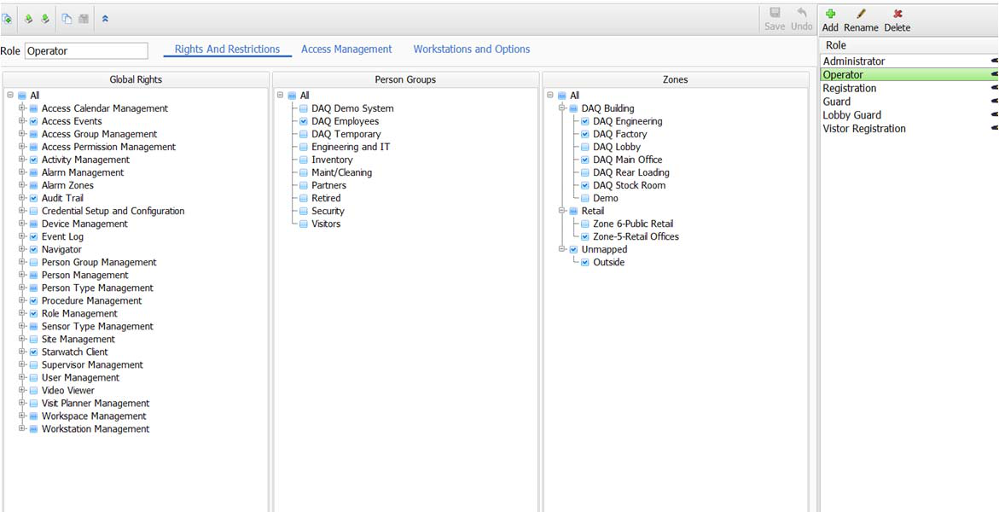

## 3.3 MODIFYING ROLES

Once the appropriate role has been called to the screen, you can define the rights and privileges that
will be associated with the role.

## 3.3.1 RIGHTS AND RESTRICTIONS

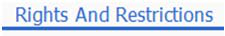

The
tab consists of three columns: *Global Rights*, *Person* *Groups* and *Zones*. You
can select all of the options listed for a role by clicking the *All* checkbox at the top of the column or
individually select the options which correspond to the rights and restrictions you are configuring.

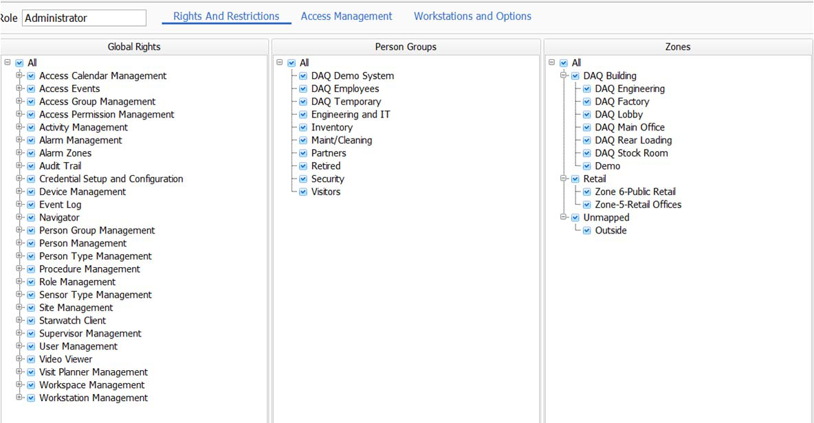

## Global Rights

Using the *Global Rights* column, you can define the types of actions users under the current role can
perform and what parts of the system they can view or modify. To grant all global rights to a role,
simply select the *All* checkbox at the top of the list. Alternately, you can select individual checkboxes
from the expanded list.

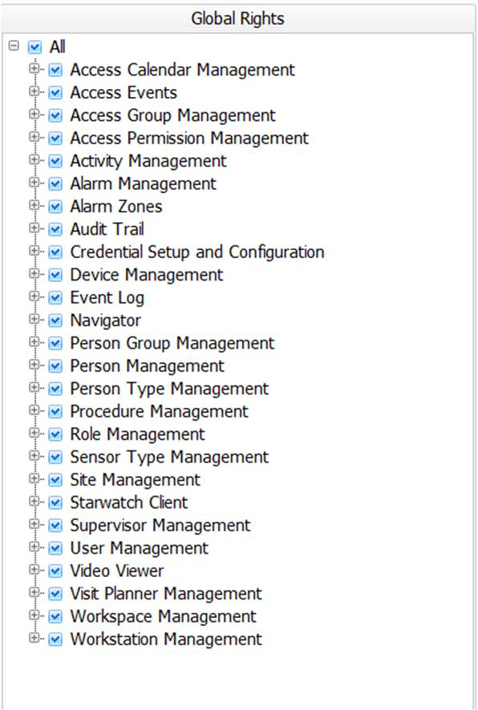

The categories and sub-categories provided in the *Global Rights* column allow you to fine-tune the
activities and rights associated with each role.

Access Calendar Management
Assign the rights to create, view, and modify access calendars.

Access Events
Assign the rights to view access events.

Access Group Management
Assign the rights to create, view, and modify access groups.

Access Permission Management
Assign the rights to create, view, and modify access permissions.

Activity Management
Assign the rights to create, modify and select home page activities.

Alarm Management
Assign the rights to view, acknowledge, defer, and clear system alarms, as well as apply
resolution codes and add alarm related notes.

Alarm Zones
Assign the rights to create permissions, manage users and zones, modify and view permissions,
and view users and zones.

Audit Trail
Assign the rights to add a new entry to the audit trail.

Credential Setup and Configuration
Assign the rights to create, view, and modify credential types and modify badge designs.

Device Management
Assign the rights to view and edit device objects.


Event Log
Assign the rights to search and view the event log.

Navigator
Assign the rights for navigation, either as an admin or monitor or both.

Person Group Management
Assign the rights to create, view, modify, and delete person groups.

Person Management
Assign the rights to register new users into the system and view and modify aspects of existing
user profiles, including credentials, photos, access levels, etc.

Person Type Management
Assign the rights to create, view, and modify person types.

Procedure Management
Assign the rights to create, modify or view procedures.

Role Management
Assign the rights to create, view, modify, and delete roles.

Sensor Type Management
Assign the rights to view and modify sensor types.

Site Management
Assign the rights to view and manage objects placed in site maps and use them to issue actions
and commands.

StarWatch Client
Assign the rights to minimize or close a running *StarWatch SMS* application.

Supervisor Management
Assign the rights to force close, force logout, and send a message.


User Management
Assign the rights to register new users into the system and view and modify existing user
details.

Video Viewer
Assign the rights to control camera PTZ, manage layouts, manage presets, use layouts, use
presets, and view video.

Visit Planner Management
Assign the rights to view and manage visit schedules and import visitor lists.

Workspace Management
Assign the rights to create, modify, and save a workspace layout.

Workstation Management
Assign the rights to create, view, and modify workstations as well as save workspace
configurations.

## Person Groups

Using the *Person Groups* column, you can select the person groups that will be available under the
current role. You can make all person groups available for the role by selecting the *All* checkbox at the
top of the list, or select groups individually from the expanded list.
Note: the options available in the list reflect the person groups that have been saved in the system
database.

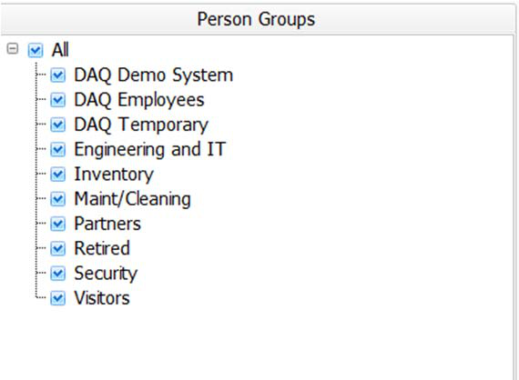

When an individual is registered into the *StarWatch SMS* database and assigned the current role, only
the groups selected in this column will be provided to the system operator as viewable or able to be
managed.

## Zones

Using the *Zones* column, you can define the site map zones that will be available under the current
role. You can make all zones available to the role by selecting the *All* checkbox at the top of the list,
or select groups individually from the expanded list.
Note: zones are created and configured using the separate *StarWatch SMS Site Builder* software
application (see the *Site Builder User Guide* for details). The options available in the list reflect the
zones that have been saved in the system database.

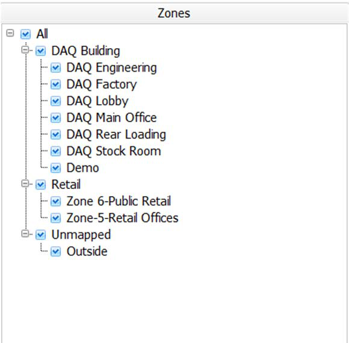

## 3.3.2 ACCESS MANAGEMENT

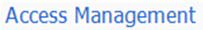

The
tab consists of three columns: *Access Groups*, *Access* *Permissions*, and *Card*
*Types*. These options define which facility areas a role can be granted access to and what permission
levels they can be assigned. You can select all of the options listed for a role by clicking the *All*
checkbox at the top of the column or individually select the options which correspond to the rights and
restrictions you are configuring.

## Access Groups

Using the *Access Groups* column, you can select the access groups that will be available under the
current role. You can make all access groups available, by selecting the *All* checkbox at the top of the
list, or select groups individually.

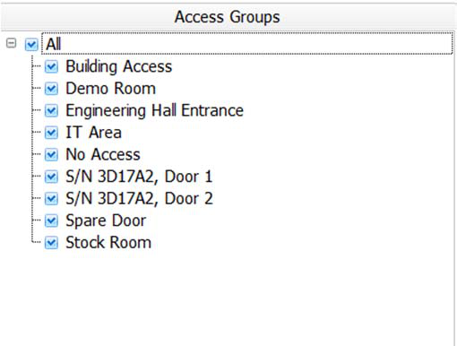

When an individual is registered into the database and assigned the current role, only the groups
selected in this column will be provided to the system operator as selectable access group options.
Note: the options available in the list reflect the access groups that have been saved in the system
database.

## Access Permissions

Using the *Access Permissions* column, you can select the access permissions that will be available under
the current role. You can make all access permissions available by selecting the *All* checkbox at the top
of the list, or select groups individually.

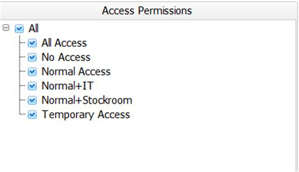

Note: the options available in the list reflect the access permissions that have been saved in the system
database.

## Card Types

Using the *Card Types* column, you can select the card types that will be available under the current
role. You can make all card types available by selecting the *All* checkbox at the top of the list, or
select groups individually.

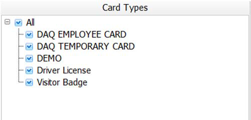

Note: the options available in the list reflect the card types that have been saved in the system
database.

## 3.3.3 WORKSTATIONS AND OPTIONS

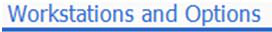

The
tab allows you to select what screen will load at login for a particular
role.

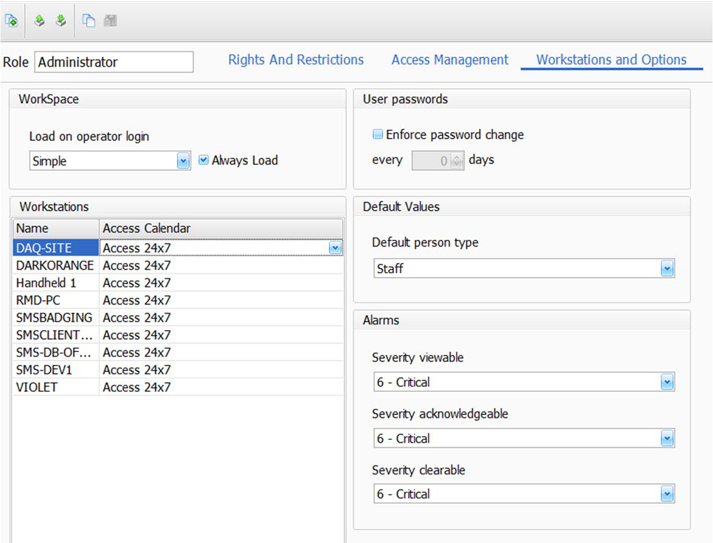

The rights then define which workstations on the system are allowed to log in as the selected role and
at what times (calendars) they are allowed to do so. You may also define whether password changes
will be enforced and their frequency, the default person type for individuals within the selected role,
and the alarm severity for which the role is authorized to manage the alarm.

## 4.0 MANAGING WORKSTATIONS

Using the *Workstation* feature, you can create and manage operator stations within your *StarWatch*
*SMS* system. Once a workstation is incorporated into the system, it must be set up with roles and rights
to restrict who can use the workstation and at what times.

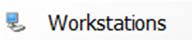

To launch this function, click on the
icon located on the *Computers* segment of the
*Admin* list on the left side of the screen.

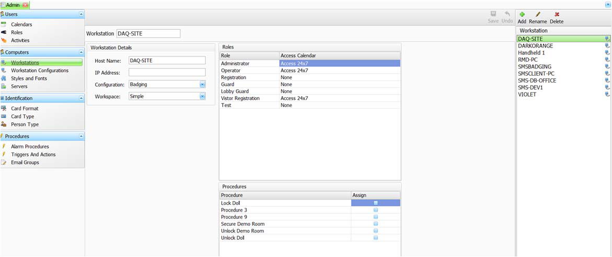

Using the *Workstation* pane on the right side of the main screen, you can add, rename, delete or select
a workstation to view or modify.

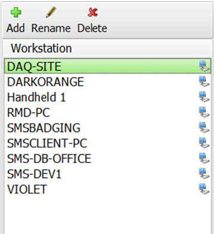

## 4.1 CREATING A NEW WORKSTATION

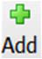

To create a new workstation, click on the
button at the top of the *Workstation* pane.

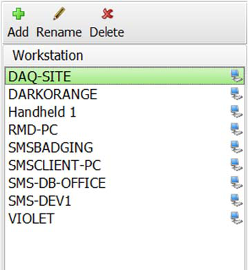

A new workstation will be added to the *Workstation* list with an auto-numbered name. To change the
name of the added workstation, click in the *Workstation* name field in the top left of the work area
and type in a new name for the workstation (ex. Test, Operation).

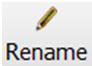

Alternately, you can select a workstation in the list and click on the
button at the top of the
*Workstation* pane.
Note: as the default, new workstations are created without defined settings or any set privileges.

Once a new workstation has been added, save your changes using the
button in the upper right of
the work area. A pop-up screen will ask you to confirm the changes.

## 4.2 SELECTING AN EXISTING WORKSTATION

To modify the parameters of an existing workstation, you must first call it to the screen by selecting it
from the list in the *Workstation* pane.

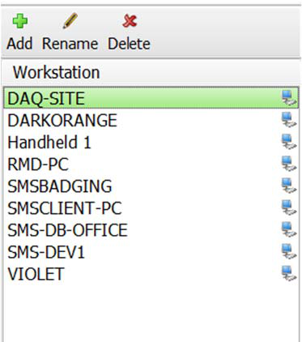

Once selected, the workstation name will appear in the *Workstation* name field and any associated
settings will be displayed in the work area.

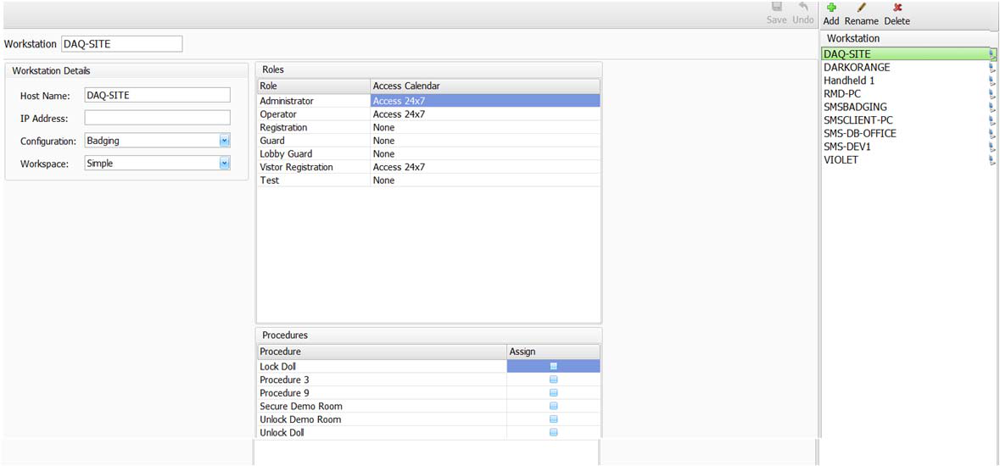

## 4.3 MODIFYING A WORKSTATION

Once the appropriate workstation has been called to the screen, you can set its parameters using the
*Workstation Details* area.

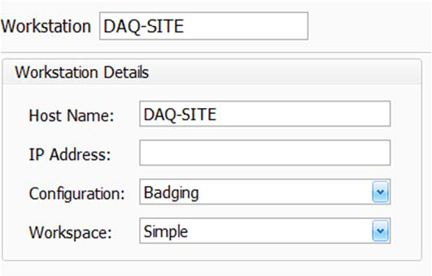

The *Name* field defines the descriptive name of the workstation as it will be used in the *StarWatch SMS*
environment. For example, a workstation that will be used as a badging station might be named
“Badging Station 1”.
The *Host Name* field or the *IP Address* field must also be filled in, depending on the set up of your
network. The *Host Name* should indicate the specific name of the computer as it has been configured
in your network, while the *IP Address* should indicate the IP address for the computer.

## 4.3.1 ASSIGNING ACCESS SCHEDULES

In the *Roles* area, you can designate the times that each user type will be able to access the current
workstation.

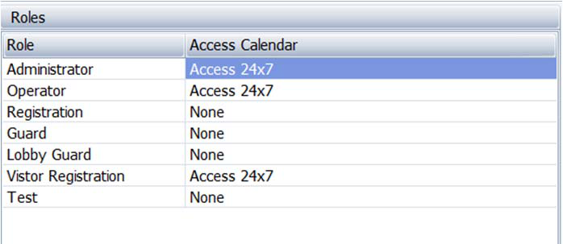

The *Role* column lists all the roles that have been created in the system. For each role type, you can
apply a schedule defining specific hours and days of the week when the workstation will be accessible.
For example, if you wanted all administrators to have access to the workstation at all times, you would
select an access calendar for that role that reflected 24/7 coverage.
To assign a schedule to a role, click on the appropriate cell in the *Access Calendar* column and select
an option from the pull-down list provided. The list will display all the calendars that have been
previously created in the system.

## 4.3.2 ASSIGNING PROCEDURES

Using the *Procedures* area, you can assign procedures to the workstation. This will give privileges to
execute certain procedures, as needed.

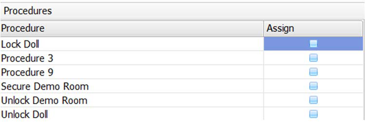

## 5.0 WORKSTATION CONFIGURATIONS

Using the *Workstation Configurations* feature, you can create, configure and manage operator
workstation configurations within your *StarWatch SMS* system. Once a workstation configuration is
incorporated into the system, you can modify and specify what parameters and privileges that
workstation requires.

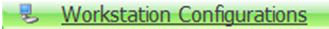

To launch this function, click on the
icon located on the *Computers*
segment of the *Admin* list on the left side of the screen.

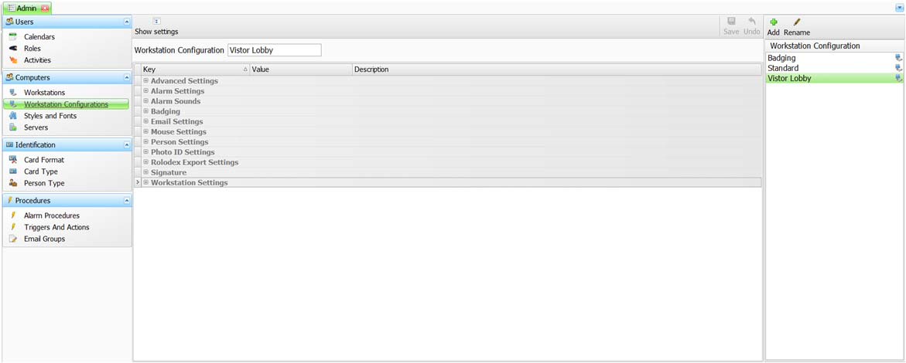

Using the *Workstation Configuration* pane on the right side of the main screen, you can add, rename,
or select a workstation configuration to view or modify.

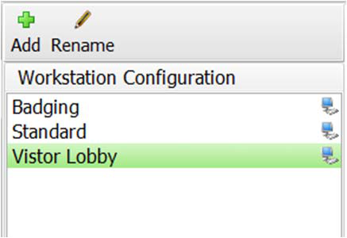

## 5.1 CREATING A NEW WORKSTATION CONFIGURATION

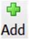

To create a new workstation configuration, click on the
button at the top of the *Workstation*
*Configuration* pane.

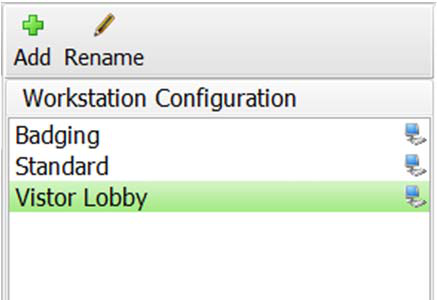

A new workstation configuration will be added to the *Workstation Configuration* list with an auto-
numbered name. To change the name of the added workstation configuration, click in the *Workstation*
*Configuration* name field in the top left of the work area and type in a new name for the workstation
configuration (ex. Tech Room, Operation Station).

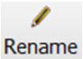

Alternately, you can select a workstation configuration in the list and click on the
button at
the top of the *Workstation Configuration* pane.
Note: as the default, new workstations configurations are created without defined settings or any set
privileges.

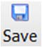

Once a new workstation configuration has been added, save your changes using the
button in the
upper right of the work area. A pop-up screen will ask you to confirm the changes.

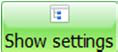

In the main *Workstation Configurations* area, click on the
icon to expand the displayed
settings. This allows you to modify and assign any parameters required. Multiple configuration options
are provided, including settings for alarms, alarm sounds, badging, email, mouse, person, photo ID,
Rolodex export, signature, etc.

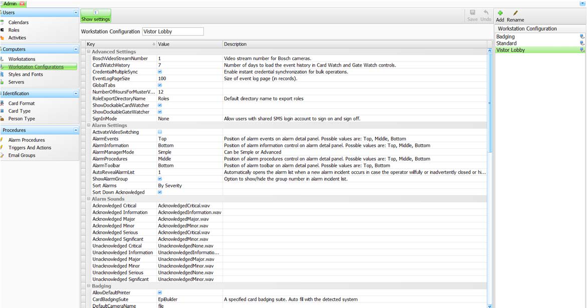

## 5.2 SELECTING AN EXISTING WORKSTATION CONFIGURATION

To modify the parameters of an existing workstation configuration, you must first call it to the screen
by selecting it from the list in the *Workstation Configuration* pane.

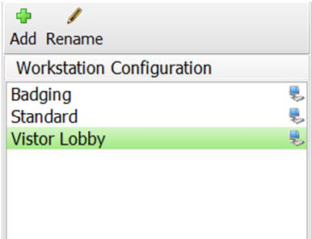

Once selected, the workstation configuration name will appear in the *Workstation Configuration* name
field and any associated settings will be displayed in the work area.

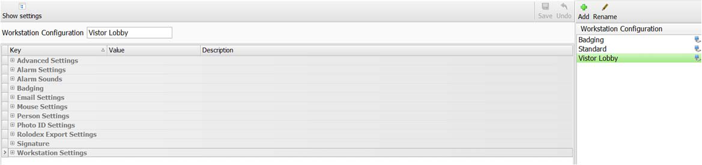

## 6.0 SERVER CONNECTIONS

Using the *Servers* feature, you can connect to alternate instances of *StarWatch SMS* running from
servers on your network.
For example, in a multi-building complex, you might have the need to set up two *StarWatch SMS*
systems, each complete with separate personnel databases, system configurations, and connected
security hardware. In this scenario, the *Servers* function would allow you to connect to both systems
from a single workstation, if both systems resided on a common network.
Note: the *Servers* feature does not provide the ability to connect to more than one system
simultaneously. Only one database at a time can be viewed from a single workstation.

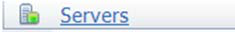

To launch this function, click on the
icon located on the *Computers* segment of
the *Admin* list on the left side of the screen.

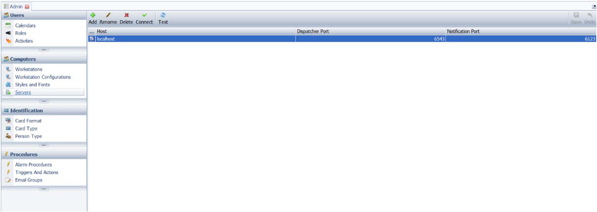

Note: the top portion of the window will display information related to the currently connected server.
Using the toolbar at the top of the *Server* work area, you can rename, delete, connect, and test
existing and newly added servers.

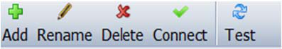

## 6.1 ADDING A SERVER

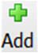

To add a new host server, click the
button at the top of the *Server* work area.

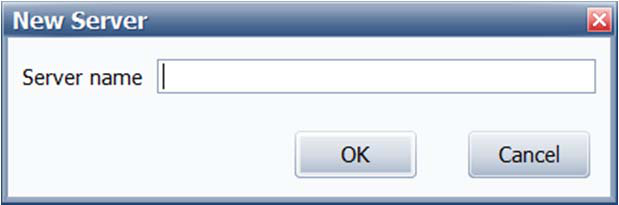

Type in a name for the server and click the *OK* button. A new server row will be added to the list with
default settings.

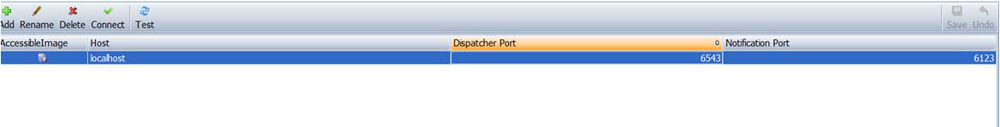

With the new row selected, you can edit the *Host*, *Dispatcher Port* and *Notification Port* fields in their
corresponding columns to match the server you want to include.

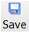

Save your changes using the
button in the upper right of the work area.

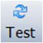

Once all details have been set, you can test whether the settings are usable by clicking the
button at the top of the *Server* work area. If the test is successful, the *AccessibleImage* field will
display a green checkmark indicating the current workstation can communicate properly with the
selected server.

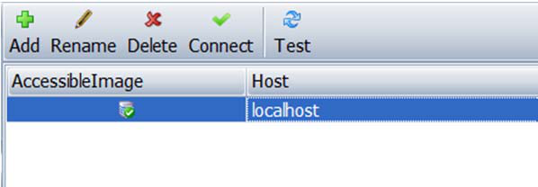

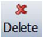

You can remove a server from the list by selecting the appropriate row and clicking the
button.

## 6.2 CONNECTING TO A SERVER

Once you have tested a server connection, you can switch from your current server to a new server.

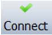

To do this, select the appropriate row in the server list, and click on the
icon.

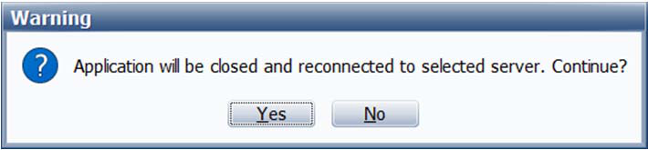

A warning message will pop up indicating that the application will be closed and reconnected to the
selected server. Make sure you save any changes you have made before closing the application. Upon
successful connection, you will now be operating the instance of *StarWatch SMS* hosted by the new
server.

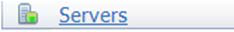

To return to the original server, re-open the *Server* window using the
icon and
connect to the original server.

## 7.0 CARD FORMATS

*Card Formats* define the internal structure of the cards being used on the system, including the number
of bits, the facility code, the technology being used, etc.

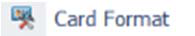

To launch this function, click on the
icon located on the *Identification* segment of the
*Admin* list on the left side of the screen.

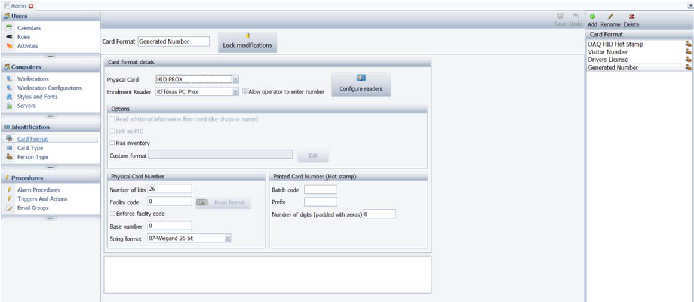

Note: all the card formats currently entered the system are listed by name.
Using the *Card Format* pane on the right side of the main screen, you can add, rename, delete or
select a role to view or modify.

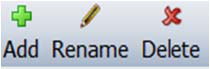

## 7.1 ADDING A CARD FORMAT

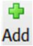

To add a new card format, click the
button at the top of the *Card Format* pane to the right of the
screen.

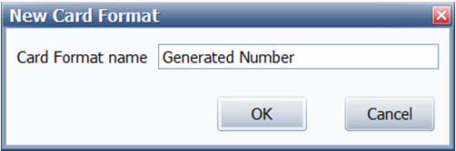

Type in a name for the card format and click the *OK* button. A new card format will be added to the
list.

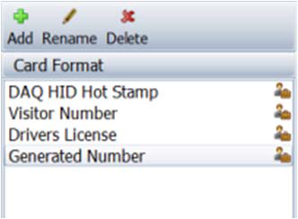

To change the name of the added card format, click in the *Card Format* name field in the top left of
the work area and type in a new name for the format.

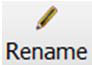

Alternately, you can select a card format in the list and click on the
button at the top of the
*Card Format* pane.

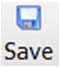

Once a new card format has been added, save your changes using
button in the upper right of the
work area. A pop-up screen will ask you to confirm the changes.

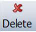

You can remove a format from the list by selecting the appropriate row and clicking the
button.

## 7.2 SELECTING AN EXISTING CARD FORMAT

To modify the parameters of an existing card format, you must first call it to the screen by selecting it
from the list in the *Card Format* pane.

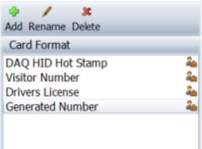

Once selected, the format name will appear in the *Card Format* name field and any associated settings
will be displayed in the work area.

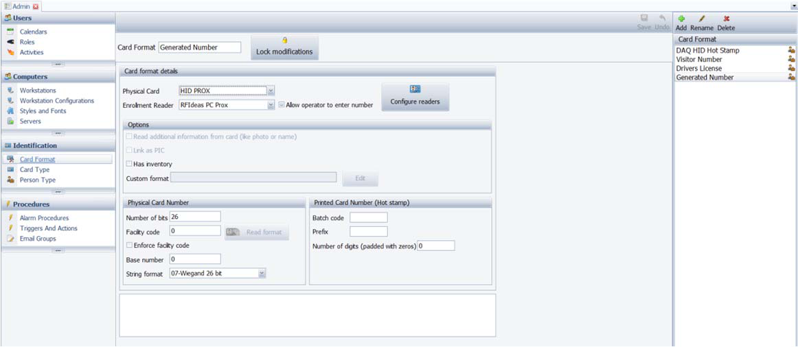

## 7.3 MODIFYING CARD FORMATS

Once the appropriate card format has been called to the screen, you can edit all parameters that will
be associated with the card using the *Card Format* area.

## 7.3.1 CARD FORMAT DETAILS

In the *Card Format Details* area, select a *Physical Card* option and an *Enrollment Reader* option from
the corresponding drop-down lists.
The *Physical Card* menu provides a library of the physical card technologies and formats currently
supported by *StarWatch SMS*.

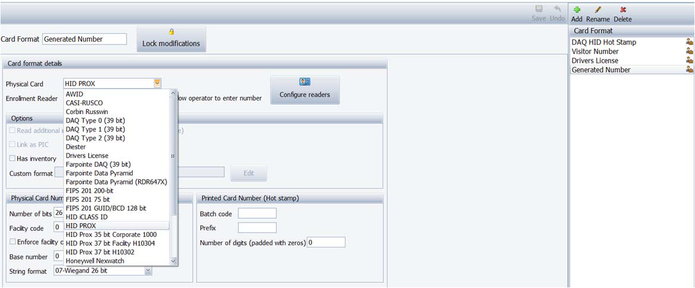

The *Enrollment Reader* list is populated by the readers supported by *StarWatch SMS* for the physical
card that has been selected.

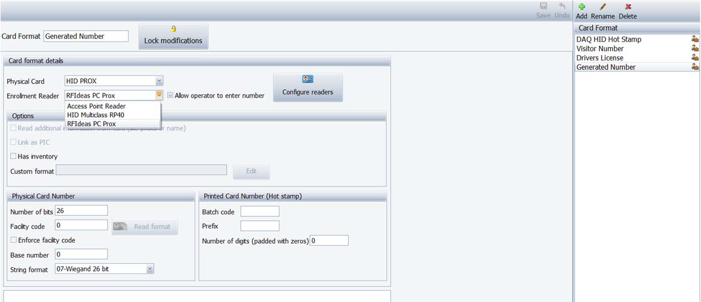

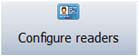

Once the enrollment reader has been selected, click the
icon to configure the reader. The
*Reader Configuration* pop-up window allows you to define which workstations have an enrollment
reader connected to them and how the reader can be used.

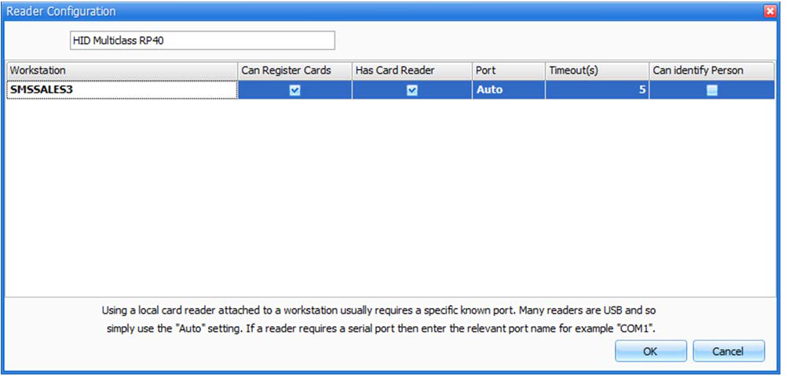


Can Register Cards
Check this box if the workstation can register this type of card.

Has Card Reader
Check this box if an enrollment reader is connected to this workstation.

Port
Using a local card reader attached to a workstation usually requires a specific known port.
Many readers are USB and simply use the *Auto* setting. If a reader requires a serial port, enter
the relevant port name, for example “COM1”.

Timeout(s)
This setting indicates the timeout for card presentation. The five second default is typically
used for most applications.

Can Identify Person
This box is checked if a workstation has an enrollment reader that can be used to call up the
information associated with a person by presenting their card.

## 7.3.2 OPTIONS

For certain card formats, such as a Government issued CAC card, there may be information that can be
taken from the card at the time of enrollment. When an individual CAC card is being enrolled into the
system and is presented to an enrollment reader, other details from the card are also read into the
*StarWatch SMS* database.

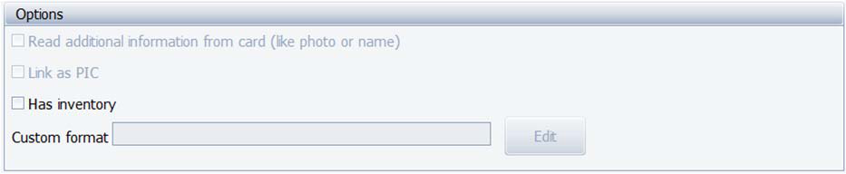

Note: at present, the *Link as PIC* and *Has Inventory* features are not supported and should not be
selected.

## 7.3.3 PHYSICAL CARD NUMBER

In the *Physical Card Number* area, you can enter parameters such as number of bits, facility code, base
number, and string format.

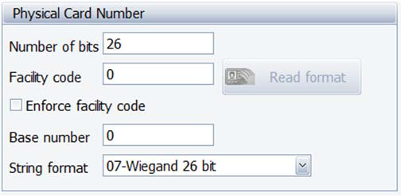

## 7.3.4 PRINTED CARD NUMBER

In the *Printed Card Number* area, you can enter parameters such as batch code, prefix, and number of
digits.

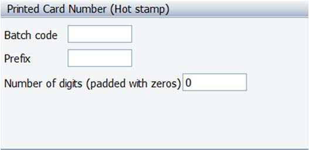

## 8.0 CARD TYPES

The *Card Types* function represents a combination of the *Card Format* being utilized, the physical
appearance of the printed card, and the process and workflow for how cards are issued and handled in
the system. For example, an administrator might use only a single card format in the system (ex. 37-bit
Wiegand), but print different color backgrounds on the credentials to represent a full time employee
vs. a contractor. Employee cards and contractor cards would be designated as two different card types
within *StarWatch SMS*. Using the *Card Type* function, you can define the various types of access cards
that will be available for system operators as they register personnel into the database and then assign
and issue them cards.

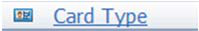

To launch this function, click on the
icon located on the *Identification* segment of
the *Admin* list on the left side of the screen.

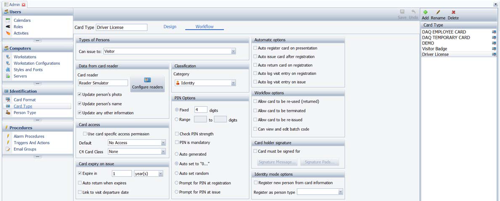

Note: all the card types currently entered the system are listed by name.

Using the *Card Type* pane on the right side of the main screen, you can add, rename, delete, or select
a card type to view or modify.

## 8.1 CREATING A NEW CARD TYPE

To add a new card type, click the
button at the top of the *Card Type* pane to the right of the
screen. The *New Type of Card* dialog box will ask you to enter the name of the new card type and to
select a visual card format. You will also have the option to create a new format first, before creating
a new card type.

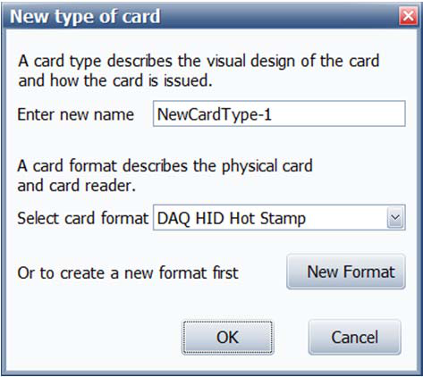

After filling in the appropriate fields, click the *OK* button. A new card type will be added to the list.

To change the name of the added card type, click in the *Card Type* name field in the top left of the
work area and type in a new name for the format.

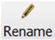

Alternately, you can select a card format in the list and click on the
button at the top of the
*Card Type* pane.

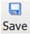

Once a new card type has been added, save your changes using the
button in the upper right of
the work area. A pop-up screen will ask you to confirm the changes.

You can remove a card type from the list by selecting the appropriate row and clicking the
button.

## 8.2 SELECTING AN EXISTING CARD TYPE

To modify the parameters of an existing card type, you must first call it to the screen by selecting it
from the list in the *Card Type* pane.

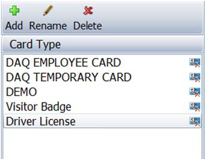

Once selected, the format name will appear in the *Card Type* name field and any associated settings
will be displayed in the work area.

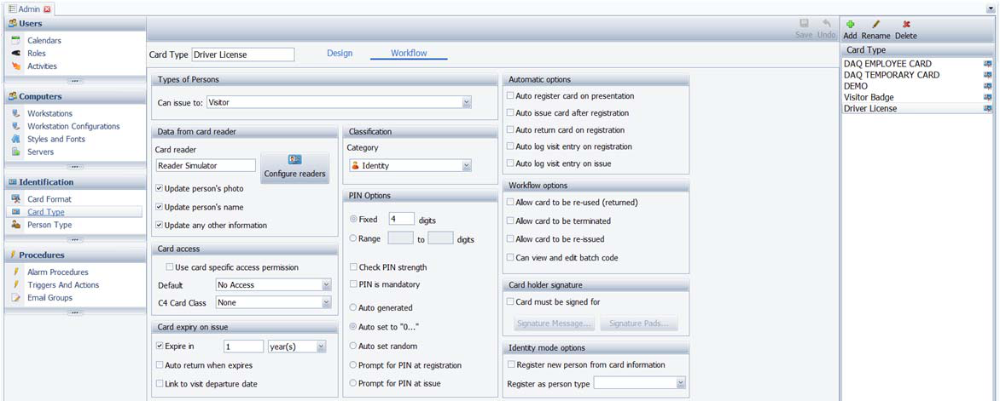

## 8.3 MODIFYING A CARD TYPE

Once the appropriate card type has been called to the screen, you can edit all parameters that will be
associated with the card type using the *Card Type* area.

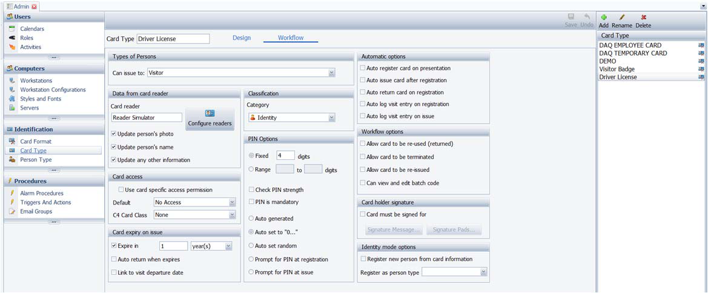

The *Card Type* work area consists of two tabs: *Design* and *Workflow*.

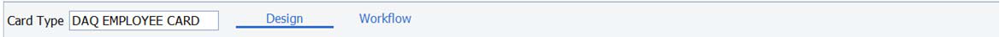

## 8.3.1 DESIGN

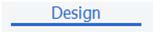

The
tab displays the card format that you have assigned to the card type. Also, for
properly licensed systems, you will be able to launch the badge designer application from this tab to
customize the visual design of the card type.

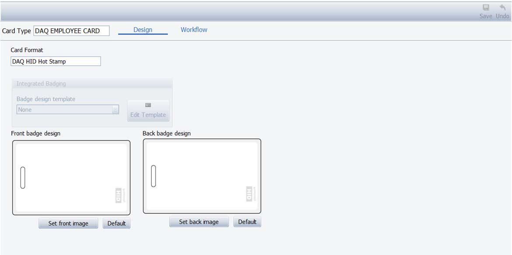

## 8.3.2 WORKFLOW

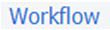

The
tab allows you to define features and options for how a specific card type will be
handled in the system. For example, certain card types may require a PIN while other may not. Or, a
visitor card type might be returnable and issued to a new visitor the following day, while an employee
card type might simply be retired and not issued again.

## Types of Persons

The *Types of Persons* area allows you to select the person types to which the selected card type can be
issued. For example, you might not allow an employee-related card type to be issued to a visitor.

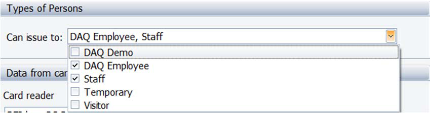

The card type will only be available to system operators when registering individuals that have been
assigned one of the person types selected from the list.

## Data from Card Reader

The *Data from Card Reader* parameter works in conjunction with the *Read Additional Information*
parameter from *Options* area of the *Card Format* feature. Using the settings in this area, you can
select the specific information you would like to read from a card during enrollment.

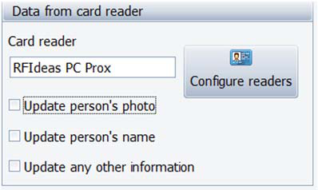

Clicking the *Configure Readers* button will call up the *Reader Configuration* window.

## Card Access

In the *Card Access* area, clicking the *Use card-specific access permission* checkbox allows you to select
a previously defined permission level from the *Default* drop-down list to act as the default access
permission for the current card type.

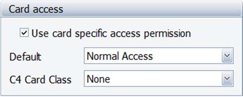

Note: while this setting will be used as a starting default for individuals being issued the current card
type, system operators will be able to change the permission level settings on a person by person basis.

The *C4 Card Class* parameter is only used in systems that are being migrated from *StarWatch C4* to
*StarWatch SMS* and should not be used otherwise.

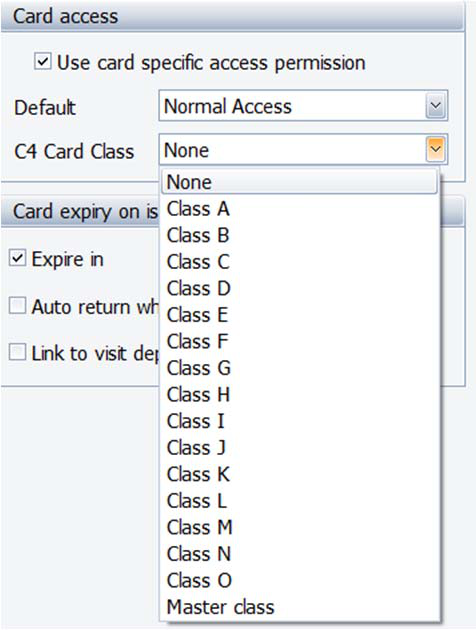

## Card Expiry on Issue

In the *Card Expiry on Issue* area, you can define the default expiration date used for all newly assigned
cards. Note: this expiration may be overridden at the time of card issuance.

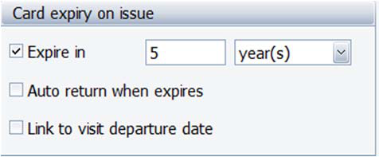

Selecting the *Auto return when expires* checkbox will automatically place the card back into card
inventory when it expires. Selecting the *Link to visit departure date* option will set a visitor card
expiration date matching the date that the individual is scheduled to end their visit.

## Classification

In the *Classification* area, you can set the classification of a card type by selecting a category from the
drop-down list.

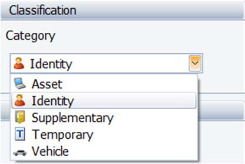

The majority of cards are considered *Identity* cards as they are given to individuals to control their
access throughout the facility. Other categories can be used for cards or tags that are used to track
objects or equipment.

## PIN Options

The *PIN Options* area enables you to define PIN (Personal Identification Number) settings for the
currently selected card type. If you would like PINs to be mandatory, select the *PIN is mandatory*
checkbox.

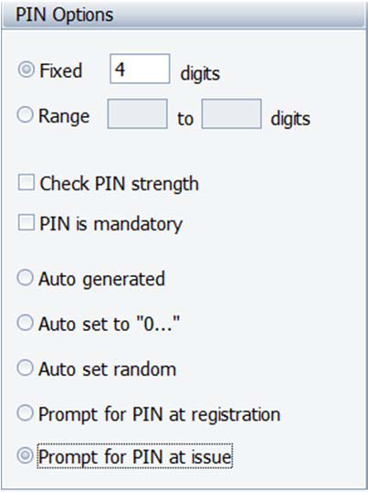

Using the *Fixed* field, you can set the exact number of digits required for the PIN. Alternately, you can
set a range for the number of digits required using the *Range* field.
Prior to card issuance, PINs can either be auto-generated or entered manually:

Auto generated
The system will create the PIN using the last digits of the card holder Social Security number.

Auto set to “0…”
The system will auto-set the PIN to the next number in a running sequence.

Auto set random
The system will auto-set the PIN using randomly selected numbers.


Prompt for PIN at registration
The system will prompt for PIN numbers at the time of registration. The operator will be
required to enter and confirm the PIN number for the specific card being issued using the *PIN*
*Required* dialog box.

Prompt for PIN at issue
The system will prompt for PIN numbers when the card is issued. The operator will be required
to enter and confirm the PIN number for the specific card being issued using the *PIN Required*
dialog box.

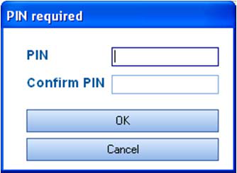

## Automatic Options

This *Automatic Options* area provides the flexibility to automate specific actions for the card type
selected.

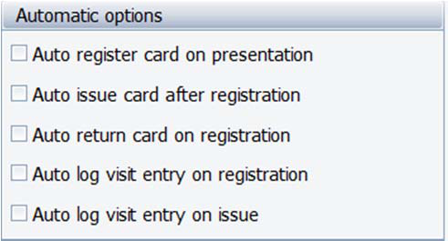

## Workflow Options

The *Workflow Options* area allows you to define settings for how a card will be handled once it has
expired. It also gives you the option to allow operators to view and edit the card batch code.

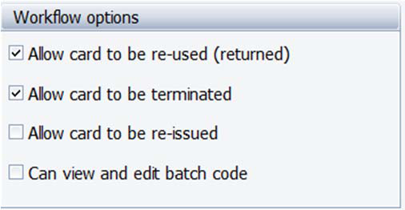

## Card Holder Signature

Selecting the *Card must be signed for* checkbox in the *Card Holder Signature* area designates that it is
necessary to provide a signature for the current card type. Note: this requires the integration of a
signature pad device with the system.

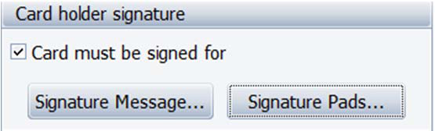

Clicking the *Signature Message* button will call up a pop-up window where you can enter the signature
agreement that will be displayed to individuals before they sign their name on the signature pad.

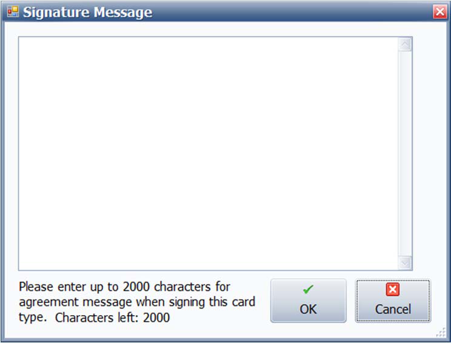

Clicking the *Signature Pads* button will open a window allowing you to choose a signature reader from a
drop-down list and indicate the workstations that have that option enabled.

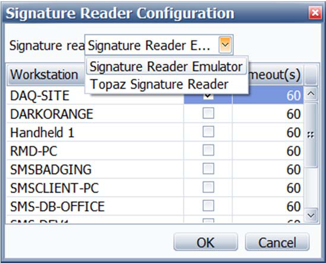

## Identity Mode Options

The *Identity Mode Options* area section provides the ability to register new person from card
information by checking off the box next to it.

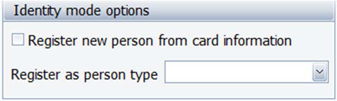

It also gives the option as to which person type a new person should be registered as when using this
card type.

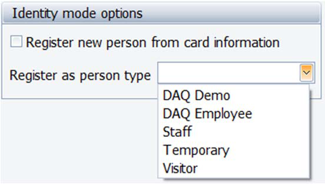

## 9.0 DEFINING PERSON TYPES

The *Person Types* function provides a mechanism for defining how different types of individuals are
handled in the system during registration and card issuance processes. This feature allows for the
customization of several parameters:

Information that must be captured about an individual

Approval processes that an individual must go through

Types of credentials that can be issued to an individual
For example, you may want to set up specific person types for employees, visitors, and contractors,
each with different setup requirements. The configuration selections made for each of these types
using the *Person Type* sub tabs will be directly reflected in the profile windows used by system
operators during the registration process.

To launch this function, click on the
icon located on the *Identification* segment of
the *Admin* list on the left side of the screen.

Note: all the person types currently entered the system are listed by name.

Using the *Person Type* pane on the right side of the main screen, you can add, rename, delete or select
a person type to view or modify.

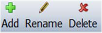

## 9.1 CREATING A NEW PERSON TYPE

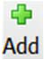

To add a new person type, click the
button at the top of the *Person Type* pane to the right of the
screen. The *New Person Type* dialog box will ask you to enter the name of the new person type.

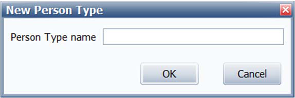

After filling in a name, click the *OK* button and the new person type will be added to the list.

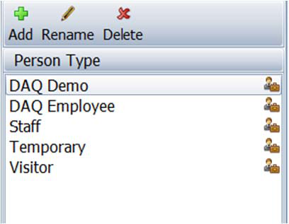

To change the name of the added person type, click in the *Person Type* name field in the top left of
the work area and type in a new name for the person type.

Alternately, you can select a person type in the list and click on the
button at the top of the
*Person Type* pane.

Once a new person type has been added, save your changes using
button in the upper right of the
work area. A pop-up screen will ask you to confirm the changes.

You can remove a person type from the list by selecting the appropriate row and clicking the
button.

## 9.2 SELECTING AN EXISTING PERSON TYPE

To modify the parameters of an existing person type, you must first call it to the screen by selecting it
from the list in the *Person Type* pane.

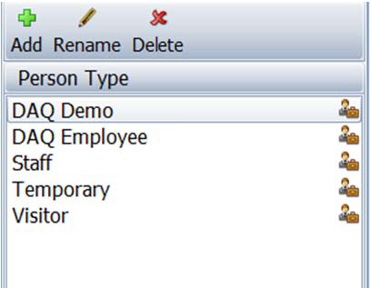

Once selected, the person type name will appear in the *Person Type* name field and any associated
settings will be displayed in the work area.

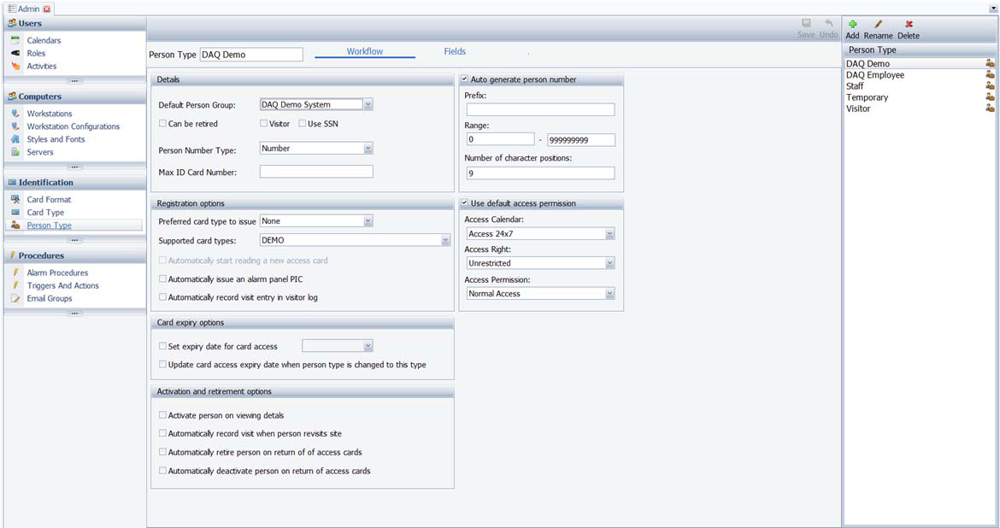

## 9.3 MODIFYING A PERSON TYPE

Once the appropriate person type has been called to the screen, you can edit all parameters that will
be associated with the person type using the *Person Type* area.

For each person type in the system, a wide range of details, such as person number, date of birth,
Social Security number, etc., are available for inclusion in user profiles.
Using the options on the *Person Details* tab, which can be selected at the bottom of the *Person Type*
workspace, you can select the information that will be included for each person type. For example,
you may want to require a more complex set of user details for those individuals that will be given the
access rights associated with an employee, but limit the number of details needed when registering
someone as a one-time visitor.
The *Person Details* section consists of two sub tabs: *Workflow* and *Fields*.

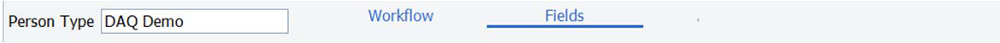

## 9.3.1 FIELDS

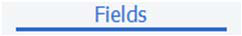

The
sub tab displays person type details in chart format.

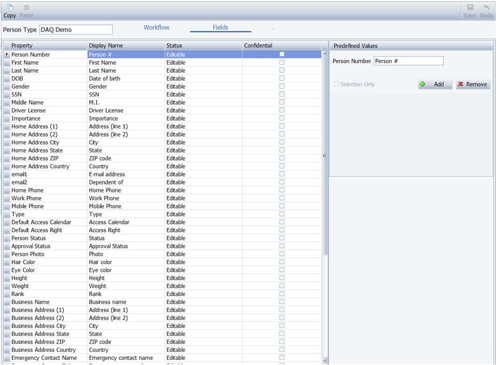

## Property Column

The *Property* column lists all the preset categories offered in the database. To provide flexibility, the
system provides several *Custom Field* categories that can be defined as needed.

## Display Name Column

The *Display Name* column lists how each category will be displayed to system operators. To change a
display name, click in the appropriate row in the column and edit the text. For example, you may want
the SSN property to be displayed to operators as “Social Security Number”.
Note: any changes made to display names, including custom fields, will be applied to all person types,
not just the currently selected type.

## Status Column

The *Status* column allows you to separately select the type of field that will be applied to each
property. To assign a field type, click in the appropriate row in the *Status* column and select an option
from the drop-down list provided.

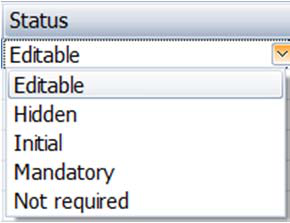


Editable
Properties set as *Editable* can be modified at any time before or after registration. This gives
the system operator the flexibility to update these properties if they change or to correct
errors. For example, you might want to designate properties that may change over time, such
as *Home Address* and *Work Phone*, to the *Editable* setting.

Hidden
Properties set as *Hidden* will not be displayed as detail parameters for the current person type
during the personnel registration process.


Initial
Properties set as *Initial* allow the system operator to edit the field only during the initial
registration process. Once an individual has been registered and accepted into the system
database, the property will no longer be editable. For example, you might want the *Person*
*Number* property to be permanently set at initial registration and not allow operators to reset
the number later. Properties set as *Initial* will also be mandatory fields.

Mandatory
Properties set as *Mandatory* must be defined before registration can be completed. For
example, you might want to designate *First Name*, *Last Name*, and *Gender* as required
properties. If an operator fails to fill in a mandatory field and attempts to register an

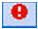

individual, a
symbol will appear next to the field forcing the operator to complete the field
before retrying.

Not Required
Properties set as *Not Required* will appear as grayed out fields and cannot be used by system
operators. Any property that you do not want to use as a part of your personnel database
should be designated as *Not Required*.

## Classified Column

The *Confidential* column allows you to restrict access to a property. As a default, properties set as
*Confidential* will appear on the screen as a grayed-out box.

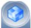

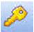

Using the *Confidential Fields*
function located on the *Start*
menu, only those operators with
appropriate rights will be able to view and edit these fields. For example, you might want the SSN
property to remain classified and grayed out during normal system operation.

## Predefined Values

This section is reserved for *Custom Fields*. It allows you to rename a custom field field and create
values and properties for that field that will appear as a drop-down menu when an operator is enrolling
and registering a new or existing person.

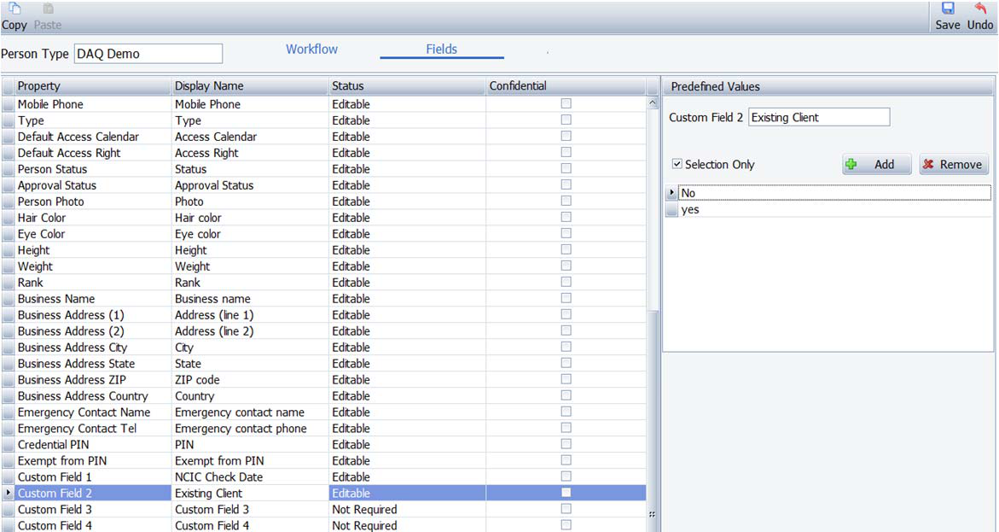

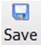

After making modification in the *Fields* sub tab, save your changes using the
button in the upper
right of the work area. A pop-up screen will ask you to confirm the changes.

## 9.3.2 WORKFLOW

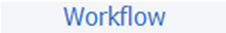

The
sub tab enables you to configure additional parameters related to the person
type.

## Details

Using the *Default Person Group* field in the *Details* area, you can select the person group that will be
used as a default for all personnel enrolled under the current person type. Person groups are created
for dividing and organizing personnel into subcategories and for access permissions.

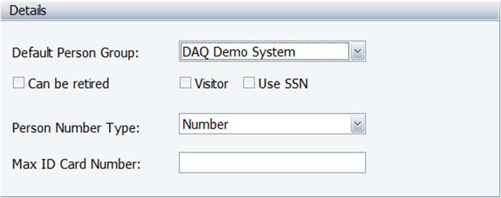

To change the default person group, select an option from the *Default Person Group* pull-down list.

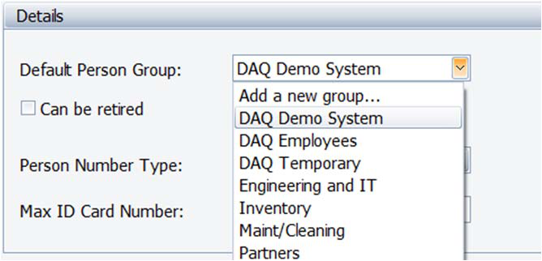

Note: while this setting will be used as a starting default for individuals registered under the current
person type, system operators will be able to change the person group setting on a person by person
basis. Also, individuals can be in more than one person group, so an operator may assign other person
groups in addition to the default group at the time of registration.

Using the *Person Number Type* parameter, you can define the type of person number that will be used
when registering individuals under the current person type. To change the number type, select an
option from the *Person Number Type* pull-down list.

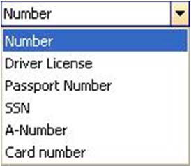

## Registration Options

Using the *Preferred card type to issue* parameter in the *Registration Options* area, you can select the
card type to use during registration for the current person type from the list of card types created
using the *Card Type* function.

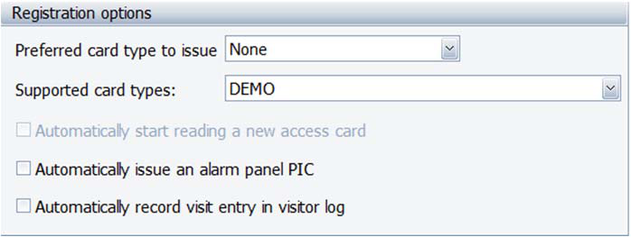

This will appear as the default card type when an operator enrolls individuals under that person type.

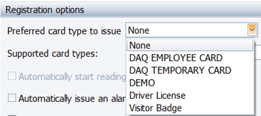

The *Supported Card Types* parameter allows you to select the card types that will be available to be
issued when enrolling a person of the current person type.

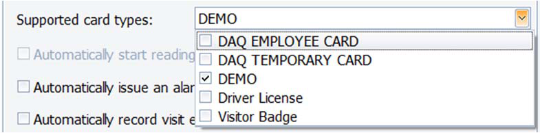

Select the *Automatically issue an alarm panel PIC* option if you wish to automatically assign a PIC
number to individuals of the current person type authorizing them to alarm/disarm a panel.
Selecting the *Automatically record visit entry in visitor log* option sets the system to keep a visit entry
log for the current person type.

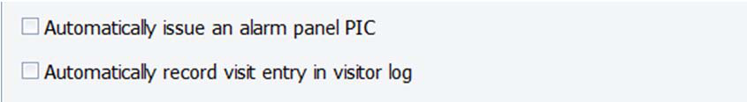

## Card Expiry Options

In the *Card Expiry Options* area, you can set a date for the card to expire. You have the option to set
the system to update the access expiry date if, for any reason, an individual under a different person
type is changed to the current person type and their access credentials need to be updated to reflect
new or existing expiry dates.
Note: setting the default card expiry for a person type overrides the default card expiration for a card
type.

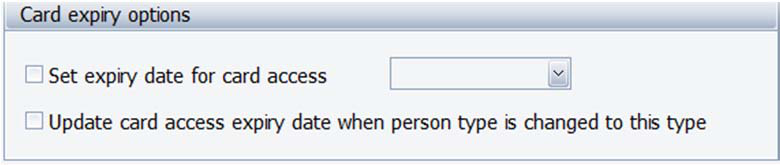

## Activation and Retirement Options

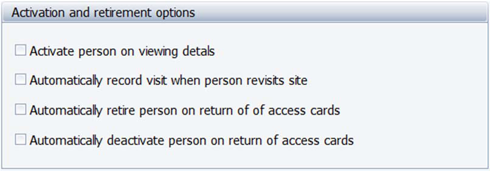

This area offers several useful shortcut settings that can be used in the *Person* workflow when you
always want a specific secondary action to take place when a primary action occurs.

## Auto Generate Person Number

In most personnel databases, all registered individuals will be assigned a unique person number. If you
would like the system to automatically generate this number sequentially for each new individual
registered into the system under the current person type, select the *Auto generate person number*
checkbox at the top of this area.
Note: the auto-generate feature will only function properly if you select the *Number* option from the
*Person Number Type* drop-down list in the *Details* area.

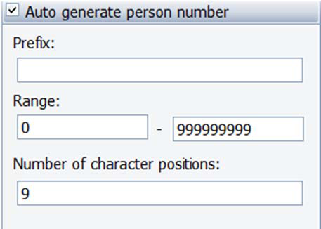


Prefix
The *Prefix* field allows you to set a series of characters that will appear before each person
number assigned. For example, you may want to assign all personnel under the “Visitors”
person type a person number with a “VIS” prefix. Employees might then be designated with the
“EMP” prefix, and so on.

Range
Using the *Range* parameter, you can set the number that will be used as a starting point when
assigning person numbers and the total number of person numbers available. For example, if
you set the first value field to “100”, the system will assign new numbers for this person type
starting from 100 (100, 101, 102, etc.). If you wanted the system to stop assigning numbers
once it reached 1000, you would set “1000” in the second value field.


Number of Characters
Using the Number of character positions field, you can set the number of characters used for
each person number. For example, if you set the starting Range as “100” and the Number of
character positions as 9, the system will assign numbers starting from 000000100 (000000100,
000000101, 000000102, etc.).

## Use Default Access Permission

The system also allows you to select the access permission that will be used as a default for all
personnel enrolled under a person type. Permissions dictate where individuals can go within a facility
and at what time of day. To change the default permission, select an option from the *Access*
*Permission* pull-down list.
Note: while this setting will be used as a starting default for individuals registered under the current
person type, system operators will be able to change the access permission settings on a person by
person basis.

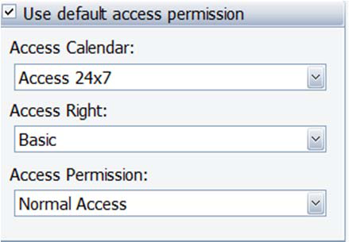

## Approvals

Using the options on the *Approvals* tab, which can be selected at the bottom of the *Person Type*
workspace, you can create a series of checkboxes that will be visible to system operators when
assigning a status level to a registered individual. For example, you may want to remind the operator
to check the photo ID of all individuals registered as contractors. This can be accomplished by creating
a “Check photo ID” checkbox.

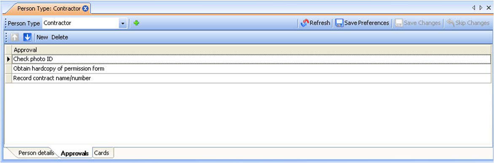

To create a new checkbox, click the
button at the top of the tab and type a message into the
newly added field. To edit an existing approval message, simply click on the appropriate message and
edit the text in the field.

You can navigate between existing messages by using the *Up*
and *Down*
buttons, or by clicking
directly on rows using your mouse.

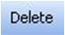

To delete a message, select the appropriate row and click the
button at the top of the tab.

The image below is an example of an operator status screen incorporating approval checkboxes:

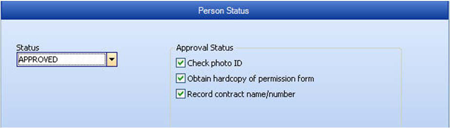

## 10.0 SETTING UP OPERATOR PROCEDURES

Using the *Alarm Procedures* function, you can define and manage procedure/instruction call-ups
related to events that may occur within the system. Operators will be shown these procedures only at
the appropriate time, such as when a specific sensor goes into the alarm state. This function enables
you to efficiently manage all TTPs (tactics, techniques, and procedures).
To function properly, procedures and instructions created in this section must be linked to objects and
devices using the *Device Management* feature or using the separate *Starwatch SMS Site Planner*
software package.

To launch this function, click on the
icon located on the *Procedures* segment of
the *Admin* list on the left side of the screen.

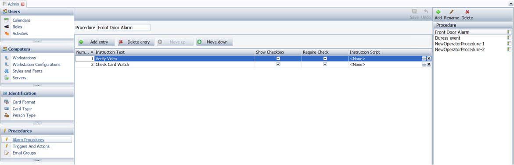

Note: all the procedures currently entered the system are listed by name.

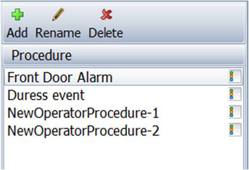

Using the *Procedures* pane on the right side of the main screen, you can add, rename, delete or select
a procedure to view or modify.

## 10.1 CREATING A NEW PROCEDURE

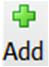

To add a new procedure, click the
button at the top of the *Procedure* pane to the right of the
screen. The *New Procedure* dialog box will ask you to enter the name of the new procedure.

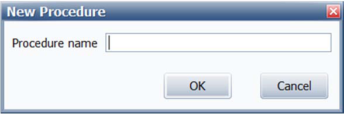

After filling in a name, click the *OK* button and the new procedure will be added to the list.

To change the name of the added procedure, click in the *Procedure* name field in the top left of the
work area and type in a new name for the procedure.

Alternately, you can select a procedure in the list and click on the
button at the top of the
*Procedure* pane.

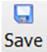

Once a new procedure has been added, save your changes using
button in the upper right of the
work area. A pop-up screen will ask you to confirm the changes.

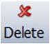

You can remove a procedure from the list by selecting the appropriate row and clicking the
button.

## 10.2 SELECTING AN EXISTING PROCEDURE

To modify the parameters of an existing procedure, you must first call it to the screen by selecting it
from the list in the *Procedure* pane.

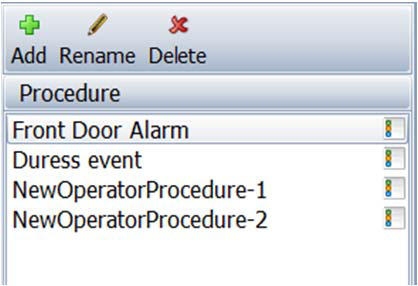

Once selected, the procedure name will appear in the *Procedure* name field and any associated
settings will be displayed in the work area.

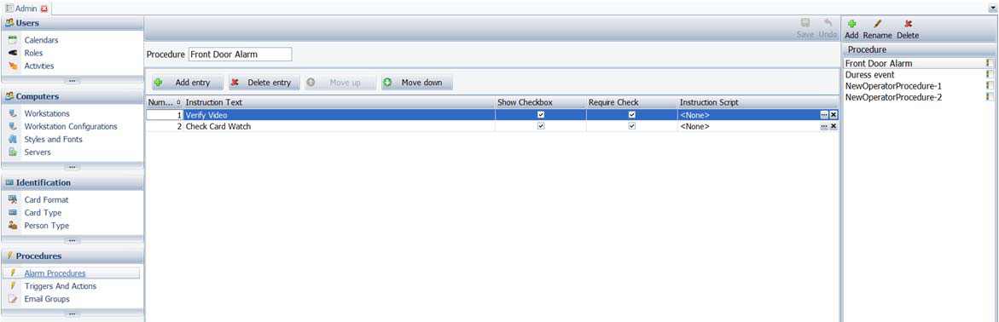

## 10.3 MODIFYING A PROCEDURE

Once the appropriate procedure has been called to the screen, you can edit all parameters that will be
associated with the procedure using the *Procedure* area.

Each procedure can contain one or multiple instructions, with each instruction occupying a row in the
on-screen table. When a procedure is presented to a system operator, the instructions will appear as a
step-by-step list.

To add a new row for an instruction, click on the
button at the top of the *Procedure*
area.

You can change the sequence of instructions by clicking on the
and
buttons.

Using the fields provided in the *Instruction Text* column, you can add written content for each
instruction. Instructions should be easy to follow steps that contain all required information, such as
phone numbers and other references, as required.

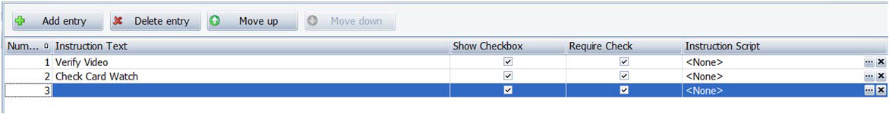

You can set each step in an instructions list to be accompanied by a checkbox. Checkboxes provide a
mechanism to help operators maintain on-screen confirmation that steps have been accomplished
before moving to the next step in the sequence. If you want a specific instruction line to appear with a
checkbox, select this option in the *Show Checkbox* column. If you want to require that an instruction
checkbox be selected before the operator can move to the next instruction, check this option in the
*Require Checkbox* column.

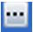

If you would like to add an Instruction script to any row you can click on the
icon in the *Instruction*
*Script* column. The *Instruction Property* dialog box allows you to modify the instruction type and title,
and add a URL link.

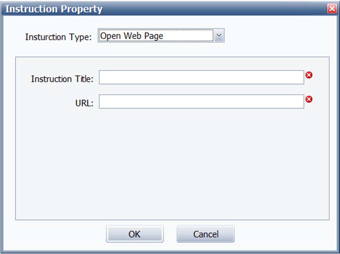

## 11.0 UTILIZING ACTIVITIES

By creating an *Activities* menu containing a list of your most commonly performed *Tasks*, you can group
system functions in a single place for easy viewing/access. The *Activities* function provides a useful
tool for managing the system and navigating through the multiple applications associated with common
activities without having to search for specific applications on a menu or toolbar. It is also a good way
to manage workstations when loading and logging into a specific activity.

To launch this function, click on the
icon located on the *Users* segment of the
*Admin* list on the left side of the screen.

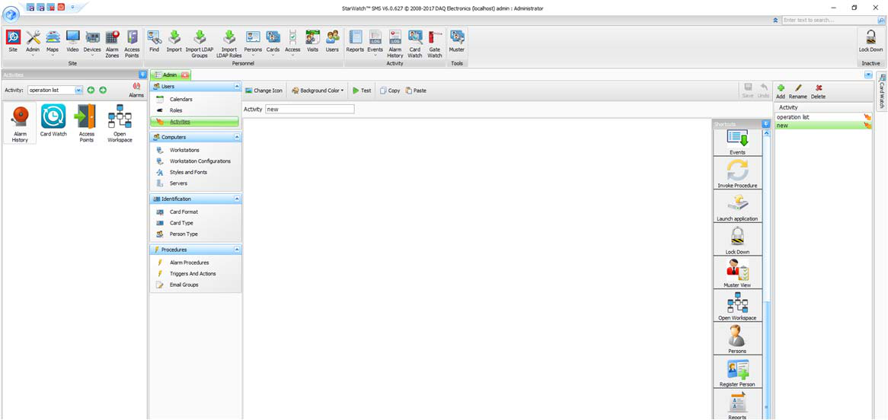

When working with an *Activities* menu you can:

Create a new *Activity* (list of *Tasks*)

Add *Task* shortcuts to an *Activity*

Modify or delete *Tasks* from an *Activity*

Change the icon associated with a *Task* procedure

Change the background color of the *Activity*

Delete an *Activity*

*Activities* are grouped into menus that provide customized *Task* shortcut lists that an operator/user
can quickly access from the screen. Each shortcut can be customized to visually reflect the *Task* being
completed and to open applications that need to be accessed to complete associated steps. You can
expand the *Tasks* related to an activity in the workspace to view the various options that can be set
and customized.
For example, when you place the *Credentials Manager* shortcut on an *Activity*, you have the option to
set the view to a specific *Person Group*, such as *Visitors*, if you do not want to see all groups.
*Activities* are created using the *Activity* pane on the right side of the main screen. You can *Add*,
*Rename*, or *Delete* an *Activity*, or select an *Activity* to view or modify.

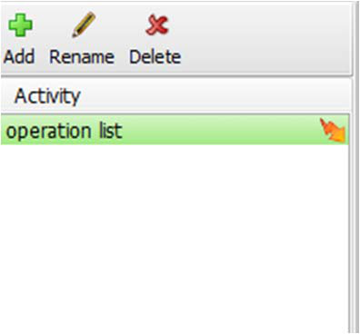

## 11.1 CREATING A NEW ACTIVITY

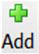

To create a new *Activity*, click on the
button at the top of the *Activity* pane.

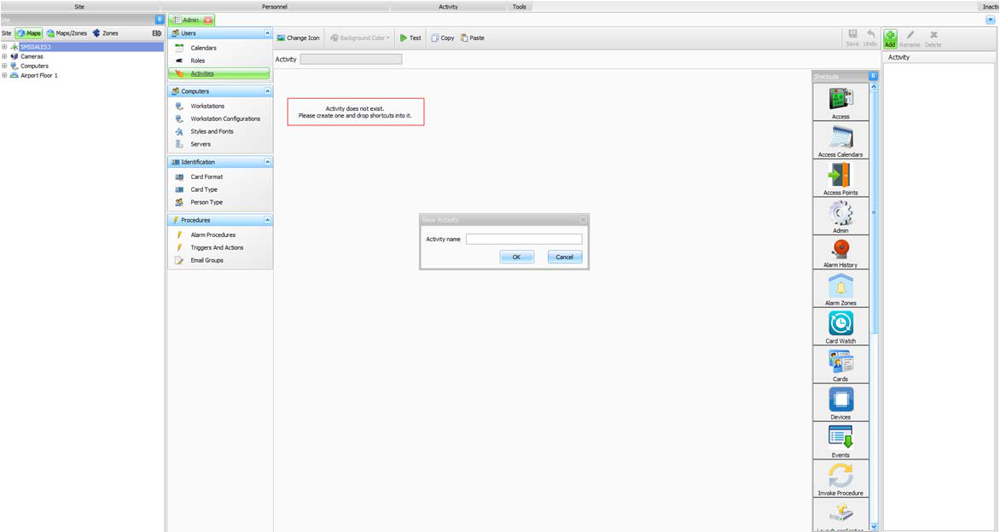

A new *Activity* will be added to the list with an auto-numbered name.

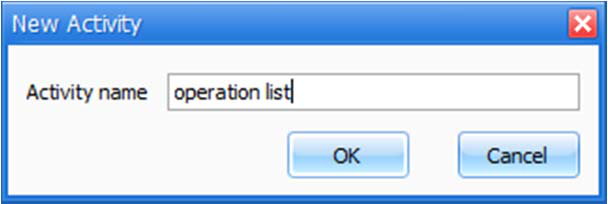

In the *New Activity* pop-up box, type in a new name for the *Activity* (ex. Registration, Operation, etc.)
and then click the *OK* button.

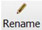

To change the name of an added *Activity*, select it in the *Activity* list and click the
button at the
top right side of the pane. In the *Rename Activity* pop-up box, type in a new name for the *Activity* and
then click the *OK* button.

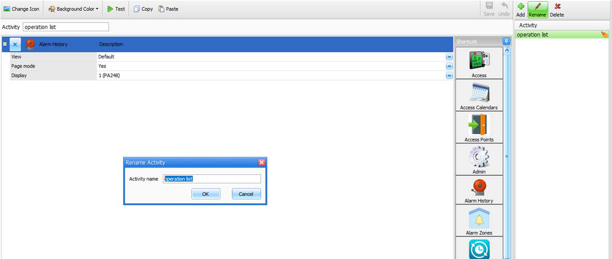

Alternately, you can enter a new name directly into the *Activity* name field in the top left of the work
area.

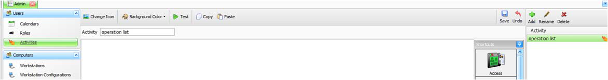

In either case, click the
button after entering the new name to complete the change.

## 11.2 ADDING TASK SHORTCUTS TO AN ACTIVITY

To add *Task* shortcuts to an *Activity*, select the appropriate name in the *Activity* list.

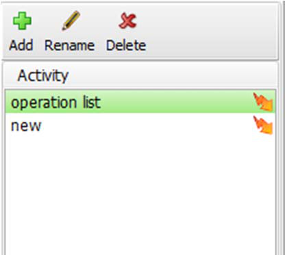

Next, simply drag and drop *Task* shortcuts from the available drop-down menu that appears to the left
of the *Activity* list into the main workspace.

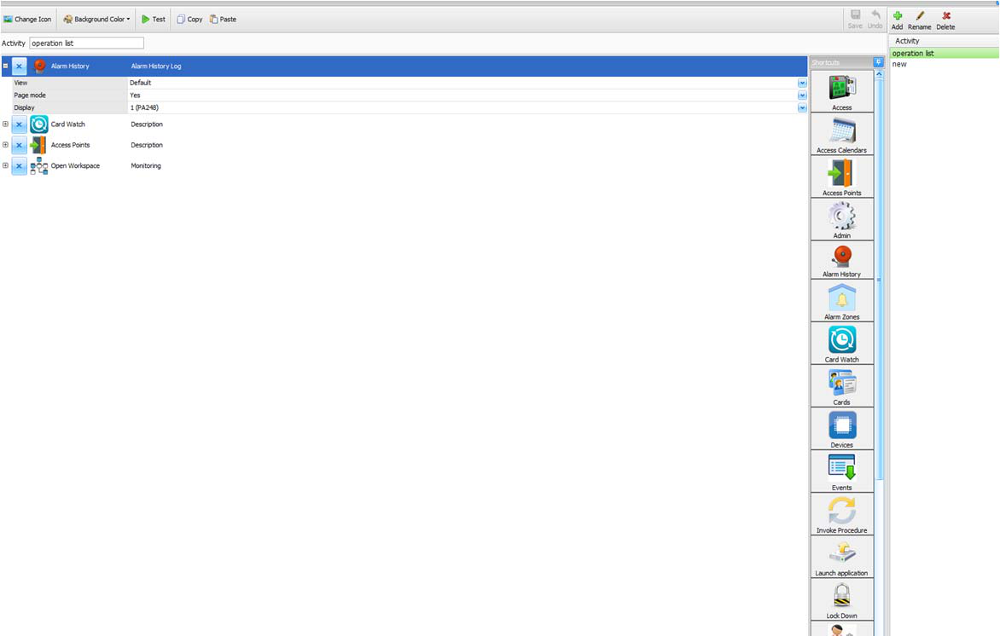

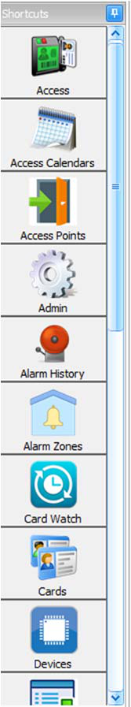

As you drag and drop *Task* shortcuts into the *Activity*, the workspace will become populated with
associated names and descriptions.

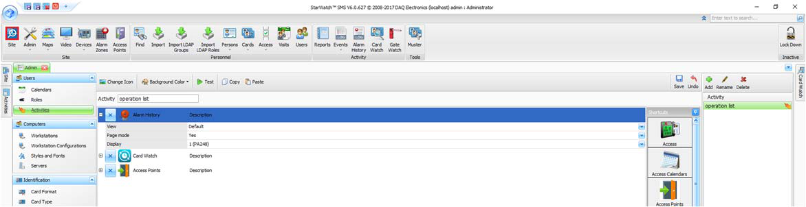

Note: you can change the order of the *Task* shortcuts in the main workspace by clicking on an icon and
dragging it up and down to the desired place in the displayed tree.

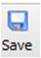

Click the
button to save your changes.

## 11.3 MODIFYING THE PROPERTIES OF A TASK

Each *Task* provides different parameters/options that the user can select and customize to their
preference. In most cases, these parameters relate to how the screen view will be uploaded once the
specific *Task* is called up from the shortcut icons.

What view the *Task* should be opened in

Which options for the application launched by the *Task* should be enabled or disabled

What display should the *Task* launch on

Should the *Task* launch in *Page* mode or replace what is on the screen (*Page* mode creates a
single page pop-up of the *Task* which can be utilized and then closed, returning the user to the
previous screen)
Some *Tasks* will provide more parameters than others. To view the parameters for a specific *Task*, click

the plus
icon next to it on the screen.

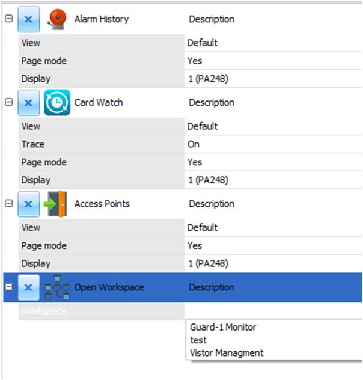

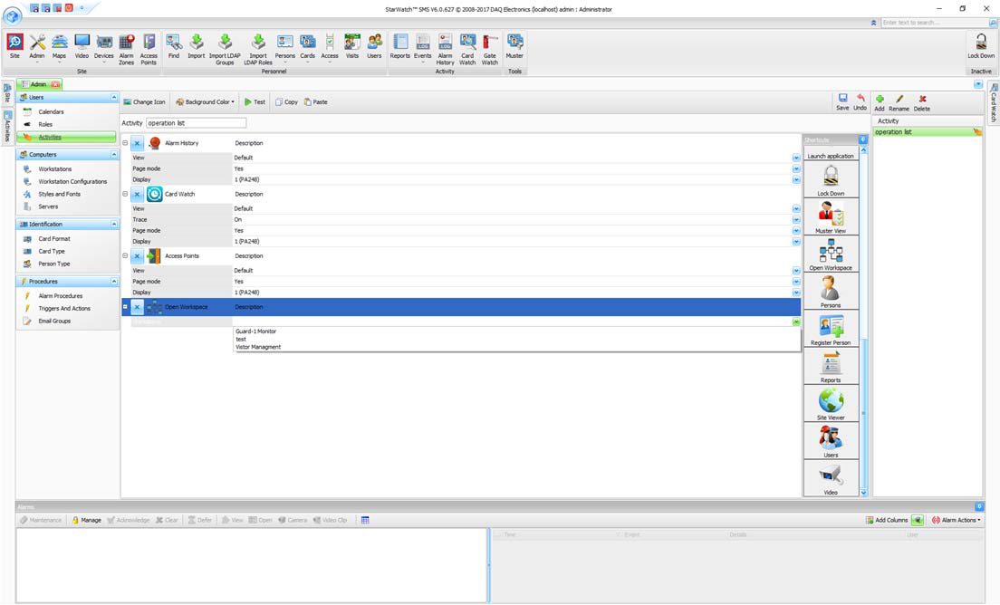

## 11.3.1 CHANGING DESCRIPTIONS/OPTIONS FOR A TASK

Once the descriptions and/or options associated with a *Task* are displayed in the main workspace, you
can make any required changes.

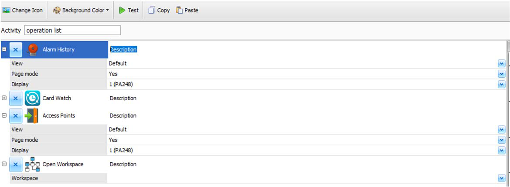

To modify the description of a *Task*, click in the description field associated with that *Task* and type a
new description. You can also make changes to other provided settings either by selecting from a drop-
down list or by typing the desired value into the available field.

To ensure that the settings you have selected are correct, you can use the *Test* feature.

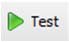

With a *Task* selected in the list, click the
button at the top of the workspace.

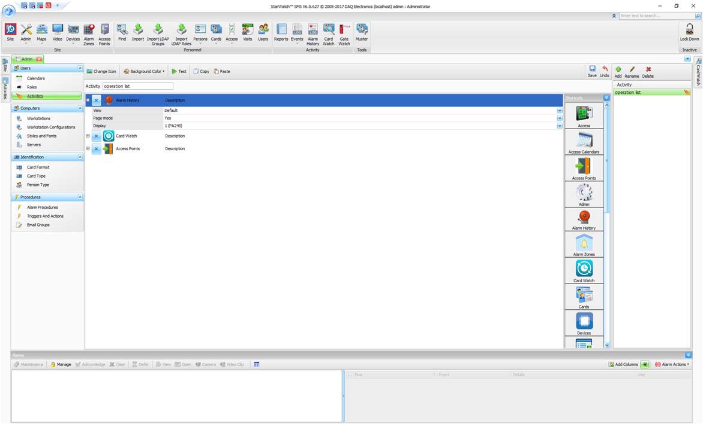

The application associated with the *Task* will launch as it will to an operator.

Click the
button to save your changes.

## 11.3.2 MODIFYING SHORTCUT ICONS

Once the list of *Tasks* associated with an *Activity* is displayed in the main workspace, you can make
changes to the shortcut icons used to launch the *Tasks*.
First, highlight a *Task* by single-clicking on it in the list.

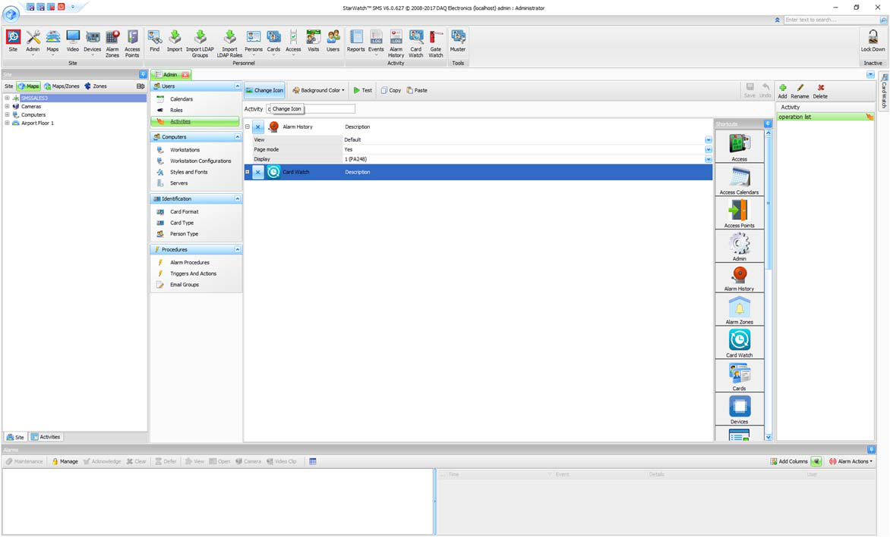

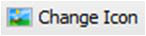

With the *Task* highlighted, click the
button at the top left of the workspace. This will call
up a window displaying all of the icons available for use.

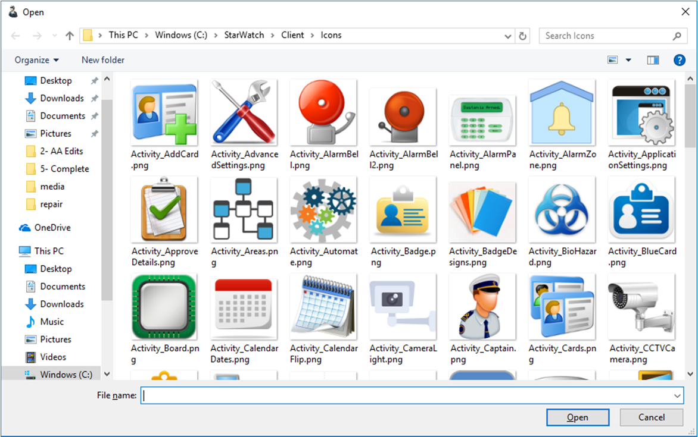

Next, browse through the list, select a new icon and click the *Open* button. The newly selected icon
will now be displayed and associated with the *Task*.

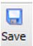

Click the
button to save your changes.

To view how the *Task* list icons will be displayed to a *StarWatch SMS* operator when they pull up an
*Activity*, you can utilize the *Activities* display window at the left side of the screen. You can change
the displayed *Activity* using the drop-down list provided.

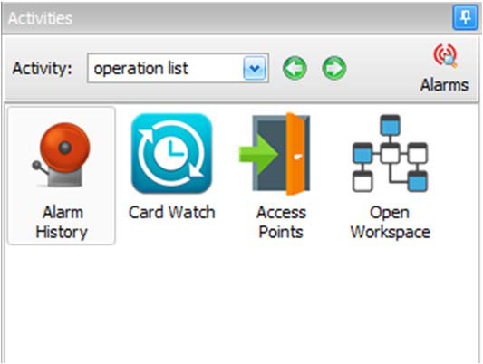

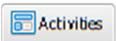

Note: if this window is not currently shown on your screen, click the side
button along the
far left edge of the screen. To make it permanent, *Pin* it to the workspace.

## 11.3.3 CHANGING THE BACKGROUND COLOR OF AN ACTIVITY TASK DISPLAY

You can change the background color of a *Task* list for an *Activity* as it will appear to the system
operator. First, select the *Activity* that you would like to modify in the *Activities* list.

Alternately, you can select the *Activity* using the drop-down list provided in the *Activities* display
window at the left side of the screen.

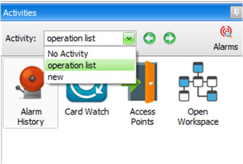

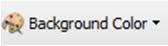

Next, click the
button at the top of the workspace and select a theme color using the
tools provided.

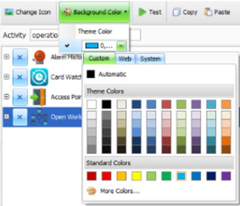

Once selected, the new background color will be shown in the *Activities* display window at the left side
of the screen.

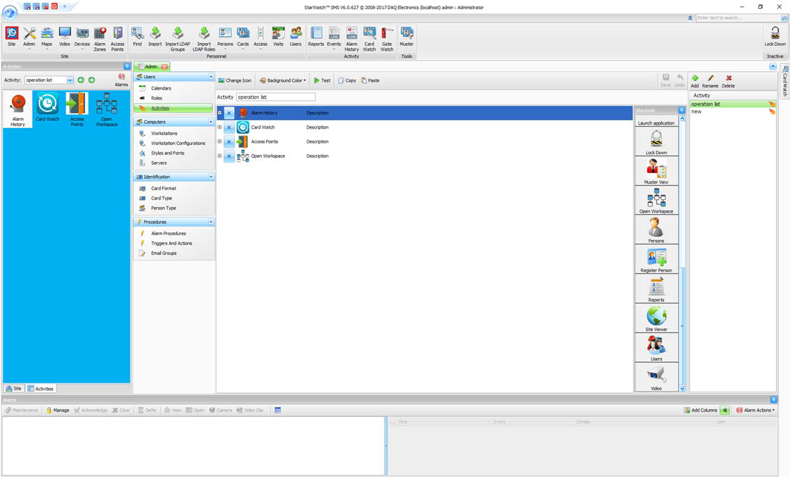

Click the
button to save your changes.

## 11.4 COPYING TASK SHORTCUTS

Using copy and paste functionality, you can copy one or multiple *Task* shortcuts from an *Activity* and
paste them into another *Activity*.
First, select the *Task* shortcuts you would like to copy by clicking on them in the workspace. To select
multiple *Tasks*, hold the *Ctrl* button on your keyboard as you left-click on *Task* rows in the list. Holding
the *Shift* button and left-clicking on any row will select all of the *Tasks*.

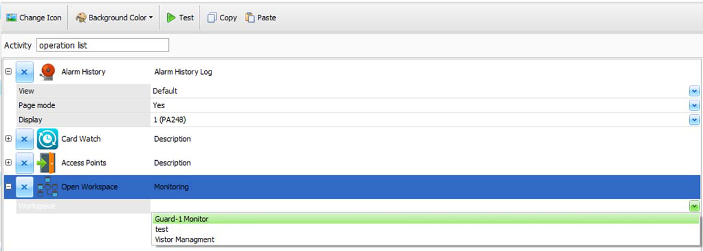

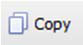

With the desired *Task* shortcuts selected, click the
button at the top of the workspace.
Next, select the *Activity* where you would like to paste the copied *Task* shortcuts from the *Activity* list.

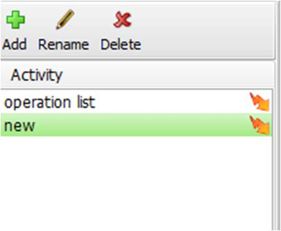

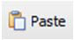

With the new *Activity* opened in the workspace, click the
button at the top of the workspace.
The copied *Task* shortcuts will be pasted into the *Activity*.
Note: you can change the order of the *Task* shortcuts in the main workspace by clicking on an icon and
dragging it up and down to the desired place in the displayed tree.

## 11.5 DELETING AN EXISTING ACTIVITY

To permanently remove an *Activity*, select it in the *Activity* list.

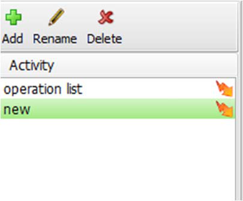

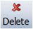

Next, click the
button at the top of the *Activity* pane. A pop-up screen will appear asking you to
confirm that you want to delete the selected *Activity*. Click the *Yes* button to proceed.

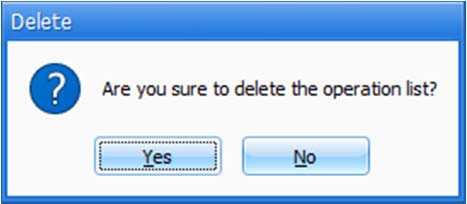

Click the
button to save your changes.

## 12.0 WORKING WITH TRIGGERS AND ACTIONS

The *Triggers and Actions* function enables you to configure the system to run a predefined series of
*Actions*, such as locking a specific door or closing a *Workstation*, as part of a single procedure. In
general, these groups of *Actions* can be initiated in two ways:

Manually via *Workflow* procedures – the system operator uses the *Activities* menu to call up
and launch the procedure

Automatically via *Automation* procedures – the procedure is executed via a specified trigger or
scheduled calendar event

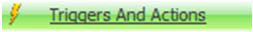

To launch this function, click on the
icon located on the *Procedures* segment of
the *Admin* list on the left side of the screen.

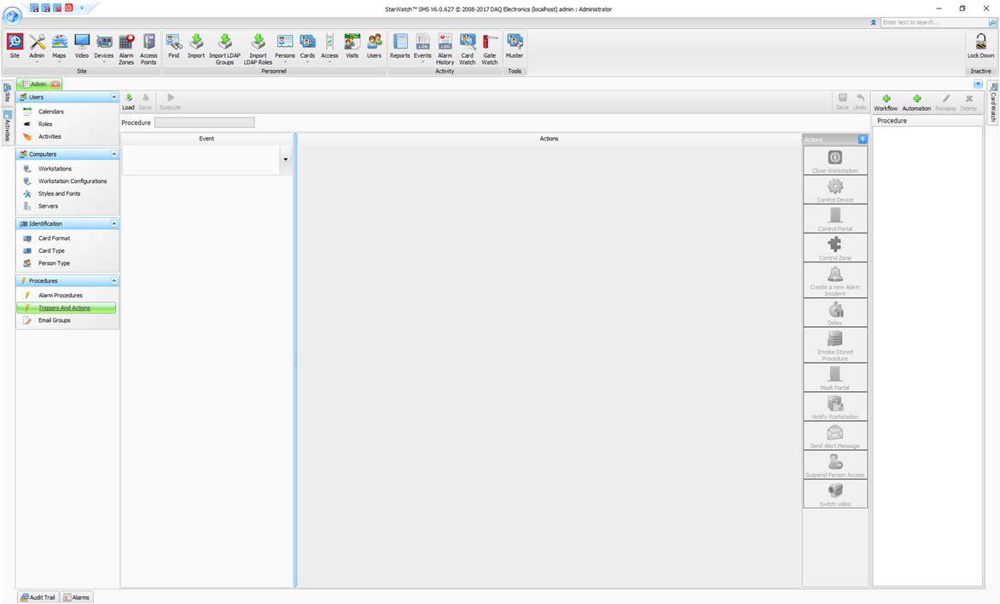

From the *Triggers and Actions* workspace, you can create or edit either a *Workflow* procedure or an
*Automation* procedure.
Note: once added to the list in the *Procedure* pane to the right of the screen, *Workflow* procedures will

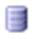

be indicated by the
icon, while *Automation* procedures are indicated by the
icon.

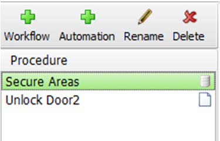

## 12.1 CREATING A WORKFLOW PROCEDURE

A *Workflow* procedure is used to automate a number of actions into one process, which is then
manually run by the operator via call up from the *Activities* menu.

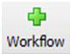

To create a new *Workflow* procedure, click on the
button at the top of the *Procedure* pane to
the right of the screen.

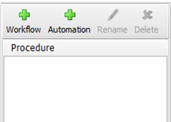

In the *New Procedure* pop-up window, type in a name for the procedure and click the *OK* button.

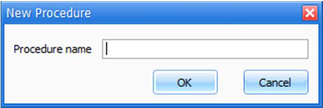

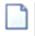

A new procedure will be added to the list in the *Procedure* pane. The
icon indicates that the
procedure is a *Workflow* procedure.

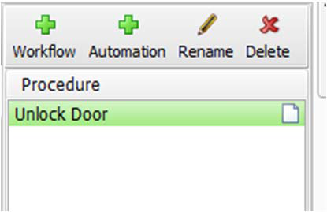

Note: New *Workflow* procedures do not contain any actions and cannot yet be used.
Note: In the main workspace, the system designates *No Event or Trigger* as the default *Event* for the
new *Workflow* procedure. Unlike *Automation* procedures, which need some type of *Event* to function
properly, *Workflow* procedures do not use the *Event* parameter. This field should be left on the default
setting for all added *Workflow* procedures.

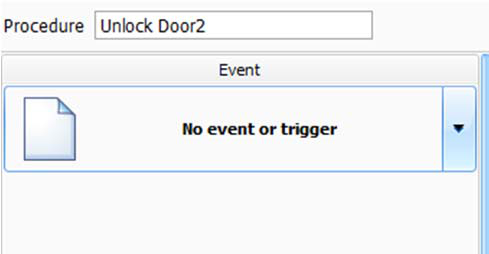

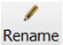

To change the name of a *Workflow* procedure, select it in the *Procedure* list and click the
button at the top right side of the pane. In the *Rename Procedure* pop-up box, type in a new name for
the procedure and then click the *OK* button.

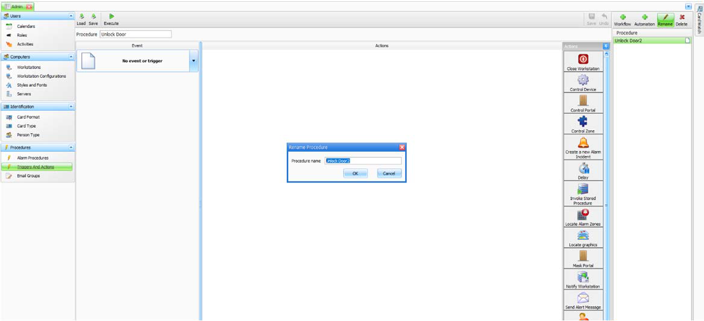

Alternately, you can enter a new name directly into the *Procedure* name field in the top left of the
work area.

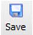

In either case, click the
button after entering the new name to complete the change.

## 12.2 ADDING ACTIONS TO A WORKFLOW PROCEDURE

Once you have added a *Workflow* procedure, you can add *Actions* that will be executed when the
procedure is run. To add *Actions* to a *Workflow* procedure, select the appropriate name in the
*Procedures* list.

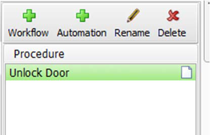

Next, simply drag and drop *Action* shortcuts from the available icons that appear to the left of the
*Procedures* list into the main workspace.

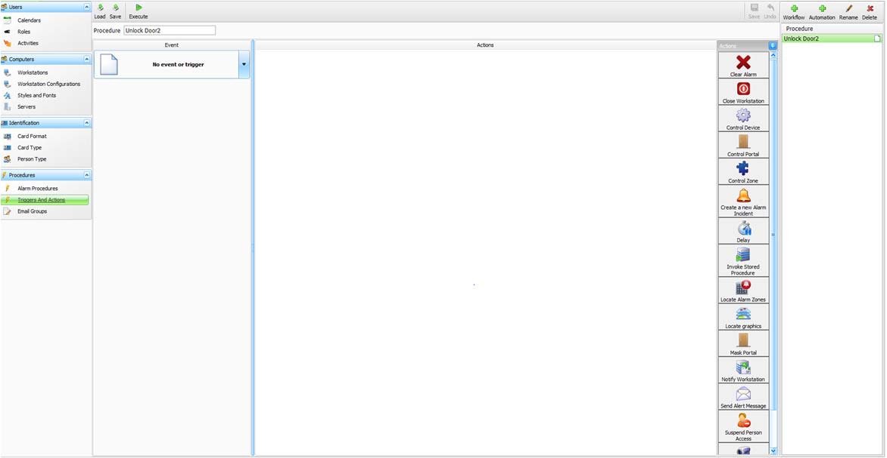

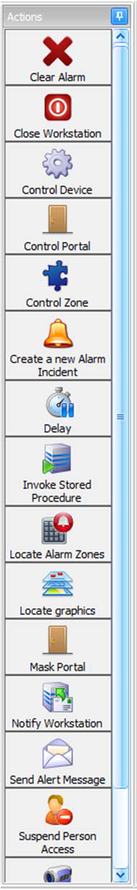

As you drag and drop *Actions* into the procedure, the workspace will become populated with associated
names and parameters.

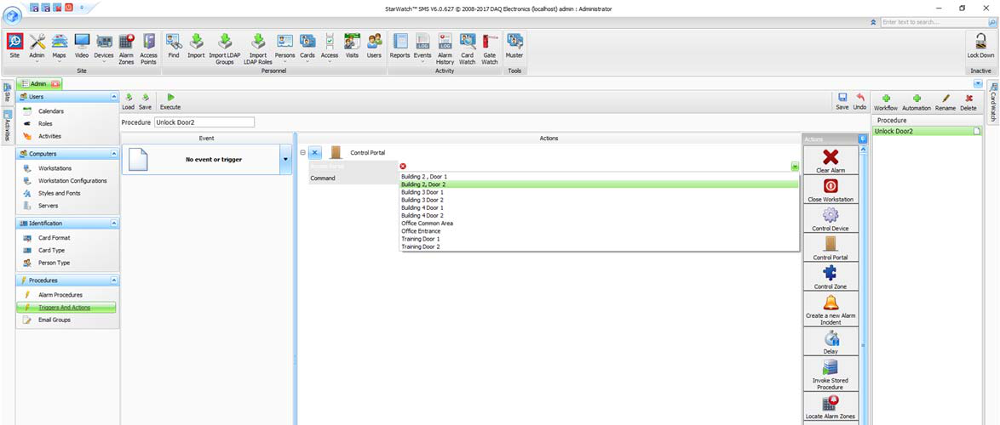

Note: you can change the order of the *Actions* in the main workspace by clicking on an icon and
dragging it up and down to the desired place in the displayed tree.

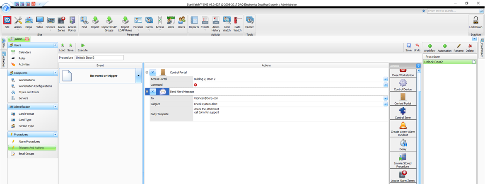

The following table outlines the available *Actions* for a *Workflow* procedure.
**Name**
**Icon**
**Description**

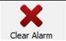

Clear Alarm
This  will  clear  the  *Alarm*  currently  selected  in  the  operator
workspace.
Close Workstation

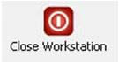

This will close or log the user out of the specified *Workstation*.

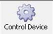

Control Device
This  will  perform  the  specified  action  on  the  selected  alarm
*Device*.  The  available  actions  are  different  depending  on  the
selected *Device*.

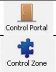

Control Portal
This specifies what action will execute on a specified *Portal*.
Control Zone
This will execute the specified action in the specified *Zone*.
Create a New

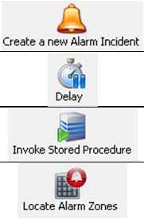

This will create a new *Alarm* incident.
Alarm Incident
Delay
This will delay an *Action* for the specified amount of time.
Invoke Stored
This will invoke a *Procedure* that is stored on the system hard
Procedure
drive.
This will locate in which *Zone* the alarm is occurring.
Locate Alarm
Zones

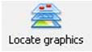

This  will  open  the  *Graphics*  and  highlight  where  the  alarm  is
Locate Graphics
occurring.

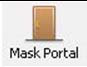

Mask Portal
This will mask the portal alarms and information from the
operator.

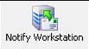

This will send a text message to the specified *Workstation* with
Notify
Workstation
the specified note.

Send Alert
This will e‐mail an alert message to the specified recipients. You
Message
can also specify the body of the message.

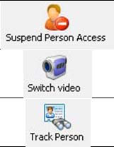

This will suspend the access of the specified *Person*.
Suspend Person
Access
Switch Video
This will switch the video from one camera to another.
This will track the specified *Person*.
Track Person

Depending on which *Actions* have been added to the *Workflow* procedure, there may be associated
parameters that can be edited to your preference. For example, *Send Alert Message* allows you to
define the address and content for an e-mail alert message, while *Control Portal* allows you to define
the specific *Portal* that will be associated and the *Action* that will be taken.

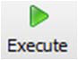

Note: To run the *Actions* associated with the current procedure for testing purposes, click the
button at the top left of the *Procedures* workspace. The *Actions* will be immediately executed.

Click the
button to save your changes.

## 12.3 DELETING A WORKFLOW PROCEDURE

To delete a *Workflow* procedure, select it in the *Procedure* list at the right of the screen.

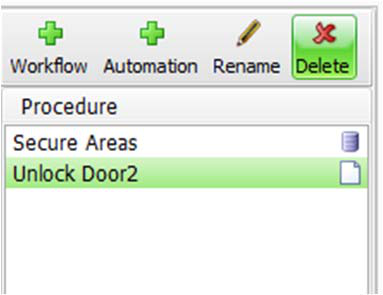

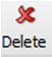

With the procedure highlighted, click the
button.

A pop-up screen will appear asking you to confirm that you want to delete the selected procedure.
Click the *Yes* button to proceed.

## 12.4 CREATING AN AUTOMATION PROCEDURE

An *Automation* procedure is similar to a *Workflow* procedure, but instead of being manually executed
by a system operator, it is automatically executed via a specified trigger or scheduled calendar event.

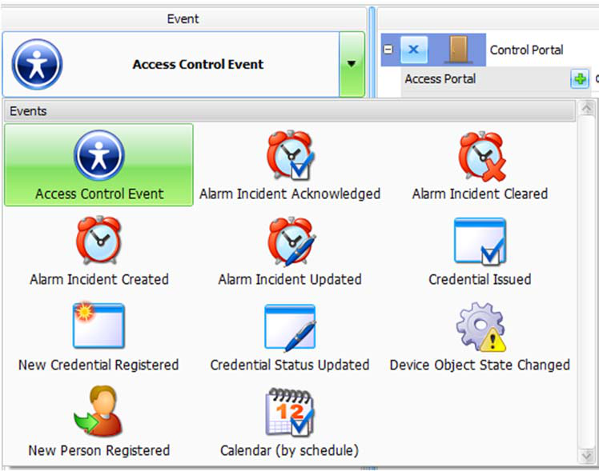

Note: Since all *Automation* procedures are initiated by triggers/events, the user is required to select
an *Event* and create associated *Conditions* for each procedure added.

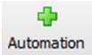

To create a new *Automation* procedure, click on the
button at the top of the *Procedure* pane
to the right of the screen.

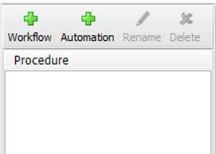

In the *New Procedure* pop-up window, type in a name for the procedure and click the *OK* button.

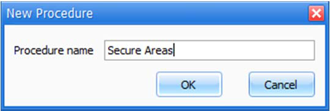

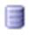

A new procedure will be added to the list in the *Procedure* pane. The
icon indicates that the
procedure is an *Automation* procedure.

Note: The default *Event* for an added *Automation* procedure is *Calendar (by schedule)*.

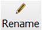

To change the name of an *Automation* procedure, select it in the *Procedure* list and click the
button at the top right side of the pane. In the *Rename Procedure* pop-up box, type in a new name for
the procedure and then click the *OK* button.

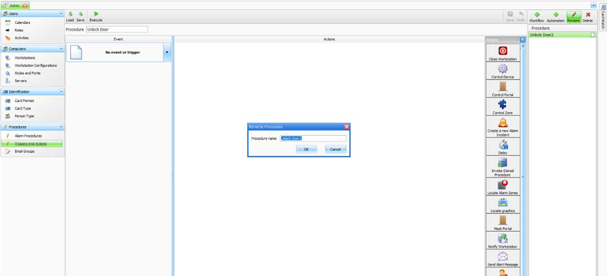

Alternately, you can enter a new name directly into the *Procedure* name field in the top left of the
work area.

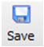

In either case, click the
button after entering the new name to complete the change.

## 12.5 DEFINING AN EVENT FOR AN AUTOMATION PROCEDURE

Once you have added an *Automation* procedure, you can specify the trigger/event that will launch the
*Actions* associated with the procedure. The following table outlines the available *Event* types that can
be assigned for an *Automation* procedure.
**Name**
**Icon**
**Description**

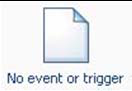

No Event or
There is no assigned trigger for this automation.
Trigger
Access Control
This automation will execute when an *Access Control* event

Event
occurs.
This automation will execute when a *Credential Status Update*
Credential Status

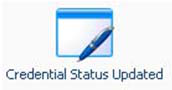

Updated
occurs.
Credential Issued
This automation will execute when a *Card* for *Credentials* has

been issued.

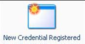

This automation will execute when a *New Card* for *Credentials*
New Credential
Registered
has been registered.
New Person
This automation will execute when a *New Person* has been

Registered
registered.
This automation will execute when an *Alarm* has been
Alarm Incident

Acknowledged
*Acknowledged*.
Alarm Incident
This automation will execute when an *Alarm* has been *Cleared*.

Cleared

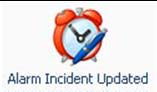

Alarm Incident
This automation will execute when the status of an *Alarm* has
Updated
been updated.

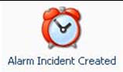

Alarm Incident
This automation will execute when an *Alarm Incident* occurs.
Created
This automation will execute as *Scheduled* on the *Calendar*.
Calendar (by

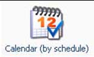

schedule)

To assign an *Event* to an *Automation* procedure, select the appropriate name in the *Procedures* list.

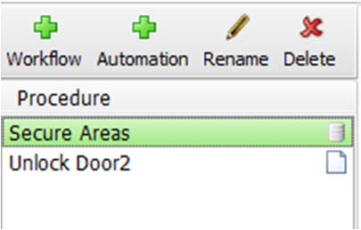

Next, click on the
arrow next to the currently assigned *Event* in the *Event* pane. Note: When first
created, the default *Event* for an *Automation* procedure is *Calendar (by schedule)*.

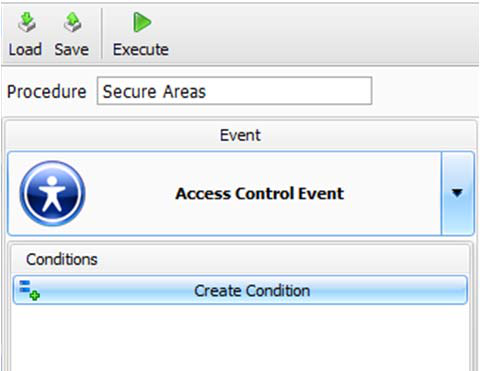

This will call up the *Event* selection window.

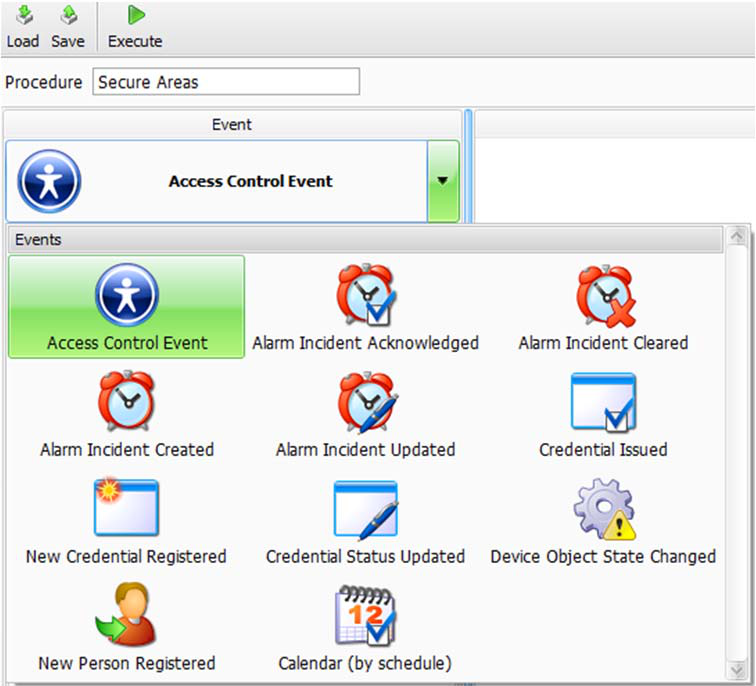

Select the *Event* type you would like to use to trigger the *Automation* procedure by clicking on it in the
window. For the following example, we will use the *Access Control Event* option.

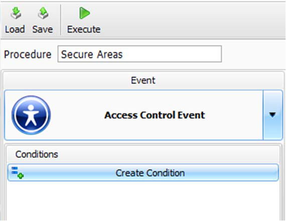

Note: different configuration options will be available for each *Event* type.

In the *Conditions* area of the *Event* pane, click on the
button to add a *Condition* sequence to the *Event*.

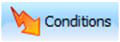

Note: if the *Conditions* area is not currently displayed in the *Event* pane, click the
button at
the bottom left of the *Procedure* workspace.
Note: you can add as many *Condition* sequences as needed to cover the different *Event* circumstances
you would like to include.

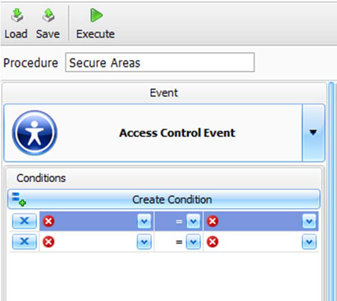

Using the drop-down menus provided with each *Condition* sequence, select a system element (*Person*,
*Point*, *Credential*, *Group*, etc.) and what specific instance it will equate to within the procedure. Note:
all elements and instances that have been configured in the system are available to incorporate into a
*Condition* sequence.

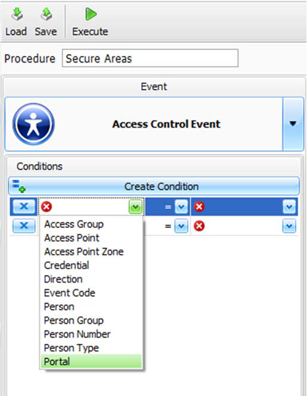

Using our example, in the first *Condition* sequence we select *Portal* as the parameter and *Office*
*Entrance* as the specific instance.

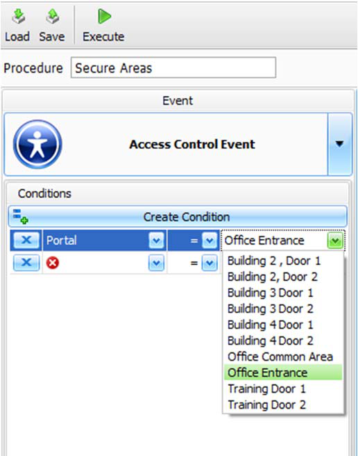

In the second added *Condition* sequence, we set the *Event Code* to equate with a *Forced Access*
*Attempted*.

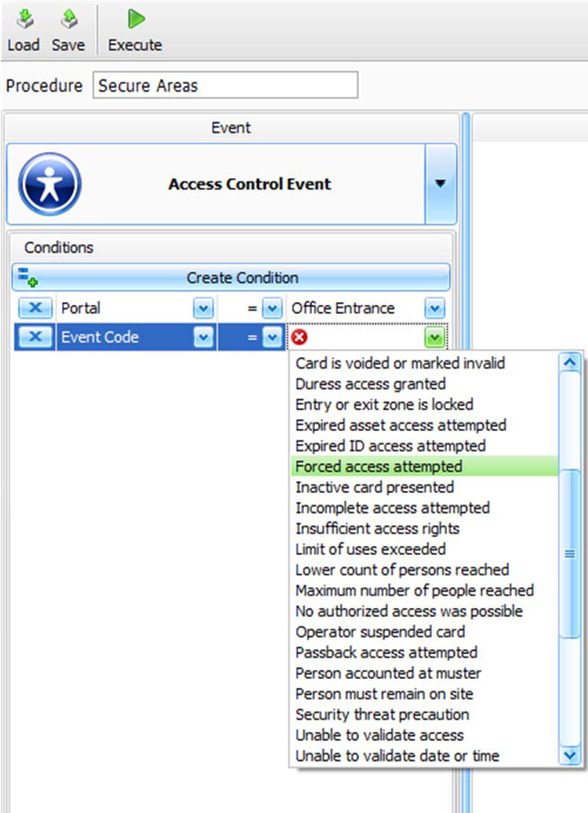

In this manner, we have set the *Automated* procedure to launch when a forced access has been
attempted on a specific door (*Office Entrance*).

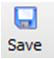

Click the
button to complete the change.

## 12.6 ADDING ACTIONS TO AN AUTOMATION PROCEDURE

Once you have added an *Automation* procedure and assigned *Events* that will trigger the procedure,
you can add *Actions* that will be executed when the procedure is run.
To add *Actions* to an *Automation* procedure, select the appropriate name in the *Procedures* list.

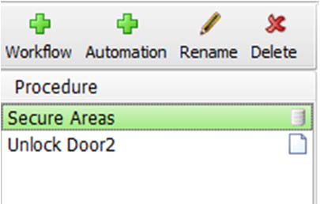

Next, simply drag and drop *Action* shortcuts from the available icons that appear to the left of the
*Procedures* list into the main workspace.

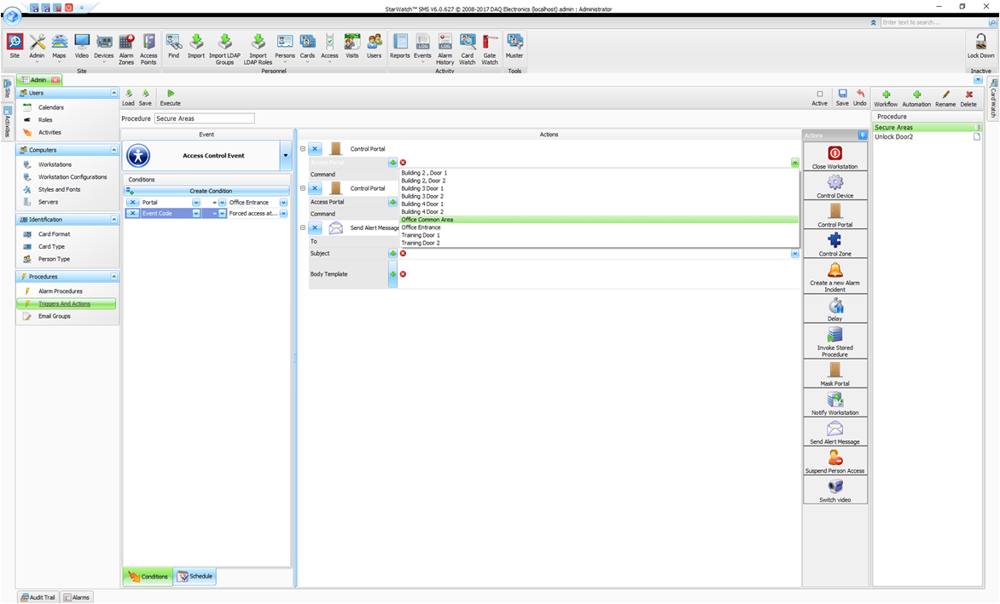

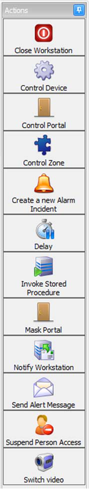

As you drag and drop *Actions* into the procedure, the workspace will become populated with associated
names and parameters. Note: you can change the order of the *Actions* in the main workspace by
clicking on an icon and dragging it up and down to the desired place in the displayed tree.

The following table outlines the available *Actions* for an *Automation* procedure.
**Name**
**Icon**
**Description**

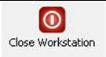

Close Workstation
This will close or log the user out of the specified *Workstation*.

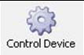

Control Device
This will perform the specified action on the selected alarm
*Device*. The available actions are different depending on the
selected *Device*.

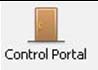

Control Portal
This specifies what action will execute on a specified *Portal*.
Control Zone
This will execute the specified action in the specified *Zone*.

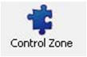

This will create a new *Alarm* incident.
Create a New

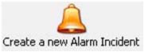

Alarm Incident

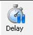

Delay
This will delay an *Action* for the specified amount of time.
This will invoke a *Procedure* that is stored on the system hard
Invoke Stored

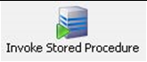

Procedure
drive.

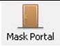

Mask Portal
This will mask the portal alarms and information from the
operator.
This will send a text message to the specified *Workstation* with
Notify Workstation

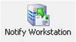

the specified note.
Send Alert
This will e-mail an alert message to the specified recipients.

Message
You can also specify the body of the message.

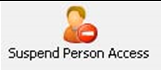

This will suspend the access of the specified *Person*.
Suspend Person
Access
Switch Video
This will switch the video from one camera to another.

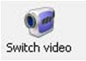

Depending on which *Actions* have been added to the *Automated* procedure, there may be parameters
associated with the *Actions* that can be edited to your preference. For example, *Send Alert Message*
allows you to define the address and content for an e-mail alert message, while *Control Portal* allows
you to define the specific *Portal* that will be associated and the *Action* that will be taken.

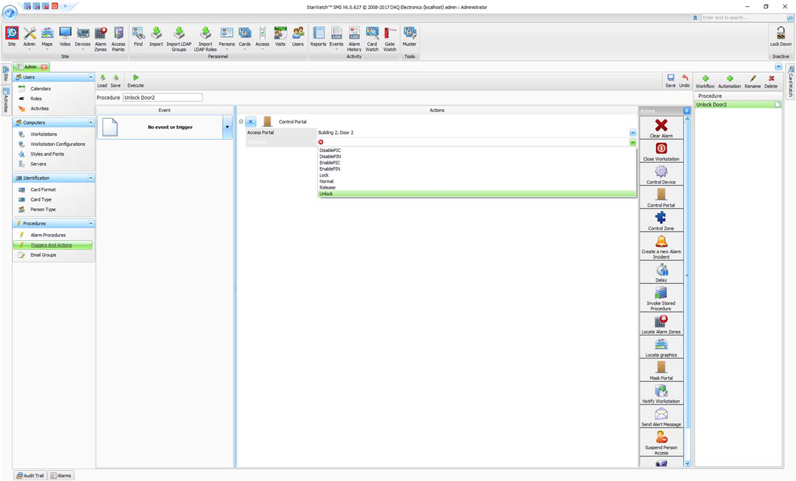

Continuing with our example, we add the *Actions* we would like executed when a forced access has
been attempted on the *Office Entrance* door. First, we first drag two *Control Portal* actions to the
workspace followed by a *Send Alert Messages* action.

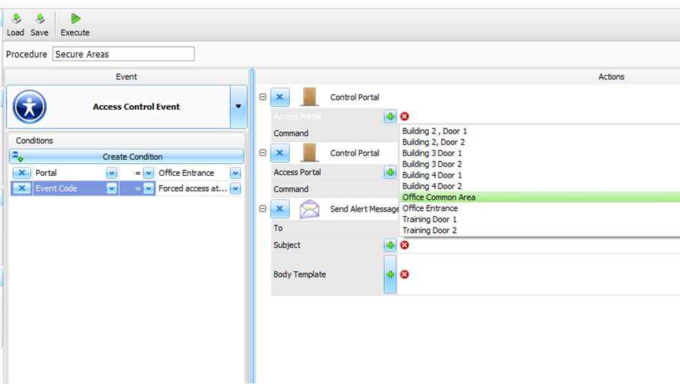

For each *Control Portal* action, we select a door to which we would like to apply an *Action*.

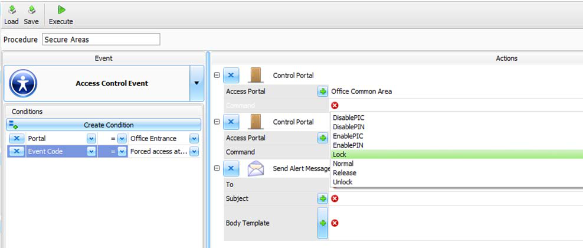

Next, we define the *Action* by selecting the associated *Commands*. In this case, we set *Lock* for both
doors.

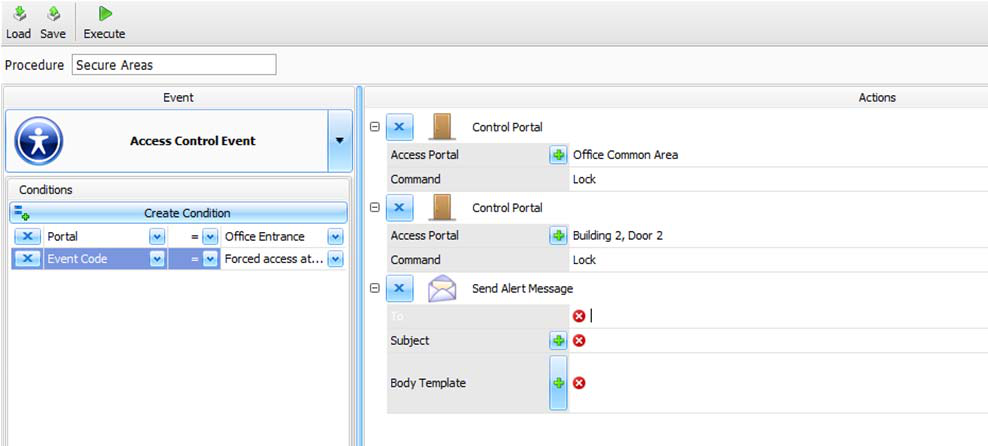

Within the *Send Alert Messages* action, we specify the e-mail address we would like used for the alert
message and define the *Subject* and *Body Template* for the message.

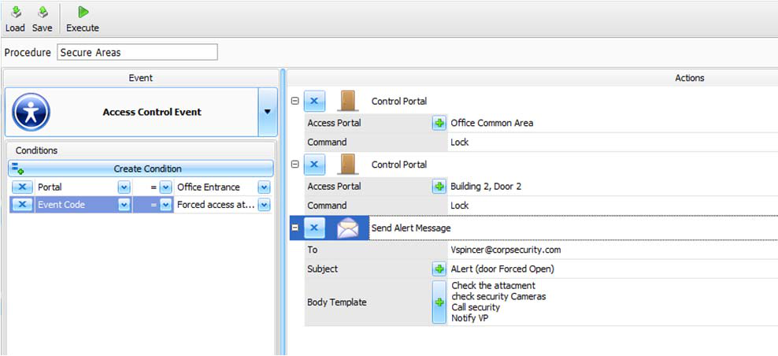

In this manner, we have now configured the system to lock both of the selected doors when the
*Automated* procedure is triggered and to send out an alert message.

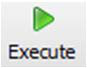

Note: To run the *Actions* associated with the current procedure for testing purposes, click the
button at the top left of the *Procedures* workspace. The *Actions* will be immediately executed despite
any configured triggers or *Schedules*.

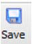

Click the
button to save your changes.

## 12.7 SETTING A TIMEFRAME FOR AN AUTOMATION PROCEDURE

Since *Automation* procedures are run without the involvement of a system operator, you may want to
restrict when a procedure is active by time or date. For example, you may want your *Automation*
procedure to be executed only if the triggering *Event* occurs after-hours or over the weekend.

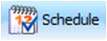

In the *Event* pane of the *Procedure* workspace, call up the *Schedule* area by clicking the
button at the bottom left of the *Procedure* workspace.

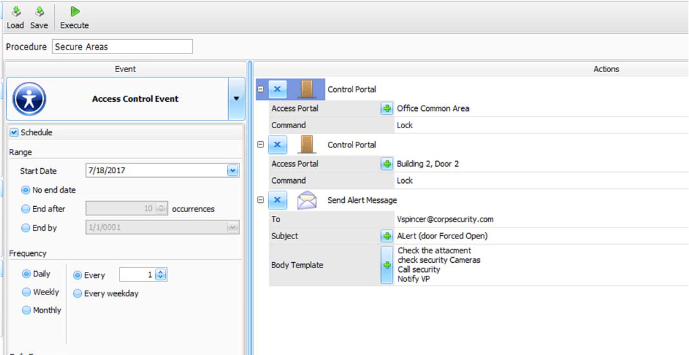

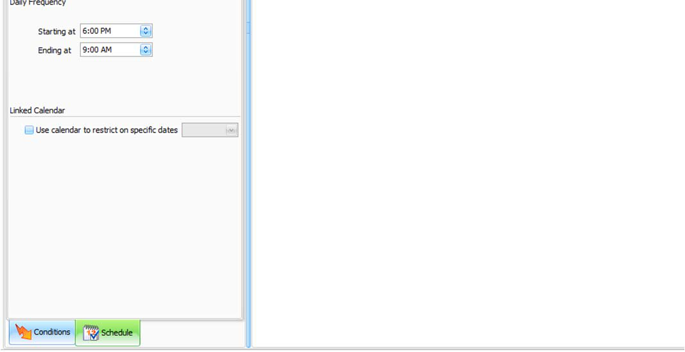

The *Schedule* area provides options for setting the *Automation* procedure to run within a range of
dates, to run with a certain frequency (*Daily*, *Weekly*, etc.), and to run between set hours.

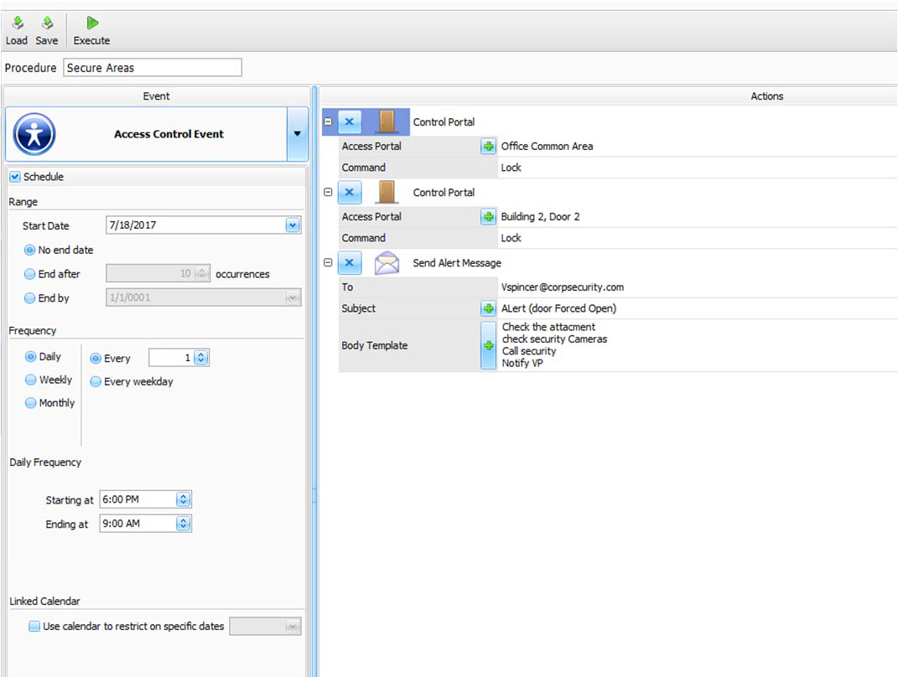

The user also has an option to restrict procedures from running on certain dates in an existing *Calendar*
via the *Dates* function.

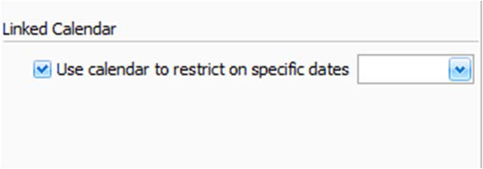

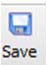

Click the
button to save your changes.

## 12.8 ACTIVATING AN AUTOMATION PROCEDURE

Once all aspects of an *Automation* procedure have been configured as desired, the procedure must be
activated in order for it to run on the system.

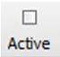

To run the procedure, click the
button at the top right of the *Procedure* window.

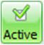

The icon will then display the
state, indicating that the procedure has now been set in motion,
and any associated *Actions* will execute according to the parameters (*Events*, *Condition* sequences,
*Schedules*, etc.) defined within the procedure.

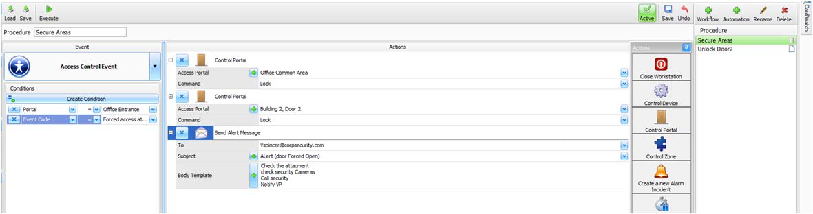

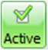

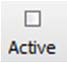

To de-activate a procedure, click the
button to return to the
state.

## 12.9 DELETING AN AUTOMATION PROCEDURE

To delete an *Automation* procedure, select it in the *Procedure* list at the right of the screen.

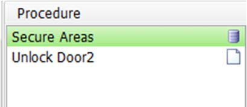

With the procedure highlighted, click the
button.

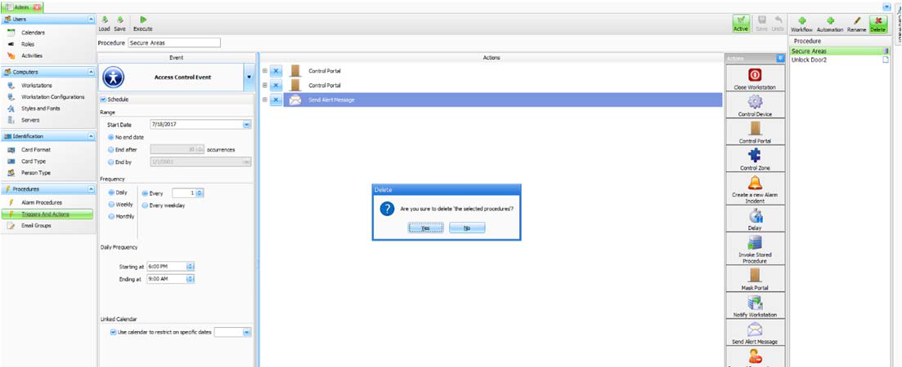

A pop-up screen will appear asking you to confirm that you want to delete the selected procedure.
Click the *Yes* button to proceed.

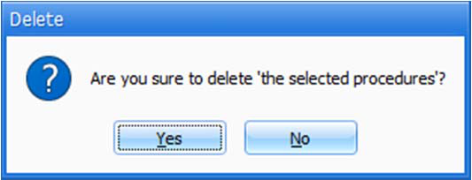

## 12.10 LOADING/EXPORTING A PROCEDURE

At the top left of the *Procedure* window, a small menu provides *Load*/*Export* options for any created
*Workflow* and *Automation* procedures.

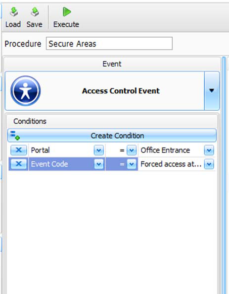

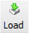

To *Load* an existing .xml file containing a previously saved procedure into the system, click the
button.

To *Save* an existing procedure to your hard drive to use in another system, confirm that the
appropriate procedure is currently selected in the *Procedures* list.

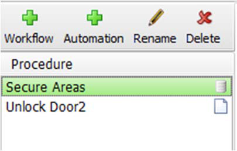

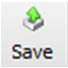

Next, click the
button. The file will be saved as an .xml file.

## 13.0 EMAIL GROUPS

The *Email Groups* function provides a mechanism for adding an email group to the system and allows
you to select which email addresses and individuals from that group will get notifications when specific
alarms occur.

To launch this function, click on the
icon located on the *Procedures* segment of the
*Admin* list on the left side of the screen.

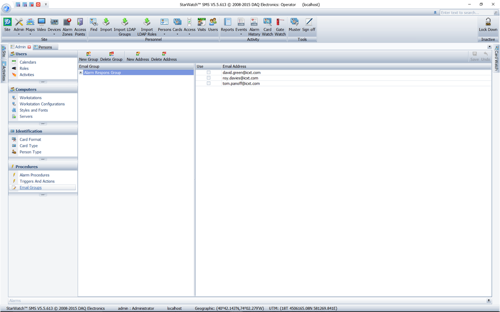

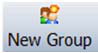

To add a group, click on the
button located at the top left of the work area. A new group will
be added to the *Email Group* list. Double-click on the new group to rename it.

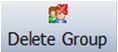

You can delete the group by selecting the group and then clicking on the
button.

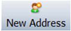

To add a new email address to a selected group, click on the
button. The new email address
will be added to the *Email Address* list.

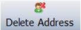

You can delete an email address by selecting the address from the list and clicking the
button.

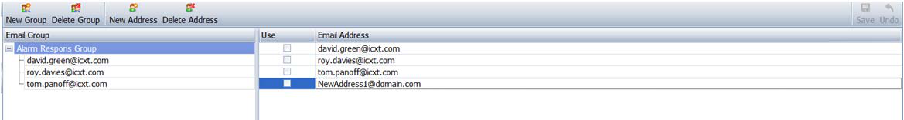

To specify who can receive certain alarm notifications, select the checkboxes next to the email
addresses in that group.

---

*© DAQ Electronics, LLC*
