# Management Console

## 1.0 INTRODUCTION

The next step in the installation and initial setup work flow is configuring the *Management Console*.

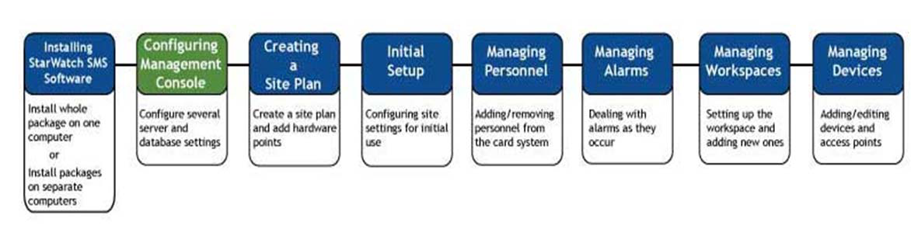

The *Management Console* is a tool used to manage the *StarWatch SMS* system settings, services, device
drivers and SQL database. This tool is essential for setting up a new system so that a database can be
created or restored. Drivers can be selected and important settings for alarm management, automatic
schedules and system maintenance can be established. When the system is running, this tool provides
database backup and schedules and also provides a visual health status on the running services.
If you are using the full version of SQL, then the *Management Console* screen will have a few additional
items, such as Maintenance options.

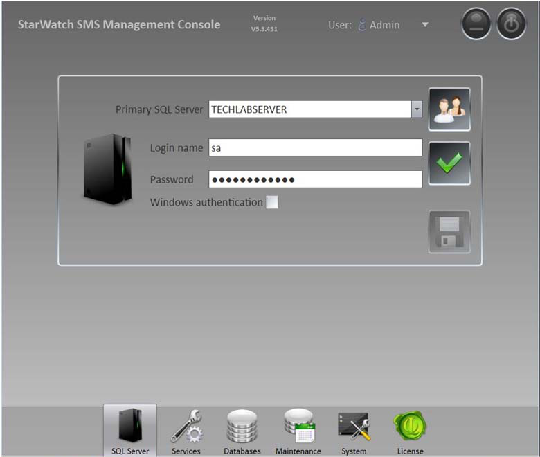

## 2.0 ACCESSING THE MANAGEMENT CONSOLE

To access the *Management Console* application:
Step 1. Do one of the following:
Double-click on the *Management Console* icon on the computer’s desktop if you created a shortcut
during installation.

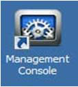

Or, if you did not create a shortcut during installation, click the *Start* menu, then select *All Programs*,
and click *DAQ Electronics*. This will list all the DAQ Electronics installed applications. Click
*Management Console*.

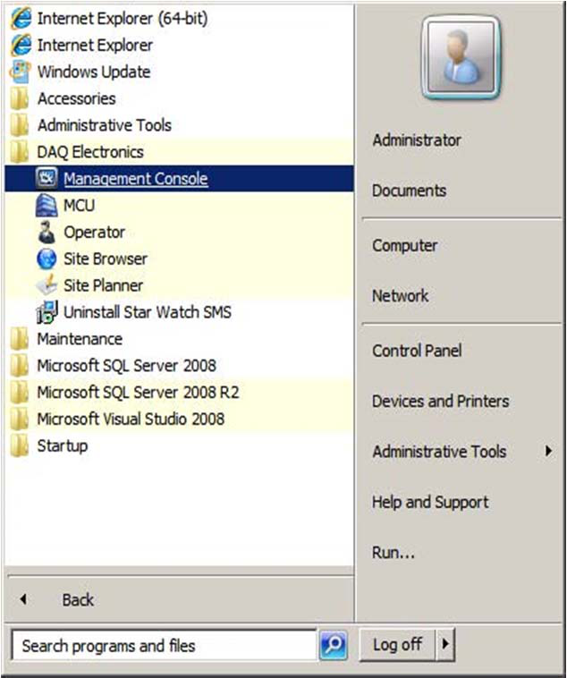

Step 2. The main *Management Console* window opens.

If this is the first time you have accessed the *Management Console* software, you must activate the
software license and create a password for the *Admin* user type (please see section 4.0 INITIAL ACCESS
OF THE MANAGEMENT CONSOLE SOFTWARE).

## 3.0 LOGGING IN AS A DIFFERENT USER

By default, three different users exist when the *Management Console* software is initially installed.
Each user, or login, has different security rights. What you want to access within the *Management*
*Console* determines which user you should use when you log in.
To log in as a different user:
Step 1. From the *User* drop-down menu, select one of the available options:

Admin

Installer

Support

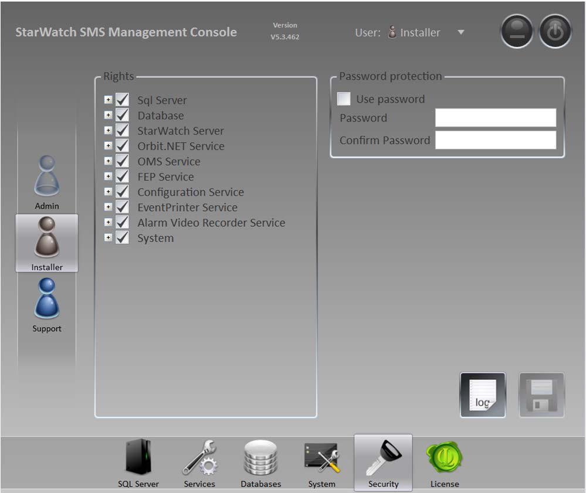

Step 2. If the user login has been configured to use a password, you will be prompted to enter it.

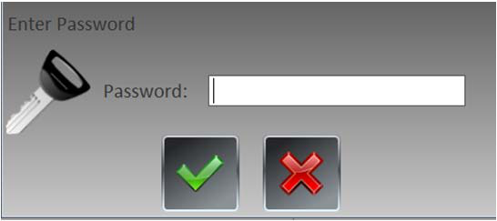

Step 3. Click the green check mark to log in.

## 4.0 INITIAL ACCESS OF THE MANAGEMENT CONSOLE SOFTWARE

When you initially open the *Management Console* software, whether from the shortcut on the desktop
or if you selected to open it at the end of the installation process, you are logged in as the *Installer*
user. You must complete the following two processes:

Activate the *Management Console* software license using your valid product key

Set the *Administrator* user to use a password
The following sections describe how to view and activate the license and configure the administrator
login to use a password – if you have received a machine that has an initial setup done at the factory,
the license should be already activated and these steps may not be necessary.

## 4.1 ACTIVATING THE SOFTWARE LICENSE

After the installation process, you must activate the *StarWatch SMS* software license with your valid
product key. This is required in order for full operation of the system. Without a valid and activated
license, *StarWatch SMS* will operate in demo mode:  the system will work without limitations for up to
thirty days, however every few hours all of the *StarWatch SMS* services will automatically stop and
must be manually restarted.
To activate the *StarWatch SMS* software license:
Click on the *License* button at the bottom of the *Management Console* window. In the *Product Key*
field, type your valid product key. Click *Enter* to activate the license.

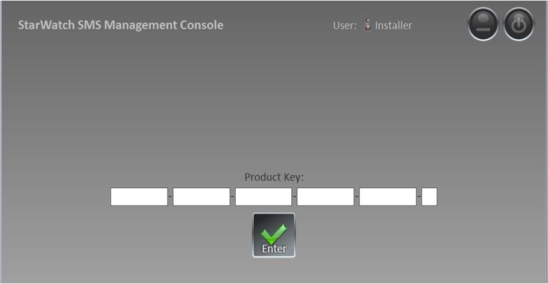

## 4.2 VIEWING THE LICENSE ACTIVATION

The *License* tab displays whether the *StarWatch SMS* server license has been activated or not. The first
time you install *StarWatch SMS* and enter your product key, a license file (called “StarWatch_SMS.lic”)
will be created in the \Server subdirectory of your installation patch (typically C:\StarWatch). After this
file has been generated, it must be sent to the sales team at DAQ Electronics to be manually activated,
after which it will be returned to the customer who must place the updated file in their \Server
subdirectory, replacing the original file. For factory configured machines, this should have been
already done before the machine was shipped from DAQ Electronics. If the license has been activated,
it will be noted in the license window.

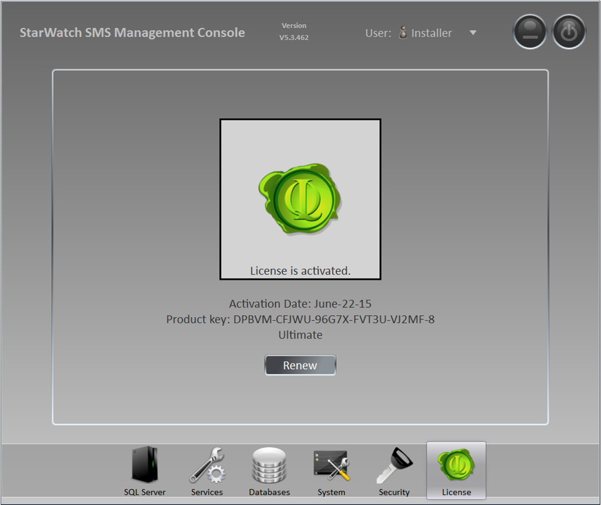

## 4.3 CONFIGURING THE ADMINISTRATOR PASSWORD

The “Admin” user type does not initially have a password and you cannot use it to log into the
*Management Console* software unless a password is created.
To create a password for the *Admin* user type:
Step 1. While logged in as the *Installer* login, click the *Security* tab to access the security options.

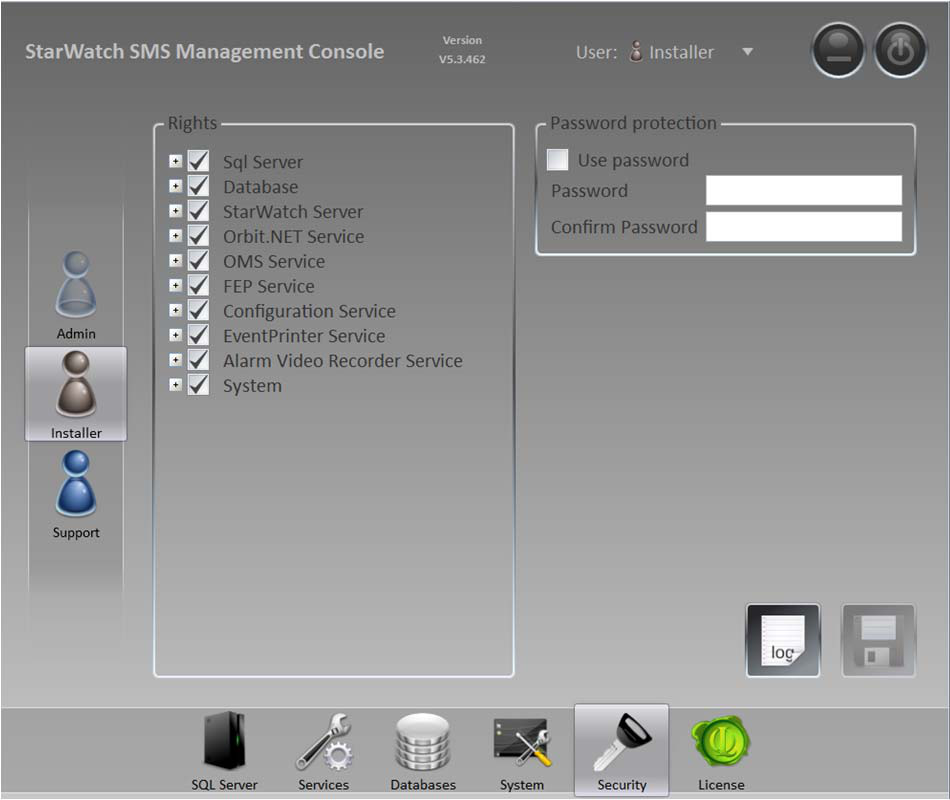

Step 2. From the list of user types, click *Admin*. The security options for the *Admin* user type are
displayed.

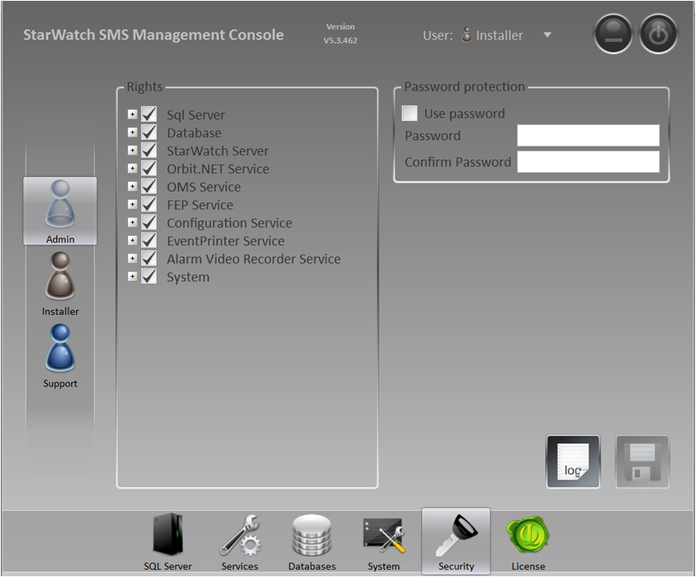

Step 3. Select Use password by placing a checkmark in the box. In the *Password* field, type the desired
password. In the *Confirm Password* field, type the same password. Click *Save* to save the changes.

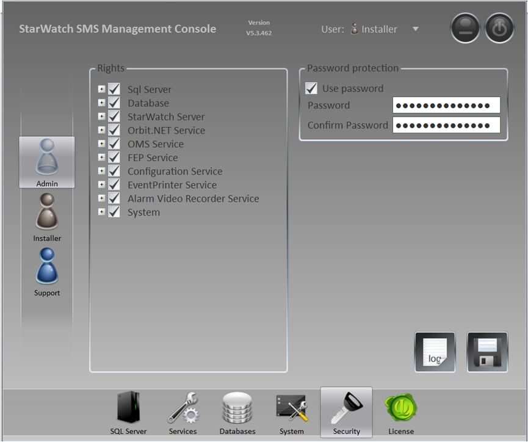

Step 4. Close the *Management Console* window.

## 5.0 CONFIGURING THE SQL SERVER

When the *StarWatch SMS Management Console* application first opens, the *SQL Server* window is
displayed.

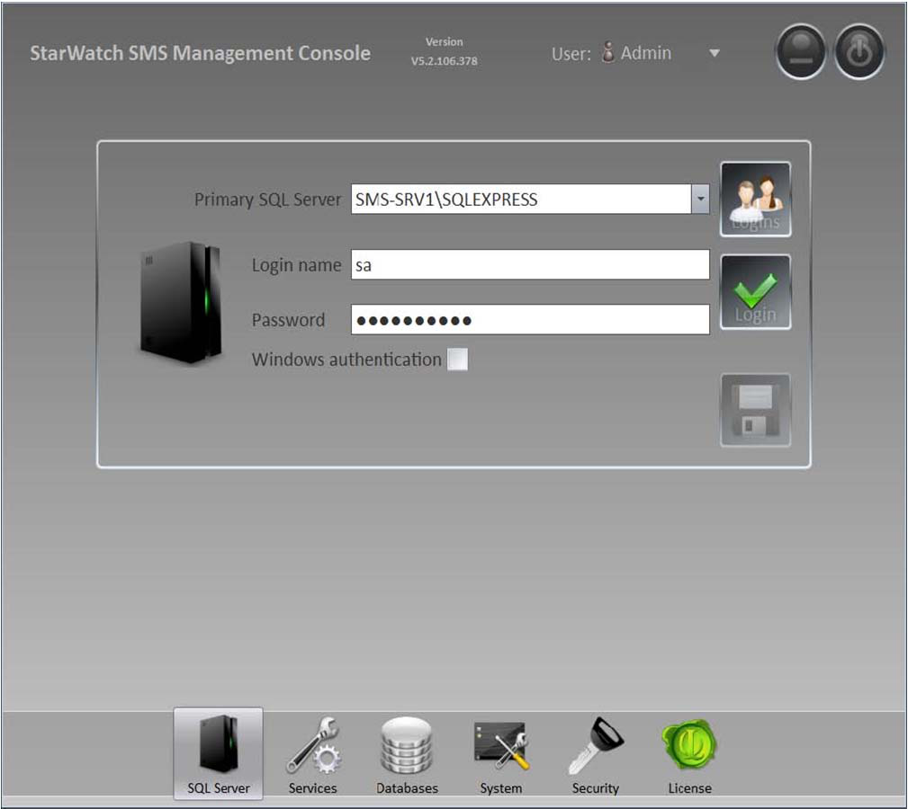

From this window, you can select which SQL server you want to use. Other tasks that are accomplished
through this screen are logging in as a different user using the specified SQL server, or saving any
changes that you may have made with the SQL server logins.

## 5.1 SELECTING AN SQL SERVER

To select an SQL server other than the default server:
Step 1.  Click on the drop-down list for the *Primary SQL Server*, which lists the available SQL servers.
Select the desired primary SQL server.
Step 2.  If not using the default login of “sa”, type the login information to reflect the correct login in
the *Login Name* box.
Step 3.  In the *Password* box, type the password for the SQL server login. If you are on a domain and
running a domain server, check the *Windows Authentication* box.
Note: if you are not sure, see your System Administrator.
Step 4.  Click the green checkmark to login in. If you have entered any of the credentials incorrectly, a
message box opens. The login is successful when the checkmark icon is green.

## 5.2 MANAGING SQL SERVER USERS

You can create, modify, or delete an SQL server user’s login credentials from the *Logins* window,
opened by clicking on the *Logins* button.

Note: SQL Server users are different from *StarWatch SMS* users, and these accounts cannot be used to
login to or operate *StarWatch SMS*. SQL Server users are sets of usernames and passwords that are used
to access the database server, and are often configured and managed by the SQL Server administrator.
New SQL Server installations always have a ‘sa’ user (the top-level server administrator), and SQL
Server installations that have been created by the *StarWatch SMS* installation routine will have both an
‘sa’ and a ‘su’ (Super User) account automatically configured.

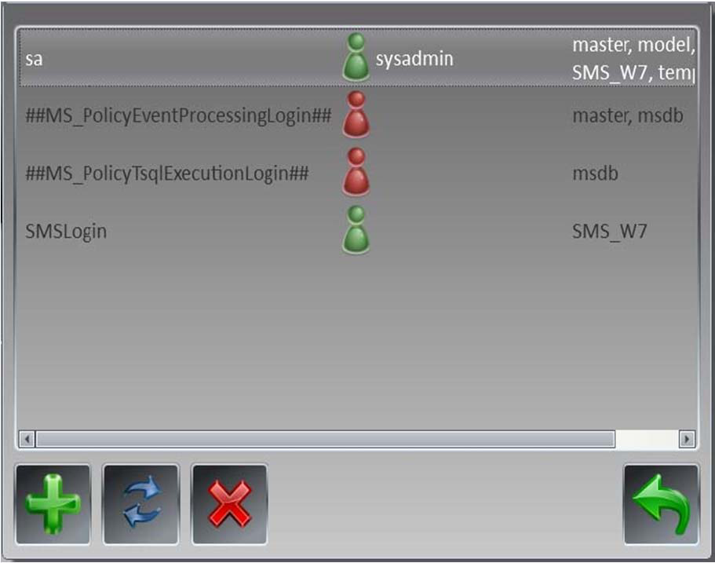

The buttons and icons in the *Logins* window are defined below.
Icon
Name
Description
Create
Creates or adds a new login.

Update
Updates the login’s information

Delete
Deletes the selected login.

Close
Closes the current window and returns back to the
previous window.

## 5.3 CREATING A NEW LOGIN FOR AN SQL SERVER

To create a new login for the SQL server:
Step 1. In the main *Management Console* window, click the *Logins* icon.

Step 2. The *Logins* window opens. Click on the *Create* icon (symbolized by a green plus sign) to begin
creating a new login.

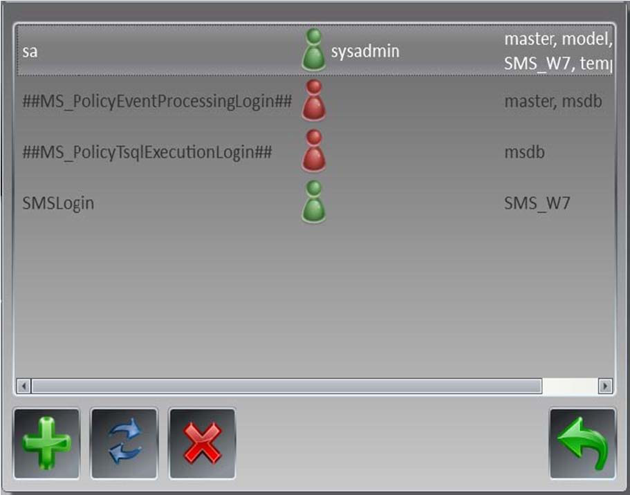

Step 3. The *Create New Login* window opens.

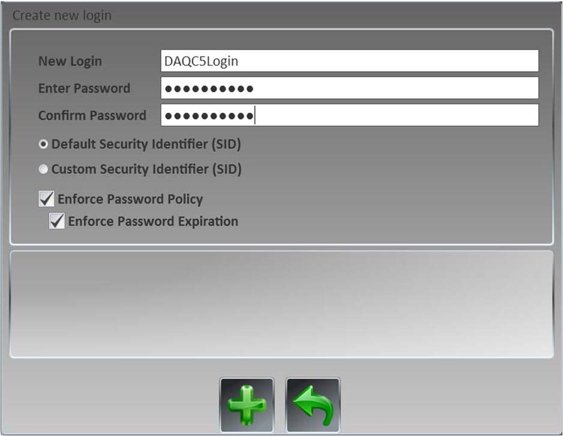

Step 4. Enter the following information and then click the *Create* icon.
Label
Description
New Login
Specify the new SQL server login.
Enter Password
Type the password for the new SQL server login.
Confirm Password
Re-type the password to confirm it.
Default Security Identifier
This is selected by default. The database
associates a login with a user account with a
security identifier alphanumeric sequence. This
can either be automatically generated by the
system or customized.
Custom Security Identifier By default, this is not selected. The database
associates a login with a user account with a
security identifier alphanumeric sequence. This
can either be automatically generated by the
system or customized.
Enforce Password Policy
Select this to enforce SQL password formation
policy. By default, it is not selected.
Enforce Password
Select this to enforce SQL password expiration
Expiration
policy. By default, it is not selected.
Step 5. The new login will be listed in the *Logins* window.

## 5.4 DELETING A LOGIN FROM AN SQL SERVER

To delete a login from the SQL server:
Step 1. In the main *Management Console* window, click the *Logins* icon.

Step 2. The *Logins* window opens.

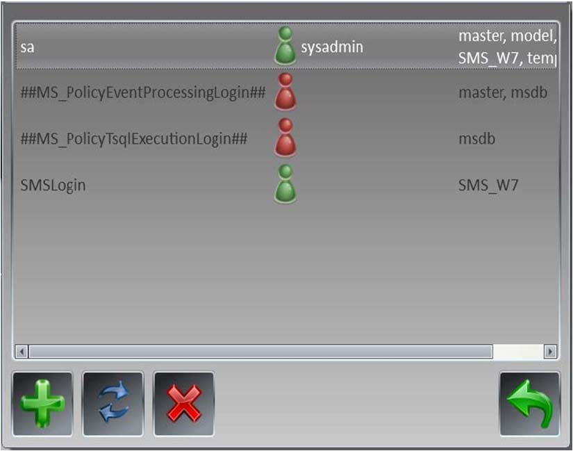

Step 3. Click on the login that you want to delete to select it, then click *Delete*.

Step 4. The *Delete* login window opens. Click *Confirm* to confirm the deletion of the login.

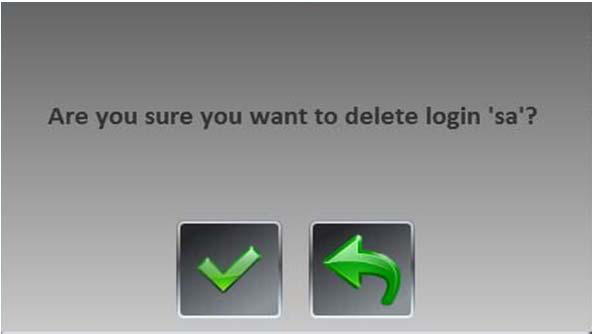

## 5.5 UPDATING AN EXISTING LOGIN ON THE SQL SERVER

To update an existing login on the SQL server:
Step 1. In the main *Management Console* window, click the *Logins* icon.

Step 2. The *Logins* window opens. Click on the *Update* icon to update an existing login.

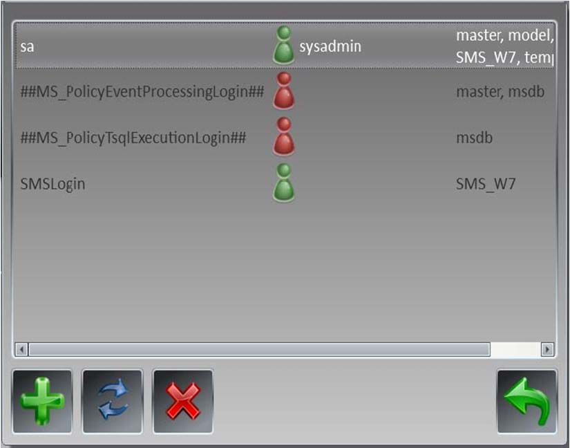

Step 3. The *Update Existing Login* window opens.

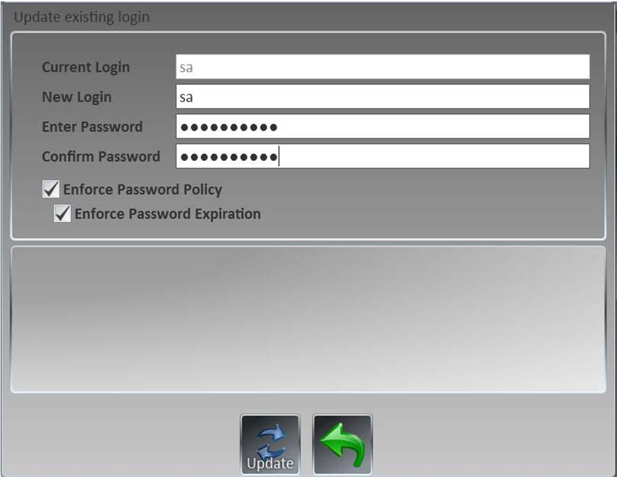

Change the desired information and then click *Update*.
Label
Description
New Login
Specify the new SQL server login.
Enter Password
Type the password for the new SQL server login.
Confirm Password
Re-type the password to confirm it.
Default Security Identifier
This is selected by default. The database
associates a login with a user account with a
security identifier alphanumeric sequence. This
can either be automatically generated by the
system or customized.
Custom Security Identifier By default, this is not selected. The database
associates a login with a user account with a
security identifier alphanumeric sequence. This
can either be automatically generated by the
system or customized.
Enforce Password Policy
Select this to enforce SQL password formation
policy. By default, it is not selected.
Enforce
Password
Select this to enforce SQL password expiration
Expiration
policy. By default, it is not selected.
Step 4. The existing login will now reflect the changes that were made.

## 6.0 MANAGING THE STARWATCH SMS DATABASES

When *StarWatch SMS* is installed, a new database is created and the system is designed to work with
and maintain this database without additional user configuration or intervention. The functions listed
in this section are generally not required as part of standard use of the system, and if used incorrectly
may result in incorrect functionality, loss of data or interruption of *StarWatch SMS* services.
The functions described in this section are intended for advanced users only, and should only be
performed when requested or advised by DAQ Electronics or a certified partner.
In the *Databases* window of the *StarWatch SMS Management Console*, you can perform several of the
following tasks:

Create a new database

Delete an existing database

Update a database

Clean a database

Back up a database

Restore a database
If you are using the full version of SQL, then you have an additional settings window that will be used
to schedule or execute cleaning the database.
Note: to follow these instructions, open the *StarWatch SMS Management Console* and click the
*Databases* tab at the bottom of the main window.

## 6.1 CREATING A NEW DATABASE

You can create several databases which will reside on the *StarWatch SMS* Server.
To create a new database:
Step 1. In the *Database* window, type the name of the new database in the *Name* text box and click
*Create*.

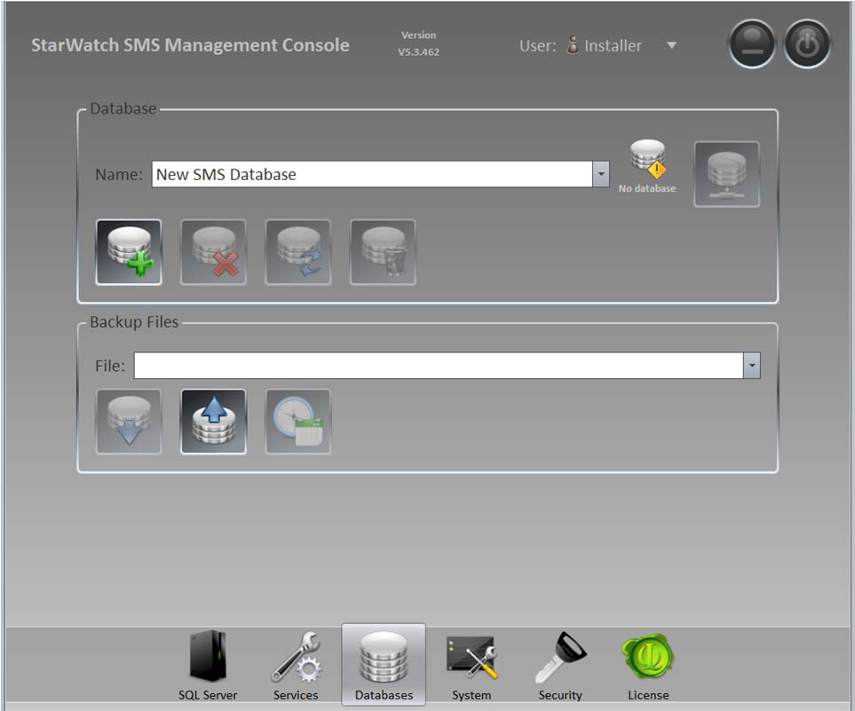

Step 2.  When prompted to confirm the creation of the new database click *Create* (the green check
mark). A progress window will appear displaying the database operations, and a message will appear at
the top of this window informing you when the process has been completed successfully.

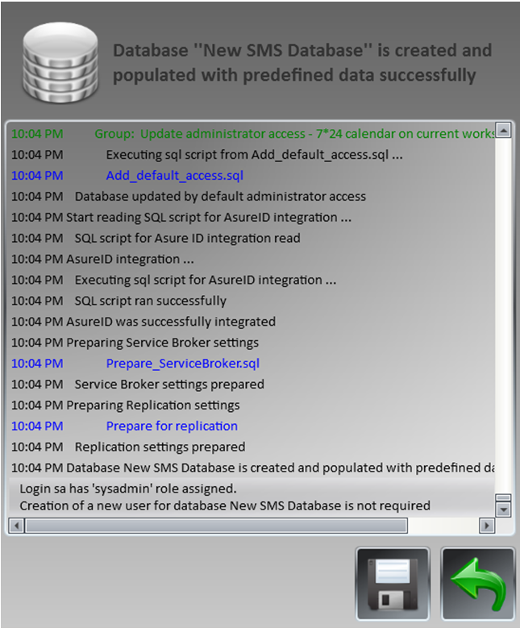

Step 3.  When the database has been created successfully, click *Close* (the green arrow) to close the
window.

Step 4. In the *Database Connection* window that opens, type the login credentials in the *Login* name
and the *Password* fields. Click *Test* to test the database connection.

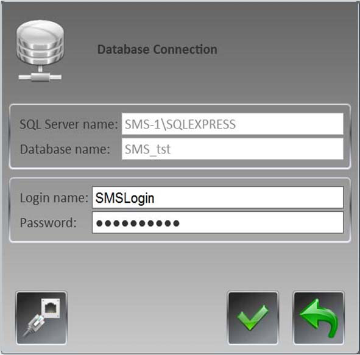

Step 5. When the connection test passes successfully, a message appears in the window. Click *OK*. The
new database will automatically connect to the server and it will now be used.

## 6.2 DELETING AN EXISTING DATABASE

Note: deleting a database will remove it from the SQL database list and it can no longer be accessed.
You may want to make a backup of the database before deleting it.
To delete an existing database:
Step 1. In the *Database* window, type the name of the database (or select it from the drop-down menu)
in the *Name* text box and click *Delete*.

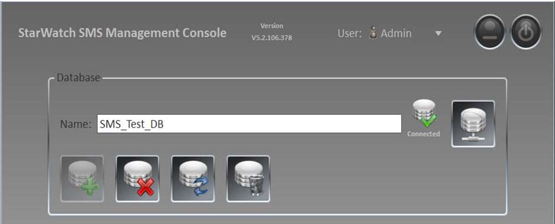

Step 2. A window will appear prompting you to confirm the deletion of the database and the stopping
of services (if running). Click *Delete* (the green check mark). When the database is deleted
successfully, click *Close* to close the window.
Note: you must connect to another database and restart services before the system is operational
again.
Step 3.  Restart services that have been automatically stopped by this operation (please see section 7.4
STARTING ALL THE SERVICES for instructions).

## 6.3 UPDATING A DATABASE

Note: after updating a database, you must restart the *StarWatch SMS* services before the system is
operational again (please see section 7.4 STARTING ALL THE SERVICES for instructions).
To update a database:
Step 1. In the *Database* window, type the name of the database (or select it from the drop-down menu)
in the *Name* text box and click *Update*.

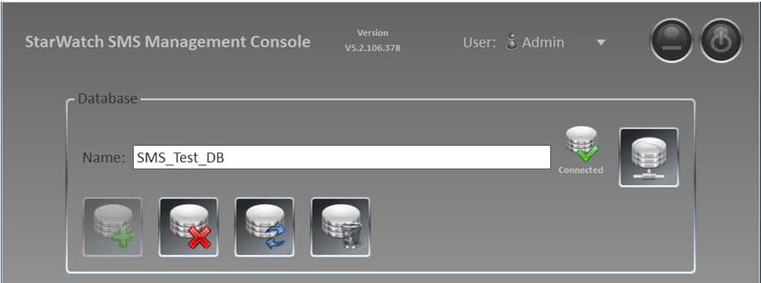

Step 2. When prompted to confirm updating the database and stopping services if running, click *Update*
(the green check mark). A progress window will appear displaying the database operations, and a
message will appear at the top of this window informing you when the process has been completed
successfully. When the database has been updated successfully, click *Close* to close the window.
Step 3. Restart services that have been automatically stopped by this operation (please see section 7.4
STARTING ALL THE SERVICES for instructions).
Note: updating is done after software updates have been performed.

## 6.4 CLEANING A DATABASE

Note: after cleaning a database, you must restart the *StarWatch SMS* services before the system is
operational again (please see section 7.4 STARTING ALL THE SERVICES for instructions).
Note: the items selected in the following procedure cannot be recovered if cleaned. It is suggested
that you perform a backup before cleaning the database if the items are required for future data or
reports.
To clean a database:
Step 1. In the *Database* window, type the name of the database (or select it from the drop-down menu)
in the *Name* text box and click *Clean*.

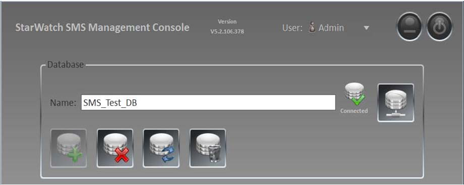

Step 2. After selecting which options to clean, click *Clean*. Any selected options will be removed
(“cleaned”) from the selected database.

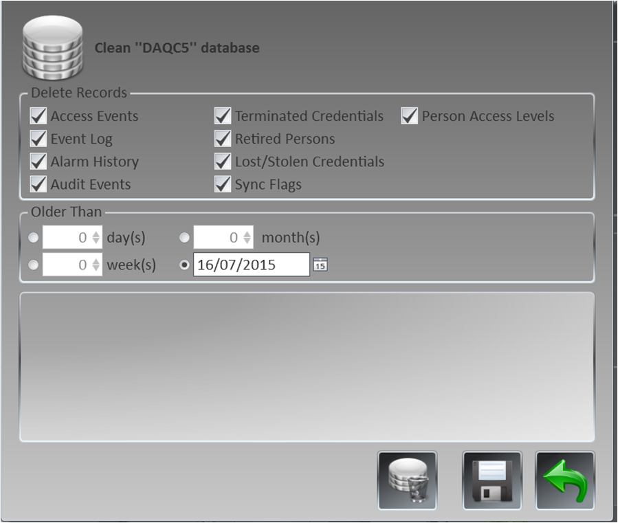

Step 3. A progress window will appear displaying the database operations, and a message will appear at
the top of this window informing you when the process has been completed successfully. When the
database has been cleaned successfully, click *Close* to close the window.
Step 4. Restart services that have been automatically stopped by this operation (please see section 7.4
STARTING ALL THE SERVICES for instructions).

## 6.5 BACKING UP A DATABASE

To back up a database:
Step 1. In the *Database* window, type the name of the database (or select it from the drop-down menu)
in the *Name* text box and click *Backup*.

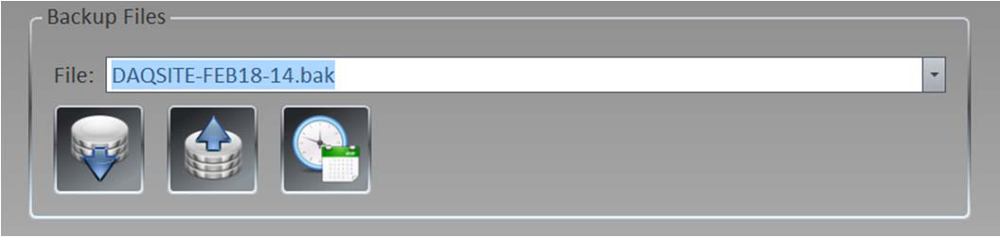

Step 2.  When prompted, click *Backup* (the green checkmark). If necessary, you may also choose to
back up (and/or shrink) the transaction log by clicking the associated box. An additional item marked
*Back up for Support* allows for the removal of all personal identification information (names, dates of
birth, etc.) from the backup file, ideal if you need to send the backup to a DAQ Electronics support
engineer for assistance but do not want to compromise the privacy of people enrolled in the system.

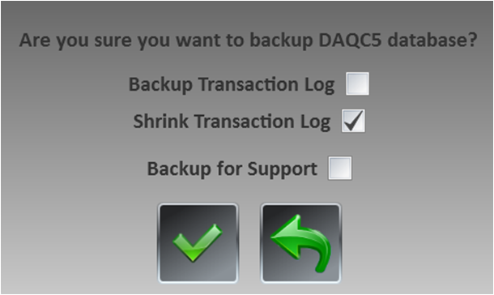

Note: if you are using the full standard version of SQL, check the *Back up Transaction Log* box. Note
that this will extend the time it takes to back up a database.
Step 3. When the database has been backed up successfully, click *Close* to close the window.

## 6.6 RESTORING A DATABASE

To restore a database:
Step 1. In the *Database* window, type the name of the database (or select it from the drop-down menu)
in the *Name* text box and click *Restore*. Note that any database files contained in the \Backup
subfolder of your *StarWatch SMS* installation location (Generally C:\StarWatch) will be available on this
drop-down menu.

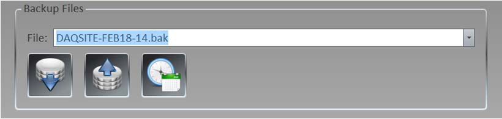

Step 2. A prompt will appear asking you to confirm that you want to restore the database, and (if
services are currently running) warning you that services will be stopped in order to complete the
operation. To proceed, click *Restore* (the green check mark).

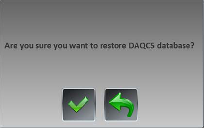

Step 3.  A window will open listing the available restore options. Make any necessary changes to the
fields and then click *Restore*. Please note that if the database you are restoring was created by a
different *StarWatch SMS* system (or a different hostname for the *StarWatch SMS*  Server), you will need
to place a check mark in both the *Update workstation host name for server* and *Update Orbit host by*
fields. The correct value for the current Orbit host will already be entered into the relevant box.

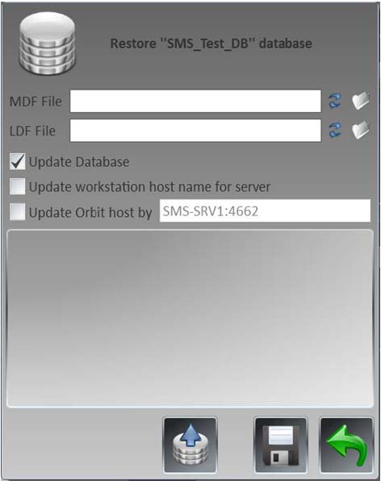

Step 4. A progress window will appear displaying the database operations, and a message will appear at
the top of this window informing you when the process has been completed successfully. When the
database has been restored successfully, click *Close* to close the window.

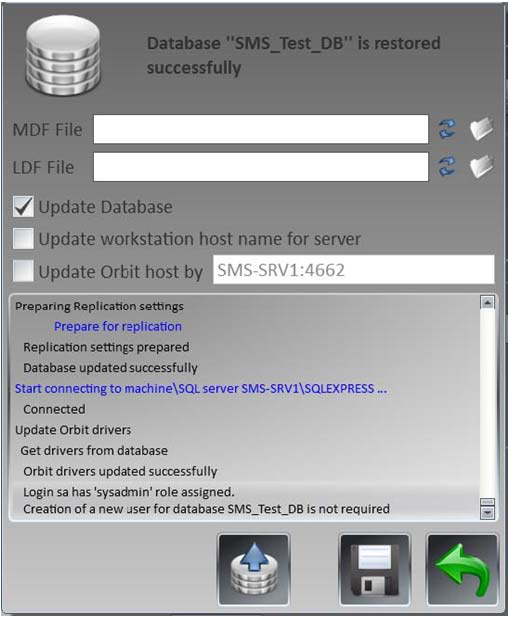

## 7.0 MANAGING THE SERVICES STATUS AND INFORMATION

Note: to follow these instructions, open the *StarWatch SMS Management Console* and then click the
*Services* tab at the bottom of the main window.
The *Services* tab displays the status of the services that are necessary for normal operations of the
*StarWatch SMS* system.

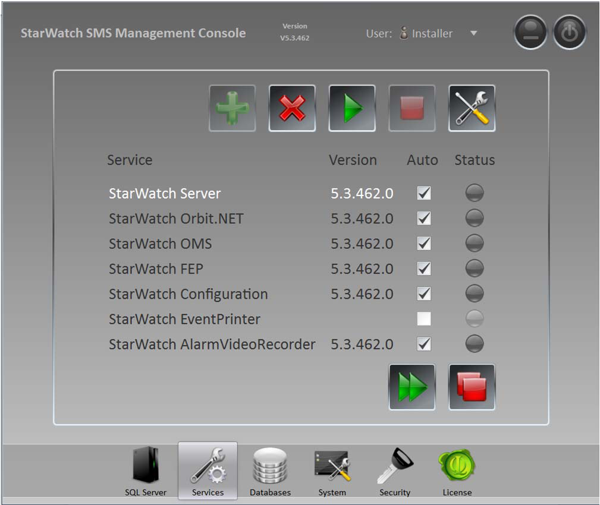

The necessary services and the default state of each service is shown below:
Default
Installation
Name
Description
Mode
StarWatch Server
The StarWatch™ SMS server
Automatically Started
Automatically Started
StarWatch Orbit.NET
The StarWatch™ SMS Orbit.NET service
Automatically Started
StarWatch OMS
The StarWatch™ SMS OMS service
Default
Installation
Name
Description
Mode
Automatically Started
StarWatch FEP
The StarWatch™ SMS FEP service
Automatically Started
StarWatch Configuration
The StarWatch™ SMS Configuration service
StarWatch EventPrinter
The StarWatch™ SMS Event Printer.
Not Started
StarWatch Alarm Video Recorder
The StarWatch™ SMS Alarm Video Recorder
Automatically Started

Above and below the list of services there are several buttons that perform various tasks. The buttons
are described in the following table and sections.
Icon
Name
Description
Install
Install a service to the StarWatch™ SMS server. You can only

add a service that has been removed. See “Installing a Service”
on page 3-23

Remove
Remove an existing service from the StarWatch™ SMS server.
See “Removing an Existing Service” on page 3-25
Start
Start a service on the StarWatch™ SMS server. See “Starting a

Service” on page 3-26

Stop
Stop a service on the StarWatch™ SMS server. See “Stopping a
Service” on page 3-27

Start All
Start all the services on the StarWatch™ SMS server. See
“Starting All the Services” on page 3-26

Icon
Name
Description

Stop All
Stop all the services on the StarWatch™ SMS server. See
“Stopping All the Services” on page 3-28

Settings
Manage the settings of the selected service. Each service has
additional pages for the configuration settings. See these
sections for more information: • StarWatch Server - See
“Managing the StarWatch™ SMS Server Settings” on page 3-30 •
StarWatch Orbit.NET - See “Managing the StarWatch™ SMS
Orbit.NET Settings” on page 3-38 • StarWatch EventPrinter -
See “Managing the StarWatch™ SMS EventPrinter Settings” on
page 3-40

## 7.1 INSTALLING A SERVICE

Note: you can only install a service that has been previously removed. The *Install* button will be
disabled when installing is not an option for the selected service.
Note: this procedure is for manual loading of services and software and is generally not required as
part of normal installation and operation of the system. Please only use these steps when instructed to
do so by the support team or a certified dealer.
To install a service to the *StarWatch SMS* server:
Step 1.  In the *Services* window, click on the service name to manage, which selects the name, and also
select if you want the service to start automatically by clicking the associated *Auto* check box.
Typically, the *Auto* check box is enabled. Next click the *Install* button.

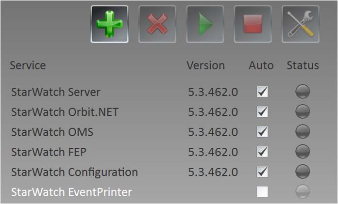

Step 2.  You will be prompted to confirm the service installation. In the *Services Confirmation* window,
click *Add* to install the service or *Close* to close the window and not install the service.

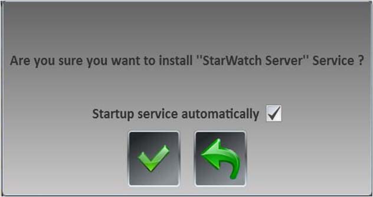

Step 3. The specified service is now installed but not started (please see section 7.3 STARTING A
SERVICE for more details).

## 7.2 REMOVING AN EXISTING SERVICE

Note: use this functionality with caution. You will not be prompted before the service is removed.
To remove an existing service:
Step 1.  In the *Services* window, click on the service to remove, which highlights the service, and then
click the *Remove* button.

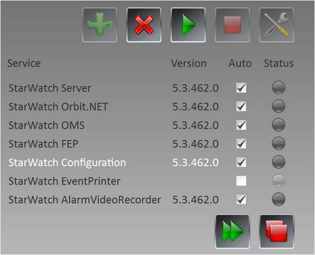

Step 2.  The service will automatically be uninstalled (without prompting for confirmation). You will
see a progress window appear until the operation has completed.

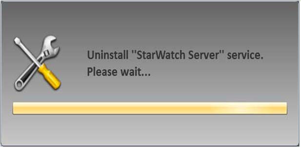

## 7.3 STARTING A SERVICE

Note: to ensure that the service will automatically start when the computer is powered up, you must
check the *Auto* box associated with the specific service.
To start a service:
In the *Services* window, click on the service to start, which highlights the service, and then click the
*Start* button (the single green arrow icon near the top of the window). The service will be started and
the *Status* indicator will briefly turn yellow and then green when the service is loaded completely.

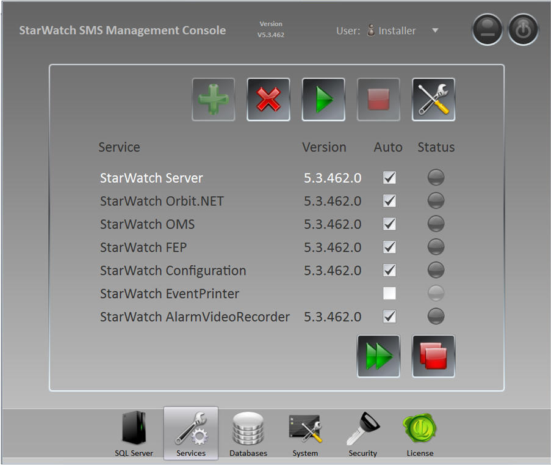

## 7.4 STARTING ALL THE SERVICES

To start all the services:
Step 1. In the *Services* window, click *Start All* (the double green arrow icon near the bottom of the
window).

Step 2.  All the services will be started and the *Status* indicators will briefly turn yellow and then green
when each service has been fully loaded and initialized.

## 7.5 STOPPING A SERVICE

To stop a service:
In the *Services* window, select the service to stop by clicking on a service name, and then click the
*Stop* button. The service will be stopped and the *Status* indicator will briefly turn yellow and then gray
when the service is stopped completely.

## 7.6 STOPPING ALL THE SERVICES

To stop all the services:
Step 1. In the *Services* window, click *Stop All*.

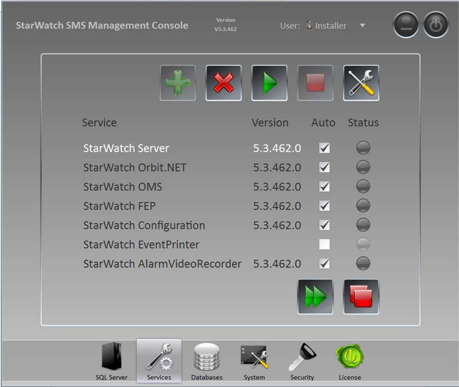

Step 2.  All the services will be stopped and the *Status* indicators will briefly turn yellow and then gray
when each service is stopped completely.

## 8.0 MANAGING THE STARWATCH SMS SERVER SETTINGS

Note: to follow these instructions, open the *StarWatch SMS Management Console*, click the *Services* tab
at the bottom of the main window, then click on the *StarWatch SMS Server* service from the list of
services to select it, and finally click the *Settings* button to access the settings.
There are several settings windows for the *StarWatch SMS* server process, which are listed below:
Icon
Settings
Description

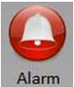

Alarm
Configure various alarm settings. See “Configuring the Alarm
Settings” on page 3-31.

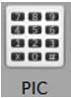

PIC
Configure PIC-related settings, such as the PIC length, site
code, etc. See “Configuring the PIC Settings” on page 3-32.
Scheduled
Configure scheduled settings. See “Configuring the Scheduled

Tasks” on page 3-35.
Mail
Configure SMTP mail settings for email. See “Configuring SMTP

Mail Options” on page 3-36.

## 8.1 CONFIGURING THE ALARM SETTINGS

In the *Alarm* window, you can change the following information:
**Section**
**Name**
**Description**
**Default**
Alarms
Automatically
Can automatically acknowledge and clear alarms
Enabled
Settings
manage alarms
if an operator does not acknowledge it within a
required time period.
Manage alarms
The time period in which an operator must
10 minutes
within (minutes)
acknowledge an alarm before the system
automatically acknowledges and clears it.
100 events
Maximum events
The maximum number of events associated with
per incident
a current alarm.
Generate
Housekeeping alarms include operator logging in
DeviceServer
or out of the Operator software.
Online
housekeeping
alarms
Housekeeping
Sets the housekeeping alarm severity. It can be
Information
alarm severity
set to: *•* Casual *•* Informational *•* Significant *•*
Minor *•* Major *•* Serious *•* Critical
Pre Alarm Time
The amount of video from a camera saved prior
10 seconds
Alarm
(seconds)
to an alarm.
Video
Settings
Post Alarm Time
The amount of video recorded after an alarm
20 seconds
(seconds)
occurs.
Auto Alarm
The number of times an alarm video clip loops
0
Playback Count
when an operator views the associated alarm
recorded video clip.

To change the alarms settings for the *StarWatch SMS* server:
Step 1. In the *Alarm* window, make the necessary changes to the information.

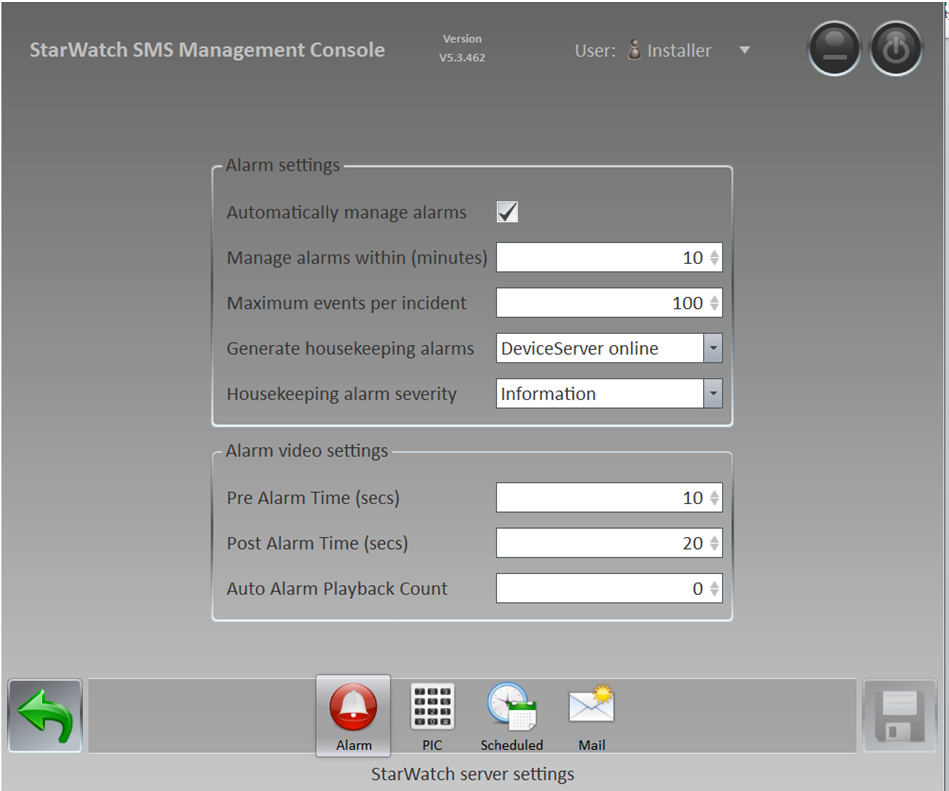

Step 2. When the changes are complete, click *Save* to save your changes.

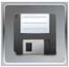

## 8.2 CONFIGURING THE PIC SETTINGS

The PIC is the Personal Identification Code assigned to a person to use when arming or disarming an
alarm zone from a keypad attached to an alarm panel. The length of the PIC is used to ensure that all
PIC numbers use the same amount of digits and that the PIC numbers are all created uniquely. PIC
numbers need to be unique because they are used to identify individual people. Each person must
remember their own PIC. The length of the PIC numbers can be set within a range from four to ten
digits. Typically, ICIDS-based IDS systems use six digit PICs.
When assigning a PIC, it can be issued as a rando number generated by the system (Auto) or chosen by
the person it is being associated with (Manual”). Additionally a third type of PIC issuance (called Linked
as PIC) is available. This is a special form of issuance that links physical card numbers to PICs:  a
person’s card is used to generate a unique PIC number. This is done when configuring the card format
(please see the *Administration Panel* guide for more information).
For Linked PIC generation, the formula and method of deriving the PIC from the card number is based
on the Site Code and Site Type of the cards that are used. This number is provided whenever new cards
are ordered for a specific site.
These Site Code and Site Type numbers are generally not as important for new installations as they are
for legacy sites, in fact they can often be set to any value (as long as the value is not changed later
after PICs have already been issued). For new sites it is not recommended to use Linked PIC issue as
newer types of card technology often will prevent card numbers being converted to PIC numbers. As an
example, a Federal Government CAC card cannot be used to generate a PIC number.

In the PIC window, you can change the following information:
Section
Name
Description
Default
PIC Settings
PIC Length
Specifies the length of the PIC.
6
PIC Issue
Specifies how PICs are generated. The
Manual
options are: • Manual - person chooses
the PIC • Auto - based on a random
number generator • Linked - a person’s
card is used to generate a unique PIC
Sets the site’s PIC code for multiple site
PIC Site Code
applications.
0
PIC Site Type
Sets the PIC site’s type.
1
Enable or disable permissions for the
Support
Alarm
Zone
Disabled
alarm zone.
Permission
User Passwords
Enforce strong password
Enforces a strong password policy.
Disabled
Account Lockout Threshold
Number of failed attempts before locking
0
account.
Account
Lockout
Duration
Length of account lockout time.
60 minutes
(minutes)

To change the PIC settings for the *StarWatch SMS* server:
Step 1. In the *PIC* window, make the necessary changes to the information.

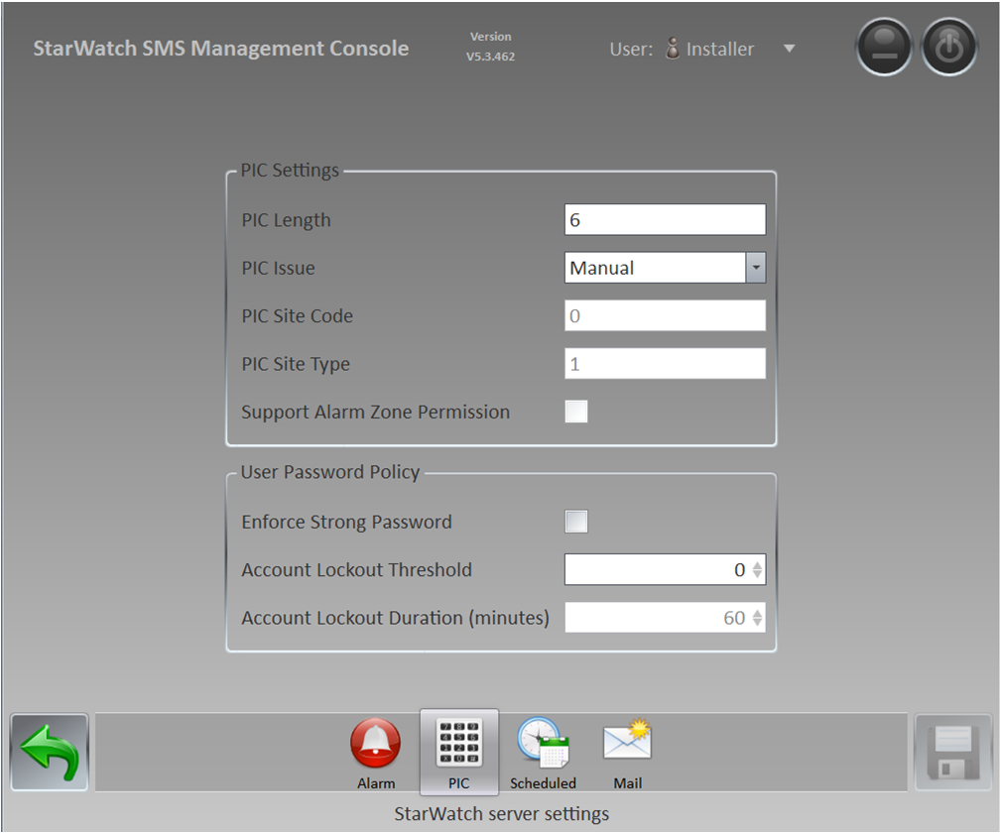

Step 2. When the changes are complete, click *Save* to save your changes.

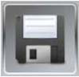

## 8.3 CONFIGURING SCHEDULED TASKS

In the *Scheduled Tasks* window, you can change how the *StarWatch SMS* server performs scheduled
maintenance, such as expiring cards or access levels, and how it handles the clearing of access times.
Default
Section
Name
Description
Setting
Daily
Scheduled time
Set the time when the daily maintenance
02:00am
Maintenance
will take place.
Expire credentials
Set whether credentials (cards) can be
Enabled
expired on the system.
Expire access levels
Set whether access levels can be expired
Enabled
on the system.
Enabled
Suspend credentials
Set whether credentials are suspended if
not re-validated
not re-validated within the re-validate
time period. See "Suspend Credentials:"
below.
Disabled
Locate all persons
Set
whether
all
persons
currently
off-site
considered in “access” are automatically
moved off-site (i.e. manually marked as
having
exited
the
premises
being
monitored)
Re-validate Period
Set the time period in which card holders
2 days
can re-validate their card.
60 days
Person
inactivity
Set
the
inactivity
time
period
on
time period
credentials
before
suspending
access
privileges. See "Person inactivity/Relegate
inactive persons:" below.
Disabled
Relegate
inactive
Set whether to relegate an inactive card
persons
holder’s
information.
See
"Person
inactivity/Relegate
inactive
persons:"
below.

Disabled
Person
Clear
levels
on
Set whether to clear access levels when a
Access Levels
changing
access
person’s access permissions change. See
permission
"Clear
levels
on
changing
access
permission:" below.
Enabled
Set whether to create a new access group
Create access group
for a new access portal, or to place the
for
new
access
new access portal into the default “No
portal
access” group. See "Create access group
for new access portal:" below.
*Suspend Credentials*: The re-validation process involves conducting an inventory of all issued cards for
a particular site and each card holder must visit the validation stations and present the card within the
validation period timeframe. If the card is not shown and re-validated, it can be automatically
suspended and will then prohibit the card holder’s access privileges.
*Person inactivity/Relegate inactive persons*:  If a card holder does not visit the site for an extended
period of time, you may want to have them automatically marked as inactive. The system can expire
those cards, suspend access privileges, and delete the card holder’s information.
*Clear levels on changing access permission*:  If you have assigned a new access permission to a person,
the system can automatically clear any special access levels that may have previously been assigned (in
addition to the basic permissions) as a safety precaution. This option is generally used in higher
security applications.
*Create access group for new access portal*: When you add a new access point (e.g., a door or access
portal) to the system, it is assigned to a special group labeled “No access” where it will remain until it
is placed into an existing group. This option allows a new group to be added automatically (instead of
the default group). This option is recommended on systems that have less than 50 doors.

To change the schedule settings for the *StarWatch SMS* server:
Step 1. In the *Scheduled* window, make the necessary changes to the information.

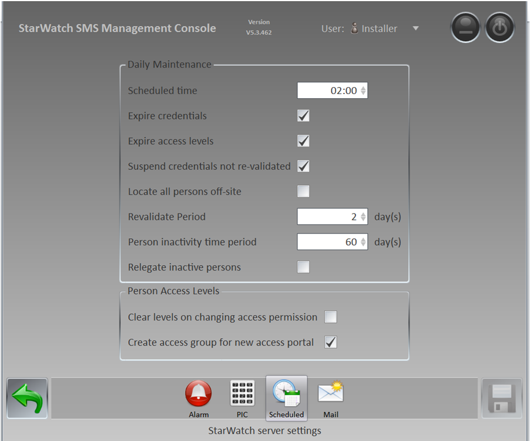

Step 2. When the changes are complete, click *Save* to save your changes.

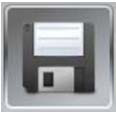

## 8.4 CONFIGURING SMTP MAIL OPTIONS

*StarWatch SMS* contains an email notification functionality, allowing for the optional transmission of
certain selected alerts to a specific email address whenever the chosen alarms or events occur.
Note: you must have access to a valid SMTP server to use the automated e-mail sources.
The *StarWatch SMS* server uses an SMTP host for automated e-mail functions. In the *Mail* window, you
can change how the *StarWatch SMS* server handles the automated e-mail features:
Section
Name
Description
Default Setting
SMTP Host
Specifies the SMTP host for mail.
Automated
smtp.gmail.com
Email
Enable SSL
Set whether to use SSL protocol or not.
Enabled
Settings
SMTP user
Specifies the SMTP user. This is user-
<smtp_user>@email.com
defined.
SMTP Password
Specifies the SMTP user’s password. This
******
is user-defined.
Mail From
Specifies who the mail is to be sent
<smtp_user>@email.com
from. This is user-defined.

To change the mail settings for the *StarWatch SMS* server:
Step 1. In the *Mail* window, make the necessary changes to the information.

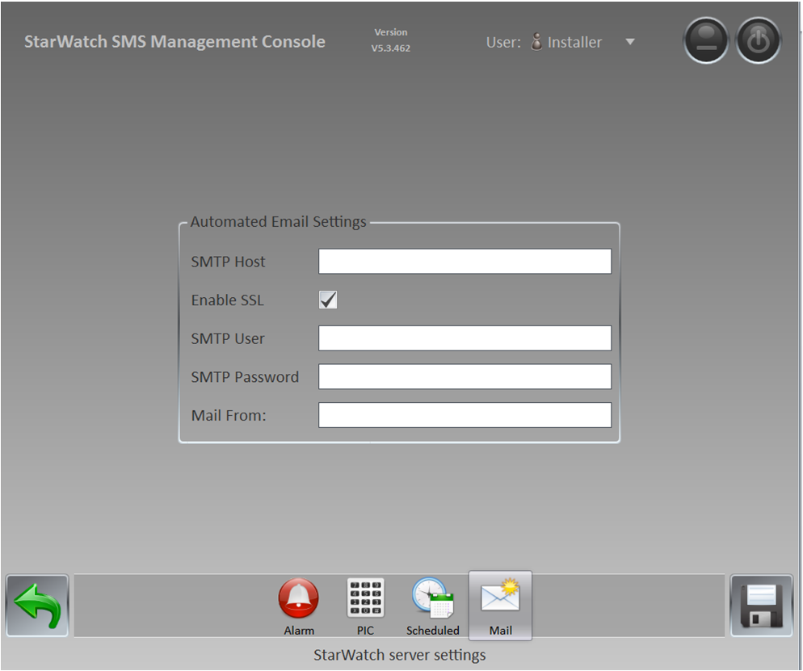

Step 2. When the changes are complete, click *Save* to save your changes.

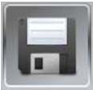

## 8.5 MANAGING THE STARWATCH SMS ORBIT.NET SETTINGS

Note: to follow these instructions, open the *StarWatch SMS Management Console*, click the *Services* tab
at the bottom of the main window, click on the *StarWatch SMS Orbit.NET* service from the list of
services to select it, and then click the *Settings* button.
There is one settings window for the *StarWatch SMS* Orbit.NET process:
Icon
Settings
Description

Timing
Sets various timings intervals, such as update refresh rates and device
driver startup/shutdown times. See “Configuring the Timings Settings”
on page 3-39.
Note: current timing settings have been set and should not be changed unless done by a trained system
administrator.

## 8.6 CONFIGURING THE TIMINGS SETTINGS

In the *Timings* window, you can configure various driver cancel intervals, refresh timeouts, update
intervals, and maximum updates per interval.
Section
Name
Description
Default Setting
Timings
Cancel driver startup after
Sets the time after which the driver startup
01:00
will be canceled. Format is min:sec
Cancel
driver
shutdown
Sets the time after which the driver shutdown
01:00
after
will be canceled. Format is min:sec
Periodic refresh interval
Sets
the
periodic
refresh
interval
for
1 second
background updates. Value is in seconds.
Periodic
updates
per
Sets the number of updates per refresh
10
interval
interval. See "Periodic Updates Per Interval".
10:00
Periodic data refresh rate
Sets the periodic data refresh rate for a
complete device driver point values refresh.
Value is in min:sec. See "Periodic Data Refresh
Rate".
40 seconds
Update monitor period
Sets the interval of updating the monitor.
Value is in seconds. See "Update Monitor
Period/Recovery/Maximum and Recovery".
10 seconds
Update recovery period
Sets the interval of recovery updates. Value is
in seconds. See "Update Monitor Period/
Recovery/Maximum and Recovery".
Maximum
updates
per
Sets the maximum number of updates per
40
period
period.
See
"Update
Monitor
Period/
Recovery/Maximum and Recovery".
Recovery
updates
per
Sets the number of recovery updates per
4
period
period.
See
"Update
Monitor
Period/
Recovery/Maximum and Recovery".

*Periodic Updates Per Interval* - This is the number of background updates that are transmitted from the
device driver’s real-time point values (such as status, analogs, access points and alarm points). The
default value of “10” specifies that ten points are to be refreshed every second (“one second” being
the configured the refresh interval). On larger systems that have more powerful servers, it is possible
to increase this value to as high as 50 if needed.
Each update refreshes the time of update and the current value in the database, even when a value
has not changed. When a state change occurs all changes are reported in real-time and do not depend
on the periodic refresh.
*Periodic Data Refresh Rate* - This is the frequency at which a complete refresh cycle will begin/restart.
The default of ten minutes ensures that every ten minutes the refresh scan will start and updates will
be reported at one second intervals until all values have been refreshed.
*Update Monitor Period/Recovery/Maximum and Recovery* - These features protect the system from
having a single real-time point state flood the system with excessive message traffic. This type of flood
could cause performance degradation and could be the result of a faulty or incorrectly configured
sensor, or could be the symptom of sabotage resulting from the malicious triggering of a device very
rapidly in an attempt to take down the system.
Note: typically, these settings do not have to be changed, unless instructed by a DAQ Electronics
customer service or support representative.

To configure the timings settings for the *StarWatch SMS* Orbit.NET service:
Step 1.  In the *Timings* window, make the necessary changes to the information, using the scroll bars
associated with each field.

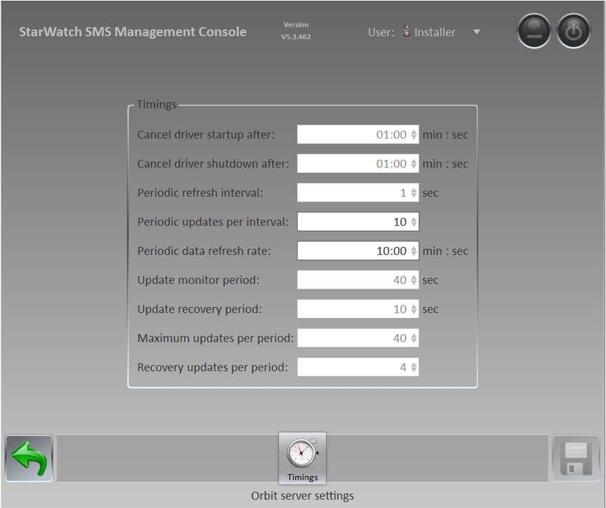

Step 2. When the changes are complete, click *Save* to save your changes.

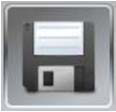

## 8.7 MANAGING THE STARWATCH SMS EVENTPRINTER SETTINGS

The *StarWatch SMS* EventPrinter service logs every event and alarm that occurs on the system and
prints it out to a dot matrix printer. This is performed within the *StarWatch SMS Operator* application
via the *Event Viewer*, as long as the EventPrinter service is running.

## 9.0 MANAGING THE FULL SQL DATABASE

In the *Maintenance* window of the *StarWatch SMS Management Console*, which is only available if you
are using the full version of SQL, you can create and manage database jobs, which are management
procedures that operate on your system’s database.  This section describes the types of jobs available
and how to use them.
The functions available in the *Maintenance* window are:

Create a job

Delete a job

Manually run a job

Create a schedule to run a job

Delete a schedule that runs a job
Note: to follow these instructions, open the *StarWatch SMS Management Console* and click on the
*Maintenance* tab at the bottom of the window.

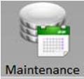

## 9.1 CREATING A JOB

To create or schedule a job:
Step 1. In the *Maintenance* window, click the *Jobs* button on the right - the *Jobs* screen opens.

Step 2.  Click *Create* (the green plus icon at the bottom) to create a new job. The new job is listed with
any other available jobs in the *Jobs* list at the top of the window. Using the check boxes in the *Delete*
*Records* section, select the various records that you wish to have removed from the database when the
job is run. Be certain that you want to have these items removed; they are not recoverable after the
job is run unless you have a backup of the database.
Step 3.  Click on the *Schedules* icon on the left to select a schedule to associate this job to – this will
dictate when and how often the job will be run.
From the list of available schedules, select the correct schedule for running this job, and when done,
click *Save* to save the changes. If you do not want to assign the job to a schedule at this time, or wish
to run it manually at a later time, simple click *Save* without selecting a schedule.

## 9.2 DELETING A JOB

To delete a job:
Step 1. In the *Maintenance* window, click the *Jobs* button on the right - the *Jobs* screen opens.

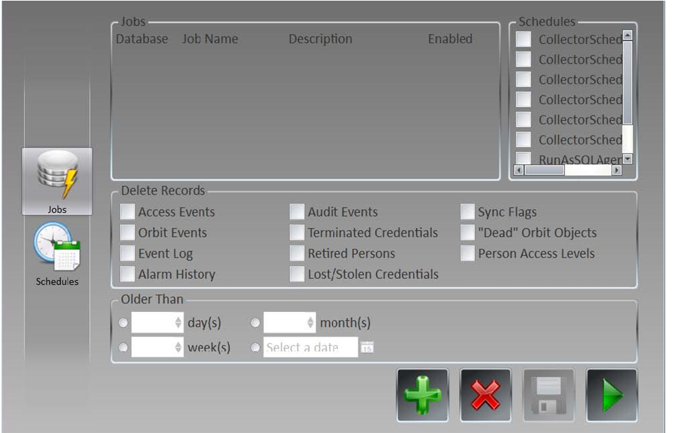

Step 2.  Click on the job that you want to delete to select it and then click *Delete* (the red X icon at the
bottom of the screen) to delete the job. The job is deleted and no longer appears listed with the other
available jobs in the list.

## 9.3 MANUALLY RUNNING A JOB

To manually execute an existing job:
Step 1. In the *Maintenance* window, click the *Jobs* button on the right - the *Jobs* screen opens.

Step 2.  Click on the job that you want to run to select it and then click *Run* (the green arrow icon at
the bottom of the screen) to initiate the job – it will begin immediately.

## 9.4 CREATING A NEW JOB SCHEDULE

To create a new schedule for automatically executing linked jobs:
Step 1. In the *Maintenance* window, click the *Schedules* button on the right - the *Schedules* screen
opens.

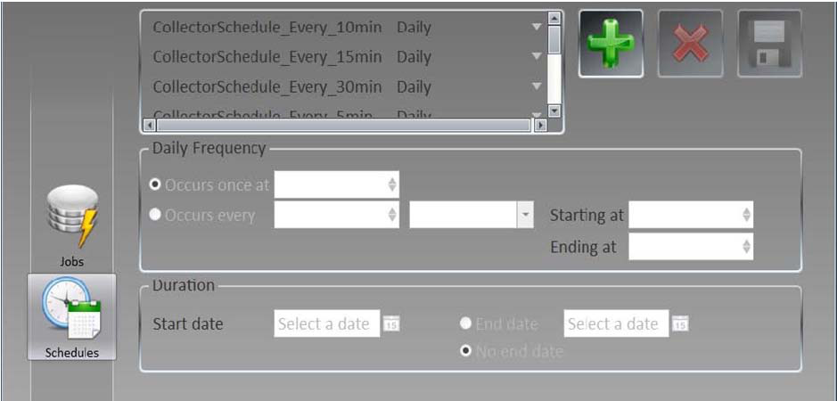

Step 2.  To create a new schedule, click the *Create* button (the green plus icon). The new schedule is
listed in the available schedules list. Select the desired options for frequency, duration and time and
then click *Save* to save the new schedule.

## 9.5 DELETING A SCHEDULE

To delete a schedule:
Step 1. In the *Maintenance* window, click the *Schedules* button on the right - the *Schedules* screen
opens.

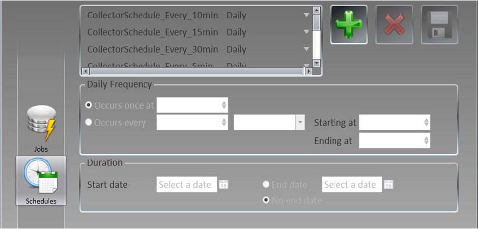

Step 2.  Click on the schedule that you want to delete to select it and then click *Delete* (the red X
icon). The schedule is deleted and no longer appears listed with the other available jobs in the list.

## 10.0 CONFIGURING SYSTEM FILE SETTINGS

In the *System* window of the *Management Console* you are able to view and manage the various file
paths used by the system.  The default settings are correct for a newly installed system, and changing
these values could result in loss of system functionality.  Only change these settings if you are certain
of the correct path values, or are being assisted by a network administrator, DAQ Electronics helpdesk
staff or an authorized reseller. Changes to these values are accomplished through configuration files,
which may be provided to you by your network administrator or your software integrator.  Additionally
you may export configuration files that describe the current settings – this could be useful for moving a
system or recreating it at a new location.
Note: to follow these instructions, open the *StarWatch™ SMS Management Console* and click the *System*
tab at the bottom of the main window.

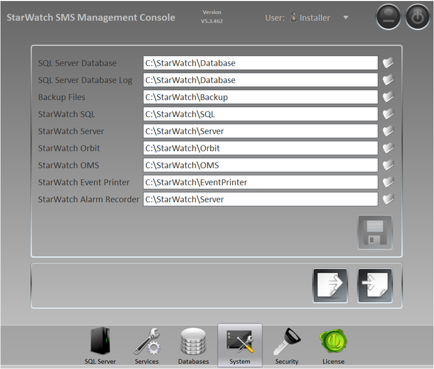

## 10.1 IMPORTING STARWATCH SMS SYSTEM CONFIGURATION FILES

To import *StarWatch SMS* system configuration files:
Step 1. In the *System* window, click on the *Import* button (the icon showing an arrow pointing towards
a file) and the *File Chooser* window appears.

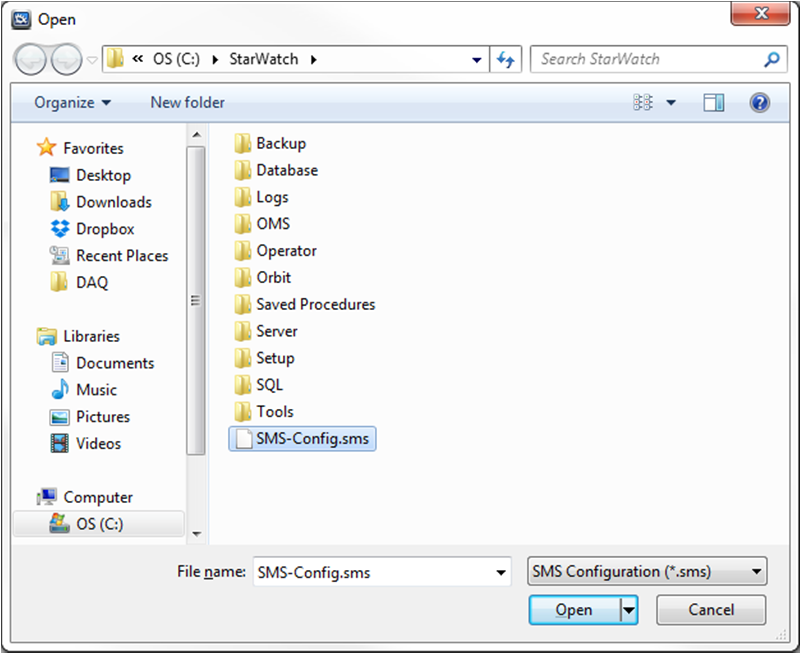

Step 2. Select the desired configuration file and click *Open*. The *Import* window opens.

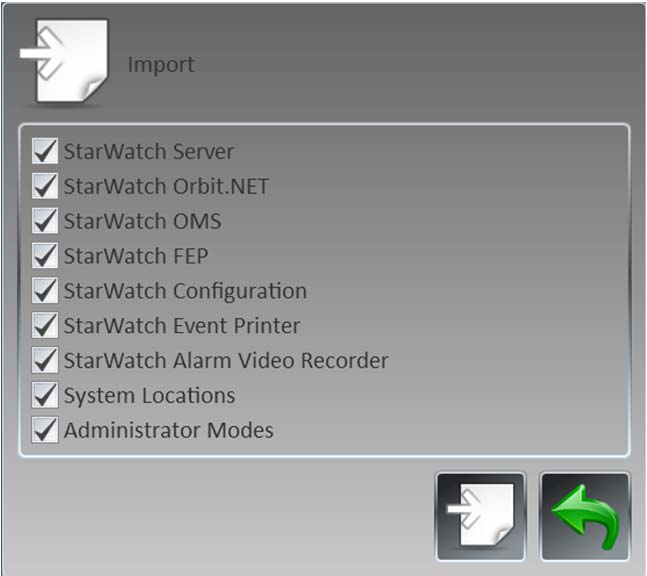

Step 3. Select the individual configuration options that you want to import from the configuration file –
these will override your current settings once imported.  Once you have made your selections, click on
the *Import* button to proceed with the operation.

## 10.2 EXPORTING STARWATCH SMS SYSTEM CONFIGURATION FILES

To export *StarWatch SMS* system configuration files:
Step 1. In the *System* window, click on the *Export* button (the icon showing an arrow pointing away
from a file) and the *Export Settings* window appears.

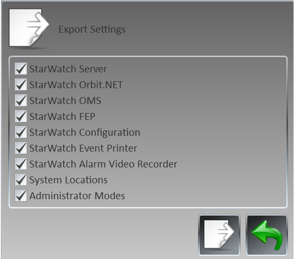

Step 2. Select the individual configuration options that you want to export into a new configuration file
and then click on the *Export* button to proceed with the operation.

Step 3. The *File Chooser* window appears – navigate to a location that you would like to save the file
in, and type a file name for the new file.

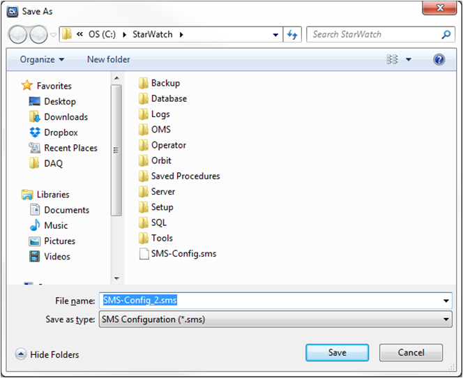

Step 4. Click on *Save* to complete the operation and export the settings to your new file.

## 11.0 MANAGING SECURITY OPTIONS

The *Security* window within the *Management Console* is where you manage user rights and passwords
for access into the *Management Console* itself. Because the settings and functions within the
*Management Console* are essential to the operation of the system, this area can be protected with
special account access.  Please note that the users and roles discussed in this section are unique to the
*Management Console* only – these are not the same as workstation users and enrolled system credential
holders.
For administrative access to the *Management Console*, three user types exist:

Admin - granted several rights to modify operational options in several screens.

Installer - granted fewer rights, such as activating the product license.

Support - full privileges, all functions and options available. This function is only available to
DAQ Electronics support engineers.
Note: to follow these instructions, open the *StarWatch SMS Management Console*, and click the
*Security* tab at the bottom of the main window.

## 11.1 MODIFYING A USER’S RIGHTS

To modify a user’s rights according to the user type:
Step 1.  In the *Security* window, click on the user type that you want to modify rights to (Installer or
Admin) to select it. The options in the *Rights* pane will change to reflect the enabled rights for the
selected user.

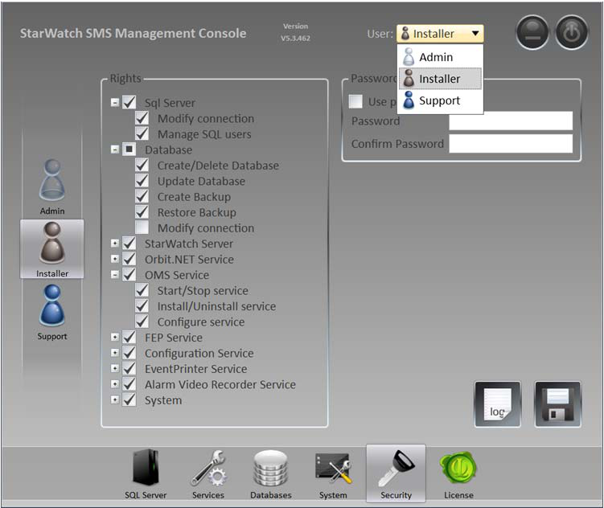

Step 2.  To expand each category of user rights in order to see all of the available options, click on the
associated *+* sign to the left of each category.  You may disable or enable rights by selecting the box, a
check mark indicates that rights to this function have been granted to the user. To save the changes,
click on the *Save* button (the icon with the image of a floppy disc).

## 11.2 MODIFYING PASSWORD PROTECTION

To modify the password associated with a login type:
Step 1.  In the *Security* window, select the user type whose protection you want to modify by choosing
it from the *User* list at the upper right side of the window.

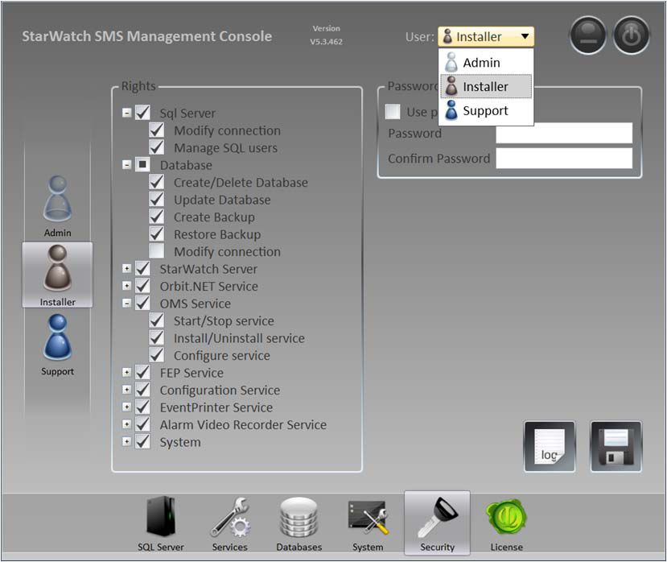

Step 2.  To enable password protection for the selected user type, first select the check box marked
*Use Password* and then type the desired password in the *Password* text box. Confirm the password by
re-typing it into the *Confirm Password* text box and then click on the *Save* button (the icon with the
image of a floppy disc) to finalize the change.

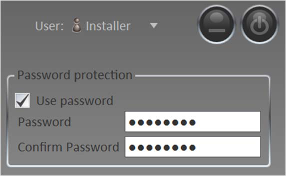

---

*© DAQ Electronics, LLC*
