# Operator Console

## 1.0 INTRODUCTION

Welcome to *StarWatch SMS*, the premier security management system. This document will lead you
through basic operations, including enrolling on-site personnel and visitors into the system database,
processing alarms, using area maps to track the status of peripheral devices, and creating detailed
reports of system events.

## Roles and Rights

Depending on the roles and rights you have been assigned within the *StarWatch SMS* database, you may
not be able to perform all the processes described in this guide. For example, system operators may
only have rights to enroll personnel and process alarms, while system administrators may be granted
full editing and configuration rights. For information on the specific operations you are permitted to
perform, please see your system administrator.

## Customization

To optimize the efficiency of each security system, *StarWatch SMS* allows users to customize the
various screens and functions available within the software package. Due to this high degree of
flexibility, some of the instructions and screen captures presented in this guide may differ somewhat
from what appears on your screen as you go through the various security management processes. An
attempt has been made to offer the most generic views possible to help avoid confusion.
Note: when dealing with very large databases, it may take the system a moment to refresh after you
have issued a command or clicked on a function button, depending on your system speed. It is not
necessary to click functions multiple times. In fact, doing so may cause the workspace to become
disorganized, as the same window or tab may be unintentionally opened multiple times.

## 1.1 LOGGING INTO THE OPERATOR APPLICATION

Before starting a *StarWatch SMS* operating session, it is necessary to log into the system. For the initial
login to the application, you must login on the StarWatch SMS Server computer. Note: if you do not
want to use the default username and password combination, create a personal login for the System
Administrator and use that login for subsequent logins from workstations.
Note: once you have logged in, many of the actions you take during your session will be recorded in the
database with a signifier linking each event with your specific user name. Recorded actions include
alarm processing steps, user enrollment procedures, and other system events.

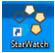

If the *Operator* interface has not already been launched, double-click on the *StarWatch*
icon on
your Windows desktop. If you did not create this shortcut during the installation process, click the
*Start* menu, select the *All Programs* option, and open the *DAQ Electronics* folder.

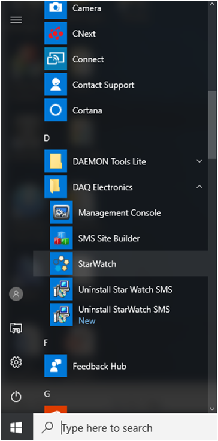

From the list of all installed *DAQ Electronics* applications, select the StarWatch option.

After a short loading sequence, the *StarWatch SMS* login screen will appear.

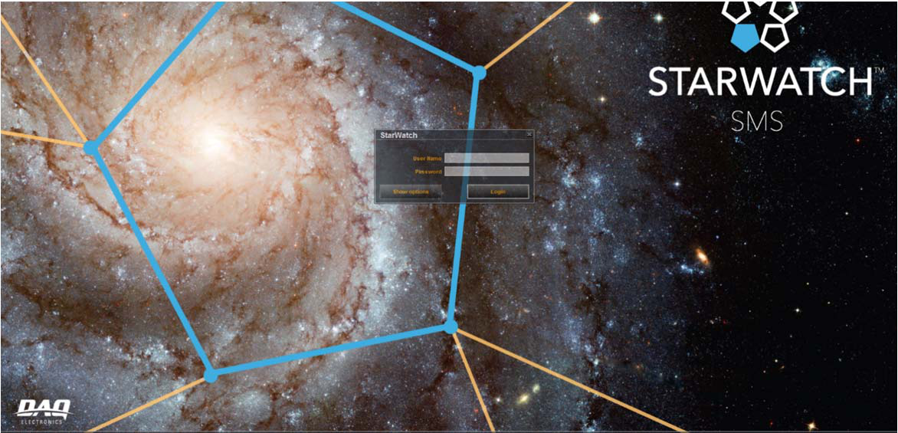

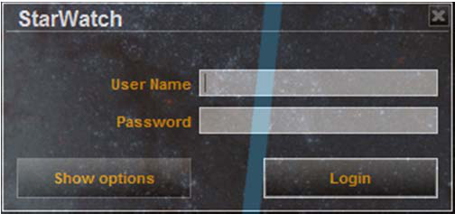

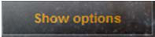

Next, to expand the viewable parameters, click the
button.

Additional login details will appear in the window.

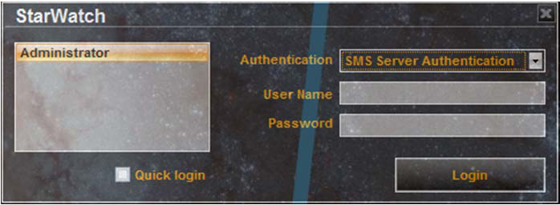

If Windows authentication is required within your network or you are using Common Access Cards
(CAC), click the *Authentication* drop-down list and select the *Windows Authentication* option.
Otherwise, select the *SMS Server Authentication* option.
In the *User Name* and *Password* fields, type in the login information you created or use the default
login and passwords.
**Field**
**Default**
User Name
admin
Password
admin
Note: see your System Administrator if you do not know your login details.
Note: the *Windows Authentication* option is for Active Directory based setup, while *SMS Server*
*Authentication* applies to logins set by the operator (reference users).
Note: the *Quick Login* option loads no workspace (reference workspaces).

After entering your user details, click the
button or press the *Enter* key on your
keyboard. A loading message will appear on the screen, followed by the main *StarWatch SMS* operator
interface.

Note: the loading sequence may take several seconds, depending on system speed.

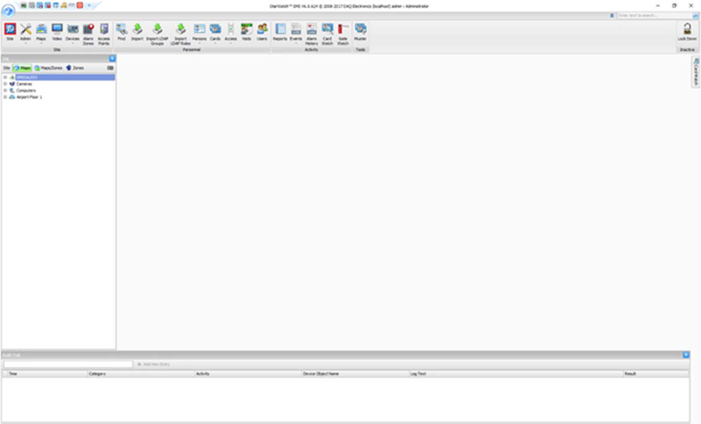

## 1.2 GENERAL FUNCTIONALITY

The main *StarWatch SMS* screen has been designed to allow operators to easily locate and utilize all
the functions and views available in the system. The system also enables you to customize the screen
layout to match your preferences. Before setting up your specific security configuration, it is
recommended that you familiarize yourself with the various on-screen features and options, as many of
these features will be used in multiple areas of system operation.

## 1.2.1 MAIN RIBBON TAB

Like many new software packages and web browsers, *StarWatch SMS* uses tabs to organize on-screen
content. The goal of this configuration scheme is to provide the user with quick access to required
information and to enable the system to display multiple security aspects simultaneously.

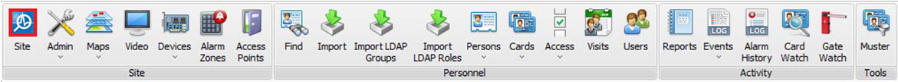

## Applications

Appearing in the main workspace, functions display the core content used to configure and operate
*StarWatch SMS*. Functions can be opened by clicking on icons in the *Main Ribbon* toolbar at the top of
the screen. As multiple applications are opened, they will appear as a row of tabs.

In the example below, three functions (tabs) have been opened in the main workspace. While all of
these functions remain active, only one can be displayed at the top of the workspace. In this case, the
*Admin* tab is positioned in front of the other open tabs.

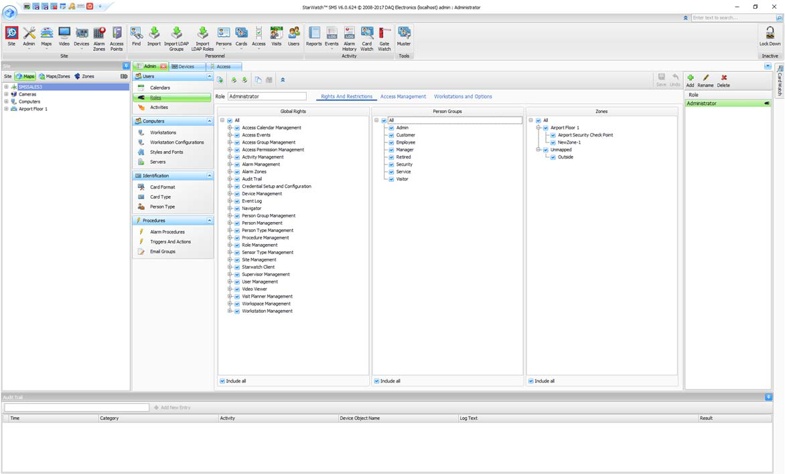

To bring a function to the top of the workspace, simply click on the associated tab.

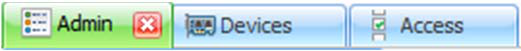

The order of active functions can be changed by clicking on a tab and dragging it horizontally to the
left or right and dropping it in a new location in the row. Functions can also be detached and moved to
new areas of the workspace using the docking feature (see section 1.2.2 DOCKING).

Note: functions will remain open until you click on the *Close*
symbol on the appropriate tab.

## Sub Tabs

Appearing at the bottom of functions, sub tabs allow users to access multiple levels of content within
the same function. In the example shown below, there are several sub tabs available at the bottom of
the *Persons* function.

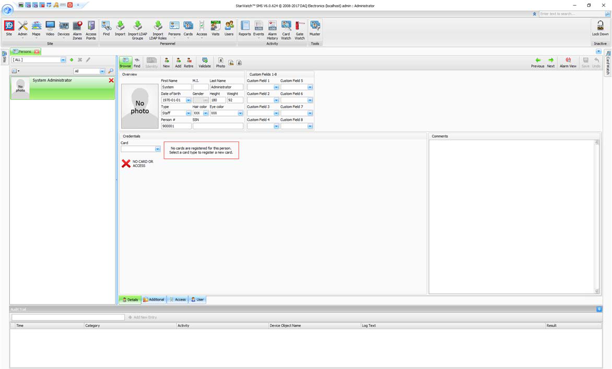

To bring the content displayed within a sub tab to the top of the workspace, simply click on the
associated tab.

Unlike functions, which can be re-positioned within the workspace, sub tabs are permanently
positioned within their associated function and cannot be dragged to new locations.
Note: depending on the selections you make as you move through various system processes, additional
sub tabs may become available within a function.

## Edge Pop-out Tabs

Edge tabs provide access to several critical functions within *StarWatch SMS* and are permanently fixed
to the outer edge of the main workspace. An example is the *Card Watch* tab that appears along the
right-hand edge of the workspace near the top of the screen.

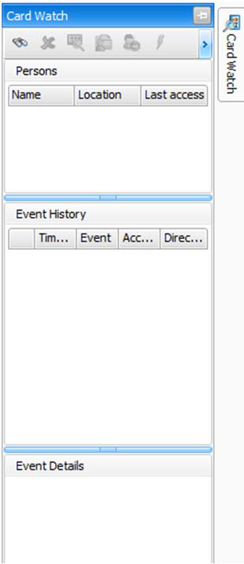

Another example is *Site* pop-out that appears on the left-hand edge of the workspace near the top of
the screen.

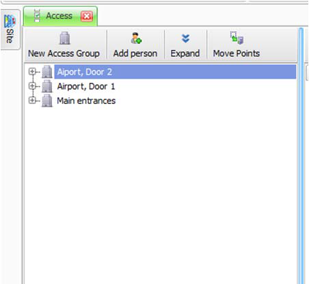

To access the system information contained within an edge tab, simply roll your mouse over (hover
over) the tab or click on it directly. A related viewer will appear on the screen and remain until you
roll your mouse off the edge tab or viewer.
Viewers accessed using edge tabs can be affixed to the screen using the pinning function, which
disables the roll off feature.

To keep a viewer on your screen, click the *Pin*
icon in the upper right-hand corner of the viewer
space. The viewer will now remain onscreen even when you move your mouse to other areas.

**NOTE:** once a viewer has been pinned, the sideways *Pin*
icon will change to an upright *Pin*
icon.
Clicking this upright *Pin* icon will return the viewer to the unpinned state.

## Start Menu

The *Start* menu is located in the top left corner of the operator screen and includes several
applications that are less frequently used.

Clicking on the *Start*
icon will display the available options.

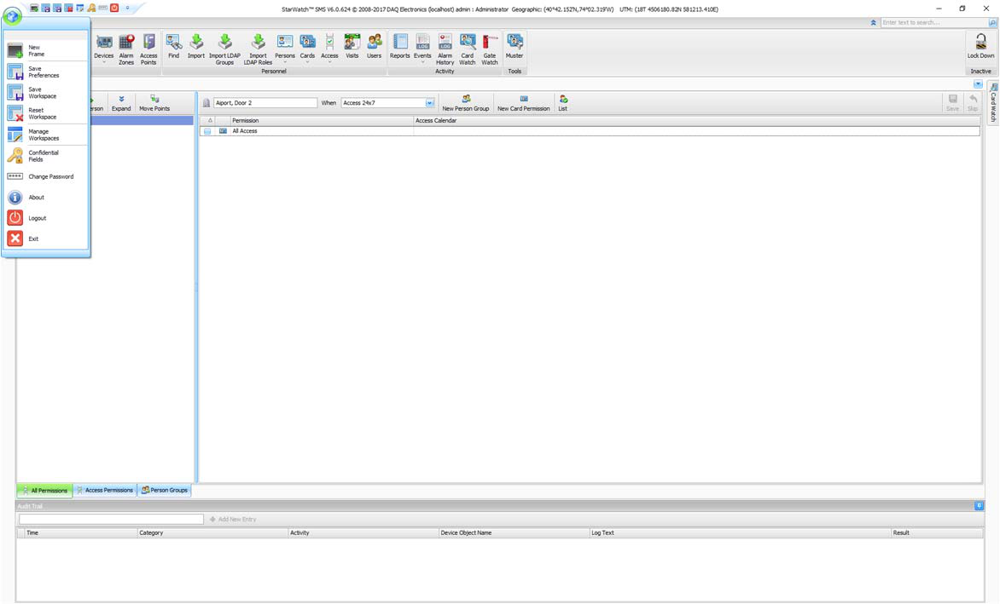

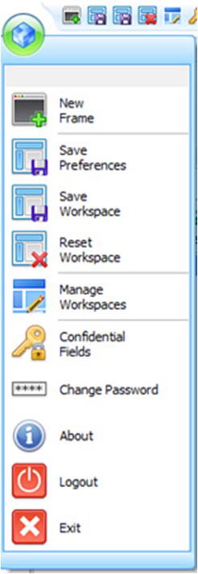

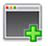


New Frame
Usually utilized when a system has been configured for multiple monitors, the *New Frame*
button will launch a *StarWatch SMS* frame window, which can be dragged to the display
area on the monitor of your choice and maximized. The shaded space provided in the
window can now be used as an additional working area. You can drag detached folders
from the main monitor to linked monitors and drop them where desired. You can also re-
position the main *StarWatch SMS* interface on the monitor of your choice. Each monitor will
retain docking and resizing functionality separately, creating a highly flexible work area.

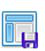


Save Preferences
The system allows you to save any changes you make to default system settings related to
the display or configuration of data within the *StarWatch SMS* user interface. For example,
the system allows you to alter the appearance of data grids by changing the column order
and to adjust the filtering settings used when displaying devices within a site map. Using
the *Save Preferences* button, these types of preferences can be saved as new default
settings.

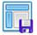


Save Workspace
Clicking the *Save Workspace* button will save any configuration changes you have made to
the visible user workspace. For example, you may have created a workspace that allows
you to simultaneously view a specific area map and associated alarms. Instead of
recreating this workspace each time you login, you can save the new layout as the new
default setting.

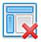


Reset Workspace
Clicking the *Reset Workspace* button will discard any configuration changes you have made
to the visible user workspace and revert back to the original settings. Once you have saved
a workspace, this option will not be available.

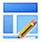


Manage Workspaces
Clicking the *Manage Workspace* button allows you to create new workspaces, delete
existing workspaces, and update and load workspaces that can be called to the screen
depending on the needs of the user.


Confidential Fields
The *Confidential Fields* function is used when viewing personnel profiles that contain
confidential information. Only operators who have been assigned appropriate rights will be
able to view these protected user details.

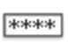

Change Password

The *Change Password* function allows an operator to change their login password at any
time.

Logout

The *Logout* button allows you to logout of the system without closing the *StarWatch SMS*
application. Clicking this button will return you to the main login page.

Exit Operator Console

Clicking the *Exit Operator Console* button will shut down the *StarWatch SMS* system at the
current workstation. A warning will appear asking you to confirm that you want to close
the application.

Appearing immediately to the right of the *Start*
icon at the top left of the screen, the
customizable *Quick Access* toolbar provides one-click access to the *Start* menu functions. The toolbar
can be modified to include those functions you use most often.

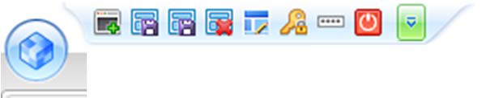

Clicking the *Customize*
icon to the right of the *Quick Access* toolbar will call up a drop-down menu
allowing you to select the various functions for inclusion on the toolbar.

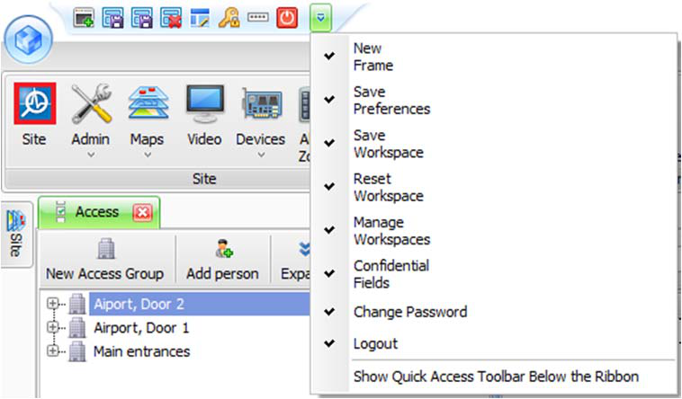

## 1.2.2 DOCKING

The *StarWatch SMS* docking feature allows system users to customize the look of their workspace by
moving functions to new areas on the screen.

## Detaching Functions

Using simple click and drag functionality, functions can be detached from the main workspace. In the
example shown below, two functions have been opened in the main *StarWatch SMS* workspace.

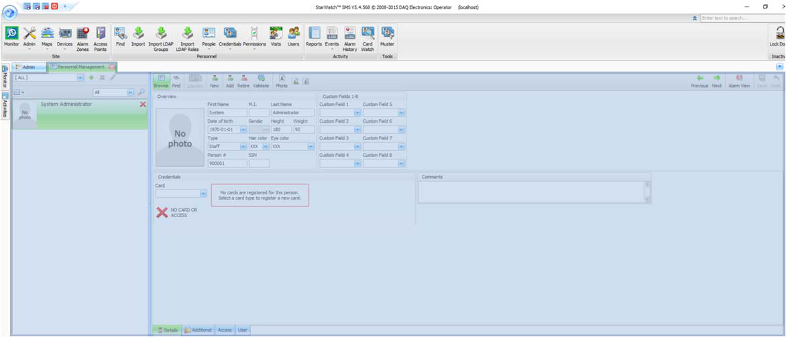

To detach a function to its own separate window, you can simply click on the appropriate tab and drag
it away from the row of tabs at the top of the main workspace. The detached function will act as a
moveable on-screen floating window, appearing in front of all other page content.

In the example shown below, the *Persons* application has been detached.

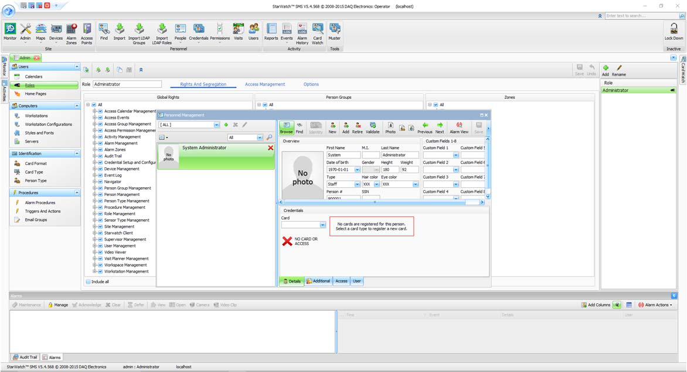

## Using the Docking Icon

When moving a detached function around the screen, a docking icon will appear in the middle of the
workspace.

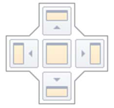

This icon enables you to place, or “dock”, the function into a new position, dividing the workspace
appropriately. When moving a function, dragging your cursor across one of the four directional

indicators on the docking icon (*Left*
, *Right*
, *Up*
, or *Down*
) will cause an area of the
screen to become shaded a transparent blue. This shaded area indicates where the function will be
positioned when you let go of the mouse button.

In the following example, the detached *Devices* function has been dragged across the *Left*
directional indicator on the docking icon. The left part of the main workspace is now shaded.

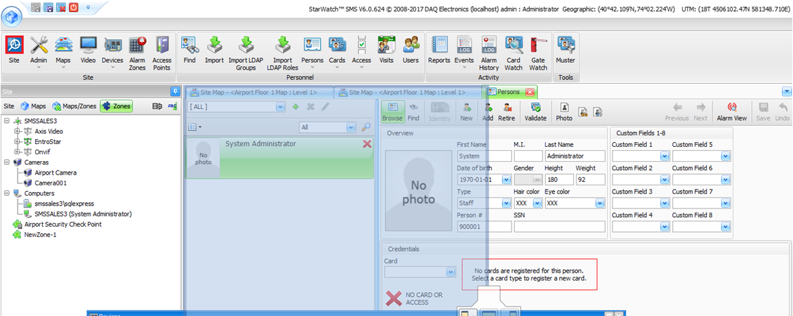

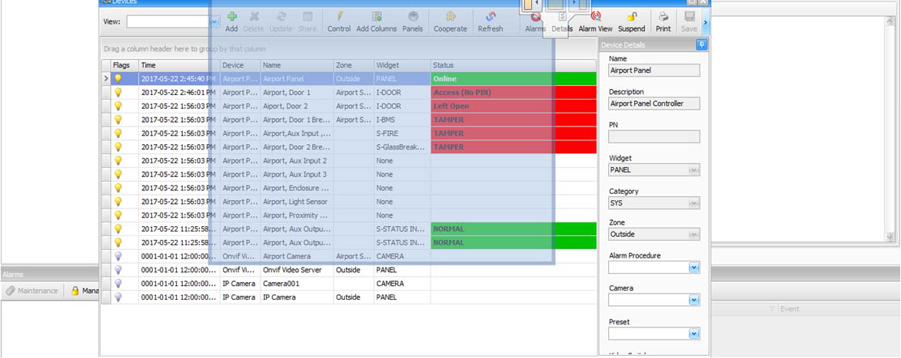

Letting go of your mouse at this point would result in the following screen configuration, with the
*Devices* application now docked into position to the left of the *Site Maps* and *Persons* applications.

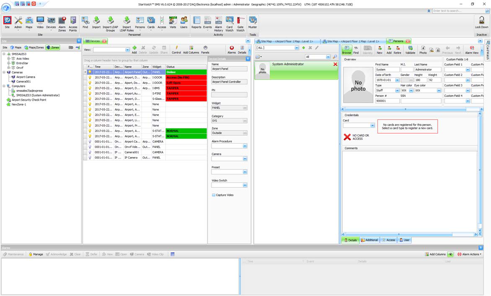

In this manner, the screen can be divided into any number of configurations, depending on the needs of
the user.
Note: to return a detached function to its original position in the row of tabs at the top of the

workspace, drag and drop the function on the central indicator
on the docking icon.

## 1.2.3 RESIZING

To facilitate clean, easy to navigate workspace configurations, *StarWatch SMS* allows you to resize the
various windows, functions, and work areas that are open on your screen.
When you slowly move your mouse across the dividing line between two workspace sections, a *Resize*

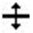

icon will appear. With this icon on-screen, you can click and drag dividing lines both vertically and
horizontally to optimize the use of the workspace. Along with adjusting dividing lines between separate
functions, the system also allows you to resize sections that simultaneously appear within a single
function.

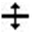

As with function dividers, you can adjust the position of section dividers using the *Resize*
icon.
Additionally, clicking once on a section divider will cause the divider to move to the far edge of the
screen in the direction indicated by the small black arrows on the divider, effectively covering over any
content in that direction. Clicking a second time will return the divider to the previous position. For
example, you may want to temporarily expand a section to enter specific details and then quickly
return to the prior configuration.

## 1.2.4 USING MULTIPLE MONITORS

The docking and resizing aspects of *StarWatch SMS* become especially powerful when more than one
monitor is used to display system information. For example, if your system has been configured with a
dual monitor setup, the main monitor might be used for personnel functions and alarm processing,
while the second monitor is used to display video feed from connected security cameras.
If your system has been set up with a multiple monitor configuration, you can enter multi-screen mode

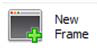

by clicking on the *New Frame*
icon in the *Start* menu at the top left of the screen. This will
launch a *StarWatch SMS* frame window, which can be dragged to the display area on the monitor of
your choice and maximized.

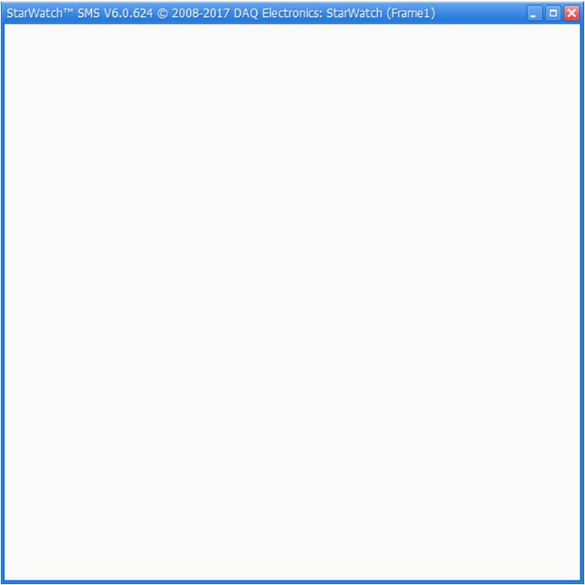

The shaded space provided in the window can now be used as an additional working area. You can drag
detached folders from the main monitor to linked monitors and drop them where desired. You can also
re-position the main *StarWatch SMS* interface on the monitor of your choice. Each monitor will retain
docking and resizing functionality separately, creating a highly flexible work area.

To add/dock an application to the new frame, you can simply right-click on an active application tab
then select the *Dock to…* option from the pop-up menu and send it to the frame.

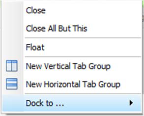

In the example below, we are docking the *Site Map* application into the new frame we have created.

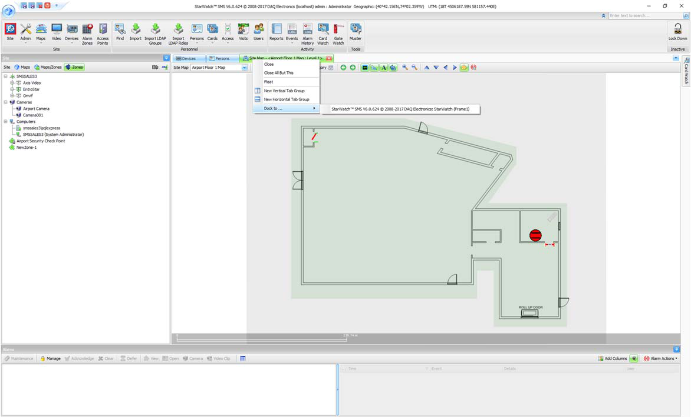

This allows us to have multiple applications opened in multiple views.

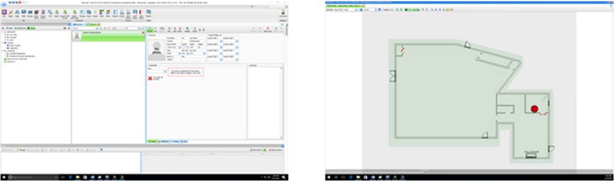

Note: this new configuration can also be saved as a workspace. In this manner, users will not have to
re-create views each time they start a new operating session.
Note: a separate docking icon will be available for each display space.

## 1.2.5 GRID CONTROLS

Within the *StarWatch SMS* operator system, many of the individual functions display data in
spreadsheet format. For example, the *Devices* function displays device data separated into several
categories, each represented by a column in the on-screen chart (*Flags*, *Time*, Device, *Name*, *Zone*,
etc.).

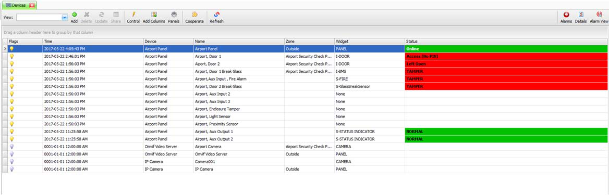

To make locating information in large databases more convenient, a number of column formatting and
sorting features have been provided for all spreadsheets used in the system.
Note: some grid features may not be available for all spreadsheet sections.

## Changing Column Order

You can arrange spreadsheet data to your preference by changing the order of columns. To move a
column, simply click on the header at the top of the column and drag it horizontally to a new location.
When you let go of your mouse button, the column will be dropped in the new location.
In the example below, the *Status* column has been dragged and dropped next to the *Device* and *Name*
tabs.

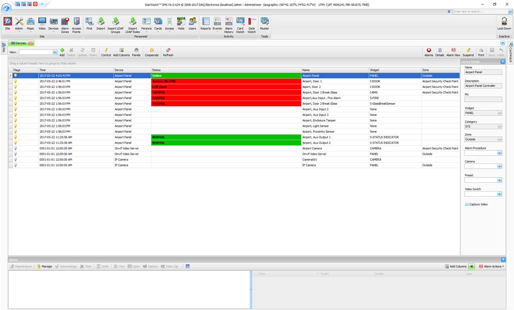

Note: if you move your mouse too far vertically when moving a column, a large black *X* will appear over
your cursor. This warns you that if you drop the column in this location, it will be removed from the
spreadsheet entirely. If you unintentionally drop/remove a column, you can retrieve it using the
*Column Chooser* function described later in this section.

## Resizing Columns

To display data more effectively, you can adjust the width of a column by positioning your cursor on
the line separating the header of the column you want to adjust from the header of the column
immediately to the right. When positioned correctly, the *Change Column Width*
symbol will

appear. With the *Change Column Width* symbol showing, you can click and drag the edge of the column
horizontally to increase or decrease the width of the column.

## Sort Ascending/Descending

You can sort column data in ascending alphanumeric order by clicking once on the column header. The

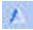

*Ascending*
symbol will appear in the header.

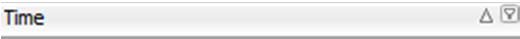

To sort in descending alphanumeric order, click on the header a second time. The *Descending*
symbol will appear in the header. The example below, we filtered the *Time* column to have the newest
entry on top.

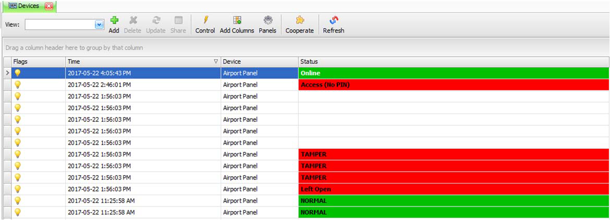

Note: clicking on a column header will sort all of the chart rows according to that parameter, either
using ascending or descending alphanumeric order. To sort by a different parameter, you can simply
click on another column header

## Direct Category Selection

Some columns also allow you to directly filter by a certain data type. If a column offers this

functionality, the *Filter*
symbol will appear when you click on the header. Clicking the symbol will
call up a drop-down list allowing you to select the data type you want to display in the column.
In the example below, the *Filter* symbol on the header of the *Widget* column has been clicked.

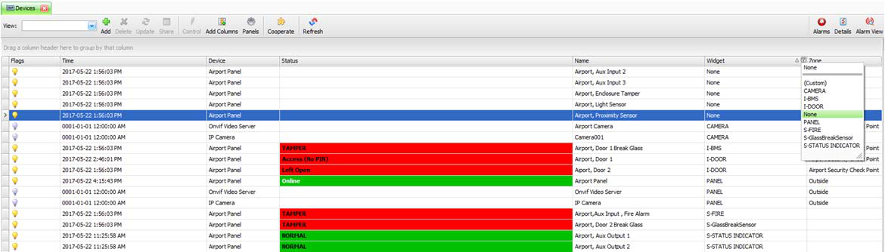

Next, the *None* option is selected from the drop-down list.

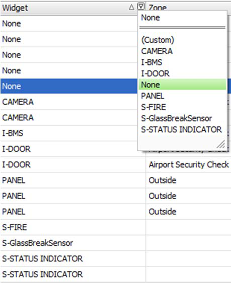

The resulting chart has been filtered to show only those rows that contain the *None* designation in the
*Widget* column.

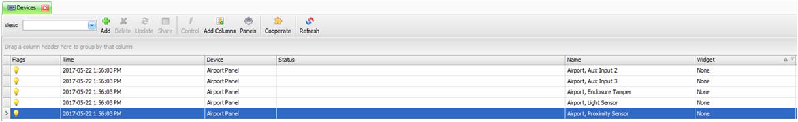

Once you select a data type, all rows that include other data types will be removed from the chart. To

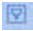

retrieve these other data types, you can click on the *Filter*
symbol again and select the *All* option
or right-click on the column header and select *Clear Filter*.

Note: you can resize a *Filter* drop-down list by rolling your mouse over the *Resize*
symbol in the
bottom right-hand corner of the list and clicking and dragging the corner.

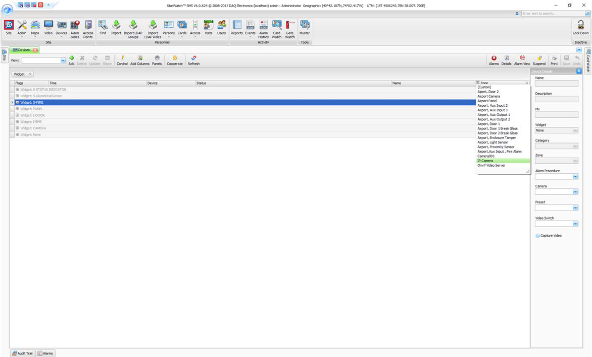

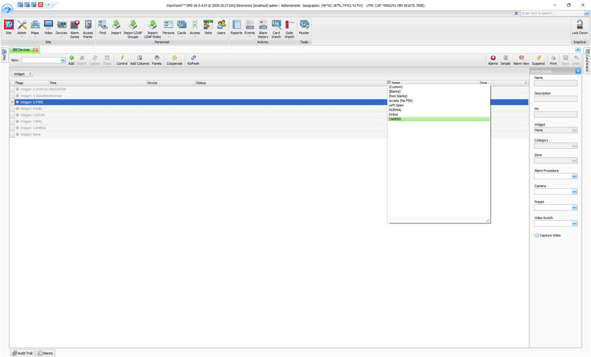

## Column Sorting Menu

Additional column sorting features can be accessed by right-clicking on any column header or other
areas of a grid. The *Column Sorting* menu will appear.

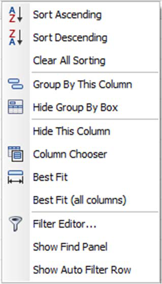

Note: depending on where you right-click on the screen, you may be presented with slightly different
menu options based upon the object you have clicked on and the current state of your grid. As an
example, the following screenshots show the variety of menu options that become available when
utilizing the grouping function to organize a grid.

Right-clicking in a grid that has not been grouped by a column header results in the following menu
options:

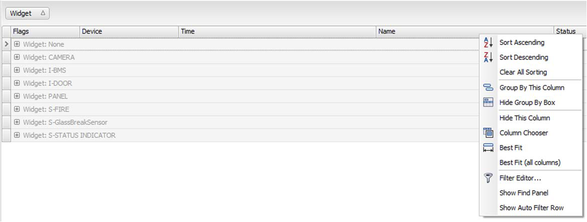

After a grid has been grouped by a column header, the following menu options are available:

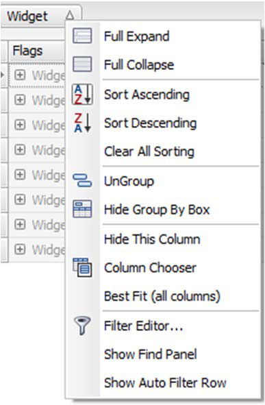

Clicking on any space in the grouping area will provide the following menu options:

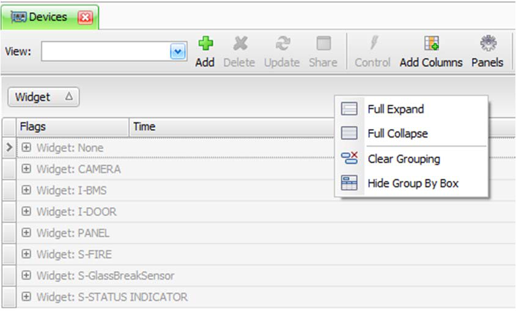

This variation in the number and type of menu items available is typical as you sort and organize your
grids to your preferred layout.

The following chart offers a brief description for each option in the *Column Sorting* menu and indicates
when each is available based on grouping status.

## Icon

## Name

## Grouped

## Ungrouped

## Grouping

## Description

## Column

## Column

## Area

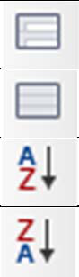

Full
●
●
Expand all data in the tree to show all
Expand
data rows for all points
Full
●
●
Collapse all data in the tree to hide all
Collapse
data rows for all points
Sort
●
●
Sort points in a column/group in an
Ascending
ascending order
Sort
●
●
Sort points in a column/group in a
Descending
descending order
Clear All
●
●
Clear all sorting that was done for
Sorting
selected groups/columns on a grid

Group by
List data according to a single
this
column/parameter
Column
Ungroup
●
Ungroup a selected column or header

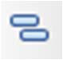

Hide Group
●
●
●
Hide the grouping area

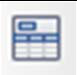

by Box

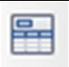

Show
●
Show the grouping area
Group by
Box
Hide This
●
●
Hide selected group and column from the
Column
grid – you can retrieve it using *Column*
*Chooser* to drag it back to the screen
Column
●
●
Allows you to directly select data columns

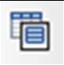

Chooser
to appear in the spreadsheet - when you
select this option, the *Customization*
window will appear where you can drag
and drop columns into your grid – note:
when dragging a new column into the
chart, a large black “X” will appear over
your cursor when you are not positioned
over an appropriate drop location - if you
drop the column while the “X” is on-
screen, the column will remain in the
*Customization* window
Best
●
Resizes selected column for the best fit

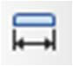

Fit
(width/size) on the screen
Best Fit (all
●
●
Fits data in all columns using the best
columns)
possible configuration

Filter
●
●

Calls up the *Filter Builder* window - by
Editor
clicking on the various sections of the
filter string and selecting appropriate
settings, you can build and apply
customized filters for the column. Once a
filter is applied, a filter editing row will
be added at the bottom of the data chart
enabling you to quickly adjust filter
settings, if needed.

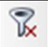

Clear
●
●
Removes any filtering that has been
Filter
applied to a column, returning it to the
original default settings - or you can hit
the X from the bottom of the data chart
to return to the default screen
Show Find
●
●
Launches a screen above the grouping
area where the user can enter/search the
Panel
data displayed in the system (useful for
large databases)

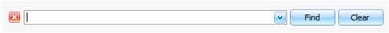

Hide Find
●
●
Hides the *Find Panel* window from the
Panel
screen
Show Auto
●
●
Launches an auto filter row allowing you
Filter Row
to filter rows by entered words
Clear
●
Clears all grouping applied to the page

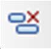

Grouping
and to selected columns

Further explanations for a number of these options are provided in the following sections.

Sort Ascending / Descending
You can sort column data in ascending alphanumeric order by selecting the *Sort Ascending*

option from the menu. The *Ascending*
symbol will appear in the active header.

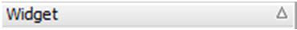

To sort in descending alphanumeric order, select the *Sort Descending* option. The

*Descending*
symbol will appear in the header.

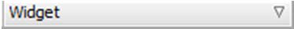

Note: clicking on a column header will sort all the chart rows according to that parameter,
either using ascending or descending alphanumeric order. To sort by a different parameter,
you can simply click on another column header.

Clear Sorting
Selecting the *Clear Sorting* option will return the column to the original default settings.

Group by This Column
You can list data according to a single parameter exclusively by selecting the *Group by This*
*Column* option. The following captures show a device list before and after it has been
grouped by the *Widget* parameter.

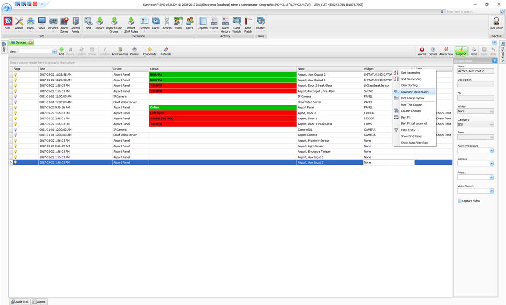

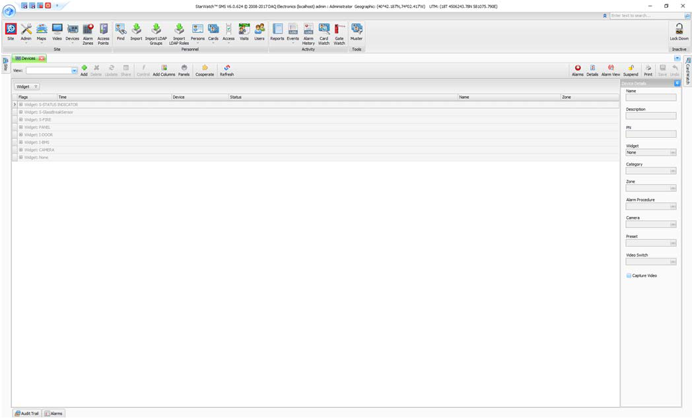

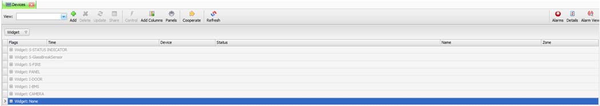


Full Expand / Full Collapse
Additionally, the device lists within each data class category can be separately expanded
and hidden, making large lists easier to navigate. You can expand a category manually by
selecting the small *Plus*  icon on the left-hand side of the appropriate row. To expand all

categories at once to show all hidden rows, right-click on the column header and select the
*Full Expand* option from the drop down menu.

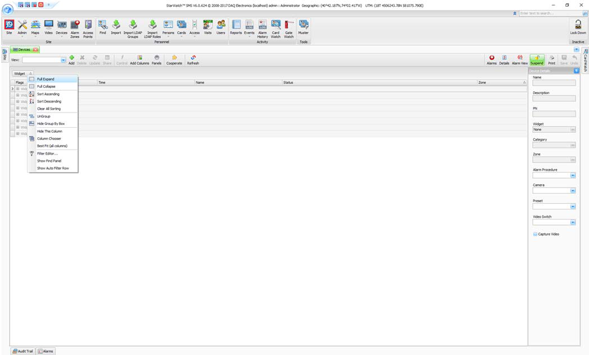

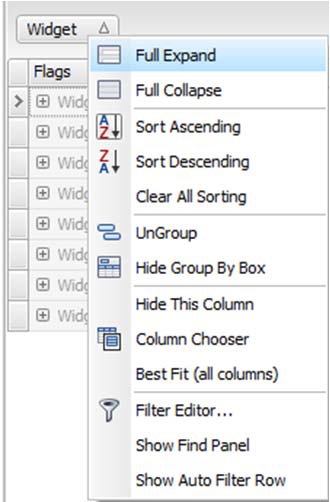

In this example, the *Full Expand* option has been selected for the *Widget* tab.

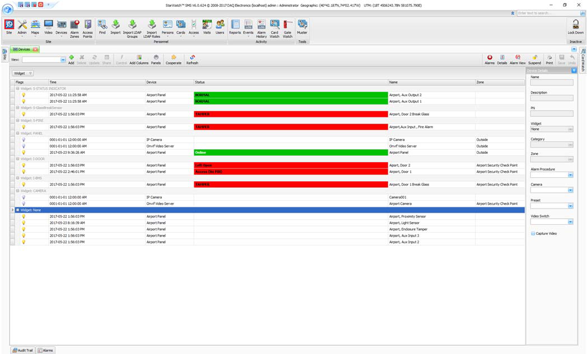

To collapse all categories at once to hide the individual rows within all categories, right-
click on the column header and select the *Full Collapse* option from the drop down menu.


Group by Box
The *Group by Box* feature allows you to list data according to a single parameter or by
multiple parameters. If it does not already appear at the top of the spreadsheet, the *Drag a*
*column header here to group by that column* area can be called up by selecting the *Show*
*Group by Box* option.

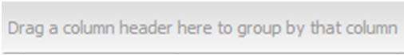

Once the area is active, it can be used to sort data.
Note: selecting the *Hide* *Group by Box* option will remove the *Drag a column header here to*
*group by that column* area from the screen.
To list data according to a single parameter exclusively, drag and drop the appropriate
column header into the *Drag a column header here to group by that column* area at the top
of the tab. The following capture shows a device list after the *Widget* header has been
dragged and dropped.

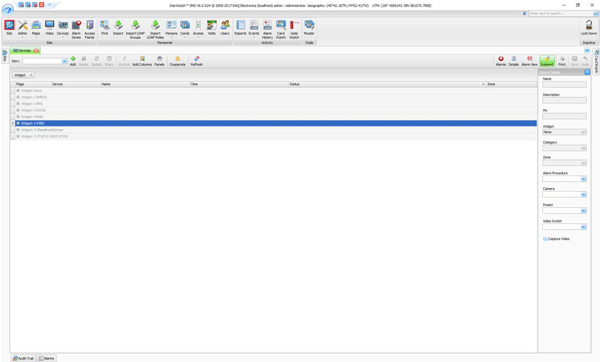

The device lists within each data class category can be separately expanded and hidden,
making large lists easier to navigate.
You can also list devices according to several parameters simultaneously by dragging and
dropping multiple column headers into the *Drag a column header here to group by that*
*column* area at the top of the tab. The capture below shows the device list after the *Widget*
header has been dragged and dropped, followed by the *Device* and *Status* categories.

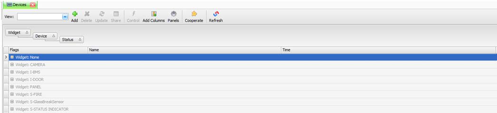

When sorting by multiple categories, the device lists within each category and sub category
can be separately expanded and hidden, making large lists easier to navigate.

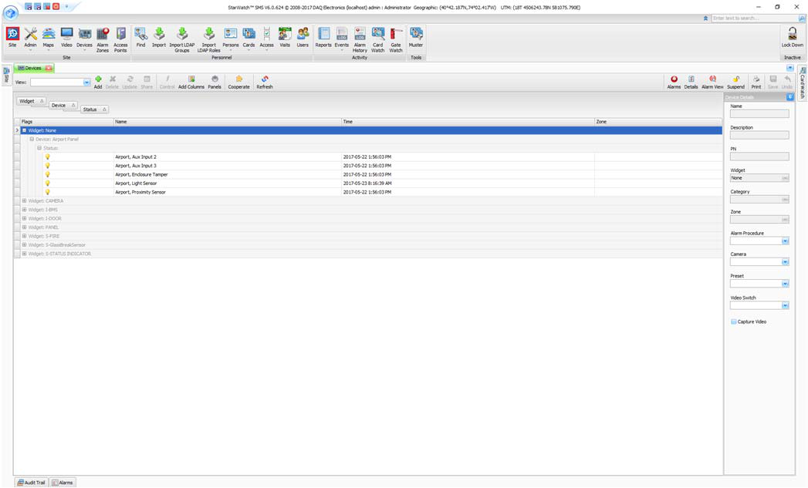

Our grouping tree consists of the widgets, then the devices that include points with the
widget type selected (which is *None* in this example), and finally the status of the points in
the devices for the widget type selected.

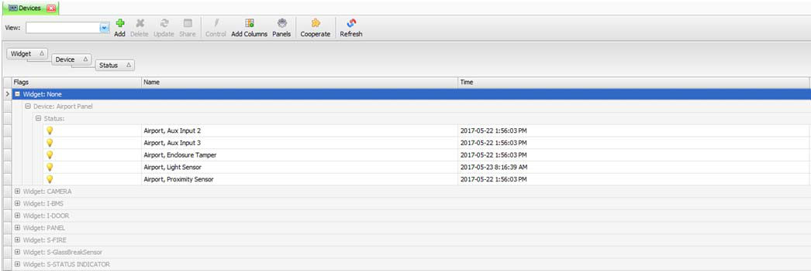

We can display every row that applies to the defined parameters by right-clicking in the
grouping area and selecting the *Full Expand* option from the pop-up menu.

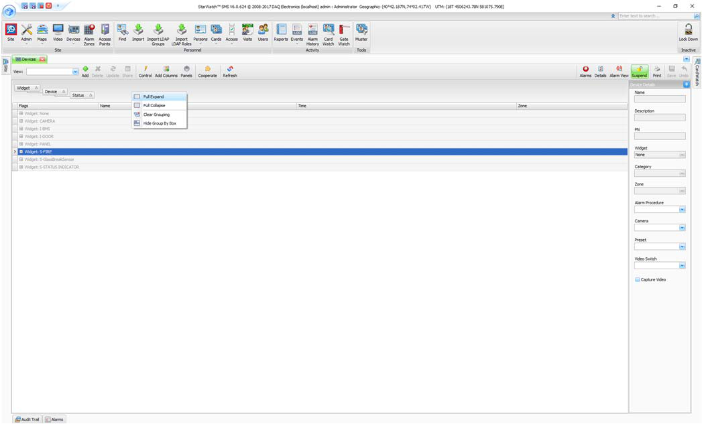

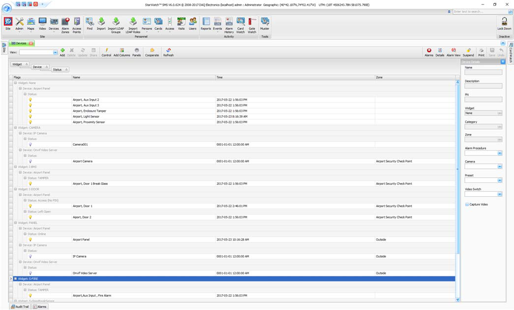


Column Chooser
The *Column Chooser* option allows you to directly select the data columns that appear in
the spreadsheet. When you select this option, the *Customization* window will appear.

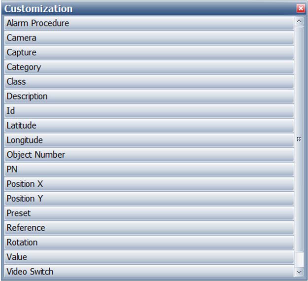

The window displays a list of all the column headers that are currently not included in the
chart. To add one of the listed columns to the chart, you can simply click on the
appropriate header in the window and drag it into the chart. To place the new column
correctly, you must drop it within the row of headers that runs across the top of the chart.
Note: when dragging a new column into the chart, a large black *X* will appear over your
cursor when you are not positioned over an appropriate drop location. If you drop the
column while the *X* is on-screen, the column will remain in the *Customization* window.
You can also click and drag a column header from the current chart and drop it into the
*Customization* window. In this manner, you can move columns in an out of the chart, as
desired.

Best Fit
The *Best Fit* option automatically resizes the column to display all the information
contained in the column cells. For example, if the current column size does not provide
adequate space to display all the data that appears in one or more cells, the *Best Fit* option
will expand the column width to accommodate the entire data sequence. Conversely, if a
column is unnecessarily wide, the *Best Fit* option will reduce the column width
appropriately.

Best Fit (all columns)
The *Best Fit (all columns)* option will attempt to fit data in all columns using the best
possible configuration.

Clear Filter
The *Clear Filter* option removes any filtering that has been applied to a column, returning
it to the original default settings.


Filter Editor
Selecting the *Filter Editor* option calls up the *Filter Editor* window.

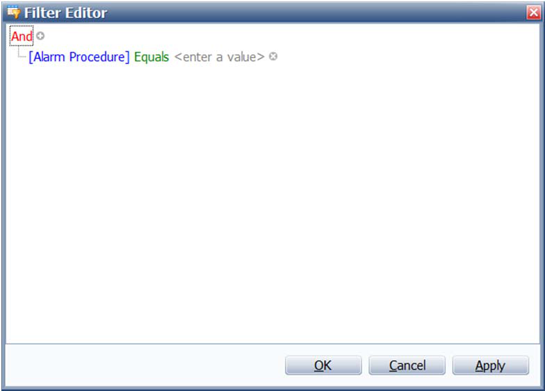

By clicking on the various sections of the filter string and selecting appropriate settings, you
can build and apply customized filters for the column. Once a filter is applied, a filter
editing row will be added at the bottom of the data chart enabling you to quickly adjust
filter settings, if needed.

## Saving Your Column Settings

Some grids within the *StarWatch SMS* system allow you to save your column settings for future use. If a
grid offers this functionality, a drop-down list with the *Add*, *Delete*, and *Update* buttons will be
available on the main function bar.

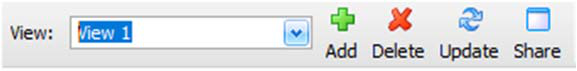

Once you have configured a grid to your preference, save the setting by clicking the *Add New View*
button. Next, click in the name field to change the name of the grid view and press *Enter* on your
keyboard. The new grid view will be saved in the system and added to the drop-down list.

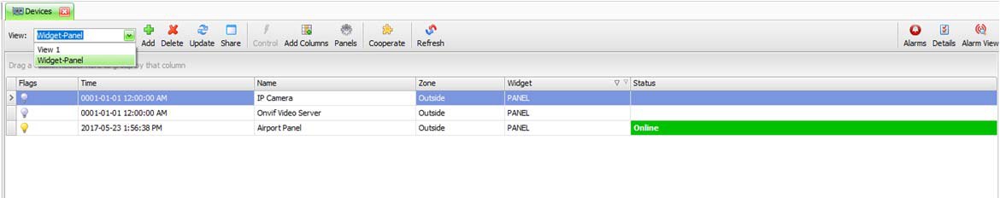

Using the drop-down list, you can quickly return to saved grid views.

To delete an existing view, select it from the drop-down list and click the *Delete Current View*
button.

If you have made changes to an existing grid view, clicking the *Update View*
button will save the
modifications.

## 1.2.6 WORKSPACE MANAGEMENT

Using the *Workspace Management* feature, you can create a series of workspace configurations and
associate them with existing operator roles. When a user logs into the system, the workspace
associated with their assigned role will automatically appear on their monitor(s). This can be used as a
mechanism to automatically provide specific user types with the functions and views they need to
perform their daily tasks. For example, a workspace configuration appropriate for a security guard
might include access control site maps and related alarm queues, while a workspace created for an
operator positioned at an entry/exit point might include the *Persons Management* and *Visit Planner*
functions.
**NOTE:** saved workspaces can include functions and display aspects positioned on multiple monitors.

## Creating a New Workspace

To create a new, assignable workspace, set your screen layout as desired and click the *Start*
icon
at the top left of the screen.

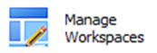

option.
Next, from the drop-down menu, select the
The *Workspace Management* window will appear.

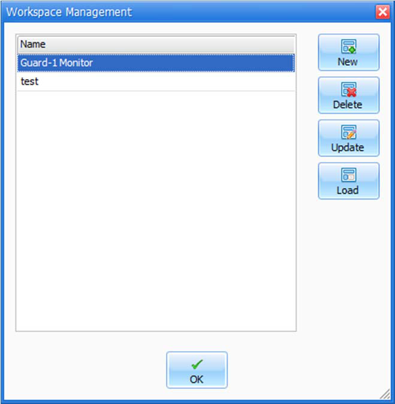

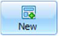

Click the
button located at the top right of the window. A new workspace will be added to the
list with an auto-generated name.

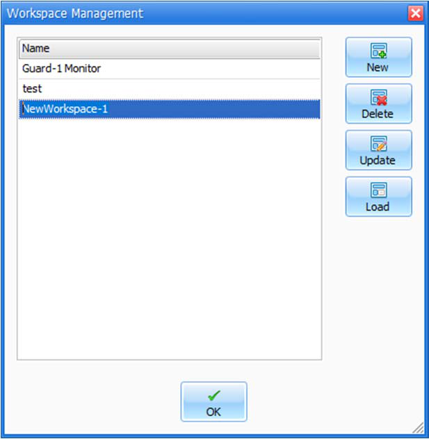

Edit the name of the workspace by selecting it and typing into the name field. The newly created
workspace will now be available as an option when assigning workspaces to operator roles, as shown
below.

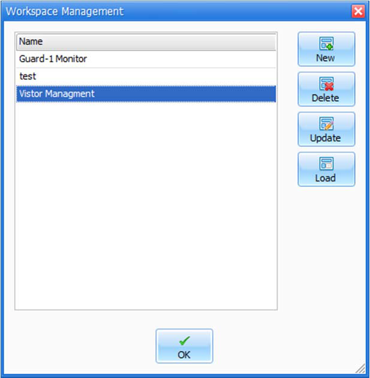

## Modifying an Existing Workspace

To update an existing workspace, set your screen layout as desired and click the *Start*
icon at the
top left of the screen.

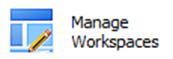

option.
Next, from the drop-down menu, select the
The *Workspace Management* window will appear.

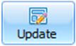

Select the appropriate workspace in the list and click the
button. The workspace will now
reflect the modified screen configuration.

## Deleting a Workspace

To delete an existing workspace, click the *Start*
icon at the top left of the screen.

option.
Next, from the drop-down menu, select the
The *Workspace Management* window will appear.

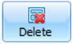

Select the appropriate workspace in the list and click the
button.
Note: deleting a workspace will remove it from any operator role to which it has been assigned.

## Loading an Existing Workspace

To load an existing workspace, click the *Start*
icon at the top left of the screen.

option.
Next, from the drop-down menu, select the
The *Workspace Management* window will appear.

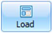

Select the appropriate workspace in the list and click the
button. The selected workspace will
be called to the screen.

## 1.2.7 SAVING YOUR WORKSPACE

Once you have positioned the various screen elements to your preference, *StarWatch SMS* allows you to
save the screen configuration. Once saved, the configuration will become the default view when you
re-open the application using the same login details.

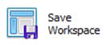

Clicking on the *Start*
icon at the top left of the screen and selecting the
option from
the drop-down menu will save any configuration changes you may have made to the visible user
workspace.

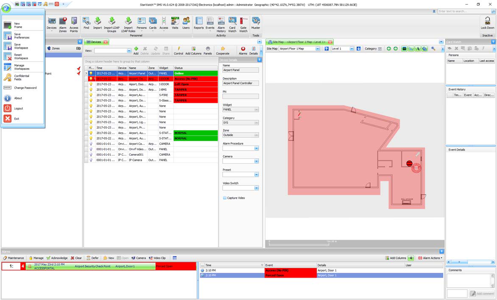

Note: alternately, you can click on the *Save Workspace*
icon from the *Quick Access Toolbar* if it has
been configured to be displayed.

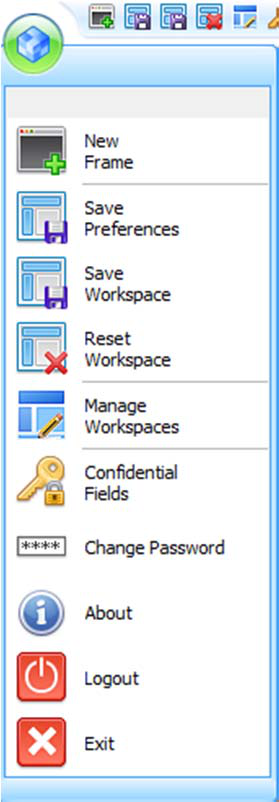

## 1.2.8 GENERAL SAVING FEATURES

When working through the various setup and user related functions of *StarWatch SMS*, it is important to
manually save any changes you want to become a permanent part of your operating database.

## Saving Preferences

The system allows you to save any changes you make to default system settings related to the display
or configuration of data within the *StarWatch SMS* user interface. For example, the system allows you
to alter the appearance of data grids by changing the column order and to adjust the filtering settings
used when displaying devices within a site map. Using *Save Preferences* functionality, these types of
preferences can be saved as new default settings.

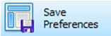

To save preferences, click on the *Start*
icon and select the
option from the drop-
down menu.

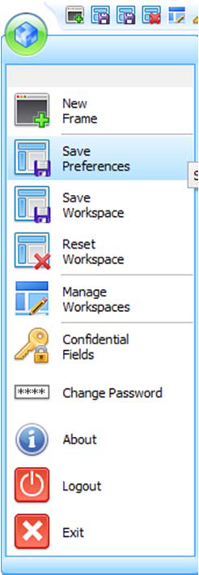

## 2.0 PERSONNEL MANAGEMENT

Using the *Persons* function, you can accomplish all registration operations, including enrolling on-site
personnel and visitors into the system database, assigning user details and credentials, printing labels
on identification badges, and terminating card services. Since the process is completed in multiple
stages, you have the option to complete one or all of the main segments during an enrollment session.
For example, if you will be hosting a large number of visitors on a given day, you may want to
streamline the process by pre-registering each person into the system in advance. Credentials might
then be issued upon their arrival on-site, resulting in a less time consuming process.
The diagram presented below outlines the typical procedure for enrolling users into the *StarWatch SMS*
system and issuing access cards. Depending on your application, these steps may vary to some degree.

## Typical Enrollment Flow

Once credentials
Before assigning
User details will be
Once an individual
have been defined
credentials to an
automatically
has been registered,
and registered, the
individual, they must
positioned on the
the individual profile
identification card
first be enrolled and
identification badge
must then be further
can be issued to the
registered into the
template, which can
defined to include
new user.
*StarWatch SMS*
be printed at a local
credential
database.
workstation.
information.
In general, there are two groups of tasks to perform. The first group is person-based and includes
adding a new person, retiring personnel, etc. The second group of tasks is card-based and includes
registering a card to a person, issuing a card, retiring a card, or terminating a damaged card.
Note: to follow these instructions, you must be logged into the *StarWatch SMS Operator* application
under a role with adequate permission levels to input personnel and card information.

## 2.1 PERSONS WORKSPACE

Creating new personnel is one person-based task that can be performed as an operator. Other person-
based tasks are retiring personnel, finding the records associated with an individual, adding a
photograph, modifying person-related information, and restoring a profile.

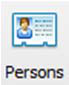

To access the *Persons* application window, click the *Persons*
button on the main *Ribbon* menu.
The *Persons* area will appear on the screen displaying the *Details* tab of the first individual in the
current personnel list.

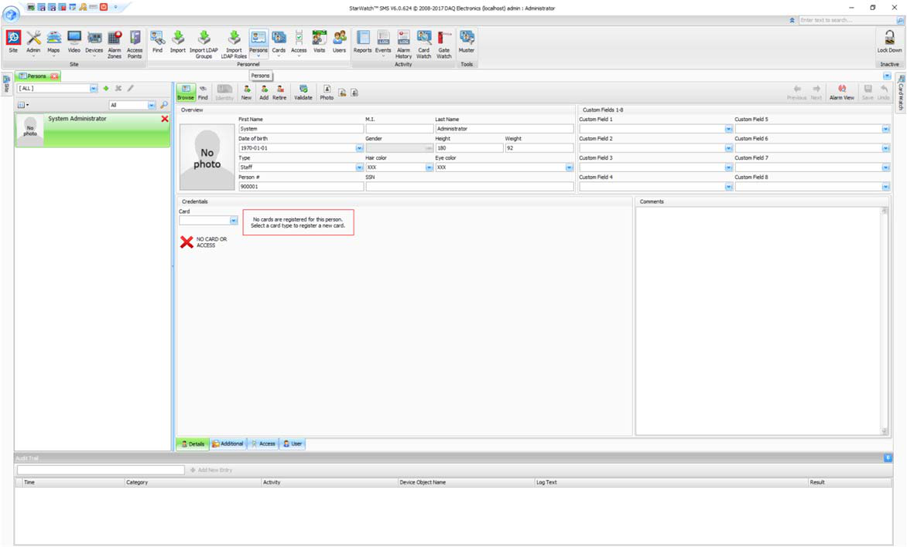

Using the *Persons* drop-down list, you can also select any *Person Group* that has been created in the
system (ex. employee, visitor).

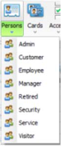

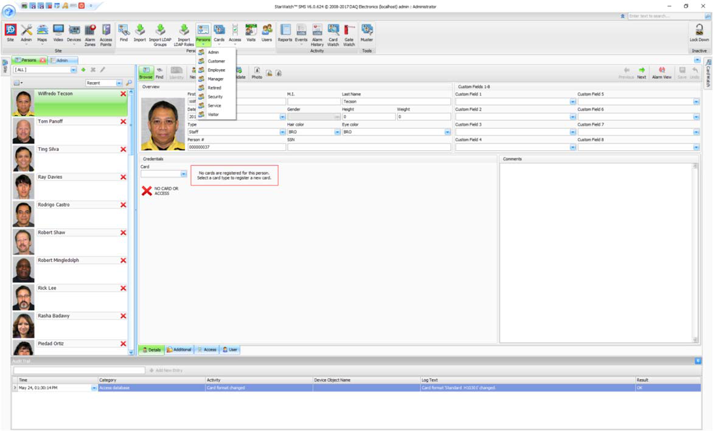

Using the search features provided in the *Persons* pane to the left of the screen, you can locate and
select specific individuals. Once you have located the appropriate profile, click on it in the list to
select it. This will cause the fields in the workspace to the right of the list to auto-populate with
information specific to that user. You can now view or edit the profile.

There are four information tabs available for capturing information and assigning user details when
setting up a profile.

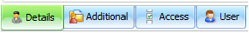

Depending on your site requirements, you may or may not need to fill in all of the fields provided on
these tabs. In most cases, the initial data collected is the personal information of the individual being
added, such as age, gender, height, weight, date of birth, and Social Security number.
Note: if you require that additional fields be displayed and entered when registering, you can modify
the registration screen using custom fields. Please see the *Administration Panel* user guide for details.

## 2.1.1 DETAILS TAB

The *Details* tab of the *Persons* window displays a photo and the personal details of the currently
selected person.

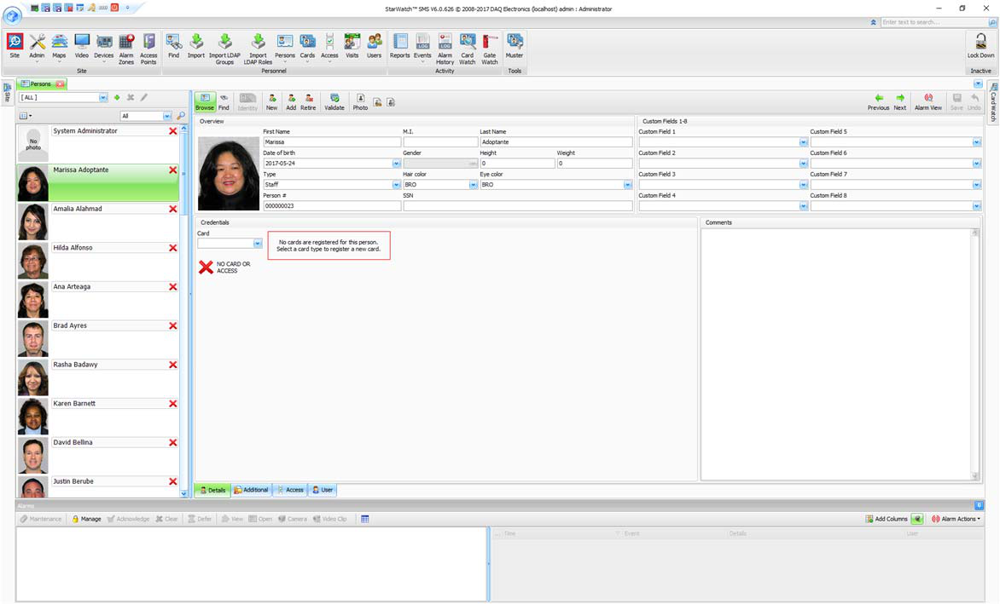

**Field Header**
**Description**
Overview
Overview of the personal information for an individual registered in
the system
Comments
Lists any comments made in the *CardWatch* pane
Credentials
Selects the type of card that the person should use

## 2.1.2 ADDITIONAL TAB

The *Additional* tab of the *Persons* window displays further personal and credential-related information
about the currently selected individual.

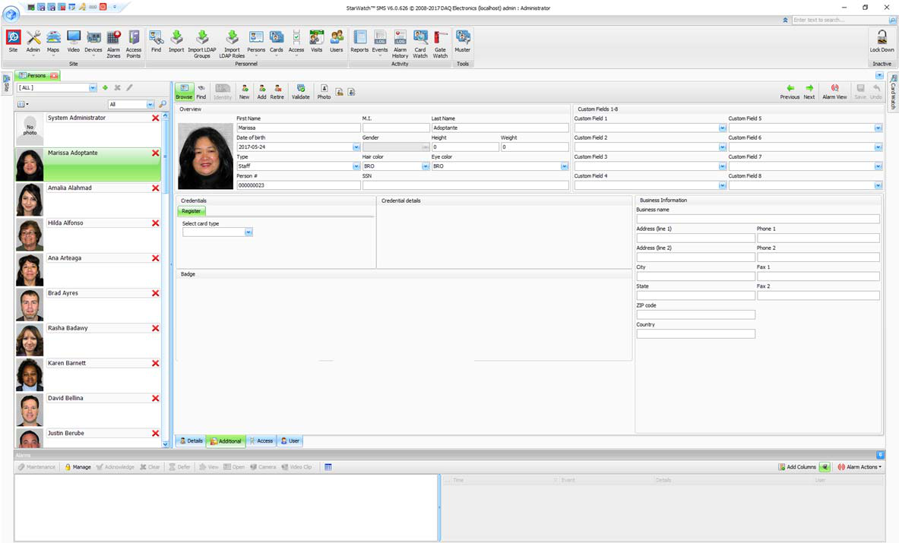

**Field Header**
**Description**
Credentials
Lists the card type that is associated with the person
Credential Details
Lists the credential details of the card type
Business Information
Lists the business name, address, and contact number if the person
is not a permanent employee of your company
Badge
Displays the front and back of the card  Note: this requires an
Assure ID license

## 2.1.3 ACCESS TAB

The *Access* tab of the *Persons* window displays access rights and visitor management related
information for the currently selected individual.

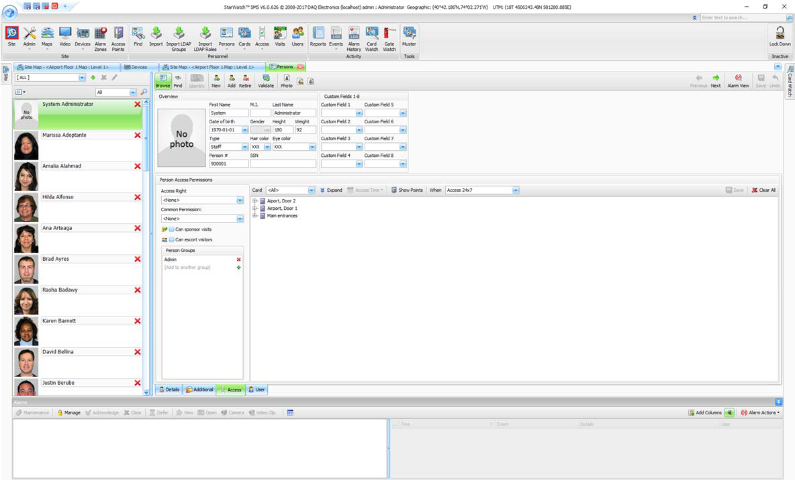

**Field Header**
**Description**
Access Right
Sets the access permissions for the person
Common Permission
Sets the global permissions for the person, which are available via a
drop-down menu
Can Sponsor Visits
Allows the person to sponsor visits from non-employees
Can Escort Visitors
Allows the person to escort visitors when on the premises
Groups
Lists the group types that the person is a member of
Card
Displays all the access rights the person has been given, such as
access points and calendars

## 2.1.4 USER TAB

The *Users* tab of the *Persons* window displays user password and PIN related information for the
currently selected individual.

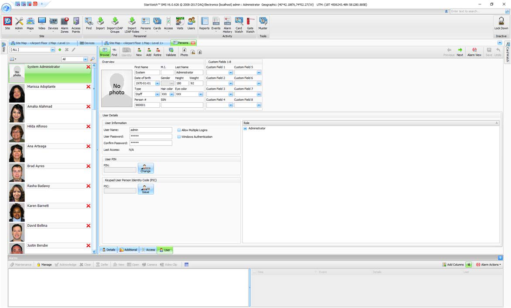

**Field Header**
**Description**
User Information
Sets the user login information, including username and password
User PIN
Sets the user PIN
Keypad User PIC
Sets the user PIC
Role
Sets the login role for the user

## 2.2 PERSON LIST

To the left of the *Persons* screen, the application displays a list of individuals already entered into the
database and provides several options for organizing and searching through the list.

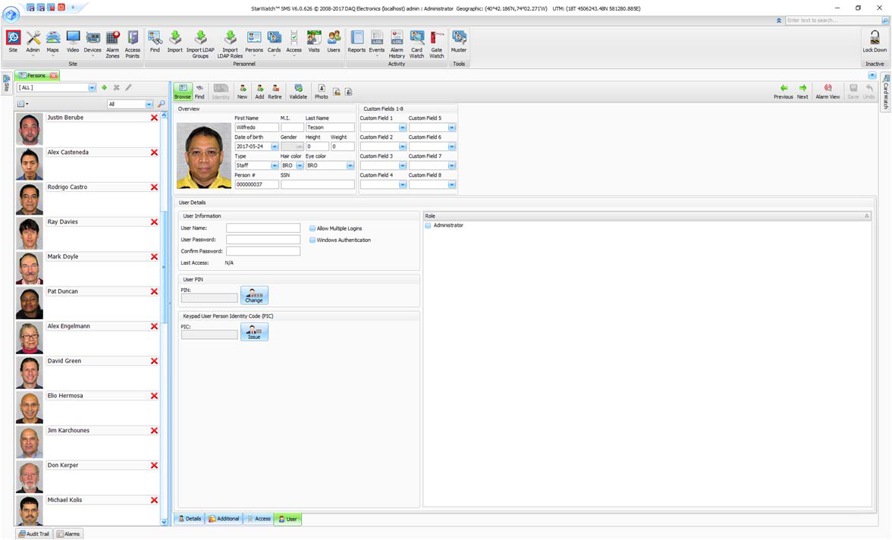

## 2.2.1 PERSON GROUPS

Each person in the database can be assigned to one or multiple *Person Groups*. These groups are
created to divide and organize personnel into subcategories, facilitating more effective searches of
large databases. For example, you may want to create separate *Person Groups* for employees, visitors,
and contractors.
Note: you must have the appropriate rights to create *Person Groups*.
*Person Groups* should not be confused with *Person Types*, which are functional categories linked with
critical personnel parameters, such as permission levels and credential types. *Person Groups* only
function as part of a chosen naming scheme.
*Person Groups* provide a convenient way to sort and view a selective group of individuals. The list on
the left of the *Persons* screen alphabetically displays all of the profiles that have been stored within
the active *Person Group*. If the profile you wish to view or edit does not reside within the current
*Person Group*, you can change the displayed group using the drop-down list provided at the top of the
column.

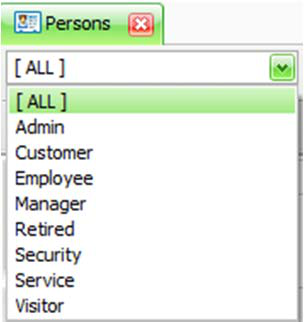

Once selected, the group will appear in the group *Name* field and all associated profiles will be
displayed in the list alphabetically. If you are not sure which *Person Group* the desired profile is in,
simply select the *All* option from the drop-down list.

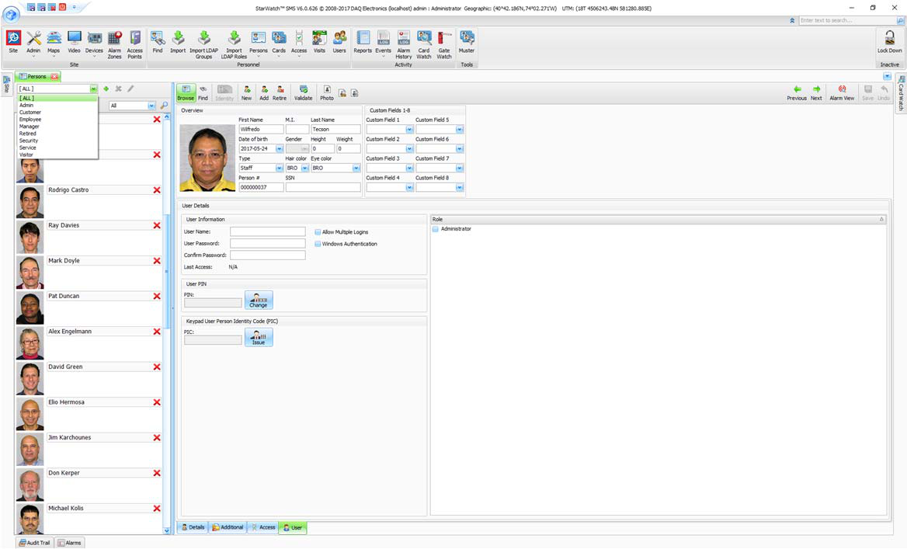

If the active group contains more profiles than can be displayed on the screen at one time, the list can
be sequenced through using the scroll bar provided on the right-hand side of the list.

To add a new *Person Group*, select the
icon at the top of the list. A new group will be added to
the system with an auto-numbered name and the *New Person Group* dialog box will appear.

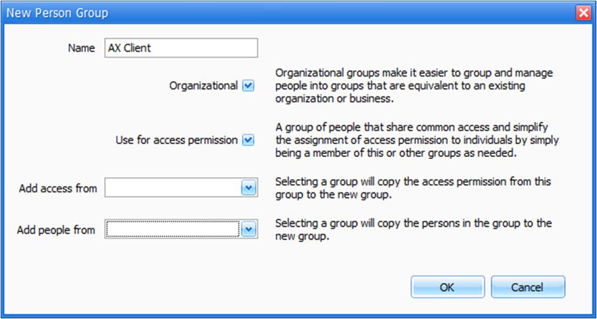

Enter a new name for the group in the *Name* field, select any additional parameters you require, and
click the *Ok* button. The new group will now be available from the drop-down list when assigning
groups to personnel in the database.

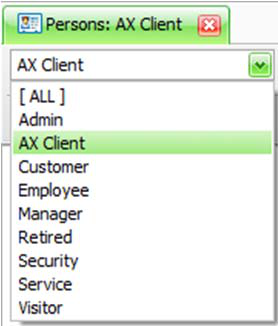

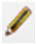

To change the name of a group, select the group from the drop-down list and click the *Edit*
icon.
Similarly, you can modify the name of an existing group by calling it to the screen, clicking in the *Name*
field at the top of the list, typing in a new name for the group, and hitting the *Enter* key. Note: if you
fail to hit the *Enter* key, the new name will not be recorded.

To delete a group from the system, select the group from the drop-down list and click the *Delete*
icon. You can also utilize the system navigator feature. In the navigator window, locate the appropriate
group in the *Person Groups* list. Next, right-click on the group and select the *Delete Person Group*
option.

## 2.2.2 SEARCH FEATURES

In addition to *Person Groups*, the system provides a filtering function to help you locate specific
persons in the database. This is especially useful when dealing with large databases containing
hundreds or even thousands of profiles.

To narrow the list of displayed persons, click on the *Filter*
icon located at the top right of the
*Persons* list. A table will appear allowing you to enter various parameters.

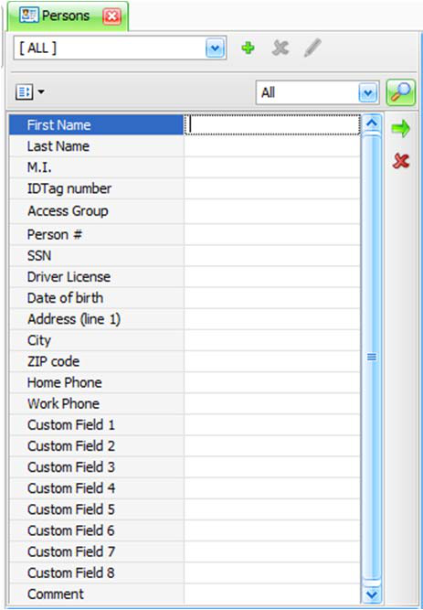

After entering the appropriate parameters into the table, click the *Update*
icon to filter the list.
Only those profiles matching the parameters you entered into the table will now be displayed.

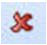

Clicking the *Clear*
icon will remove all previously entered information from the table, allowing you
to conduct a new search.

Note: to remove the filtering table from the screen, simply click on the *Filter*
icon a second time.

Similarly, you can search for individual profiles by clicking on the
button on the top menu of the
main *Persons* workspace. The *Find Person* window will appear.

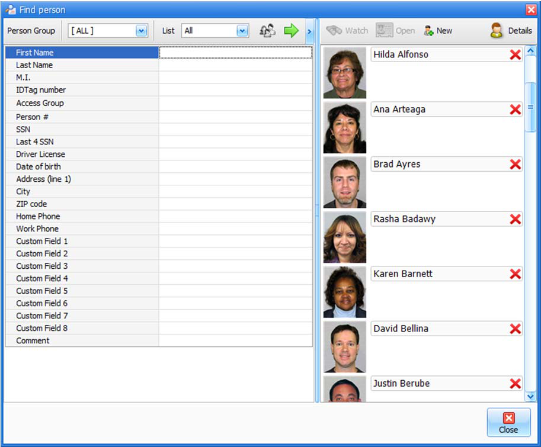

As with the *Filter* function, after entering the appropriate parameters into the table, click the
icon to filter the list. Only those profiles matching the parameters you entered into the table will now
be displayed.

## 2.3 REGISTERING A PERSON

When you register a person, you are adding a new person profile to the system database.

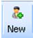

From the top menu of the *Persons* workspace, click on the
button. The fields available in the main
area will become blank allowing you to begin with an empty profile.
Note: the *Person #* field is automatically generated, and you do not have to modify it.

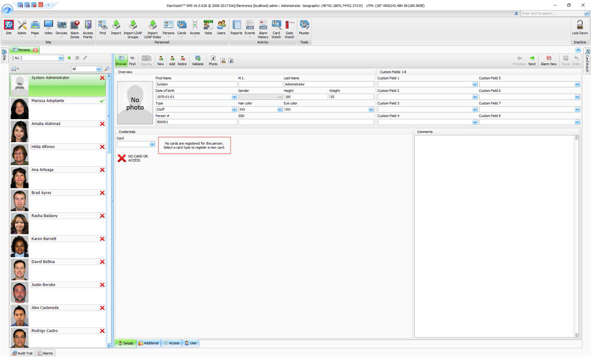

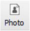

To add an existing photograph of the person to the profile, click the
button. A standard Windows
navigation screen will appear allowing you to locate the image file within your directory structure and
select it.

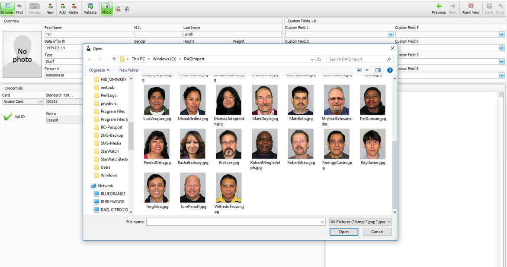

Note: photo files must be one of the following file types: .bmp, .jpg, or .png.

Continue by modifying the information on the available sub tabs (see section 2.1 PERSONS
WORKSPACE), as needed, to reflect the individual being added.

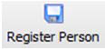

When all changes are complete, click the
button on the top right menu to save the new
person profile. Note: you can return to the profile at any time to make changes to the information, but
be sure to save any changes.

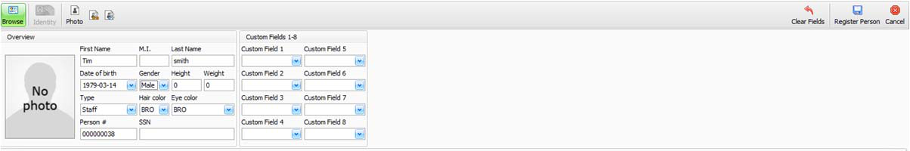

## 2.4 REGISTERING AND ISSUING CARDS

After creating a person profile in the system, you can register and then issue cards to the individual.
To register a card to a person, open their profile in the main *Persons* workspace. In the *Credentials*
area of the *Details* tab, select the card type from the *Card* drop-down list.

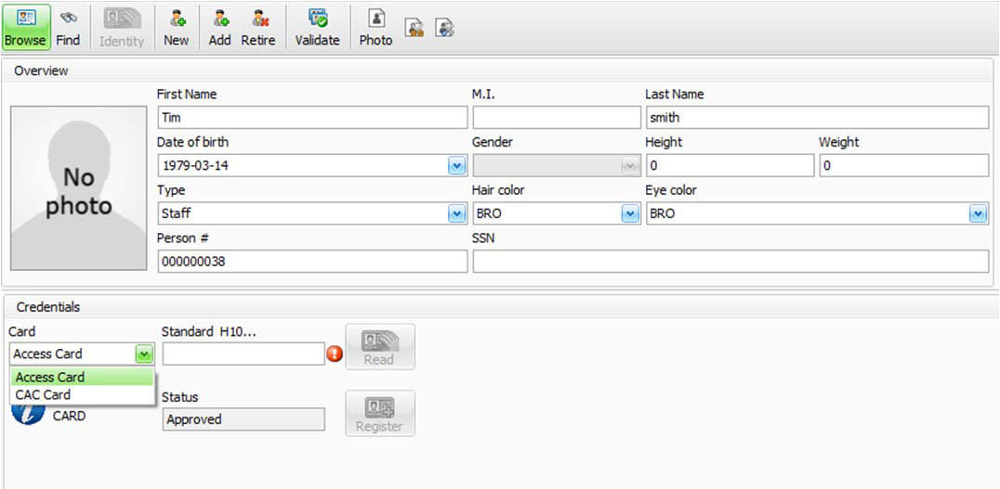

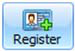

Next, in the card format field, type the card number and then click the
button. The card is now
entered in the database as registered to that person.

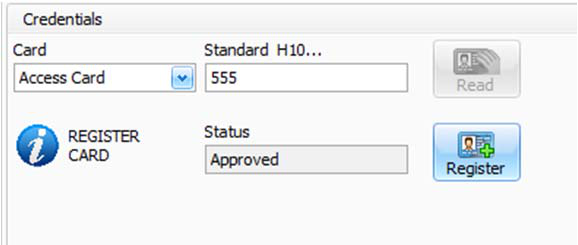

After a card has been registered to the individual, you must issue the card before it can be used for
access. In the *Expiry* field, set an expiration date for the card or select the *Never* checkbox.

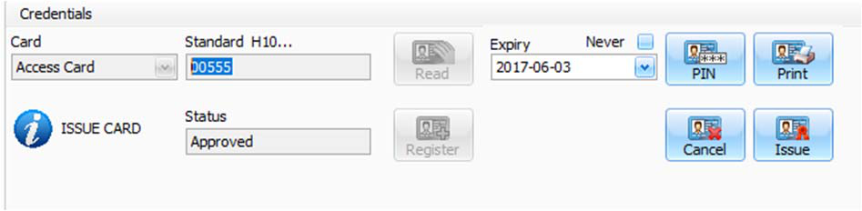

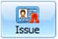

To issue the card, click the
button. The card is now issued to that person and activated in the
system, which sends out the card/person data to all security panels connected to the database.

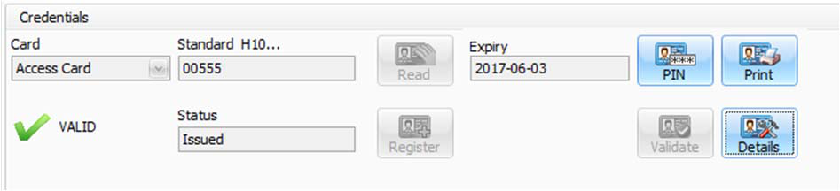

Note: multiple cards can be assigned to an individual.

## 2.5 VERIFYING AN IDENTITY

*StarWatch SMS* provides the capability to have a profile automatically pop up on the *Persons* screen
when the associated card is swiped at a specific reader. This allows an operator to immediately verify
that the correct person is using the card at that location. For this function, the operator workstation
must have a card reader attached to it.
Note: using the *Card Format* feature of the system, the *Can Identify Person* option must be selected for
the enrollment reader being used. Please see the *Administration Panel* guide for more information.
To verify an identity associated with a card, click the *Identity* button at the top of the *Persons*
workspace. Next, have the person swipe his or her card. The card holder record associated with the
card will populate the window allowing you to visually verify that the card is being utilized by the
proper person.
Note:  businesses may have security procedures associated with this task that involve additional actions
that must be completed by the operator. See your System Administrator or security department for
more information.

## 2.6 RETIRING A PERSON

When an individual is retired from the system, he or she is no longer listed with active personnel.
However, the events associated with the person are kept in the database for future reference. If the
person is deleted, associated events are also removed.
Note: when retiring a person, you should first retire any cards associated with the person so there are
no loose, unretired cards remaining (see section 2.10 RETIRING A CARD).

To retire a person, open their profile in the *Persons* application and click the
button located at
the top left of the *Persons* workspace. A confirmation window will appear to confirm the retiring of the
person.

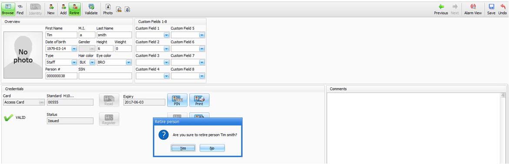

Click the *Yes* button to proceed.

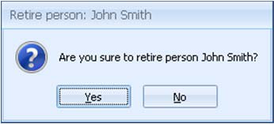

## 2.7 RESTORING A PERSON

If you have previously retired a person, you can restore them to the system at any time. The person
will become active again, but will not have an associated card currently issued to them.

To restore a person to the active list, click the
button at the top of the *Persons* workspace to
enable the browsing function.

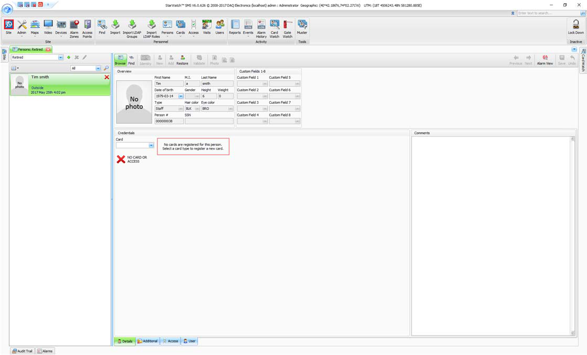

In the *Groups* drop-down list, select the *Retired* option and the people defined as retired will be
displayed.

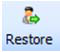

Double-click on the person that you want to restore to open their profile and click the
button at
the top of the *Persons* workspace.

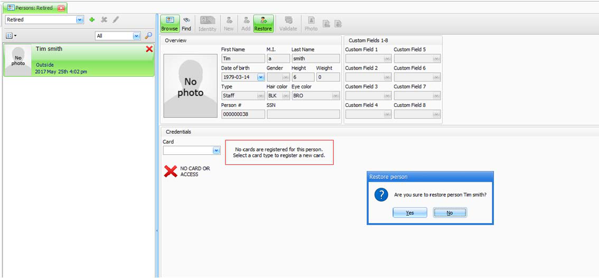

A confirmation window will appear to confirm the restoring of the person. Click the *Yes* button to
proceed.

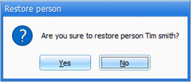

## 2.8 ASSIGNING A PIC

A Person Identity Code (PIC) is a numerical sequence up to 16 digits in length that is assigned to a
person (not a card). PICs are useful for tracking purposes, such as knowing who enabled or disabled an
alarm zone. Depending on configuration and usage, you may or may not use PICs in your system.
To assign a PIC to a person, call up the appropriate person profile in the *Persons* workspace and click
on the *User* tab at the bottom of the screen.

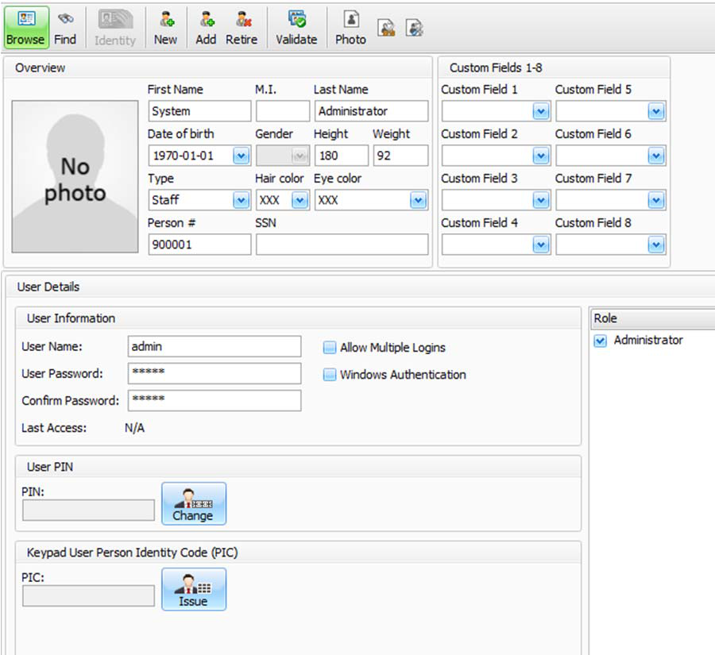

In the *Keypad User Person Identity Code (PIC)* field, click on the
button.

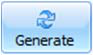

In the *Issue PIC* dialog box, enter the value for the PIC or click the
button to generate a PIC
automatically.

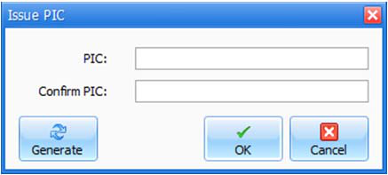

Click the *Ok* button to proceed.

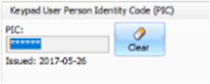

The new PIC will appear as a row of ************ in the field with an attached issuance date. Click *Save* to
save the change.

## 2.9 ASSIGNING A USER/ROLE LOGIN

Using the *Persons* function, you can assign a role or multiple roles to an individual.
To assign a role to a person, call up the appropriate person profile in the *Persons* workspace and click
on the *User* tab at the bottom of the screen.

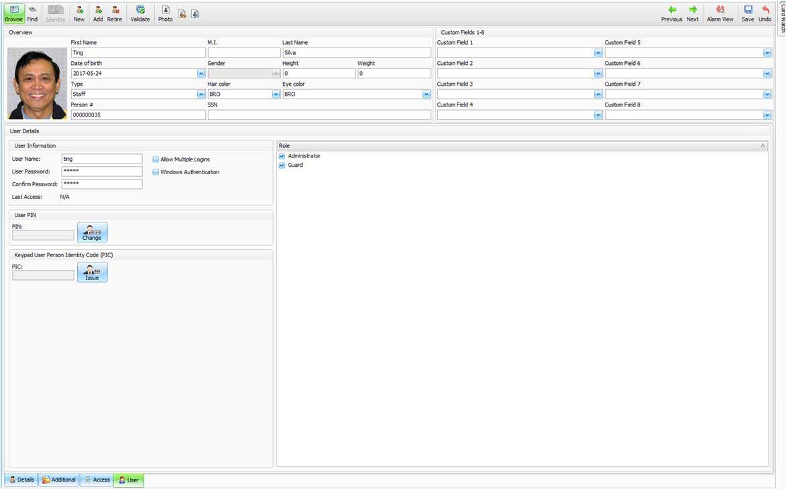

In the *Role* area to the right of the screen, click the checkboxes that correspond to the roles you would
like to assign.

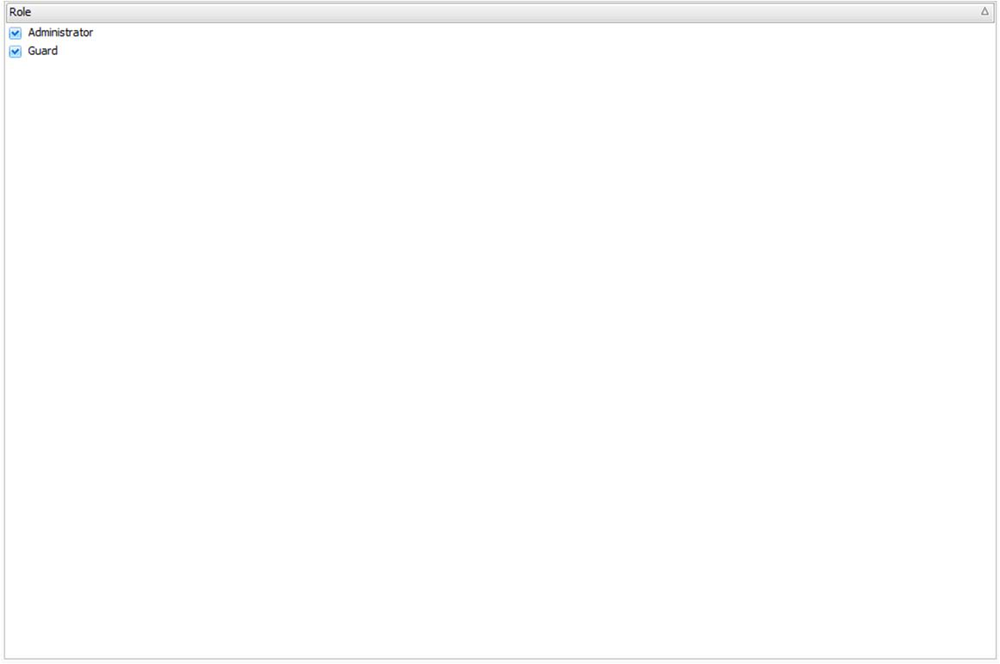

Next, in the *User* *Information* area, fill in the *User Name*, *User Password*, and *Confirm Password* fields
and hit *Save*.

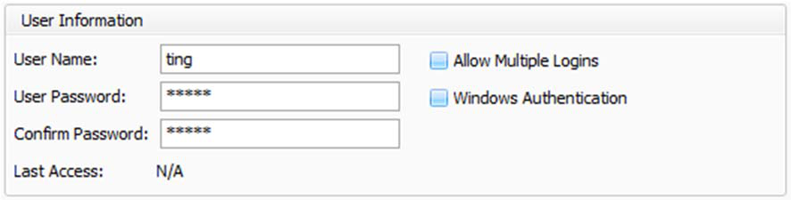

The individual will now be given the system rights and privileges associated with the roles selected
upon login.

## 2.10 RETIRING A CARD

When a card is no longer needed by a card holder, you can retire it from the system where it will
become disabled. You can later return it to the pool to be assigned to another person or terminate it,
which will render it useless.
Note: to retire a person, you must retire the associated card first.
To retire a card, call the person profile from which you want to retire a card to the *Persons* workspace.

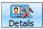

In the *Credentials* area of the *Details* tab, click the
button.

The *Card Details* window pops up.

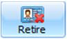

In the *Retire Card* area, click the
button.

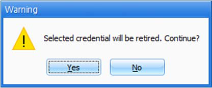

In the confirmation window, click the *Yes* button to proceed. The card will be retired.

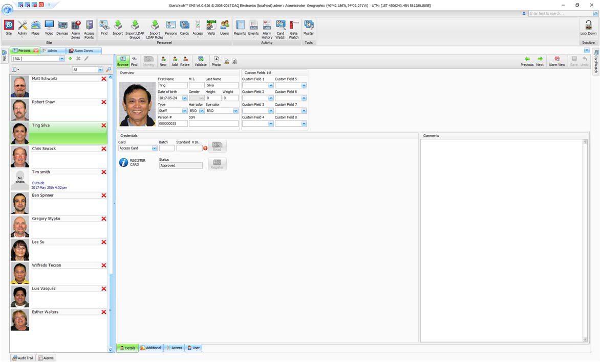

## 2.11 RETURNING A CARD

When a card is no longer needed by a card holder, you can return it to the pool to be assigned to
another person.
Note: using the *Card Type* feature of the system, the *Allow Card to be Re-used (Returned)* option must
be selected for the card being used. Please see the *Administration Panel* guide for more information.
To return a card, call the person profile from which you want to return a card to the *Persons*
workspace.

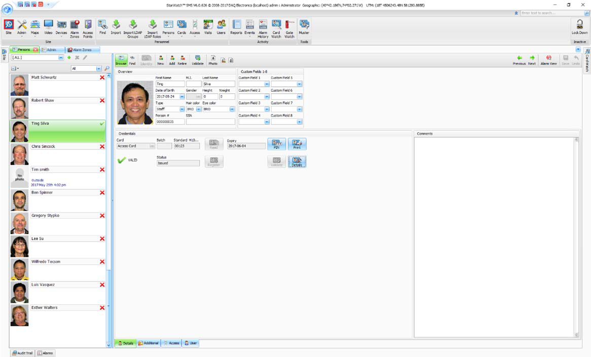

In the *Credentials* area of the *Details* tab, click the
button.

The *Card Details* window pops up.

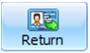

In the *Retire Card* area, click the
button.

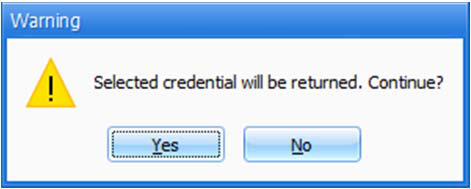

In the confirmation window click the *Yes* button to proceed. The card will be returned and can now be
assigned to another person.

## 2.12 VALIDATING A CARD

When you validate a card, you are ensuring that it is being used by the correct person and that all
personal information is correct. The card is first set to be validated by the operator and the next time
the card is swiped, the operator will follow a procedure set up by the System Administrator to ensure
the validity of the card and the person.

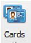

To validate a card, click on the
button on the main *Ribbon* menu to open the *Cards* function.

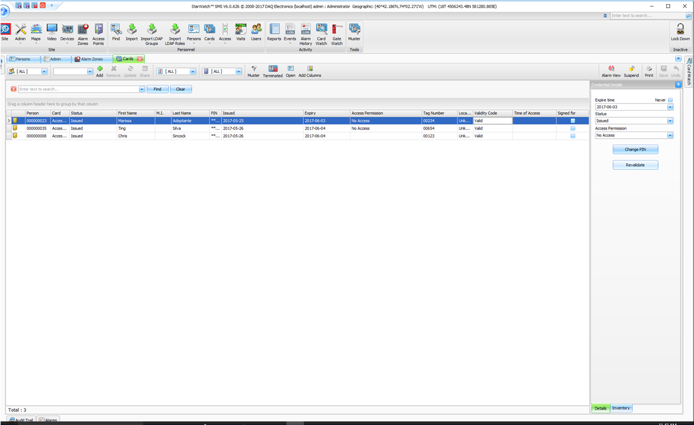

From the list displayed in the workspace, select the person whose card you want to validate by clicking
on the appropriate name.

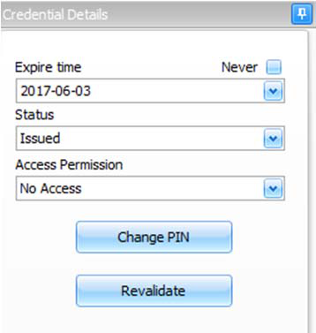

In the *Credentials Details* pane on the right side of the screen, click the
button. This
marks the card for validation and will force the card holder to go to a manned workstation to proceed
through the validation process.

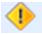

In the *Persons* application, the profile of the individual will now be marked with a yellow diamond
to indicate that the card must be validated.

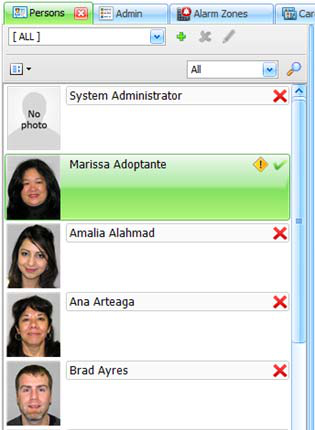

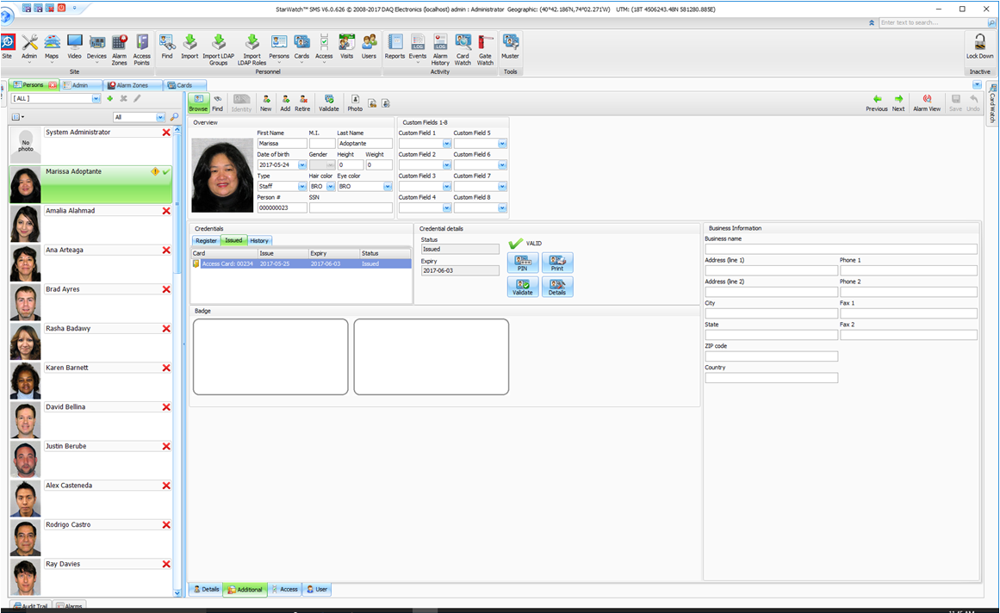

When the card holder swipes the card at a workstation manned by an operator, the operator will be
notified.

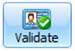

The card can be validated in the *Additional* tab in the *Persons* function, by clicking the
button.
The card will then be marked valid for use.

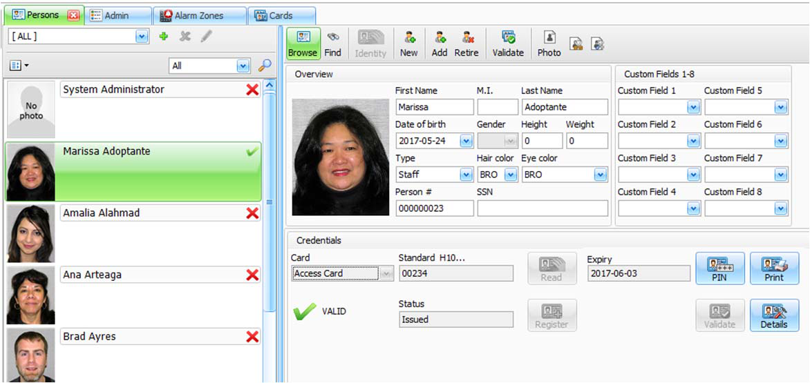

## 2.13 PRINTING A CARD

In most cases, the last step in issuing a card to a new person is printing information onto the card. The
card is printed on a badge printer and typically has the company logo, a photograph of the individual,
and additional information such as the expiration date of the card and type of group (ex. visitor,
employee).
To print a card, call the appropriate person profile to the *Persons* workspace and click on the
*Additional* tab at the bottom of the screen.

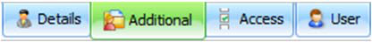

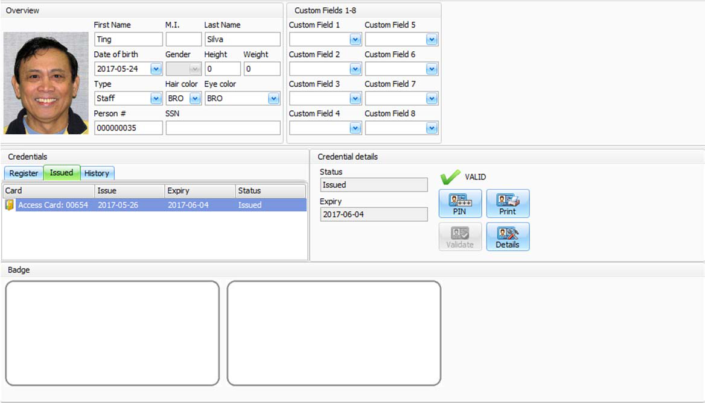

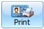

Click on the
button in the *Credential Details* area to print the card.

## 2.14 UPDATING THE EXPIRATION DATE OF A CARD

You can update the expiration date of a card or remove the expiration entirely. To update the
expiration of a card, call the appropriate person profile to the *Persons* workspace.
Note: if you are registering a new person, please refer to section 2.4 REGISTERING AND ISSUING CARDS.

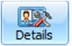

In the *Credentials* area of the *Details* tab, click the
button. The *Card Details* window will
appear.

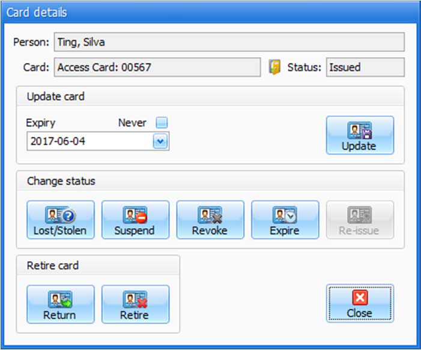

You can set an expiration date for the card using the *Expiry* drop-down list and pop-up calendar.

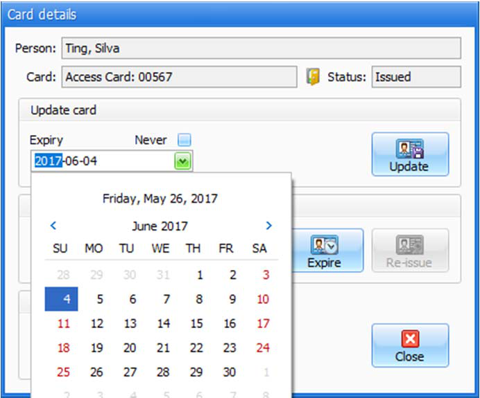

To remove the expiration feature from the card, select the *Never* checkbox.

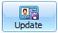

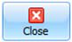

When your changes have been set, click the
button followed by the
button.

## 2.15 UPDATING THE ACCESS PERMISSIONS OF A CARD

To update the access permissions of a card, call the appropriate person profile to the *Persons*
workspace and click on the *Access* tab at the bottom of the screen.

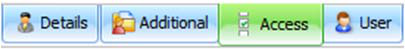

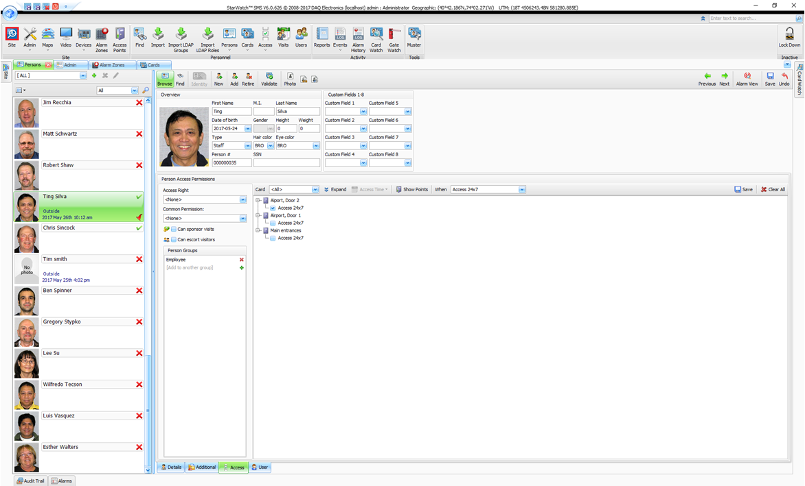

In the *Person Access Permissions* area to the left side of the workspace, select the appropriate
permission from the *Common Permission* drop-down menu. The selection you make will be reflected in
the tree for portals and doors shown in the right half of the window.

In the screenshot below, the *Airport Access* permission has been selected, giving the individual *24x7*
access to *Airport Door 1*, *Airport Door 2*, and *Main Entrances*.

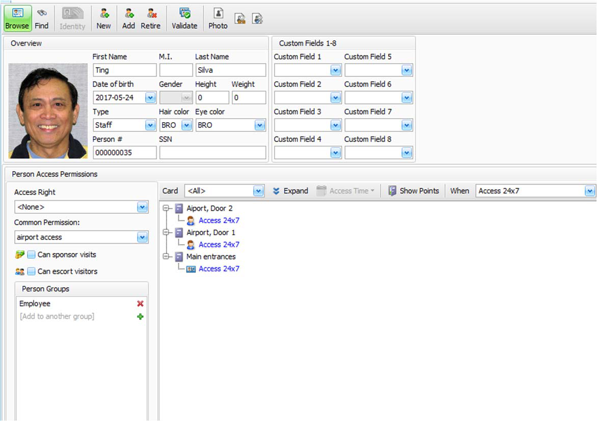

When you have completed updating the permission for the card, click *Save* to save the change.

Note: A second way to update the access permissions of a card becomes available when the System
Administrator has set the specific card type as a default. This is accomplished using the *Card Type*
function.

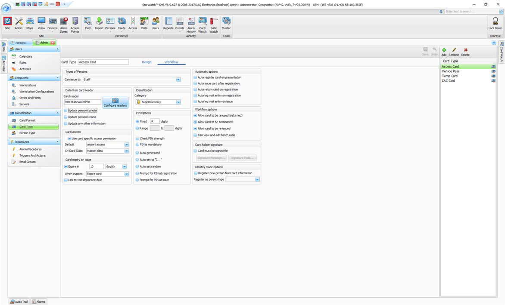

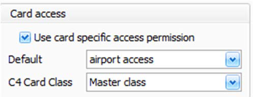

With this setting in place, the access permission can be selected in the *Persons* workspace using the
drop-down list available in the *Details* tab.

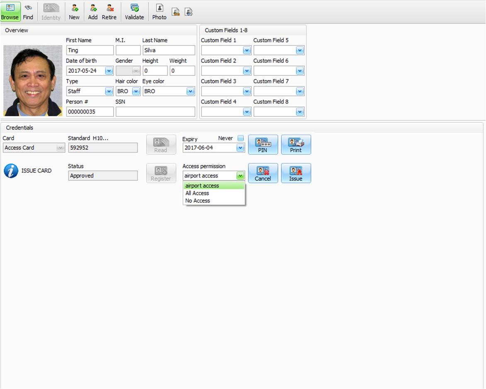

## 2.16 CHANGING THE STATUS OF A CARD

You can change the status of a card to indicate one of the following:

*Lost/Stolen* - this indicates that the card number should be terminated and can no longer be
used.

*Suspend* - this temporarily suspends the access permissions for the card. The operator may do
this if an area must be temporarily off-limits to a person for some reason.

*Revoke* - this revokes the access permissions for the card. The operator may do this if the
person has been terminated and no longer works for the company.

*Expire* - this expires the card and it is no longer valid for use by the card holder. The operator
can either issue a new card or enter a new expiration date for the card.

*Re-issue* - this reissues the card into a valid state after being in an invalid state, such as those
listed above.
To change the status of a card, call the appropriate person profile to the *Persons* workspace.

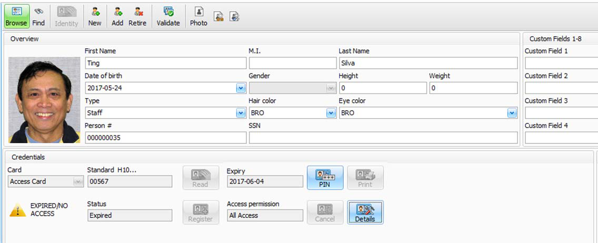

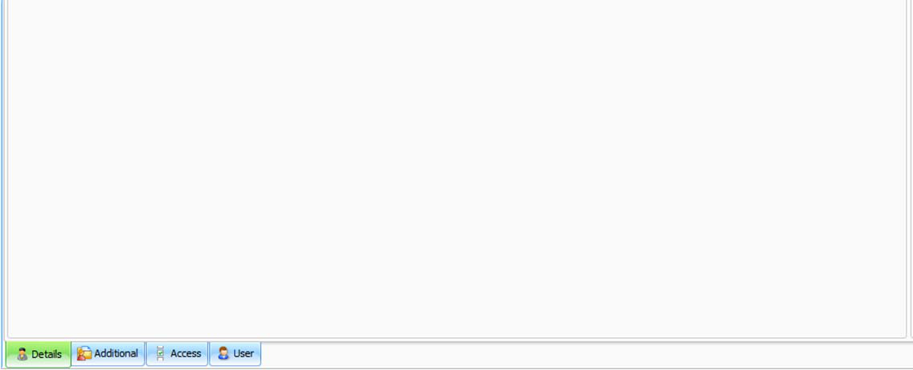

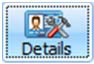

In the *Credentials* area of the *Details* tab, click the
button.

The *Card Details* window will appear.

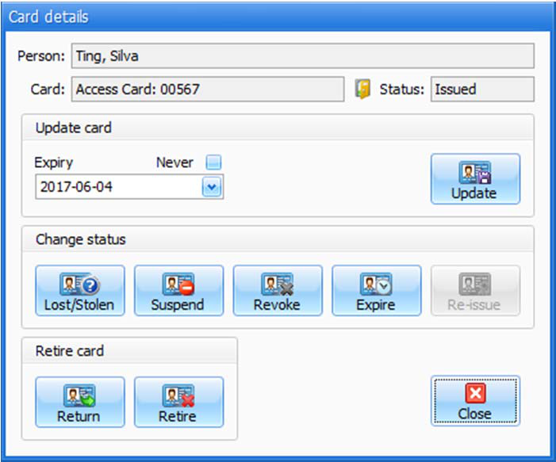

In the *Status Change* area, select one the options provided.

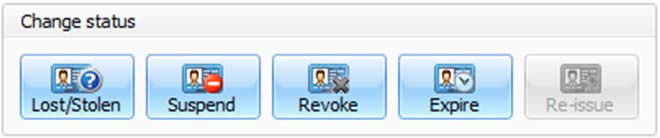

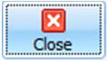

When changes are complete, click the
button.

## 2.17 ASSIGNING A PIN TO A CARD

When Personal Identification Numbers (PINs) are required, in addition to swiping a card, a card holder
must enter his/her PIN on a keypad near the card reader. PINs follow a card in the system, not a
person.
To assign a PIN to a card, call the appropriate person profile to the *Persons* workspace and click on the
*User* tab at the bottom of the screen.

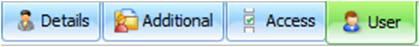

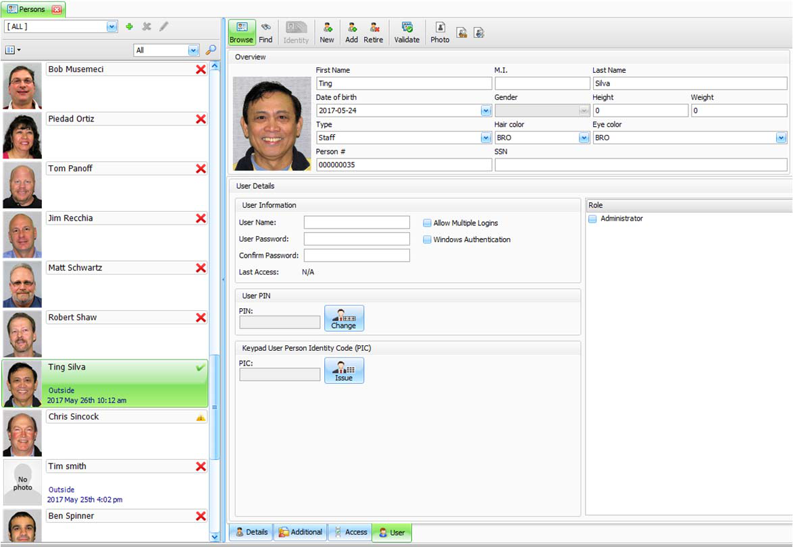

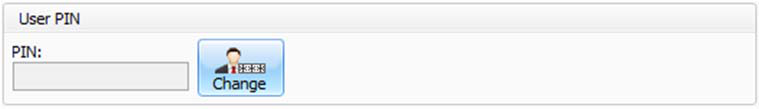

In the *User PIN* field, click the
button.

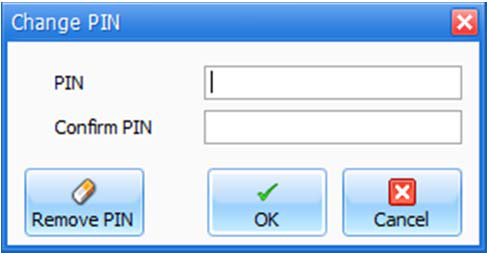

In the *Change PIN* window, type in a value for the PIN in the *PIN* field and retype it in the *Confirm PIN*
field.

Next, click the
button.
Note: if the system determines that the entered PIN is too weak, you will be prompted to enter a
stronger PIN.

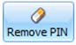

Note: if you can also remove the PIN assignment by hitting the
button.

## 2.18 ISSUING MULTIPLE CARDS TO AN INDIVIDUAL

To register additional cards to a person, call the appropriate person profile to the *Persons* workspace
and click on the *Additional* tab at the bottom of the screen.

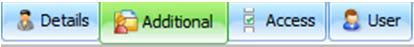

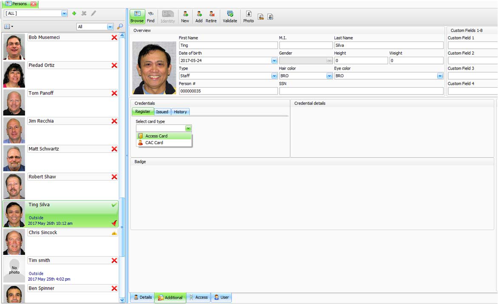

Next, in the *Credentials* area in the center left of the screen, select the card type from the *Select Card*
*Type* drop-down menu.

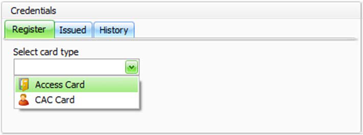

Depending on the card type selected, the system will provide new registration options in the
*Credentials* area. Either type in the card number manually or read the card number using the card
reader.

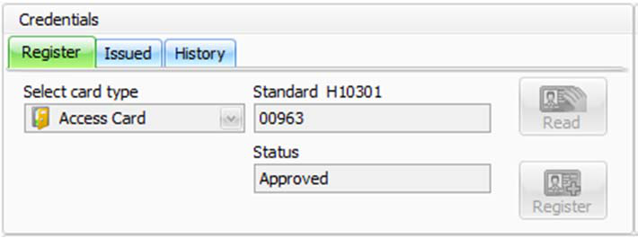

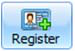

Once you have completed the action appropriate for the card type, click the
button.
After the card has been registered to the individual, the *Credential Details* area will become populated
with issuance options. You must issue the card before it can be used for access. In the *Expiry* field, set
an expiration date for the card or select the *Never* checkbox. You can also set the *Access Permission*.

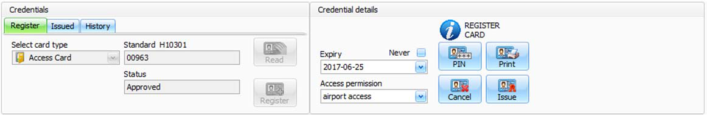

To issue the card, click the
button. The card is now issued to that person and activated in the
system, which sends out the card/person data to all security panels connected to the database.

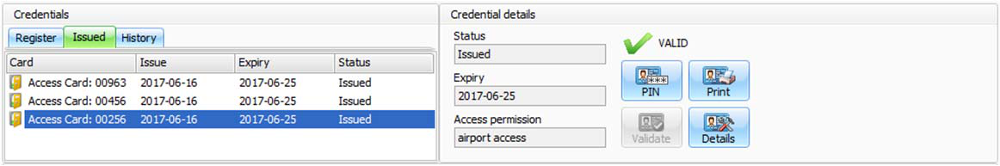

Once the additional card has been issued, the *Issue* tab in the *Credentials* area will display a list of all
cards issued to the individual.

## 2.19 VIEWING A HISTORY OF CARDS ISSUED TO AN INDIVIDUAL

To view a history of the cards that have been previously assigned to a specific person, call the
appropriate person profile to the *Persons* workspace and click on the *Additional* tab at the bottom of
the screen.

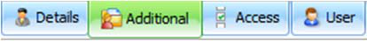

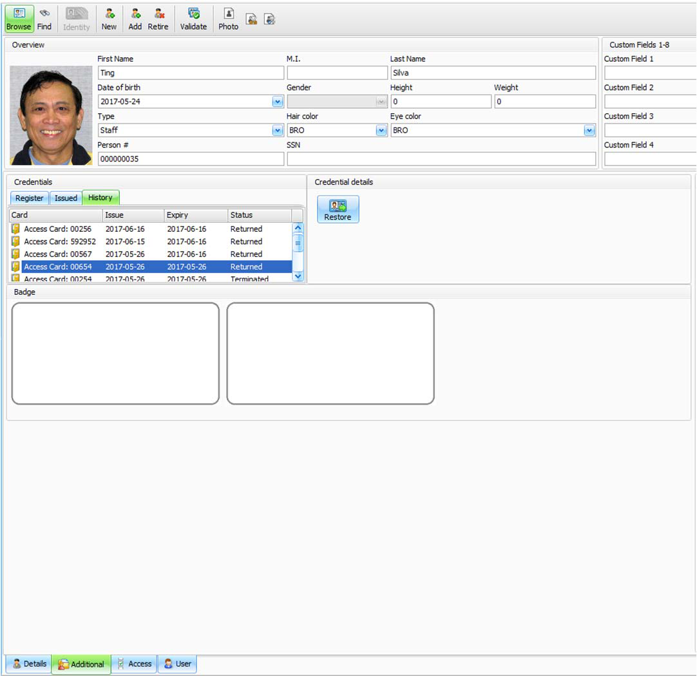

In the *Credentials* area to the center left of the screen, click on the
tab.

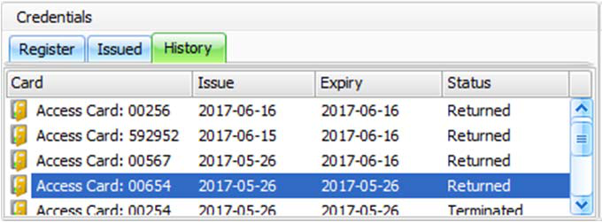

All cards that have been registered to the person are displayed with card details, including the current
status of each card.
Note: the *Credential Details* area enables you to restore cards, if the card type allows.

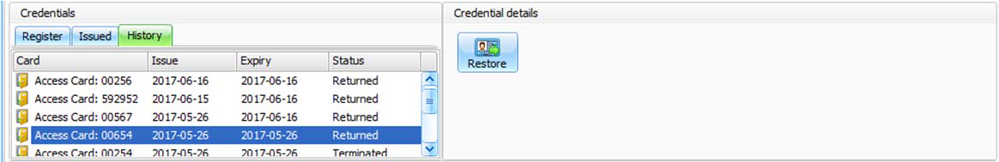

## 3.0 MANAGING DEVICES

The *Devices* function provides a single place to view all the devices connected to your system and
manually issue commands. This interface provides a list of all the access points and associated device
details that have been previously configured in the *Site Builder* application.

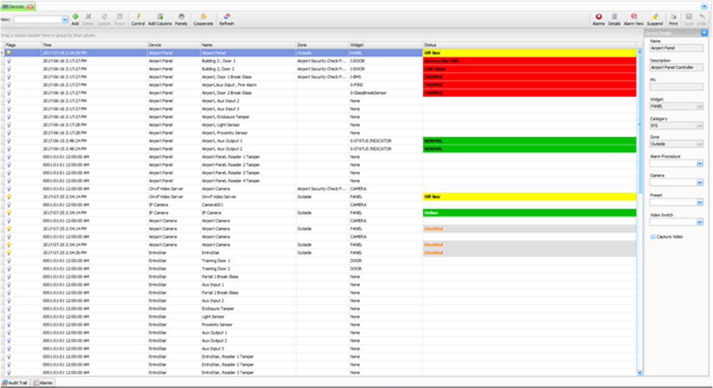

From this window, you can view the status of individual *Access Points*, *Alarm Zones*, and *Panels* and
issue commands to various hardware components. You can also view the details associated with a
selected point in the *Device Details* pane located on the right side of the screen.
Note: To access the *Devices* window, you must be logged into the *Operator* application as a user with
sufficient authority to perform Administrator functions.

Note: You cannot modify device parameters from the *Devices* window. You can only make device
changes (*Name*, *Description*, *Zone*, etc.) via the *Site Builder* application. In the screenshot below,
notice that the *Name*, *Description*, *PIN*, *Widget*, *Category*, and *Zone* parameters have been grayed out
and are unavailable to modify from the *Devices* window.

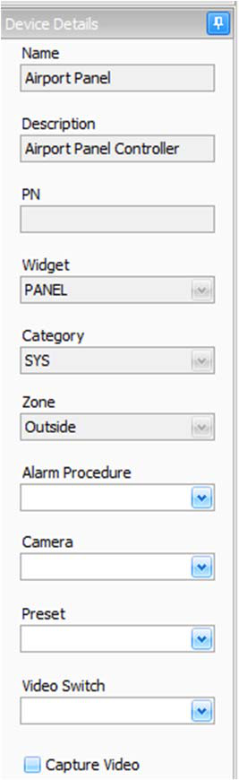

## 3.1 VIEWING DEVICE DETAILS

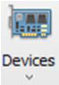

To open the *Device* window, click on the
button on the *Main Ribbon* toolbar at the top of the
screen.

Next, select any point in the list that you would like to display by clicking on it. The *Device Details*
pane located on the right side of the screen will become populated with information related to the
selected point.

In the example below, we are viewing details for the *Building 2, Door 2* point within the *Airport Panel*
device.

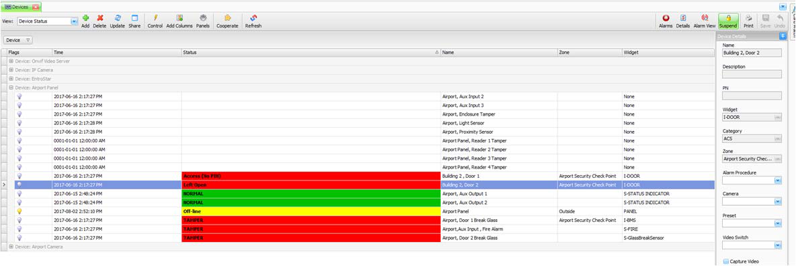

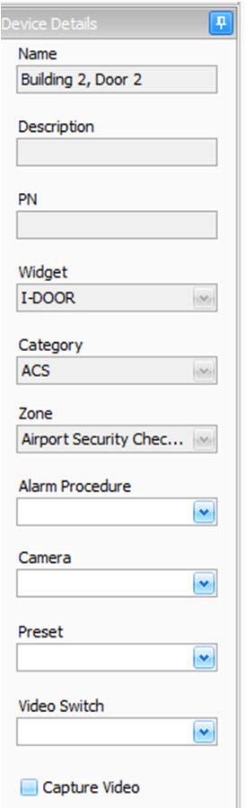

Note: Using the drop-down lists provided for the parameters at the bottom of the *Device Details* pane,
the user can attach an *Alarm Procedure*, *Camera*, or *Preset* to the device point and/or switch the video
view to the point. The user also can set the system to capture a recorded video when an alarm occurs
at the point by clicking the *Capture Video* checkbox.

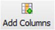

The
button at the top of the *Device* window enables the user to add more information to the
displayed list of devices. Clicking this button calls up a list of additional column options that can be
selected and added to the grid.

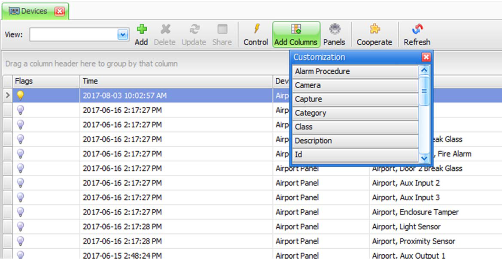

Note: columns can be dragged left or right to change their location in the grid and can be filtered to
show only the information most relevant to the user (see section 1.2.5 GRID CONTROLS).

Clicking the
button will update the device list to include the latest changes to the system that
have occurred since the *Devices* window was opened.

## 3.2 ISSUING COMMANDS TO DEVICES

Using the *Devices* window, you can issue commands to the various access points in the system when
needed. For example, if the access point is a door, you can directly control its operation in response to
a live situation. For example, you can lock or unlock the door when a registered person has forgotten
his/her card or to allow an approved visitor inside the building.

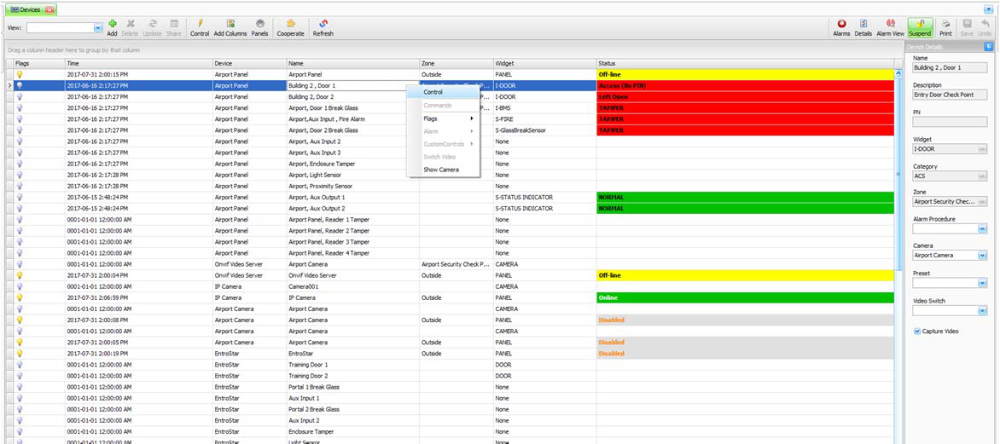

To issue a command, click on an alarm point or device to select it and right-click to open the options
menu. From the list, select *Control* to open up the command menu for the selected point or device.
Note: the list of command options presented will vary depending on the type of point or device
selected.

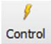

The user can also click the
icon in the upper right of the *Devices* window to open the command
menu for the currently selected device. Alternately, the user can open up the command menu by
double-clicking in the selected device/point row.

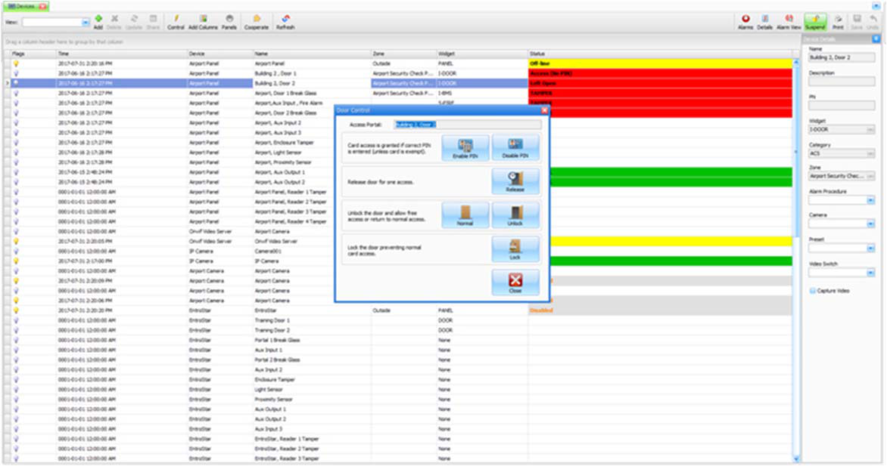

Next, select a command from the presented options to execute the command action.

Once you have completed your commands, you can exit the window by clicking the
button.

## 3.2.1 DOOR COMMANDS

When issuing a command for a *Door*, the following menu options will be available:

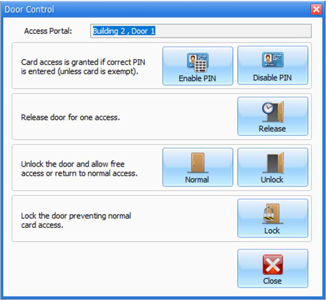

## Name

## Icon

## Description

*Releases* the access point from a forced state.

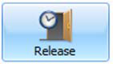

Release

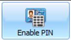

*Enables* that a *PIN* is required for the access point.
Enable PIN
*Disables* that a *PIN* is required for the access point.

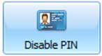

Disable PIN
*Locks* the access point until it is released.

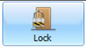

Lock
Returns the access point to *Normal* operating status.

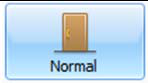

Normal

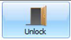

*Unlocks* the access point until the operator issues the *Lock* or
Unlock
*Normal* command.

## 3.2.2 BREAK GLASS COMMANDS

When issuing a command for a *Break* *Glass* point, the following menu options will be available:

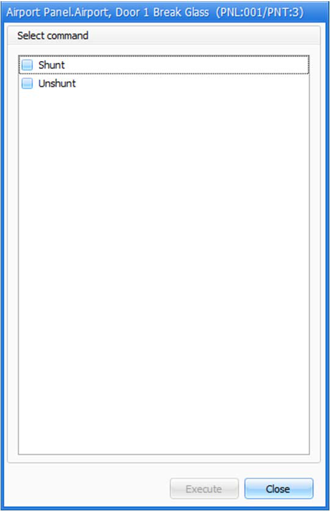

## 3.2.3 PANEL COMMANDS

When issuing a command for a *Panel*, the following menu options will be available:

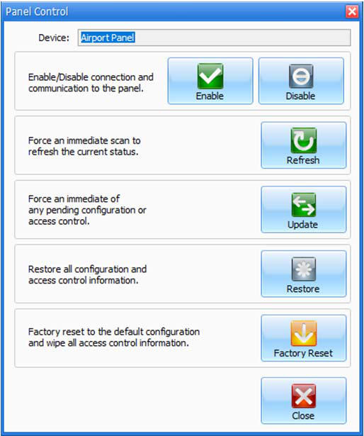

**Name**
**Icon**
**Description**
Enable
*Enables* connection and communication to the panel.

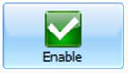

Disable
*Disables* connection and communication to the panel.

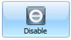

Refresh
Forces an immediate scan to *Refresh* the current status.

Update
Forces an immediate *Update* of any pending configuration or

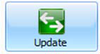

access control.
Restore
*Restores* all configuration and access control information.

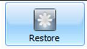

Factory Reset
*Factory resets* to the default configuration and wipes all access

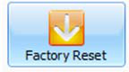

control information.

## 3.3 CREATING/UPDATING A DEVICE VIEW

The *Devices* window can be customized to suit the needs of the user. You can create new views, share
views with other operators, update an existing view, or display details about a zone and access points.
To create a new device *View*, open the *Devices* window and modify the on-screen view, as needed.

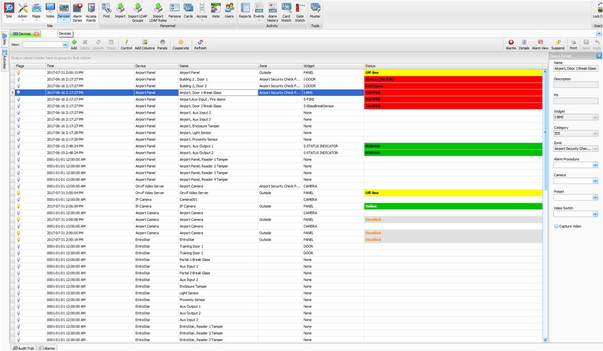

For example, you can group devices by *Device Zone* or any other column parameter to create a new
view. In our example, we will group by device. To group by device, simply click on the *Device* column
header and drag it to the *Drag a column header here to group by that column* area.

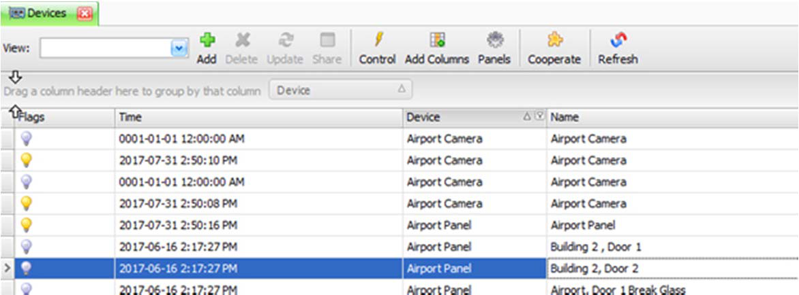

The resulting view will display the information according to device.

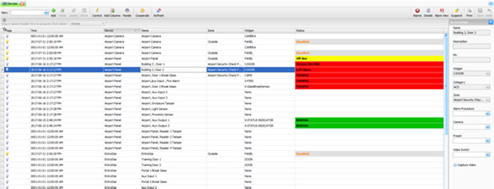

You can also group by multiple column headers at the same time, such as grouping by devices, zones,
and names in the same view. Simply click and drag each column header and drag it to the *Drag a*
*column header here to group by that column* area in succession. The device view will display the
information in a tree format.

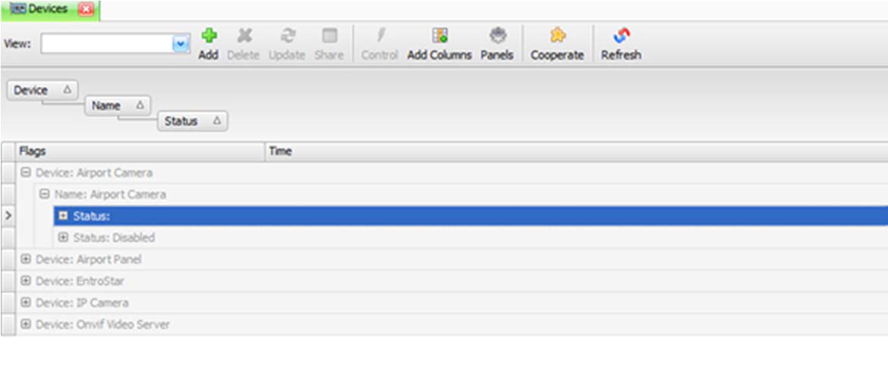

Note: see section 1.2.5 GRID CONTROLS for more details on setting up and modifying your grid.

Once you have configured your device view to suit your needs, the next step is to add the *View* to the
system database.

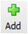

In the top left of the *Devices* window, click the
button. The new *View* will be added with an auto-
generated name.

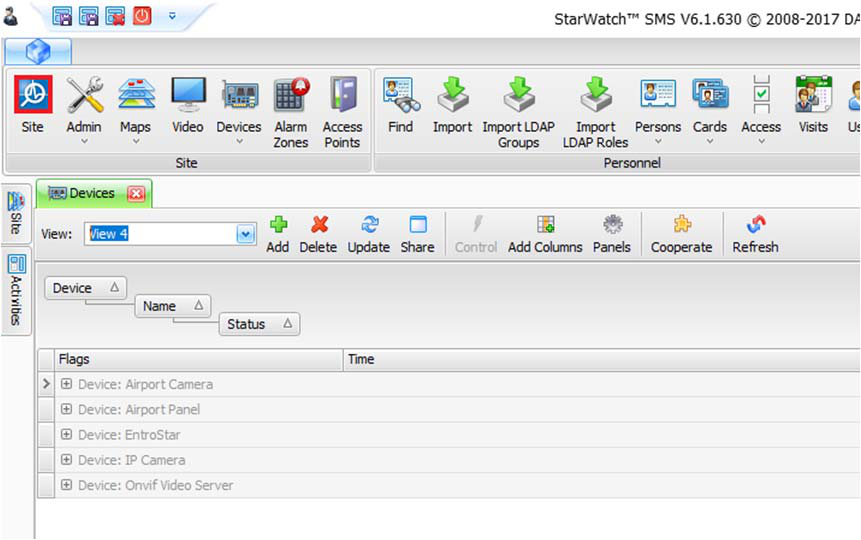

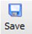

Click the
button to save the *View*.

To rename the *View*, type a new name in the *View* field at the top left of the workspace.

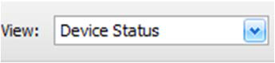

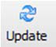

Click the
button to push the name change to the system.

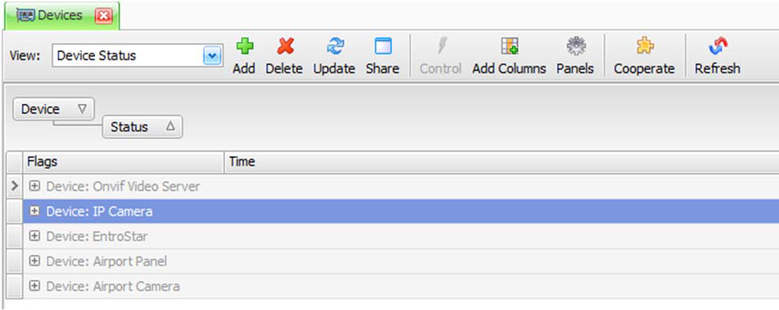

You can update the configuration of a device *View* by calling it to the screen using the *View* drop-down
list provided in the *View* field. Once you have made changes to the on-screen layout, such as moving
columns or grouping by specific categories, you can save it for future use.

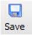

Click the
button to save the modified *View*.

Click the
button to push the layout changes to the system.

## 3.4 DELETING A DEVICE VIEW

To delete a device *View*, call it to the screen using the *View* drop-down list provided in the *View* field.

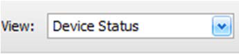

The selected *View* will be displayed.

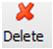

Next, click the
button in the top left of the *Devices* window. The *View* will be permanently
removed from the list.

## 3.5 SHARING A DEVICE VIEW

When you share a device view, you are sharing it globally with any other system users.
To share a device *View* with other operators, call it to the screen using the *View* drop-down list
provided in the *View* field.

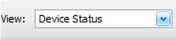

The selected *View* will be displayed.

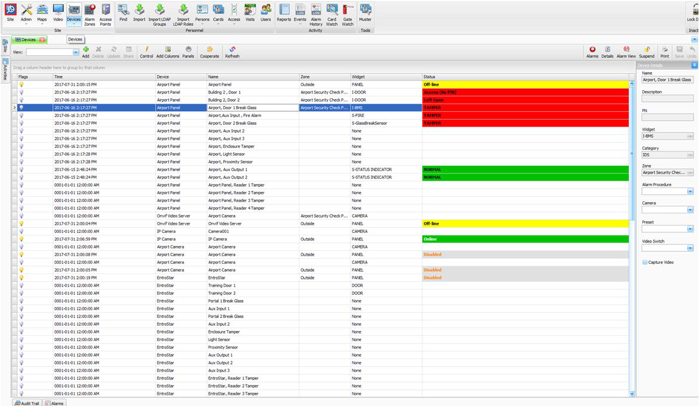

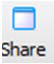

Next, click the
button in the top left of the *Devices* window. The icon will turn green
to
indicate that this *View* has been shared with other users.

---

*© DAQ Electronics, LLC*
