# RPI Configuration

## 1.0 RPI CONFIGURATION

## 1.1 LOGGING INTO SITE BUILDER

RPI configuration is accomplished using the *Site Builder* application. To access *Site Builder*, double-
click on the *Site Builder* icon on the computer desktop if you created a shortcut during installation.

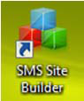

Alternately, click the Windows *Start* menu, select *All Programs*, and select the DAQ Electronics folder
from the displayed list. From the sub-list of DAQ Electronics installed applications, click the *Site*
*Builder* option.

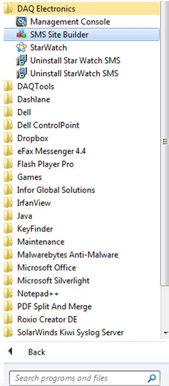

After the *Site Builder* application has been launched, the login screen will appear.

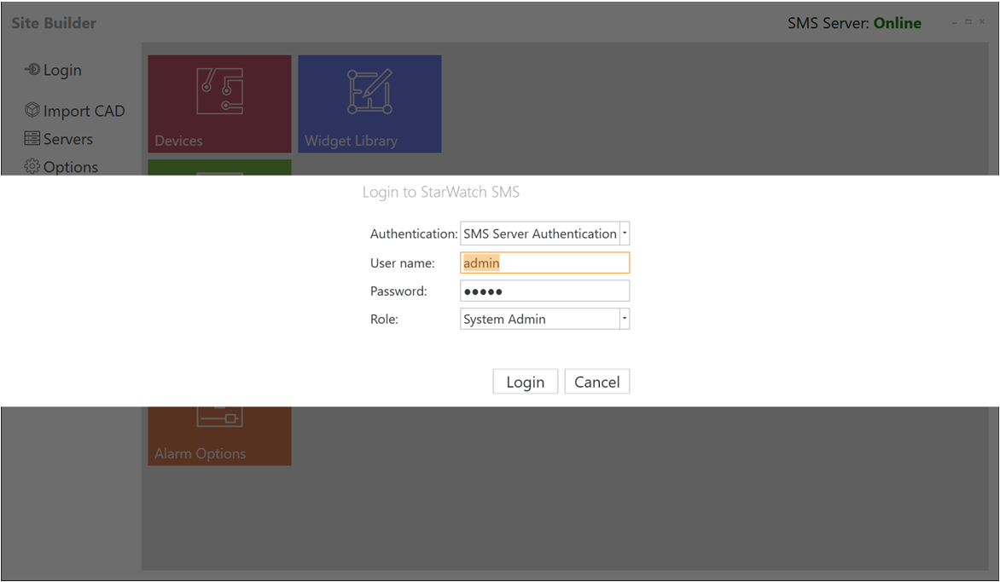

After filling in the associated username/password and role combination, click the *Login* button to
connect to the system database. If you do not know the correct login settings for your system, see your
Systems Administrator for password and roles information.
The initial default settings for administrators are as follows:

*Username*
admin

*Password*
admin

*Role*
System Administrator
Note: these settings can and should be changed before fielding a live system.

## 1.2 ADDING THE RPI DRIVER

When you first launch *Site Builder*, the RPI driver and application are not visible on the main screen.
To add an RPI driver to the list of application tiles, complete the following steps:

### Step 1:

From the menu on the left side of the screen, select *Options*.

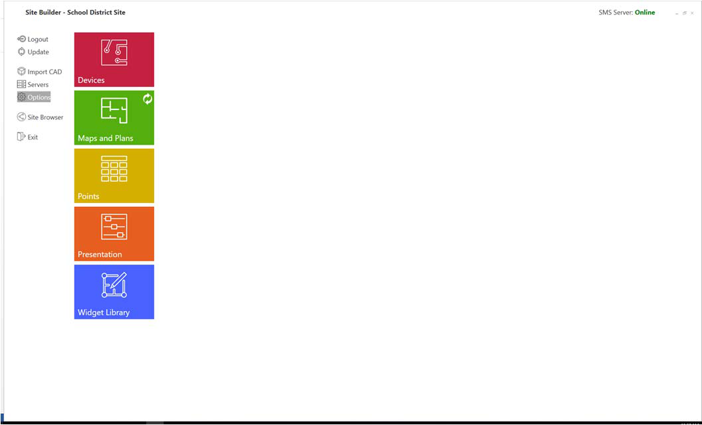

### Step 2:

From the *Options* pop-up window, select the *Support for StarGate III Panels* checkbox and

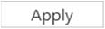

click the
button.

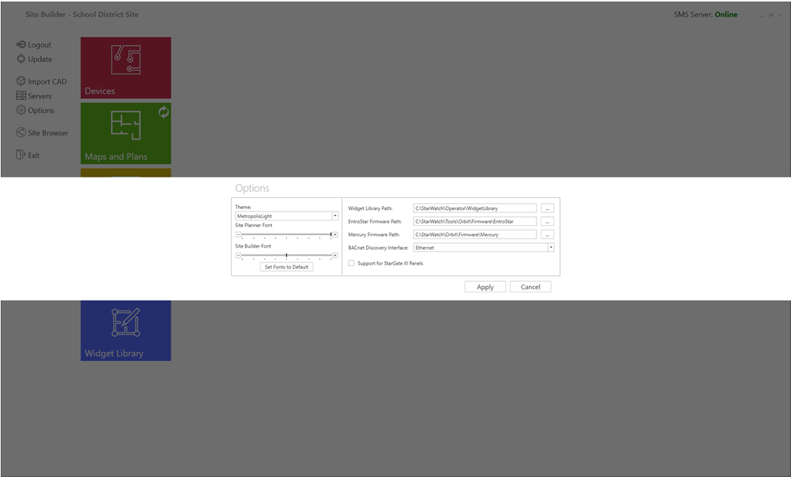

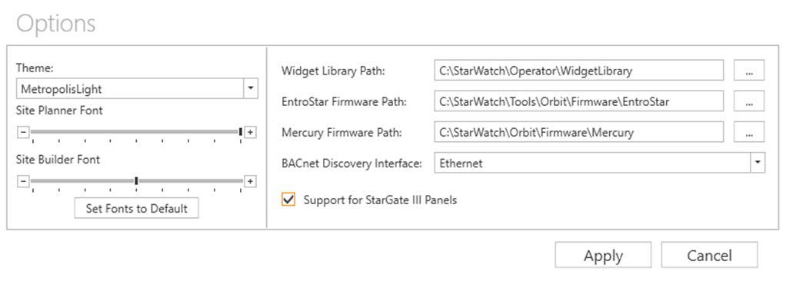

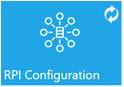

A light blue *RPI Configuration* tile
will be added to the list of tools and
applications available on the main *Site Builder* screen.

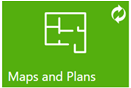

### Step 3:

Click the green *Maps and Plans* tile
to call up the site plan creation/editing
screen.

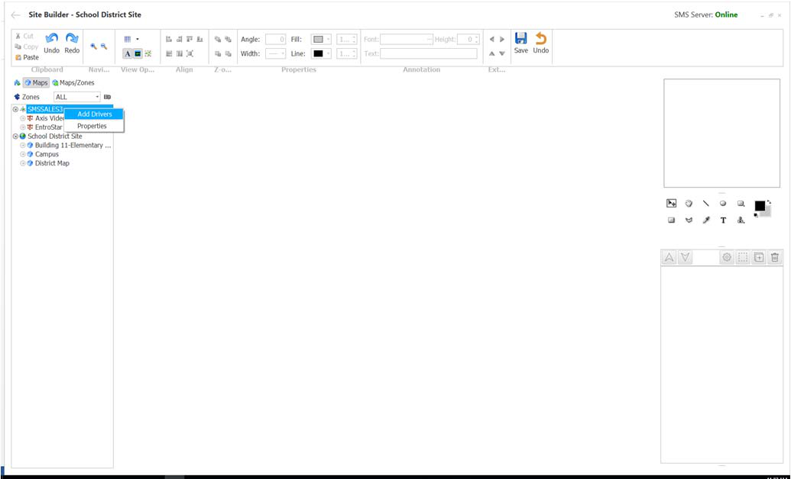

### Step 4:

In the *Navigator* pane to the left of the screen, expand the *Tree* showing the system panels,
devices, and drivers.

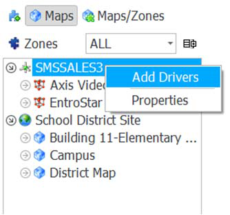

### Step 5:

Right-click on the appropriate system name and select the *Add Drivers* option.

### Step 6:

From the *Add Drivers* pop-up window, select the *RPI Driver* checkbox and click the
button.

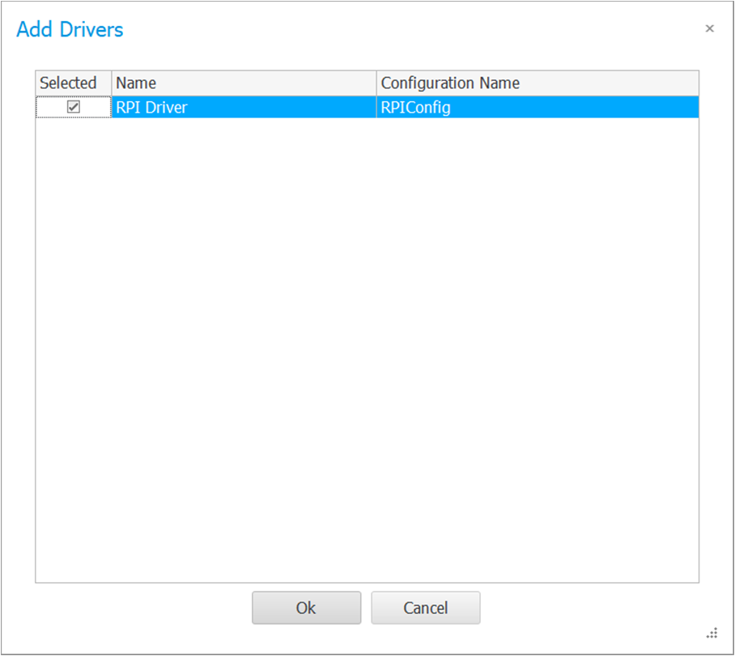

An *RPI Driver (RPIConfig)* line will be added to the system *Tree*.

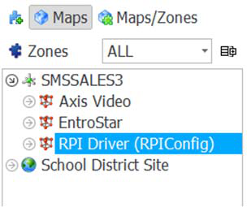

## 1.3 CONFIGURING RPI PANELS

*Panels* refer to the hardware panels that are installed on your site. *Panels* communicate with security
hardware entities and notify the *StarWatch SMS* server and operator applications of system alarms.
Within the *Site Builder* application, you can:

Add a new *Panel* to the site

Rename a *Panel*

Create a *Template* from an existing *Panel* in your system or import from a folder with
saved *Templates* from another system

Add a new *Panel* based on a template

Delete a *Panel*
To begin *Panel* configuration, complete the following steps:

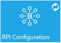

### Step 1:

From the main *Site Builder* screen, click the light blue *RPI Configuration* tile
.

### Step 2:

From the RPI configuration screen, select the RPI driver in the *Configuration* pane to the left
of the screen to open the RPI editor area.

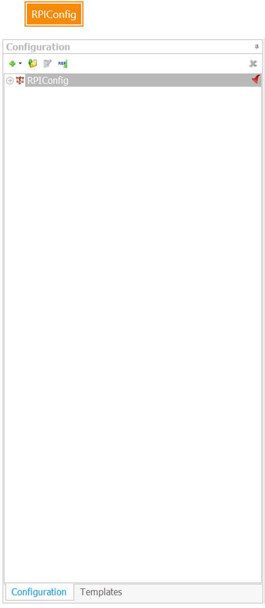

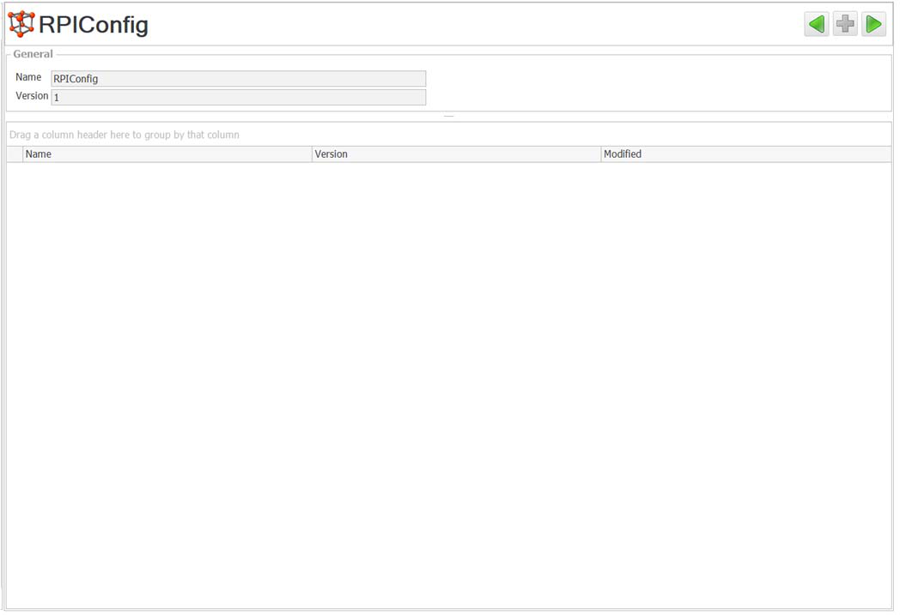

The editor displays the current device driver settings, which cannot be modified.

## 1.3.1 ADDING A PANEL

Note: after adding a new *Panel*, you must add hardware *Items*, which consist of alarm points, doors,
alarm zones, etc.
To add a *Panel* to the RPI device driver, complete the following steps:

### Step 1:

In the *Configuration* pane, select the *RPIConfig* device driver from the system *Tree*. The RPI
editor area will populate the main workspace.

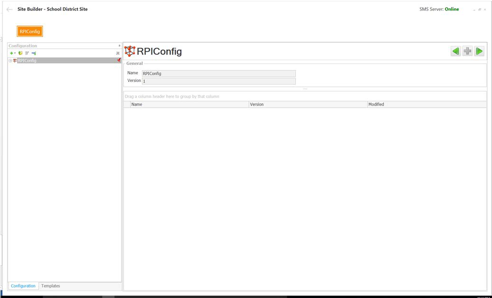

### Step 2:

Right-click on the *RPIConfig* driver and select *Add Panel* from the menu options.

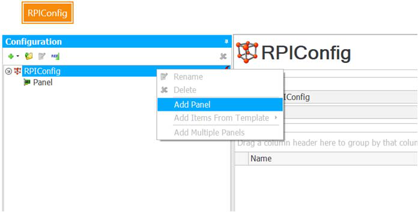

A new *Panel* will be added to the configuration.

### Step 3:

To view the details of a new or existing *Panel*, expand the view for the *RPIConfig* driver by

clicking on the associated
arrow and double-click on the *Panel* in the system *Tree*. The
setup configuration window corresponding with the selected *Panel* will appear in the
workspace.

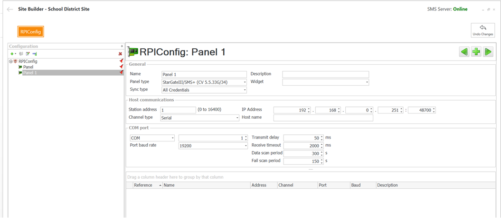

### Step 4:

Once a *Panel* has been added/selected, complete the provided configuration fields to suit
your specific site.

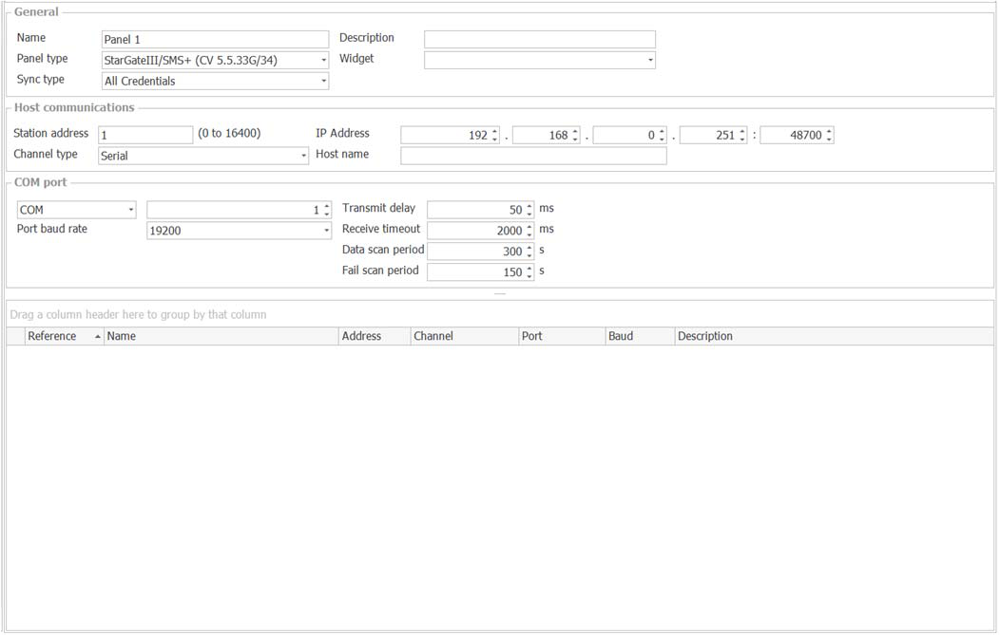

**Group**
**Name**
**Description**
**Default**
General
Name
Sets the *Name* of the panel
Panel *<n>* where *<n>*
increments with each
additional panel
(Blank)
Description
Sets a brief text *Description*
of the panel
Panel
Widget
Specifies the type of *Widget*
used for the graphical site
map

Panel Type
Sets the *Type* of panel
StarGateIII/SMS+
(CV5.5.33G/34)

StarGate III/ SMS
Sync Type
Drop-down menu to select the
All credentials
*Sync* type

All credentials

Permitted credentials

Important credentials

Permitted and
important credentials

Credentials on
demand
Host
Station Address
Sets the *Address* of the panel
1
Communications
that is used to communicate
(all panels on the same serial
link must have a different
address)
IP Address
Sets the *IP Address* of the
192.168.0.251:48700
panel
Channel Type
Sets the *Type* of
Serial
communications or protocols
used to communicate with the
panel
Host Name
Sets the *Host Name*
(Blank)
COM Port
Port Type
Sets the *Port Definition* to
COM
Definition
either none or COM
Port Baud Rate
Sets the *Baud Rate* of the COM
19200
port
50 ms
Transmit Delay
Sets the *Transmit Delay*
interval in milliseconds
Receive
Sets the *Timeout* interval in
2000 ms
Timeout
milliseconds for receiving
transmissions
Data Scan
Sets the *Period* in seconds for
300 s
Period
data scanning
Fail Scan
Sets the *Period* in seconds for
150 s
Period
scan failures

### Step 5:

Once the panel has been configured, the changes must be saved to the system database.
Click the arrow
at the top left of the screen to return to the main *Site Builder* screen.

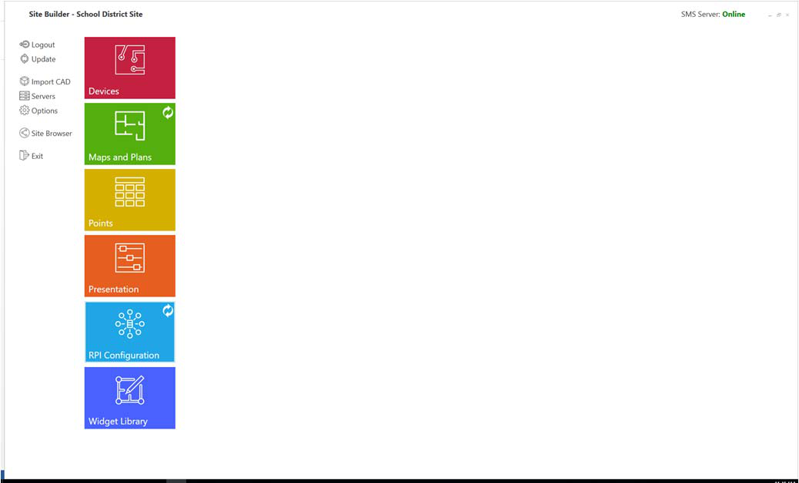

### Step 6:

Next, from the menu on the left side of the screen, select *Update*. The new *Panel* will be
saved to the database.
Note: more than one *Panel* can be added to a driver if the *Panel* is using that specific hardware.

## 1.3.2 RENAMING A PANEL

To rename an existing *Panel*, complete the following steps:

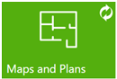

### Step 1:

From the main *Site Builder* screen, click the green *Maps and Plans* tile
.

The site plan creation/editing screen will be called up.

### Step 2:

In the *Configuration* pane, expand the view for the *RPIConfig* driver in the system *Tree* by

clicking on the associated
arrow then right-click on the appropriate *Panel*.

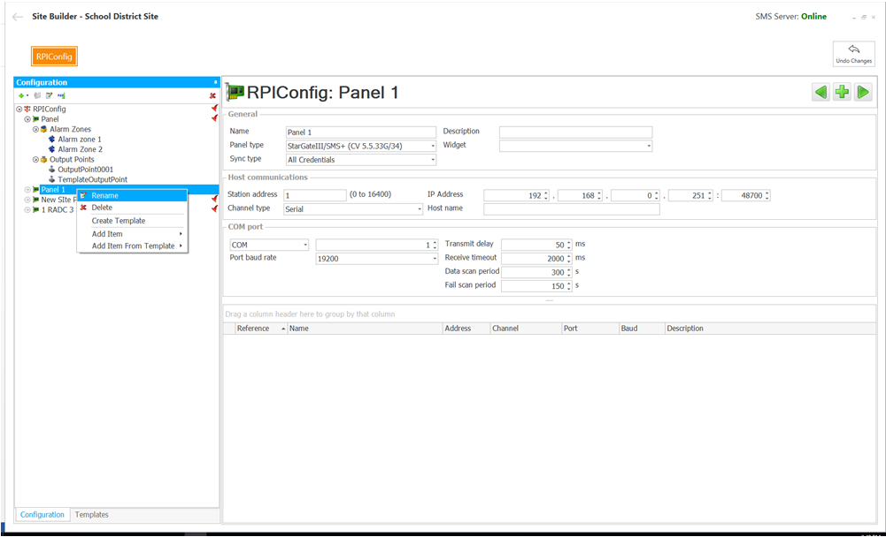

### Step 3:

Select *Rename* from the pop-up menu.

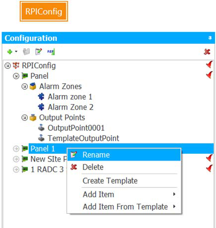

The name of the *Panel* will become highlighted in dark blue.

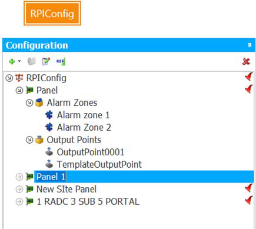

### Step 4:

Type in a new name for the *Panel* and then click anywhere else on the screen.

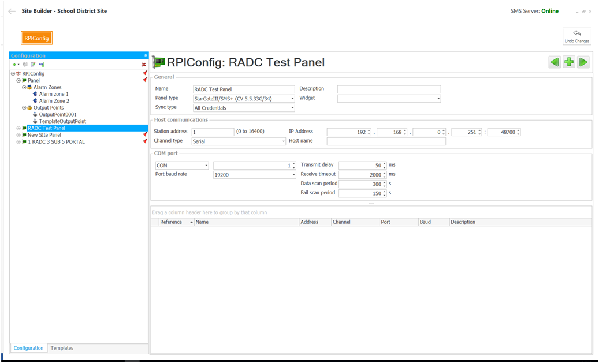

The new name will be reflected in the system *Tree* and in the configuration area of the
workspace.
Note: you can also change the name of a *Panel* by typing into the *Name* field in the configuration area.

### Step 5:

Once you have completed any required name modifications, the changes must be saved to
the system database. Click the arrow
at the top left of the screen to return to the main

*Site Builder* screen.

### Step 6:

Next, from the menu on the left side of the screen, select *Update*. The new *Panel* names
will be saved to the database.

## 1.3.3 ADDING ITEMS TO A PANEL

Once a *Panel* has been added to the RPI device driver, you can add hardware *Items* to the *Panel*. The
types of *Items* that can be added are:

*Access Portals*

*Alarm Points*

*Alarm Zones*

*Output Points*

*Status Points*

*Ternary Points*
Note: There can be only one *Alarm Zone* added per *Panel*. For larger sites, a *Panel* can have *Sub-*
*Panels*. The number of *Panels/Sub-Panels* and *Alarm Zones* in your site depends on how large your site
is and how secure a particular area must be. For example, one *Panel* and one *Alarm Zone* can typically
be used for a small office environment. A larger office with a room that must be secured apart from
other areas, such as a laboratory or safe deposit box room, would require more than one *Alarm Zone*.

To add an *Item* to a *Panel*, complete the following steps:

### Step 1:

From the main *Site Builder* screen, click the green *Maps and Plans* tile
.

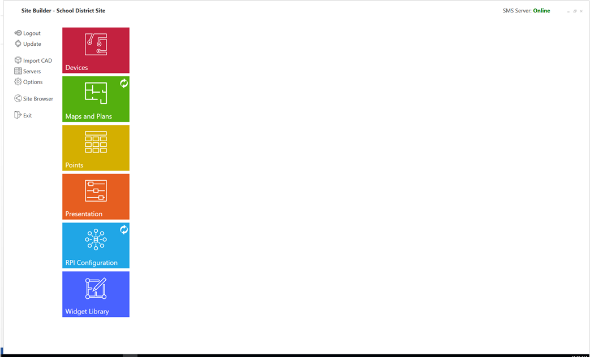

The site plan creation/editing screen will be called up.

### Step 2:

In the *Configuration* pane, expand the view for the *RPIConfig* driver in the system *Tree* by

clicking on the associated
arrow then right-click on the appropriate *Panel*.

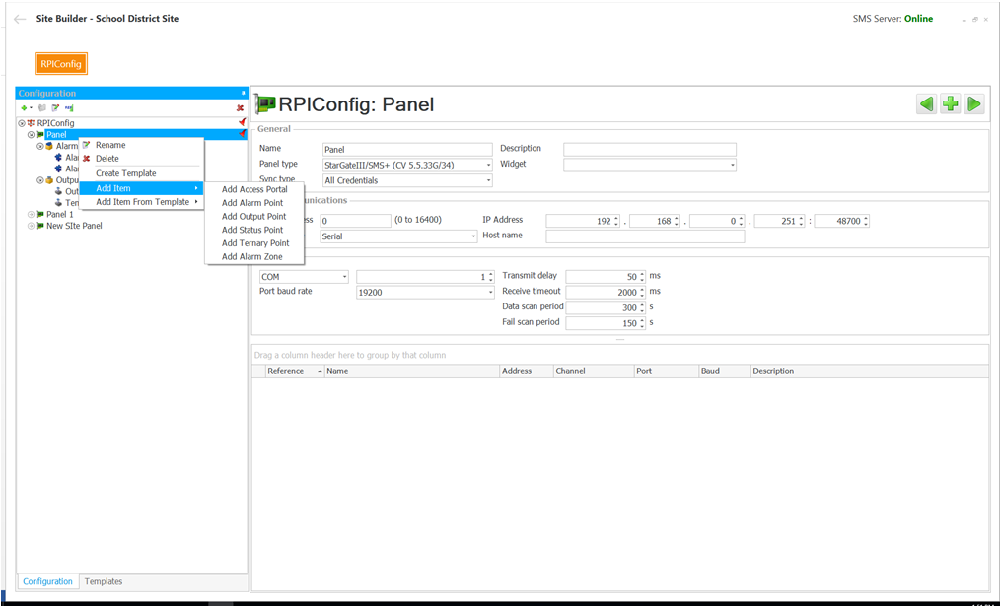

### Step 3:

Select *Add Item* from the pop-up menu then select the appropriate *Item* from the secondary
pop-up menu.

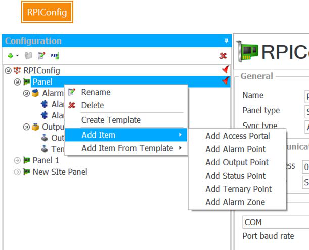

The *Item* will be added to the *Panel*.

### Step 4:

Repeat the process to add other *Items*, as needed.

### Step 5:

Once you have added any required *Items* to the *Panel*, the changes must be saved to the
system database. Click the arrow
at the top left of the screen to return to the main *Site*

*Builder* screen.

### Step 6:

Next, from the menu on the left side of the screen, select *Update*. The new *Items* will be
saved to the database.

## 1.3.4 CREATING A TEMPLATE FROM AN EXISTING PANEL/ITEM

Within *Site Builder*, you have the ability to create *Templates* from existing *Panels* or *Items* and use
them in other configurations. *Template* files are portable, meaning they can be moved and shared
between computers and systems.
To create a *Template* from an existing *Panel*, complete the following steps:

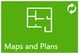

### Step 1:

From the main *Site Builder* screen, click the green *Maps and Plans* tile
.

The site plan creation/editing screen will be called up.

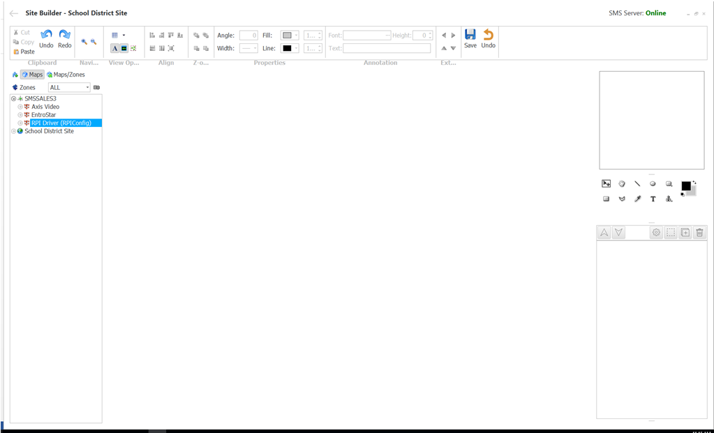

### Step 2:

In the *Configuration* pane, expand the view for the *RPIConfig* driver in the system *Tree* by

clicking on the associated
arrow then right-click on the appropriate *Panel*.

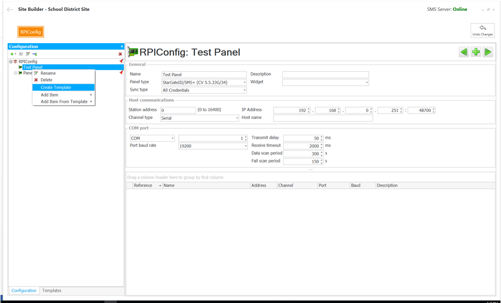

### Step 3:

Select *Create Template* from the pop-up menu.

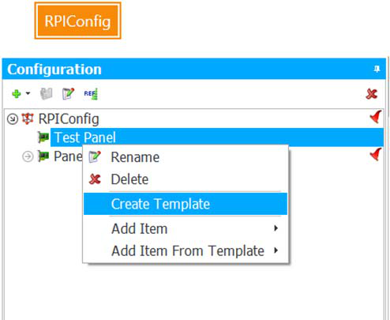

The *Panel* is saved as a *Template* and added to the *Template* list that is displayed when you
create a new *Panel* from a *Template*.

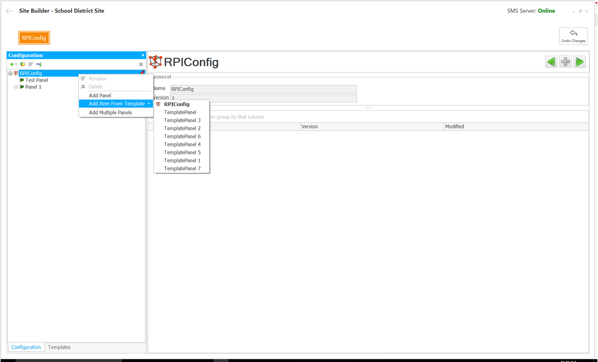

### Step 4:

Once you have created any required *Templates*, the changes must be saved to the system
database. Click the arrow
at the top left of the screen to return to the main *Site Builder*

screen.

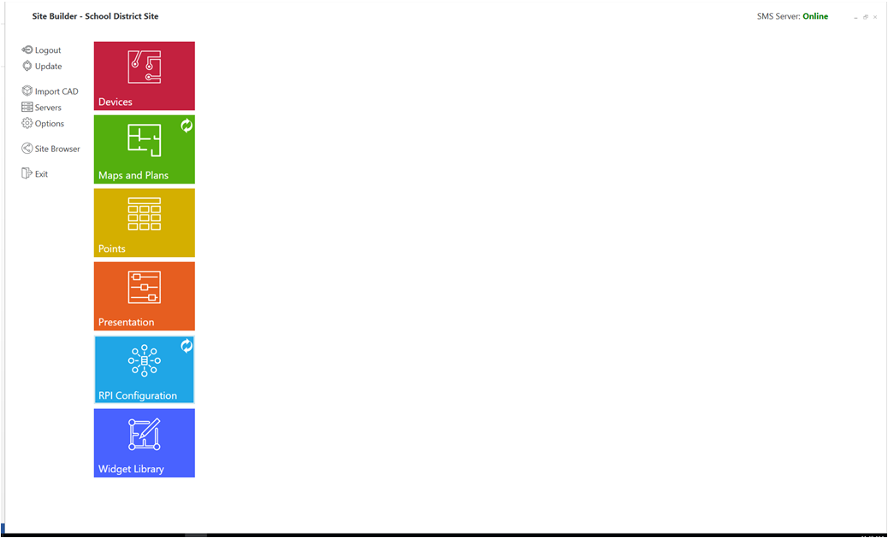

### Step 5:

Next, from the menu on the left side of the screen, select *Update*. The new *Templates* will
be saved to the database.

You can also create *Templates* for *Items*, such as *Access Portals*, *Alarm Points*, *Output Points*, *Alarm*
*Zones* and *Status Points* that have been added in a *Panel* configuration.
To create a *Template* from an existing *Item*, complete the following steps:

### Step 1:

From the main *Site Builder* screen, click the green *Maps and Plans* tile
.

The site plan creation/editing screen will be called up.

### Step 2:

In the *Configuration* pane, expand the view for the *RPIConfig* driver in the system *Tree* by

clicking on the associated
arrow then expand the view for the appropriate *Panel* in the
same manner.

### Step 3:

Right-click on the appropriate *Item* in the *Tree* and select *Create Template* from the pop-up
menu.

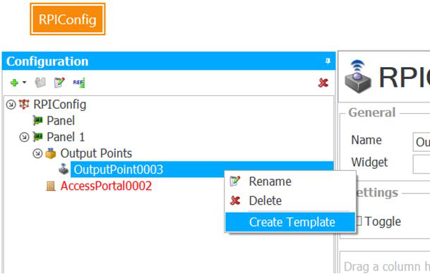

The *Item* is saved as a *Template* and added to the *Template* list that is displayed when you
create a new *Item* from a *Template*.

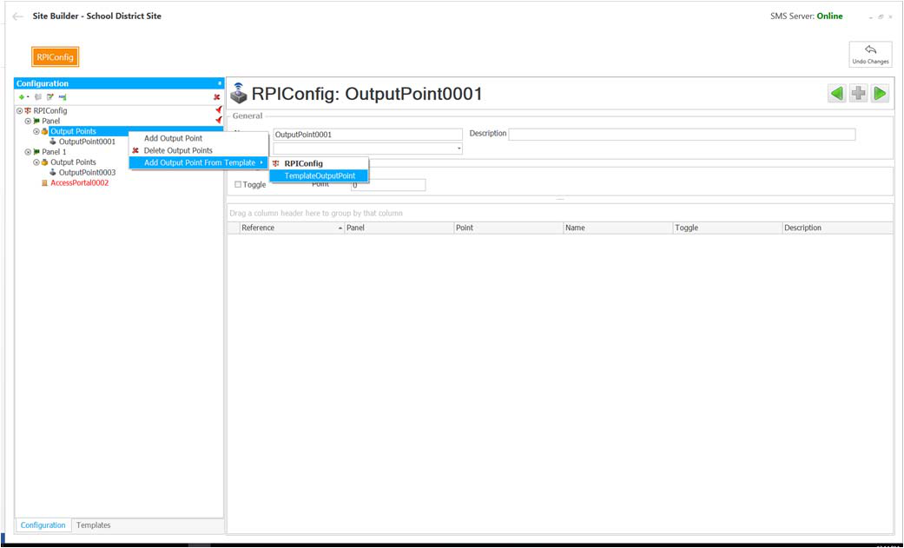

### Step 4:

Once you have created any required *Templates*, the changes must be saved to the system
database. Click the arrow
at the top left of the screen to return to the main *Site Builder*

screen.

### Step 5:

Next, from the menu on the left side of the screen, select *Update*. The new *Templates* will
be saved to the database.

## 1.3.5 ADDING A PANEL FROM A TEMPLATE

If you have previously saved *Panel* configurations as *Template* files, these files can be used to add
identical *Panels* to your site.
Note: an advantage of adding a *Panel* from a *Template* is that any existing sub-entities (*Items*) of the
saved *Panel* configuration are automatically created as well.
To add a *Panel* from a *Template*, complete the following steps:

### Step 1:

From the main *Site Builder* screen, click the green *Maps and Plans* tile
.

The site plan creation/editing screen will be called up.

### Step 2:

In the *Configuration* pane, right-click on the *RPIConfig* driver and select *Add Item From*
*Template* from the pop-up menu.

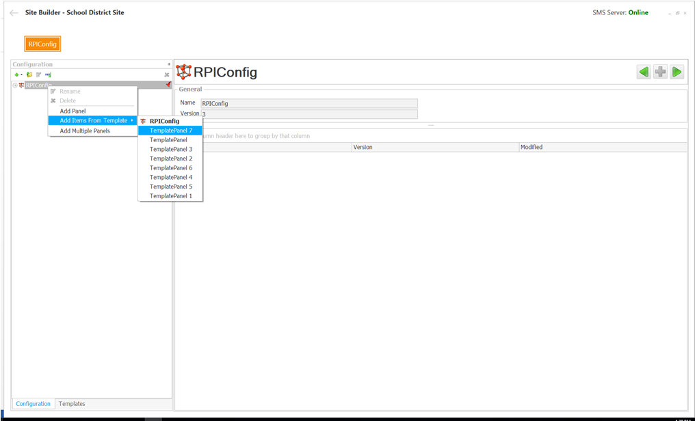

### Step 2:

From the list provided in the secondary pop-up menu, select a *Template* to add to your
configuration.

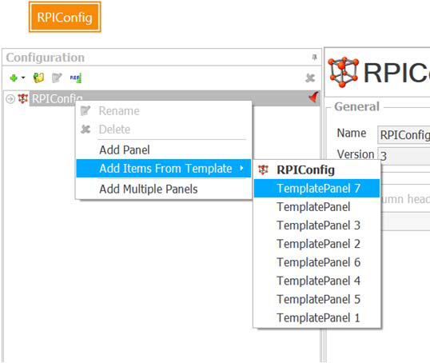

A new *Panel* will be created from the selected *Template*.

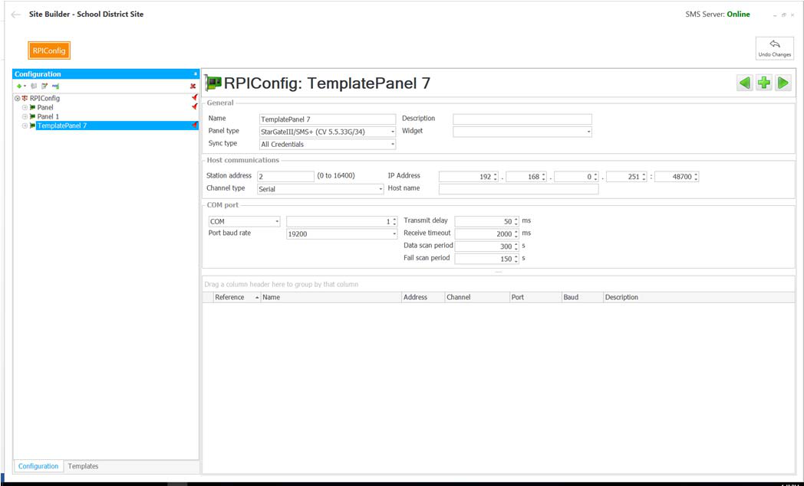

Note: To rename the added *Panel*, right-click on the *Panel* name in the system *Tree* and select the
*Rename* option from the pop-up menu. Next, enter the new name and hit the *Enter* key on your
keyboard.

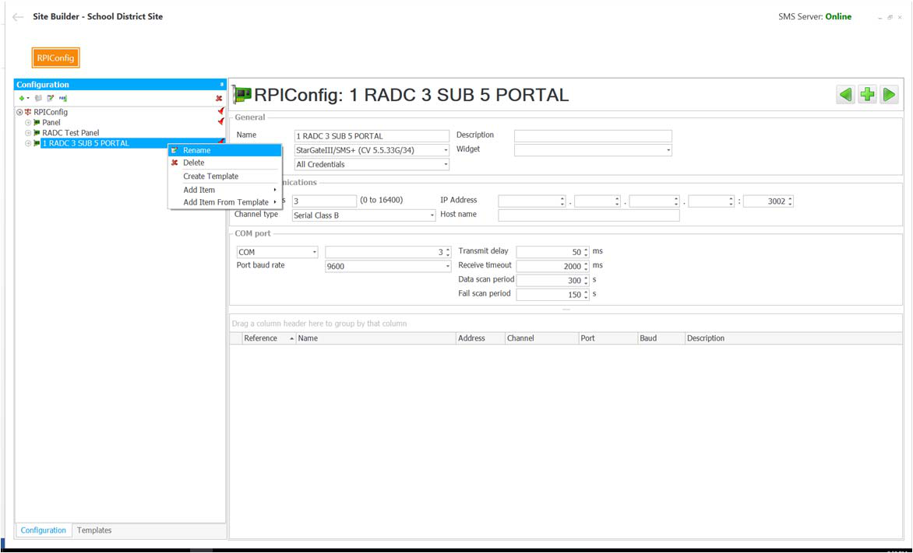

### Step 3:

Once you have added any required *Panels*, the changes must be saved to the system
database. Click the arrow
at the top left of the screen to return to the main *Site Builder*

screen.

### Step 4:

Next, from the menu on the left side of the screen, select *Update*. The new *Panels* will be
saved to the database.

## 1.3.6 ADDING AN ITEM FROM A TEMPLATE

If you have previously saved *Items* as *Template* files, these files can be used to add identical *Items* to
any *Panel* on your site.
To add an *Item* from a *Template*, complete the following steps:

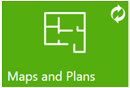

### Step 1:

From the main *Site Builder* screen, click the green *Maps and Plans* tile
.

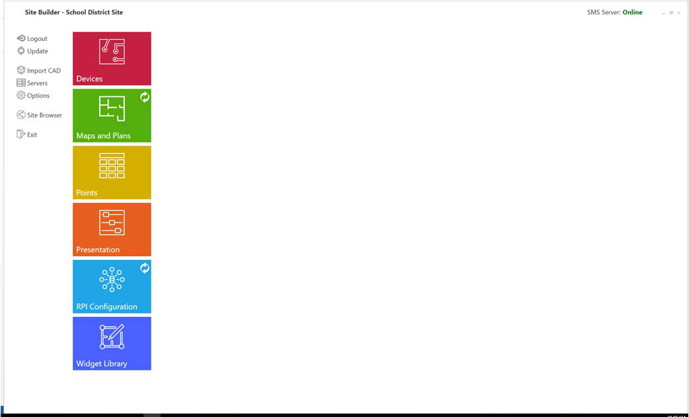

The site plan creation/editing screen will be called up.

### Step 2:

In the *Configuration* pane, expand the view for the *RPIConfig* driver in the system *Tree* by

clicking on the associated
arrow then right-click on the appropriate *Panel*.

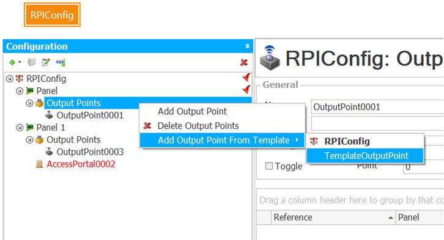

### Step 3:

Select *Add Item From Template* from the pop-up menu then select an *Item* to add to your
*Panel* from the list provided in the secondary pop-up menu.

A new *Item* will be created from the selected *Template*.

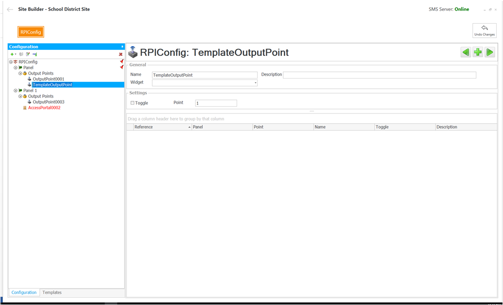

Note: To rename the added *Item*, right-click on the *Item* name in the system *Tree* and select the
*Rename* option from the pop-up menu. Next, enter the new name and hit the *Enter* key on your
keyboard.

### Step 4:

Once you have added any required *Items*, the changes must be saved to the system
database. Click the arrow
at the top left of the screen to return to the main *Site Builder*

screen.

### Step 4:

Next, from the menu on the left side of the screen, select *Update*. The new *Items* will be
saved to the database.

## 1.3.7 IMPORTING A PANEL TEMPLATE FROM ANOTHER SYSTEM

If you have previously saved *Panel* configurations from another system as *Template* files, these files
can be used to add identical *Panels* to your current site.
Note: an advantage of adding a *Panel* from a *Template* is that any existing sub-entities (*Items*) of the
saved *Panel* configuration are automatically created as well.
To import a *Template* from another system, complete the following steps:

### Step 1:

From the main *Site Builder* screen, click the green *Maps and Plans* tile
.

The site plan creation/editing screen will be called up.

### Step 2:

In the *Configuration* pane, click on the *RPIConfig* driver in the system *Tree* to select it.

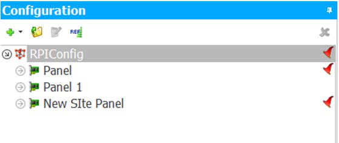

### Step 3:

Next, click the *Add Template From Folder*
icon at the top of the pane.

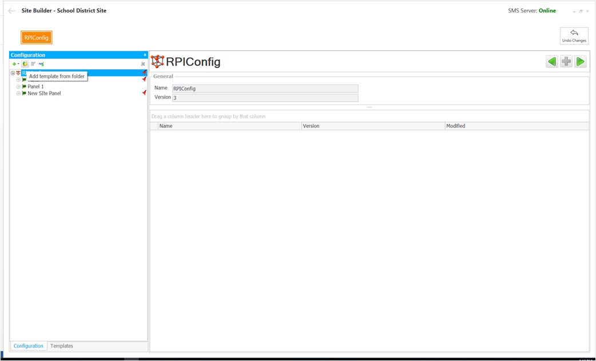

### Step 4:

In the file selection pop-up window, locate the *Template* you would like to add to the
*Template* list in your system and click on it to select it.

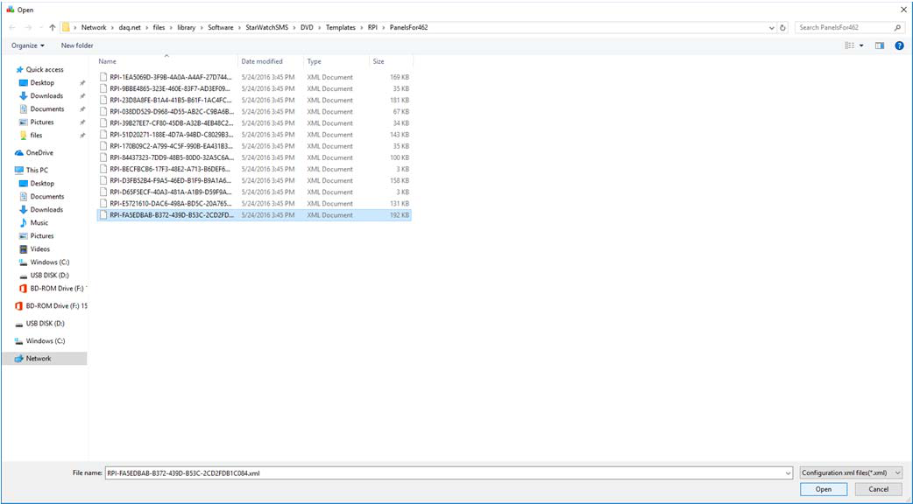

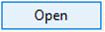

### Step 5:

Click the
button. The selected *Template* will be imported into your system and will
appear in the *Template* list.

### Step 6:

To add the imported *Panel* configuration to your system, right-click on the *RPIConfig* driver
in the system *Tree* and select *Add Items from Template* from the pop-up menu.

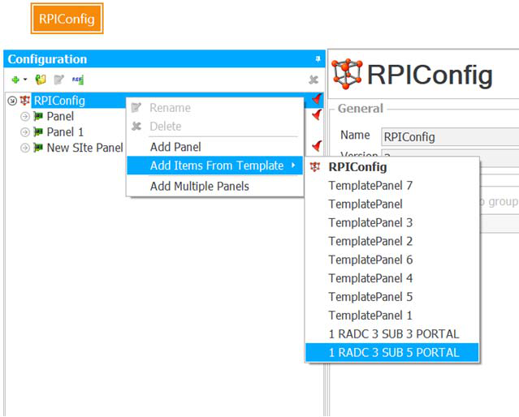

### Step 7:

In the secondary pop-up menu, locate the appropriate *Template* in the list and select it.

### Step 8:

Once you have imported and incorporated any required *Templates*, the changes must be
saved to the system database. Click the arrow
at the top left of the screen to return to

the main *Site Builder* screen.

### Step 9:

Next, from the menu on the left side of the screen, select *Update*. The new configuration
will be saved to the database.

## 1.3.8 DELETING A PANEL

To delete an existing *Panel*, complete the following steps:

### Step 1:

From the main *Site Builder* screen, click the green *Maps and Plans* tile
.

The site plan creation/editing screen will be called up.

### Step 2:

In the *Configuration* pane, expand the view for the *RPIConfig* driver in the system *Tree* by

clicking on the associated
arrow then right-click on the appropriate *Panel*.

### Step 3:

Select *Delete* from the pop-up menu.

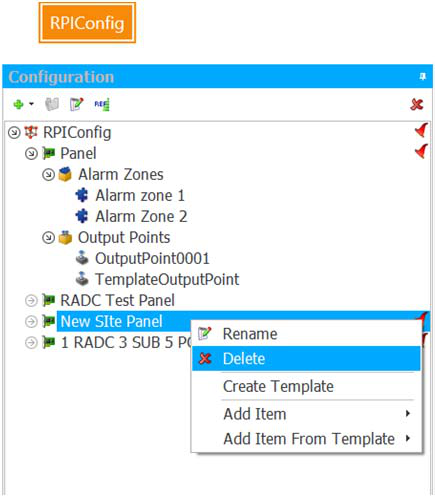

### Step 4:

In the confirmation pop-up window, click the
button.

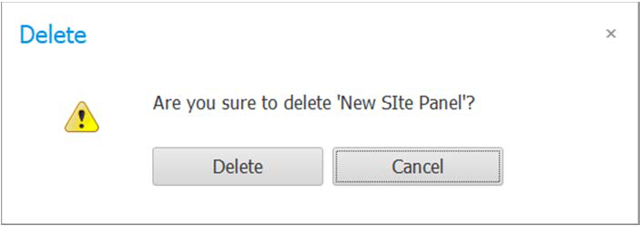

The selected *Panel* will be removed from the system *Tree*.

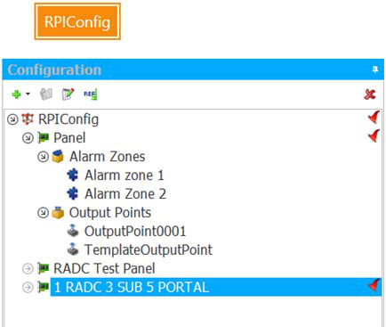

### Step 5:

Once you have completed any required *Panel* deletions, the system modifications must be
saved to the database. Click the arrow
at the top left of the screen to return to the main

*Site Builder* screen.

### Step 6:

Next, from the menu on the left side of the screen, select *Update*. The deletions will be
saved to the database.

---

*© DAQ Electronics, LLC*
